layout:     post
title:      CDC
subtitle:   CDC
date:       2024-11-27
author:     George Lin
header-img: img/post-bg-ios9-web.jpg
catalog: true
tags:
    - Synthesis

# 亚稳态

亚稳态即电路正常工作时，信号值不是稳定的0或1（最关键的是，在“信号被采样”时，不是稳定的0或1）

跨时钟域情形下，亚稳态是不能避免的，但是其影响可以被尽可能消除。

# 两种跨时钟域同步的情形（CLKA --> CLKB）

* 对于某些跨时钟域信号，仅需要保证时钟域B采到的值准确，不需要保证采到时钟域A的每个值
  * 比如异步FIFO中的格雷码计数器，可以采丢一些值，但不能采错
* 对于某些跨时钟域信号，既需要保证时钟域B采到的值准确，也需要保证采到时钟域A的每个值
  * 这种情形下要求带反压，时钟域B还没采到，时钟域A下的值就不许变化（ACK机制）

# 最简单的同步器：Two flip-flop synchronizer

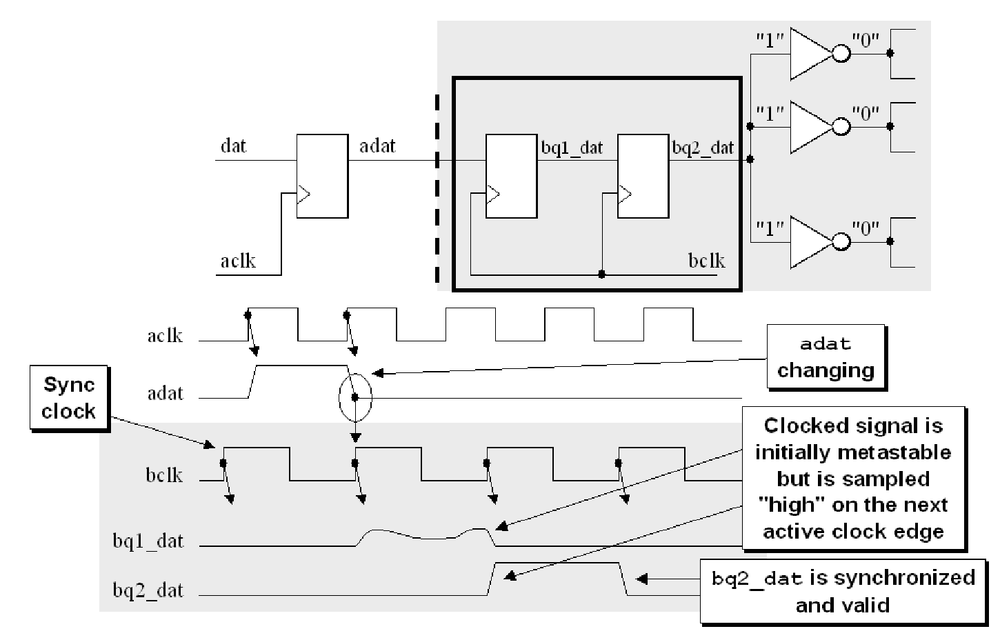

同步器的第一个触发器把aclk域的adat采样到bclk域，等足足一个周期，由第二个触发器采样到稳定、正确的信号给到bclk域的内部模块（其实就是赌一个周期内采样到的信号可以稳定下来）（数据变化的时间离被时钟采样的时间越近，采样到的数据所需的稳定时间越长，two flip-flop synchronizer同步失败的可能性也越高，即MTBF越低）

# MTBF----mean time before failure

MTBF指：信号跨越CDC边界时平均多长时间会出现一个failure

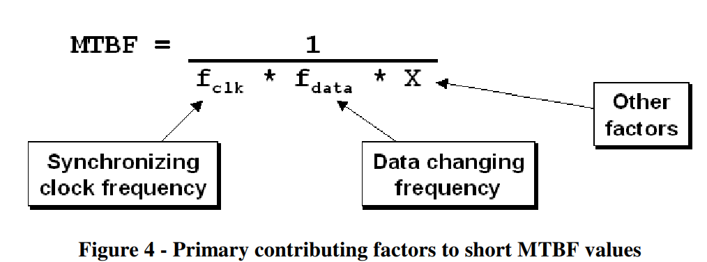

synchronizer的MTBF主要与两个因素有关。一个是bclk时钟的频率，频率越高，MTBF越短；另一个是待采样数据变化的速度，变化速度越快，MTBF越短

--> 高速设计中，MTBF更短

# three flip-flop synchronizer

在超高速设计中，两个flip-flop不够同步，可以选用three flip-flop synchronizer。

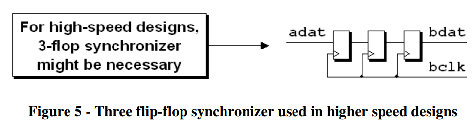

思考：如果数据变化很快，那三个触发器也不管用，因为FF1采样到的数据还没稳定下来，就采样到了变化的数据。如下图。


# 为什么需要在aclk域预先将要CDC的signal给registered一下

因为如果不registered一下，暴露给bclk域的就有可能是不稳定的组合逻辑（即：组合逻辑的输出还没稳定下来， combinational settling process），这样bclk域可能采到不稳定的组合逻辑

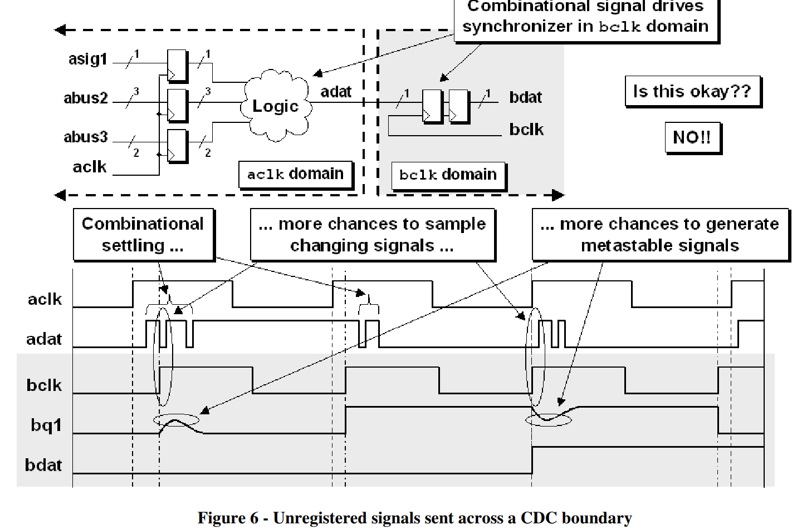

通过在aclk域sync一下要CDC的信号，其实等价于降低了bclk看到的数据变化的频率，也即提高了MTBF

# 快时钟域（aclk） --> 慢时钟域（bclk）的方法（不允许漏采时）

两种办法：

* 开环的方法：无ack，信号保持稳定至少bclk的三个时钟沿（three edge requirement）
  * 优势：比闭环的方法快
  * 劣势：给bclk域的工程设计带来难度(不确定bclk域能采到几个周期的信号)
* 闭环的方法：有ack
  * 优势：稳定，非常安全
  * 劣势：慢

### 问题：为什么信号要保持稳定至少bclk三个时钟沿的时间？

一个时钟沿肯定不行

如果保持稳定两个bclk时钟沿的时间，可能出现：信号两次变化的时间刚好是bclk两次翻转的时间 的状况，从而导致漏采，如下图。

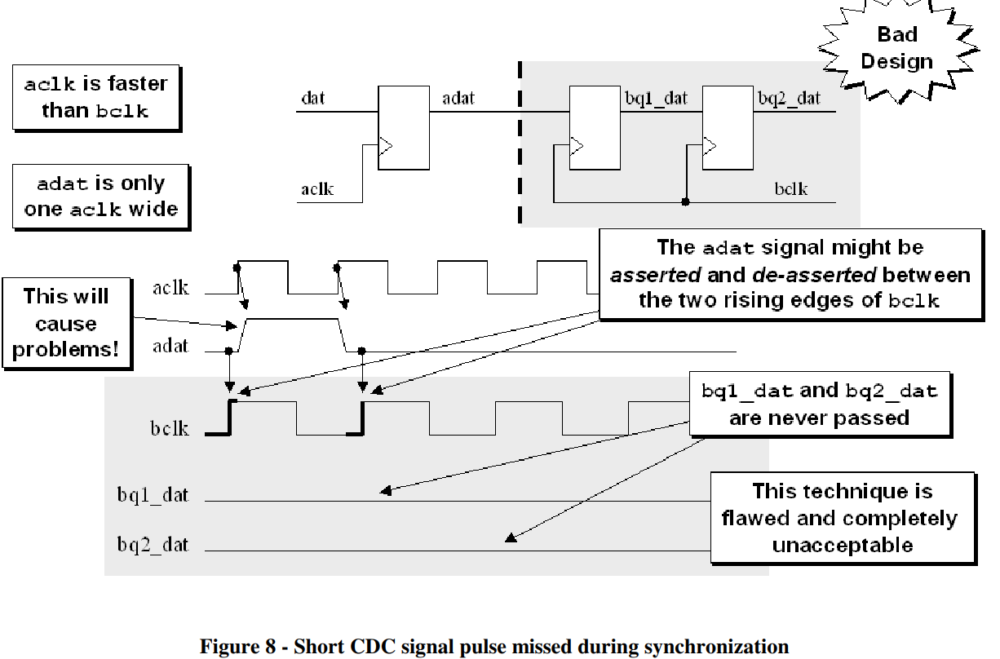

所以最少保持3个时钟沿，比较可靠

### 闭环的方法：有ack

发adat过去，对面收到后原封不动送回来（也就是aclk--> bclk，bclk --> aclk，跨两次时钟域），检测到adat和aq2_dat一致，才允许adat变化

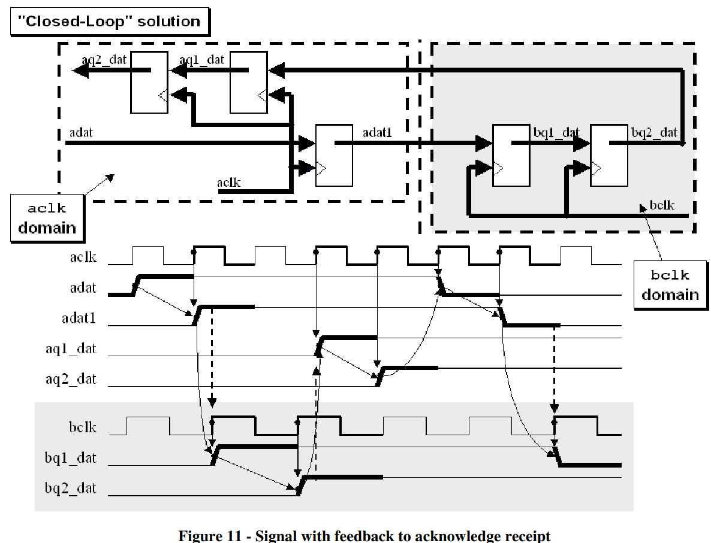

# 多bit跨时钟域会遇到的问题

多比特之间信号不同步，一方面是设计上信号通路的长度不一致；另一方面是工艺的波动。这两方面导致不同比特可能被bclk的不同rising edge或falling edge采到，从而导致bclk域的功能错误。

# 多bit跨时钟域的三种方法

* 多比特合成一比特，然后再跨时钟域
  * aclk域中要跨时钟域的信号能合成则合成：比如aclk时钟域中有信号C和D，bclk时钟域需要C&D，这个时候应该选择在aclk域先合成C&D，再将C&D传送至bclk时钟域
* 多bit数据直传（不加任何fifo），加一位单比特控制位去跨时钟域
* 格雷码传输多bit

# 多bit数据直传，加1位控制位去跨时钟域

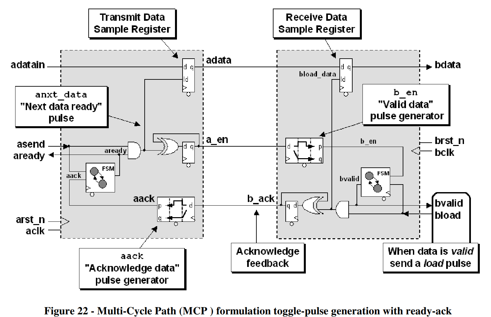

比如要发adatain到右边的时钟域。

在上一笔传输完成之后（aready拉高）之后，与adatain同时到来的asend拉高Transmit Data Sample Register的load，指示adatain可以直传到adata（没有任何fifo）。

bclk域此时不采样adata，就晾在那里，等a_en（电平信号）通过一个pulse generator生成了一个脉冲并且bclk域准备好接收的时候产生bvalid，进而产生bload，将data采样。由此完成data的传输。

（上述这个pulse generator其实就是寄存器打两拍后面再加一个跳变沿检测器（异或门），如下图）

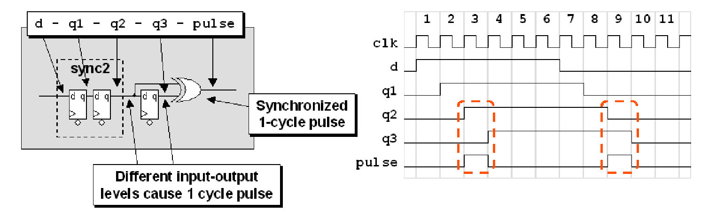

之后bclk域产生back，同样经过一个pulse generator（寄存器打两拍后面再加一个跳变沿检测器（异或门））回到aclk域，经过一个状态机，释放bready，从而允许adatain改变，也就允许了下一笔传输的发生。

这个结构很安全，一方面，给了多bit数据很多个时钟周期去满足跨时钟域的采样要求（让这些数据等使能信号跨完时钟域再走完状态机，很漫长）。另一方面，有ack机制，很安全。

# 格雷码和binary的互转

### 格雷码转二进制

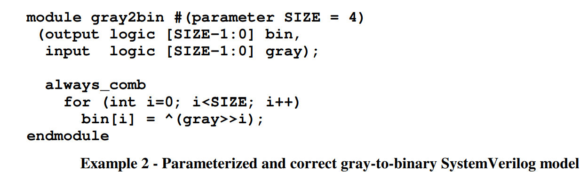

### 二进制转格雷码

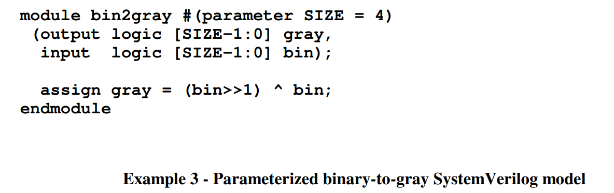

# 异步FIFO

参考知乎

异步FIFO内部的大体框图

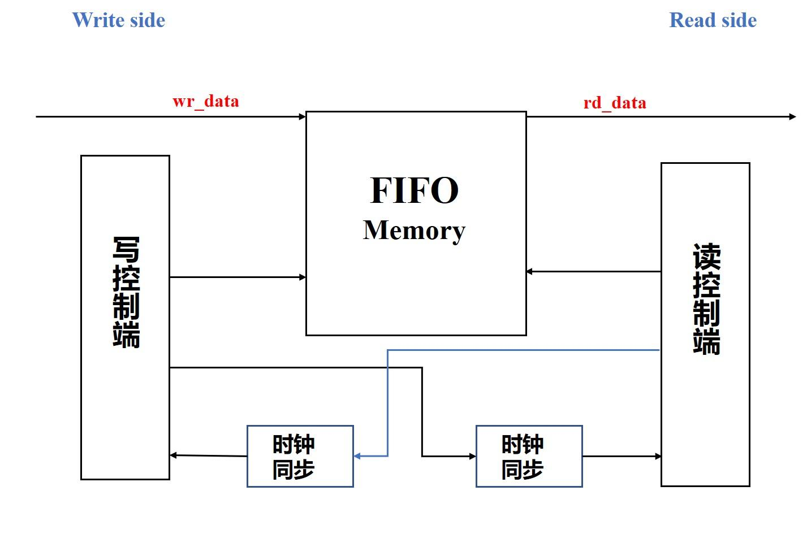

异步FIFO主要由五部分组成：写控制端、读控制端、FIFO Memory和两个时钟同步端

> 写控制端用于判断是否可以写入数据
> 读控制端用于判断是否可以读取数据
> FIFO Memory用于存储数据
> 两个时钟同步端用于将读写时钟进行同步处理

介绍完内部结构，我们在和**基本接口图**做个联动

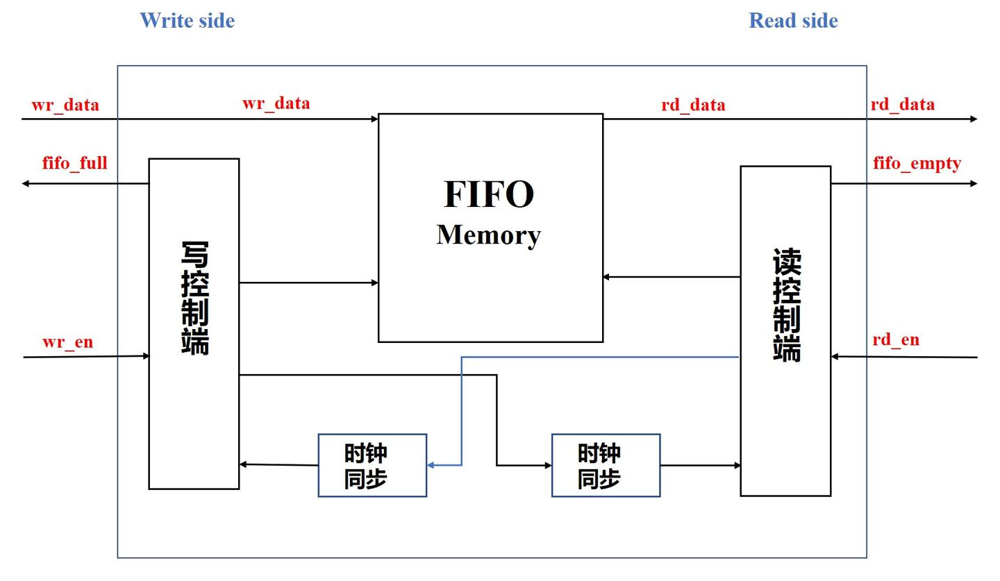

刚才说过，读/写控制端用于判断能否写入/读取数据，判断能否写入/读取数据关键在于：

- 写操作时，写使能有效且FIFO未满
- 读操作时，读使能有效且FIFO未空

因此两个使能信号和空满判断信号都连接到控制端上

最后我们再加上时钟信号和复位信号

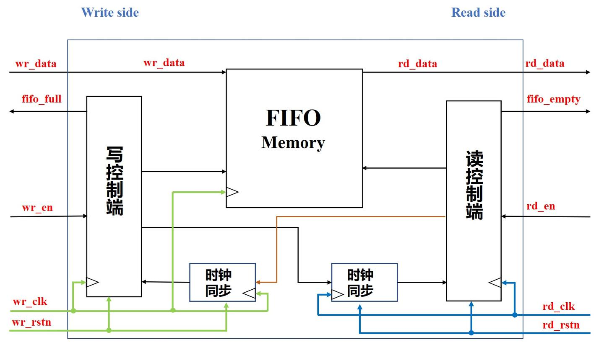

这便是完整的异步FIFO简化框图

## 2 空满判断

在同步FIFO篇中，我们给出了两个判断空满状态的图

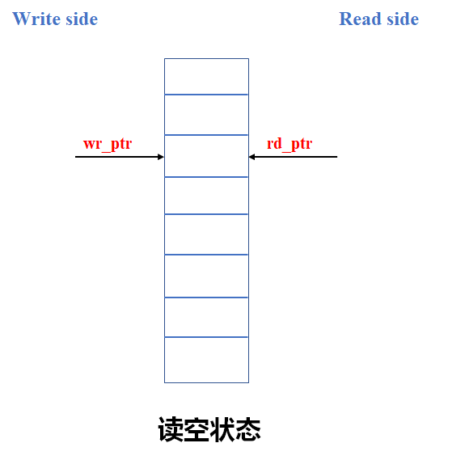

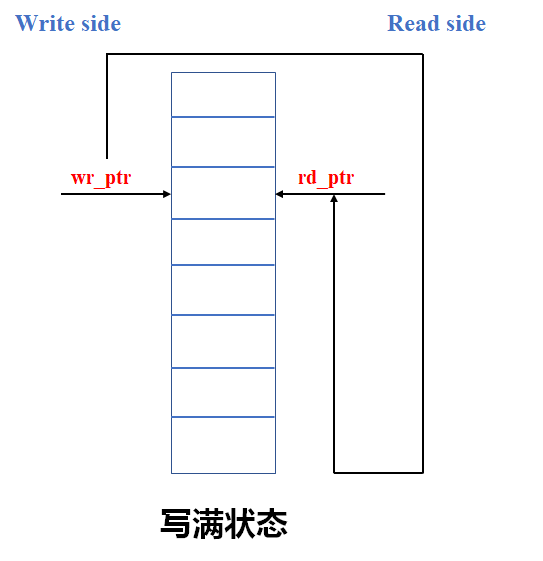

并且也有指出，读空状态可以理解为**读地址指针追上写地址指针**，写满状态可以理解为**写地址指针再次追上读地址指针**

在同步FIFO中，因为读写都是在同一个时钟信号下进行的，因此两个地址指针可以直接进行比较

但在异步FIFO中，读写是在不同的时钟信号下进行的，因此在进行比较之前，应当先进行跨时钟与同步

在时钟同步之前，我们应当先将二进制地址转换为格雷码，因为格雷码相邻的两个状态之间，只有1 bit数据发生翻转

下面给出二进制数与格雷码的对照图

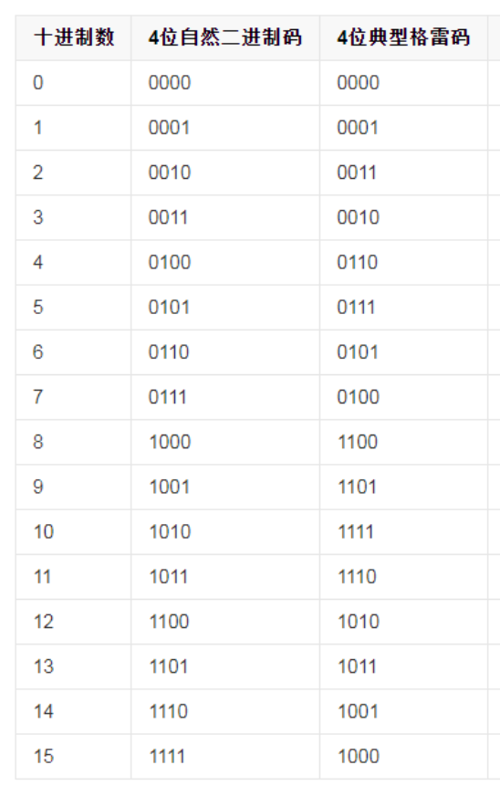

上面也有说到，读指针追上写指针是读空，写指针再次追上读指针是写满，为了便于理解，我们做一个环形图

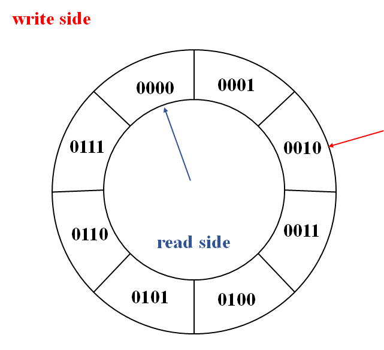

假设内圈为读，外圈为写，`读空时`是读写指针应当指向同一个地址，就像这样

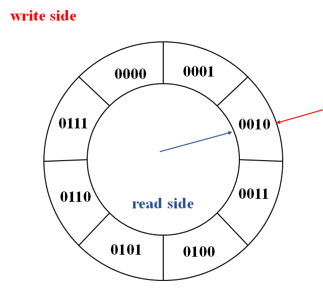

此时，读地址应当和写地址完全相同，就以0010为例，0010的格雷码为0011，可以看出对于读空状态，无论是二进制还是格雷码均是**所有位都相同**

`写满`和读空略有不同，应当是下面这样

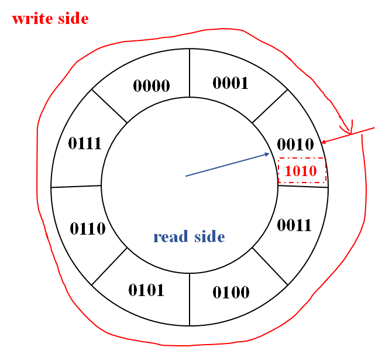

细心的小伙伴应该可以发现，上面在提到写满时，说的是写指针再次追上读指针，也就是说，写满时，写指针比读指针多走一圈，为了便于区分，将地址位宽从3 bit拓宽到4 bit，因此此时的写指针地址可以认为是1010

1010的格雷码是1111， 0010的格雷码是0011，对比两个格雷码是不是可以发现，此时**高两位相反，低两位相同**，这便是`格雷码下`写满的判断条件

Verilog中表示为

```verilog
//写满判断
    always @ (posedge wr_clk or negedge wr_rstn) begin
        if(!wr_rstn)
            fifo_full <= 0;
        else if((wr_ptr_g[$clog2(DEPTH)] != rd_ptr_grr[$clog2(DEPTH)]) && (wr_ptr_g[$clog2(DEPTH) - 1] != rd_ptr_grr[$clog2(DEPTH) - 1]) && (wr_ptr_g[$clog2(DEPTH) - 2 : 0] == rd_ptr_grr[$clog2(DEPTH) - 2 : 0]))
            fifo_full <= 1;
        else
            fifo_full <= 0;
    end

    //读空判断
    always @ (posedge rd_clk or negedge rd_rstn) begin
        if(!rd_rstn)
            fifo_empty <= 0;
        else if(wr_ptr_grr[$clog2(DEPTH) : 0] == rd_ptr_g[$clog2(DEPTH) : 0])
            fifo_empty <= 1;
        else
            fifo_empty <= 0;
    end
```

## 3 时钟同步

在同步FIFO设计中，因为读写指针在同一个时钟下，因此可以直接进行比较

但在异步FIFO中，由于读写指针在不同的时钟下，因此需要将两个地址指针进行时钟同步操作

在异步FIFO中，常用的同步方法是两级同步打拍延迟，同步地址指针的大致过程如下：

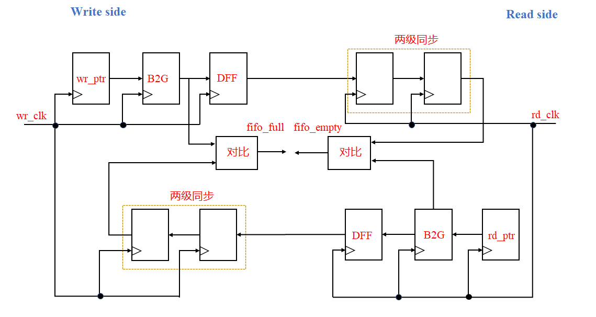

写操作时，先将写地址指针转换成格雷码，然后通过两级同步（两级同步在读时钟下进行），将写地址指针同步到读时钟域下；读操作类似

根据这个过程图，也可以看出空满判断的方式：

1. 写满在写时钟下判断，将写地址指针的格雷码与同步过来的读地址指针格雷码进行比较，符合写满条件，即FIFO`虚满`
2. 读空在读时钟下判断，将读地址指针的格雷码与同步过来的写地址指针格雷码进行比较，符合读空条件，即FIFO`虚空`

留意下，这里我说的是`虚空/满`，并不是输入错误哟，具体解释我放在文章最后，爱思考的朋友现在可以思考一下原因

下面给出时钟同步的Verilog代码

```verilog
assign wr_ptr_g = wr_ptr ^ (wr_ptr >> 1);   //B2G
assign rd_ptr_g = rd_ptr ^ (rd_ptr >> 1);

//写指针同步到读时钟域
always @ (posedge rd_clk or negedge rd_rstn) begin
    if(!rd_rstn) begin
        wr_ptr_gr <= 0; 
        wr_ptr_grr <= 0; 
    end
    else begin
        wr_ptr_gr <= wr_ptr_g; 
        wr_ptr_grr <= wr_ptr_gr;
    end
end

//读指针同步到写时钟域
always @ (posedge wr_clk or negedge wr_rstn) begin
    if(!wr_rstn) begin
        rd_ptr_gr <= 0; 
        rd_ptr_grr <= 0; 
    end
    else begin
        rd_ptr_gr <= rd_ptr_g; 
        rd_ptr_grr <= rd_ptr_gr;
    end
end
```

## 4 异步FIFO设计

下面给出整体Verilog代码

```verilog
module asy_fifo#(
    parameter   WIDTH = 8,
    parameter   DEPTH = 8
)(
    input   [WIDTH - 1 : 0] wr_data,
    input                   wr_clk,
    input                   wr_rstn,
    input                   wr_en,
    input                   rd_clk,
    input                   rd_rstn,
    input                   rd_en,
    output                  fifo_full,
    output                  fifo_empty,
    output  [WIDTH - 1 : 0] rd_data
);
    //定义读写指针
    reg [$clog2(DEPTH) : 0]  wr_ptr, rd_ptr;

    //定义一个宽度为WIDTH，深度为DEPTH的fifo
    reg [WIDTH - 1 : 0] fifo    [DEPTH - 1 : 0];

    //定义读数据
    reg [WIDTH - 1 : 0] rd_data;

    //写操作
    always @ (posedge wr_clk or negedge wr_rstn) begin
        if(!wr_rstn)
            wr_ptr <= 0;
        else if(wr_en && !fifo_full) begin
            fifo[wr_ptr] <= wr_data;
            wr_ptr <= wr_ptr + 1;
        end
        else
            wr_ptr <= wr_ptr;
    end

    //读操作
    always @ (posedge rd_clk or negedge rd_rstn) begin
        if(!rd_rstn) begin
            rd_ptr <= 0;
            rd_data <= 0;
        end
        else if(rd_en && !fifo_empty) begin
            rd_data <= fifo[rd_ptr];
            rd_ptr <= rd_ptr + 1;
        end
        else
            rd_ptr <= rd_ptr;
    end

    //定义读写指针格雷码
    wire [$clog2(DEPTH) : 0] wr_ptr_g;
    wire [$clog2(DEPTH) : 0] rd_ptr_g;

    //读写指针转换成格雷码
    assign wr_ptr_g = wr_ptr ^ (wr_ptr >>> 1);
    assign rd_ptr_g = rd_ptr ^ (rd_ptr >>> 1);


    //定义打拍延迟格雷码
    reg [$clog2(DEPTH) : 0] wr_ptr_gr, wr_ptr_grr;
    reg [$clog2(DEPTH) : 0] rd_ptr_gr, rd_ptr_grr;

    //写指针同步到读时钟域
    always @ (posedge rd_clk or negedge rd_rstn) begin
        if(!rd_rstn) begin
            wr_ptr_gr <= 0;
            wr_ptr_grr <= 0;
        end
        else begin
            wr_ptr_gr <= wr_ptr_g;
            wr_ptr_grr <= wr_ptr_gr;
        end
    end

    //读指针同步到写时钟域
    always @ (posedge wr_clk or negedge wr_rstn) begin
        if(!wr_rstn) begin
            rd_ptr_gr <= 0;
            rd_ptr_grr <= 0;
        end
        else begin
            rd_ptr_gr <= rd_ptr_g;
            rd_ptr_grr <= rd_ptr_gr;
        end
    end

    //声明空满信号数据类型
    reg fifo_full;
    reg fifo_empty;

    //写满判断
    always @ (posedge wr_clk or negedge wr_rstn) begin
        if(!wr_rstn)
            fifo_full <= 0;
        else if((wr_ptr_g[$clog2(DEPTH)] != rd_ptr_grr[$clog2(DEPTH)]) && (wr_ptr_g[$clog2(DEPTH) - 1] != rd_ptr_grr[$clog2(DEPTH) - 1]) && (wr_ptr_g[$clog2(DEPTH) - 2 : 0] == rd_ptr_grr[$clog2(DEPTH) - 2 : 0]))
            fifo_full <= 1;
        else
            fifo_full <= 0;
    end

    //读空判断
    always @ (posedge rd_clk or negedge rd_rstn) begin
        if(!rd_rstn)
            fifo_empty <= 0;
        else if(wr_ptr_grr[$clog2(DEPTH) : 0] == rd_ptr_g[$clog2(DEPTH) : 0])
            fifo_empty <= 1;
        else
            fifo_empty <= 0;
    end
endmodule
```

下面是tb

```verilog
module asy_fifo_tb;
    parameter   width = 8;
    parameter   depth = 8;

    reg wr_clk, wr_en, wr_rstn;
    reg rd_clk, rd_en, rd_rstn;

    reg [width - 1 : 0] wr_data;

    wire fifo_full, fifo_empty;

    wire [width - 1 : 0] rd_data;

    //实例化
        asy_fifo myfifo (
            .wr_clk(wr_clk),
            .rd_clk(rd_clk),
            .wr_rstn(wr_rstn),
            .rd_rstn(rd_rstn),
            .wr_en(wr_en),
            .rd_en(rd_en),
            .wr_data(wr_data),
            .rd_data(rd_data),
            .fifo_empty(fifo_empty),
            .fifo_full(fifo_full)
        );


    //时钟
    initial begin
        rd_clk = 0;
        forever #25 rd_clk = ~rd_clk;
    end

    initial begin
        wr_clk = 0;
        forever #30 wr_clk = ~wr_clk;
    end

    //波形显示
    initial begin
        $fsdbDumpfile("wave.fsdb");
        $fsdbDumpvars(0, myfifo);
        $fsdbDumpon();
    end

    //赋值
    initial begin
        wr_en = 0;
        rd_en = 0;
        wr_rstn = 1;
        rd_rstn = 1;

        #10;
        wr_rstn = 0;
        rd_rstn = 0;

        #20;
        wr_rstn = 1;
        rd_rstn = 1;

        @(negedge wr_clk)
        wr_data = {$random}%30;
        wr_en = 1;

        repeat(7) begin
            @(negedge wr_clk)
            wr_data = {$random}%30;
        end

        @(negedge wr_clk)
        wr_en = 0;

        @(negedge rd_clk)
        rd_en = 1;

        repeat(7) begin
            @(negedge rd_clk);
        end

        @(negedge rd_clk)
        rd_en = 0;

        #150;

        @(negedge wr_clk)
        wr_en = 1;
        wr_data = {$random}%30;

        repeat(15) begin
            @(negedge wr_clk)
            wr_data = {$random}%30;
        end

        @(negedge wr_clk)
        wr_en = 0;

        #50;
        $finish;
    end

endmodule
```