### Data Bus Inversion （DBI） in High-Speed Memory Applications

`作者`：Timothy M. Hollis，美光存储

`要点`：分析DBI-AC和DBI-DC两种编码方法（用以降低并行线高速传输功耗）的各方面表现，提出融合上述两种编码方法的DBI-AC/DC编码方法

#### DBI-AC编码

并行线传输前，统计本笔传输和上一笔传输之间翻转的信号线数，如果高于1/2，就提前翻转信号，并通过伴行的一根1-bit DBI传输线向Rx表明信号已翻转。

#### DBI-DC编码

并行线传输前，统计本笔传输中“1”的数量（或“0”的数量），如果高于1/2，就提前翻转信号，并通过伴行的一根1-bit DBI传输线向Rx表明信号已翻转。

#### DBI技术可加宽眼图中的timing margin(增强信号完整性)，并可降低power supply noise

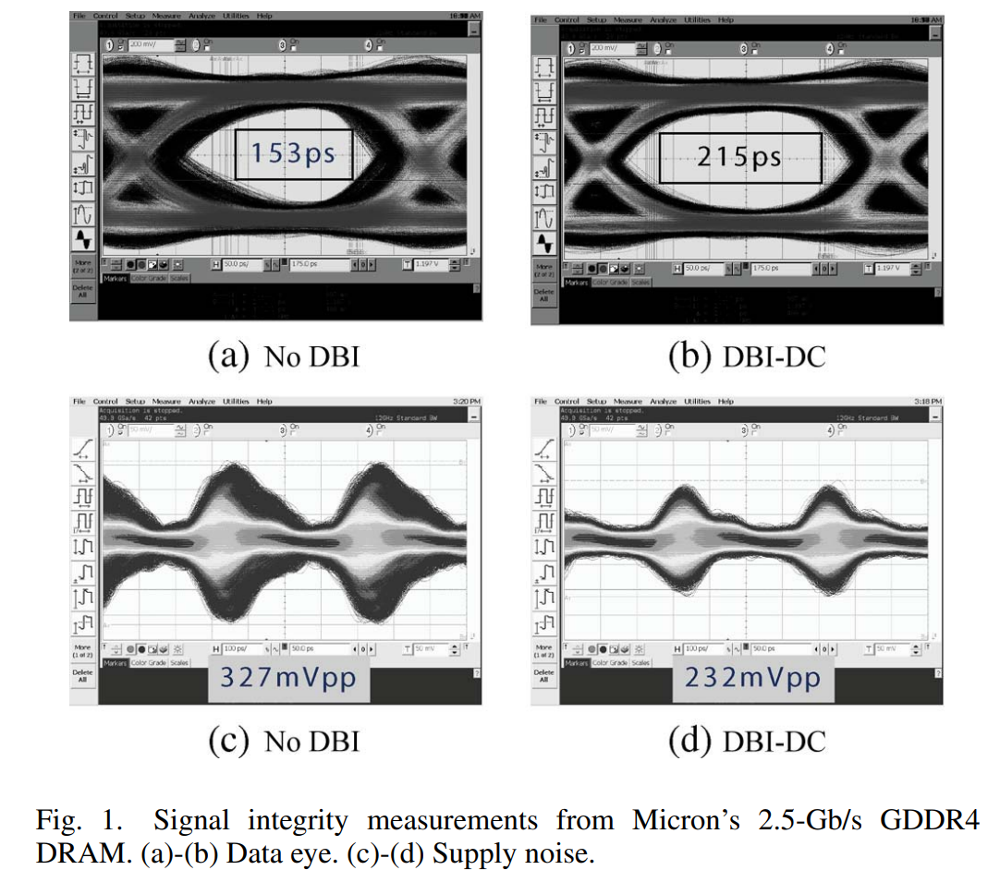

#### DBI技术以多加1根DBI线为代价（依然单端传输），得到了差分传输（信号线翻倍）的大部分优势，pin数量上更有优势

#### 端接链路（Terminated Link）和非端接链路

端接链路在源端或者接收端有阻抗网络做阻抗匹配，用以减轻信号反射带来的信号完整性问题。

非端接链路没有用来做阻抗匹配的阻抗网络

#### 信号反射

由于电信号在PCB上传输，我们在PCB设计中可以把PCB走线认为是信号的通道。当这个通道的深度和宽度发生变化时，特别是一些突变时，都会产生反射。此时，一部分信号继续传播，一部分信号就可能反射。而我们在设计的过程中，一般都是控制PCB的宽度。所以，我们可以把信号走在PCB走线上，假想为河水流淌在河道里面。当河道的宽度发生突变时，河水遇到阻力自然会发生反射、旋涡等现象。一样的，**信号在PCB上走线当遇到PCB的阻抗突变了，信号也会发生反射。**

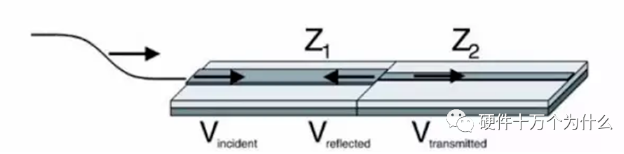

我们以光的反射类比信号的反射。光的反射，指光在传播到不同物质时，在分界面上改变传播方向，返回原来物质中的现象。光在碰到介质界面时，其折射率和反射率由。光线在临界面上的反射率仅与介质的物理性能，光线的波长，以及入射角相关。同样的，信号/电磁波在传输过程中，一旦传输线瞬时阻抗发生变化，那么就将发生反射。信号的反射有一个参数叫作反射系数（ρ），计算公式如式。

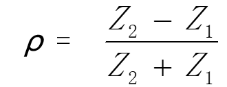

式中，*Z*1为变化前的阻抗；*Z*2为变化后的阻抗。假设PCB线条的特性阻抗为50Ω，传输过程中遇到一个理想的100Ω的贴片电阻接地，那么反射系数运用公式计算得到：

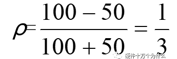

 信号有1/3被反射回源端。

信号沿传输线向前传播时，每时每刻都会可能发生阻抗变化，如PCB走线宽度变化，PCB厚度变化，换层，电阻，电容，电感，过孔，PCB转角，接插件，器件管脚；这个阻抗可能是传输线本身的，也可能是中途或末端其他元件的。对于信号来说，它不会区分到底是什么，信号是否反射，只会根据阻抗而变化。如果阻抗是恒定的，那么他就会正常向前传播，只要阻抗发生了变化，不论是什么引起的，信号都会发生反射。

不管是COMS电路还是SSTL电路，抑或是射频电路，电路设计工程师希望整个传输链路阻抗都是一致的，最理想的情况就是源端、传输线和负载端都一样。但是实际总是事与愿违，因为发送端的芯片内阻通常会比较小，而传输线的阻抗又是50Ω，这就造成了不匹配，使信号发生反射。这种情况在并行总线和低速信号电路中常常出现，而通常对于高速SerDes电路而言，芯片内阻与差分传输线的阻抗是匹配的。

　　如果确实出现了阻抗不匹配，通常的做法是在芯片之外采用电阻端接匹配来实现阻抗一致性。常用的端接方式有源端端接、终端并联端接、戴维宁端接、RC 端接、差分端接等。

如图所示是点对点的拓扑结构，由驱动端、传输线和接收端组成。

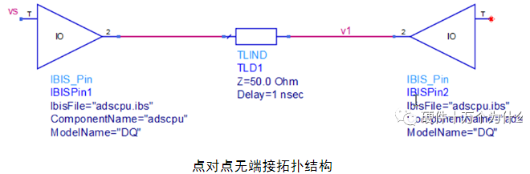

 

 在这个电路拓扑中，其接收端的信号波形如图所示。

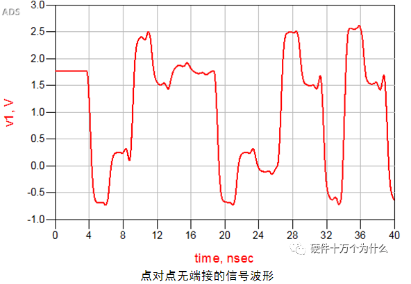

 　从波形上分析，信号在高电平时稳定电压在1.8V，但是最大值达到了2.619V，有819mV的过冲；最小值达到了-731mV，低于0V达到了731mV。这种情况在电路设计中需要尽量避免，因为这么大的过冲很容易损毁芯片，即使不损毁，也存在可靠性的问题。所以，在设计中需要把过冲降低，尽量保证电压幅值在电路可接受的范围内，如此案例尽量保证满足1.8V+/-5%。这时就需要通过 端接电阻来改善信号质量。

2）源端端接

　　源端端接设计也叫串联端接设计，是一种常用的端接设计。端接方式是只在芯片端出来之后添加一颗端接电阻，尽量靠近输出端。在此电路结构中，关键的是加多大阻值的电阻，需要根据电路的实际情况进行仿真或计算确认。计算的原则是源端阻抗*R*s与所加端接电阻*R*0的值等于传输线的阻抗*Z*0。在前面的点对点拓扑结构中，加入端接电阻值为33Ω的*R*1，其电路拓扑结构如图所示。

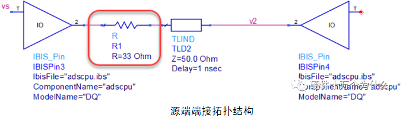

 此时在接收端获得的信号波形如图所示。

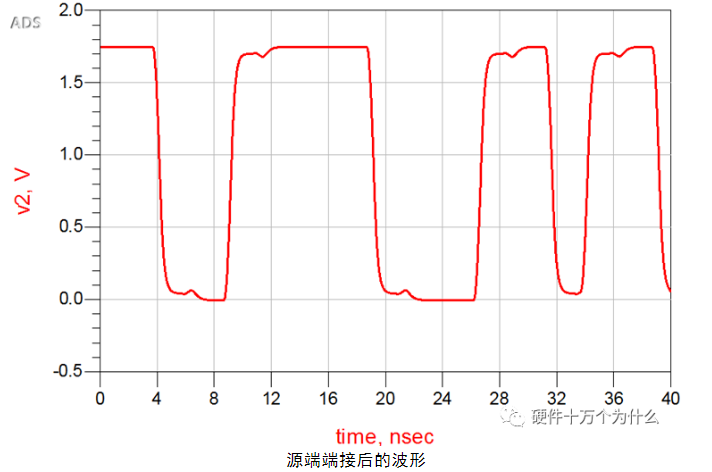

　　 使用源端端接后，原本的存在的过冲已经基本消除，信号质量得到极大的改善。在加入源端端接电阻之后，信号的上升沿变缓，上升时间变长。

源端端接在电路匹配时，可以使电路匹配得非常好，但是并不是适合于每一种电路设计。源端端接有自身的一些特性，大致归纳如下。

（1）源端端接非常简单，只需要使用一颗电阻即可完成端接。

（2）当驱动端器件的输出阻抗与传输线特性阻抗不匹配时，使用源端端接在开始就可以使阻抗匹配；当电路不受终端阻抗影响时，非常适合使用源端端接；如果接收端存在反射现象，就不适合使用源端端接。

（3）适用于单一负载设计时的端接。

（4）当电路信号频率比较高时，或者信号上升时间比较短（特别是高频时钟信号）时，不适合使用源端端接。因为加入端接电阻后，会使电路的上升时间变长。

（5）合适的源端端接可以减少电磁干扰（EMI）辐射。

 3）并联端接

并联端接即把端接电阻并联在链路中，一般把端接电阻在靠近信号接收端的位置，并联端接分为上拉电阻并联端接和下拉电阻并联端接。电路图如图所示。

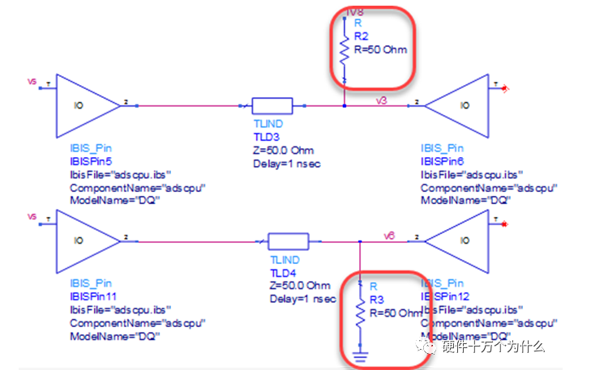

 端接电阻值R0与传输线的阻抗一致。使用并联端接后，其接收端的信号波形如图所示。

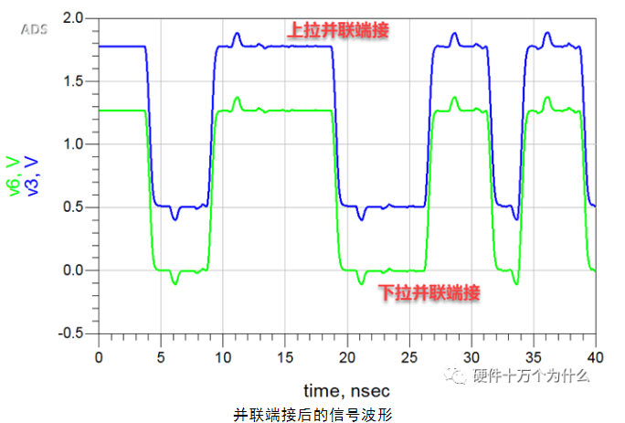

 　从波形上分析，过冲基本被消除。上拉并联端接的波形低电平有很明显的上移，下拉并联端接的波形高电平有很明显的下移。不管是上拉并联端接还是下拉并联端接，信号波形的峰峰值都比使用源端端接时要小一些。

　　并联端接放在接收端，所以能很好地消除反射，使用的元件也只有电阻。

从电路结构就可以看出，即使电路保持在静态情况，并联端接依然会消耗电流，所以驱动的电流需求比较大，很多时候驱动端无法满足并联端接的设计，在特别是多负载时，驱动端更加难以满足并联端接需要消耗的电流。所以，一般并联端接不用于TTL和COMS电路。同时，由于幅值被降低，所以噪声容限也被降低了。

4）戴维宁端接

戴维宁端接就是使用两颗电阻组成分压电路，即用上拉电阻R1和下拉电阻R2构成端接，通过R1和R2吸收反射能量。戴维宁端接的等效电阻必须等于走线的特性阻抗。电路拓扑结构如图所示。

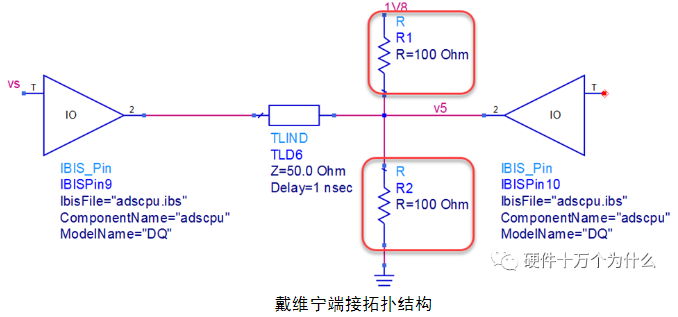

 使用戴维宁端接后，其接收端的信号波形如图所示。

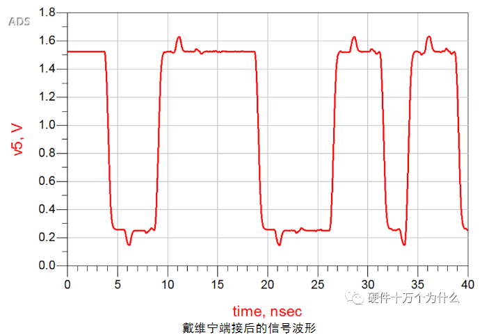

从上述信号波形分析，戴维宁端接匹配的效果也非常好，也基本能消除过冲的影响。

戴维宁端接方式，由于一直存在直流功耗，所以对电源的功耗要求比较多，也会降低源端的驱动能力。从信号接收端的波形可以看出，戴维宁端接的幅度降低了，所以噪声容限也被降低。同时，戴维宁端接需要使用两颗分压电阻，电阻的选型也相对比较麻烦，使很多电路设计工程师在使用这类端接时总是非常谨慎。

DDR2和DDR3的数据和数据选通信号网络的ODT端接电路就采用了戴维宁端接。

5）RC端接

RC端接在并联下拉端接的电阻下面增加一颗电容，并下拉到地，所以RC端接是由一颗电阻和一颗电容组成的端接。RC端接也可以看作是一种并联端接。电阻值的大小等于传输线的阻抗，电容值通常取值比较小。RC端接电路的拓扑如图所示。

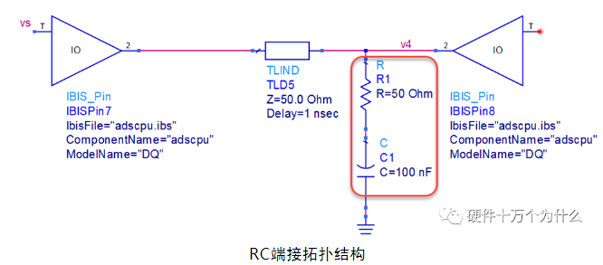

 使用RC端接后，其接收端的信号波形如图所示。

 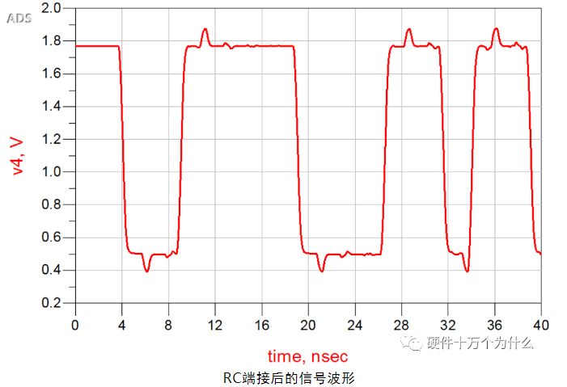　　　　从接收端的波形分析，RC端接也使过冲基本被消除了。RC端接能非常好的消除源端带来的反射影响，但是RC电路也有可能导致新的反射。由于RC端接电路中有电容存在，所以电路静态时的直流功耗非常小。

信号波形的低电平电压提升了很多，所以RC端接后电路的噪声容限被降低。RC端接后，由于引入了RC延时电路，所以信号波形边沿也明显的变缓慢，其变化程度与RC端接的电阻值和电容值有直接关系。所以，RC端接并不适合非常高速的信号及时钟电路的端接。同时，RC端接方式需要使用电阻和电容两颗器件。

#### 所以，低速传输 && 极短走线，一般不需要termination

#### termination伴随的额外DC电流会带来相当可观的功耗开销

#### terminated link适合用DBI-AC；unterminated link适合用DBI-DC

`表现`

DBI-DC会降低18%的terminated link功耗，但升高4%的unterminated-link功耗；DBI-AC会降低12.5%的unterminated-link功耗，但升高4%的terminated-link功耗

`原因`

##### **1. DBI-DC (Direct Current)**

DBI-DC focuses on balancing the number of **high (1) and low (0) bits** on the data bus to reduce DC power consumption, particularly in systems with **terminated links**.

##### **Power Impact of DBI-DC**:

- ##### **Terminated Links**: Reduces power by **18%**.

  - In terminated links, DC power is consumed due to current flow through termination resistors. By balancing the number of 1s and 0s, DBI-DC reduces the average current draw, leading to significant power savings.

- ##### **Unterminated Links**: Increases power by **4%**.

  - In unterminated links, there are no termination resistors, so DC power consumption is not a major factor. However, DBI-DC skews the data toward a particular binary level (e.g., more 1s or more 0s), which increases the **probability of transitions**. This results in slightly higher dynamic power consumption.

##### **Why DBI-DC Increases Power in Unterminated Links**:

- DBI-DC skews the data to reduce the imbalance between 1s and 0s, but this skewing can increase the likelihood of transitions between consecutive data words.
- In unterminated links, dynamic power (due to transitions) becomes more significant, leading to a small increase in power consumption.

------

##### **2. DBI-AC (Alternate Current)**

DBI-AC focuses on minimizing the number of **bit transitions** (0 → 1 or 1 → 0) on the data bus to reduce dynamic power consumption.

##### **Power Impact of DBI-AC**:

- ##### **Terminated Links**: Increases power by **4%**.

  - In terminated links, the primary power consumption is due to DC current through termination resistors. DBI-AC reduces transitions, but this has a smaller impact on DC power. The overhead of the DBI-AC algorithm (e.g., inversion logic) can slightly increase power consumption.

- ##### **Unterminated Links**: Reduces power by **12.5%**.

  - In unterminated links, dynamic power (due to transitions) is the dominant factor. By minimizing transitions, DBI-AC significantly reduces dynamic power consumption.

##### **Why DBI-AC Increases Power in Terminated Links**:

- Terminated links are dominated by DC power consumption, and reducing transitions has a limited impact on overall power. The additional logic required for DBI-AC (e.g., inversion and DBI bit handling) can slightly increase power.

------

##### **Key Takeaways**:

1. ##### **DBI-DC**:

   - Best for **terminated links** (reduces DC power by 18%).
   - Less suitable for **unterminated links** (increases power by 4% due to higher transition probability).

2. ##### **DBI-AC**:

   - Best for **unterminated links** (reduces dynamic power by 12.5%).
   - Less suitable for **terminated links** (increases power by 4% due to overhead).

3. ##### **Trade-offs**:

   - The choice between DBI-DC and DBI-AC depends on the type of link (terminated or unterminated) and the dominant power consumption mechanism (DC or dynamic power).
   - In systems with both terminated and unterminated links, a combination of DBI-DC and DBI-AC may be used to optimize overall power efficiency.

------

##### **Practical Implications**:

- ##### **Terminated Links** (e.g., DDR memory):

  - Use **DBI-DC** to reduce DC power consumption.
  - Avoid DBI-AC unless dynamic power is a significant concern.

- ##### **Unterminated Links** (e.g., low-frequency systems):

  - Use **DBI-AC** to reduce dynamic power consumption.
  - Avoid DBI-DC as it may increase power due to higher transition probability.

- ##### **Hybrid Systems**:

  - Implement both DBI-DC and DBI-AC, selecting the appropriate algorithm based on the link type and power consumption profile.

#### DBI技术对layout的压力很大，实际收不到这么好的power reduction效果。可以通过分subset的方式减少这部分影响

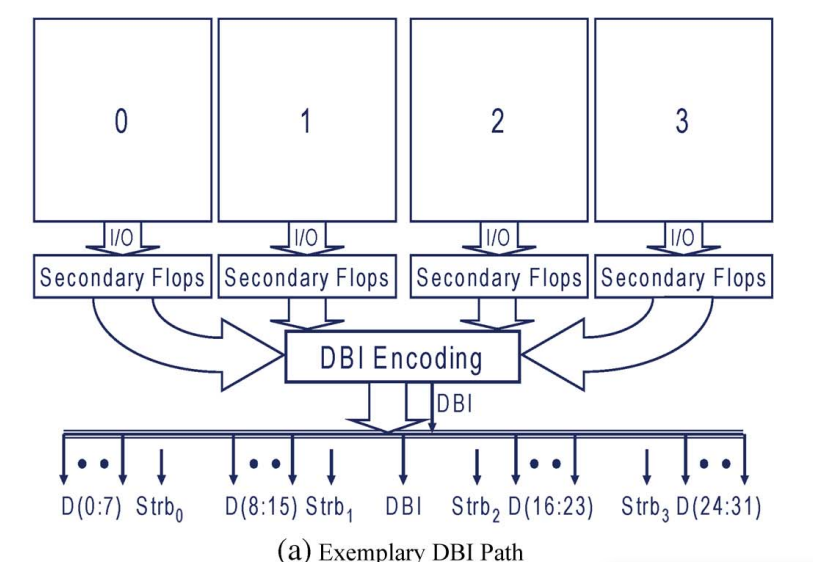

如图，从chip多个位置来的data, 需要集中连线到一个位置进行DBI Encoding，而后再分发到位置各异的四周的pad。布线极不友好，会增加布线长度，也会增加power，且带宽越大，增加power的现象更严重，可能抵偿掉DBI带来的power reduction。

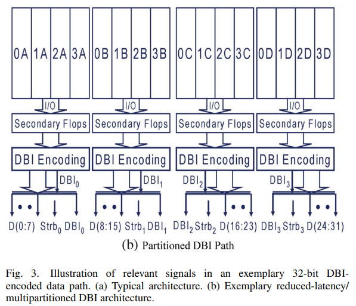

`解决办法`：把芯片来的数据分成多个subset，每个subset单独进行DBI Encoding，生成各自的DBI bit。

这样的好处是减少了布线长度，坏处是多个DBI Encoding带来了额外的功耗开销，且DBI bit PAD数量增加（=subset数）。实验表明，在带宽=32bit时，分成4个subset(每个subset 8个bit)减少power最多。

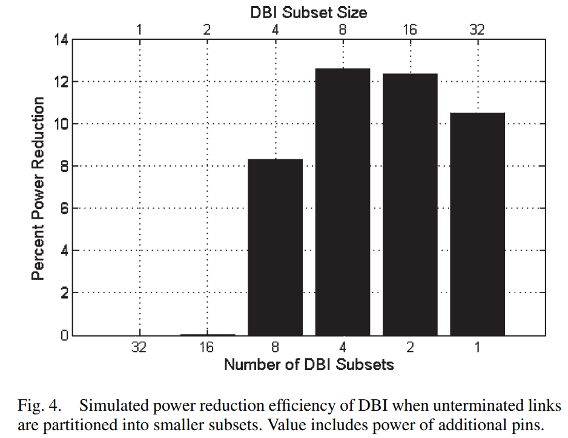

#### DBI-AC技术对burst传输不友好

DBI-AC需要保存上一笔传输的数据。对于burst来说，

一方面，两次burst之间一般不是连续的，中间可能间隔很长时间。在布线资源很紧张的IO region，放寄存器存上一笔传输的数据，对面积极不友好。

另一方面，需要加入识别burst最后一笔传输的逻辑，增加power。

如果不加入这部分逻辑，可以对寄存器进行周期性update，但这样对power的增加更多。

#### 论文proposed的DBI-AC/DC编码技术

针对上述burst问题，对DBI-AC和DBI-DC技术进行了中和。unterminated link的burst第一个数采用DBI-DC（以避免上一笔传输数据的长时间存储），burst后面的数采用DBI-AC。用计数器和选择器逻辑来选择使用哪种技术。

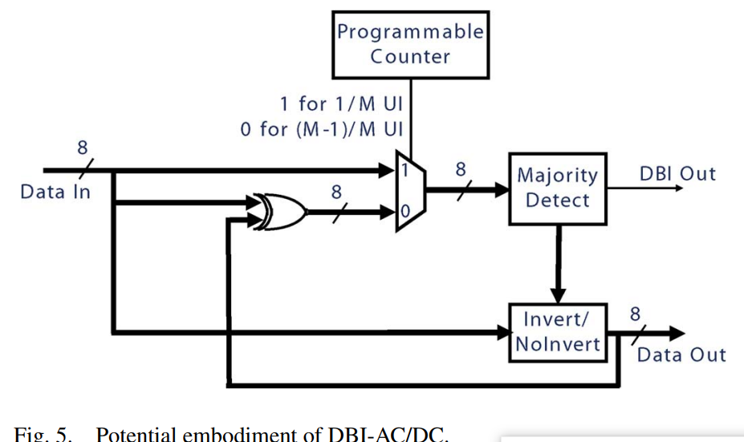

mux的"0"通路即DBI-AC，“1”通路即DBI-DC，Majority Detect即统计1/0的个数 或 比较和前一笔差异 的模块，Invert/NoInvert决定是否翻转信号。

信号流如下：

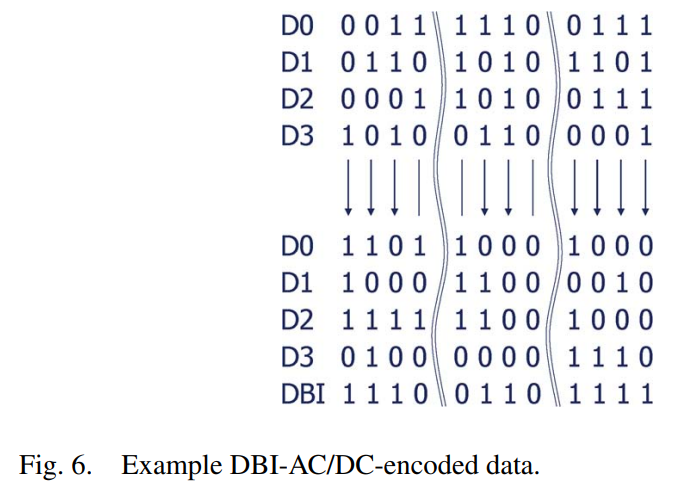

总线宽度为4，竖着看。曲线表示分割3次burst。

#### 总而言之，DBI Encoding技术就是为了减少power，提高信号完整性，但又不想用差分传输（因为线多，Power也大）提出的一个技术。

 the appropriate use of DBI (with its limited number of additional pins) may help postpone the universal adoption of differential signaling a little while longer.


# CICC‘23: Open-Source AXI4 Adapters for Chiplet Architectures (by Intel)

`摘要`：介绍了一种开源的AXI4 Adapters on AIB D2D interfaces

https://github.com/chipsalliance/aib-phy-hardware

`挑战`：

1. AIB并行线带来的data skew（由clock insertion delay导致，或由fabric wire trace differences导致，或由physical variation导致）
2. multi-cycle latency（本该在同一周期到达的数据在不同时钟周期到达）
3. pipeline bubbles or stalls
4.  how to support for mesochronous (平均同步的) clocking architectures （指时钟们同源、频率相同但相位不同）

`亮点`：

#### 解决data skew问题：把每个Channel的一条信号线拿出来伴行传输1个strobe bit，用以对齐各个channel。

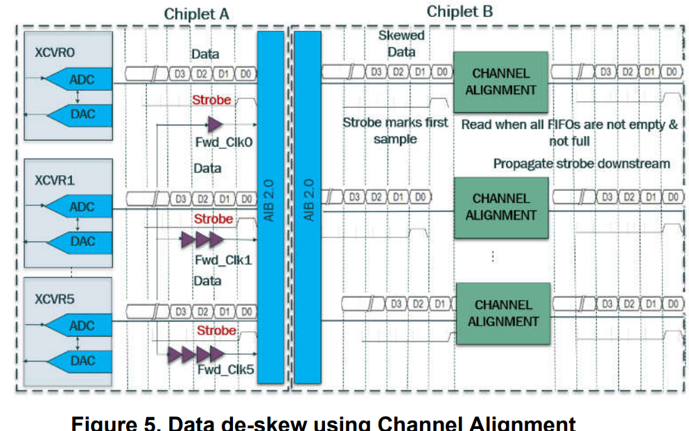

这个strobe bit是周期性拉高一个周期，且发送端每次拉高一定是同时拉高。接收端在所有通道接收到这个strobe bit拉高之后，就可以借此对齐不同channel的时钟周期，并在接下来的一段时间可以把这个strobe bit占用的这根信号线用来传输AXI4通道的有效数据。

由于不同通道的strobe bit由于data skew很可能不在同一个时钟周期到达，因此接收端在没有收到strobe bit之前必须对所有通道的数据进行buffering。

第一笔传输一定伴行strobe bit。

#### 降低clock-to-data skew：很宽的并行传输线分成很多个channel，每个channel有自己的forwarded clock，而不是把所有的并行传输线用single clock来伴行。

AIB2.0：每20或40比特伴行一个clock

DRAM DIMM：每8比特伴行一个clock

#### 避免PHY走线可能需要的multi-cycle latency导致接收方FIFO爆掉：引入Credit Flow Control

同杰哥D2D IP,不再赘述

#### 一端为FPGA、另一端为ASIC，如何保证最低的latency? 使用asymmetric gear boxing方法，即ASIC Tx用极高钟频（smaller gear）保证FPGA端饱和，FPGA端用自身支持的最高钟频(higher gear)

# A 6.4-Gbps 0.41-pJ/b fully-digital die-to-die interconnect PHY for silicon interposer based 2.5D integration

`作者`：茂老师


# A Chisel Generator for Standardized 3-D Die-to-Die Interconnects

`作者`：Berkerley Chipyard Team

`挑战`：

1. 3D D2D Interconnect所面临的PPAC（power, performance, area, cost, and time-to-market）要求较2D和2.5D更为严苛
2. 3D D2D Interconnect的PHY必须具有incur minimal overhead。
3. 本文所address的挑战主要是clustered TSV defects的repair。

`摘要`：

1. 本设计全面aligned with UCIe-3D
2. 本设计全面用Chisel设计 （由于3D D2D的logic非常simple，Chisel's verification issues不会造成严重影响）

`概念`：

#### TSV defects的纠错方法

##### Signal Shifting 

(类似杰哥的方法，用一系列mux来在检测到defects后rerouting)（缺点：只能repair isolated defect，不能修复clustered defects）

##### Coding-Based Redundancy

可以修复小颗粒导致的clustered defects。

即，把信号分成很多组，每一组用少数几条信号线来做编码位（类似汉明纠错码的地位）。同一组内的所有信号线均匀分散在整个bump array上，使得当clustered defects发生时，不会影响到同一组内的多条信号线。由于有编码位的存在，Rx可以恢复出因defects而错误的位。

此方法的好处是对clustered defects很友好。

此方法的缺点是信号线的overhead相对较高。需要额外n×log2(c)个比特，其中n是每个cluster中有效信号线的数量，c是每个module中cluster的数量（即每个group中信号线的数量）（实验表明c=4-9最优）

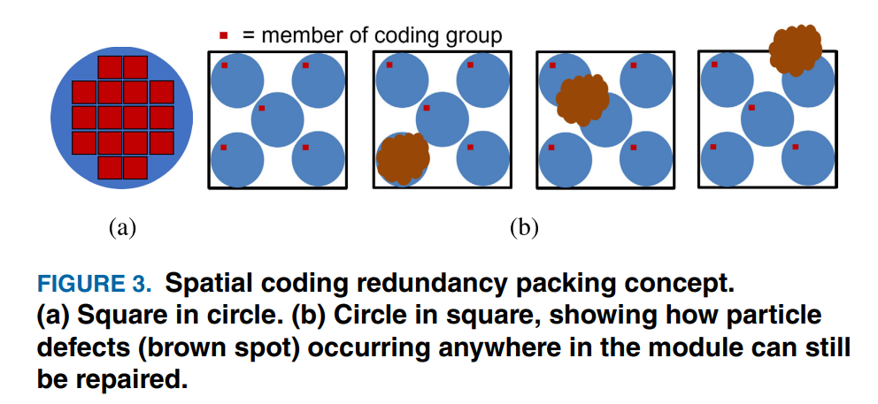

##### TDMA（time-division multiplexing access）

share a single communication channel among multiple signals, especially when spare TSVs are not available.

不是repair机制，但可以用来做repair，即：把坏掉的信号线分时map到好的信号线上。

优点：当时序同步做得很好时，可以避免出现TSV的浪费

缺点：对时序要求很高（需要精确时间戳）

# Heterogeneous Die-to-Die Interfaces: Enabling More Flexible Chiplet Interconnection Systems （MICRO‘23）

`作者`：冯寅潇 from Tsinghua （Kaisheng Ma组）

`Challenge`：

1. 现有D2D interface不够flexible
   1. interface有特定的workload/scales/scenarios，这导致uniform D2D interface不能在系统之间迁移
   2. 同一个大规模系统内，uniform D2D interface不能cope with灵活的workload

`Contribution`:

1. 提出一个概念：异构D2D Interface.（同时具有并行接口和串行接口）
2. 提出上述概念的两种实现：异构PHY和异构Channel。

#### 并行接口latency更低，power更低，但是short-reach，port count很大（费钱），适合on-chip的小数据量通信（如握手、同步、一致性协议），适合flat的chiplet排布。

#### 串行接口latency更高，power更高，但是long-reach，吞吐率更高，适合大数据量通信（如all-reduce），适合high-radix的chiplet排布

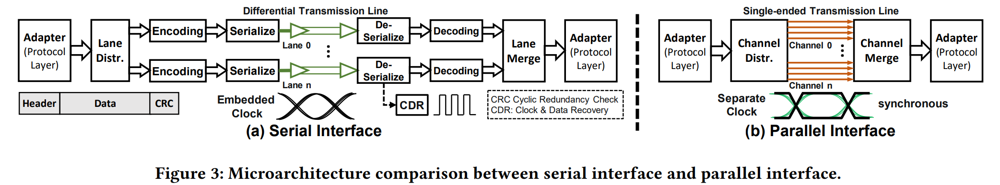

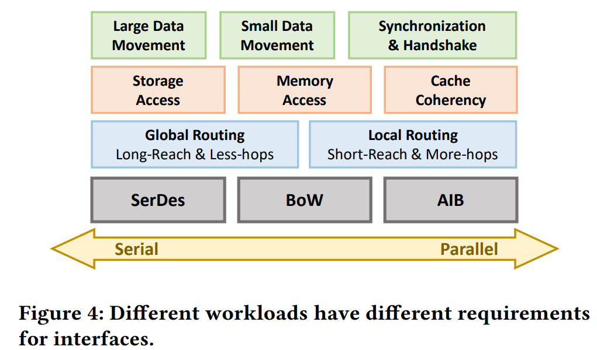

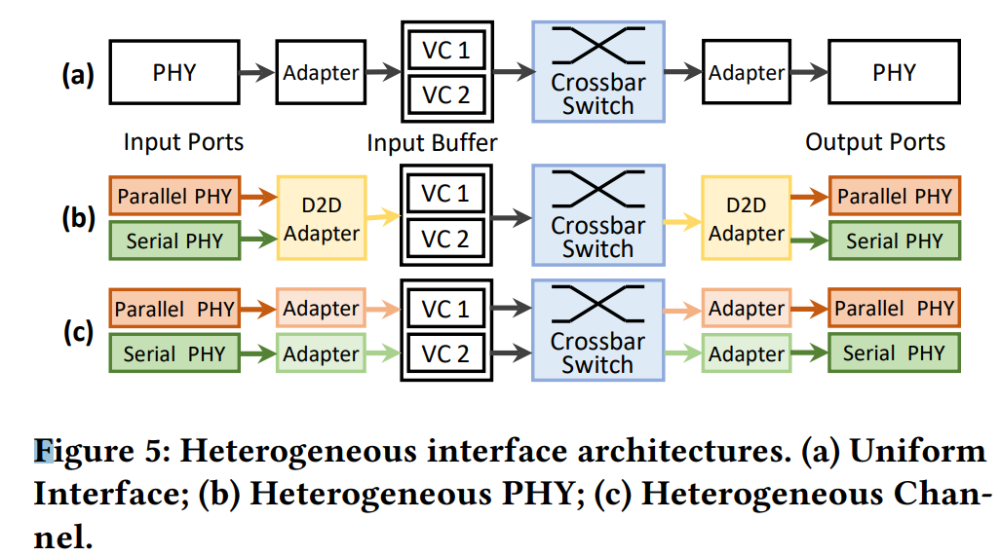

#### SerDes（Serializer / Deserializer）

是串行接口PHY的常见实现形式。采用多种抗干扰（anti-interference）技术以提高数据传输频率和传输距离（技术：double-terminated differential lines && CDR (clock & data recovery) && FEC (forward error correction)）

#### Concise Ideas for designing deadlock-free interconnection networks (Lemma 1)

*Lemma 1. A connected routing function R for an interconnection network I is deadlock-free if there exists a channel subset 𝐶0 ⊆ 𝐶 such that the routing subfunction 𝑅0 (𝑥, 𝑦) = 𝑅(𝑥, 𝑦) ∩ 𝐶0 ∀𝑥, 𝑦 ∈ 𝑁 is connected and deadlock-free.*

- A routing function *R* defines how packets are routed from a source node x*x* to a destination node y*y* in the network. For any pair of nodes (*x*,*y*), R*(*x*,*y*) specifies the set of channels that can be used to route packets from x to *y*.
- *R*0 is a restricted version of the original routing function R*R*. It only allows routing through the channels in C0*C*0. Specifically, for any pair of nodes(*x*,*y*), R*0(*x*,*y*)=*R*(*x*,*y*)∩*C*0, meaning that R*0 only uses the channels in C*0 to route packets from *x* to y*.
- **Connected**: The subfunction R*0 must ensure that there is a valid path from any source node *x* to any destination node *y* using only the channels in C*0. In other words, the subnetwork formed by C*0 must be fully connected.
- If such a subset C*0 exists, and the corresponding subfunction R*0 is both connected and deadlock-free, then the original routing function R* is also deadlock-free. This is because R*0 provides a "safe" subset of channels that can always be used to avoid deadlocks, even if the full routing function *R* allows more flexibility in channel usage.

#### 活锁（Livelock）

Unlike deadlock, livelocked packets continue to move in the network but never reach the destinations. (一直转圈，无法到达目标终点)

##### 选择non-minimal path (非最短path)来route可能会导致活锁

如果没有在route算法中设定progress guarantee（即保证一段时间内离route终点的距离变得更近），或者没有设定Timeout机制(即设定的一段时间内如果没有到达终点就自动按minimal path来route)，算法就可能一直在转圈，一直route不到终点，这就是livelock。

##### 什么情况下需要引入non-minimal path

1. 均衡负载（如果每个packet都想走最短的路，这条路就可能会被堵死）
2. Fault tolerance (如果有个节点或者链路寄了，绕远路可以至少保持功能正确)
3. 避免死锁（如果每个packet都走最短的路，可能造成死锁环，这时候适当放一些non-minimal path可以打破死锁环）
4. （本文场景）为了执行大数据量传输，packet可以绕远路去找有空闲serial link的节点

#### 异构PHY的应用场景

##### 可以Exclusive

（在low-power system里面用parallel interfaces，在cheaper substrate-based system里面用serial interfaces），

##### 也可以Collaborative

（同时用parellel PHY和serial PHY，组成如下拓扑A。相比2D mesh都用parallel interface，A可以用serial interface首尾相连，减小了拓扑的直径（最远两个节点的沟通latency减小）；相比high-radix network都用serial interface，A可以在相距较近的芯片间大量应用parallel interface，进而power更低、short-reach communication latency更低）

#### 异构Channel的应用场景


# TTNNM: Thermal- and Traffic-Aware Neural Network Mapping on 3D-NoC-based Accelerator (GLSVLSI'24, Nanjing University)

创新点看起来很浅显，就是在枚举的所有情况中一步步做排除法

创新点1：由于3D芯片中越靠近heat sink（散热处）散热越好，TTNNM把CNN中计算密集、访存密集、通信密集的层（比如第一层卷积层）map到bottom tile上（最靠近heat sink）。越远离heat sink，map各方面负载更小的层（如最后一层Full Connected Layer）

创新点2：在同一个tile中，跑目标应用，遍历所有可能的map情况，首先排除掉packet traverse所需的hop count总和超过阈值的map情况（Selecting Mapping Sequences with Low Communication Hop Counts），接着排除掉Maximum-load of Links超过阈值的map情况，然后排除掉Number of High-load Links超过阈值的map情况

创新点3：在创新点2的基础上，排除掉所有node的temperature之和超过阈值的情况。

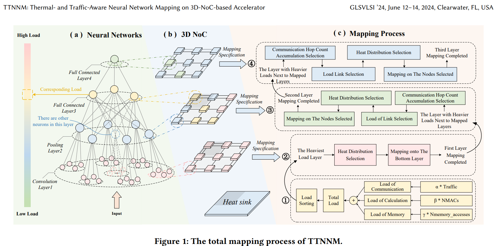

验证所用仿真器：AccessNoxim (即Noxim + architecture-level thermal model Hotspot)

# Florets for Chiplets: Data Flow-aware High-Performance and Energy-efficient Network-on-Interposer for CNN Inference Tasks (TECS'23, Washington State University)

space-filling curve (SFC): is a [curve](https://en.wikipedia.org/wiki/Curve) whose [range](https://en.wikipedia.org/wiki/Range_of_a_function) reaches every point in a higher dimensional region, typically the [unit square](https://en.wikipedia.org/wiki/Unit_square) (or more generally an *n*-dimensional unit [hypercube](https://en.wikipedia.org/wiki/Hypercube)).(SFC可以看成是高维空间点云通过线性排列mapping到一维)

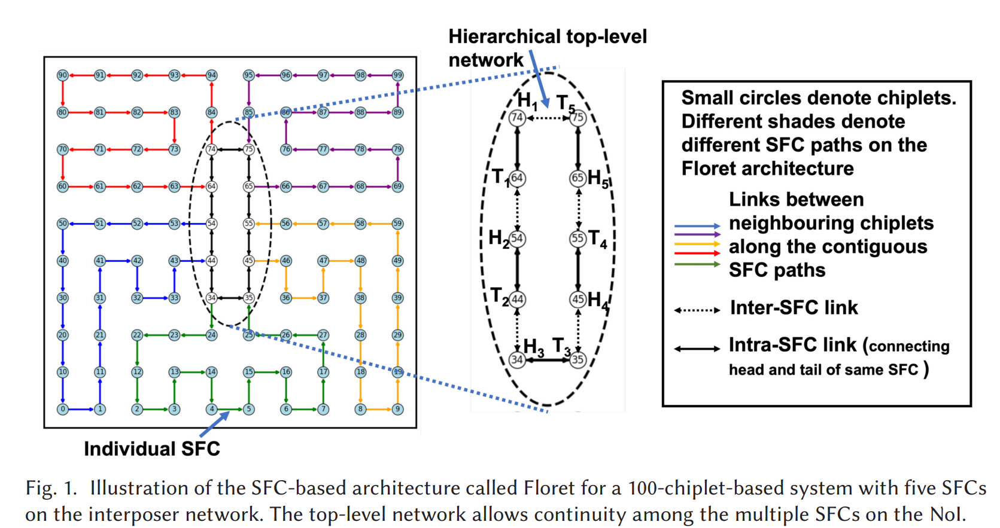

Contribution 1: 提出了一个NOI架构Floret，利用很多个SFC来有效mapping multiple CNN inference tasks

Contribution 2: 提出了一种新型的SFC——Floret curve

Floret的这种SFC架构有效降低了每个router平均的port数量（由于只是单向流动，大部分router的port数量落在2），降低了link数量和面积

#### 为什么Floret用多个SFC而不是单个SFC来mapping multiple CNN Inference tasks

一方面，用单个SFC来mapping多个CNN任务会导致mapping的碎片化，一旦单个SFC往tail方向剩下的空间不足，mapping就会wrap around到同一个SFC的head，造成multi-hop communication或直接deadlock

另一方面，如果单个SFC有个link dead了，一整片就dead了(mapping被拦腰折断)；反之，多个SFC中有一个link dead了，可以将dead link上的任务remap到其他的SFC上。

除此之外，单个SFC是线性的，只能map完一个再map下一个，效率低；多个SFC可以并行map，适合server级别

最后，多个SFC扩展性好，如果某个CNN Task在一个SFC放不下，可以把剩下的map到其他的SFC上，而不引入很大的multi-hop开销。（这是因为文章中的Floret curve所带来的hierarchy的SFC排布，多个SFC的head和tail都集中在中心，通信成本很低）

以下是deepseek R1的回答

The paper proposes using **multiple non-overlapping space-filling curves (SFCs)** instead of a single continuous SFC for the Network-on-Interposer (NoI) architecture to address challenges specific to **concurrent CNN inference tasks** and **dynamic workload mapping**. Here’s why a single continuous SFC is insufficient:

------

### **1. Handling Concurrent CNN Inference Tasks**

- **Problem with a single SFC**:
  If all chiplets were connected via a single monolithic SFC, mapping multiple CNN tasks concurrently would lead to **fragmentation** and **non-contiguous chiplet allocations**. For example:
  - If one CNN task occupies a segment of the SFC, subsequent tasks would need to "wrap around" the curve, leading to **long-range, multi-hop communication** between layers of different tasks.
  - This violates the goal of mapping consecutive neural layers of a CNN to **contiguous chiplets** to minimize latency.
- **Solution with Floret**:
  By dividing the system into multiple SFCs (petals), each CNN task can be mapped to a dedicated SFC or a contiguous subset of chiplets within an SFC. This avoids fragmentation and ensures **locality for sequential data flow** within a task.

------

### **2. Scalability for Large Systems**

- **Single SFC limitations**:
  A single SFC (e.g., a Hilbert curve) becomes increasingly complex and inefficient as the number of chiplets grows. Long-range communication between distant segments of the curve would dominate, negating the benefits of locality.
- **Floret’s approach**:
  Multiple smaller SFCs reduce the **average hop count** for intra-task communication while maintaining short paths between SFCs (via a hierarchical "top-level" network). This balances locality and scalability.

------

### **3. Redundancy and Fault Tolerance**

- **Single SFC risks**:
  A single SFC creates a critical path—any failure or congestion along the curve would disrupt the entire system.
- **Floret’s redundancy**:
  Multiple SFCs introduce inherent redundancy. If one SFC is congested or faulty, tasks can spill over to neighboring SFCs with minimal latency (e.g., tails of one SFC are 1–2 hops from heads of others). This improves **fault tolerance** and **load balancing**.

------

### **4. Dynamic Workload Mapping**

- **Single SFC rigidity**:
  A monolithic SFC enforces a fixed, linear order of chiplets. Mapping dynamic workloads (e.g., varying numbers of neural layers per task) would lead to **suboptimal assignments** and wasted resources.
- **Floret’s flexibility**:
  The algorithm dynamically assigns tasks to contiguous segments of SFCs. If a task requires more chiplets than available in one SFC, it spills over to another SFC via low-latency inter-SFC links (Figure 1). This ensures **efficient resource utilization** for variable workloads.

------

### **5. Experimental Validation**

The paper empirically demonstrates that a single SFC (or monolithic curve) performs poorly compared to Floret:

- **Latency and energy**:
  Floret reduces latency by up to **58%** and energy by **64%** compared to mesh/torus-based NoIs (Section 4.5).
- **Fabrication cost**:
  Fewer router ports and shorter links in Floret reduce NoI area by **~80%** compared to traditional topologies (Section 4.4).

------

### **Conclusion**

A single continuous SFC is ill-suited for **data-center-scale CNN workloads** due to fragmentation, scalability limits, and lack of redundancy. Floret’s multi-SFC design optimizes:

- **Locality** (via contiguous intra-SFC mappings),
- **Scalability** (via hierarchical SFC clusters),
- **Fault tolerance** (via redundant paths),
- **Flexibility** (for dynamic workloads).

By leveraging multiple SFCs, Floret achieves superior performance, energy efficiency, and cost-effectiveness for concurrent CNN inference tasks.


# TEFLON: Thermally Efficient Dataflow-aware 3D NoC for Accelerating CNN Inferencing on Manycore PIM Architectures (TECS'24, Washington State University)

previous work对CNN的weight Importance进行分类，把更重要的weight分配到温度更低的cool ReRAM上，把不太重要的weight分配到温度更高的hot ReRAM上。

本文的主要贡献在于：

1. 在前作Floret的基础上，加入thermal这一评价指标，变成一个MOO（多目标优化）；把多SFC从2.5D NOI优化推广到monothic 3D
2. 基于上述两个推广，在把neural layer mapping到SFC上PE的过程中考虑两个事情：一是mapping neural layers to contiguously located PEs；二是not placing multiple high-power consuming PEs away from the heat sink and not along one specific vertical column
3. 基于上述方法，引入一个评价指标EDP (Energy-Delay-Product)，评价TEFLON的性能和温度的综合优化


面向MIV-based 3D IC （monolithic inter-tier vias）而不是TSV-based 3D IC。因为MIV的尺寸更小（~50nm×100nm）（TSV尺寸：1-3um×10-30um），contact的尺寸也更小(~50nm)（TSV contact尺寸：2-5um），因此通道数可以摆更多，通信更快。

避免把两个高耗能的PE放在上下相邻的两个node上，防止温度太高，导致RRAM读出的值失真，进而影响CNN的推理准确率。

##### 温度与RRAM计算得到的误差的关系：

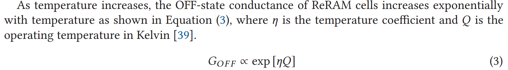

由于weight和activation在RRAM中都以电导（conductance）的形式存储，OFF-state conductance的变化会导致RRAM存储的weight值变化从而导致计算误差。

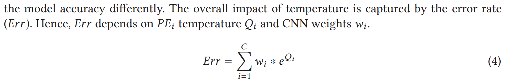

权重本身的值越大，误差越大；温度越高，误差越大。

##### 不同位置PE的温度建模：

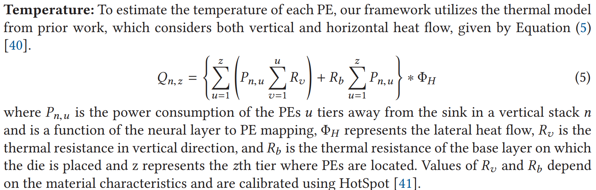

可见，竖直方向离heat sink越远，累积的Rv求和就越大，对应的温度就越高。

##### 不同位置PE的功耗建模

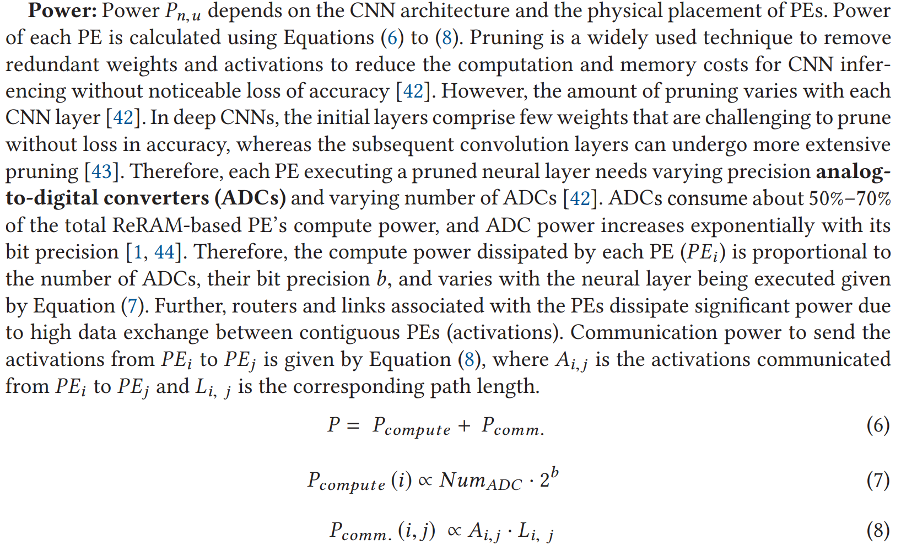

作者把PE的功耗分为计算功耗和通信功耗。由于作者采用的是pruning过的CNN网络，部分weight和activation被跳过，对应的ADC可以省掉，即Num_{ADC}下降；weight和activation的精度越低（比特数b越低），计算功耗越低。对于通信功耗，两个PE之间所需的通信量A越低，通信功耗越低；两个PE之间的距离L越短，通信功耗越低。

##### 多目标优化方法

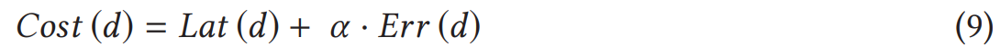

Latency + 一个缩放因子α×计算误差

##### 实验指标

峰值温度对比，EDP对比，Thermal Hotspot对比，CNN不同层对weight随温度波动所反映出的Inference Accuracy差异（前面的层影响更大），系统运行频率对推理准确度的影响，多目标优化中缩放因子的不同取值对推理准确度的影响。


# A Dataflow-Aware Network-on-Interposer for CNN Inferencing in the Presence of Defective Chiplets (TCAD'24, Washington State University)


# A Low-overhead Fault Tolerance Scheme for TSV-based 3D Network on Chip Links (ICCAD'08, Stanford)

就是杰哥的那个redundancy shift方法


# Methods for Fault Tolerance in NoC (ACM

#  Computing Surveys, 2013)


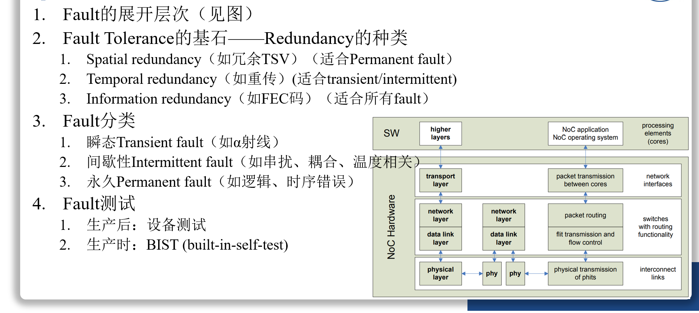

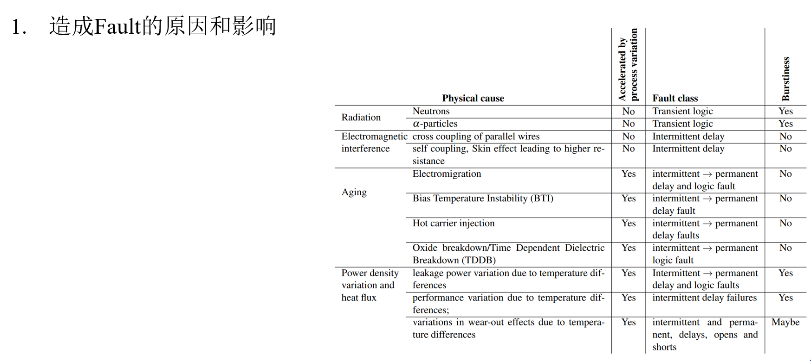

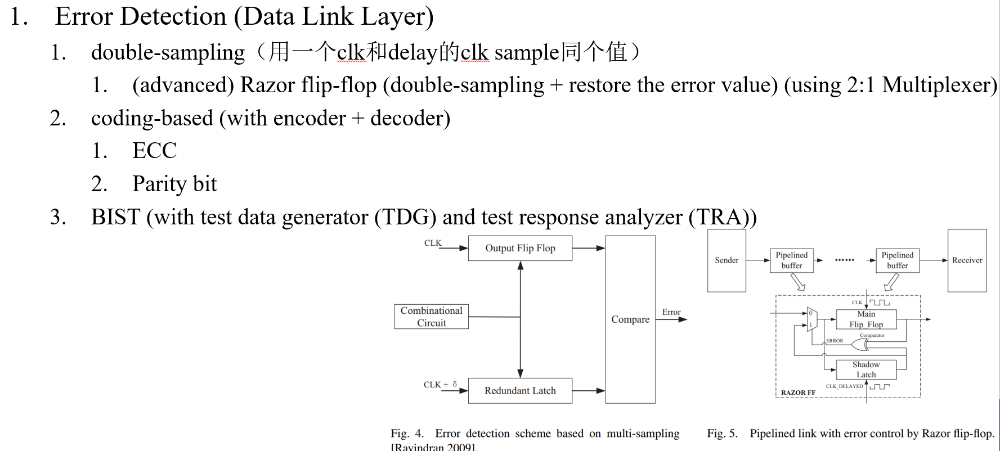

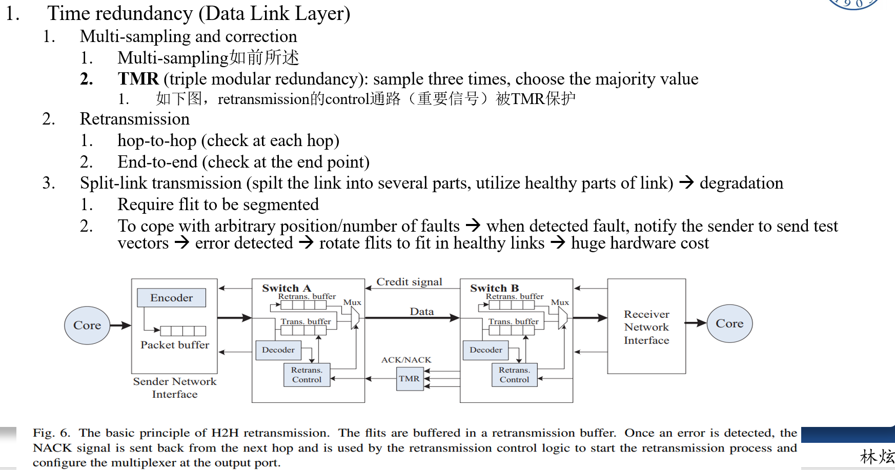

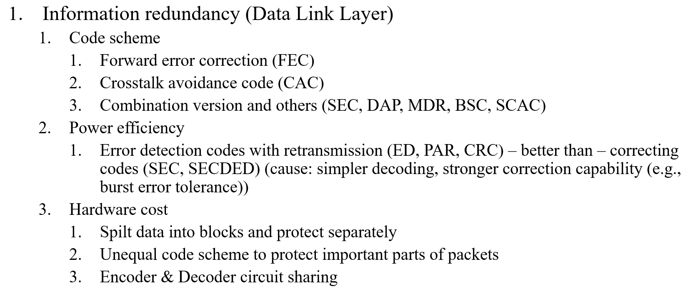

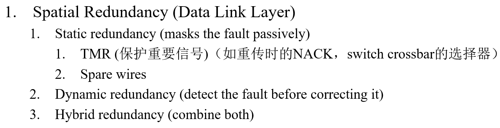

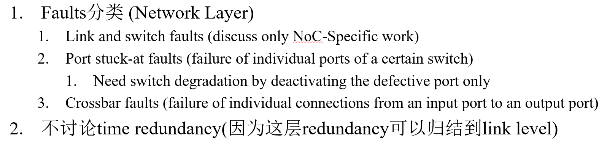

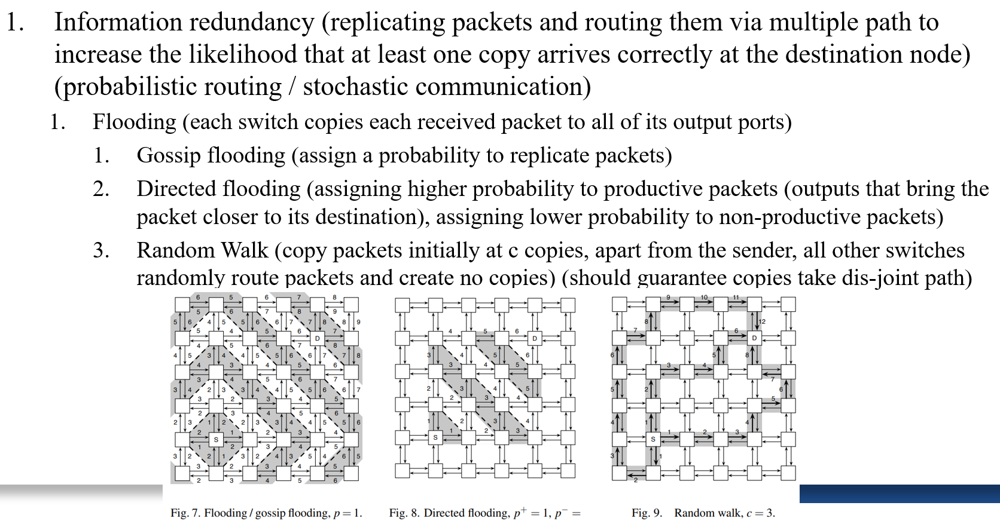

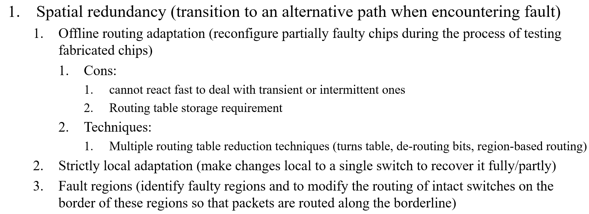

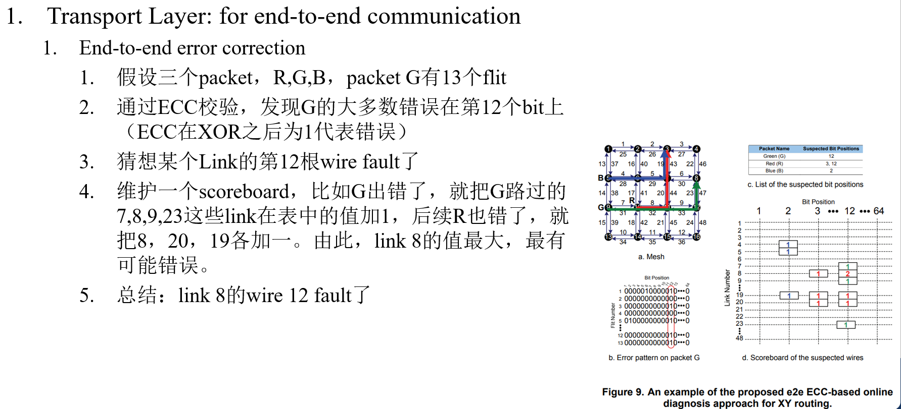


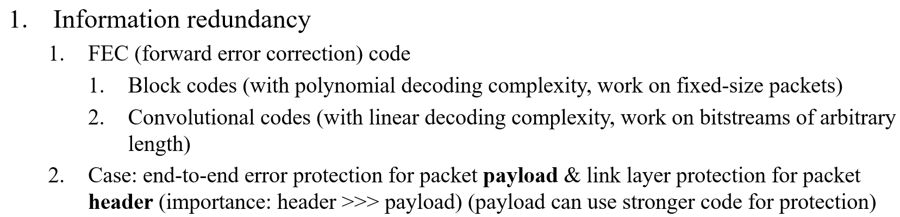

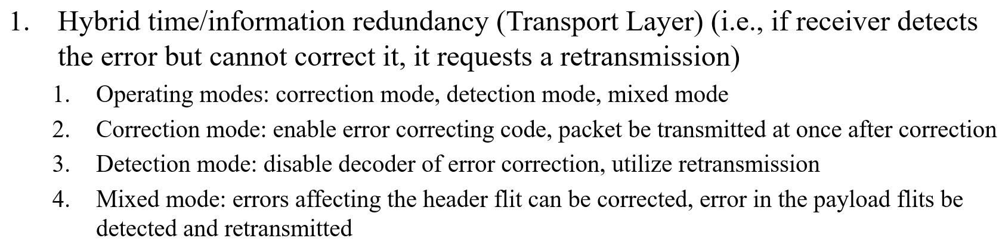

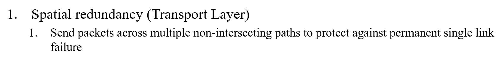


# High-Bandwidth Chiplet Interconnects for Advanced Packagiong Technologies in AI/ML Applications: Challenges and Solution (TSMC, OJSSCS'24)

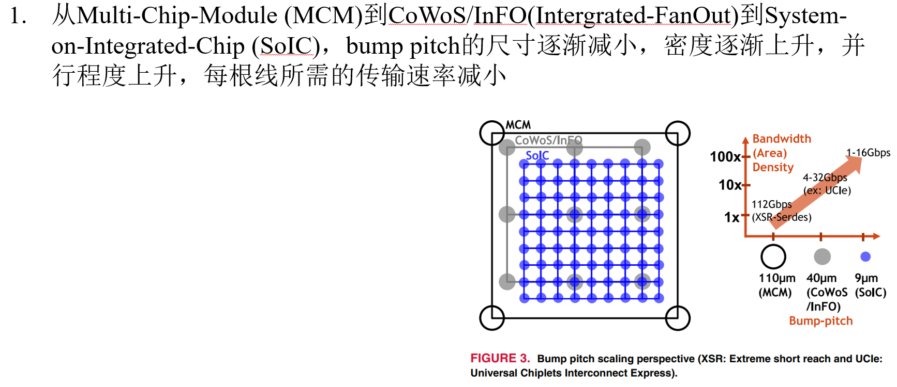

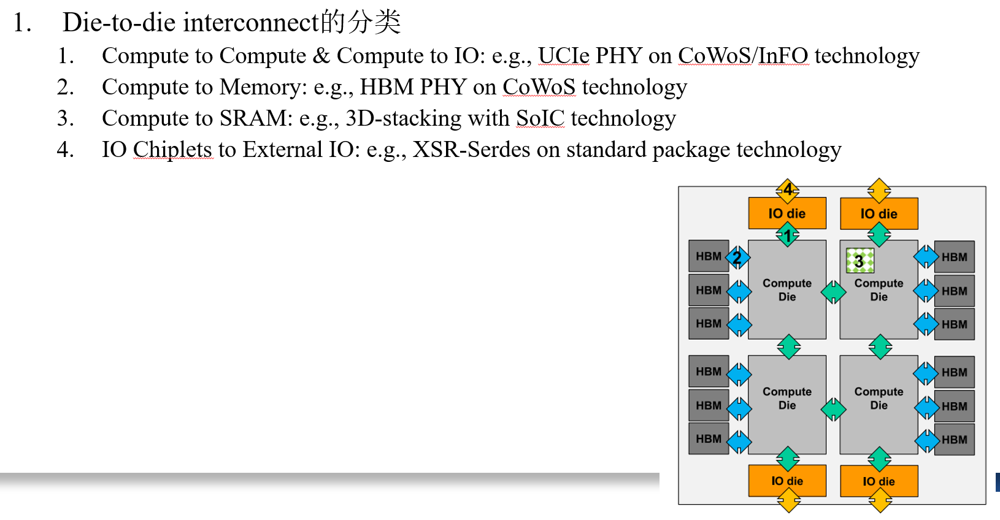

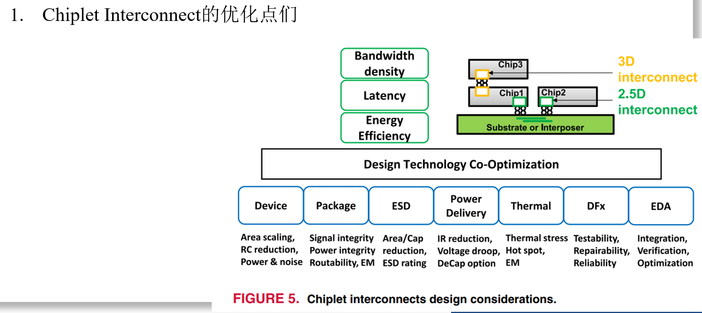

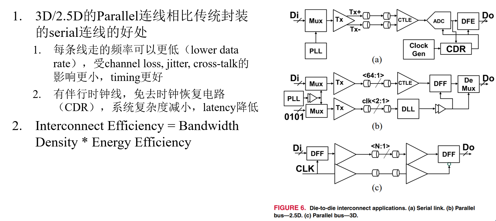

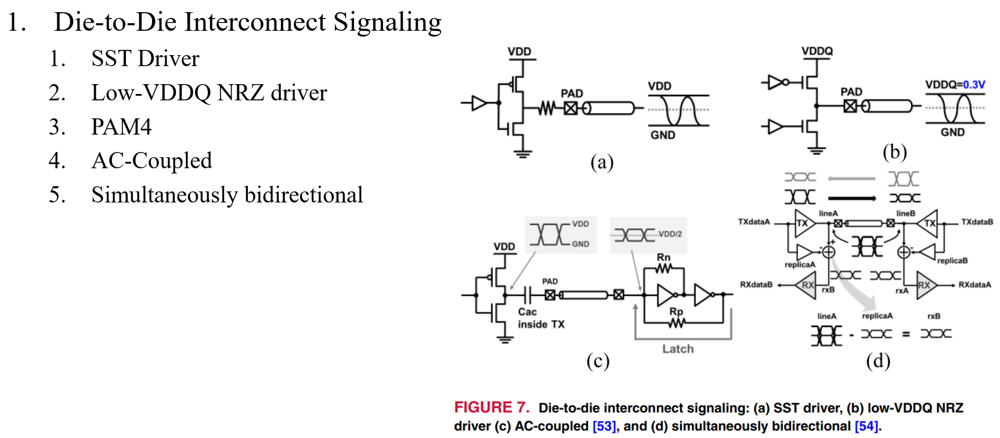

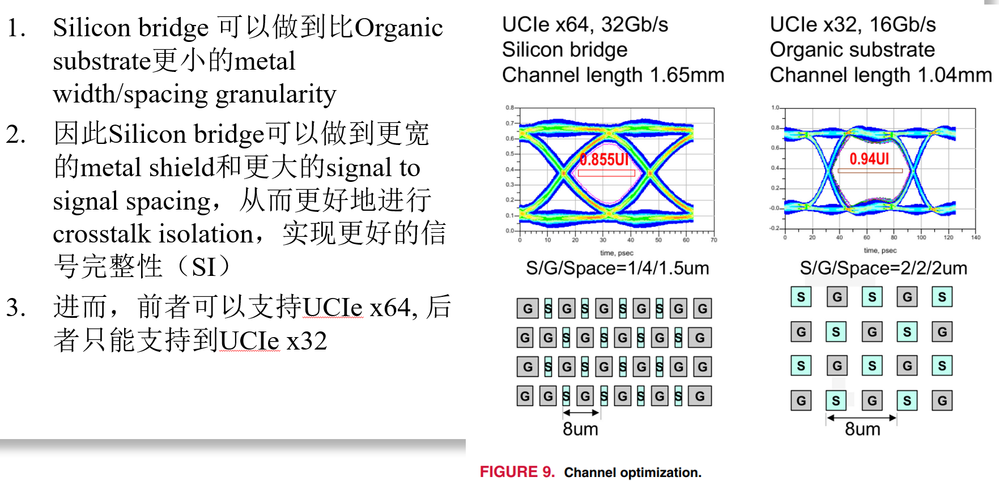


# Leveraging Thermally-Aware Chiplet Organization in 2.5D Systems to Reclaim Dark Silicon (DATE'18)

Dark Silicon: 随着工艺尺寸下降，core的数量变多，但power density上升，这导致所有的core不能同时全速工作/开启。

本文旨在**开发一种2.5D Chiplet Organization方法，使得more activte cores can operate at higher frequency simutaneously**

### 现存解决Dark Silicon问题的方案

``specialized cores``: 类似ASIC，把不同任务的通用算子抽出来，设计专用核心，使得每一分功耗都花在刀刃上。

``DVFS``：通过动态电压调整，降低系统的一部分性能，从而满足整体的power budget

``approximate computing``：用精度和可靠性来换能效

``power budgeting``：允许系统根据实际负载和温度情况调整功耗，而不是始终以固定的设计最大功耗（TDP, thermal design power）运行。

``Computational sprinting``：允许大量core在超过热限制(thermal power budget)的情况下短暂运行一段时间（in short bursts）（在burst之后需要一段时间的cooling down）

### 一些用来做实验的模型

计算on-chip links and routers的功耗--> DSENT

计算2.5D interconnect model的inter-chiplet links的power --> HSpice, M. A. Karim, P. D. Franzon, and A. Kumar, “Power comparison of 2D, 3D and 2.5D interconnect solutions and power optimization of interposer interconnects,” in Proc. ECTC, 2013, pp. 860–866.

cost and yield of the CMOS Chiplets: [10]（calculate CMOS dies per wafer and interposer dies per wafer, CMOS chiplet yield, CMOS perchiplet cost and interposer cost, and the overall cost of a 2.5D system, respectively）


### 一些前置结论

制造时的defect density越大，做chiplet带来的cost saving越显著。

加大chiplet之间的spacing可以便利散热，但是热点依然存在（因为chiplet本身的power density较高）

### 实际优化过程

符号说明


优化函数及限制条件


用来加快仿真速度的多起点贪心算法


其实本文主要讲的是：把一个多核系统变成interposer上的2.5D chiplet系统，可以有效降低成本，提高性能。本文的对比对象都是single chip multi-core，而不是其他chiplet系统。


# Runtime Performance Optimization of 3D Microprocessors in Dark Silicon (TC'21, 成电)

主题：考虑3D的竖直+水平热效应，以Cache-Core 3D堆叠为例，研究最优化的core/cache设置（含active cores的分布和V/f levels，含cache banks的数量和分布），以最终优化系统throughput

Related Work引用了一堆3D+Thermal的论文，可以考虑往LLM上靠一靠


在同个水平面内，不把active cores集中放置（比如排成一排），而是分散、平均排列，可以收获更大的power budget。在不同水平面内，不把cache和core放在一个竖直直线上，而是分散、错开排列，可以收获更达的power budget。如图


cache bank的数量过多或者过少都会降低系统性能。如数量过多，active core的thermal pressure过大，被迫通过DVFS降低V/f levels，影响性能。如数量过少，cache hit ratio过低，影响性能。


# Cadence White Paper: Thermal Analysis of 3D Stacking and BEOL Technologies with Functional Partitioning of Many-Core RISC-V SoC

### 不同的3D堆叠方式对检测到的$T_{max}$的影响（温度越低越好）（即，强调了3D-partitioning的重要性）

M: memory; L: logic; o: on


Memory-on-Logic表现最差，因为Logic的Power Density (PD)很高，把Logic放在下面，远离了最上面的heat sink，影响散热。

Logic-on-Logic表现中等，把memory和logic在两个不同的die上分别分散，减轻了散热压力

Logic-on-Memory表现最好，把高PD的logic放在离heat sink最近的地方，最方便散热。该方案的$T_{max}$表现甚至媲美2D-baseline


# A Cross-Layer Methodology for Design and Optimization of Networks in 2.5D Systems (ICCAD'18, Boston Uni.)

cross-layer: optimize the network design & chiplet placement jointly across logical, physical, and circuit layers

很专业，但主要讲的是一堆指标下的EDA优化，没什么具体point，其实是介绍了一个工具。thermal只是其中一个方面

此作为Leveraging Thermally-Aware Chiplet Organization in 2.5D Systems to Reclaim Dark Silicon, DATE'18的续作

# Achieving Datacenter-scale Performance through Chiplet-based Manycore Architectures (DATE'23, Washinton State University)

这篇文章不提出具体方法，是综述类型，讲了目前有的一些NOP体系结构工作，比如SWAP （面向Deep learning应用，采用MOO优化）还讲了比较常用的Chiplet Evaluation工具，比如SIAM (for 2.5D PIM), HeteroGarnet (for traditional von-Neuman based architectures consisting of CPU, GPU and memory chiplets), Kite

新的概念：把chiplet内部不同核之间的network叫做NoC，把chiplet之间的互联网络叫做NoP

由于TEFLON和Floret都是这哥们写的，剩下的部分都在兜售私货

# An Evaluation Framework for Dynamic Thermal Management Strategies in 3D MultiProcessor System-on-Chip Co-Design (TPDS'24, Switzerland)

发布一个工具，3D-ICE 3.1,用来做Dynamic Thermal Management (DTM)。该工具基于MOO+强化学习 （Multi-agent reinforced learning）

Dynamic Thermal Management （动态调整各个单元的频率，而不是直接关闭某些单元）

- **任务调度阶段**：通过“最低温度策略”，优先将任务分配给温度较低的空闲核心，以实现更均匀的温度分布。
- **热建模阶段**：3D-ICE 3.1通过非均匀热建模技术，根据不同的功率密度和热特性，对不同区域的热网格进行定制化离散化，提高模拟的准确性和效率。
- **动态热管理阶段**：MARL方法在运行时动态调整核心的工作频率，以平衡温度、性能和能耗，确保温度分布的均匀性和避免局部热点的形成。

启发：

- 自己的文章可以借鉴这篇文章的任务调度方法，即，优先将任务分配给温度较低的空闲核心。目标应该立足在多个LLM任务在超大规模3D multi-core chiplet上的同时运行。需要有一种考虑节点之间通信开销的机制，但不能是华盛顿大学的SFC。是否可以开发出一种机制，针对3D chiplet中的vertical link通信速度较快但热扩散较差，horizontal link通信速度较慢但热扩散较好的特性，构成一对矛盾点，或者最开始把需要多die协同的任务更多map到vertical link上，随着温度的升高，尝试把一些任务offload到horizontal link上。
- 或者说，在map的时候考虑任务的priority，考虑一个场景，对于优先级高的任务，通过map到vertical link上，优先保障其快速执行。
- 或者，把3D拓扑划分为垂直区域和水平区域，同个任务在一个区域内执行，区域内保证极高的通信效率，以区域为单位展开thermal分析和调度，区域之间


# 图分割算法（Graph Partitioning Algorithm）


一个图分割成V1和V2两部分，用来cut成V1和V2的需要Q条边edge

Graph Cut和Normalized cut在算法中最常见，Quotient Cut比较少用，因为min函数不可微分

### Karger算法


使用蒙特卡洛方法随机取一个边，merge这个边连接的两个节点；重复上述过程直至只剩下2个节点。则最后剩下的这两个节点之间的edge数就是所需的cut数。

这个算法如果只运行一次，得到minimum cut的概率是很低的（大概2/n^2）

但可以运行这个算法n^2次（可以并行地run ），从中选取最小cut


# Challenges and Opportunities to Enable Large-Scale Computing via Heterogeneous Chiplets (ASP-DAC'24)

综述性质的文章

Thermal方面推荐了几篇值得一读的文章


# Computing in the Dark Silicon Era: Current Trends and Reserach Challenges (IEEE Design & Test'2016, NY Uni.)

非常全面且有启发性的文章，值得后续反复精读

DVFS有趣的状态分类：dark (powered-off), gray (operating at low voltage and frequency), bright (powered-on at nominal voltage and frequency), boosted (operating at boosting level with high voltage frequency)


# Big-Little Chiplets for In-Memory Acceleration of DNNs: A Scalable Heterogeneous Architecture (ICCAD'22, Arizona State Uni.)

仿照ARM大小核，把chiplet分成big-little。

根据DNN前面的层have more activations between layers but fewer weights，后面的层have more weights and fewer activations的特点，把DNN前面的层map到little chiplet上，并把little chiplet用Interposer-based NoP连接以获得更高的带宽。把DNN后面的层map到bit chiplet上，并用更小带宽的Silicon bridge-based NoP连接。

搞大小chiplet还有一个原因，RRAM-based Chiplet如果IMC (in-memory computing)利用率太低的话，会导致energy和latency的浪费。把计算较轻的map到small chiplet，计算较重的map到big chiplet可以提高总体IMC利用率。


# HALO: Communication-Aware Heterogeneous 2.5D System for Energy-Efficient LLM Execution at Edge (JETCAS'24, India)

IMC (in-memory computing) systems用来mapping activation × weight

CMOS-based systems用来mapping attention和其他非线性算子

把IMC和CMOS-based systems在2.5D系统上集成

Transformer Inference过程中，inter-chiplet communication的量随embedding size的增大而在增大，随sequence length的增大而增大


比较有意思的是其mapping算法

对于transformer，把每个encoder和每个decoder叫做一个phase，则对于标准的transformer，有12个phase。


每个phase (encoder/decoder)包含一系列不同的运算操作。把这些运算操作分类成不同的computing clusters。每个encoder phase被划分为6个computing clusters，map到6个chiplet上；每个decoder phase被划分为10个computing clusters，map到10个chiplet上。


M是s和d两个节点之间的曼哈顿距离，v_{s,d}是权重

### mapping算法

在选取的1.5倍cluster的chiplet空间内，由于整个design space很大。如果phase内需要map的compute clusters较少（比如encoder），可能的mapping数量比较小，此时采用相对compute-intensive的Branch-and-Bound算法，利用BB算法在某个branch的cost不满足条件时cut掉branch的特性，减小搜索空间；如果phase内需要map的compute clusters较多（比如decoder），可能的mapping数量很大，就可以采用相对不那么compute-intensive的customized sequential 算法，减小计算量的同时确保mapping很紧密。


关于customized sequential算法，kimi的解释很形象。

### Key Steps

1. **Chiplet Position Filtering**:
   - The algorithm first identifies chiplets that are within a Manhattan distance of 1 or 2 from already occupied chiplets. This helps maintain proximity to previously mapped components, which is beneficial for communication efficiency.
2. **Sorting by Availability**:
   - The identified chiplets are then sorted based on how many unused chiplets are within a Manhattan distance of 1 from each candidate chiplet. This sorting helps prioritize chiplets that have more available neighbors for subsequent mappings.
3. **Sequential Mapping**:
   - The algorithm creates two mappings starting from different ends of the sorted list of chiplets. This helps explore different potential mappings efficiently without performing an exhaustive search.
4. **Cost Comparison**:
   - Finally, it compares the cost of the two mappings using the cost function (which considers both communication volume and Manhattan distance) and selects the one with the lower cost.

  

Let me clarify steps 2 and 3 of the customized sequential algorithm with an analogy:

Imagine you're organizing a party and need to assign guests to tables. Some tables are already occupied, and you want to seat new guests close to existing ones while keeping track of available space.

**Step 2**: "Number of chiplets not used for mapping and within a Manhattan distance of 1 for each element in P" This is like counting how many empty seats are available next to each candidate table (within arm's reach) where you could potentially seat new guests. In the algorithm, for each candidate chiplet (table), we count how many adjacent chiplets (seats) are still available.

**Step 3**: "Arrange elements in P in the order of increasing N'" This is like sorting the candidate tables based on how many empty seats they have next to them. Tables with fewer empty neighboring seats come first in the list. This helps you prioritize tables that might be getting full, ensuring you use the space efficiently.

In the context of mapping computing clusters to chiplets:

- We first identify chiplets that are close to already mapped ones (within distance 1 or 2)
- Then count how many adjacent chiplets are still available for each candidate
- Finally sort the candidates so we consider those with fewer available neighbors first

This helps create a mapping that:

1. Keeps related computations close together (reducing communication distance)
2. Uses the chiplet grid efficiently
3. Leaves more flexibility for subsequent mappings

### 为什么用两种不同的mapping算法混合在一起而不是单一一种？

The paper uses two separate mapping algorithms—Branch and Bound and the Customized Sequential Algorithm—because they each have strengths in different scenarios. Here's why both are used:

### 1. Different Problem Sizes

- **Branch and Bound**: Works best for smaller phases with fewer computing clusters. When the number of possible mappings is below a threshold (tperm), this algorithm can efficiently explore the design space to find optimal or near-optimal solutions.
- **Customized Sequential Algorithm**: More efficient for larger phases with many computing clusters. When the number of possible mappings exceeds the threshold, this algorithm provides a practical way to find good solutions without the computational overhead of exhaustive search.

### 2. Trade-off Between Optimality and Efficiency

- **Branch and Bound**: Guarantees finding the optimal solution but can be computationally expensive for large problems.
- **Customized Sequential Algorithm**: Doesn't guarantee the absolute optimal solution but provides good solutions much faster, making it suitable for larger design spaces.

### 3. Complementary Approaches

The two algorithms work together to handle different parts of the mapping problem:

- Branch and Bound is used when the design space is small enough to allow for more thorough exploration.
- The Sequential Algorithm is used when the design space becomes too large, providing a heuristic approach that balances solution quality with computational efficiency.

### 4. Adaptive Mapping Strategy

By using both algorithms, the system can adapt to different phases of the transformer algorithm:

- For phases with fewer computing clusters, Branch and Bound finds optimal mappings.
- For phases with many computing clusters, the Sequential Algorithm maintains efficiency while still producing good mappings.

This combination allows the system to handle a wide range of transformer algorithm sizes while maintaining both performance and computational practicality.


# Optimization of Interconnects Between Accelerators and Shared Memories in Dark Silicon (Jason Cong)

Challenge: accelerator比cpu运算速度快100倍，对访问shared-memory的带宽需求更大，如何设计accelerator和shared memories之间的这个interconnect很难很重要。

related work: 有人把accelerator当成CPU core一样放在NoC里面连接，这样显然支撑不起加速器对带宽的巨大需求（因此本文采用shared bus而非NoC的形式连接加速器和共享存储）

提出的三个优化方法：

- intra-accelerator和inter-accelerator的port应该分两个层次考量（two-step optimization）
- 由于dark silicon，只有一部分加速器可以被powered on，相应的，interconnect也应该被partially populated to just fit the data access demand limited by the power budget
- 有些加速器一起被激活的概率较高（同一个application domain），可以利用这部分历史信息来设计interconnect(把这些加速器分散开，以使其访问的memory bank分散，进而减少routing的冲突概率)

### CPU和加速器在访存上的带宽区别


一般CPU的每个core只会间隔好几个cycle才发起一个访存请求，所以可以简单用一个arbitrater来充当系统总线，完成互联功能

加速器每个时钟周期可能就要通过自身的n个port发起对不同memory bank的几个访存需求，系统总线设计相对困难。同时，由于加速器内部各种操作排得很紧，需要memory返回回来的延时低一些，这要求不能像NoC一样有多级仲裁。


### 本文提出的结构


设计成crossbar结构。The configuration of the crossbar is performed only upon accelerator launch. Each memory bank will be configured to connect to only one accelerator (only one of the switches that connect the memory bank will be turned on). When accelerators are working, they can access their connected memory banks just like private memories, and no more arbitration is performed on their data paths

### 问题建模

Definition 1. Suppose the total number of accelerators in an accelerator-rich platform platform is k; the number of data ports of the accelerators is n; 1 the number of memory banks in the platform is m; and the maximum number of accelerators that can be powered on under power budget in dark silicon is c. The routability of the crossbar is defined to be: the probability that the a randomly selected workload of c accelerators out of the total k accelerators can be routed to c×n memory banks via c×n separate data paths in the crossbar. 

**The goal of this work is to optimize the crossbar for the fewest switches while keeping high routability.**


# Exploiting Dark Cores for Performance Optimization via Patterning for Many-core Chips in  the Dark Silicon Era (NOCS'18)

本文聚焦dark silicon patterning（把dark cores间隔在active cores中间以起到辅助散热的效果），围绕dark silicon patterning会产生的active core之间的communication distance increase问题 & bubble cores太多导致active cores不够用问题，提出一种静态和动态结合的patterning方法。


上图表明patterning的效果很好

### Challenge

- the number of available / free cores changes with the arrival and departure of applications （也就是动态的负载如何处理）
- 放了bubble用来散热之后，active core之间的通信距离变长了

### Contribution

- 提出了一个static patterning算法来mapping 各种applications
- 提出了一个dynamic patterning算法来进行task migration （hot cores --> cool cores），以期用最小的通信成本实现更高的性能收益

### Related Work

多数mapping的工作聚焦把tasks给map得更近，以降低通信成本 --> 这样没有考量到power budget的问题

有一些mapping的工作聚焦在通过DSE降低peak temperature和temperature gradient.

这些静态mapping的工作无法避免在execution的时候形成Hotspot --> dynamic的方法可以解决这一点

现存的动态mapping的方法：

- global coolest migration. 找个全局温度最低的core，把task migrate到这个core上（通信距离最长）
- random migration: 随机找个cool core去task migration
- neighbor swapping：hot tasks are migrated to neighbor cores if th elatter is cooler（通信距离最短，可能导致irregular application core region，进而导致future applications的通信距离更长）

### proposed的静态mapping方法

分成偏向communication的task和偏向computation的task，用两套算法来做mapping.

### Communication-Biased 算法步骤

1. **初始映射**：
   - 目标是最小化通信距离。
   - 找到一个凸核区域，将通信量较大的任务映射到彼此更近的位置。
   - 使用特定的映射算法来实现这一目标。
2. **插入气泡**：
   - 在每次迭代中，将气泡虚拟地插入到应用的核心区域，以提升某些任务的计算性能。
   - 在插入气泡时，会考虑如何最小化通信距离。
   - 例如，将气泡从核心区域的边界迁移到内部的特定位置，同时更新任务的映射，以保持通信的高效性。
3. **移除气泡**：
   - 基于通信量来优化路径。
   - 对于任务图中的每条通信边，将任务迁移到更靠近其通信伙伴的空闲核上，并重新计算应用的性能。
   - 如果性能得到提升，则将任务虚拟地迁移到该空闲核上，并将气泡迁移到任务的原始位置。
   - 然后，气泡被排除在应用之外。
   - 逐步移除气泡，以得到不同气泡数量下的性能。

### Computation-Biased 算法步骤

1. **初始映射**：
   - 从一个较大规模的核心区域开始，其中一部分核被设置为气泡（关闭状态）。
   - 根据任务的计算负载（如最坏情况执行时间），将任务映射到彼此尽可能远的位置，以减少热干扰，从而允许每个任务在较低的温度下以更高的频率运行。
2. **插入气泡**：
   - 将气泡迁移到任务附近，以提升计算性能。
   - 在插入气泡时，会考虑如何优化计算性能。
   - 例如，将气泡迁移到任务附近，以降低任务的温度，从而允许任务以更高的频率运行。
3. **移除气泡**：
   - 基于计算负载来优化核的温度分布。
   - 将计算密集型任务迁移到温度较低的核上，并移除这些核周围的气泡，以进一步降低温度，从而允许这些核以更高的频率运行。
   - 动态调整任务的分布，以减少热干扰，即使这会增加通信距离。
   - 逐步移除气泡，以得到不同气泡数量下的性能。

### 为什么先插入气泡，再移除气泡

在 static patterning 中，先插入气泡（bubbles）再移除气泡的操作顺序是为了在不同的性能优化目标之间进行权衡和选择。这种顺序的主要原因如下：

### 1. **探索不同的性能优化可能性**

- **插入气泡**：通过插入气泡，算法可以探索在不同气泡数量和位置下，应用的通信和计算性能的变化。这一步是为了生成多种可能的映射方案，以便后续选择最优的方案。
- **移除气泡**：在插入气泡后，算法通过逐步移除气泡来评估不同气泡数量对性能的影响。这一步是为了在实际的资源约束下，找到最优的气泡数量和位置，以实现性能的最大化。

### 2. **优化通信和计算性能**

- **通信性能优化**：在 communication-biased 算法中，插入气泡是为了在初始映射中尽量保持任务之间的通信效率。通过插入气泡，可以调整任务的映射位置，以减少通信距离。随后，通过移除气泡，可以进一步优化通信路径，确保在实际资源分配中通信性能仍然保持高效。
- **计算性能优化**：在 computation-biased 算法中，插入气泡是为了在初始映射中尽量减少热干扰，提升计算性能。通过插入气泡，可以将任务映射到温度较低的核上，从而允许这些核以更高的频率运行。随后，通过移除气泡，可以进一步优化核的温度分布，提升整体的计算性能。

### 3. **资源分配的灵活性**

- **插入气泡**：插入气泡提供了更多的资源分配灵活性，允许算法在不同的资源分配方案中进行选择。这一步是为了生成一个初步的映射方案，以便后续进行进一步的优化。
- **移除气泡**：移除气泡是为了在实际的资源约束下，调整和优化初步的映射方案。通过逐步移除气泡，算法可以找到在实际可用资源下最优的映射方案。

### 4. **算法的迭代优化过程**

- **插入气泡**：插入气泡是算法的初始探索阶段，用于生成多种可能的映射方案。
- **移除气泡**：移除气泡是算法的优化阶段，用于在实际资源约束下，逐步调整和优化映射方案，以达到性能的最优。


CCR：computation to communication rate


### Dynamic Patterning

分成两步：1. 根据application的特性找一种task migration的pattern. 2. 确定bubble number, aspect ratio (the ratio of the width to the height) of the core region, followed by finding the location of the core region（用分两层的树搜索算法）

### 文章采用的三种pattern


square shifting的好处：migration之后task之间的位置关系保持不变，不会增加communication latency。适合：workload比较小，有足够的core 可以用来整片地迁移

confined neighbor swapping shifting好处：只会增加一点点的communication latency。适合：workload很重，没有足够的available core，application的communication volume很重

confined local coolest shifting好处：被migrated的task在迁移之后可以跑到更高的频率。适合：workload很重，没有足够的available core, application的computation需求很重

### 粗略的mapping结果


如果workload较轻（arrival rate较低），倾向于选择square shifting；如果workload较重，且注重通信效率，倾向于选择confined neighbor swapping pattern；如果workload较重，且注重计算效率，倾向于选择confined local coolest shifting pattern


# Thermal Implications in Scaling High-Performance Server 3D Chiplet-based 2.5D SoC from FinFET to Nanosheet (IMEC, ISVLSI'24)

主要讲3D Chiplet的一些thermal特性，包括工艺差异、workload差异、LOM还是MOL差异对thermal表现的影响，及frequency和Max temperature的关系


# QSCORES: Trading dark silicon for scalable energy efficiency with quasi-specific cores (MICRO'11)

QSCORE（Quasi-specific Cores）是一种准专用核心，旨在通过执行多个通用计算，提供比通用处理器高一个数量级的能效。其设计流程基于应用内外存在相似代码模式的洞察，通过挖掘和利用这些相似模式，使少量专用核心能支持大量常用计算。在包含 12 个应用的多样化工作负载上，QSCORE 提供类似 ASIC 的能效，同时减少专用核心数量超 50%，面积需求减少 25%。

### 设计流程

1. **依赖图生成** ：将应用热点代码表示为程序依赖图（PDG），节点代表语句，边代表控制和数据依赖。
2. **挖掘相似代码模式** ：使用 FFSM 算法在 PDG 中寻找相似子图，识别可合并的代码段。
3. **合并程序依赖图** ：创建新的 QSCORE 依赖图节点，添加控制和数据依赖边，并生成变量集，以支持多个计算。
4. **QSCORE 生成** ：将依赖图顺序化，生成有效的 C 表达式，并最终生成 QSCORE 硬件。

### “相似代码模式”

**灰度转换函数：**

cCopy

```c
void rgb_to_grayscale(Image img, Image gray) {
    for (int i = 0; i < img.height; i++) {
        for (int j = 0; j < img.width; j++) {
            gray.pixels[i][j] = 0.299 * img.red[i][j] + 0.587 * img.green[i][j] + 0.114 * img.blue[i][j];
        }
    }
}
```

**二值化处理函数：**

cCopy

```c
void grayscale_to_binary(Image gray, Image binary, int threshold) {
    for (int i = 0; i < gray.height; i++) {
        for (int j = 0; j < gray.width; j++) {
            binary.pixels[i][j] = (gray.pixels[i][j] >= threshold) ? 255 : 0;
        }
    }
}
```

这两个函数都包含嵌套的循环结构，对图像的每个像素进行操作。它们的控制流相似，都是通过双层循环遍历图像的每个像素，只是具体的操作不同：一个是计算灰度值，另一个是根据阈值进行二值化。

例如，在多个数据处理函数中，都存在对数据数组进行遍历的循环结构。如下所示的两个函数，虽然具体操作不同，但都包含对数组元素的逐个处理：

cCopy

```c
// 函数 1：计算数组元素的和
int array_sum(int *array, int length) {
    int sum = 0;
    for (int i = 0; i < length; i++) {
        sum += array[i];
    }
    return sum;
}

// 函数 2：对数组元素进行平方操作
void array_square(int *array, int length) {
    for (int i = 0; i < length; i++) {
        array[i] = array[i] * array[i];
    }
}
```

这两个函数都包含一个循环，对数组的每个元素进行操作，它们的控制流结构相似。

### 总结而言

QSCORE是介于ASIC和通用处理器之间的产物。它不像 ASIC 那样为特定任务高度定制，也不像通用处理器那样能够执行任何类型的计算任务。QSCORE 是为特定类型的计算模式设计的，这些模式在多个应用中存在相似性。例如，它可能针对循环结构、数组操作、矩阵计算等常见的计算模式进行优化。这意味着 QSCORE 在这些特定计算模式上具有高效的执行能力，但无法像通用处理器那样适应所有类型的计算任务。QSCORE 的目标是在性能和能效之间取得平衡。它通过专用硬件结构提高特定计算模式的执行效率，同时保持较低的功耗。然而，这种平衡也意味着它在某些方面可能不如 ASIC 那样极致优化，也不如通用处理器那样具有广泛的适用性。


# GIA: A Reusable General Interposer Architecture for Agile Chiplet Integration (计算所，ICCAD'22)

interposer带来高昂的NRE (Non-recurring engineering)成本和较长的设计周期

### Contribution:

- 提出了一种可重用的interposer （包括active的和passive的），可以通过interposer上的router配置实现不同的Chiplet拓扑。
- 提出了对应的自动化策略去 select chiplets, generate inter-chiplet network, place chiplets, and perform GIA mapping
- 实验结果


# EIGEN： Enabling Efficient 3DIC Interconnect with Heterogeneous Dual-Layer Network-on-Active-Interposer (HPCA'24)

把interposer上的路由网络分成两层，上面的AspLayer（应用层）（application-aware switch-programmable interconnect layer）是application-specific的，对大通量、高优先级的通信，支持低延迟的single-hop communication (直接用switch)，下面的DynLayer层(dynamic packet-routing interconnection layer)承担不那么大通量、高优先级的控制和访存 (用的是router)


有点类似mainband和sideband的划分，mainband（形如ASPLayer），承担主要的数据通信任务；sideband（形如DynLayer），承担控制等次要的数据通信任务，防止和mainband抢占NoC带宽。


# SCAR：Scheduling Multi-Model AI Workloads on Heterogeneous Multi-Chiplet Module Accelerators (MICRO'24)

