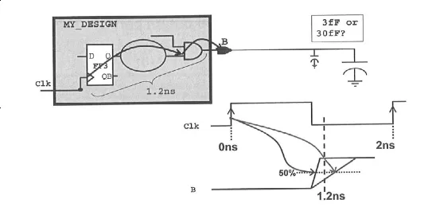

---

layout:     post
title:      DC Synthesis
subtitle:   DC Synthesis
date:       2024-11-27
author:     George Lin
header-img: img/post-bg-ios9-web.jpg
catalog: true
tags:
- Synthesis
---

## 服务器DC综合命令

ilaunch -l dc_shell dc_shell -f xxxx.tcl


## DC综合过程

- Translate: 将 RTL 级描述转化为 GTECH 库元件组成的逻辑电路。GTECH 是 DC 内部统一使用的独立于工艺库的通用元件库。（Generic Boolean）
- Optimization :是将门级网表按设计者的约束进行优化，以满足时序、面积等要求。例如调整路径、增修门电路等。
- Mapping 是将 GTECH 网表映射到指定的工艺库，此网表包含了工艺参数。


## get_*类命令

get_* 类命令，用于设计对象或库对象的访问，支持 ? (至少一个单字符匹配) 和 * (零个或多个字符匹配) 匹配。

可以使用 help get_* 获取全部的 get_* 类命令。


常用的此类命令说明如下：

| 命令          | 说明                                                         |
| ------------- | ------------------------------------------------------------ |
| get_cells     | 返回顶层设计中的 cell，如果返回整个层次设计中的 cell 需要加选项参数 -hier |
| get_clocks    | 返回设计中的时钟，时钟不局限于顶层模块还是子模块，也不局限于时钟定义在顶层模块端口上还是子设计模块内部中 |
| get_designs   | 返回 design，不局限于是顶层模块还是子模块                    |
| get_libs      | 返回 DC Memory 中调用的库                                    |
| get_lib_cells | 返回库中指定的 cell                                          |
| get_lib_pins  | 返回库中指定的 cell 的 pin                                   |
| get_nets      | 返回顶层设计中的 net ，如果返回整个层次设计中的 net 需要加选项参数 -hier |
| get_pins      | 返回顶层设计中的 pin ，如果返回整个层次设计中的 pin 需要加选项参数 -hier 。pin 总是与 cell 相关联。 |
| get_ports     | 返回顶层设计中的端口信号。也可以设置 -hier 选项参数，返回其他 design 的端口信号。 |


## all_* 类命令

形如 all_* 类的命令，可用于返回或设置所有同类的对象。可以使用 help all_* 获取全部的 all_* 类命令。

常用的此类命令说明如下：

| 命令           | 说明                                             |
| -------------- | ------------------------------------------------ |
| all_inputs     | 返回当前设计的所有 input 和 inout 端口           |
| all_outputs    | 返回当前设计的所有 output 和 inout 端口          |
| all_clocks     | 返回当前设计的所有时钟，不局限于顶层模块         |
| all_registers  | 返回当前设计的所有寄存器，可指定层次 (hierarchy) |
| all_ideal_nets | 将所有 nets 对象都设置为理想型 (无延迟)          |

仍然使用上个示例 DC Memory 中的内容结构图，all_* 类命令举例如下：

1◆ all_inputs

会返回 {A B C D CLK}

2◆ all_outputs

会返回 {ZOUT[0] ZOUT[1]}

3◆ all_registers

会返回 {I_REG/Z_reg[0] I_REG/Z_reg[1] }

4◆ all_inputs C*

会报错，all_* 类命令不支持通配符访问

5◆ remove_from_collection [all_inputs] [get_ports CLK]

会返回 {A B C D}，所有 input port 去除了 CLK port 的集合


## 对象属性

为了更好的记录电路的功能与时序，DC 为设计对象提供了多个属性。不同设计对象的常用属性简单罗列如下：

| 对象   | 属性                                                         |
| ------ | ------------------------------------------------------------ |
| cell   | is_mapped：映射的dont_touch：不做移动（优化）的is_hierarchical：分层的子设计... |
| clock  | period：周期is_generated：分频时钟产生clock_rise_transition：时钟上升沿转换时间dont_touch_network：相联网络不做优化... |
| design | dont_touch：不做优化is_hierarchical：子设计模块is_mapped：映射的max_dynamic_power：最大动态功耗... |
| net    | dont_touch：不做优化ideal_net：理想线网（没有延时）load ：负载...... |
| pin    | dont_touch_network：相联网络不做优化is_async_pin：异步 pinmax_rise_delay：最大上升延迟... |
| port   | dont_touch_network：相联网络不做优化pin_direction：方向load：负载max_capacitance: 输入端口的最大电容... |


## 集合相关命令

DC 设计中，访问的设计对象往往是同类型中的多个对象，可谓之集合。DC 提供了一系列处理对象集合的命令，如下表所示：

| 集合命令               | 说明                     |
| ---------------------- | ------------------------ |
| add_to_collection      | 增加新的对象至集合中     |
| compare_collection     | 集合比对，相同则返回 0   |
| copy_collection        | 集合复制                 |
| filter_collection      | 按一定条件对集合进行筛选 |
| foreach_in_collection  | 集合遍历                 |
| index_collection       | 索引集合中的对象         |
| remove_from_collection | 从集合中删除特定对象     |
| sizeof_collection      | 返回集合中对象的数量     |
| sort_collection        | 返回排序后的集合         |


------

## read_verilog 命令读取

工艺库设置完成后，就可以对 RTL 设计文件进行读取。本教程涉及的 RTL 均为 Verilog 语言编程编写。RTL 文件的读取方式主要有 2 种：read_verilog 和 analyze。

DC 使用 read_verilog 命令读取 RTL 设计文件。建议使用 current_design 命令指定顶层设计的名字，并做 link 链接、check_design 设计检查等操作。

例如某设计文件层次关系如下图所示。


则**建议的读取 RTL 设计文件的代码**为：

```
read_verilog {Top.v A.v B.v}
current_design MY_TOP
link
check_design
```

(1) read_verilog 为 DC 读取设计文件的命令，将 RTL 设计翻译成 DC 内部可识别的 gtech 格式的文件，包含一些时序、库信息等。

(2) current_design 为 DC 设置顶层设计模块的命令，建议显式使用。如果没有显式的指定顶层设计模块的名字，则 DC 会根据 read_verilog 读取文件的方式进行自动设置。


◆ 当一次性读入多个文件时，DC 会将第一个文件中的模块，设置为顶层设计。

```
# current_design is MY_TOP
read_verilog {Top.v A.v B.v}
```

◆ 当多次读入多个文件时，DC 会将最后一个文件中的模块，设置为顶层设计。

```
# current_design is MY_TOP
read_verilog A.v
read_verilog B.v
read_verilog TOP.v
```

◆ 当一个文件中包含多个设计模块时，DC 会将文件中的第一个模块，设置为顶层设计。

```
# current_disign is MY_A
read_verilog TOP_hier.v
```


(3) link 为 DC 链接设计的命令，主要用于将所有的设计文件以及库文件链接到当前的顶层设计中。一般 DC 中的 check_/report_/compile 命令都会首先进行不显式的 link 操作。但是建议显式的增加 link 命令操作。

link 失败时返回值为 0，所以可以对返回值进行判断，出现错误及时停止 DC 过程，避免时间的浪费：

```
if {[link == 0]} {
	puts "Link Error!"
	exit ;
}
```

(4) check_design 命令用于检查设计中的连接性、层次结构等问题，例如端口信号缺失、模块多重例化等。

check_design 失败时返回值为 0，所以也可以对 check_design 返回值进行判断，出现错误时及时停止 DC 过程：

```
if {[check_design == 0]} {
	puts "Check_design Error!"
	exit ;
}
```

------

## analyze 命令读取

现在经常使用 analyze 与 elaborate 命令完成 RTL 设计文件的读取，命令如下：

\# -f 为 -format 的缩写

```
analyze -f verilog {Top.v A.v B.v}
elaborate MY_TOP
```

(1) analyze 命令用于源码文件的读取、语法检查并转化为二进制文件。

(2) elaborate 用于设计文件向 DC 内部可识别的 gtech 格式文件的转换，并完成 current_design 、link 等过程。所以使用 elaborate 时无需再使用 current_design 与 link 命令。

------

## DDC 文件生成

DC 读取设计文件的过程即为将设计翻译成 DC 内部可识别的 GTECH 网表或 ddc 格式文件的过程。此过程称为未映射的 （unmapped），因为还没有对目标工艺库进行相关映射。如果设计比较复杂，代码量较大，这个翻译过程还是比较耗时的。


**即便在没有修改 RTL 设计的情况下**，有时候还需要重新打开 DC 环境，对综合过程重新进行一些分析处理，那么再进行相同步骤的读取设计文件的过程，在时间消耗上显然是不经济的。

而 ddc 格式的文件包含翻译后的 GETCH 网表文件以及一些 timing 、工艺库信息，可用于调试大规模工程文件时的快速读取。


建议 DC 文件读取过程中增加写 unmapped ddc 格式文件的操作。**如果 RTL 有修改，则重新读取修改后的 RTL 文件列表是必不可少的。**


◆写 unmapped ddc 格式文件的命令如下：

```
write_file -f ddc -hier -out report/MY_TOP.unmapped.ddc
```

(1) write_file 为 DC 系统写文件命令，可输出多种格式的文件类型。

(2) -f ddc 表示写文件的格式为 ddc 格式，-f 为 -format 的缩写。

(3) -hier 表示当前 ddc 文件包含整个设计（current_design）的信息。

(4) -out report/MY_TOP.unmapped.ddc 表示指定输出文件的路径及名字，扩展名为 .ddc。-out 为 -output 的缩写。".unmapped" 也只是个人命名习惯。


◆下一次可以使用交互式模式启动 DC ，输入以下命令，即可完成对设计的快速读取：

```
# 移除其他 design 内容，防止干扰
remove_design -designs
# 读取上一次综合时输出的 ddc 文件
read_ddc MY_TOP.unmapped.ddc
# 设置顶层设计名称
current_design MY_TOP
# 链接
link
```


当 DC 完成设计对目标工艺库的映射时，该过程称为是映射的 （mapped）。此时也可以对映射后的设计信息进行保存，输出到 ddc 文件中，便于分析调试时快速读取。


◆写 mapped ddc 格式文件的命令与写 unmapped ddc 文件是完全一样的，只是位置、文件命名上有差异。写 unmapped/mapped ddc 文件命令在整个 DC 过程中的位置大概如下所示：

```
analyze -f verilog {Top.v A.v B.v}
elaborate MY_TOP
# 第一次写 unmapped ddc 文件
write_file -f ddc -hier -out report/MY_TOP.unmapped.ddc
# 编译命令，后续讨论
compile_ultra....
# 输出最终综合出的 PS 网表，后续讨论
write_file -f verilog -hier -out report/MY_TOP.mapped.v
# 第二次写 mapped ddc 文件
write_file -f ddc -hier -out report/MY_TOP.mapped.ddc
```


对设计进行约束，其实就是对设计中的信号、端口、模块等对象进行约束。DC 综合所描述的对象类型主要有两大类：设计对象 （design objects） 与工艺库对象 （library objects）。学习时序约束之前，首先学习下 DC 所描述的各种对象类型。

------

## 设计对象（design objects）

设计对象分为：design (设计)、port (端口)、cell (门单元) 、clock (时钟) 、net (线网) 和 pin (引脚？穿针？蹩脚的翻译) 。DC 时序约束对象都是针对 RTL 设计文件初步翻译后的 GTECH 网表，所以不再存在 reg 型变量，wire 型变量对应 net 对象。


各个设计对象在网表中的简单示意图如下：


(1) design 指顶层设计模块，以及其他非库单元的子设计模块

(2) port 指顶层设计模块的 input/output/inout 端口。

(3) cell 指网表中使用的库单元、集成 IP 或子设计模块的例化名字

(4) clock 特指时钟信号。

(5) net 指线网信号，起连接信号的作用。

(6) pin 指例化的门单元或子设计模块的端口名字，与 port 有所差异。


各个设计对象在原理图中的简单示意图如下：


------

## 工艺库对象（design objects）

工艺库对象分为：library name (库名称)、library cell (库单元)、 library pin (库引脚？库针？) 。人为可识别的工艺库文件扩展名为 .lib，在 《Verilog 教程高级篇》章节《6.1 低功耗设计》中已经略有涉及。各个库对象在 .lib 库文件中的简单示意图如下：


(1) library name 为 DC memory 中调用的工艺库名称。

(2) library cell 为工艺库中的门单元 （cell）。

(3) library pin 为工艺库中的门单元中的端口。

------

## 区分设计对象类型的必要性

DC 中区分多种对象类型的重要原因之一，就是为了更加清晰、快速、没有歧义的进行约束。

例如有一个 net 和一个 port 名字均为 SUM，设置其负载大小时（默认单位为 pF)，如果不指定其类型，则会出现歧义，例如如下命令和示意图：

set_load 5 SUM


仅从命令和设计上无法确定负载是设置在 SUM net 还是 SUM port 上。实验证明不指定对象类型时，负载会设置在 port 端口上。

如果使用以下命令指定设置的对象类型，则不会再出现歧义：

```
# 设置 SUM net 对象的负载
set_load 5 [get_nets SUM]
```

DC 系统命令 get_nets 访问并返回 net 类型的设计对象，访问对象类型的命令将在下一节阐述。


## 4 种时序路径

DC 进行时序分析时，都是基于同步时钟下的设计。假设数据都在时钟上升沿到来 (launch) 或输出，则 DC 会将设计分割成 4 种时序路径，如下图所示：


◆ Path1 指输入到寄存器的时序路径 (Input-to-Reg Path)

◆ Path2 指寄存器到寄存器的时序路径 (Reg-to-Reg Path)

◆ Path3 指寄存器到输出的时序路径 (Reg-to-Output Path)

◆ Path4 指输入到输出的时序路径 (Input-to-Output Path)


这些路径的起点和终点必须是固定的类型，说明如下：

◆ 起点必须是非时钟的输入端 (input port other than a clock port)，或触发器 (寄存器) 的时钟端。

◆ 终点必须是非时钟的输出端 (output port other than a clock port)，或时序元件的非时钟输入端 （例如触发器的 D 端）。


正常的静态时序分析 （Static Timing Analysis, STA） 主要包括 3 个步骤：

1> 将设计分割成多个时序路径

2> 计算每条时序路径的延时

3> 时序路径和数据到达时间 (arrival times) 做对比，判断时序约束是否满足 (meet)

------

## Reg-to-Reg Path 约束

时序约束时，时钟的下降沿只有在双边沿时钟设计中才会起作用。所以一般设计的时序约束都与时钟上升沿相关。

假设一个含有 Reg-to-Reg Path 的设计示意图如下：


此设计中，时钟周期 2ns，setup 为 0.2ns，则 FF2 的 clock 端到 FF3 的 D 端的最大延迟为：

```
Tmax = 2ns-0.2ns = 1.8ns
```

那么最简单的时钟约束可以编写为：

```
create_clock [get_ports Clk] -name sys_clk \        
-period 2 -waveform "0 1"
```

create_clock : DC Memory 中创建 clock 的命令 ；

[get_ports Clk] : 为创建的 clock 指定对应设计中的源 clock，源 clock 不一定是顶层模块中的 clock ，也可以是子模块中的 clock ；

-name sys_clk : 将创建的 clock 命名为 sys_clk，可以省略 ；

-period 2 : 指定创建的 clock 周期为 2ns ；

-waveform "0 1" : 表示时钟上升沿时刻为 0ns、下降沿时刻为 1ns，以此循环，间接指定了占空比。此选项也可以省略，则创建的时钟默认占空比为 50% 。

------

## clock 模型

关于时钟的基本概念，欢迎参考《Verilog 教程高级篇》中《5.2 时钟简介》一节。

时钟树综合 (Clock Tree Synthesis, CTS) 一般发生在 DC 之后的布局布线阶段。DC 阶段不进行时钟树综合，不允许插入缓冲单元 (buffer)。此时时钟网络认为是理想的，且具有无限驱动能力。

例如上述创建的 clock 模型中，时钟特性如下：

◆ 上升沿、下降沿转换时间为 0

◆ 时钟偏移为 0

◆ 时钟延迟为 0


但是还是建议在 DC 阶段对 clock 进行建模，估算时钟的各种特性，也为布局布线时的时钟树综合留有时间裕量。时钟特性的建模主要包括：时钟偏移、时钟延迟与时钟转换时间的估算模拟。


◆ 时钟偏移建模

时钟偏移模型通过设置时钟的不确定度来描述。时钟的不确定度参数，也包含了时钟抖动 (jitter)、裕量 (margin) 等参数信息。

假设某个设计示意图如下，时钟偏移量为 0.14ns，建立时间为 0.08ns，则时钟不确定度的设置描述如下：

```
create_clock [get_ports Clk] -name sys_clk -period 2
# -setup 0.14 表示时钟偏移设置为 0.14
set_clock_uncertainty -setup 0.14 [get_clocks sys_clk]
```

FF1 到 FF2 的最大延迟，即 FF2 的建立时间的检查时刻为：

```
2 - 0.14 - 0.08 = 1.78ns
```

设置时钟不确定度时，也可以指定不同的时钟域 (clock domain) :

```
set_clock_uncertainty -setup 0.14 \   
-from [get_clocks clk1] -to [get_clock clk2]   
```


◆ 时钟延迟建模

时钟延迟模型分为 2 种：时钟网络延迟 (network latency) 与时钟源延迟 (source latency)。

时钟网路延迟模型定义了从 clock port 或 pin 端 (create_clock 时指定的点) 到寄存器 clock 端的延迟。时钟源延迟定义了实际时钟原点 (clock origin) 到 clock port 或 pin 端的延迟。示意图如下：


如上图所示，假设时钟周期为 10ns，source latency 为 3ns，network latency 为 1ns，则时钟延迟的设置描述如下：

```
create_clock -period 10 [get_ports CLK]
# -source 指设定 source latency，不指定时设置 network latency
set_clock_latency -source -max 3 [get_clocks CLK]
set_clock_latency -max 1 [get_clocks CLK]
```

set_clock_latency 命令表示设置时钟的 latency 属性，指定 -source 选项时表示设置 source latency，不指定时表示设置 network latency。-max 表示指定延迟最大值，当然也可以使用 -min 表示指定时钟延迟最小值。


布局布线阶段，时钟树综合之后的具有一定实际延迟的时钟称为 propagated clock。DC 阶段不进行 CTS，所以需要设置 network latency 。布局布线阶段的 CTS 之后，时钟树具有实际的 latency，此时设置 network latency 的语句要改成：

```
# 布局布线时，network latency 需要设置实际的 propagated clock
# set_clock_latency -max 1 [get_clocks CLK]
set_propagated_clock [get_ports CLK]
```


◆ 时钟转换时间建模

时钟从上升沿跳变到下降沿，或者从下降沿跳变到上升沿时，并不是"直上直下" 的完成电平跳变，而是 "斜坡式" 需要一个过渡时间完成电平跳变。这个过渡时间称之为时钟的转换时间 (transition)，示意图如下。


假设某一设计中时钟的转换时间最大值为 0.1ns，则 clock transition 的设置语句描述如下：

```
set_clock_transition -max 0.1 [get_clocks CLK]
```


◆ 时钟模型小结

下图显示了时钟不确定度、时钟延迟、时钟转换时间的示意图，以及在 DC 和布局布线阶段的设置差异性。


uncertainty、latency 以及 transition 等时钟特性影响的是时序路径的长度。latency 作用于所有的时序路径，所以时序分析时会产生一种“抵消”的效果，不影响时序分析结果 (下一节介绍）。

工程设计时，往往使用 uncertainty 与 margin （时间裕量） 来进行时钟建模，避免繁琐的设置，也能为布局布线时的 CTS 留有一定的时长调节范围。


例如，带有 margin 和 uncertainty 的时钟模型描述如下：

```
set UNCERTAINTY 0.3
# 留有 30% 的裕量，作用在时钟周期上
set MARGIN 0.3
set PERIOD 10
create_clock [get_ports CLK] -period [expr $PERIOD*(1-$MARGIN)]
# 时钟模型只设置不确定度参数
set_clock_uncertainty -setup $UNCERTAINTY [get_clocks CLK]
```


## Input-to-Reg 约束

设置 Input-to-Reg 时序路径的约束时，不仅需要创建时钟模型，还需要设置输入延时 (input delay)。设置 input delay 时，需要假设输入 port 信号是与时钟相关联的，且 port 信号是在时钟上升沿到来之后延迟了一小段时间到达的 port 端。这一小段延迟时间称为 input delay。


假设上图中 port A 信号是在时钟到来之后的 0.6ns 达到，时钟周期为 2ns，clock uncertainty 为 0.3ns，建立时间为 0.2ns，则约束语句为：

```
create_clock -period 2 [get_ports Clk]
set_clock_uncertainty -setup 0.3 [get_clocks Clk]
set_input_delay -max 0.6 -clock Clk [get_ports A]
```

则 port A 到寄存器 FF2 的 D 端的 N 路径延时为：

```
Tmax = 2-0.3-0.6-0.2 = 0.9ns
```

只要 port A 到寄存器 FF2 的 D 端的延时小于 0.9ns，时序就能满足要求。


当所有输入端口延迟相同时，可利用以下语句进行时序约束：

```
set_input_delay -max 0.6 -clock Clk \   
[remove_from_collection [all_inputs] [get_ports Clk]]
```

当仅有一两个信号的输入延迟不同时，可以使用分别设置的方法，也可以使用覆盖设置的方法：

```
# 首先设置所有 input delay 为 0.6ns
set_input_delay -max 0.6 -clock Clk [all_inputs] 
# port A 的输入延时设为 0.7ns，则上一句 A 的输入延时属性会被覆盖
set_input_delay -max 0.7 -clock Clk [get_ports A]
# 去除掉 clock 端的输入延时设置
remove_input_delay [get_ports Clk]
```

------

## Reg-to-Output 约束

设置 Reg-to-Output 时序路径的约束时，也需要设置输出延时 (output delay)。

设置 output delay 时，也需要假设输出 port 信号是与时钟相关联的，且 port 端信号在延迟了一小段时间后可以到达可能存在的 ”下一级寄存器的 D 端“，并被时钟捕获。这一小段延迟时间称为 output delay。


假设上图中 port B 信号输出后到达下一级的 output delay (Tt + Tsetup) 为 0.8ns，时钟周期为 2ns，clock uncertainty 为 0.3ns，则约束语句描述为：

```
create_clock -period 2 [get_ports Clk]
set_clock_uncertainty -setup 0.3 [get_clocks Clk]
set_output_delay -max 0.8 -clock Clk [get_ports B]
```

寄存器 FF3 的 clock 端到 port B 的最大延时为：

```
Tmax = 2-0.3-0.8 = 0.9ns
```

只要寄存器 FF3 的 clock 端到 port B 的延时小于 0.9ns，时序就能满足要求。

当所有输出端口延迟相同时，也可以同时对所有输出端进行 output delay 的设置。当仅有一两个信号的输出延时不同时，可以使用分别设置的方法，也可以使用覆盖设置的方法。

------

## Input-to-Output 约束

当输入端和输出端之间只存在组合逻辑时，就需要在 DC 中创建虚拟时钟来约束时序。虚拟时钟没有连接到设计中的任何端口，只为方便分析 input delay 与 output delay。

例如某个设计示意图如下所示，估算虚拟时钟的频率为 2ns， uncertainty 为 0.3ns，则 Input-to-Output 的约束语句描述如下：

```
# 创建虚拟时钟时无需指定 clock 源，且不可省略 -name 选项
create_clock -name VCLK -period 2
set_clock_uncertainty -setup 0.3 [get_clocks VCLK]
set_input_delay -max 0.4 -clock VCLK [get_ports A]
set_output_delay -max 0.3 -clock VCLK [get_ports B]
```

此时 port A 与 port B 之间的组合逻辑最大延时要求为：

```
Tcomb = 2-0.3-0.4-0.3 = 1ns
```


------

## Latency/Uncertainty 对 Input/Output Delay 的影响

上一个寄存器的时钟端到下一个寄存器的数据端的路径，可以称为数据路径 (data path)。而时钟周期的传输可以称为时钟路径 (clock path)。

clock 建模时，如果设置了 Uncertainty/Latency，则会对 data path 和 clock path 产生影响，从而对 Input/Output Delay 的相关时序可能也会产生影响。


某一设计示意图及时序约束语句描述如下，图中也简单计算了数据到来时刻、数据捕获时刻、时钟到来时刻等信息。


◆ 首先分析 Input-to-Reg path:

考虑 clock latency，时钟延时为 source latency 与 network latency 的总和：

```
clock latency = 0.3+0.12 = 0.42 ns
```

FF2 时钟端的 clock launch 包含了 clock latency 和 uncertainty，到达时刻为：

```
clk launch = 2+0.42-2 = 2.22ns
```

数据到达 port 端口的时间为 clock latency 与 input delay 的总和：

```
input arrival = 0.42+0.6 = 1.02ns
```

所以，内部路径 N 的最大延时为：

```
Npath_Tmax = clk launch - input arrival = 2.22-1.02 = 1.2ns
```

不考虑 clock latency，则内部路径 N 的最大延时为：

```
Npath_Tmax = 2 - 0.2 - 0.6 = 1.2ns
```

可见，clock latency 对 Input-to-Reg 路径时序没有影响，clock uncertainty 有影响。


◆ 分析 Reg-to-Output path:

考虑 clock latency，则 clock launch 时间不变，仍然为 2.22ns。

clock latency 与内部路径 S 的延时时间和为：

```
clock latency + Spath_Tmax
= clock launch - output_delay
=2.22 - 0.8 = 1.42ns
```

 内部路径 S 的最大延时为：

```
Spath_Tmax = 1.42 -0.42 = 1ns
```

不考虑 clock latency，则内部路径 S 的最大延时为：

```
Spath_Tmax = 2 - 0.2 - 0.8 = 1ns
```

可见，clock latency 对 Reg-to-Output 路径时序没有影响，clock uncertainty 有影响。


◆ 小结

clock latency 同时作用于 data_path 与 clock path，所以对 Input-to-Reg 与 Reg-to-Output path 的时序分析不会产生影响。

clock Uncertainty 只作用于clock path，所以对 Input-to-Reg 与 Reg-to-Output path 的时序分析会产生影响。

------

## 时序预算 （Timing Budget）

因为应用场景的差异，更多时候 input/output delay 的具体值是无法精确得到的，这就需要对相关的延时值进行估计，并应用到约束设置中，即为时间预算 (timing budget)。

Timing Budget 的方式主要有两种：按时钟百分比估算和按寄存器输出估算。

◆ 按时钟百分比估算


一般建议使用时钟周期的 40% 时长来约束 port 端到寄存器 D 的延时 (上图中 MY_BLOCK 的 N path) ，即 input delay 可以设置为时钟周期的 60% 时长。output delay 同理。

假如上一级 Q 端到输出端的延时 (上图中 X_BLOCK 的 S path) 也取 40%，那么 Input-to-Reg path 将有 20% 的裕量，裕量中包括 FF1 的 CQ 延时 (FF1 时钟端到输出端) 和 FF2 的建立时间。**所以，实际设置 60% 的 input delay 是有些偏大的。**

假设上述设计中，时钟周期为 10ns，则 timing bugdet 方案可以描述如下：

```
create_clock -period 10 [get_ports CLK]
set_input_delay -max 6 -clock CLK \      
[remove_from_collection [all_inputs] [get_ports CLK]]
set_output_delay -max 6 -clock CLK [all_outputs]
```

◆ 按寄存器输出估算

假设所有的输出 port 都是由寄存器驱动的 (见上图中的 X_BLOCK 和 Y_BLOCK 设计)，那么 input delay 可以由上一级寄存器的延时特性估算，output delay 可以由下一级寄存器的延时特性估算。

例如通过查找 library 得到触发器的 CQ 延时 (时钟端到输出端) 最大为 1.5ns，最小为 0.2ns，那么 input/output delay 的约束语句可以描述如下：

```
set C2Q_MAX 1.5
set C2Q_MIN 0.2
set PERIOD 10
create_clock -period $PERIOD [get_ports CLK]
set_input_delay -max $C2Q_MAX -clock CLK \      
[remove_from_collection [all_inputs] [get_ports CLK]]
set_output_delay -max [expr 10-$C2Q_MIN] -clock CLK [all_outputs]
```


input/output delay 描述了 I/O path 相关的延时。为了更加精确的对路径时序进行建模，还需要对输入转换时间和输出电容负载进行设置。

------

## 输出电容负载

如下图所示，当输出接负载时，会造成输出端转换时间的延长，从而导致输出逻辑的延时增加。



◆ 假设上述电路中输出负载为 30fF，则 B 端输出负载的约束语句为：

```
# DC 默认电容单位为 pF
set_load -max [expr 30.0/1000] [get_ports B]
```

◆ 当无法确定电容负载的具体值时，可以假设库中的逻辑单元为负载，连接到输出端，来获取负载电容信息，示意图如下：


指定设计输出端连接到 my_lib 库中的与门单元 AN2 的输入端 A：

```
set_load -max [load_of my_lib/AN2/A] [get_ports B]
```

指定设计输出端连接到 my_lib 库中并行的 3 个缓冲单元 inv1a0 的输入端 A:

```
set_load -max [expr {[load_of my_lib/inv1a0/A]}*3 ] [get_ports B]
```

------

## 输入转换时间

如下图所示，输入端信号的跳变沿不是“直上直下”的，也需要转换时间，从而影响输入端到寄存器 D 端的路径延时。


◆ 假设上述电路中的输入端 A 的转换时间为 0.12ns，则 A 端输入转换时间的约束语句为：

```
set_input_transition -max 0.12 [get_ports A]
```

◆ 当无法确定输入端转换时间的具体值时，可以假设库中的 cell 单元作为驱动，连接到设计输入端，来获取驱动单元的转换时间信息，示意图如下：


指定 OR3B cell 的输出端连接到设计输入端 A：

```
set_driving_cell -max -lib_cell OR3B [get_ports A]
```

指定 FD1 cell 的输出端 Qn 连接到设计输入端 A：

```
# 如果不指定 -pin 且 lib cell 输出端数量大于一个时，
# DC 会将第一个输出端口的属性复制给设计输入端
set_driving_cell -max -lib_cell FD1 -pin Qn [get_ports A]
```


需要注意的是，使用 set_driving_cell 命令，DC 默认会将 lib cell 输出端口的 DRC (Design Rule Check, 设计准则检查) 属性全部复制给设计输入端。DRC 主要包括最大扇出 (max_fanout)、 最大电容(max_capacitance)、最大转换时间 (max_transition)、最小扇出 (min_fanout)、 最小电容(min_capacitance)、最小转换时间 (min_transition)。

如果只是想设置输入转换时间，可以使用以下语句禁止 DRC 属性的传递：

```
set_driving_cell -no_design_rule
```

------

## 驱动/负载预算 (Driver/Load Budget)

◆ 输入端的驱动单元一般设置为一个缓冲单元，但是需要设置输入负载电容为 10 个与门单元；

◆ 输出端的负载单元一般估算为输入电容的 3 倍。


假设缓冲 cell 单元为 inv1a1，与门 cell 位置为 my_lib/ana2a1，则驱动、负载预算的约束语句可以描述如下：

```
# 获取所有输入端对象set inputs_exc_clk [remove_from_collection [all_inputs] [get_ports CLK]]
# 设置输入驱动为一个缓冲单元
set_driving_cell -max -no_design_rule -lib_cell inv1a1 $inputs_exc_clk
# 约束输入负载为 10 个与门单元
set MAX_INPUT_CAP [expr {[load_of my_lib/and2a1/A]}*10]
set_max_capacitance $MAX_INPUT_CAP $inputs_exc_clk
# 估算输出负载是输入负载电容的 3 倍
set_load -max [expr $MAX_INPUT_CAP * 3] [all_outputs]
```

◆ set_drive_cell 命令设置输入驱动的 cell，使用时需要指定 -no_design_rule 选项，否则下面的 set_max_capacitance 命令将不起作用。

◆ set_max_capacitance 命令设置输入的负载电容，属于 DRC 范畴，对输入 port (pin + wire) 的扇出电容 (fanout capacitance) 具有一定的限制作用。因为 DRC 优先级比时序与面积约束更高，所以用户不要过于约束与 DRC 相关的内容。

◆ set_load 用于设置输出的电容负载。上述语句对电容负载的估算与设置比较任意。还有一种方法，就是读取工艺库中 cell 单元的最大负载值，作为设计的最大输出负载。这就要求工艺库中的 cell 都具有 max_capacitance 属性和数值。示例如下：

```
set LIB my_lib
set max_cap 0
set lib_out_pins [get_lib_pins $LIB/*/* -filter "direction == 2"]
foreach_in_collection pin $lib_out_pins {    
	set new_cap [get_attribute $pin max_capacitance]
    if {$new_cap > $max_cap} {
    	set max_cap $new_cap    
        }
}
set_load -max $max_cap [all_outputs]
```


## Maximum Transition Time

Maximum transition time is a design rule constraint. The maximum transition time for a net is the longest time required for its driving pin to change logic values. Many logic libraries contain restrictions on the maximum transition time for a pin, creating an implicit transition time limit for designs using that library


# 排除掉所有跨时钟域（CDC）带来的时序违例

set_false_path -from clka -to clkb

set_false_path -from clkb -to clka

注意最好双向都设置一下

例如D2D with sideband项目中的

```tcl
# -------------------------setting constains start----------------------------
create_clock -name "Txclock" -period 2.222 [get_ports clock]
create_clock -name "Phyclock" -period 2.222 [get_ports io_txClock]
create_clock -name "Rxclock" -period 2.222 [get_ports m_io_rx_clock]
create_clock -name "sideband_clk" -period 5 [get_ports sideband_clk]

set_false_path -from sideband_clk -to Txclock
set_false_path -from Txclock -to sideband_clk
set_false_path -from Phyclock -to sideband_clk
set_false_path -from sideband_clk -to Phyclock
set_false_path -from sideband_clk -to Rxclock
set_false_path -from Rxclock -to sideband_clk
```


# TSMC工艺库命名

如经常使用的工艺库文件

tcbn28hpcplusbwp30p140uhvtssg0p9v0c.db

tcb：tsmc标准单元库

n28hpcplus: 28nm工艺节点C+工艺

bwp：这种标准单元库为tapless库

30：Gate Length

p140： Poly Pitch

**hvt**: Stands for "High Voltage Threshold,"

ssg0p9v0c: ss pvt corner

如下为tcbn28hpcplusbwp30p140uhvtssg0p9v0c.lib文件


以下参考synopsys STA_Constraints.pdf

# STA中的Design, Cell, Net, Port, Clock, Reference, Pin分别是什么


# 四类时序路径

两两组合


# Setup&Hold&Recovery&Removal Time分别是什么


# DC set_dont_touch_network是什么意思

set_dont_touch_network tells DC not to 'buffer up' the clock net, even if there are too many Flip-Flops loading it

`dc_shell-t> set_dont_touch_network [get_clocks Clk]`

# 版图前和版图后——时钟约束的差异


# 如何约束组合路径？

create一个虚拟时钟。


# 如何约束多个output delay？


```tcl
dc_shell-t> create_clock -period 10 [get_ports clk1]
dc_shell-t> create_clock -period 8 -name Clk_vrt
dc_shell-t> set_output_delay 3 -clock Clk1 [get_ports B]
dc_shell-t> set_output_delay 2 -clock Clk_vrt[get_port B] -add_delay
```

多个时，要加-add_delay

如果不加选项**-add_delay**，第二个**set_output_delay**命令将覆盖（取代）第一条**set_output_delay**命令

# **多时钟周期的时序约束**


**（1）关于建立时间**

如下图所示加法器电路，时钟clk的周期定义为10ns，按设计规格，**加法器的延迟约为6个时钟周期**：

 　　　　　　　　　　　　　　　　　　　　　　　

**①默认的的建立时间约束**

　　默认的时间建立时间约束将指示DC在10ns的时候对C_reg进行建立时间是否满足的分析；很显然，默认的时序约束会使寄存器的数据输入引脚**C_reg/D**信号变化，不满足**建立(setup)**的要求，将产生亚稳态，寄存器**C_reg**的输出为不定态。也就是一个时钟周期的约束不能满足约束要求。

**②修改后的建立时间约束**

　　对于多时钟周期的**建立时间约束**，可以使用下面命令进行**修改**：

　　　　　　**create_clock  -period  10  [get_ports  CLK]**

　　　　　　**set_multicycle_path6-setup  -to  [get_pins  C_reg[\ *]/D]**

　　　**（等价于set_multicycle_path-setup  6  -to  [get_pins  C_reg[\*]/D] ）**

　　注意这条命令是要知道**多时钟周期的终点寄存器**的（注意：这条命令设置了**所有的**前级寄存器**时钟端口**到C_reg寄存器的**D端口路径都**是多时钟周期路径，而**set_multicycle_path6-setup  -from  A_reg/Clk  -to  [get_pins  C_reg[\*]/D],**则是仅仅现在从**A寄存器的时钟端口**到**C_reg寄存D端口**的这一条路径而已），通过这条命令，就告诉DC将仅仅在**第6个上升沿**，即60 ns作建立的分析（也就是间隔6个时钟周期后再做建立时间分析）。这时，加法器的**最大允许延迟**是:

 　　　　　　　　　　　

对应的时序关系如下图所示：

 　　　　　　　　　　　　　

 

**（2）关于保持时间**

**①默认的保持时间约束**

　　对于保**持时间的约束**，我们是不是默认就OK了呢？在**前面的建立时间和保持时间的概念**中，我们知道**默认的保持分析时间在建立分析的前一周期**，(此处应该有链接)也就是说，在这个多时钟周期的加法器中，DC将在**50 ns这个时刻**分析电路有无违反保持要求，要求加法器的**最小延时**是（注意这是默认的情况下的所做的时序要求）：

 　　　　　　　　　　　　　　　

**默认的保持时间分析对应的时序关系**如下所示:

 　　　　　　　　　　　　　　　　　

也就是说，经过修改过后的多时钟周期建立时间约束和默认的保持时间约束就会告诉DC，**要DC综合出一条路径使其建立时间满足60 ns的要求，并且同时满足保持时间50ns的要求**。

　　但是要综合出这样一条路径实际上是没有必要的，这样做只会增加电路的复杂度。为什么会这样呢？这是因为默认保持时间不满足约束，也就是说，**不应该在50ns的时候进行保存时间的检测**，需要**修改多时钟周期保持时间的约束**。

 

**②修改后的保持时间约束**

　　那在上面什么时候做保持时间分析比较合适呢？我们知道**在时间为60 ns的时刻，引起寄存器C_reg的D引脚信号变化**的是时钟**CLK在0时刻的触发沿**。此刻(**在0ns时**)，时钟CLK把寄存器A_reg和B_reg的D引脚信号采样到它们的输出端。再通过加法器把信号传输到寄存器C_reg的D引脚。由此可见会**冲掉C_reg的D端数据**只是**A_reg和B_reg的D引脚的变化的时候**，也就**0ns时刻**，因此应该对保持时间做出调整，应该在0ns的时候做保持时间的检测，也就是应该提前5个时钟周期，从50ns提前到0ns。

　　修该后的约束如下所示：

 　　　　　　　　　　　　　　

对应的时序关系如下所示：

 　　　　　　　　　　　　　　　

保持时间的分析提前了5个周期，加法器的允许延时为：

 　　　　　　　　　　　　　　　

　　**仅仅通过约束**告诉DC这是一个多时钟周期的加法器电路是不够充分的，一方面是由于后面的触发器应该经过6个时钟周期之后才能采到正确的值（但是C_reg不知道什么采到的值是正确的），另一方面是约束仅仅是告诉DC如果这块电路的延时太大或者太小的时候要报错；可以这么理解，约束单单保证了时序上这个是**一个多时钟周期的加法器电路**，但是这个加法器电路经过延时得到结果后，后面的C_reg采样的正确性，需要在RTL代码的设计上保证，需要加上相应的控制信号，保证DC能够综合出能够正确工作的多时钟周期的加法器。对于前面的加法器，可以需要加上相应的使能信号，因此电路设计如下所示：

 　　　　　　　　　　　　　　　　　　　

 

 

**（3）多时钟路径和普通路径同在一个设计中**

前面的例子是单纯的多时钟周期设计，当电路里面**同时存在多时钟周期路径和普通路径时**，如下图所示：

 　　　　　　　　　　　　　　　　　　　

 

该电路中，要求寄存器间的**乘法运算为两个时钟周期**，加法运算为**默认的一个时钟周期**，这时候，可以使用下面命令进行约束：

　　　　　　　　**create_clock  -period  10  [get_ports  clk]**;#创建时钟

　　　　　　　　**set_multicycle_path** **-setup  2** **-from** **FFA/CP** **-through** **Multiply/Out** **-to FFB/D  ;**

　　　　　　　　**set_multicycle_path** **-hold  1** **-from** **FFA/CP** **-through** **Multiply/Out** **-to FFB/D  ;**

注意电路图中的from、through、to的对象

# 线负载模型模式设置——set_wire_load_mode

如果**连线穿越层次边界，连接两个不同的模块**，那么有**三种方式**对这种**跨模块线连接**的类型进行建模，**set_wire_load_mode**命令用于设置连线负载模型的模式。有三种模式供选择：top、segment和enclosed。三种模式的示意图如下所示：

 　　　　　　　　　　　

 

 　　　　　　  　　

　　由图可见， 该设计的顶层设计（top）包括一个子模块， 该子模块又包括两个更小的模块。 顶层设计对应的连线负载模型为50×50； 子模块对应的连线负载模型为40×40；更小的两个模块对应的负载模型为20×20和30×30。

　　假设有一个连线贯穿两个小模块， 但没有超出子模块的范围。 对于这种连线， 在三种模式下， 所用的连线负载模型是不同的,下面是介绍:

　　**比较悲观的形式**：这时，top为顶层设计，电路的规模比SUB模块大，连线负载模型最悲观。在top模式下， 采用top层的连线负载模型， 即50×50;因此，连线的延迟最大。我们一般选用这种方式，命令如下：

　　　　　　　　**set_wire_load_mode  top**　

　　**比较不悲观方式**：用enclosed的方式选择WLM,该W LM对应的设计完全地包住这条连线，这时DC将选择SUB模块对应的连线负载模型。在enclosed模式下， 采用子模块的连线负载模型， 即40×40;因SUB模块比较TOP设计小，所以连线的延迟比较短（不悲观，就是连线延时小）。对应的命令为：

　　　　　　**set_wire_load_mode  enclosed**

 　在**segmented模式**下， 位于两个小模块中的部分采用这两个小模块对应的连线负载模型,  中间部分采用子模块的连线负载模型。

# 指定电容负载

　默认情况下，DC假设端口上的外部电容负载为0。我们可以指定电容负载为某些常数值，也可以通过用**loacl_ of**选项明确说明电容负载的值为工艺库中**某一单元引脚的负载（**一般是选择**输入**引脚**）**：

 　　　　　　　　　

　　跟设计输入输出延时一样，设计者往往并不知道每个模块输入端口的外部驱动单元和/或输出端口的外部输出负载。因此我们要通过**负载预算(Load Budget)**，为输入/输出端口设置环境的约束。产生负载的原则如下：

　　　　1.保守起见，假设输入端口为驱动能力弱的单元驱动(即转换时间长);

　　　　2.限制每一个输入端口的输入电容(负载);

　　　　3.估算输出端口的驱动模块数目。

　　例如：（只是举例）对于下面的电路图：

 　　　　　　　　　

　　其规格为：**模块输入端口驱动的负载不大于10个“AND2”门的输入引脚的负载，模块输出端口最多允许连接3模块，如果某个输出端需要连接多于3个模块，我们要在代码中复制该输端口**。

对应的约束为：

 　　　　　　　　　

# 门控时钟的时序约束

门控时钟有理想的，也有有问题的情况，如下图所示：

 　　　　　　　　　　　　　　　

从上面的电路图和波形图中，很容可以看出时钟的**控制边沿为上升沿**，门控**使能信号在逻辑高电平**起作用(被激活)。如果门控使能信号Cgate在时钟上升沿之前没有变化（从有效变成无效或者从无效变成有效），而是上升沿过后，门控信号才发生变化，这时门控电路的输出会产生毛刺(glitches)。

　　关于门控制时钟的使能信号电路模型和时序关系图如下所示：

 　　　　　　　　　　　　　　　　　　　

对应的门控时钟约束为：

 　　　　　　　　　　　　　　　　　  

需要说明的是，DC能自动辨认门控时钟电路。综合时，DC将根据上述的约束在门控时钟电路中**增加/删除逻辑以满足门控使能信号的建立和保持时间**要求。

　　关于门控时钟，下面进行简单叙述。有两种门控时钟单元，一种是无锁存器(latch free)门控时钟单元，另一种是**基于锁存器(latch based)门控时钟单元**。前面的例子中的门控时钟单元是无锁存器的门控单元。基于锁存器门控时钟单元的结构如下图所示：

 　　　　　　　　　　　　　　　　　　　　　

这种电路结构的行为表现好像一个**主从(master-slave)寄存器**，它在时钟的上升沿捕获门控使能信号。这种结构的门控时钟单元的输出如下所示：

 　　　　　　　　　　　　　　　　　

 我们可以看到基于锁存器门控时钟单元不产生毛刺，因此我们建议大家使用这种门控时钟电路。但是无论使用哪种门控时钟，都会使其驱动的寄存器时钟引脚信号不能由输入端直接控制，从而降低了电路的测试覆盖率，

# 例子：根据设计Spec来写时序约束


设计规范：

 　　　　　　　

①准备还相关的设计源文件、编写.synopsys_dc.setu相关的配置文件

这一步跟前面章节的步骤类似，这里不再详述。

 

②在前面相关章节的约束基础上，根据设计规则进行书写相关的约束条件：

-->首先这个时钟名字为my_clk,占空比为40%（高电平占40%），没有偏移（这里的偏移是offset，而不是skew），因此之前创建时钟的约束可以改为：

　　**create_clock  -period  3.0  -name  my_clk  -waveform  {0 1.2}  [get_ports clk]**

　　其他的时钟约束需要把clk改成my_clk，然后在进行其他的输入输出等延时约束时，需要注意其对应的时钟改为my_clk。

 

 

-->附加的输入延时约束：

　　这里的输入延时约束是在之前的输入延时约束的基础上附加的，我们先来看看这个约束的要求：

　　　　1.sel端口的数据也由**附加的寄存器**F4提供，在F4的时钟下降沿触发之后，数据到达sel端口的时间不超过420ps。

　　　　2.时钟信号从时钟源到F4的时钟端口有600ps的延时（包括外部的source 延时 和 内部的network延时）。

　　根据上面两点，我们可以这么约束：

　**set_input_delay  -max  1.02  -clock  my_clk  -add_delay  -clock_fall** **-network_latency_included  -source_latency_included  [get_ports  sel]**

　　怎么理解这句约束呢？我们先来看一下**set_input_delay -max**  这个命令的约束选项：

 　　　　　　　　　　　　　　　　

　　　　　　　　　　　　　　　　　　　　

​                            

　　　　　　　　　　　　　　　      

　　　　　　　　　　　　　　　　      

首先是420ps的延时，这是直接给出了外部的延时；然后呢，又有时钟信号的延时600ps，因此我们这个附加的输入延时总量为420ps+600ps = 1.02ns。这里由于是附加的约束条件，因此需要加上**-add_delay**的选项；由于是下降沿触发，因此需要**-clock_fall**的选项；最后需要指明这延时不是添加在输入延时上面的，而是包含在本身的时钟延时上面的。

 

-->附加的输出延时约束：

　　首先1.那里的意思是说输出端口**out1**的数据被F5寄存器捕获；在F5的下降沿到来之前，数据必须不晚于260ps到达out1端口，如下图所示：

 　　　　　　　　　　　　　　　　　　　

　　　　　　               情况a是符合要求的，而情况b是不符合要求的。

　　然后是2.那里，意思是F5的network延时有500ps；当没有这个延时要求的时候，我们在下降沿附加的外部延时约束就是260ps，但是由于这500ps的延时，导致了下降沿推后，如下图所示：

 　　　　　　　　　　　　　　　  　　

　　这个时候，外部延时的约束就是260-500=240ps了，也就是说，模块内部的组合逻辑增加了240ps的时间延时余量，具体的约束如下所示：

 **set_output_delay  -max -0.24 -clock my_clk -add_delay -clock_fall -network_latency_included  [get_ports out1]**

 

-->最后是输入端负载的约束，每个输入端口都扇出到另外两个子模块（除了clk），每个子模块在内部驱动相当于3个bufbd1（输入引脚I）缓冲器，然后要求给输入端约束这个外部的电容负载；我们得到的约束如下所示：

　　　　　　**set all_in_ex_clk [remove_from_collection [all_inputs] [get_ports clk]]**

　　　　　　**set_load [expr 6 \* {[load_of cb13fs120_tsmc_max/bufbd1/I]}] $all_in_ex_clk**

# DC逻辑综合不能穿越模块边界

对于下面的报告，

 　　　　　　　　　

外部的**输入延迟为22 ns**，对于时钟周期为30 ns的设计，显然是太大了。设计中，关键路径通过6个缓冲器，需要考虑这些缓冲器是否真的需要；OR单元的延迟为10. 72ns，似乎有问题。关键路径通过四个层次划分模块，从模块u_proc，经模块u_proc/u_dcl，经模块u_proc/u_ctl，到模块u_int。前面我们说过，DC在对整个电路做综合时，必须保留每个模块的端口。因此，逻辑综合不能穿越模块边界，相邻模块的组合逻辑并不能合并。这4个层次划分模块使得DC不能充分使用组合电路的优化算法对电路进行时序优化，是否考虑需要进行模块的重新划分。

# 多个时钟通过选择器接入时的时钟指定


两种方案：

`dc_shell-t> set_disable_timing CLK_GEN/U1 -from a -to y`

或`dc_shell-t> set_case_analysis 0 [get_ports TEST_en]`

# 组合路径的约束

正解：

```
dc_shell-t> create_clock -period 12 -name CLK_VIRT
dc_shell-t> set_input_delay 0 -clock CLK_VIRT [get_ports A]
dc_shell-t> set_output_delay 0 -clock CLK_VIRT [get_ports B] 
```

错解：

```
dc_shell-t> set_max_delay 12 -from [get_ports A] \
-to [get_ports B] 
```

# set_max_area的不同取值对综合结果的影响

如果设置的值不为0，dc在综合到满足条件后就会退出

如果设置的值是0，dc会一直综合直到面积最小（综合时间长）


# verilog ‘assign’ or ‘tran’ statements are written out（VO-4）（执行write_icc2_files）时

定位网表文件发现， 错误出在下面这一句

`assign \genblk1[0].inst_Booth4Encode/negMultiplicand[0]  = A[0];`

根源的verilog语句为

`assign negMultiplicand = -multiplicand`

取反加一这个操作会导致第0位直传，而网表文件一般不允许输入输出之间不加buffer的直传

解决办法：

要不把RTL逻辑优化一下

要不在综合脚本中添加

`set_fix_multiple_port_nets -feedthroughs`

以在输入输出之间添加buffer


# Git让.gitignore发挥作用

git rm -r --cached FILENAME


# fix Max Transition Time Violation的办法

http://www.vlsijunction.com/2017/02/how-to-fix-max-trans-violation.html

\1) Increase the driver size.
\2) Break the nets in the case of long nets.
\3) Break the large fanout by duplicating drivers or with buffering.
\4) Change the VT if option available(changing drivers from hvt to svt or lvt).
\5) Reduce the load by downsizing the cells(special cases) after the looking the timing impact on the design.
\6) Change the Load to hvt because hvt has higher lib limit.

如果不fix这种violation，信号从一个电平转换到另一个电平的时间就会过长，导致逻辑错误；另一方面，转换时间过长，对于CMOS电路来说，会导致VDD到VSS的通路短路的时间太长，短路功耗会很大；除此之外，由于库文件中有自己定义的max transition time，一旦超过这个时间，库文件就会用斜率来推，导致综合工具得到的结果精确度不够

如果输入驱动太小，综合工具会努力插buffer来满足驱动强度，但插buffer太多就容易不满足时序要求。DC会优先满足建立时间要求，所以最后的结果就变成max transition violation。

尝试增大输入驱动从1个FF到5个FF ---》 没有解决问题

set_max_fanout 32 --> 解决问题（可能如果不加这个约束，DC觉得虽然转换时间很长，但是反正满足建立时间要求了，就不再继续优化，从而导致转换时间违例）
