layout:     post
title:      PCIe
subtitle:   PCIe
date:       2025-05-05
author:     George Lin
header-img: img/post-bg-ios9-web.jpg
catalog: true
tags:

    - Interconnect

http://blog.chinaaet.com/justlxy/p/5100053251

## PCI总线基本概念

PCI是Peripheral Component Interconnect(外设部件互连标准)的缩写，它曾经是个人电脑中使用最为广泛的接口，几乎所有的主板产品上都带有这种插槽。目前该总线已经逐渐被PCI Express总线所取代。

PCI即Peripheral Component Interconnect，中文意思是“外围器件互联”，是由PCISIG (PCI Special Interest Group)推出的一种局部并行总线标准。PCI总线是由ISA(Industy Standard Architecture)总线发展而来的，是一种同步的独立于处理器的32位或64位局部总线。从结构上看，PCI是在CPU的供应商和原来的系统总线之间插入的一级总线，具体由一个桥接电路实现对这一层的管理，并实现上下之间的接口以协调数据的传送。从1992年创立规范到如今，PCI总线已成为了计算机的一种标准总线，广泛用于当前高档微机、工作站，以及便携式微机。主要用于连接显示卡、网卡、声卡。

**注：**ISA并行总线有8位和16位两种模式，时钟频率为8MHz，工作频率为33MHz/66MHz。

PCI总线是一种树型结构，并且独立于CPU总线，可以和CPU总线并行操作。PCI总线上可以挂接PCI设备和PCI桥，PCI总线上只允许有一个PCI主设备（同一时刻），其他的均为PCI 从设备，而且读写操作只能在主从设备之间进行，从设备之间的数据交换需要通过主设备中转。

**注：**这并不意味着所有的读写操作都需要通过北桥中转，因为PCI总线上的主设备和从设备属性是可以变化的。比如Ethernet和SCSI需要传输数据，可以通过一种叫做Peer-to-Peer的方式来完成，此时Ethernet或者SCSI则作为主机，其它的设备则为从机。具体会在后面的博文中详细介绍。

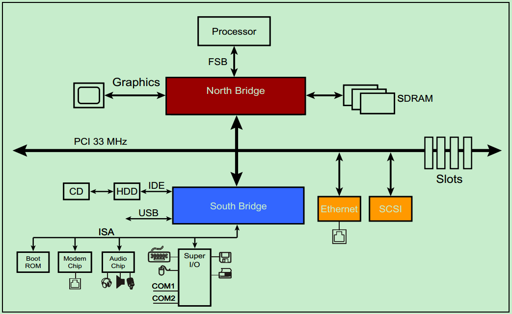

一个典型的33MHz的PCI总线系统如上图所示，处理器通过FSB与北桥相连接，北桥上挂载着图形加速器（显卡）、SDRAM（内存）和PCI总线。PCI总线上挂载着南桥、以太网、SCSI总线（一种老式的小型机总线）和若干个PCI插槽。CD和硬盘则通过IDE连接至南桥，音频设备以及打印机、鼠标和键盘等也连接至南桥，此外南桥还提供若干的USB接口。

PCI总线是一种共享总线，所以需要特定的仲裁器（Arbiter）来决定当前时刻的总线的控制权。一般该仲裁器位于北桥中，而仲裁器（主机）则通过一对引脚，REQ#（request） 和GNT# （grant）来与各个从机连接。如下图所示：

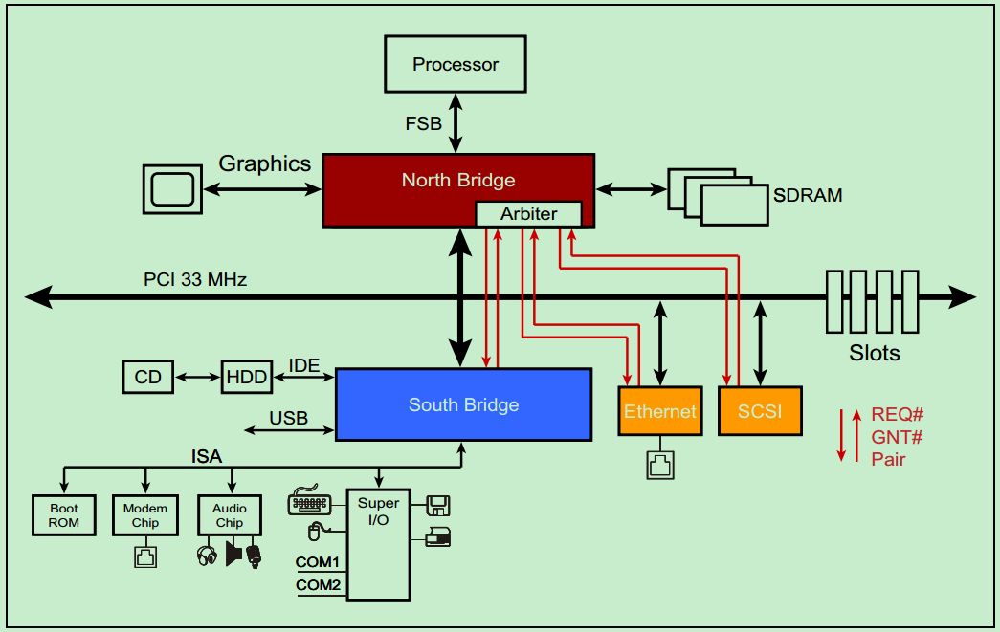

需要注意的是，并不是所有的设备都有能力成为仲裁器（Arbiter）或者initiator 。

最初的PCI总线的时钟频率为33MHz，但是随着版本的更新，时钟频率也逐渐的提高。但是由于PCI采用的是一种Reflected-Wave Signaling信号模型（后面会详细的介绍），导致了时钟频率越高，总线的最大负载越少，如下图所示：

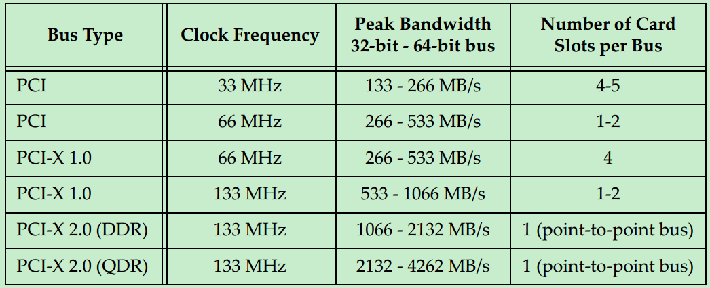

到了PCI-X2.0版本，整个总线就只能插一个PCI卡了（相当于两个PCI负载），为了能够在主板上提供更多的插槽，则必须通过连接多个PCI桥来实现

## PCI总线时序

PCI总线是一种地址和数据复用的总线，即地址和数据占用同一组信号线AD。PCI总线的所有信号都与时钟信号同步，及所有的信号的变化都发生在时钟的上升沿，或者在时钟上升沿进行采样。

如下图所示，除了时钟信号CLK和数据地址复用信号AD之外，PCI总线至少还应包括FRAME#（用于表示一次数据传输的起始）、C/BE#（Command/Byte Enable）、IRDY#（Initiator Ready for data）、TRDY#（Target ready）、DESEL#（Device Selec，片选信号，用于选择PCI设备）和GNT#（Grant）信号等。

**注：**完整的信号时序图，请参考PCI Spec。信号名后面的#表示该信号低电平有效。

下面来介绍一个简单的例子，主机接收来自特定从机的数据。

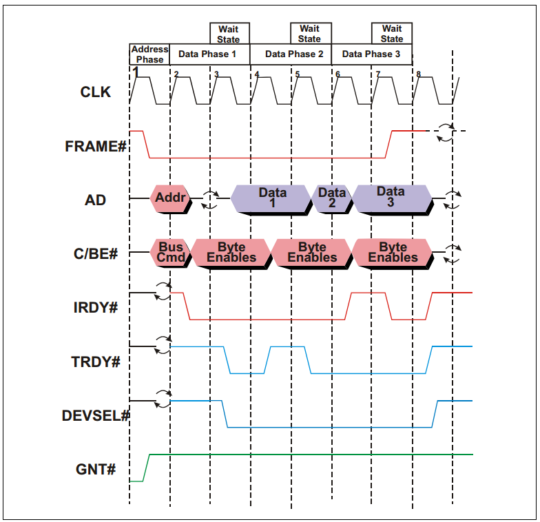

如上图所示：

1、在第一个时钟上升沿，FRAME#和IRDY#都为inactive，表明总线当前处于空闲状态。与此同时，某个设备的GNT#信号处于active，表明总线总裁器已经选定当前设备为下一个initiator（可以理解为主机）。

2、在第二个时钟上升沿，FRAME#被initiator拉低，表明新的事务（Transaction）已经开始。与此同时，地址和命令被依次发送到AD上，总线上面的所有其他设备（从机）都会锁存这些信息，并检查地址和命令是否与自己匹配。

3、在第三个时钟上升沿，IRDY#处于active状态，表明主机准备就绪，可以接收数据了。AD信号上的旋转的箭头表示AD信号目前处于三态状态（处于输出和输入的转换状态），即Turn‐around cycle。需要注意的是，此时的TRDY#应当处于inactive状态，以保证Turn‐around cycle顺利进行。

4、在第四个时钟上升沿，PCI总线上的某个从机确认身份，并依次将DEVSEL#信号和TRDY#拉低，并将相应的数据输出到AD上。此时，FRAME#信号为active状态，表明这并不是最后一个数据。

5、在第五个时钟上升沿，TRDY#处于inactive状态，表明从机尚未就绪，因此所有的操作暂缓一个时钟周期（或者说插入了一个Wait State）。PCI总线最多允许8个这样的Wait State。

6、在第六个时钟上升沿，从机向主机发送第二个数据。此时，FRAME#信号依旧为active状态，表明这并不是最后一个数据。

7、在第七个时钟上升沿，IRDY#处于inactive状态，表明主机尚未就绪，再次插入一个Wait State。但是此时从机依旧可以向AD上发送数据。

8、在第八个时钟上升沿，AD上的第三个数据被发送至主机，由于此时FRAME#信号被拉高，即inactive，表明这是本次事务（Transaction）的最后一个数据。

此后，所有的控制信号均被拉高，处于inactive状态，AD、FRAME#和C/BE#处于三态状态。

## PCI总线的三种传输模式

PCI Spec规定的三种数据传输模型：Programmed I/O（PIO），Peer-to-Peer和DMA。

三种数据传输模型的示意图如下图所示：

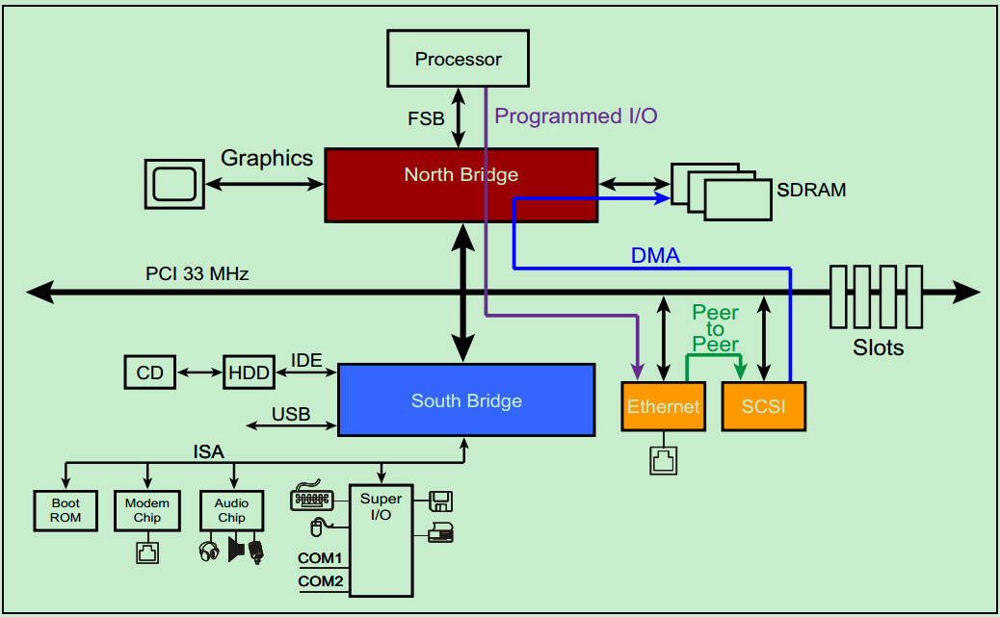

**首先来介绍一下Programmed I/O（PIO）**

PIO在早期的PC中被广泛使用，因外当时的处理器的速度要远远大于任何其他外设的速度，所以PIO足以胜任所有的任务。举一个例子，比如说某一个PCI设备需要向内存（SDRAM）中写入一些数据，该PCI设备会向CPU请求一个中断，然后CPU首先先通过PCI总线把该PCI设备的数据读取到CPU内部的寄存器中，然后再把数据从内部寄存器写入到内存（SDRAM）中。

现在看来，这种传输方式的效率还是很低的。首先，每次CPU和PCI设备以及SDRAM通信都需要额外的时钟周期（相对于DMA）；其次，这种传输方式还需要长时间地占用CPU，影响CPU的使用率。试想一下，你在用PC在线观看一个1080p60的高清视频，这需要以太网连续地向内存（SDRAM）中写入数据，如果使用PIO的方式的话，将难以保证数据的写入速度。随着目前的PCI外设速度越来越高，PIO已经逐渐被DMA传输方式所取代，但是为了兼容早期的一些设备，PCI Spec依然保留了PIO。

**DMA，即Direct Memory Access** 

DMA是一种在传输过程中，几乎不需要CPU进行干预的数据传输方式。如上面的图片所示，以太网可以直接向内存（SDRAM）中写入数据，而几乎不需要CPU的干预。实际上，DMA不仅仅应用于PCI总线系统中，它是一种更为广泛应用的数据传输方式。目前，几乎所有的CPU，甚至是MCU都支持DMA

**Peer-to-Peer**

前面的文章中，我们介绍过PCI总线系统中的主机身份并不是固定不变的，而是可以切换的（借助仲裁器），但是同一时刻只能存在一个主机。完成Peer-to-Peer这一传输方式的前提是，PCI总线系统中至少存在一个有能力成为主机的设备。在仲裁器的控制下，完成主机身份的切换，进而获得PCI总线的控制权，然后与总线上的其他PCI设备进行通信。不过，需要注意的是，在实际的系统中，Peer-to-Peer这一传输方式却很少被使用，这是因为获得主机身份的PCI设备（Initiator）和另一个PCI设备（Target）通常采用不同的数据格式，除非他们是同一个厂家的设备。

## PCI总线的中断和错误处理

PCI总线使用INTA#、INTB#、INTC#和INTD#信号向处理器发出中断请求。这些中断请求信号为低电平有效，并与处理器的中断控制器连接。在PCI体系结构中，这些中断信号属于边带信号（Sideband Signals），PCI总线规范并没有明确规定在一个处理器系统中如何使用这些信号，因为这些信号对于PCI总线是可选信号。所谓边带信号是指这些信号在PCI总线中是可选信号，而且只能在一个处理器系统的内部使用，并不能离开这个处理器环境。

**注：**PCI Spec对边带信号的定义如下：

Any signal not part of the PCI specification that connects two or more PCI-compliant agents and has meaning only to those agents.

完整的PCI信号结构图如下：

**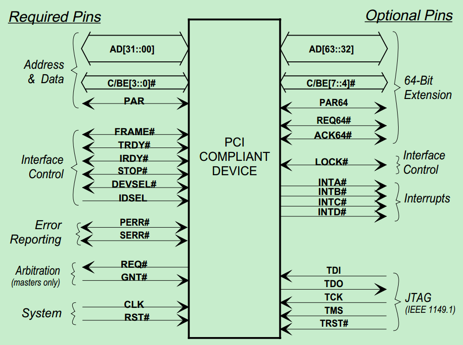**

**中断信号与中断控制器的连接关系**

PCI总线规范没有规定PCI设备的INTx信号如何与中断控制器的IRQ_PINx#信号相连，这为系统软件的设计带来了一定的困难，为此系统软件使用中断路由表存放PCI设备的INTx信号与中断控制器的连接关系。在x86处理器系统中，BIOS可以提供这个中断路由表，而在PowerPC处理器中Firmware也可以提供这个中断路由表。

在一些简单的嵌入式处理器系统中，Firmware并没有提供中断路由表，此时系统软件开发者需要事先了解PCI设备的INTx信号与中断控制器的连接关系。此时外部设备与中断控制器的连接关系由硬件设计人员指定。

我们假设在一个处理器系统中，共有3个PCI插槽(分别为PCI插槽A、B和C)，这些PCI插槽与中断控制器的IRQ_PINx引脚(分别为IRQW#、IRQX#、IRQY#和IRQZ#)可以按照下图所示的拓扑结构进行连接。 

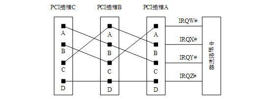

此时，PCI插槽A、B、C的INTA#、INTB#和INTC#信号将分散连接到中断控制器的IRQW#、IRQX#和IRQY#信号，而所有INTD#信号将共享一个IRQZ#信号。采用这种连接方式时，整个处理器系统使用的中断请求信号，其负载较为均衡。而且这种连接方式保证了每一个插槽的INTA#信号都与一根独立的IRQx#信号对应，从而提高了PCI插槽中断请求的效率。

在一个处理器系统中，多数PCI设备仅使用INTA#信号，很少使用INTB#和INTC#信号，而INTD#信号更是极少使用。在PCI总线中，PCI设备配置空间的Interrupt Pin寄存器记录该设备究竟使用哪个INTx信号。

**中断信号与PCI总线的连接关系**

在PCI总线中，INTx信号属于边带信号。PCI桥也不会处理这些边带信号。这给PCI设备将中断请求发向处理器带来了一些困难，特别是给挂接在PCI桥之下的PCI设备进行中断请求带来了一些麻烦。

在一些嵌入式处理器系统中，这个问题较易解决。因为嵌入式处理器系统很清楚在当前系统中存在多少个PCI设备，这些PCI设备使用了哪些中断资源。在多数嵌入式处理器系统中，PCI设备的数量小于中断控制器提供的外部中断请求引脚数，而且在嵌入式系统中，多数PCI设备仅使用INTA#信号提交中断请求。

在这类处理器系统中，可能并不含有PCI桥，因而PCI设备的中断请求信号与中断控制器的连接关系较易确定。而在这类处理器系统中，即便存在PCI桥，来自PCI桥之下的PCI设备的中断请求也较易处理。

在多数情况下，嵌入式处理器系统使用的PCI设备仅使用INTA#信号进行中断请求，所以只要将这些INTA#信号挂接到中断控制器的独立IRQ_PIN#引脚上即可。这样每一个PCI设备都可以独占一个单独的中断引脚。

而在x86处理器系统中，这个问题需要BIOS参与来解决。在x86处理器系统中，有许多PCI插槽，处理器系统并不知道在这些插槽上将要挂接哪些PCI设备，而且也并不知道这些PCI设备到底需不需要使用所有的INTx#信号线。因此x86处理器系统必须要对各种情况进行处理。

x86处理器系统还经常使用PCI桥进行PCI总线扩展，扩展出来的PCI总线还可能挂接一些PCI插槽，这些插槽上INTx#信号仍然需要处理。PCI桥规范并没有要求桥片传递其下PCI设备的中断请求。事实上多数PCI桥也没有为下游PCI总线提供中断引脚INTx#，管理其下游总线的PCI设备。但是PCI桥规范推荐使用下面的表建立下游PCI设备的INTx信号与上游PCI总线INTx信号之间的映射关系。

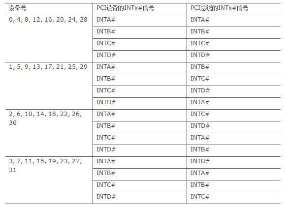

我们举例说明该表的含义。在PCI桥下游总线上的PCI设备，如果其设备号为0，那么这个设备的INTA#引脚将和PCI总线的INTA#引脚相连；如果其设备号为1，其INTA#引脚将和PCI总线的INTB#引脚相连；如果其设备号为2，其INTA#引脚将和PCI总线的INTC#引脚相连；如果其设备号为3，其INTA#引脚将和PCI总线的INTD#引脚相连。

在x86处理器系统中，由BIOS或者APCI表记录PCI总线的INTA~D#信号与中断控制器之间的映射关系，保存这个映射关系的数据结构也被称为中断路由表。大多数BIOS使用表中的映射关系，这也是绝大多数BIOS支持的方式。如果在一个x86处理器系统中，PCI桥下游总线的PCI设备使用的中断映射关系与此不同，那么系统软件程序员需要改动BIOS中的中断路由表。

BIOS初始化代码根据中断路由表中的信息，可以将PCI设备使用的中断向量号写入到该PCI设备配置空间的Interrupt Line register寄存器中。

**PCI总线的错误处理**

****

PCI设备可以通过奇偶校检来检测到来自AD上的地址或者数据的错误，并通过PERR#或者SERR#报告错误。但是需要注意的是，PCI Spec并未规定任何硬件层面上的错误处理或者恢复机制，因此，这些错误都只能通过软件进行处理。

## PCI总线的地址空间分配

PCI总线具有32位数据/地址复用总线，所以其存储地址空间为2的32次方=4GB。也就是PCI上的所有设备共同映射到这4GB上，每个PCI设备占用唯一的一段PCI地址，以便于PCI总线统一寻址。每个PCI设备通过PCI寄存器中的基地址寄存器来指定映射的首地址。如下图所示：

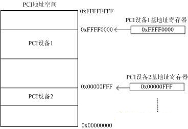

**注：**需要注意的是PCI的地址空间和x86系统中的FSB并不是对等的，而是具有一定的映射关系。

PCI体系结构中，一共支持三种地址空间：Memory Address Space、I/O Address Space和Configuration Address Space。其中x86处理器可以直接访问的只有Memory Address Space和I/O Address Space。而访问Configuration Address Space则需要通过索引IO寄存器来完成。

**注：**在PCIe中，则引入了一种新的Configuration Address Space访问方式：将其直接映射到了Memory Address Space当中。

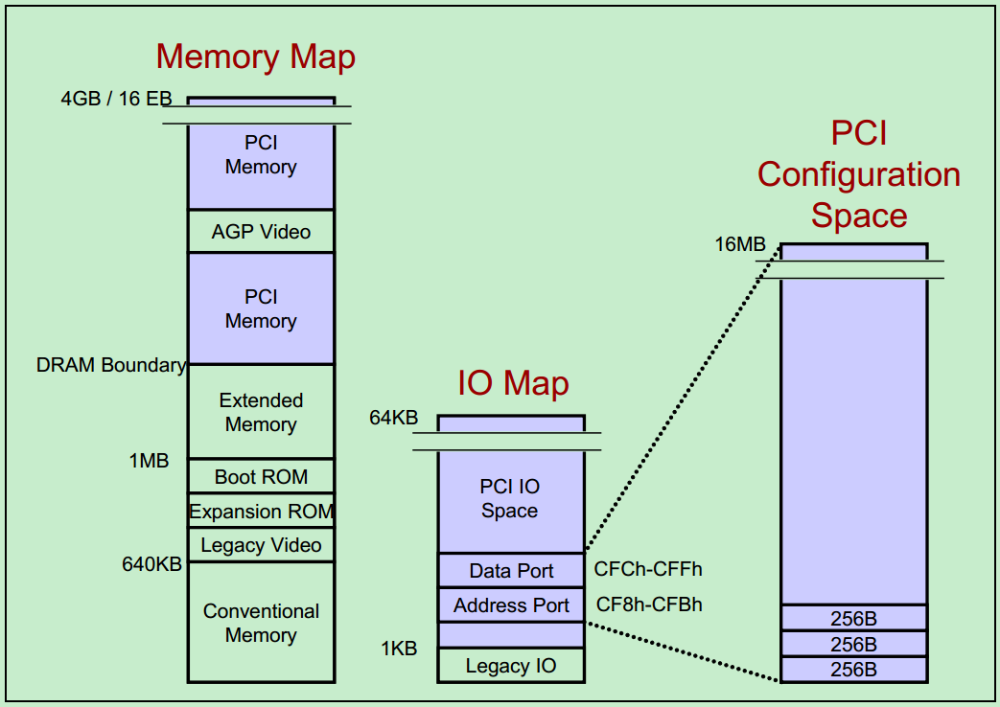

如上图所示，最左边的即为Memory Address Space，其中包括了多个PCI Memory、AGP Video（显卡）Memory以及Extended Memory、Boot ROM等。中间的为I/O Address Space，需要注意的是，虽然PCI支持32位的地址，但是由于x86的CPU只支持16位的I/O空间，这就限制了PCI的I/O Address Space最大只有64KB。最右边的则为Configuration Address Space，由于每一个PCI设备最多支持8种功能（Function），每一条PCI总线最多支持32个设备，而每一个PCI总线系统最多又支持256个子总线（通过PCI桥）。因此，总的Configuration Address Space的大小为：256 Bytes/function x 8 functions/device x 32 devices/bus x 256 buses/system = 16MB。

如图中所示，Configuration Address Space所使用的IO寄存器范围为0xCF8~0xCFF。其中0xCF8~0xCFB为端口地址，0xCFC~0xCFF为配置数据。

## PCI总线配置周期产生和配置寄存器

上一篇文章中也是说到了，I/O Address Space的空间很有限（64KB），所以一般在I/O Space中都有两个寄存器，第一个指向要操作的内部地址，第二个存放读或者写的数据。因此，对于PCI的配置周期来说，包含了两个步骤：

Step1：CPU先对IO Address中的0xCF8~0xCFB写入要操作的配置寄存器的地址。如下图所示，其中包括了总线号（Bus Number）、设备号（Device Number）、功能号（Function Number）和寄存器指针。

Step2：CPU向IO Address中的0xCFC~0xCFF中写入读或者写的数据。

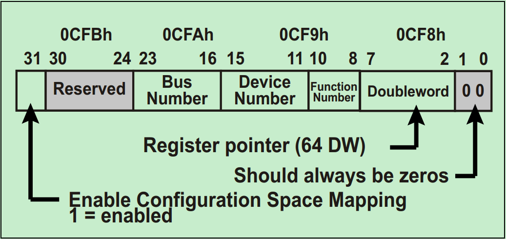

前面介绍过，每一个PCI功能（Function）都包含256个字节的配置空间（Configuration Space），其中前64个字节被称为Header，剩余的192个字节用于一些可选的功能。PCI Spec规定了两种类型的Header：Type1 和Type0。其中，Type1 Header表示该PCI设备功能为桥（Bridge），而Type0 Header则表示该PCI设备功能不是桥。两种Header的结构图分别如下所示：

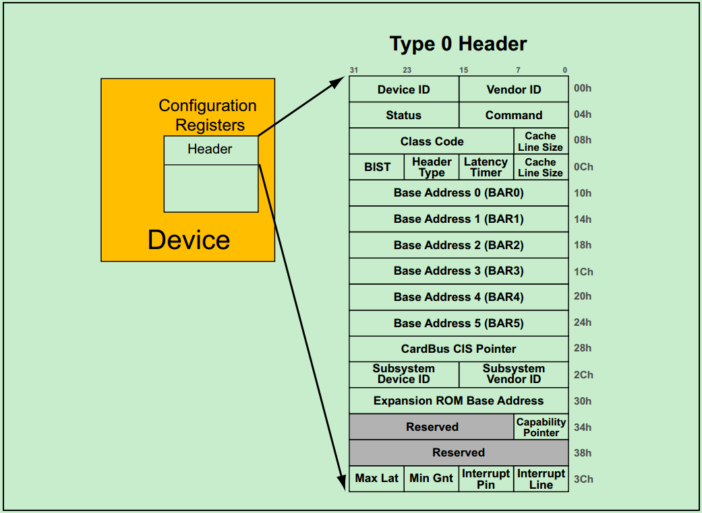

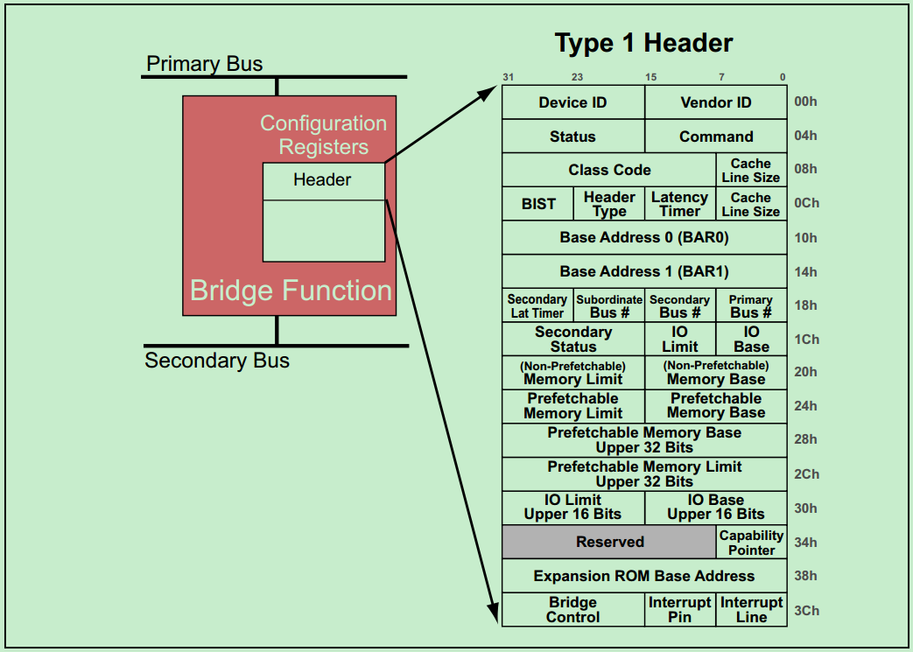

**注：**因为PCIe完整的继承了PCI Header相关的内容，所以关于Header的详细介绍和操作会放在后面关于PCIe的介绍中。

## 66MHz的PCI总线及其技术瓶颈

为了能够取得更高的带宽，新版本的PCI Spec将PCI总线提高到了64-bit并将频率提高到了66MHz，最高支持533MB/s。下图描述的是一个典型的66Mhz，64-bit的PCI系统结构图。

前面的文章介绍过，PCI总线采用了Reflected-Wave Signaling技术，因此总线频率的提高，必然会导致总线负载能力的降低。结果就是，66MHz 64-bit的PCI总线只能支持一个PCI插卡设备（算作两个PCI设备，插槽和PCI卡各算一个）。为了增加整个系统的PCI设备数，就不得不去增加额外的PCI桥，这又进一步增加了功耗，提高了成本。此外，64-bit的PCI总线由于增加了很多的引脚，导致66MHz 64-bit的PCI总线的稳定性降低，对PCB的设计提出了更高的要求，也限制了其广泛应用。

此外，由于PCI总线采用的是non-registered输入，这要求输入信号的建立时间至少要有3ns，而66MHz的时钟下，周期为15ns，剩余的12ns基本上都被Reflected-Wave Signaling给消耗了。因此，66MHz基本上算是PCI总线的频率的上限了。

在PCI-X总线中，为了解决上诉问题，PCI-X总线将所有的输入信号都先用寄存器打一拍，此时对输入信号的建立时间的要求就不在那么苛刻了，因此PIC-X总线可以运行在更高的频率上（100MHz，甚至133MHz）。

## PCI-X总线基本概念

PCI-X总线在PCI总线的基础上发展而来，其在软件和硬件层面上都是兼容PCI总线的，但是却显著的提高了总线的性能。也就是说PCI-X的设备可以直接插到PCI的插槽中去，PCI的设备也可以直接插到PCI-X的插槽中去。

从硬件层面上来说，PCI-X继承了PCI总线中的Reflected-Wave Signaling，但是在信号的输入端加入了输入寄存器以增强时序性能，提高了总线的时钟频率。在PCI-X2.0的Spec中还提出了DDR和QDR技术，进一步提高了PCI-X总线的带宽。

一个典型的PCI-X总线系统的例子如下图所示：

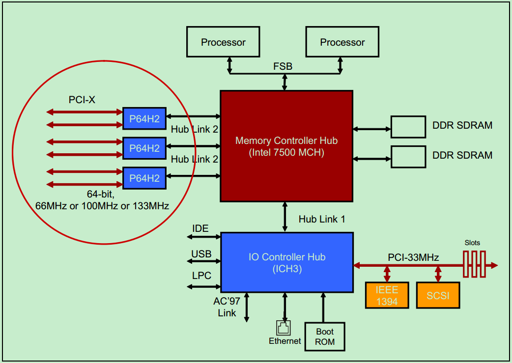

下面是一个PCI-X 突发读存储操作（Burst Memory Read Bus Cycle）的例子：

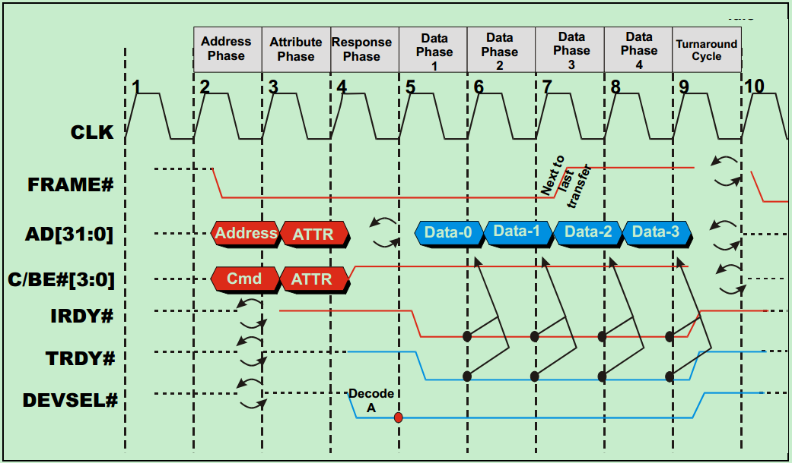

在PCI总线中，以总线主机从从机设备读操作为例，当从机设备尚未准备好结束这次操作（从机设备未就绪，且数据尚未发送完）时，可以通过锁存数据并插入等待周期，或者发起Retry操作。PCI-X总线采用了一种叫做Split Transaction的方式来处理这种情况，如下图所示。此时，发起读操作的总线主机被称为Requester，而接受并向总线上发送数据的从机设备被称为Completer。

**注：**PCIe Spec中继承了PCI-X的这种命名方式。

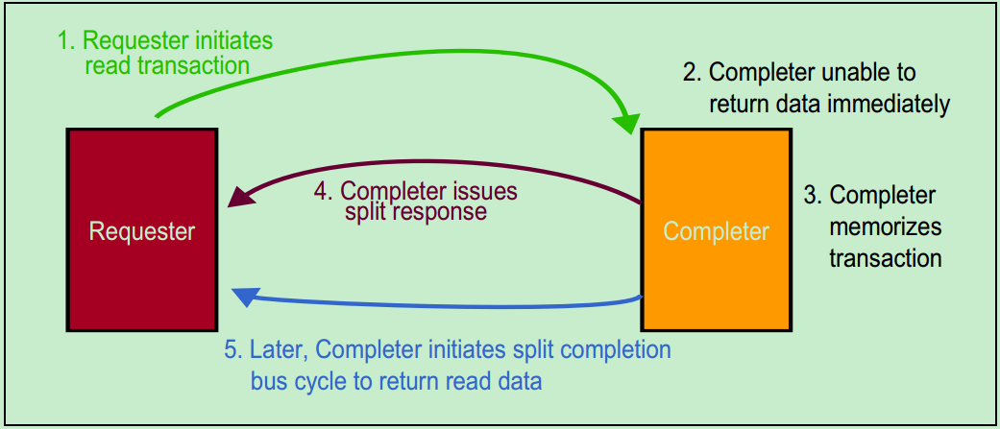

采用这种方式的PCI-X总线的总线传输利用率（效率）可以达到85%，而标准的PCI总线只有50%-60%。关于Split Transaction的详细内容，建议大家去参考PCI-X的Spec，这里不再详细地介绍。此外，PCI-X总线还在配置地址寄存器（Configuration Address Register）中加入了NS（No Snoop）和RO（Relaxed Ordering）两位以提高总线传输效率。

前面的文章中介绍过，PCI总线的中断操作是通过一系列的边带信号（Sideband Signals）来完成的，在PCI-X Spce中引入了消息信号中断（MSI，Message Signaled Interrupts）的机制，以取代这些边带信号，进而精简系统设计。

**注：**关于MSI的详细内容，建议参考PCI-X Spec，此处不再详细介绍。

在介绍PCI-X2.0中提出的源同步模型之前，首先先来简单地聊一聊非源同步模型的内在问题。所谓非源同步，就是说，信号的发送端和接收端的时钟分别由一个或者两个时钟源驱动，发送端和接受端的时钟同频率，但是却很难保证其同相位（即存在时钟的相位偏差，skew）。

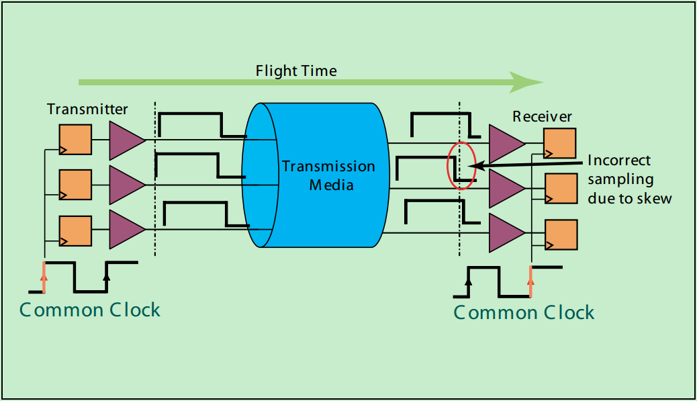

如上图所示，由于信号线众多，在PCB设计的时候，很难保证每一条信号线的长度都完全相同（更不要说还有过孔等因素）。因此，即使信号在发送时完全沿对沿的（实际上也是不可能的，对于PCI总线来说），也很难保证信号在同一时间到达接收端，此时的信号必然不再是沿对沿的了。如果不同信号线之间的传输延时差异较大，就很容易导致信号在接收端的采样错误，进而提高数据传输的误码率。

为了解决这些问题，在PCI-X2.0的Spec中提出了源同步模型（实际上，在目前高速的FPGA逻辑设计和数字ASIC设计中采用的基本上都是源同步的模型）。如下图所示，此时系统的时钟由发送端（即Source Device）直接提供，并和数据信号一同传输至接收端，这就很好地解决非源同步模型中的时钟相位差（Skew）的问题。此外，PCI-X2.0还在接收端输入寄存器的基础上支持了DDR输入，甚至是QDR输入，极大地提高了总线的带宽。64-bit的133MHz PCI-X2.0 QDR总线的带宽甚至达到了惊人的4262MB/s！基本上算是并行总线的巅峰了（DDRx SDRAM不算是总线）。

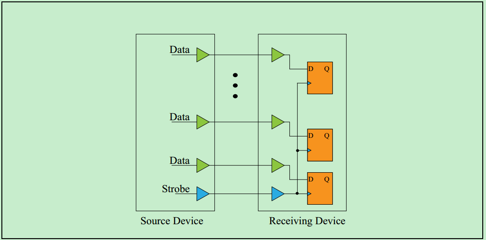

然而，有意识的是，PCI-X2.0似乎生不逢时，虽然它显著地提高了PCI总线的带宽，但依旧无法掩盖并行总线在高速总线数据传输中劣势。PCI-X2.0总线虽然性能优异，但是却几乎很少得到应用，由于其高功耗高成本，且并行总线的引脚过多，需要极其复杂的PCB设计，导致PCI-X2.0只在极少数高端的市场中得到了应用（如服务器市场等）。导致PCI-X2.0未能达到大规模应用的另一个因素就是PCI Express（PCIe）总线时代的到来，其标志着高速串行总线取代传统的并行总线的时代的开端。

**注：**关于PCI总线和PCI-X总线的简要介绍的文章到此为止，后面的文章将开始介绍本次连载博文真正的主角——PCI Express总线（PCIe总线）。

## PCIe总线基本概念

PCIe总线的提出可以算是代表着传统并行总线向高速串行总线发展的时代的到来。实际上，不仅是PCI总线到PCIe总线，高速串行总线取代传统并行总线是一个大的趋势。如ATA到SATA，SCSI到USB等……

不过，为了兼容之前的PCI总线设备，虽然PCIe是一种串行总线，无法再物理层上兼容PCI总线，但是在软件层上面却是兼容PCI总线的。

和很多的串行总线一样，PCIe采用了全双工的传输设计，即允许在同一时刻，同时进行发送和接收数据。如下图所示，设备A和设备B之间通过双向的Link相连接，每个Link支持1到32个通道（Lane）。由于是串行总线，因此所有的数据（包括配置信息等）都是以数据包为单位进行发送的。

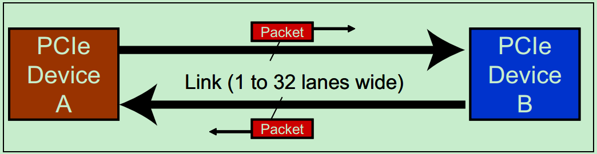

与绝大部分的高速连接一样，PCIe采用了差分对进行收发，以提高总线的性能。一个PCIe Lane的例子如下图所示：

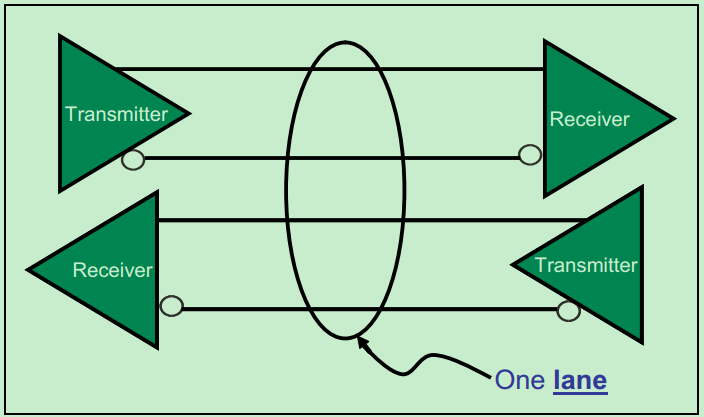

除了差分总线，PCIe还引入了嵌入式时钟的技术（Embedded Clock），即发送端不再向接收端发送时钟，但是接收端可以通过8b/10b的编码从数据Lane中恢复出时钟。一个简单的时钟恢复电路模型如下图所示：

**注：**PCie Gen3以及之后的版本采用了128b/130b的编码方式。

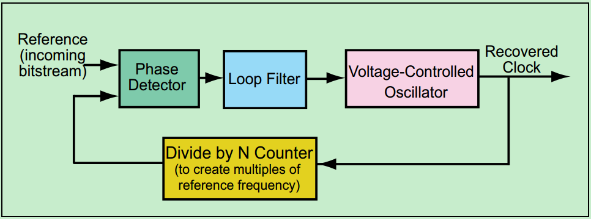

PCIe相对于PCI总线的另一个大的优势是其的Scalable Performance，即可以根据应用的需要来调整PCIe设备的带宽。如需要很高的带宽，则采用多个Lane（比如显卡）；如果并不需要特别高的带宽，则只需要一个Lane就可以了（比如说网卡等）。

和PCI-X总线一样，由于非常高的传输速度，PCIe是一种点对点连接的总线，而不像PCI那样的共享总线。但是PCIe总线系统可以通过Switch连接多个PCIe设备，也可以通过PCIe桥连接传统的PCI和PCI-X设备。一个简单的PCIe总线系统的拓扑结构图如下所示：

**注：**这里的Switch实际上包含了多个类似于PCI总线中桥的概念。

图中的Root Complex经常被称为RC或者Root。在PCIe的Spec中，并没有特别详细的关于Root Complex的定义，从实际的角度来讲，可以把Root Complex理解为CPU与PCIe总线系统通信的媒介。Endpoint处于PCIe总线系统拓扑结构中的最末端，一般作为总线操作的发起者（initiator，类似于PCI总线中的主机）或者终结者（Completers，类似于PCI总线中的从机）。显然，Endpoint只能接受来自上级拓扑的数据包或者向上级拓扑发送数据包。

所谓Lagacy PCIe Endpoint是指那些原本准备设计为PCI-X总线接口的设备，但是却被改为PCIe接口的设备。而Native PCIe Endpoint则是标准的PCIe设备。其中，Lagacy PCIe Endpoint可以使用一些在Native PCIe Endpoint禁止使用的操作，如IO Space和Locked Request等。Native PCIe Endpoint则全部通过Memory Map来进行操作，**因此，Native PCIe Endpoint也被称为Memory Mapped Devices（MMIO Devices）**。

## PCIe总线如何在软件上兼容PCI总线

前面的文章中多次说道，PCIe总线在软件上是向前兼容PCI总线的。因此，PCIe总线完整的继承了PCI总线中的配置空间（Configuration Header）的概念。在PCIe总线中也有两种Header，Header0和Header1，分别代表非桥和桥设备，这与PCI总线是完全一致的。在PCIe总线中，非桥设备也就是Endpoint。如下图所示：

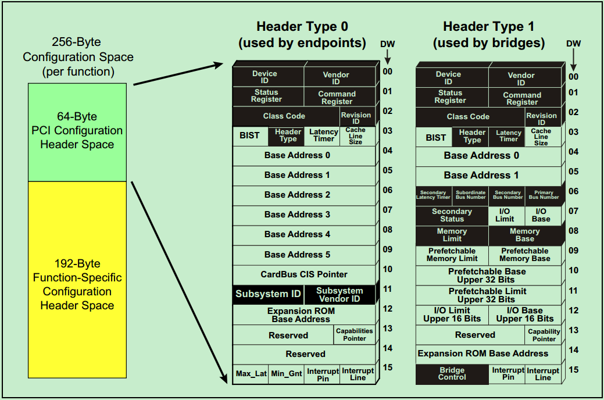

如图所示，对比前面介绍的PCI的Header可以发现：PCIe的Header基本上与PCI的Header是一致的，只有少许差别。但是这些差别并不影响PCIe对PCI的兼容性（还有PCIe到PCI桥对其进行处理）。

需要特别说明的是，Root Complex（RC or Root）和Switch都是全新的PCIe中的概念，它们结构中的每一个端口（Port）都可以对应于PCI总线中的PCI-to-PCI桥的概念。也就是说，每一个RC和Switch中一般都有多个类似于PCI-to-PCI桥的东西。分别如下两张图所示：

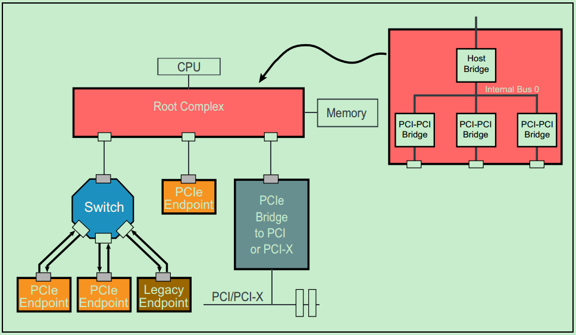

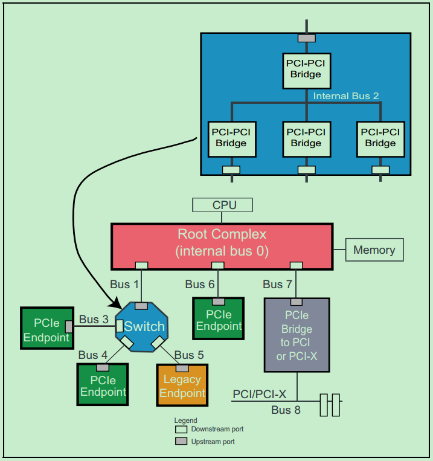

前介绍到过，PCIe总线是一种点对点（Point-to-Point）的总线，如果需要连接大量的设备，则需要很多的Switch来进行拓扑，这无疑会大大地增加系统的功耗与设计成本。在普通的PC或者小型计算机系统中，并不要连接很多的PCIe设备，因此Switch就显得并不是那么的必要了。一个典型的服务器PCIe总线系统的拓扑结构图如下图所示：

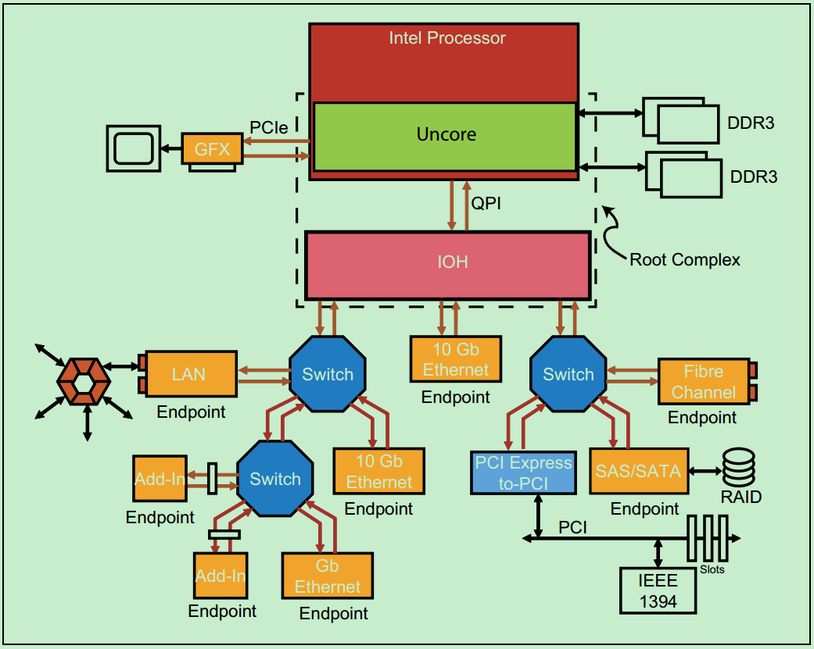

典型的PC的PCIe总线系统的拓扑结构图如下图所示：

## PCIe总线体系结构入门

和很多的串行传输协议一样，一个完整的PCIe体系结构包括应用层、事务层（Transaction Layer）、数据链路层（Data Link Layer）和物理层（Physical Layer）。其中，应用层并不是PCIe Spec所规定的内容，完全由用户根据自己的需求进行设计，另外三层都是PCIe Spec明确规范的，并要求设计者严格遵循的。

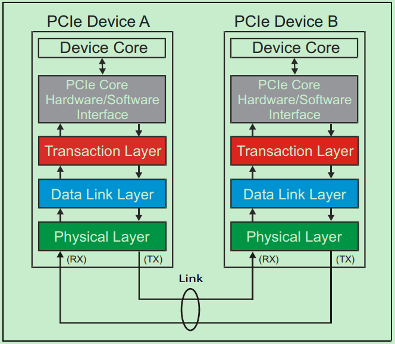

一个简化的PCIe总线体系结构如上图所示，其中**Device Core and interface to Transaction Layer**就是我们常说的**应用层**或者**软件层**。这一层决定了PCIe设备的类型和基础功能，可以由硬件（如FPGA）或者软硬件协同实现。如果该设备为Endpoint，则其最多可拥有8项功能（Function），且每项功能都有一个对应的配置空间（Configuration Space）。如果该设备为Switch，则应用层需要实现包路由（Packet Routing）等相关逻辑。如果该设备为Root，则应用层需要实现虚拟的PCIe总线0（Virtual PCIe Bus 0），并代表整个PCIe总线系统与CPU通信。

**事务层（Transaction Layer）**：接收端的事务层负责事务层包（Transaction Layer Packet，TLP）的解码与校检，发送端的事务层负责TLP的创建。此外，事务层还有QoS（Quality of Service）和流量控制（Flow Control）以及Transaction Ordering等功能。

**数据链路层（Data Link Layer）**：数据链路层负责数据链路层包（Data Link Layer Packet，DLLP）的创建，解码和校检。同时，本层还实现了Ack/Nak的应答机制。

**物理层（Physical Layer）**：物理层负责Ordered-Set Packet的创建于解码。同时负责发送与接收所有类型的包（TLPs、DLLPs和Ordered-Sets）。当前在发送之前，还需要对包进行一些列的处理，如Byte Striping、Scramble（扰码）和Encoder（8b/10b for Gen1&Gen2, 128b/130b for Gen3& Gen4）。对应的，在接收端就需要进行相反的处理。此外，物理层还实现了链路训练（Link Training）和链路初始化（Link Initialization）的功能，这一般是通过链路训练状态机（Link Training and Status State Machine，LTSSM）来完成的。

需要注意的是，在PCIe体系结构中，事务层，数据链路层和物理层存在于每一个端口（Port）中，也就是说Switch中必然存在一个以上的这样的结构（包括事务层，数据链路层和物理层的）。一个简化的模型如下图所示：

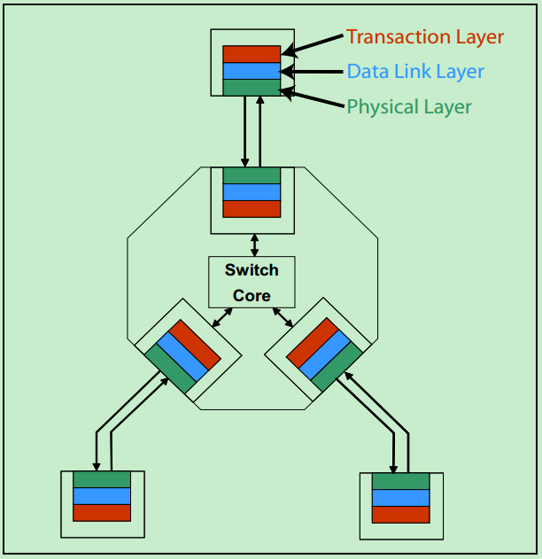

关于事务层，数据链路层和物理层的详细的功能图标如下图所示：

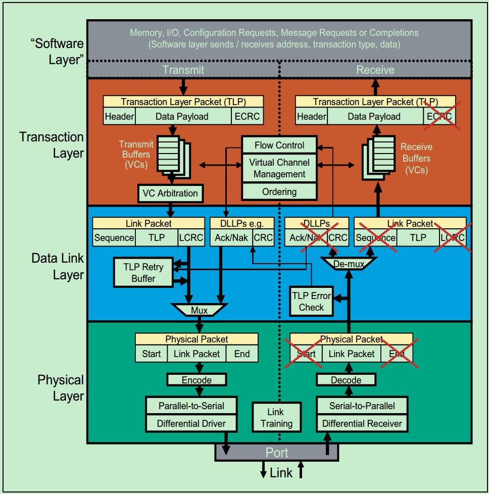

 

## PCIe总线事务层入门（一）

在介绍事务层之前，首先简单地了解一下PCIe总线的通信机制。假设某个设备要对另一个设备进行读取数据的操作，首先这个设备（称之为Requester）需要向另一个设备发送一个Request，然后另一个设备（称之为Completer）通过Completion Packet返回数据或者错误信息。在PCIe Spec中，规定了四种类型的请求（Request）：Memory、IO、Configuration和Messages。其中，前三种都是从PCI/PCI-X总线中继承过来的，第四种Messages是PCIe新增加的类型。详细的信息如下表所示：

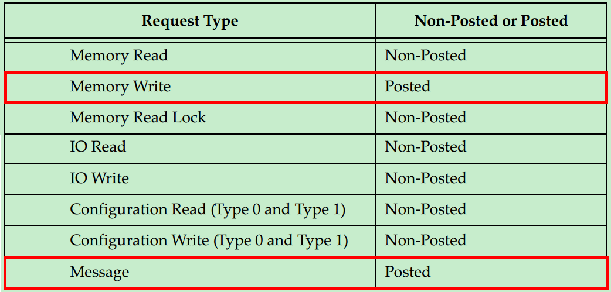

从表中我们可以发现，只有Memory Write和Message是Posted类型的，其他的都是Non-Posted类型的。所谓Non-posted，就是Requester发送了一个包含Request的包之后，必须要得到一个包含Completion的包的应答，这次传输才算结束，否则会进行等待。所谓Posted，就是Requester的请求并不需要Completer通过发送包含Completion的包进行应答，当然也就不需要进行等待了。很显然，Posted类型的操作对总线的利用率（效率）要远高于Non-Posted型。

那么为什么要分为Non-Posted和Posted两种类型呢？对于Memory Writes来说，对效率要求较高，因此采用了Posted的方式。但是这并不意味着Posted类型的操作完全不需要Completer进行应答，Completer仍然可采用另一种应答机制——Ack/Nak的机制（在数据链路层实现的）。

PCIe的TLP包共有一下几种类型：

TLP传输的示意图如下图所示：

TLP在整个PCIe包结构的位置如以下两张图所示：（第一张为发送端，第二张为接收端）

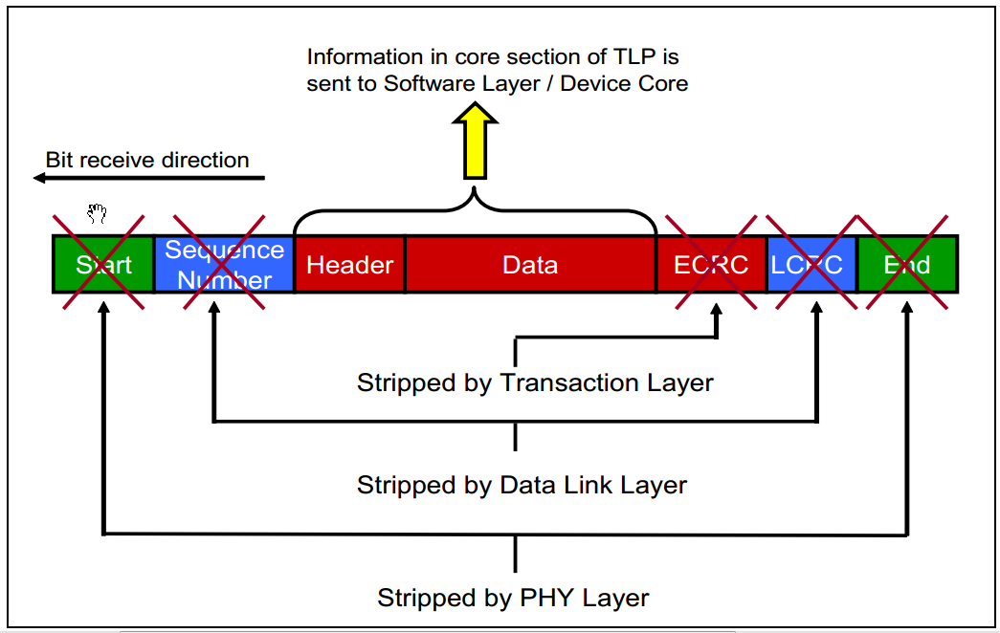

其中，TLP包的结构图如下图所示：

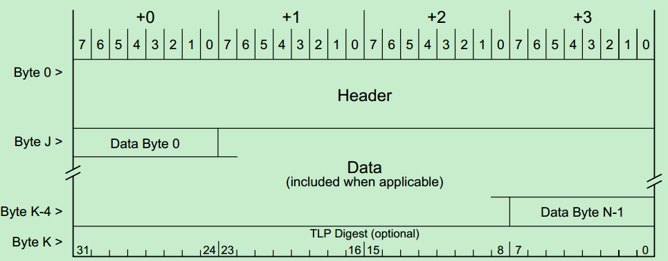

图中的TLP Digest即ECRC（End-to-End CRC），是可选项。此外，TLP的长度（包括其中的Header、Data和ECRC）是以DW（双字，即四个字节）为单位的。

## PCIe总线事务层入门（二）

前面的文章介绍了TLP的几种类型以及TLP的包结构。这篇文章来详细地聊一聊Non-Posted Transaction（包括Ordinary Read、Locked Read和IO/Configuration Writes）与Posted Writes（包括Memory Writes和Message Writes）。

**Non-Posted Transaction**

o  Ordinary Reads

下图显示的是一个Endpoint向System Memory发送读请求（Read Request）的例子。

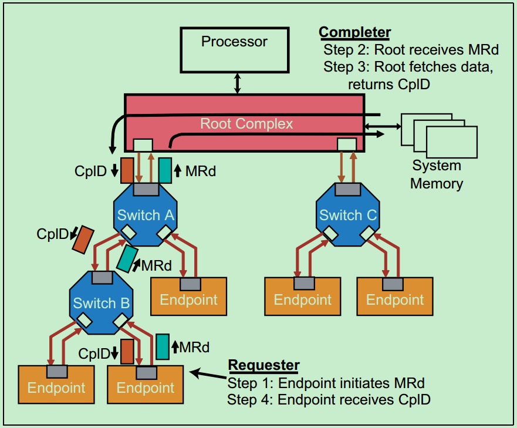

在这个例子中，Endpoint的读请求通过了两个Switch，然后到达其目标，即Root。Root对读请求的包进行解码后，并从中识别出操作的地址，然后锁存数据，并将数据发送至Endpoint，即包含数据的Completion包，ClpD。需要注意的是，PCIe允许每个包的最大数据量（Max Data Payload）为4KB，但实际上设计者往往会采用较小的Max Payload Size（比如128，256，512，1024和2048）。因此，常常一个读请求会对应多个ClpD，即将大于Max Payload Size的数据分成多个包发送。如果遇到错误，则Root会通过Completion包告知相应的Endpoint。

**注：**Root向发送请求的Endpoint发送Completion包，是通过Request包中的BDF信息（Bus，Device和Function）进行查找对应的Endpoint的。关于BDF，会在后面的文章详细地介绍。

**注：**每个CplD的大小还受到RCB的影响，具体会在后面的文章中详细介绍。

o  Locked Reads

Locked请求实际上是PCIe为了兼容早期的PCI总线而设置的一种方式，对于非PCI兼容的设计中，是不允许使用Locked操作的。并且也只有Root可以发起Locked请求操作，Endpoint是不可以发起Locked请求操作的。下图显示的是一个简单的Locked Read请求操作：

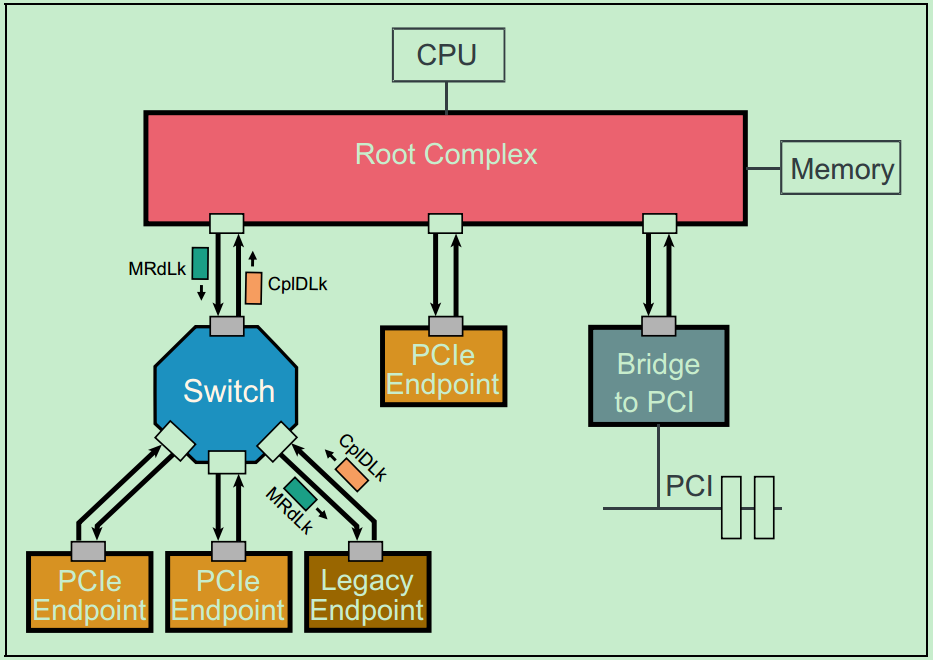

Locked Read主要用于支持一种叫做Atomic Read-Modify-Write操作，这是一种高优先级且不可被打断的操作。主要用于测试链路状况等任务（针对PCI设备，PCIe设备禁止使用Locked操作）。此外，Locked操作采用的是目标存储寻址（Target Memory Address）来寻找Legacy Endpoint（PCI设备），而不是采用前面介绍的BDF。

o  IO/Configuration Writes

下图是一个Non-Posted IO写操作的例子。和Locked操作一样，IO操作也是为了兼容早期的PCI设备，在PCIe设备中也是不建议使用。

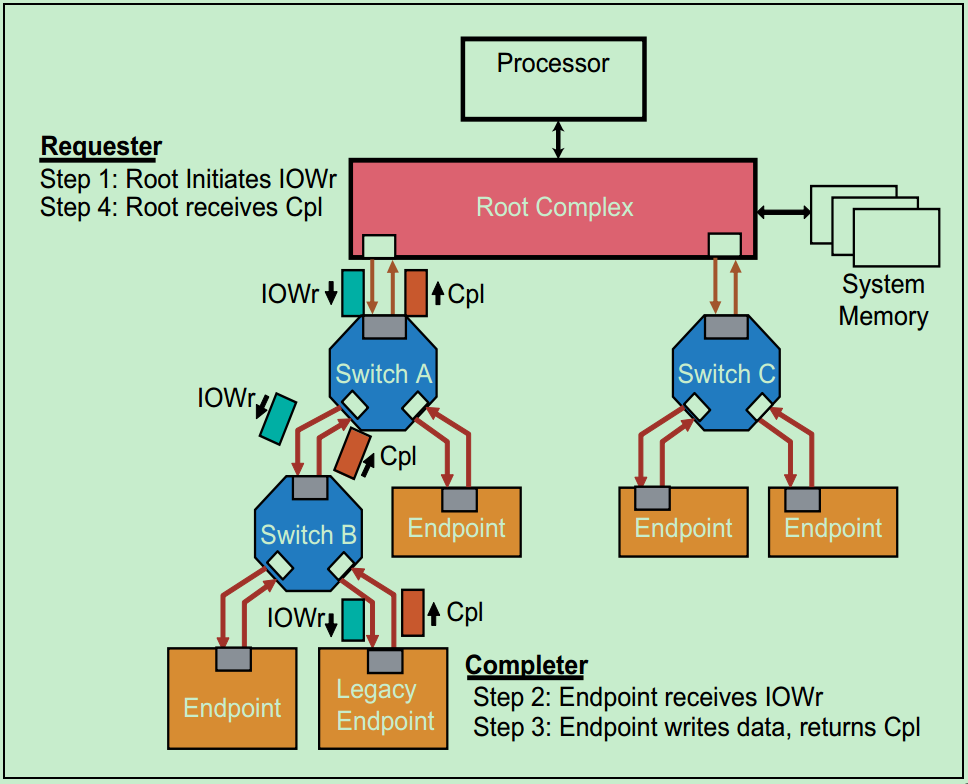

**Posted Writes**

o  Memory Writes

前面的文章有所提及，PCIe中的Memory写操作都是Posted的，因此Requester并不需要来自Completer的Completion。一个简单的Memory Writes例子如下图所示：

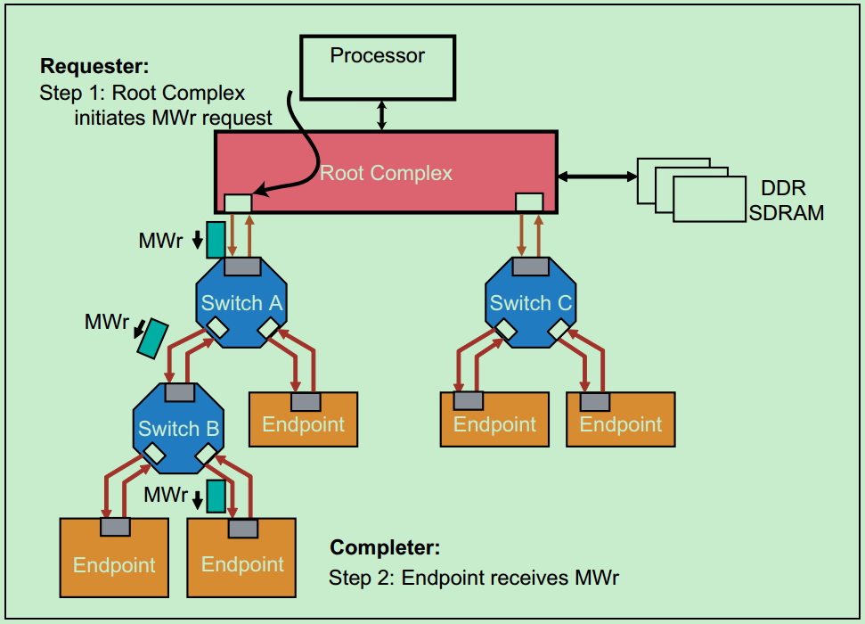

因此没有返回Completion，所以当发生错误时，Requester也不会知道。但是，此时Completer会将错误记录到日志（Log），然后向Root发送包含错误信息的Message。

o  Message Writes

和其他的几种类型不太一样，Message支持多种Routing方式。比如Requester可以将Message发送至一个指定的Completer，但是不管指定的Completer是不是Root，Root都会自动的收到来自任何一个Endpoint发送的Message。此外，当Requester是Root的时候，Requester还可以向所有的Endpoint进行广播发送Message。

不得不说，Message机制的提出帮助PCIe总线省去了很多PCI总线中的边带信号。PCI中很多用于中断、功耗管理、错误报告的边带信号，在PCIe中都通过了Message来进行实现了。

## PCIe总线事务层入门（三）

PCIe总线设计之初，充分考虑到了音频和视频传输等这些对时间要求特别敏感的应用。为了保证这些特殊应用的数据包能够得到优先发送，PCIe Spec中为每一个包都分配了一个优先级，通过TLP的Header中的3位（即TC，Traffic Class）。如下图所示：

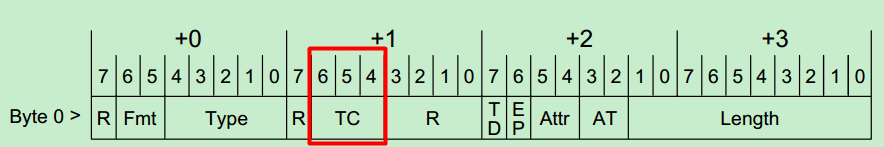

TC值越大，表示优先级越高，对应的包也就会得到优先发送。一般来说，支持QoS（Quality of Service）的PCIe总线系统，对于每一个TC值都会有一个独立Virtual Channel（VC）与之对应。这个Virtual Channel实际上就是一个Buffer，用于缓存数据包。

**注：**当然也有那些只有一个VC Buffer的，此时不管包的TC值如何，都只能缓存在同一个VC Buffer中，自然也就没有办法保证按优先级传输了。这样的PCIe设备称之为不支持QoS的PCIe设备。

一个简单的QoS的例子如下图所示：

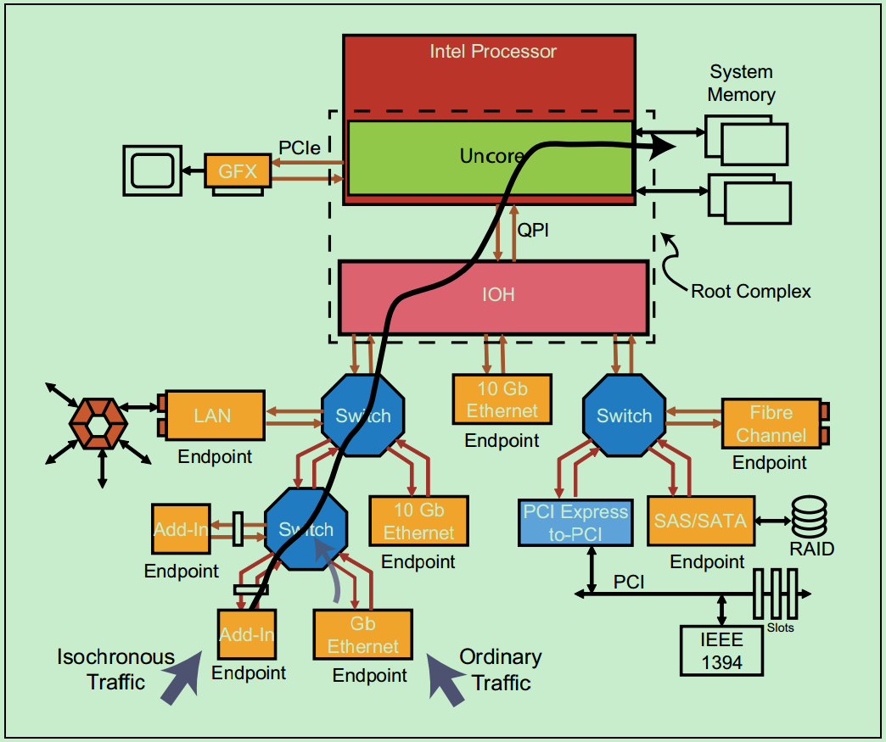

图中左下角的Endpoint（即Isochronous Traffic）的优先级比右边的Endpoint（即Ordinary Traffic）的优先级要高。因此，在Switch中，来自左边的Endpoint的包会得到优先传输。而Switch的这种判决操作叫做端口仲裁（Port Arbitration）。

默认情况下，VC Buffer中的数据包是按照包达到的时间顺序，依次放入VC Buffer中的。但是也并不是总是这样，PCIe总线继承了PCI/PCI-X总线关于Transaction-Ordering和Relaxed-Ordering的架构，但也只是针对相同的TC值才有效。关于Transaction-Ordering和Relaxed-Ordering，大家可以去参考PCI-X的Spec，这里不再详细地介绍。

对于大部分的串行传输协议而言，发送方能够有效地将数据发送至接收方的前提是，接收方有足够的接收Buffer来接收数据。在PCI总线中，发送方在发送前并不知道接收法是否有足够的Buffer来接收数据（即接收方是否就绪），因此经常需要一些Disconnects和Retries的操作，这将会严重地影响到总线的传输效率（性能）。

PCIe总线为了解决这一问题，提出了Flow Control的概念，如下图所示。PCIe总线中要求接收方必须经常（在特定时间）向发送方报告其VC Buffer的使用情况。而报告的方式是，接收方向发送方发送Flow Control的DLLP（数据链路层包），且这种DLLP的收发是由硬件层面上自动完成的，并不需要人为的干预。需要注意的是，虽然这一操作旨在数据链路层之间进行，但是这些VC Buffer的使用情况对于应用层（软件层）也是可见的。

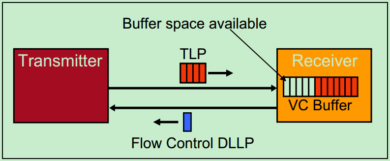

采用Flow Control机制的PCIe总线，相对于PCI总线获得了更高的总线利用率。虽然增加了Flow Control DLLP，但是这些DLLP对带宽的占用极小，几乎对总线利用率没有什么影响。

## PCIe总线数据链路层入门

前面的文章介绍过，数据链路层（Data Link Layer）主要进行链路管理（Link Management）、TLP错误检测，Flow Control和Link功耗管理。

数据链路层不仅可以转发来自事务层的包（TLP），还可以直接向另一个相邻设备的数据链路层直接发送DLLP，比如应用于Flow Control和Ack/Nak的DLLP。如下图所示：

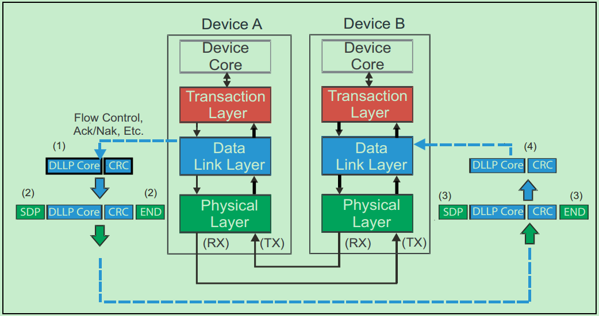

数据链路层还实现了一种自动的错误校正功能，即Ack/Nak机制。如下图所示，发送方会对每一个TLP在Replay Buffer中做备份，直到其接收到来自接收方的Ack DLLP，确认该DLP已经成功的被接受，才会删除这个备份。如果接收方发现TLP存在错误，则会向发送发发送Nak DLLP，然后发送方会从Replay Buffer中取出数据，重新发送该TLP。

**注：**关于Ack/Nak机制，后面的文章会详细的介绍。

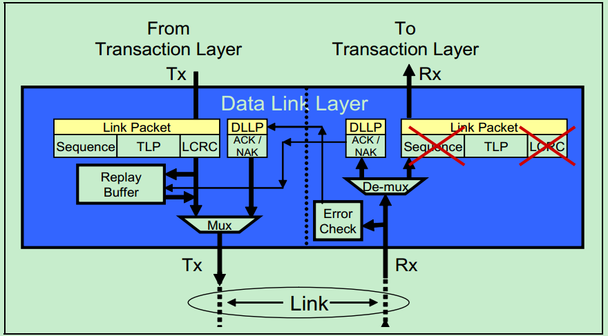

两种DLLP（转发TLP的DLLP，用于Flow Control或Ack/Nak等的DLLP）的结构图分别如下图所示：

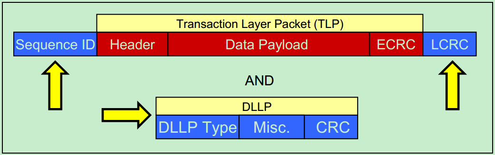

一个Non-Posted传输中，Ack/Nak的执行过程如下图所示：

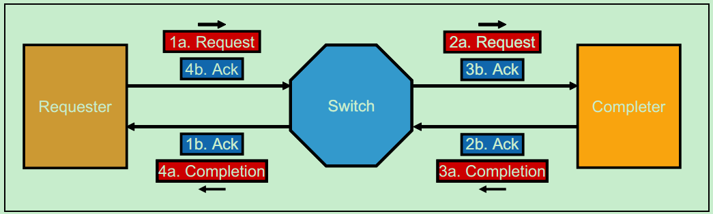

## PCIe总线物理层入门

前面的文章简单的介绍了一些关于PCIe总线事务层（Transaction Layer）和数据链路层（Data Link Layer）的一些基本概念。这篇文章来继续聊一聊PCIe总线的最底层——物理层（Physical Layer）。在PCIe Spec中，物理层是被分为两个部分单独介绍的，分别是物理层逻辑子层和物理层电气子层，其中后者一般都是基于SerDes来实现的。本篇文章只是简单地介绍一些PCIe物理层的基本概念，关于物理层详细、深入地介绍，请关注我后续的连载博文。

由于物理层处于PCIe体系结构中的最底层，所以无论是TLP还是DLLP都必须通过物理层完成收发操作。来自数据链路层的TLP和DLLP都会被临时放入物理层的Buffer中，并被加上起始字符（Start & End Characters），这些起始字符有的时候也被称为帧字符（Frame Characters）。具体如下图所示：

**注：**这里所说的TLP和DLLP指的是包的原始发送者发的包，即TLP表示这个包的原始发送者为事务层，而DLLP则为数据链路层。但是TLP仍然会被数据链路层转发，并添加Sequence和LCRC。

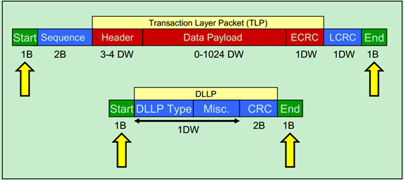

物理层完成的一个重要的功能就是8b/10b编码和解码（Gen1 & Gen2），Gen3及之后的PCIe则采用了128b/130b的编码和解码机制。关于8b/10b，这里不再详细地介绍了，有兴趣的可以去参考一下我之前的文章：http://blog.chinaaet.com/justlxy/p/5100052814。

物理层的另一个重要的功能时进行链路（Link）的初始化和训练（Initialization & Training），且是完全自动的操作，并不需要人为的干预。完成链路的初始化和训练之后，便可以确定当前PCIe设备的一些基本属性：

·    链路的宽度（Link Width，x1还是x2，x4……）

·    链路的速率（Link Data Rate）

·    Lane Reversal - Lanes connected in reverse order

·    Polarity Inversion – Lane polarity connected backward

·    Bit Lock Per Lane – Recovering the transmitter clock

·    Symbol Lock Per Lane – Finding a recognizable position in the bit-stream

·    Lane-to-Lane De-skew Within a Multi-Lane Link

物理层的电气子层主要实现了差分收发对，如下图所示：

由于其速度很高，因此采用的是交流耦合的方式（AC-Coupled），说白了就是在信号线上加了电容Ctx，此时低频信号和直流信号都会被抑制。

**注：**图中的电容容值有误，应为75~265nF for Gen1 & Gen2, 176~265nF for Gen3 & newer.

需要注意的是，PCIe物理层处理可以转发TLP和DLLP之外，还可以直接发送命令集（Ordered Sets）。之所以称其为命令集，是因为它并不是真正意义上的包（Packet），因为物理层不会为其添加起始字符（Start & End Characters）。并且命令集始于发送端的物理层，结束语接收端的物理层。虽然命令集没有起始字符，但是对于Gen1&Gen2版本的PCIe物理层来说，会为其添加一个叫做COM的字符作为开始字符，随后跟着三个或者更多的信息字符。

**注：**PCIe Gen3及之后的版本处理方式有所不同，但是Gen3是向前兼容Gen1 & Gen2的。由于本文主要还是基于Gen2来介绍的，所以关于Gen3的更多信息，大家可以自行参考PCIe Gen3 的Spec。

命令集（Ordered Sets）的收发示意图，如下图所示：

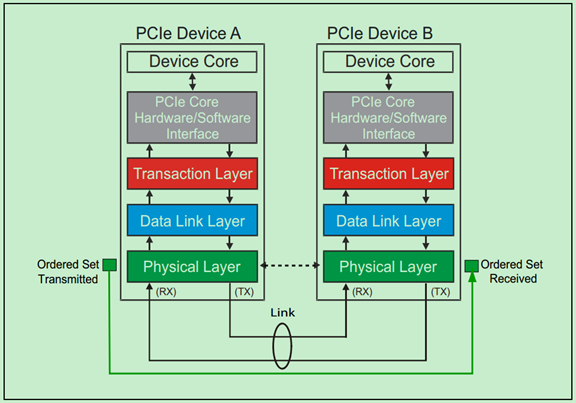

命令集（Ordered Sets）的结构图如下图所示：

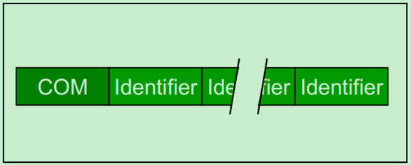

命令集主要用于链路的训练操作（Link Training Process）。此外，命令集还用于链路进入或者退出低功耗模式的操作。

## PCIe一个Memory Read的例子

前面的一系列文章简要地介绍了PCIe总线的结构、事务层、数据链路层和物理层。下面我们用一个简单地的例子来回顾并总结一下。

如下图所示，Requester的应用层（软件层）首先向其事务层发送如下信息：32位（或者64位）的Memory地址，事务类型（Transaction Type），数据量（以DW为单位），TC（Traffic Class，即优先级），字节使能（Byte Enable）和属性信息（Attributes）等。

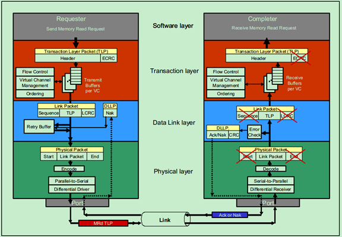

然后接收端的事务层使用这些信息创建了一个Mrd TLP（Memory Read的事务层包），并将Requester的ID（BDF，Bus & Device & Function）写入到该TLP的Header中，以便Completer根据这一BDF将Completion信息返回给Requester。然后这个TLP会根据其TC的值被放到对应的VC Buffer中，Flow Control逻辑便会检测接收端的对应的接收VC Buffer空间是否充足。一旦接收端的VC Buffer空间充足，TLP便会准备被向接收端发送。

**注：**TLP的Header实际上有两种，32位的地址对应的是3DW的Header，64为的地址对应的是4DW的Header。这在后续的文章中会详细介绍。

当TLP到达数据链路层（Data Link Layer）时候，数据链路层会为其添加上12位的序列号（Sequence Number）和32位的LCRC。并将添加上这些信息之后的TLP（即DLLP）在Replay Buffer中做一个备份，并随后将其发送至物理层。

物理层接收到DLLP之后，为其添加上起始字符（Start & End Characters，又叫帧字符，Frame Characters），然后依次进行解字节（Strip Byte）、扰码（Scramble）、8b/10b编码并进行串行化，随后发送至相邻的PCIe设备的物理层。

接收端PCIe设备（即Completer）的物理层接收到数据之后，依次执行与发送端相反的操作。并从数据中恢复出时钟，然后将恢复出来的DLLP发送至数据链路层。

Completer的数据链路层首先检查DLLP中的LCRC，如果存在错误，则向Requester发送一个Nak类型的DLLP，该DLLP包含了其接受到的DLLP中的序列号（Sequence Number）。Requester的数据链路层接收到来自Completer的Nak DLLP之后，从中找到序列号（Sequence Number），并根据序列号在Replay Buffer找到对应的DLLP，然后将其重新发送至Completer。如果Completer的数据链路层没有检查到LCRC的错误，也会向Requester发送一个Ack类型的DLLP，该DLLP同样包含了其接收到的DLLP中的序列号。Requester的数据链路层接收到之一Ack DLLP之后，便会根据其中的序列号在Replay Buffer中找到对应的DLLP的备份，并将其丢弃（Discard）。

当接收端PCIe设备（即Completer）的数据链路层正确的接收到了来自Requester的DLLP（包含TLP的）时，随后将其进一步发送至事务层，事务层检查ECRC（可选的），并对TLP进行解析，然后将解析后的信息发送至应用层（软件层）。

如下图所示，Completer的应用层会根据接受到的信息进行相应的处理，处理完成后会将数据发送至事务层，事务层根据这一信息创建一个新的TLP（即CplD，Completion with data）。并根据先前接收到的TLP中的BDF信息，找到原来的Requester，然后将CplD发送至该Requester。这一发送过程与Requester向Completer发送TLP（Mrd Request）的过程基本是一致的。所以这里就不在重复了。

**注：**如果Completer不能够返回有效数据给Requester，或者遇到错误，则其返回的就不是CplD了，而是Cpl（Completion without data），Requester接收到Cpl的TLP之后便会知道发生了错误，其应用层（软件层）会进行相应的处理。

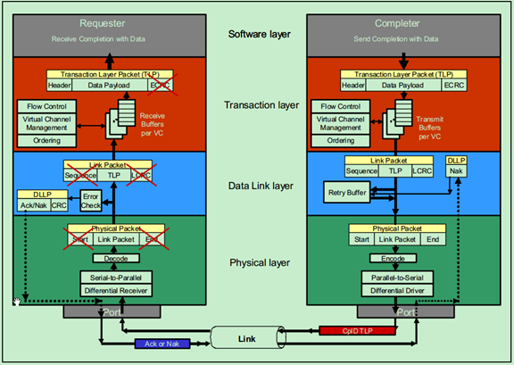

## 8b/10b编解码原理

简而言之，两个原则：1. 保证编码后，长时间传输时0和1的位数基本相等，方便接收端识别。2. 保证编码后，基本不出现长时间连续的0或1，提高电平跳变密度，使定时提取较为简单。（至于编码对应关系，基本没什么好看的确定的规则）

[8B / 10B Encode/Decode详解-Felix-电子技术应用-AET-中国科技核心期刊-最丰富的电子设计资源平台 (chinaaet.com)](http://blog.chinaaet.com/justlxy/p/5100052814)

**1、编码技术基础理论**

  在高速的串行数据传输中，传送的数据被编码成自同步的数据流，就是将数据和时钟组合成单一的信号进行传送，使得接收方能容易准确地将数据和时钟分离，而且要达到令人满意的误码率，其关键技术在于串行传输中数据的编码方法。

  目前， 高速接口正在被广泛应用于包括 SATA、 SAS、 高速 PCI 等多种标准中。 这些接口的速率甚至可以达到并超过每线 10Gbits/s。 同时， 所有主流 ASIC 和 FPGA 平台也都支持这些高速接口技术。 从结构上看， 这些高速接口主要包括三个组成部分：

  1） 电路部分（串行/解串行）
  2） 物理部分（实现编码）
  3） 链路与协议部分（高层）

  支持多速率、 多协议的串行/解串行器已经实现。 以 OIF（光互联论坛） 为例， 他们已经为两组速率制定了电路规范， 分别为 5Gbits/s- 6.375Gbits/s 和 10Gbits/s-11Gbits/s。 OIF 同样为两种应用距离制定了规范， 分别为短距离（采用一个连接器， 8 英寸） 和长距离（采用两个连接器， 40 英寸）。 串行/解串行器还可以被设计用来满足更多的规范， 包括不同的速率、距离、 电路规格等等。

  物理部分的主要任务是对数据进行编码， 以保证串行/解串行器的正常运行。 这些编码的目的包括： 确保必须的变换（“1” 到“0” 和“0” 到“1” 的变换）， 保证稳定的直流均衡（“0” 码与“1” 码的个数相当）， 以及满足其它标准的要求（最大化信道带宽利用率， 提高对误差的容忍能力等等）。

  在光纤通信中， 线路编码是必要的， 因为电端机输出的数字信号是适合电缆传输的双极性码， 而光源不能发射负脉冲， 只能用光脉冲的“有” 和“无” 来表示二进制码中的“1”和“0"。 该方法虽然简单， 却存在三个问题：

  1)遇到数字序列中出现长连“0” 或长连“1” 时， 将给光纤线路上再生中继器和终端光接收机的定时信息提取工作带来困难;
  2)简单的单极性码中含有直流分量。 由于线路上光脉冲中“1” 和“0” 是随机变化的，这将导致单极性码的直流成分也作随机性的变化。 这种随机性变化的直流成分， 可以通过光接收机的交流耦合电路引起数字信号的基线漂移， 给数字信号的判决和再生带来困难;
  3)不能实现不中断通信业务下的误码检测;

  为解决以上问题， 通常对于由电端机输出的信号码流， 在未对 LED(或 LD)调制以前，一般要先进行码型变换使调制后的光脉冲码流由简单的单极性码，转换为适合于数字光纤传输系统传输的线路码。 适合于光纤通信的线路码型有多种， 但都要满足以下要求:

  1)能保证比特序列独特性。
  2)能提供足够的定时信息。

  由于在光纤数字传输系统的传输中， 只传送信码， 而不传送时钟， 因此在接收端， 必须从收到的码流中提取出定时信息， 以利于上述的定时提取。 必须限制线路码流中同符号连续数不能过大， 也就是说， 应避免长连“0” 及长连“1” 的出现， 提高电平跳变的密度， 使定时提取较为简单。

  3)减少功率密度中的高低频分量。
线路码的功率谱密度中的低频分量是由码流中的“0”、“1” 分布状态来决定的， 低频分量小， 说明“0”、 “1”分布比较均匀， 直流电平比较恒定， 也就是信号基线浮动小， 有利于接收端判决电路的正常工作。 高频分量是由线路码的速率决定的， 这在带宽(色散)限制系统中特别值得注意， 在这种系统中， 中继距离主要由光纤线路的总带宽(总色散)决定， 如果线路码速率提高的太多， 会使中继距离大大缩短。

  4)要有利于减少码流的基线漂移， 即要求码流中的“1"、 "0” 码分布均匀， 否则不利于接收端的的再生判决。
  5)码率增加要少， 光功率代价要低。
  6)接收端将线路码还原后， 误码增殖要小。
  线路传输中发生的一个误码， 往往使接收端的解码(反变换)发生多个错误， 这就是误码倍增， 也叫做误码扩展或误码增值。 由于误码倍增， 使光接收机要达到原要求的误码性能指标， 必须付出光功率代价， 即光接收机灵敏度劣化。 因此误码倍增系数越小越好。
  7)能提供适当的冗余度。
  8） 低的对称抖动。
  传输的比特序列必须保持低的码型相关的抖动。
  9)易于实现。
  数字光纤通信系统中常用的线路码型有:加扰二进码、 插入比特码和 mBnB 码。

**2、8B/10B 编解码原理**

  8B/10B编码最初由IBM公司的Albert X.Widemer和Peter A.Franaszek发明，并应用于ESCON(200M互连系统)中。 它是mBnB编码中的一个特例。
  8B/10B编码方法是把8bit代码组合编码成10bit代码，代码组合包含256个数据字符编码和12个控制字符编码，分别记为Dx. y和Kx.y。 通过仔细选择编码方法可以获得不同的优化特性。 这些特性包括满足串行/解串行器功能必须的变换； 确保“0” 码元与“1” 码元个数的一致， 又称为直流均衡； 确保字节同步易于实现（在一个比特流中找到字节的起始位）； 以及对误码率有足够的容忍能力和降低设计复杂度。

  8B/10B编码方案是把8bit数据分成2个子分组: 3个最高有效位(y)和5个最低有效位( x)。 代码字按顺序排列，从最高有效位到最低有效位分别记为H、 G、 F和E、 D、 C、 B、 A。 3bit的子分组编码成4 bit，记为j、 h、 g、 f; 5 bit的子分组编码成6bit，记为i、 e、 d、 c、 b、a，其映射关系如图1所示，4bit和6bit的子分组再组合成10bit的编码值。

  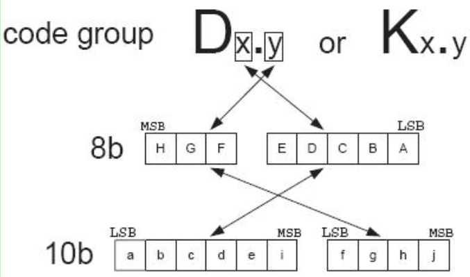

图1 8B/10B码编码原理图

  将8bit数据分成3bit和5bit两组，分别对应10bit中的4bit和6bit，直流平衡代码的不平衡度就是通过“0” 的个数减去“1” 的个数来计算得到的。 如果4bit和6bit的各分组中“0”和“1” 的个数相等，称为完美平衡代码，或称为完美的直流平衡代码，无需补偿，但是这种情况是不可能的。 **因为在4bit的子分组中，16种编码中只有6 种是完美平衡的，这对于3bit的8种编码值是不够的。 同时，在6bit的子分组中也只有20种编码是完美平衡的，对于5bit的32种编码值也是不够的。** 由于4 bit和6bit的两个子分组都是偶数个位数，而不平衡度不可能是“+1” 或“-1”，因此，在8B/10B编码方案中还要使用不平衡度为“+2” 和“-2” 的值。 在编码过程中，用一个极性偏差( running disparity，RD)参数表示不平衡度，**在不平衡时用2个10 bit字符表示一个8位字符**，其中一个称为RD- ，表示“1” 的个数比“0” 的个数多2个，另一个称为RD+ ，表示“0” 的个数比“1” 的个数多2个。如下图所示：

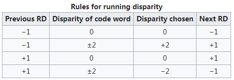

  8B/10B编码中将K28.1、K28.5和K28.7作为K码的控制字符，称为“comma”。在任意数据组合中，comma只作为控制字符出现，而在数据负荷部分不会出现，因此可以用comma字符指示帧的开始和结束标志，或始终修正和数据流对齐的控制字符。

  编码时，低5bit原数据 EDCBA经过5B/6B编码成为6bit码abcdei，高3bit原数据HGF经3B/4B成为4bit码fghj，最后再将两部分组合起来形成一个10bit码abcdeifghj。10B码在发送时，按照先发送低位在发送高位的顺序发送。

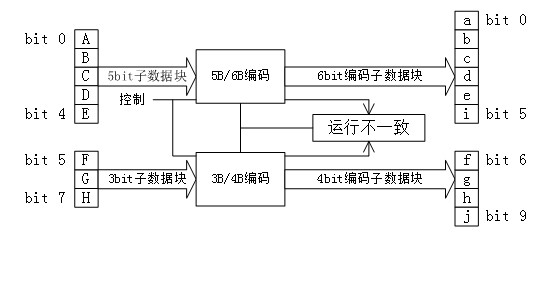

  5B/6B编码和3B/4B编码的映射有标准化的表格，可以通过基于查找表的方式实现。使用 “不一致性（Disparity）”来描述编码中"1"的位数和"0"的位数的差值，它仅允许有"+2"(  "0"比"1"多两个)、"0"（ "0"与"1"个数相等）以及"-2"（"1"比"0"多两个）这三种状况。 由于数据流不停地从发送端向接收端传输，前面所有已发送数据的不一致性累积产生的状态被称为“**运行不一致性（Runing Disparity，RD）**”。RD仅会出现+1与-1两种状态，分别代表位"1"比位"0"多或位"0"比位"1"多，其初始值是-1。Next RD值依赖于Current RD以及当前6B码或者4B码的Disparity。根据Current RD的值，决定5B/4B和 3B/4B编码映射方式，如下图所示。

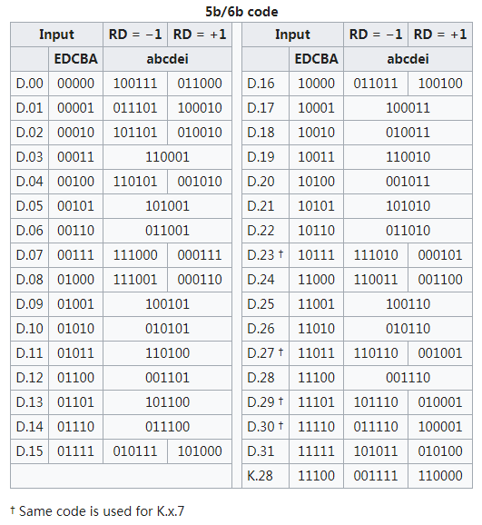

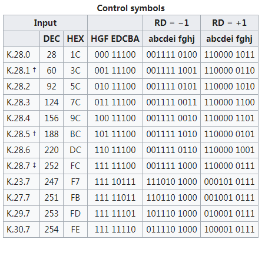

  这样，经过8B/10B编码以后，连续的“1”和“0”基本上不会超过5bit，**只有在使用comma时，才会出现****连续的5个0或1。**接收端的数据解码过程如下图所示：

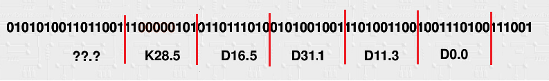

**3、\**8B/10B 码的优势\****

  8B/10B编码技术编码之所以能得到广泛应用，主要在于它较好地解决了以下问题。
  (1) 转换密度:
  保证数据流中有足够的信号转换。 采用8B/10B编码方法，数据流中连续的“1” 或连续的“0”不超过5个，使接收端锁相环( PLL)能正常工作，避免接收端时钟漂移或同步丢失而引起数据丢失。 保证了1和0的相对平衡组合，而与数据值无关，简化了时钟恢复，降低了接收机成本。
  (2)DC补偿:
在高速的数据传输线路中，一般采用差分信号，需要直流分量尽量小，而8B/10B有DC补偿功能，即链路中不会随着时间推移而出现DC偏移。
  (3)检错:
8B/10B编码采用冗余方式，将8位的数据和一些特殊字符按照特定的规则编码成10位的数据，根据这些规则，能检测出传输过程中单个和多个比特误码。
  (4)特殊字符:
  8B/10B编码规定了一些特殊字符，可用作帧同步字符和其他的分隔符或控制字符， 有助于比特流的码组定位和信息识别。 许多独立标准都以这个公共字符集为基础，定义更高的协议层：

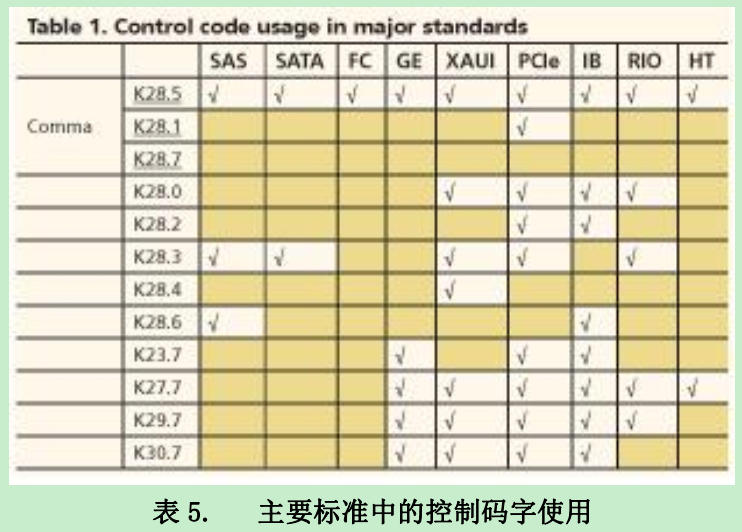

  (5)链路灵活性：
  由于采用 8B/10B 编码， 链路可以是交流(AC)耦合的， 这样就给任一端的设备厂商提供了更大的灵活性。

***\*4、\*\*8B/10B 码的实现与应用\*\**\***

  进行编解码设计时通大体下面几种方法。
  第一种是用查找表直接将8位信号映射成10位信号，该方法用存储器存储所有可能出现的码组，再将输入码组转换为存储地址，找出对应的编解码。 方法逻辑简单，开发时间很短，但是编解码电路的工作速度受到FPGA内部存储器读取时间的限制，同时不可避免地增加了芯片的面积和功耗。
  第二种是通过逻辑运算直接完成编解码功能对，该方法的优点是可以明显减小内部使用面积，难点在于逻辑关系复杂。如果采用卡诺图直接化简则会产生大扇入逻辑表达式，大大限制电路的最高工作速度，同时对逻辑电路的驱动也将加大电路功耗。
  第三种是，8B/10B编码模块化实现，较好地反映了8B/10B编码的特点，实现流程清楚。 实现步骤: 

  ①判断是特殊字符还是数据;

  ②若是特殊字符，根据RD极性直接取值; 

  ③若是数据，把一节8位字节拆成3bit和5bit，然后在RD控制器的控制下以并列的方式编/译码。 RD控制器的原则是： 系统设定的RD默认初始值为RD-， RD的初值作为选择信号用以决定5B/6B编码模块中6B码的选取， 同时由所选取的6B码计算出新的RD值作用于3B/4B编码模块。 4B编码所得到的RD值又作为下一组编码的RD输入值， 由此完成了全部的8B/10B编码。
  这种方法的组合逻辑实现可以简化码表、 减小电路板的面积、 有效提高编码工作速度。同时由于电路板的面积减小，功耗也显著降低。

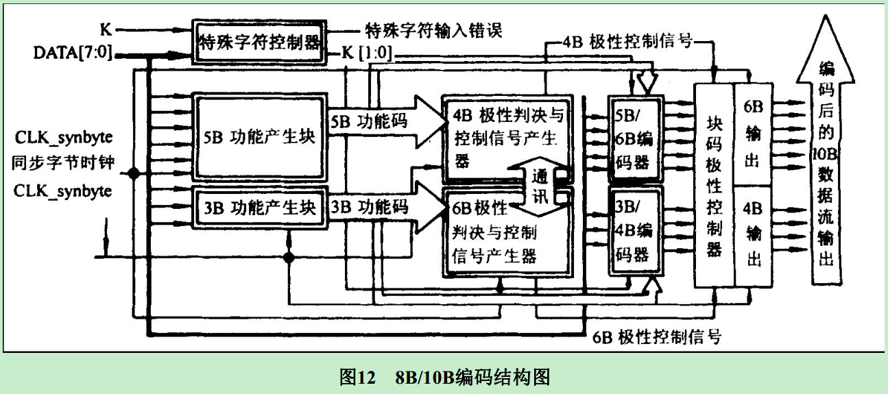

目前大多数高速串行标准都采用8B/10B编码方案，例如串行连接SCSI、 串行ATA、 光纤链路、 吉比特以太网、 XAUI（1吉比特接口）、 PCI Express总线、 InfiniBand、 Serial RapidIO、HyperTransport总线、 DVB-ASI以及IEEE1394b接口（火线） 技术中。

## BDF与配置空间

前面的文章中介绍过，每一个PCIe设备可以只有一个功能（Function），即Fun0。也可以拥有最多8个功能，即多功能设备（Multi-Fun）。不管这个PCIe设备拥有多少个功能，其每一个功能都有一个唯一独立的配置空间（Configuration Space）与之对应。

和PCI总线一样，PCIe总线中的每一个功能（Function）都有一个唯一的标识符与之对应。这个标识符就是BDF（Bus，Device，Function），PCIe的配置软件（即Root的应用层，一般是PC）应当有能力识别整个PCIe总线系统的拓扑逻辑，以及其中的每一条总线（Bus），每一个设备（Device）和每一项功能（Function）。

在BDF中，Bus Number占用8位，Device Number占用5位，Function Number占用3位。显然，PCIe总线最多支持256个子总线，每个子总线最多支持32个设备，每个设备最多支持8个功能。

PCIe总线采用的是一种深度优先（Depth First Search）的拓扑算法，且Bus0总是分配给Root Complex。Root中包含有集成的Endpoint和多个端口（Port），每个端口内部都有一个虚拟的PCI-to-PCI桥（P2P），并且这个桥也应有设备号和功能号。

需要注意的是，每个设备必须要有功能0（Fun0），其他的7个功能（Fun1~Fun7）都是可选的。

一个简单的例子如下图所示：

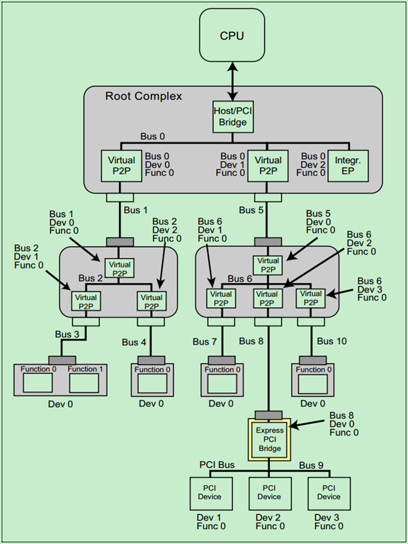

**注：**关于PCIe总线的拓扑逻辑会在后面的文章中进行详细地介绍。

前面的关于PCI总线的文章介绍过PCI总线的配置空间，PCIe总线为了兼容这些PCI设备，几乎完整的保留了PCI总线的配置空间。并将配置空间扩展到4KB，用于支持一些PCIe总线中新的功能，如PCI Express Capability、Power Management和MSI/MSI-X等。

下图是从PCI总线中继承过来的配置空间：

下图是PCIe新增的配置空间的示意图：

 

## PCIe配置空间的读写机制

需要特别注意的是，PCIe的Spec中明确规定只有Root有权限发起配置请求（Originate Configuration Requests），也就是说PCIe系统里面的其他设备是不允许去配置其他设备的配置空间的，即peer-to-peer的配置请求是不允许的。并且配置请求的路由（Routing）方式只能是采用BDF（Bus，Device，Function）。

处理器一般不能够直接发起配置读写请求，因为其只能产生Memory Request和IO Request。这就意味着Root必须要将处理器的相关请求转换为配置读写请求。针对传统的PCI设备（Legacy PCI），采用的是IO间接寻址访问（IO-indirect Accesses）；针对PCIe设备，采用的是Memory-Mapped Accesses。

关于Legacy PCI的IO-indirect Accesses，在前面介绍PCI的文章中实际上已经讲过了。可以参考如下两篇文章：

| 7、PCIe扫盲——PCI总线的地址空间分配：http://blog.chinaaet.com/justlxy/p/5100053219 |
| ------------------------------------------------------------ |
| 8、PCIe扫盲——PCI总线配置周期产生和配置寄存器：http://blog.chinaaet.com/justlxy/p/5100053220 |

前面的文章还介绍过，Root和Switch的每一个端口中都包含一个P2P桥，并且知道桥的配置空间头（Configuration Space Header）是Type1型的。如下图所示： 

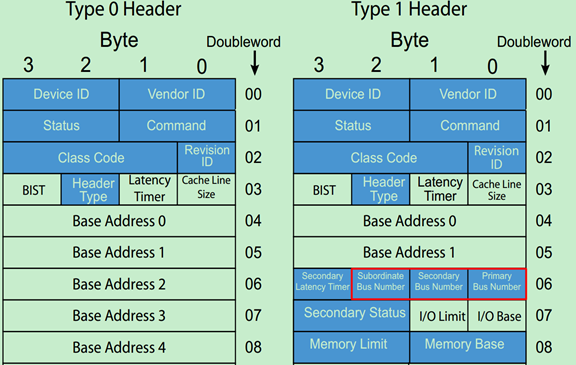

每个Type1型的Header中都包含最后一级总线号（Subordinate Bus Number）、下一级总线号（Secondary Bus Number）和上一级总线号（Primary Bus Number）等信息。当配置请求进行BDF路由的时候，正是依靠这些信息来确定要找的设备的。一个简单地例子如下图所示：

**注：**上面的例子是整个PCIe总线系统中只有一个Root的情况，实际上PCIe Spec还允许总线系统中存在多个Root（即Multi-Root）。关于Multi-Root，这里就不详细地介绍了，有兴趣地可以自行阅读PCIe的Spec。

## Type0 & Type1型配置请求

前面的文章中介绍过有两种类型的配置空间，Type0和Type1，分别对应非桥设备（Endpoint）和桥设备（Root和Switch端口中的P2P桥）。

Type0还是Type1是由事务层包（TLP）包头中的Type Field所决定的，而读还是写则是由TLP包头中的Format Field所决定的。分别以下两张图所示：

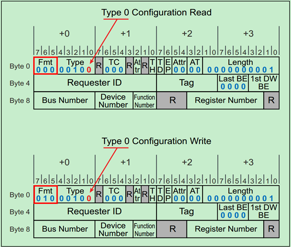

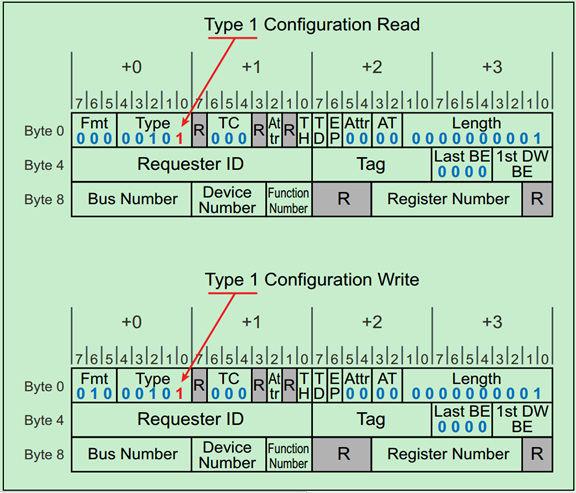

之前的文章中强调过，PCIe中只有Root才可以发起配置空间读写请求，并且我们知道Root的每个端口中都包含有一个P2P桥。当Root发起配置空间读写请求时，相应的桥首先检查请求的BDF中的Bus号是否与自己的下一级总线号（Secondary Bus Number）相等，如果相等，则先将Type1转换为Type0，然后发给下一级（即Endpoint）。

如果不相等，但是在自己的下一级总线号（Secondary Bus Number）和最后一级总线号（Subordinate Bus Number）之间，则直接将Type1型请求发送给下一级。如果还是不相等，则该桥认为这一请求和自己没什么关系，则忽略该请求。

**注：**Root最先发送的配置请求一定是Type1型的。非桥设备（Endpoint）会直接忽略Type1型的配置请求。

一个简单的例子如下图所示：

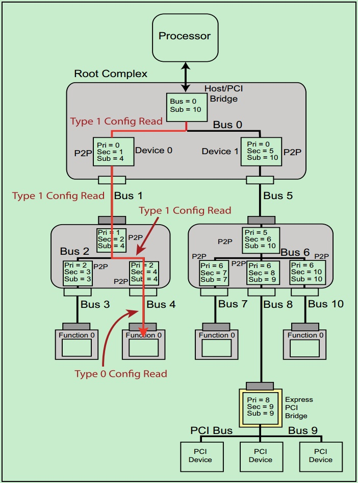

**注：**原计划中的“PCIe扫盲——PCIe总线的拓扑逻辑”这一篇取消了。大家如果有兴趣的，可以自行阅读PCIe Spec或者MindShare的书籍。

## PCIe Memory & IO地址空间

早期的PC中，所有的IO设备（除了存储设备之外的设备）的内部存储或者寄存器都只能通过IO地址空间进行访问。但是这种方式局限性很大，而且效率低，于是乎，软件开发者和硬件厂商都不能忍了……然后一种新的东西就出来了——MMIO。MMIO，即Memory Mapped IO，也就是说把这些IO设备中的内部存储和寄存器都映射到统一的存储地址空间（Memory Address Space）中。但是，为了兼容一些之前开发的软件，PCIe仍然支持IO地址空间，只是建议在新开发的软件中采用MMIO。

**注：**PCIe Spec中明确指出，IO地址空间只是为了兼容早期的PCI设备（Legacy Device），在新设计中都应当使用MMIO，因为IO地址空间可能会被新版本的PCI Spec所抛弃。

IO地址空间的大小是4GB（32bits），而MMIO则取决于处理器（和操作系统），并且由处理器进行统一分配管理。

如下图所示，PCIe总线中有两种MMIO：P-MMIO和NP-MMIO。

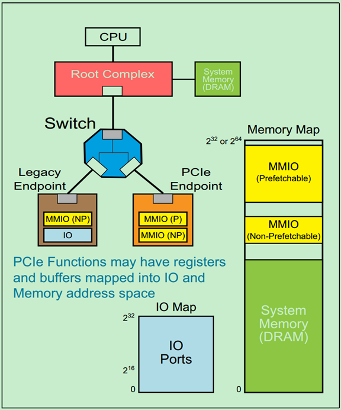

P-MMIO，即可预取的MMIO（Prefetchable MMIO）；NP-MMIO，即不可预取的MMIO（Non-Prefetchable MMIO）。其中P-MMIO读取数据并不会改变数据的值。

**注：**P-MMIO和NP-MMIO主要是为了兼容早期的PCI设备，因为PCIe请求中明确包含了每次的传输的大小（Transfer Size），而PCI并没有这些信息。

## PCIe基地址寄存器（BAR）详解

基地址寄存器（BAR）在配置空间（Configuration Space）中的位置如下图所示：

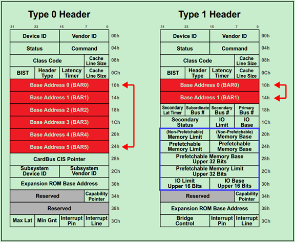

其中Type0 Header最多有6个BAR，而Type1 Header最多有两个BAR。这就意味着，对于Endpoint来说，最多可以拥有6个不同的地址空间。但是实际应用中基本上不会用到6个，通常1~3个BAR比较常见。

主要注意的是，如果某个设备的BAR没有被全部使用，则对应的BAR应被硬件全被设置为0，并且告知软件这些BAR是不可以操作的。对于被使用的BAR来说，其部分低比特位是不可以被软件操作的，只有其高比特位才可以被软件操作。而这些不可操作的低比特决定了当前BAR支持的操作类型和可申请的地址空间的大小。

一旦BAR的值确定了（Have been programmed），其指定范围内的当前设备中的内部寄存器（或内部存储空间）就可以被访问了。当该设备确认某一个请求（Request）中的地址在自己的BAR的范围内，便会接受这请求。

下面用几个简单的例子来熟悉BAR的机制：

**例1.**    **32-bit Memory Address Space Request**

如下图所示，请求一个4KB的NP-MMIO一般需要以下三个步骤：

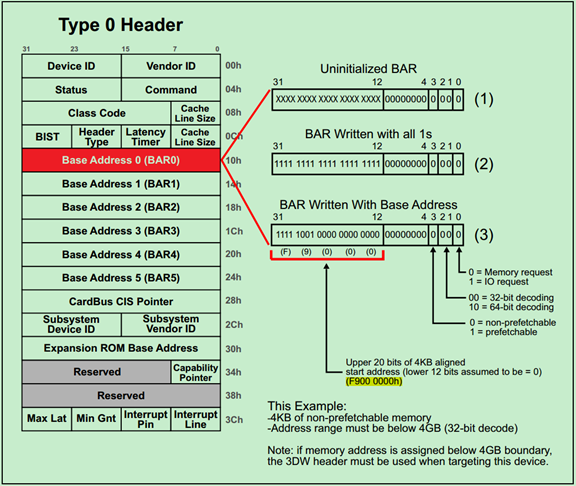

Step1：如图中（1）所示，未初始化的BAR的低比特（11~4）都是0，高比特（31~12）都是不确定的值。所谓初始化，就是系统（软件）向整个BAR都写1，来确定BAR的可操作的最低位是哪一位。当前可操作的最低位为12，因此当前BAR可申请的（最小）地址空间大小为4KB（2^12）。如果可操作的最低位为20，则该BAR可申请的（最小）地址空间大小为1MB（2^20）。

Step2：完成初始化（写1操作）之后，软件便开始读取BAR的值，来确定每一个BAR对应的地址空间大小和类型。其中操作的类型一般由最低四位所决定，具体如上图右侧部分所示。

Step3：最后一步是，软件向BAR的高比特写入地址空间的起始地址（Start Address）。如图中所示，为0xF9000000。

**例2.**    **64-bit Memory Address Space Request**

下面是一个申请64MB P-MMIO地址空间的例子，由于采用的是64-bit的地址，因此需要两个BAR。具体如下图所示：

**例3.**    **IO Address Space Request**

下面是一个申请IO地址空间的例子，如下图所示：

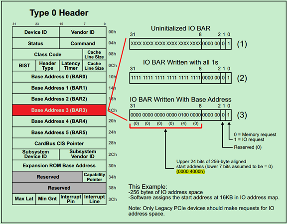

**注：**需要特别注意的是，软件对BAR的检测与操作（Evaluating）必须是顺序执行的，即先BAR0，然后BAR1，……，直到BAR5。当软件检测到那些被硬件设置为全0的BAR，则认为这个BAR没有被使用。

**注：**无论是PCI还是PCIe，都没有明确规定，第一个使用的BAR必须是BAR0。事实上，只要设计者原意，完全可以将BAR4作为第一个BAR，并将BAR0~BAR3都设置为不使用。

## PCIe Base & Limit寄存器详解

上一篇文章介绍了Type0型配置空间Header中的BAR的作用和用法，但是PCIe中的桥设备（Switch和Root中的P2P）又是如何判断某一请求（Request）是否属于自己或者自己的分支下的设备的呢？这实际上是通过Type1型配置空间Header中的Base和Limit寄存器来实现的，这篇文章来进行简单地介绍一下。

Base和Limit寄存器在Type1 Header中的位置如下图所示：

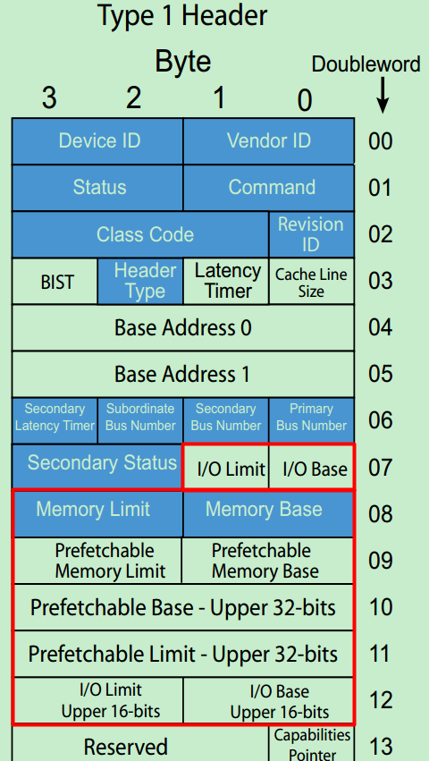

Base和Limit寄存器分别确定了其所有分支下设备（The device that live beneath this bridge）的地址的起始和结束地址。根据请求类型的不同，分别对应不同的Limit&Base组合：

·    Prefetchable Memory Space（P-MMIO）

·    Non- Prefetchable Memory Space（NP-MMIO）

·    IO Space（IO）

一旦该桥分支下面的任意设备的BAR发生改变，该桥的Base&Limit寄存器也需要做出对应的改变。

下面以一个简单的例子，来分析一下：

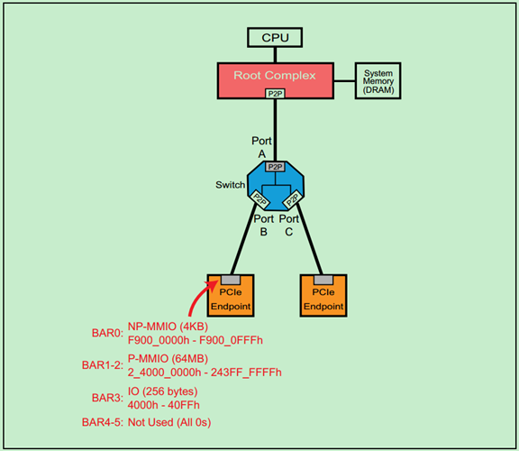

如上图所示，连接到Switch的PortB上的PCIe Endpoint分别配置了NP-MMIO、P-MMIO和IO空间。下面来简单地分析一下PortB的Header中的Base & Limit 寄存器。

**P-MMIO Base & Limit**

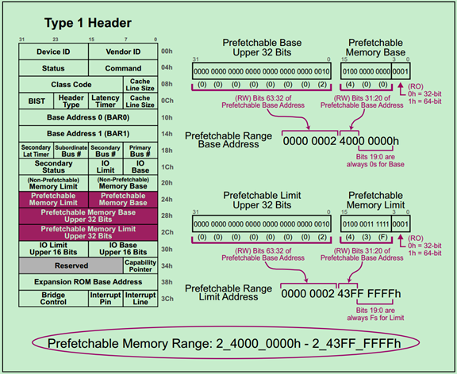

**NP-MMIO Base & Limit**

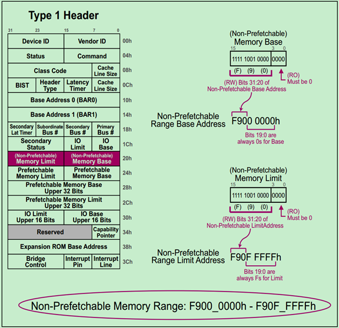

需要注意的是，Endpoint的需要的NP-MMIO的大小明明只有4KB，PortB的Header却给其1MB的空间（最小1MB），也就是说剩余的空间都将会被浪费掉，并且其他的Endpoint都将无法使用这一空间。

**IO Base & Limit**

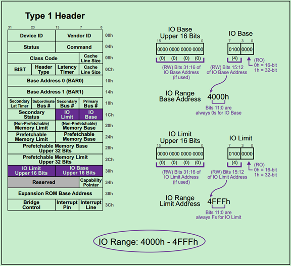

**注：**IO空间可分配的最小值为4KB，最大值则取决于操作系统和BIOS。

**Unused Base and Limit Registers**

很多情况下，我们并不需要所有的地址空间类型，比如所在某一个Endpoint中没有使用IO Space。此时，其对应的桥的Header会把Base的地址设置为大于Limit的地址，也就是把地址范围设置为无效。

一个完整的例子如下图所示：

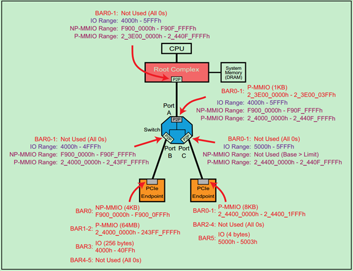

## PCIe TLP路由(routing)基础

首先来分析一个例子，如下图所示：

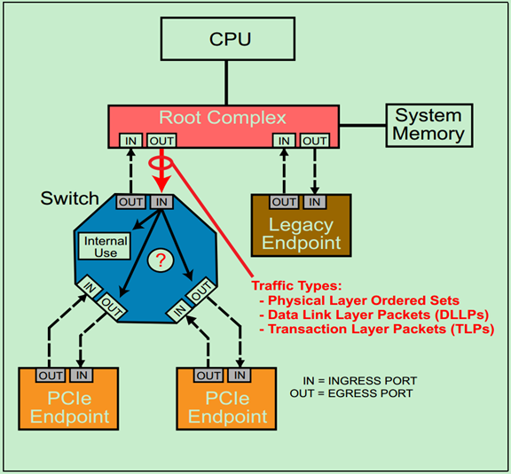

当包（Packet）到达Switch的输入端口（Ingress Port）时，端口首先会检查包是否有错误，然后根据包的路由（Routing）信息，来做出以下三种处理方式之一：

1、 接受这个包，并自己（Switch）使用它（Internal Use）；

2、 将其通过响应的输出端口（Egress Port）转发到下一级Endpoint（或者下一级Switch）；

3、 拒绝接受这个包。

在前面的文章中多次介绍过，PCIe总线中一共有三种类型的包：Ordered Sets（命令集包，只在相邻的设备的物理层之间进行传递，不会被转发到其他的设备中）、DLLPs（数据链路层包，只在相邻的设备的数据链路层之间进行传递，不会被转发到其他设备中）和TLPs（事务层包，可以根据包中的路由信息被转发到其他的设备中）。

**注：**实际上不论是TLPs还是DLLPs都会经过物理层，这里说的TLP和DLLP指的是包的最初来源分别是事务层和数据链路层，即DLLP和上一层的事务层没有什么关系，其内容和作用完全是由数据链路层自己决定的。

**注：**Endpoint不仅可以发送TLP给其上层的设备（如Root），也可以发送TLP给其他的Endpoint，当然这需要借助Switch来实现。这种传输方式叫做Peer-to-Peer。

TLP一共有三种路由方式，分别是ID路由（ID Routing，即BDF Routing）、地址路由（Address Routing，包括Memory和IO）以及模糊路由（Implicitly Routing）。本文将简单介绍一些关于TLP路由的基础知识，具体的路由方式将会在接下来的三篇文章中依次进行介绍。

具体采用哪一种路由方式是由TLP的类型所决定的，如下表所示：

**注：**AtomicOp是PCIe Spec V2.1新增的内容，有兴趣的可以自行阅读V2.1的相关内容。

**注：**一般情况下，Message都是使用模糊路由（Implicitly Routing）的，但是也有PCIe设备厂商自定义的Message会使用地址路由或者ID路由。

可能有的人要有疑惑了，既然Message可以使用地址路由或者ID路由，为什么还要单独搞出来一个模糊路由呢？原因很简单，使用模糊路由可以广播Message到每一个设备，采用其他的路由方式必须明确指定是哪一个设备。

那么PCIe中是如何来判断TLP的类型的呢？又是如何判断其为Request还是Completion的呢？实际上是通过TLP Header的Format和Type部分来确定的，如下图所示：

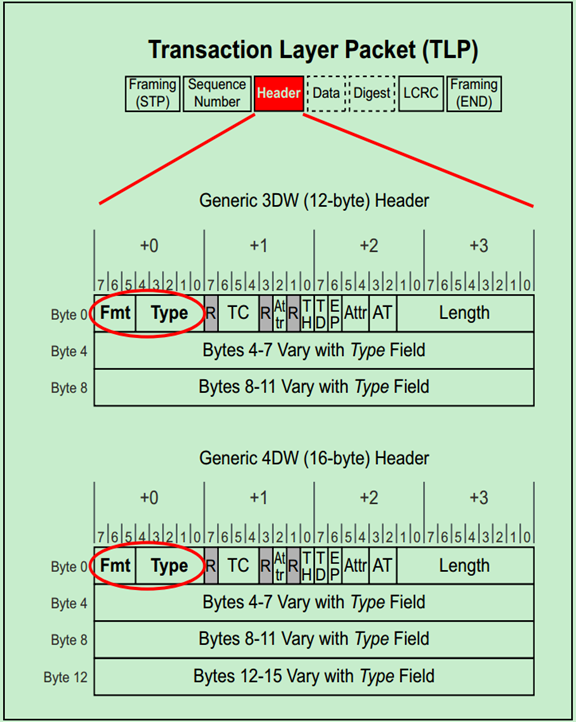

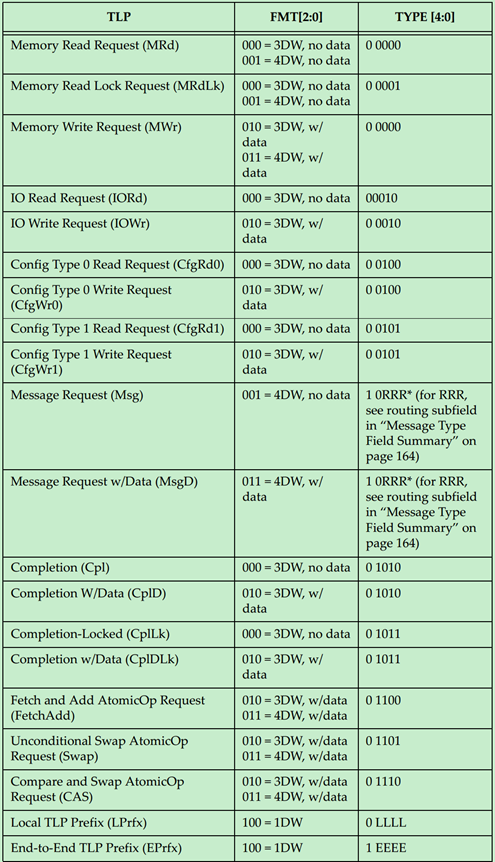

## PCIe TLP路由之ID Routing

ID 路由（ID Routing）有的时候也被称为BDF路由，即采用Bus Number、Device Number和Function Number来确定目标设备的位置。这是一种兼容PCI和PCI-X总线协议的路由方式，主要用于配置请求（Configuration Request）的路由，在PCIe总线中，其还可以被用于Completion和Message的路由。

前面的文章提到过，TLP的Header有3DW的和4DW的，其中4DW的Header一般只用于Message中。使用ID路由的TLP Header以下两张图所示，第一个为3DW Header，第二个为4DW Header：

 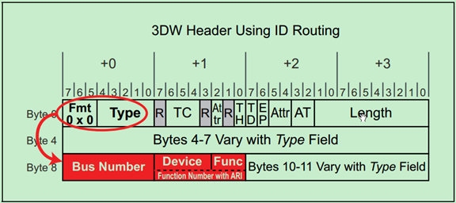

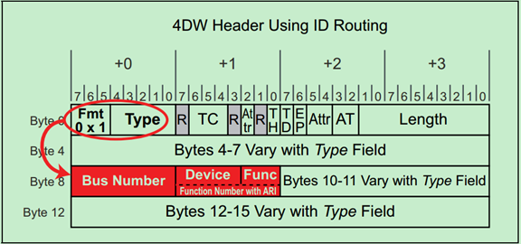

对于Endpoint来说，其只需要检查TLP Header中的BDF是否与自己的BDF一致，如果一致，则认为是发送给自己的，否则便会忽略该TLP。

**注：**很多初学者可能都会有这样的一个疑问：采用ID路由的TLP Header中并未包含Requester的ID（BDF），那么Completer怎么确定Requester的位置呢？实际上这个问题并不难回答，因为ID路由主要用于配置请求和Completion，偶尔也用于一些厂商自定义的Message。首先，配置请求的Requester只能是Root，所以不需要确定其位置；再之，Completion用于对其他路由方式的回应，如地址路由中包含了Requester的BDF；最后，Message是Posted型的，即其根本不需要Completion，自然也就不需要Requester的BDF了。

**注：**实际上PCIe是一种点对点（Point-to-Point）的通信方式，即每个链路只能连接一个设备，因此大部分情况下使用5bit的空间来描述Device Number完全是多余的。为此，PCIe Spec提出了ARI格式，这里暂时不详细介绍了，有兴趣的可以自行阅读PCIe Spec的相关内容。

对于Switch来说，则需要根据TLP Header中的BDF来判断，这个TLP是给自己的还是给自己下属的其他设备的。如下图所示：

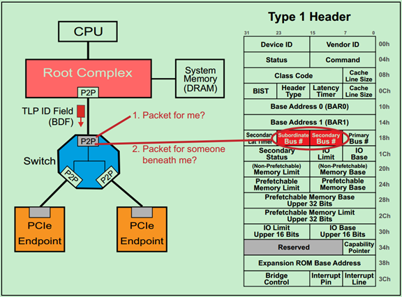

## PCIe TLP路由之Address Routing

地址路由（Address Routing）的地址包括IO和Memory。对于Memory请求来说，32bit的地址使用3DW的Header，64bit的地址使用4DW的Header。而IO请求则只能使用32bit的地址，即只能使用3DW的Header。

**注：**再次强调，IO请求是为了兼容早期的PCI设备的，在新的PCIe设备中禁止使用。

3DW和4DW的TLP Header分别如以下两张图所示：

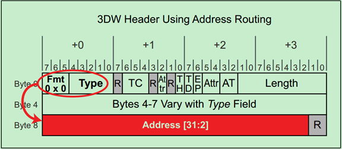

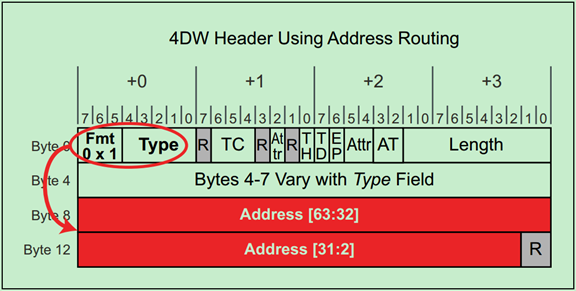

当Endpoint接收到采用地址路由的TLP时，其会根据该TLP Header中的地址信息和自己的配置空间中的BAR寄存器来判断这个TLP是不是自己的。如下图所示：

Switch的地址路由机制如下图所示：

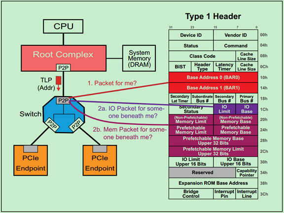

## PCIe TLP路由之Implicit Routing

模糊路由（Implicit Routing，又译为隐式路由）只能用于Message的路由。前面的文章中多次提到过，PCIe总线相对于PCI总线的一大改进便是消除了大量的边带信号，这正是通过Message的机制来实现的。

PCIe定义的Message主要有以下几种类型：

• Power Management
• INTx legacy interrupt signaling
• Error signaling
• Locked Transaction support
• Hot Plug signaling
• Vendor‐specific signaling
• Slot Power Limit settings

所有采用模糊路由的TLP的Header都是4DW的，具体如下图所示：

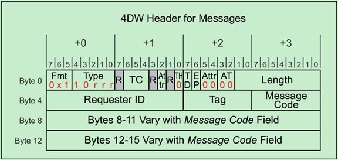

其中Type决定了模糊路由的类型，具体如下图所示：

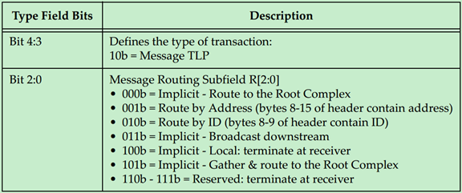

## TLP Header详解（一）

事务层包（TLP）的一般格式如下图所示：

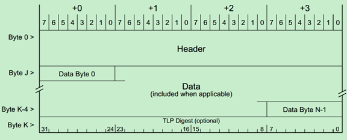

前面的文章介绍过，TLP Header为3DW或者4DW，Data Payload为1-1024DW，最后的TLP Digest（ECRC）是可选的，为1DW。

TLP Header在整个TLP的位置如下图所示，需要注意的是，TLP Header的格式和内容都会随着TLP的类型和路由方式的改变而改变。

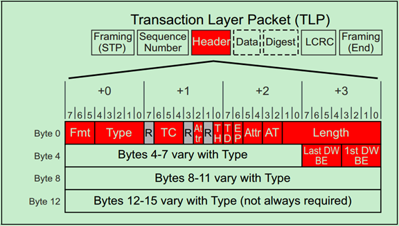

TLP的类型和路由方式由Fmt和Type所决定，这在前面关于TLP路由的文章中已经详细的介绍过。上图显示的是各种不同格式的TLP Header的相同的部分。

每一个Field的作用与意义如下表所示：

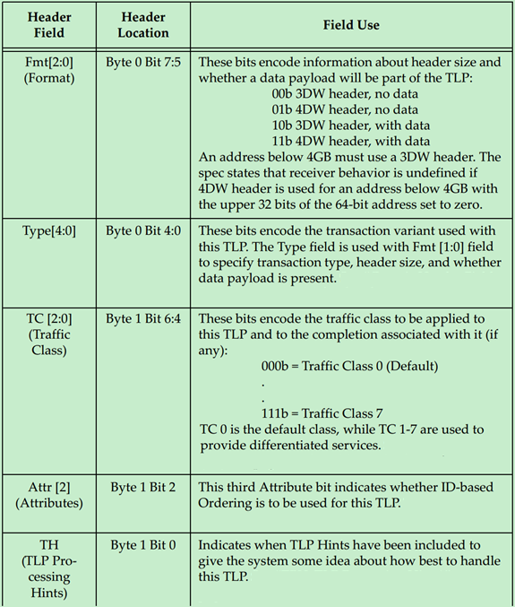

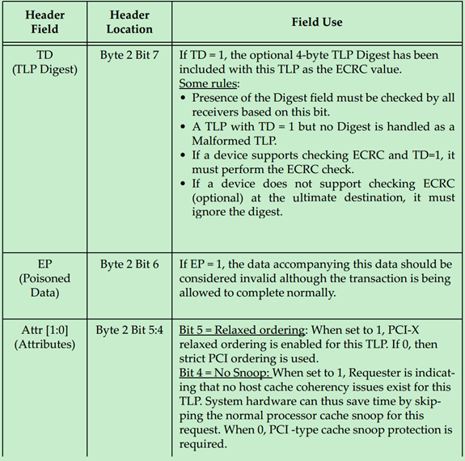

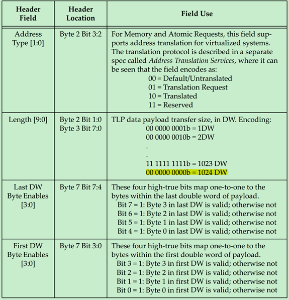

下面分别详细地介绍一下Byte Enable，在PCIe中Data Payload的单位是DW，也就是说数据大小（地址）需要以DW作为对齐。但是很多情况下，数据的大小并不是DW的整数倍，因此PCIe引入了Byte Enable来解决这一问题。使用Byte Enable需要遵循一下原则：

·    Byte Enable为高电平有效，低电平（0）表示Data Payload的对应Byte将被认为是无效的，即不被Completer使用。

·    如果有效数据小于1DW，则Last DW Byte Enable应全部为0。

·    如果Data Payload大于1DW，则First DW Byte Enable至少有一位是有效的。

·    如果Data Payload大于或等于3DW，则First DW Byte Enable和Last DW Byte Enable当中的有效位必须是连续的。即这种情况下，Byte Enable只能用于调整起始地址和结束地址。

·    如果Data Payload等于1DW，则First DW Byte Enable中的有效位可以是不连续的。

·    如果Data Payload等于2DW，则First DW Byte Enable和Last DW Byte Enable中的有效位都可以是不连续的。

·    写请求中的DW等于1，但是First DW Byte Enable中没有任何一位是有效的，也是允许的，但是这样的请求对于Completer没有任何作用。

·    如果读请求DW等于1，但是First DW Byte Enable中没有任何一位是有效的，此时Completer会返回1DW的Data Payload，只是其中的数据都是无效的。这一方式常备用于Flush Mechanism。

一个简单的Byte Enable使用的例子，如下图所示：

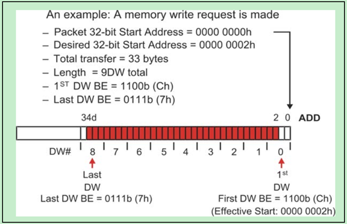

关于TLP的Data Payload有：

·    Data Payload的大小由TLP Header中的Length决定。

·    Data Payload的数据采用的是Little Endian，即低字节存放于低地址中。

·    Data Payload的大小并不是有效的数据的大小，有效数据的大小是由Data Payload和Byte Enable共同决定的。

·    当TLP类型为Message时，Length一般是保留的（Reserved），除非该Message是带有数据的（MsgD）。

·    TLP的Data Payload大小不得超过Max_Payload_Size的值，该值位于Device Control Register中。对于比较大的数据量，因此只能分多次进行发送。对于读请求来说，并没有Data Payload，也就是说该规则并不适用于读请求。

·    需要特别注意的是，起始地址和结束地址之间不能够跨越4KB的地址边界。

## TLP Header详解（二）

下面用几个具体的例子来讲解TLP Header的格式与作用。因为内容较多，所以分为多篇文章分别进行介绍。第一篇（即本文）介绍IO Request、Memory Request和Configuration Request。第二篇文章（即TLP Header详解三）介绍Completion ，第三篇文章（即TLP Header详解四）介绍Message Request。

**IO Request**

IO Request的TLP Header的格式如下图所示：

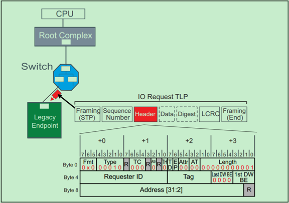

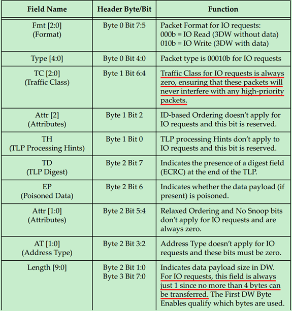

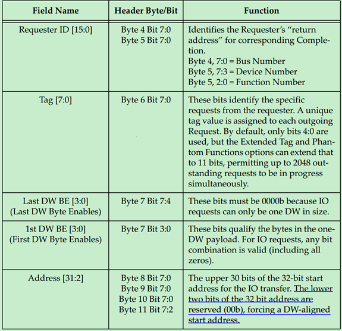

**Memory Request**

Memory Request的TLP Header的格式如下图所示：

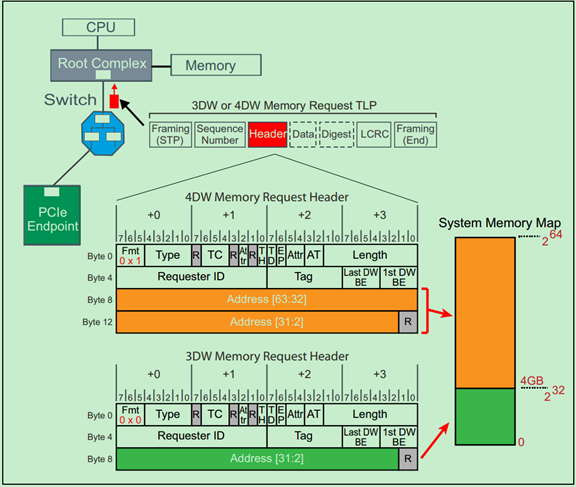

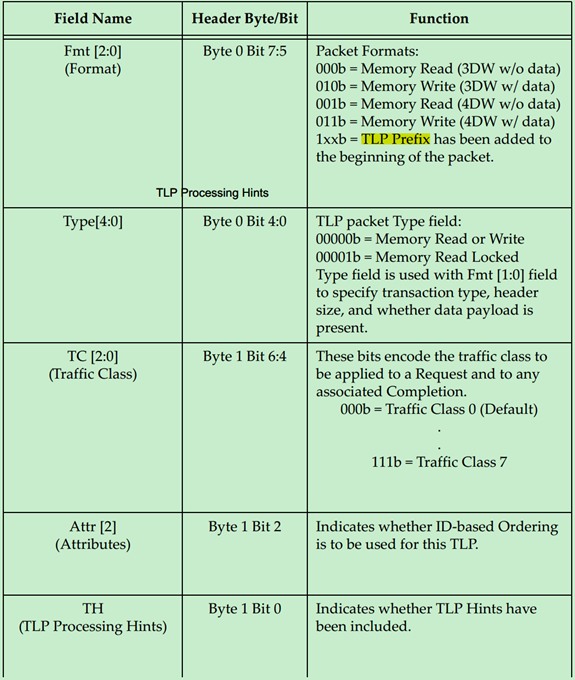

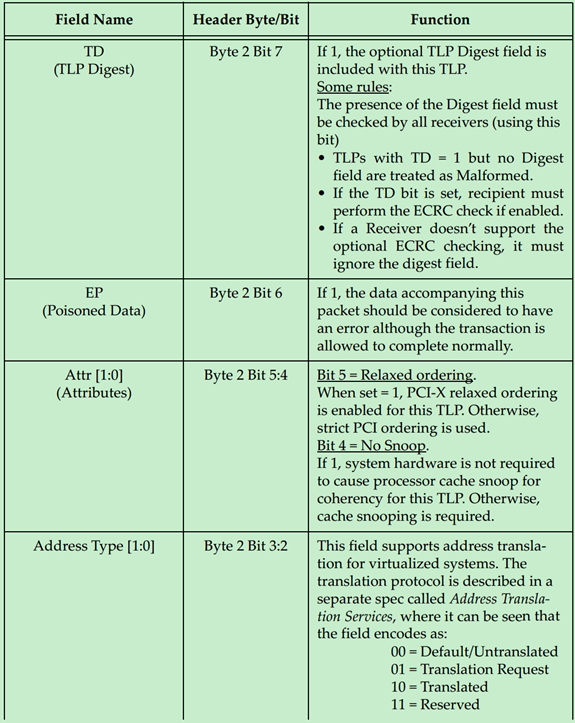

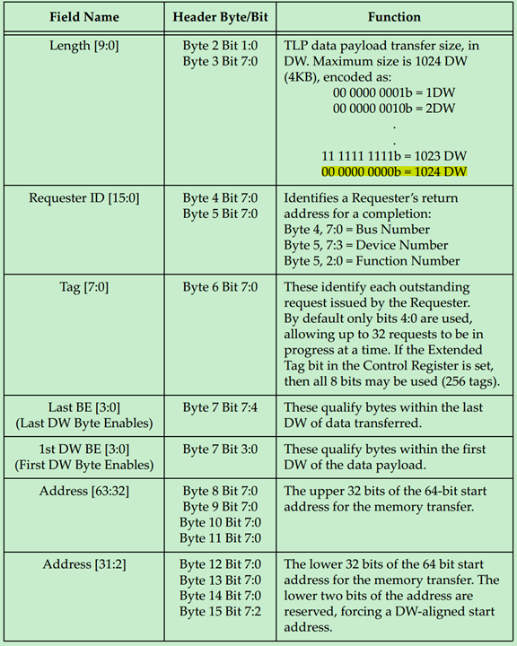

**注：**TLP Prefix、ID Based Ordering（IDO）和TLP Processing Hints（TH）均为PCIe Spec V2.1提出的。

**Configuration Request**

Configuration Request的TLP Header的格式如下图所示：

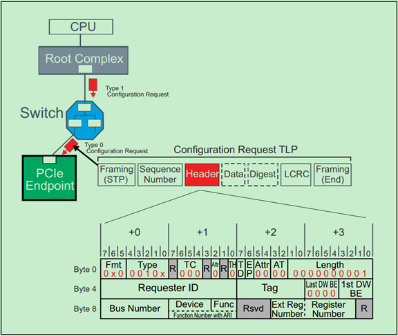

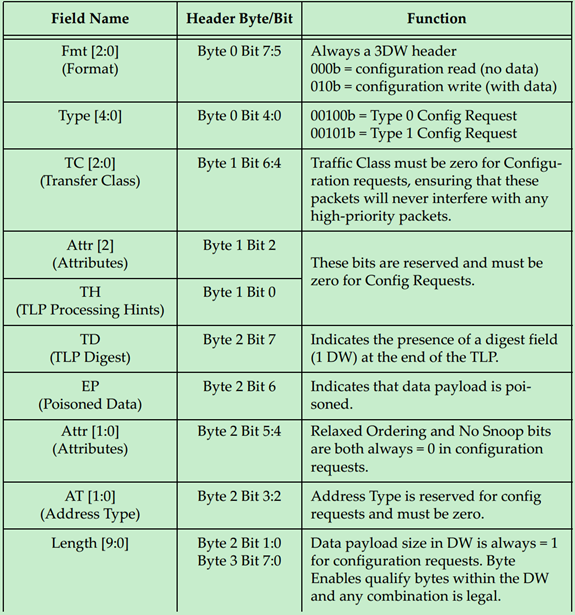

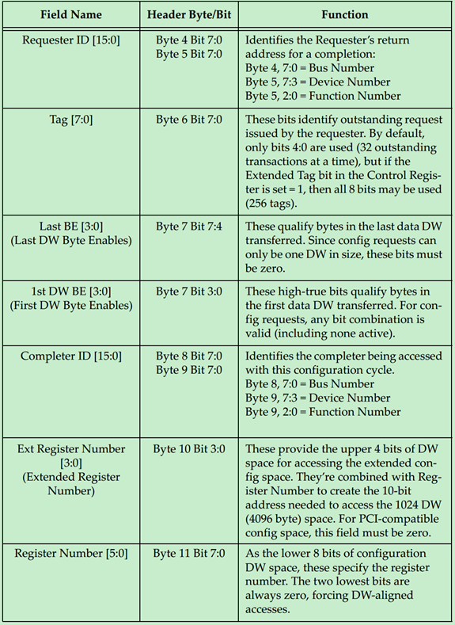

**补充说明：关于Byte Enable的规则和一个简单的例子如下：**

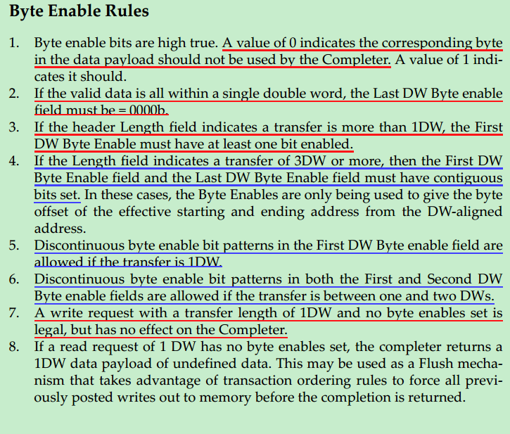**
**

**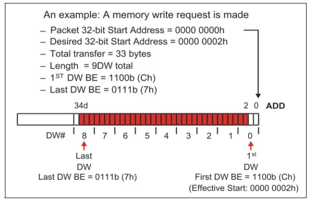**

## TLP Header详解（三）

**Completions**

Completions的TLP Header的格式如下图所示：

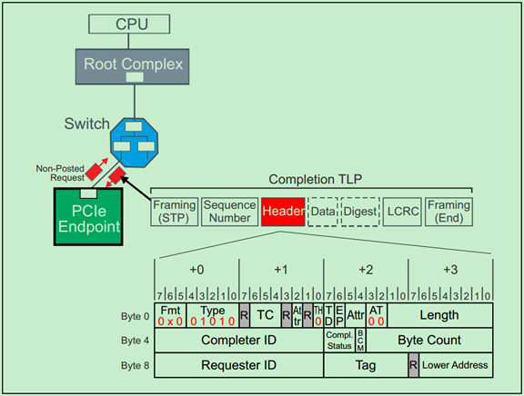

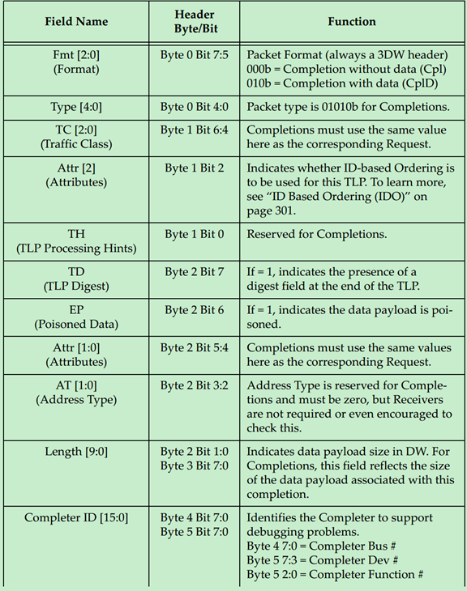

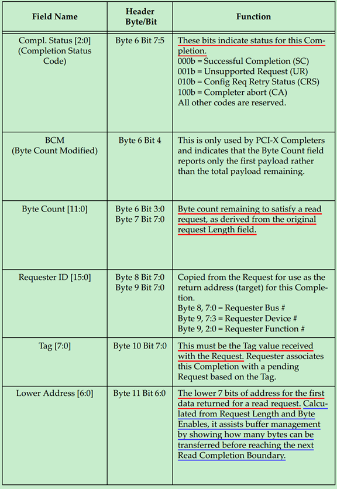

这里来解释一下Completion Status Codes

·    000b (SC) Successful Completion：表示请求（Request）被正确的处理；

·    001b (UR) Unsupported Request：表示请求是非法的或者不能被Completer所识别的。在PCIe V1.1以及之后的版本将这作为Advisory Non-Fatal Error；

·    010b (CRS) Configuration Request Retry Status：Completer暂时不能响应的配置请求，需要Requester稍后再次尝试；

·    100b (CA) Completer Abort：Completer可以响应该请求，但是却发生了其他的错误，该错误是Uncorrectable Error。

关于CplD，需要注意的是：

·    前面的文章中多次提到，一个读请求可能会对应多个CplD（因为4KB的地址边界问题，以及RCB的限制），但是返回的总的数据量应当与请求的数据量保持一致，否则可能会出现Completion Timeout的错误；

·    一个Completion只能对应于一个Request；

·    IO和Configuration读请求由于一直都是1DW，因此其一直都只对应一个Completion；

·    当Completion中的状态码（Status Codes）为SC（Successful）之外的状态，则一次传输（事务，Transaction）被终止；

·    在处理一个请求多个CplD时，应当注意Read Completion Boundary（RCB），RCB的值可以是64Bytes或者128Bytes；

·    Bridge和Endpoint应设计为RCB的大小是可以通过软件修改或控制的；

·    在处理一个请求多个CplD时，应注意先发送的时低地址的数据，后发送高地址数据。

Requester接受到Completion的处理规则：

·    如果Requester接收到的Completion与自己之前发送的Request不一致，则会报错；

·    当Completion中的状态码不是SC或者CRS的话，则会报错，并且相关的Buff都会被清空；

·    当任何非配置请求的Completion中的状态码为CRS时，都会被认为是非法的，并被认为是Malformed TLP；

## TLP Header详解（四）

PCIe中的Message主要是为了替代PCI中采用边带信号，这些边带信号的主要功能是中断，错误报告和电源管理等。所有的Message请求采用的都是4DW的TLP Header，但是并不是所有的空间都被利用上了，例如有的Message就没有使用Byte8到Byte15的空间。

Message请求的TLP Header格式如下图所示：

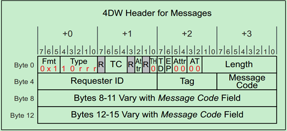

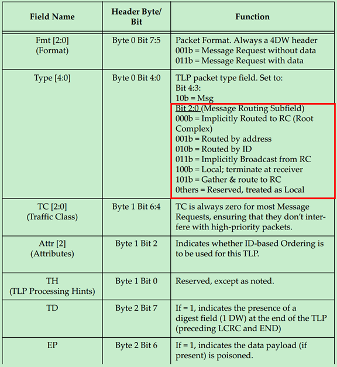

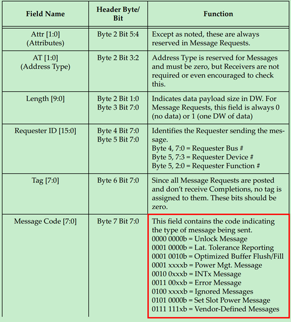

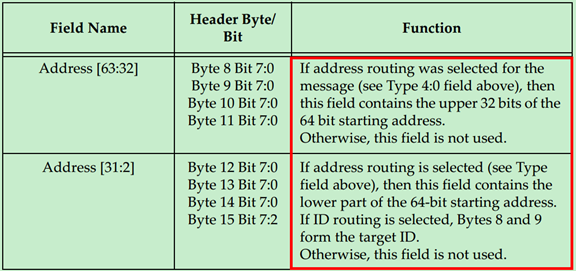

上面的表格中提到了，Message主要有九个类型：

\1.  INTx Interrupt Signaling

\2.  Power Management

\3.  Error Signaling

\4.  Locked Transaction Support

\5.  Slot Power Limit Support

\6.  Vendor‐Defined Messages

\7.  Ignored Messages (related to Hot‐Plug support in spec revision 1.1)

\8.  Latency Tolerance Reporting (LTR)

\9.  Optimized Buffer Flush and Fill (OBFF)

下面将分别进行介绍一下，

**INTx Interrupt Messages****（中断消息）**

PCI 2.3提出了MSI（Message Signaled Interrupt），但是早期的PCI并不支持这一功能，PCIe为此定义了一种Virtual Wire来模拟PCI的中断引脚（INTA-INTD）。如下图所示：

INTx Message的使用规则如下：

·    They have no data payload and so the Length field is reserved.

·    They’re only issued by Upstream Ports. Checking this rule for received packets is optional but, if checked, violations will be handled as Malformed TLPs.

·    They are required to use the default traffic class TC0. Receivers must check for this and violations will be handled as Malformed TLPs.

·    Components at both ends of the Link must track the current state of the four virtual interrupts. If the logical state of one interrupt changes at the Upstream Port, it must send the appropriate INTx message.

·    INTx signaling is disabled when the Interrupt Disable bit of the Command Register is set = 1 (as would be the case for physical interrupt lines).

·    If any virtual INTx signals are active when the Interrupt Disable bit is set in the device, the Upstream Port must send corresponding Deassert_INTx messages.

·    Switches must track the state of the four INTx signals independently for each Downstream Port and combine the states for the Upstream Port.

·    The Root Complex must track the state of the four INTx lines independently and convert them into system interrupts in an implementation‐specific way.

·    They use the routing type “Local‐Terminate at Receiver” to allow a Switch to remap the designated interrupt pin when. Consequently, the Requester ID in an INTx message may be assigned by the last transmitter.

**Power Management Messages****（电源管理消息）**

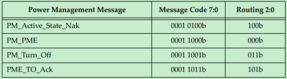

Power Management Messages使用规则如下：

·    Power Management Messages don’t have a data payload, so the Length field is reserved.

·    They are required to use the default traffic class TC0. Receivers must check for this and handle violations as Malformed TLPs.

·    PM_Active_State_Nak is sent from a Downstream Port after it observes a request from the Link neighbor to change the Link power state to L1 but it has chosen not to do so (Local ‐ Terminate at Receiver routing).

·    PM_PME is sent upstream by the component requesting a Power Management Event (Implicitly Routed to the Root Complex).

·    PM_Turn_Off is sent downstream to all endpoints (Implicitly Broadcast from the Root Complex routing).

·    PME_TO_Ack is sent upstream by endpoints. For switches with multiple Downstream Ports, this message won’t be forwarded upstream until all Downstream Ports have received it (Gather and Route to the Root Complex routing).

**Error Messages****（错误消息）**

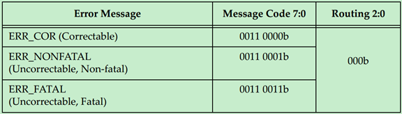

Error Message使用规则如下：

·    They are required to use the default traffic class TC0. Receivers must check for this and handle violations as Malformed TLPs.

·    They don’t have a data payload, so the Length field is reserved.

·    The Root Complex converts Error Messages into system‐specific events.

**Locked Transaction Support**

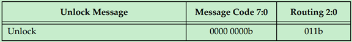

Unlock Message使用规则：

·    They are required to use the default traffic class TC0. Receivers must check for this and handle violations as Malformed TLPs.

·    They don’t have a data payload, and the Length field is reserved.

**Set Slot Power Limit Message**

 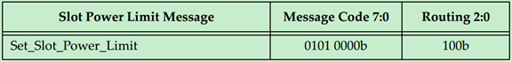

Set_Slot_Power_Limit Message使用规则：

·    They’re required to use the default traffic class TC0. Receivers must check for this and handle violations as Malformed TLPs.

·    The data payload is 1 DW and so the Length field is set to one. Only the lower 10 bits of the 32‐bit data payload are used for slot power scaling; the upper payload bits must be set to zero.

·    This message is sent automatically anytime the Data Link Layer transitions to DL_Up status or if a configuration write to the Slot Capabilities Register occurs while the Data Link Layer is already reporting DL_Up status.

·    If the card in the slot already consumes less power than the power limit specified, it’s allowed to ignore the Message.

**Vendor****‐Defined Message 0 and 1**

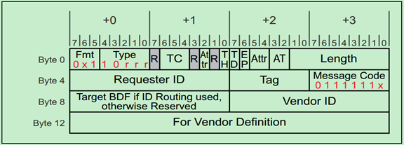 

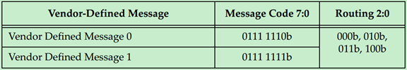v

厂商自定义Message使用规则：

·    A data payload may or may not be included with either type.

·    2. Messages are distinguished by the Vendor ID field.

·    3. Attribute bits [2] and [1:0] are not reserved.

·    4. If the Receiver doesn’t recognize the Message:

• Type 1 Messages are silently discarded

• Type 0 Messages are treated as an Unsupported Request error condition

**Ignored Messages**

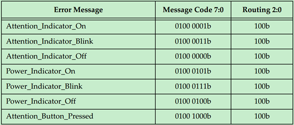

Hot Plug Message使用规则：

·    They are driven by a Downstream Port to the card in the slot.

·    The Attention Button Message is driven upstream by a slot device.

**Latency Tolerance Reporting Message**

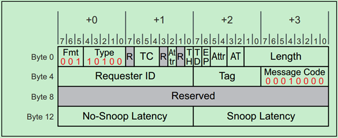

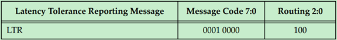

LTR Message使用规则：

·    They are required to use the default traffic class TC0. Receivers must check for this and handle violations as Malformed TLPs.

·    They do not have a data payload, and the Length field is reserved.

**Optimized Buffer Flush and Fill Messages**

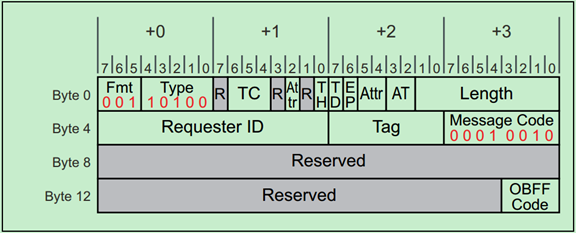

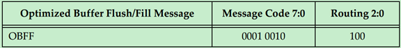

OBFF Message使用规则：

·    They are required to use the default traffic class TC0. Receivers must check for this and handle violations as Malformed TLPs.

·    They do not have a data payload, and the Length field is reserved.

·    The Requester ID must be set to the Transmitting Port’s ID.

## Flow Control基础（一）

Flow Control即流量控制，这一概念起源于网络通信中。PCIe总线采用Flow Control的目的是，保证发送端的PCIe设备永远不会发送接收端的PCIe设备不能接收的TLP（事务层包）。也就是说，发送端在发送前可以通过Flow Control机制知道接收端能否接收即将发送的TLP。

在PCI总线中，并没有Flow Control这样的机制，因此发送端并不知道当前时刻，接收端能否接收对应的TLP。因此，发送端只能先尝试发送，期间可能会被插入多个等待周期（接收设备尚未就绪等原因），甚至是重发（Retries）等。

PCIe Spec规定，PCIe设备的每一个端口（Ports）都必须支持Flow Control机制，在发送TLP之前，Flow Control必须先检查接收端口是否有足够的Buffer空间来接收这个TLP。当PCIe设备支持多个VC（Virtual Channel）时，Flow Control机制可以显著地提高总线的传输效率。

PCIe Spec规定，每个PCIe端口最多支持8个VC，并且每个VC的Flow Control Buffer是完全独立的。也就是说，某一个VC的Flow Control Buffer满了，并不会影响其他的VC的通信。

**注：**一般Endpoint只有一个端口，Root有一个或者多个端口，Switch有一个Upstream端口和多个Downstream端口。

前面的文章中介绍过，Flow Control机制是通过相邻两个端口（Ports）的数据链路层之间发送DLLP（Flow Control DLLPs）来实现的。也就是说Flow Control是一种点到点（Point to Point）的方式，而非端到端（End to End）。在进行初始化的时候，接收端需要向发送端报告（reports）其Buffer的大小，在正常运行状态（Run-time）时，会周期性地通过Flow Control DLLPs来告知发送端，接收端的各个Buffer的大小。

需要注意的是，虽然Flow Control DLLP只在相邻的数据链路层之间传输，但是相关的Buffer和计数器（FC Counter）确是在事务层（Transaction Layer）的，即事务层参与了Flow Control机制的管理。如下图所示：

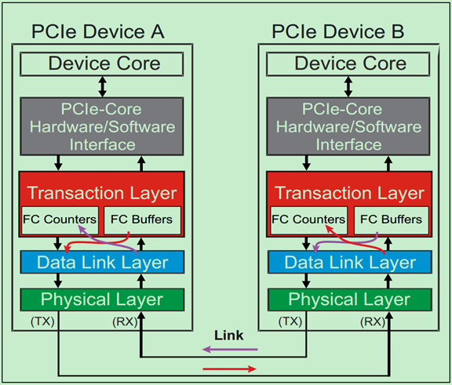

前面的文章中多次介绍过，TLP一共有三大类：**Posted Transactions**（包括Memory Writes和Messages）、**Non-Posted Transactions**（包括Memory Reads、Configuration Reads and Writes、IO Reads and Writes）以及**Completions**（包括Read and Write Completion）。并且知道，TLP可以分为两个部分，Header和Data部分。Flow Control为了获得更高的数据传输效率，将这三类TLP分开存放，同时将Header与Data部分也分开存放。因此，一共存在六种不同的Flow Control Buffer类型，如下图所示：

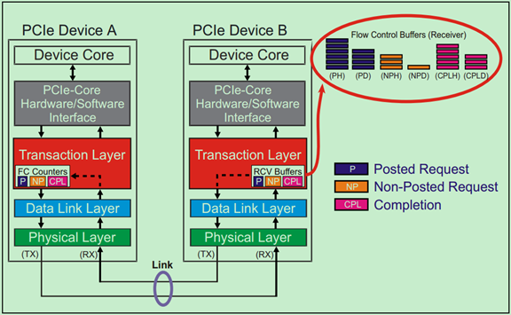

Flow Control Buffer的存储单元（Unit）被称作Flow Control Credits。对于Header来说，Requests TLP每个unit等于5DW，而Completions TLP每个unit等于4DW。对于Data来说，每个unit等于4DW，即Data Buffer是按照16个字节对齐的。对于各种类型的Buffer的最小值如下表所示：

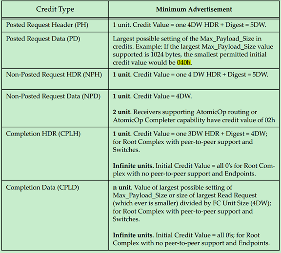

最大值如下表所示：

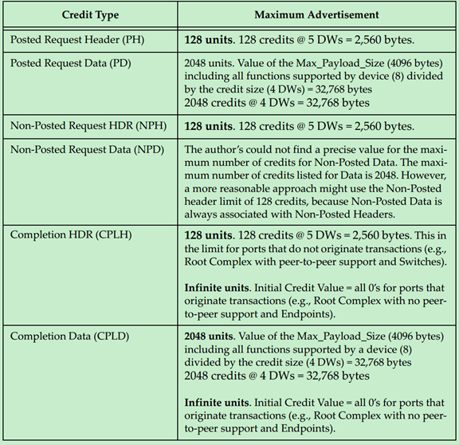

**注：**0 unit表示无限（Infinite）。

## Flow Control基础（二）

在任何事务层包（TLP）发送之前，PCIe总线必须要先完成Flow Control初始化。当物理层完成链路初始化后，便会将LinkUp信号变为有效，告知数据链路层可以开始Flow Control初始化了。如下图所示：

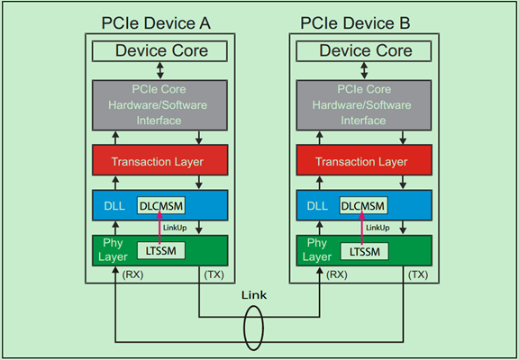

**注：**由于VC0是默认使能的，所以当Flow Control初始化开始时，其会被自动的初始化。其他的Virtual Channel是可选的，只有当被配置为使能的时候才会被初始化。

Flow Control初始化被分为两个步骤，FC_Init1和FC_Init2，其在整个数据链路控制和管理状态机（Data Link Control & Management State Machine）的位置如下图所示：

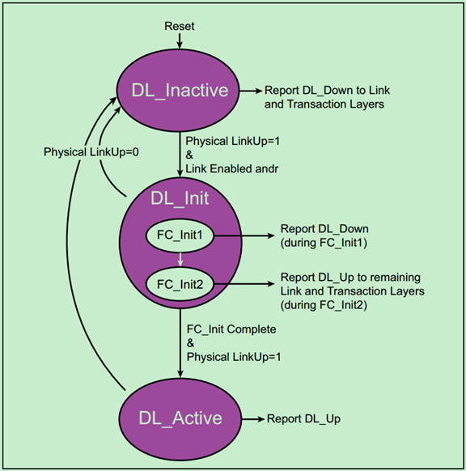

在FC_Init1步骤中，PCIe设备会连续地发送三个InitFC1类型的Flow Control DLLP来报告其接收Buffer 的大小。三个DLLP的顺序是固定的：Posted、Non-Posted然后是Completions。如下图所示：

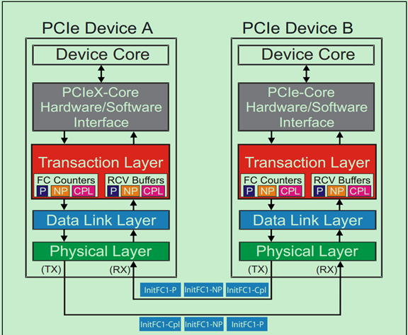

FC_Init2与FC-Init1类似，同样是连续的发送三个InitFC2类型的DLLP，当完成后，DLCMSM（上一篇文章中提到的状态机）会切换到DL_Active状态，表明数据链路层初始化完成。

**注：**可能有人会有疑惑了，FC_Init1和FC_Init2干的活不是差不多嘛，为什么还需要FC_Init2呢？原因是，不同的设备完成FC_Init1的时间可能是不同的，增加FC_Init2是为了保证每个设备都能收到FC初始化DLLP。

FC_Init DLLP的格式如下图所示：

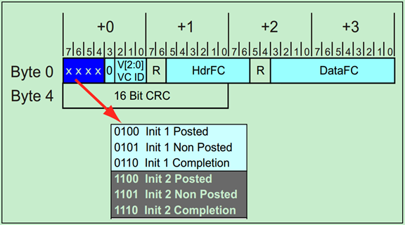

在完成FC初始化之后，相邻的两个设备之间会周期性的通过Updated FC DLLP更新接收Buffer的大小。如下图所示：

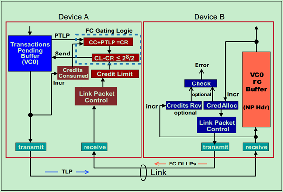

Update FC DLLP的格式与FC_Init的格式是类似的，具体如下：

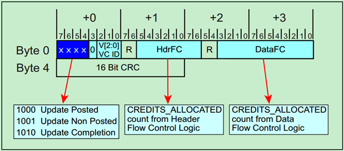

前面说到。Update FC DLLP是周期性发送的，周期的值可以通过以下公式计算得：

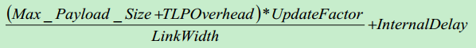

具体可以参考PCIe的Spec，这里不再详细介绍，下面给出Gen1和Gen2的周期表格（根据公式计算的结果）。其中UF为UpdateFactor。

Gen1 （2.5GT/s）如下表所示：

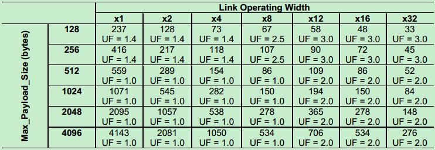

Gen2（5GT/s）如下表所示：

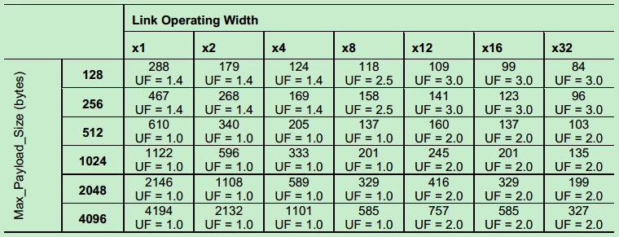

Gen3 (8GT/s）如下表所示：

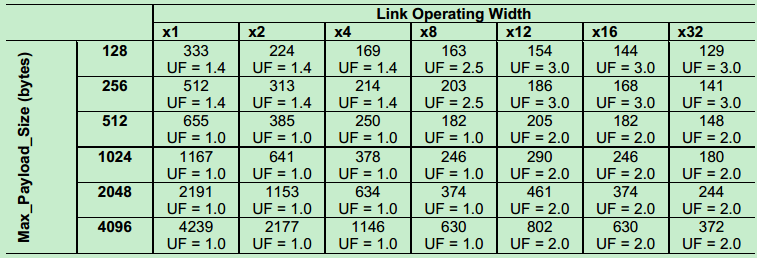

**注：**虽然UpdateFactor是指的Flow Control中的系数，而AckFactor指的是Ack/Nak中的系数，但实际上他们的值是一样的。 

## Quality of Service (QoS) 简介

前面的文章中介绍过，为了保证视频、音频等数据得到优先传输，PCIe总线实现了一种叫做Quality of Service（QoS）的机制。QoS可以满足视频、音频等对Latency和实时性（Isochronous）要求比较高（一般不可以被打断）的应用需求。QoS主要通过VC（Virtual Channel）和TC（Traffic Class）来实现。

VC的相关寄存器位于PCIe配置空间的扩展部分（PCIe Extended Capability Space），如下图所示：

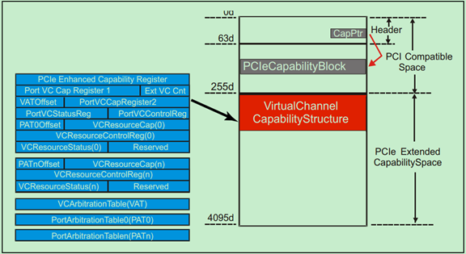

前面的文章中介绍过，每一个VC都有独立的Buffer，某一个VC Buffer满了并不会影响其他VC的使用。但是只靠VC并不能实现QoS中的优先级的功能，这还需要TC（Traffic Class）的支持。TC的值由TLP Header中的Byte1的bit[6:4]定义，如下图所示。显然TC值的范围为0~7，值越大优先级越高，默认为0（优先级最低）。在初始化的时候，PCIe驱动程序会为每一种类型的包分配好合适的TC值（优先级）。

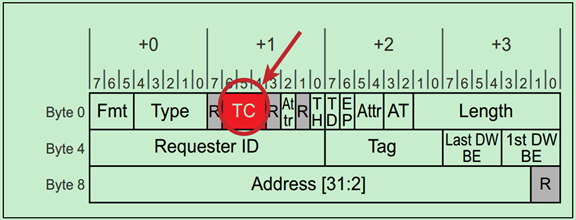

如果PCIe驱动程序没有找到PCIe Extended Capability Space，则认为该设备只有一个VC，即VC0。此时再为每一个TLP分配不同的TC值，显然是没有意义的。因此会默认采用TC0/VC0组合，即不支持QoS功能。换一句话说，如果某一个PCIe设备只支持一个VC（VC0），那么就没有QoS什么事了。

**注：**本次连载的博客只是简单地介绍QoS的功能和应用，关于QoS的详细内容，如VC仲裁，端口仲裁，实时性（Isochronous）等相关内容，还请参考PCIe Spec的相关章节。

PCIe驱动程序（配置软件）通过修改VC资源控制寄存器（VC Resource Control Register）中的TC/VC Map位来实现TC/VC Mapping。同时通过VC ID位来选择相应的VC。如下图所示：

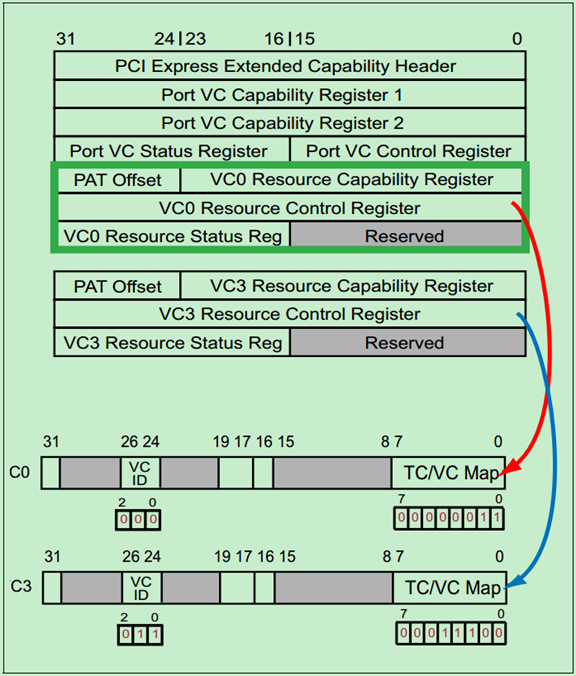

图中的例子，TC0、TC1对应VC0，而TC2~TC4对应的是VC3。

TC/VC Mapping采用了一种灵活的机制，但是仍然需要注意以下几点：

·    TC/VC Mapping是针对Link两端的端口（Ports）的；

·    TC0会被自动地Map到VC0，且只能Map到VC0；

·    其他的TC可以被Map到任意的VC上；

·    一个TC一般最多只能Map到一个VC上；

·    可以有TC或者VC不被使用。

如果Link的两个端口（Ports）中，VC数量不一致，则该Link只能服从VC数量少的端口，如下图所示：

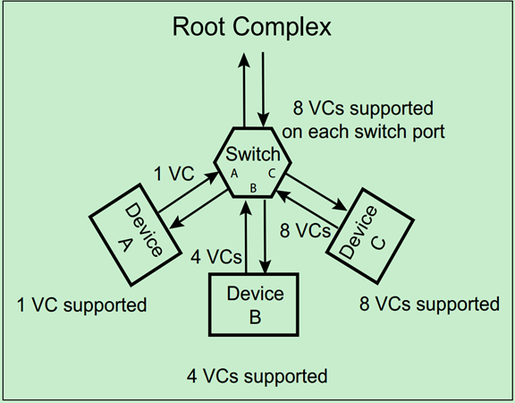

PCIe驱动程序可以通过查询扩展配置空间中的Extended VC Count来确定该端口支持的VC数量，如下图所示：

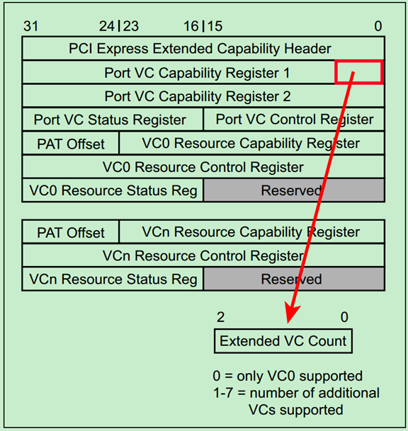

## DLLP（数据链路层包）详解

首先说明一下，在本次连载的博文中，DLLP一般指的是由发送端的数据链路层发送，接收端的数据链路层接收的数据包，其和事务层（Transaction Layer）一般没有什么关系。本文将要介绍的DLLP指的正是这样的数据包，其一般用于Ack/Nak机制、功耗管理、Flow Control（流量控制）和一些厂商自定义用途等。示意图如下：

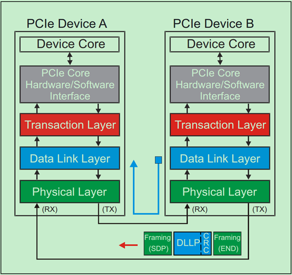

DLLP的格式是固定的，一共有8个字节，包括Framing（SDP & END）。和TLP不一样的地方是，DLLP并未携带任何路由信息，原因很简单，因为DLLP只在相邻的两个设备的数据链路层之间通信，根本不需要路由。并且DLLP一般也不需要和事务层交换信息。

**注：**前面文章中介绍的Flow Control、Ack/Nak等都是针对TLP，并不会对DLLP产生影响。但是这些功能正是借助DLLP才得以实现的。

DLLP的一般格式如下图所示：

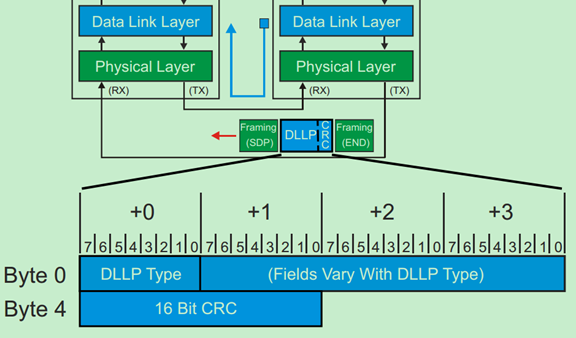

DLLP的类型与目标应用如下表所示：

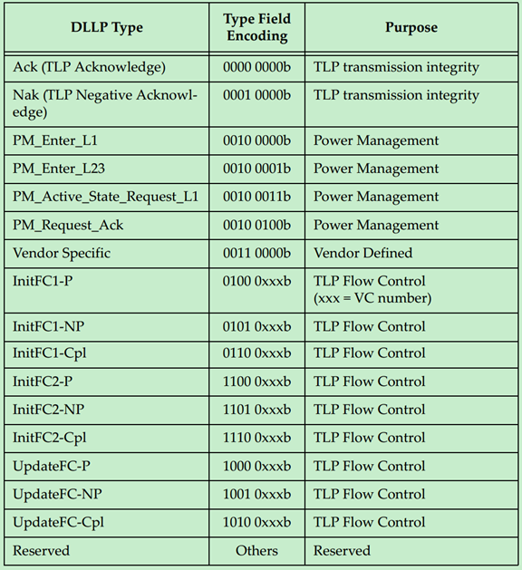

其中，用于Ack/Nak的DLLP的格式如下：

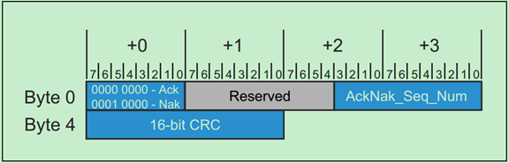

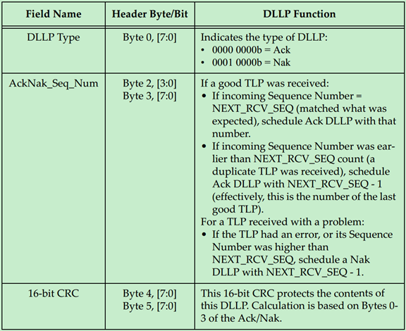

用于功耗管理（Power Management）的DLLP的格式如下：

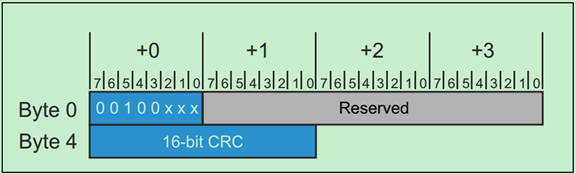

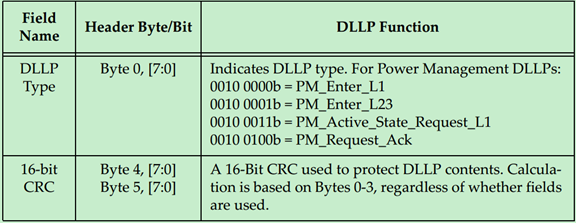

用于Flow Control的DLLP的格式如下：

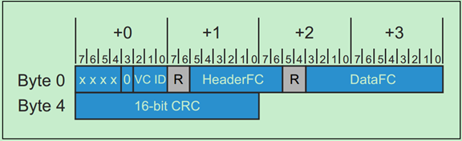

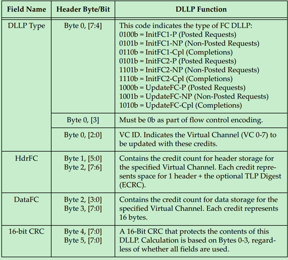

厂商自定义的DLLP的格式如下：

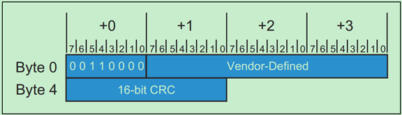

## Ack / Nak机制详解

前面在数据链路层入门的文章中简单地提到过Ack/Nak机制的原理和作用，接下来的两篇文章中将对Ack/Nak机制进行详细地介绍。

Ack/Nak是一种由硬件实现的，完全自动的机制，目的是保证TLP有效可靠地传输。Ack DLLP用于确认TLP被成功接收，Nak DLLP则用于表明TLP传输中遇到了错误。

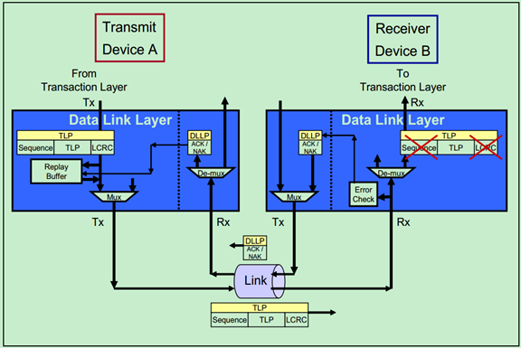

如上图所示，发送方会对每一个TLP在Replay Buffer中做备份，直到其接收到来自接收方的Ack DLLP，确认该DLP已经成功的被接受，才会删除这个备份。如果接收方发现TLP存在错误，则会向发送发发送Nak DLLP，然后发送方会从Replay Buffer中取出数据，重新发送该TLP。

Ack/Nak机制内部的详细结构图如下图所示：

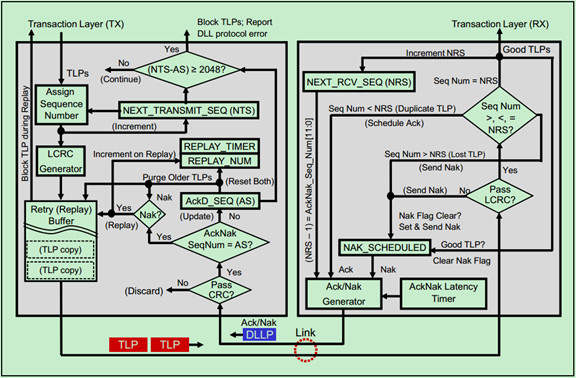

下面对图中的各个Elements分别做一个简单地介绍。

首先是发送端的Elements：

来个大图特写：

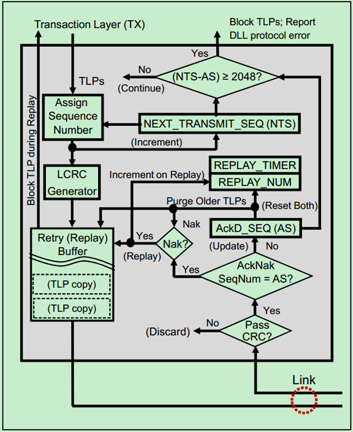

·    NEXT_TRANSMIT_SEQ Counter

NEXT_TRANSMIT_SEQ Counter，即NTS计数器，是一个12位的计数器。当数据链路层处于DL-Down状态或者复位时，该计数器会被初始化为0。该计数器只会执行加一操作，也就是说当其到达最大值4095时，在进行加一操作则会变成0（Roll Over）。**该计数器用于产生下一个待发送的TLP的序列号（Sequence Number）。**每一个序列号都是与一个TLP所唯一对应的，可以说这个序列号正是整个Ack/Nak机制的关键。

·    LCRC Generator

LCRC产生器用于产生一个32位的CRC值，其作用于整个TLP和其对应的序列号。

·    Replay Buffer

Replay Buffer是Mindshare书中的叫法，在PCIe Spec中，这个Buffer的名称叫做Retry Buffer。Replay Buffer中按照传输顺序，存储了整个TLP、序列号和LCRC，如下图所示：

当发送端收到来自接收端的Ack DLLP时，会将Buffer中相应的TLP（包括对应的序列号和LCRC）移除；如果接收到的是Nak DLLP，则会将Buffer中响应的TLP（包括对应的序列号和LCRC）重新发送给接收端。

·    REPLAY_TIMER Count

REPLAY_TIMER是一种看门狗定时器，当该定时器溢出，则表明发送端已经发送了一个或者多个TLP，但是并未收到来自接收端的应答信号（Ack/Nak）。此时，发送端会将Replay Buffer中的TLP重新发送，并将看门狗定时器重启。

只要发送端发送了任何TLP，该定时器便会启动，在接收到来自接收端的应答信号之前都会持续地运行。当收到应答信号之后，定时器会立即被清零。此时如果Replay Buffer仍然有TLP（表明还有TLP被发送，但是仍未得到应答），定时器又会被立即被重新启动。如果Buffer中是空的，则定时器不会被重新启动，直到新的TLP被发送。

·    REPLAY_NUM Count

这是一个2位的计数器，用于记录同一个TLP发送失败的次数，当其值从11b变为00b时（溢出了，表示尝试发送某个TLP失败了4次），数据链路层会自动地强制物理层重新进行链路训练（即LTSSM进入Recovery状态）。当完成链路训练之后，便会重新发送之前发送失败的TLP。

当发送端接收到来自接收端的Nak DLLP或者发送端的看门狗定时器（REPLAY_TIMER）溢出时，该计数器都会被加一；当接收到Ack DLLP时，该计数器则会被清零。

·    ACKD_SEQ Register

ACKD_SEQ寄存器用于存储最近接收到的Ack或者Nak DLLP中的序列号。当复位或者数据链路层处于无效状态时，该寄存器会被初始化为全1。关于ACKD_SEQ寄存器的具体用法会在后续的文章中，用例子的形式详细说明。

·    DLLP CRC Check

接收端在接收到来自发送端的DLLP后，首先会检查其DLLP CRC，如果发现有错误，则会直接将其丢弃，认为其实无效的DLLP。

然后是接收端的Elements：

首先来一张大图特写：

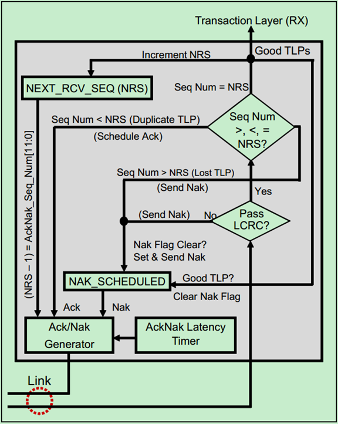

·    LCRC Error Check

顾名思义，LCRC Error Check用于检查接收到的TLP是否存在错误。如果存在错误，则将对应的TLP直接丢弃，然后产生一个Nak DLLP发送给发送端，让其重新发送该TLP。

·    NEXT_RCV_SEQ Counter

NEXT_RCV_SEQ是一个12位的计数器，即Next Receive Sequence Number，其值为已经成功接收的TLP的序列号加1。主要用于检查当前接收到的TLP是不是应该接收到的TLP。

如果NEXT_RCV_SEQ和当前接收到的TLP中的序列号的值相等，则认为这是一个有效的TLP，**但是接收端并不会立即向发送端发送Ack DLLP，而是等到AckNak_LATENCY_TIMER溢出时才向发送端发送Ack DLLP。**也就是说，一个Ack DLLP可能会对应多个TLP，接收端不会每成功接收到一个TLP便向发送端发送Ack DLLP。

如果当前接收到的TLP中的序列号小于NEXT_RCV_SEQ（且差值不超过2048），则认为该TLP之前已经成功发送过了，此次是重复发送。需要注意的是，PCIe Spec认为重复发送并不是一个错误，只是直接将该TLP丢弃，并没有Nak或者Error Reporting，**但是会返回一个包含有上一次成功接收的TLP的序列号（NRS-1）的Ack DLLP给发送端。**

如果当前接收到的TLP的序列号大于NEXT_RCV_SEQ，表明传输过程中漏掉了一些TLP。此时，接收端会返回Nak DLLP，并直接丢弃该TLP。

一个简单的例子如下图所示：

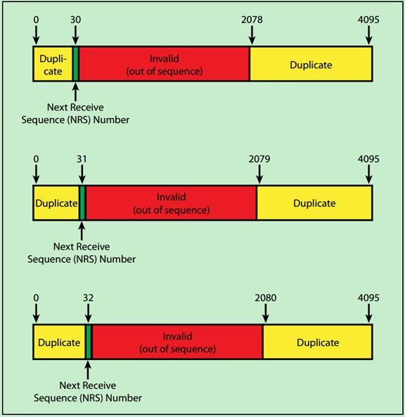

·    NAK_SCHEDULED Flag

NAK_SCHEDULED是一个标志位，当接收端产生Nak DLLP时，该标志位会被置位。当接收端成功接收到有效的TLP时，该标志位会被清零。需要特别注意的是，当该标志位处于置位状态时，接收端不应产生其他的Nak DLLP。

·    AckNak_LATENCY_TIMER

AckNak_LATENCY_TIMER定时器会在接收端成功接收到有效的TLP，且并未向发送端返回Ack DLLP之前运行。当AckNak_LATENCY_TIMER定时器溢出时，接收端会立即向发送端返回Ack DLLP（携带的序列号为NRS-1，即一个Ack对应多个有效的TLP）。无论接收端返回Ack还是Nak，该定时器都会被复位，但是只有当接收端再次收到有效的TLP时，该定时器才会被重新启动。

该定时器（REPLAY_TIMER）的值是由PCIe Spec规定的和Lane的数量与Max_Payload有关，Gen1的值如下图所示：

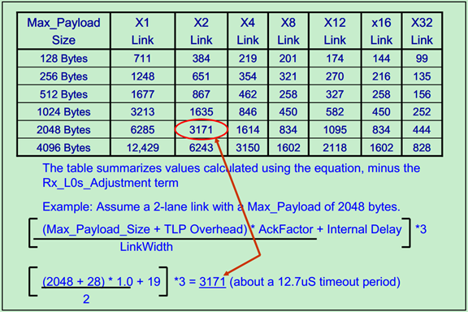

Gen2（5GT/s）如下图所示：

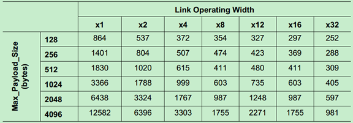

**注：**该定时器（REPLAY_TIMER）的值是AckNak_LATENCY_TIMER定时器值的三倍。而REPLAY_TIMER的值则如下表所示（Gen1和Gen2）：

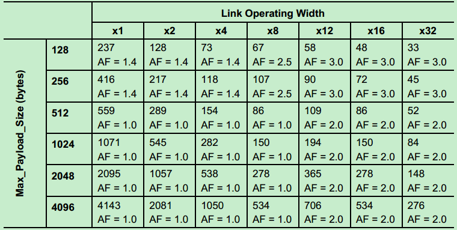

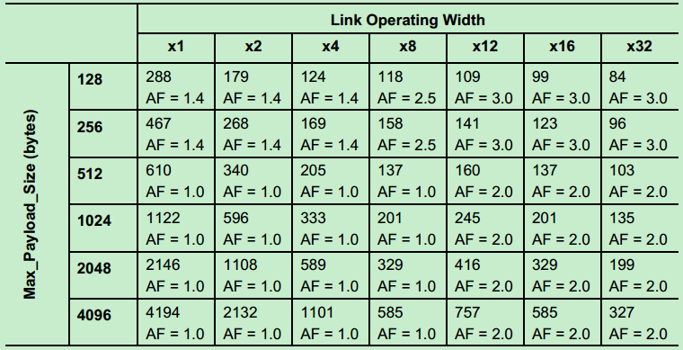

·    Ack/Nak Generator

显然，Ack/Nak Generator的功能是产生Ack或者Nak DLLP。其格式如下：

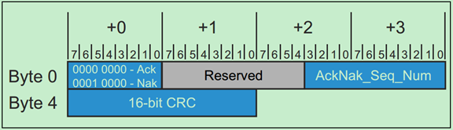

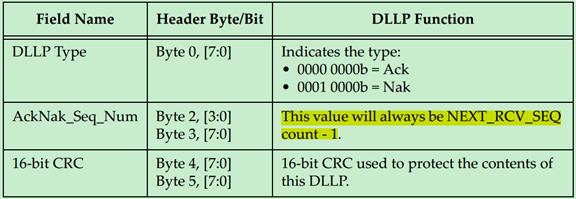

最后，介绍一下PCIe Spec中推荐的包优先级顺序。我们知道，PCIe总线通信中，存在多种类型的包，包括TLP、DLLP和Ordered Sets等。为了能够是总线达到最优的传输效率，PCIe Spec推荐对这些包的优先级做如下的设置：（当然这只是推荐，并没有强制厂商一定要这要去实现）

\1. Completion of any TLP or DLLP currently in progress (highest priority)
\2. Ordered Set
\3. Nak
\4. Ack
\5. Flow Control
\6. Replay Buffer re‐transmissions
\7. TLPs that are waiting in the Transaction Layer
\8. All other DLLP transmissions (lowest priority)
**注：**这里说的优先级和QoS中说的优先级是两码事，千万不要搞混了。

## Ack / Nak机制详解（二）

这一篇文章来简单地分析几个Ack/Nak机制的例子。

**Example 1. Example of Ack**

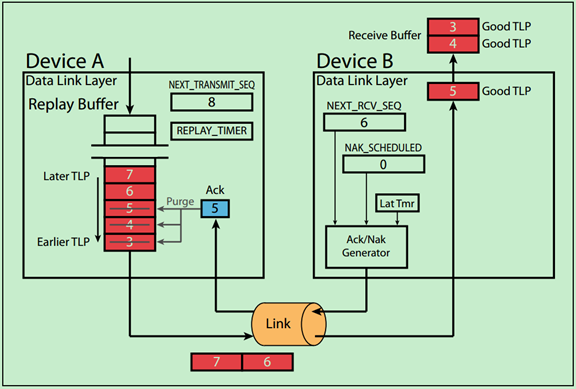

Step1  设备A准备依次向设备B发送5个TLP，其对应的序列号分别为3,4,5,6,7；

Step2  设备B成功的接收到了TLP3，并将NEXT_RCV_SEQ从3加到4，但是设备B没有立即向设备A返回Ack（此时AckNak_LATENCY_TIMER尚未溢出）；

Step3  设备B又成功地接收到了TLP4和TLP5；

Step4  假设此时AckNak_LATENCY_TIMER溢出了，则设备B会向设备A返回一个带有序列号为5的Ack DLLP。同时，设备B将AckNak_LATENCY_TIMER复位，但是并未重新启动，直到设备B成功地接收到了TLP6。

Step5  设备A接收到了Ack5，将REPLAY_TIMER和REPLAY_NUM复位，然后将Buffer中的序列号5（和5之前）的TLP备份移除；

Step6  一旦设备B接收到TLP6，AckNak_LATENCY_TIMER又会被重新启动。

**Example 2. Ack with Sequence Number Rollover**

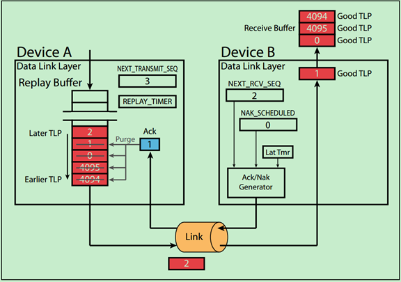

Step1  设备A准备依次向设备B发送序列号为4094,4095,0,1,2的TLP，注意第一个发送的是TLP4094，最后一个发送的是TLP2。也就是说序列号Rollover了；

Step2  设备B成功接收到TLP4094~TLP1后，假设此时AckNak_LATENCY_TIMER溢出了，则设备B向设备A返回Ack1 DLLP；

Step3  设备A接收到Ack1，并将Buffer中的序列号为1（和之前的，包括TLP4094~TLP1）的TLP备份移除。同时将REPLAY_TIMER和REPLAY_NUM复位。  

**Example 3. Example of Nak**

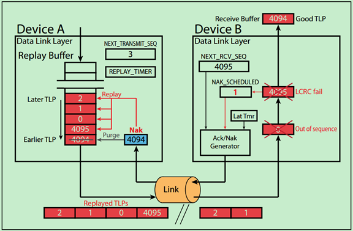

Step1  假设设备A准备依次向设备B发送序列号为4094,4095,0,1,2的TLP；

Step2  设备B成功地接受了TLP4094，并将NEXT_RCV_SEQ加1，变为4095；

Step3  设备B接收到了TLP4095，但是该TLP并未通过CRC校检（即存在错误）。此时无论AckNak_LATENCY_TIMER处于何种状态，设备B都会立即向设备A返回Nak4094**（注意返回的Nak DLLP中的序列号为上一次成功接收的TLP的序列号）**。同时设备B将AckNak_LATENCY_TIMER停止并复位；

Step4  设备B会一直等待设备A向其发送TLP4095，但是设备A却并不知发生了什么，在接收到设备B向其返回的Ack/Nak之前，会继续发送TLP0~TLP2，只是设备B会直接忽略这些TLP。

Step5  当设备A接收到来自设备B的Nak4094 DLLP时，会将Buffer中的TLP4094（和之前的TLP）移除，并从TLP4095从新开始发送。同时，将REPLAY_TIMER和REPLAY_NUM复位。

Step6  由于设备A接收到的是Nak，而不是Ack，因此设备A会重新启动REPLAY_TIMER并将REPLAY_NUM加一；

Step7  一旦设备B成功地接收到TLP4095，设备B便会清除NAK_SCHEDULED标志位，并将NEXT_RCV_SEQ计数器加一，同时重启AckNak_LATENCY_TIMER。

**Example 4. Example of Lost TLPs**

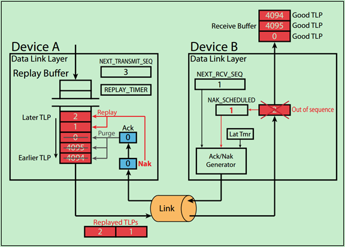

Step1  假设设备A准备依次向设备B发送TLP 4094,4095,0,1,2；

Step2  设备B成功地接收了TLP4094~TLP0，并向设备A返回Ack0，此时设备B的NEXT_RCV_SEQ为1；

Step3  设备A接收到设备B返回的Ack0，从Buffer中移除相应的TLP备份；

Step4  设备B接收到了TLP2（而不是TLP1），也就是说TLP1在传输过程中丢失了。此时，设备B会直接将TLP2丢弃，并将NAK_SCHEDULED标志位置位，同时向设备A返回Nak0 DLLP；

Step5  设备A接收到Nak0 DLLP后，会将Buffer中的TLP0（以及之前的，如果有的话）移除。同时，从TLP1开始，重新向设备B发送。

**Example 5. Example of Bad Nak**

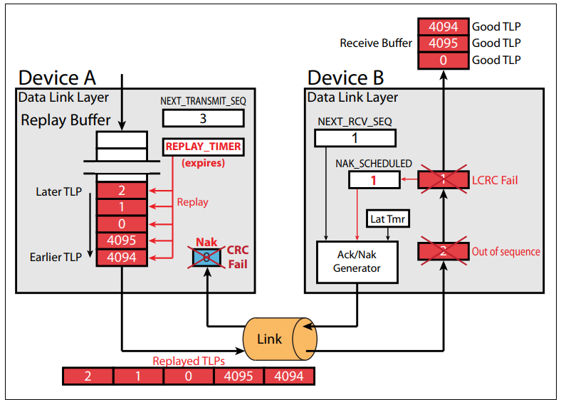

Step1  设备A准备依次向设备B发送TLP 4094,4095,0,1,2；

Step2  设备B成功的接收了TLP4094~TLP0，但是由于AckNak_LATENCY_TIMER尚未溢出，所以设备B没有立即向设备A返回Ack DLLP；

Step3  设备B发现TLP1中存在错误，于是向设备A返回Nak0 DLLP，并将NAK_SCHEDULED标志位置位；

Step4  设备A发现其接收到的Nak0 DLLP中也存在错误（CRC校检不通过），于是直接丢弃了Nak0；

Step5  然而设备B却一直在等待设备A向其发送TLP1，在其成功接收TLP1之前，设备B不会返回任何Ack或者Nak，不管设备A向其发送什么（除TLP1之外的）。设备B的NAK_SCHEDULED标志位也一直保持置位；

Step6  尴尬的是，设备A并不知道设备B想要其重发TLP1（由于没有成功接收到Nak0）。因此，设备A会继续向设备B发送之后的TLP，但是由于一直没有接收到设备B的Ack/Nak DLLP，设备A的REPLAY_TIMER会在一段时间后溢出；

Step7  当设备A的REPLAY_TIMER溢出后，设备A会向Buffer中的所有TLP都重新发送一遍，并重启REPLAY_TIMER，同时将REPLAY_NUM计数器加一；

Step8 设备B会再次接收到TLP4094~TLP0，但是这在之前就已经成功接受到过了。因此设备B会直接将其丢弃，且不会像设备A返回任何的Ack或者Nak

Step9 此时，设备B再次接收到了TLP1，并未发现错误（成功接收）。于是，设备B将NAK_SCHEDULED标志位清零，并重启AckNak_LATENCY_TIMER，将NEXT_RCV_SEQ加一。

## 物理层逻辑部分基础（一）

首先，回顾一下，之前看了很多遍的PCIe的Layer结构图：

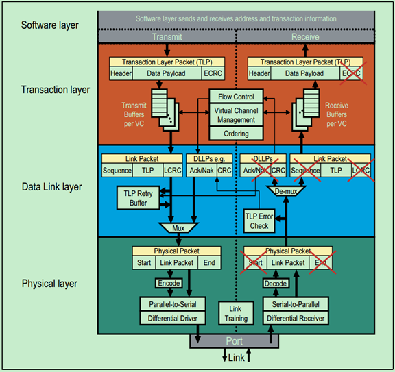

PCIe中的物理层主要完成编解码（8b/10b for Gen1&Gen2，128b/130b for Gen3 and later）、扰码与解扰码、串并转换、差分发送与接收、链路训练等功能。其中链路训练主要通过物理层包Ordered Sets来实现。

PCIe Spec将物理层分为两个部分——逻辑子层和电气子层，如下图所示：

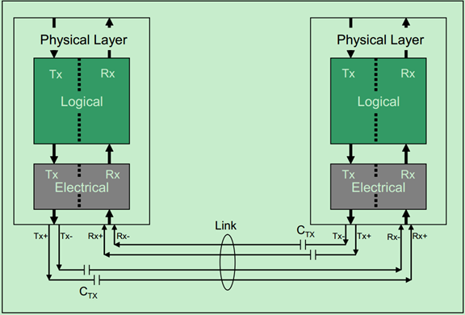

如上图所示，PCIe物理层实现了一对收发差分对，因此可以实现全双工的通信方式。需要注意的是，PCIe Spec只是规定了物理层需要实现的功能、性能与参数等，至于如何实现这些却并没有明确的说明。也就是说，厂商可以根据自己的需要和实际情况，来设计PCIe的物理层。下面将以Mindshare书中的例子来简要的介绍PCIe的物理层逻辑部分，可能会与其他的厂商的设备的物理层实现方式有所差异，但是设计的目标和最终的功能是基本一致的。

物理层逻辑子层的发送端部分的结构图如下图所示：

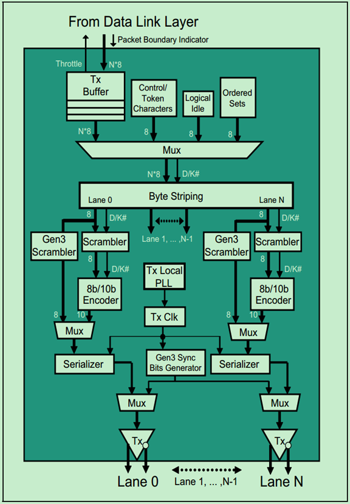

在进行8b/10b编码之前，Mux会对来自数据链路层的数据中插入一些内容，如用于标记包边界或者Ordered Sets的控制字符和数据字符。为了区分这些字符，Mux为其对应上一个D/K#位（Data or Kontrol）。

**注：**图中还包含了Gen3的一些实现，不过这里只介绍Gen1 & Gen2，并不会介绍Gen3。如果大家感兴趣的，可以去阅读Mindshare的书籍或者参考PCIe Gen3的Spec。

Byte Striping将来自Mux的并行数据按照一定的规则（后面会详细地说）分配到各个Lane上去。随后进行扰码（Scrambler）、8b/10b编码、串行化（Serializer），然后是差分发送对。

其中扰码器（Scrambler）是基于伪随机码（Pesudo-Random）的异或逻辑（XOR），由于是伪随机码，所以只要发送端和接收端采用相同的算法和种子，接收端便可以轻松地恢复出数据。但是，如果发送端和接收端由于某些原因导致其节拍不一致了，此时便会产生错误，因此Gen1和Gen2的扰码器（Scrambler）会周期性地被复位。

**注：**关于8b/10b的原理和作用，在我之前的博文中有所介绍。所以接下来的文章中不会重复介绍这些内容，但是会简要地介绍PCIe中的8b/10b的实现细节和要点。之前的文章地址为：http://blog.chinaaet.com/justlxy/p/5100052814

物理层逻辑子层的接收端部分的结构图如下图所示：

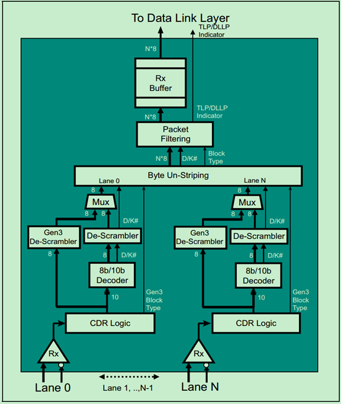

由于PCIe采用的是一种Embeded Clock（借助8b/10b）机制，因此接收端在接收到数据流时，首先要从中恢复出时钟信号，这正是通过CDR逻辑来实现的。如上图所示，接收端的逻辑基本上都是与发送端相对应的相反的操作。这里就不在详细地介绍了。

## 物理层逻辑部分基础（二）

上一篇文章中提到了Mux会对来自数据链路层的数据（TLP&DLLP）插入一些控制字符，如下图所示。当然，这些控制字符只用于物理层之间的传输，接收端的设备的物理层接收到这些数据后，会将这些控制字符去除，在往上传到其数据链路层。

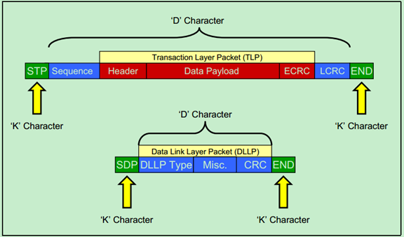

当然，除了STP、SDP和END之外，还有一些其他的控制字符，如EDB（前面的文章详细介绍过）、SKIP、COM等。如下图所示：

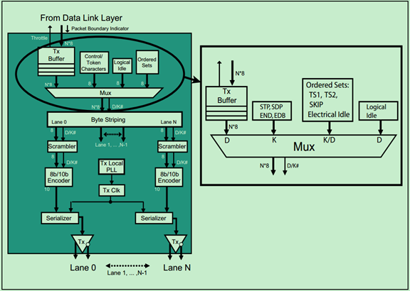

前面的文章中提到过Ordered Sets，其主要用于链路训练等。每一个Ordered Set都是按照DW对齐的（即四个字节），且Ordered Set开头也是一个叫做Comma（COM）的K字符（控制字符），随后包含一些K字符或者D字符（数据字符）。

对于只有一个Lane的PCIe设备来说，Byte Striping并没有什么卵用，其主要用于多个Lane的数据流分配。x1（一个Lane）和x8（8个Lane）的例子分别如下两张图所示：

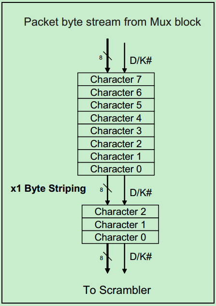

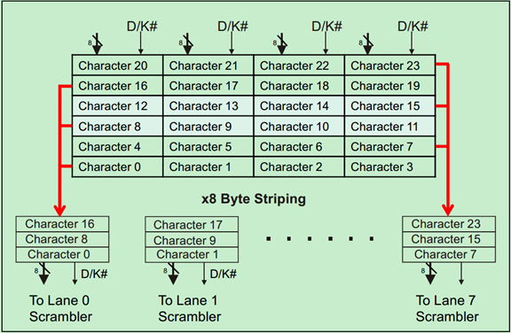

除此之外，还有一些其他的规则，主要是针对Mult-Lane的，对于一个Lane并没有什么影响：

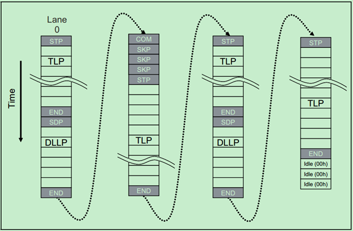

x4（4个Lane）需要遵循以下的规则：

·    STP and SDP characters are always sent on Lane 0.

·    END and EDB characters are always sent on Lane 3.

·    When an ordered set such as the SKIP is sent, it must appear on all lanes simultaneously.

·    When Logical Idles are transmitted, they must be sent on all lanes simultaneously.

·    Any violation of these rules may be reported as a Receiver Error to the Data Link Layer.

如下图所示：

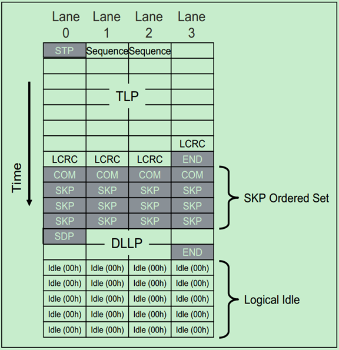

对于x8、x16、x32需要遵循以下的规则：

·    STP/SDP characters are always sent on Lane 0 when transmission starts after a period during which Logical Idles are transmitted. After that, they may only be sent on Lane numbers divisible by 4 when sending back‐to‐back packets (Lane 4, 8, 12, etc.).

·    END/EDB characters are sent on Lane numbers divisible by 4 and then minus one (Lane 3, 7, 11, etc.).

·    If a packet doesn’t end on the last Lane of the Link and there are no more packets ready to go, PAD Symbols are used as filler on the remaining lane numbers. Logical Idle can’t be used for this purpose because it must appear on all Lanes at the same time.

·    Ordered sets must be sent on all lanes simultaneously.

·    Similarly, logical idles must be sent on all lanes when they are used.

·    Any violation of these rules may be reported as a Receiver Error to the Data Link Layer.

x8的例子如下图所示：

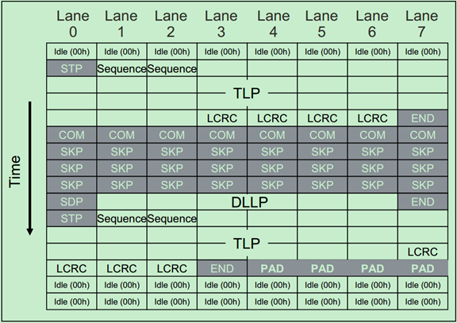

发送端的扰码器（Scrambler）有一个16-bit的线性反馈寄存器（LFSR，Linear Feedback Shift Register），其实现了以下这个多项式：

具体的功能框图如下图所示：

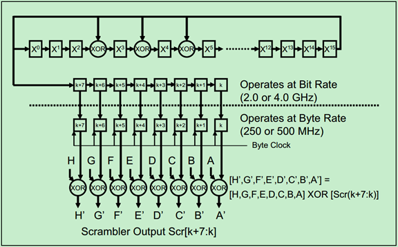

关于扰码器（Scrambler）还需要遵循以下这些规则：

·    不同的Lane的扰码器必须是同步操作的；

·    扰码器只对TLP和DLLP中的D字符（数据字符）以及逻辑空闲字符（00H，Logical Idle）作用，并不作用于K字符（控制字符）和Ordered Set中的D字符（如TS1、TS2等）；

·    兼容性测试字符（Compliance Pattern Characters）并不被扰码；

·    COM字符（一种控制字符，不会被扰码）可用于使发送端和接收端的扰码器中的LFSR同时被初始化为FFFFH；

·    扰码器默认时被使能的，但是PCIe Spec允许将其临时禁止，以用于测试用途。

PCIe中用到的K字符（控制字符）如下表所示：

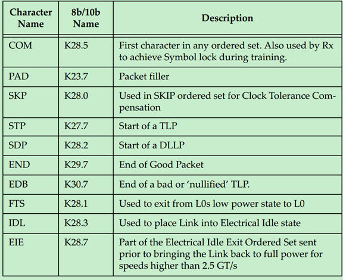

其对应的8b/10b编码如下表所示：

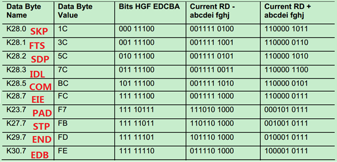

**注：**其中PAD字符主要用于Mult-Lane中，当一个包的长度比较短，有的Lane可能就没有数据可以发了，这时候可以用PAD字符来填充。如本文的x8的例子所示。

Ordered Sets主要用于链路管理（Link Management）功能。对于Gen1和Gen2的PCIe来说，所有的Ordered Set都以COM作为开头。Ordered Sets是在每个Lane上同步发送的，即每一个Lane都会同时的发送相同的Ordered Sets，因此，Ordered Sets也可以被用于Lane De-skewing。除了链路训练之外，Ordered Sets还被用于时钟容差补偿（Clock Tolerance Compensation，CTC）以及更改链路功耗状态（Changing Link Power States）等。

**注：**关于CTC，可以参考PCIe Base Spec V2.0第4.2.7节相关内容。后续也会单独写一篇博文，来详细地介绍弹性缓存（Elastic Buffer）与CTC。

对应的，主要有以下几种Ordered Sets：TS1 and TS2 Ordered Set (TS1OS/TS2OS)、Electrical Idle Ordered Set (EIOS)、FTS Ordered Set (FTSOS)、SKP Ordered Set (SOS)和Electrical Idle Exit Ordered Set (EIEOS)。

**注：**关于链路管理以及Ordered Sets等详细内容，会在后续的博文中介绍。

## 物理层逻辑部分基础（三）

这一篇文章来继续聊一聊接收端物理层逻辑子层的实现细节。回顾一下之前的那张图片：

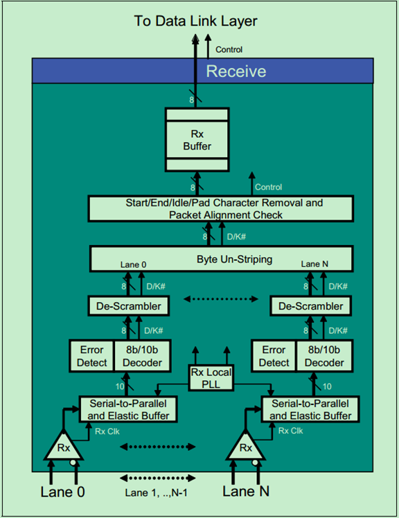

其中的一个Lane的具体逻辑如下图所示：

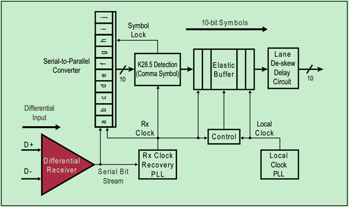

其中，Rx Clock Recovery从输入的串行数据流中提取出Rx Clock。当Rx Clock稳定在Tx Clock的频率上（Rx Clock locked on to the Tx Clock Freq）时，我们就称接收端取得了Bit Lock。

如果链路（Link）处于低功耗状态（比如L0s或者L1）时，接收端此时会失去同步（即Losing Bit Lock）。为了避免物理层认为这是一个错误（异常），发送端会发送一个电气空闲命令集（Electrical Idle Ordered Sets，EIOS）通知接收端，即将进入低功耗状态。此时，接收端会临时关闭（De-gate）其输入。

**注：**这里的关闭（De-gate）并非是直接关闭输入端口，只是暂时不对输入端口上的数据进行处理。

当发送端需要唤醒链路（Link）时，会首先发送一定数量的FTS Ordered Sets，并重新取得Bit Lock和Symbol Lock。

接收端的链路De-Skew逻辑如下图所示：

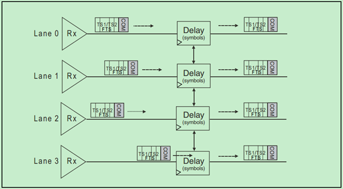

Gen1和Gen2的PCIe采用COM字符来进行De-Skew，如果COM没有同事出现在每个Lane上，那么先到达的COM会被延时一会，以实现Lane的同步。很显然，这种机制只能校正比较小的Skew，也就是说Lane-to-Lane的Skew有一个最大值，超出这个最大值，De-Skew也无能为力了。如下表所示：

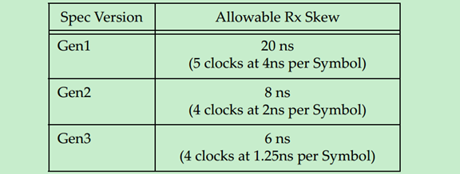

接收端的8b/10b解码器结构如下图所示：

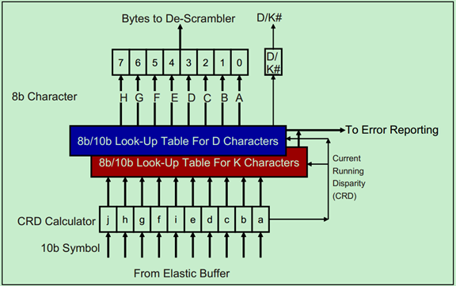

以下情况，被认为是编码冲突（Code Violation），即该字符在传输过程中发生了错误：

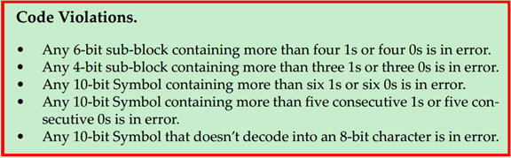

关于解扰码器（Descrambler）和Byte Un-striping都比较简单了，这里就不在详细地介绍了。具体可以参考PCIe Spec的相关内容。

## 链路初始化与训练基础（一）

PCIe总线中的链路初始化与训练（Link Initialization & Training）是一种完全由硬件实现的功能，处于PCIe体系结构中的物理层。整个过程由链路训练状态机（Link Training and Status State Machine，LTSSM）自动完成，也就说基本没有数据链路层和事务层啥事。

LTSSM在PCIe体系结构中的位置的示意图如下：

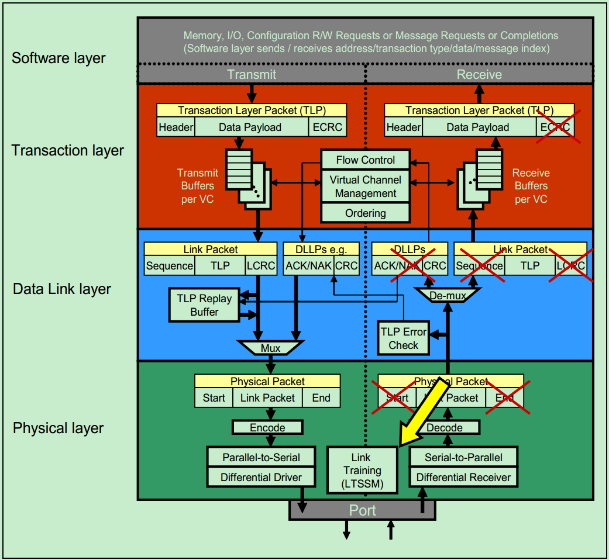

在系统复位后，会自动进行链路训练，以达成以下目标：位锁定（Bit Lock）、字符锁定（Symbol Lock，Gen1 & Gen2 Only）、块锁定（Block Lock，Gen3 Only）、确定链路宽度（Link Width）、通道位置翻转（Lane Reversal）、信号极性翻转（Polarity Inversion）、确定链路的数据率（Data Rate）和通道对齐（Lane-to-Lane De-skew）等功能。

下面依次的，简要地介绍一下这些目标。

**注：**本次连载博文主要Gen2为主，所以一些和Gen3相关的内容只会简单提及，并不会深入地介绍，有兴趣的可以阅读PCIe Spec V3.0或者Mindshare的相关书籍。

首先是**位锁定（Bit Lock）：**

前面的文章中提到过，PCIe总线采用了一种嵌入式时钟的机制，即发送端只向接收端发送数据信号，并不发送时钟信号（时钟信号隐藏在数据信号中）。接收端可以通过CDR（Clock and Data Recovery）逻辑将时钟从数据流中恢复出来，然后再用恢复出来的时钟对数据信号进行采样。当然，时钟恢复需要一定的时间，才能保证时钟信号与数据信号的相位对应关系符合要求。一旦CDR完成了时钟的恢复，我们就说PCIe总线完成了**位锁定。**

**字符锁定（Symbol Lock）：**

完成了位锁定之后，只是能够准确地识别出数据流中的0和1，还是不知道发送的内容是个啥。对于Gen1&Gen2来说，采用的8b/10b编码，即传输的数据是以10bit为一个字符。LTSSM可以引导物理层相关逻辑通过识别COM（K28.5）等控制字符来确定每个字符的开始与结束为止，即**字符锁定**。

**链路宽度（Link Width）：**

由于PCIe允许将x1的PCIe卡插入x4、x8甚至是x16的PCIe插槽中。因此在链路训练与初始化过程中，相邻的两个PCIe设备需要相互通信来确定其支持的最大链路宽度。

**注：**实际上PCIe Spec还允许采用动态带宽的机制，即允许链路宽度和数据率动态调整，以实现降低功耗等功能。

**通道位置翻转（Lane Reversal）：**

有的时候两个PCIe设备的通道排列位置可能不太一致，PCIe Spec允许对默认的通道排列位置重新排列，如下图所示。但是，从大部分的PCIe设备（PCIe卡和插槽等）都是按照统一的标准实现的，一般不会出现这种情况，因此这一功能是**可选的**。

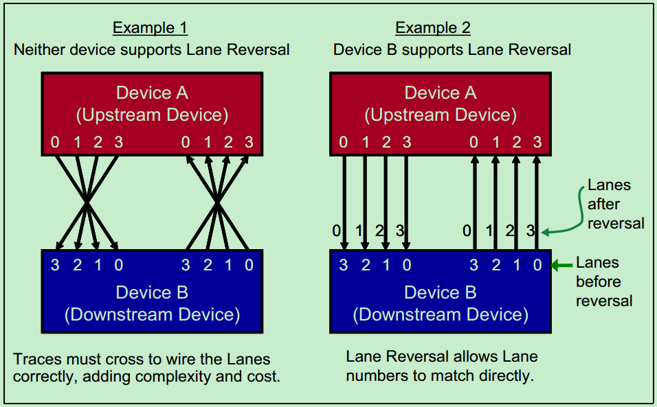

**信号极性翻转（Polarity Inversion）：**

前面的文章中介绍过，PCIe收发的都是差分信号，有的时候Link两端的设备的对应信号的极性可能是相反的。因此，PCIe Spec允许在链路训练与初始化的时候，对其进行调整，如下图所示。和通道位置翻转（Lane Reversal）不一样的是，信号极性翻转（Polarity Inversion）并不是一个可选项，而是所有标准PCIe设备都应支持的。

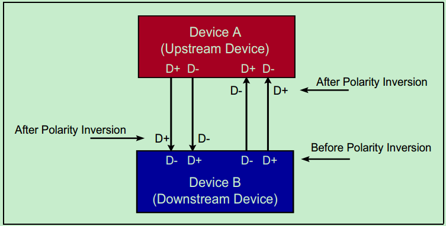

**链路的数据率（Data Rate）：**

系统刚复位的时候，链路训练和初始化都是基于2.5G T/s的速率的。如果Link两端的设备都支持更高的速率，则会自动进入Re-training状态，以重新切换速率。

**注：**PCIe Spec规定，高速率的PCIe设备必须能够向下兼容。即Gen2必须同时支持2.5G T/s和5G T/s。

**通道对齐（Lane-to-Lane De-skew）：**

PCIe链路完成字符锁定后，还需要进行通道对齐。因为有的通道的信号可能先到达，有的可能后到达。PCIe Spec规定PCIe链路应有能力对一定范围了的Lane-to-Lane Skew进行移除，使得各个Lane上的信号是同步的。关于通道对齐，会在后续的博文中详细地介绍。

## 链路初始化与训练基础（二）

前面的文章中提到过，Ordered Sets分别有以下几种：TS1 and TS2 Ordered Set (TS1OS/TS2OS)、Electrical Idle Ordered Set (EIOS)、FTS Ordered Set (FTSOS)、SKP Ordered Set (SOS)和Electrical Idle Exit Ordered Set (EIEOS)。其主要用于链路初始化与训练等功能。在介绍LTSSM之前，先来简单地介绍一下Ordered Sets中的TS1OS和TS2OS。

TS1OS和TS2OS类似都是由16个Symbol组成（10bit，8b/10b编码之后的Byte），其结构图如下图所示：

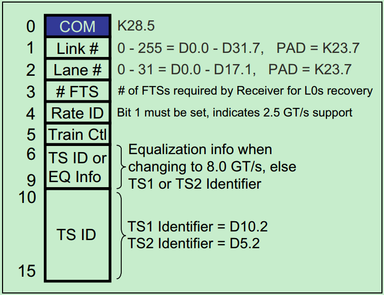

其中，TS1OS的详细内容如下表所述：

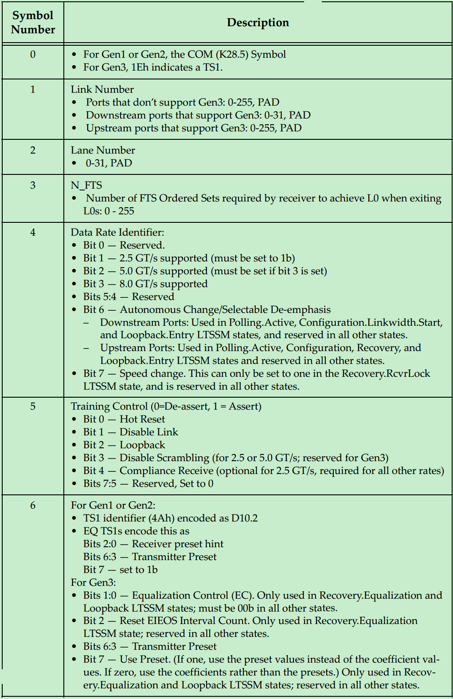

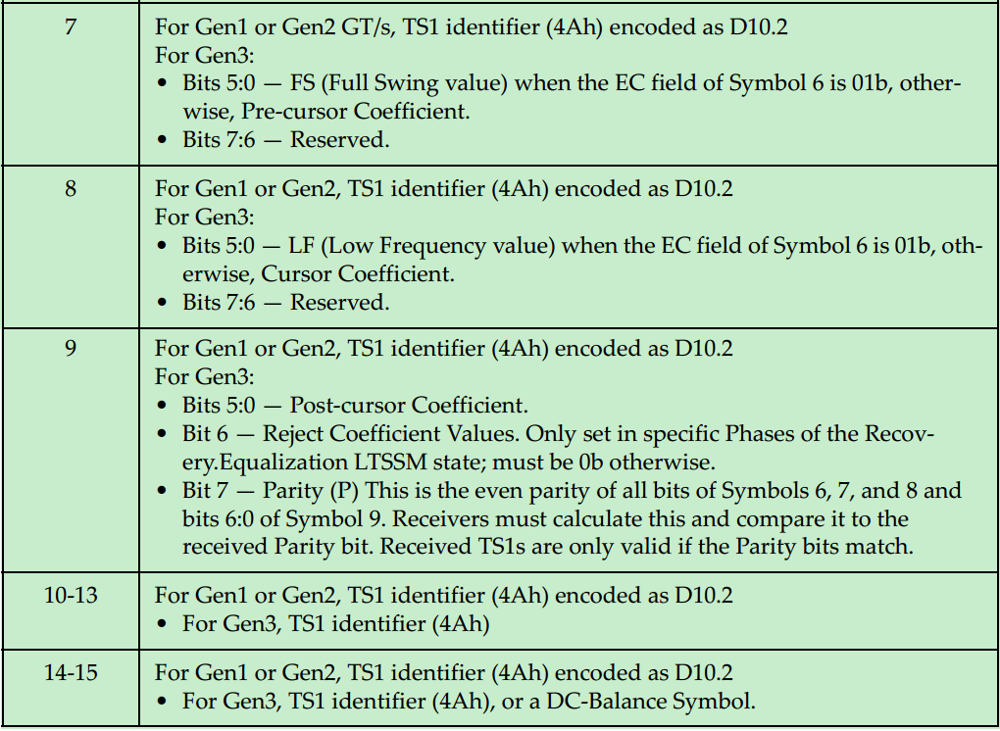

TS2OS的详细内容如下图所示：

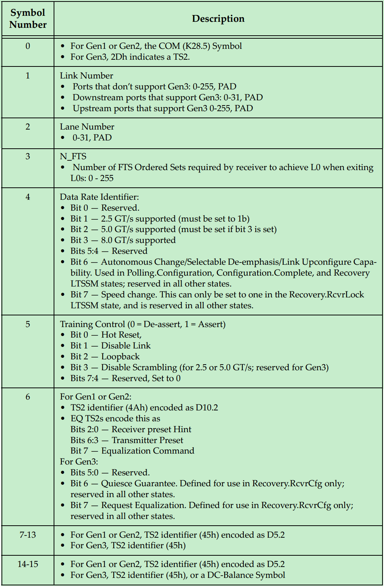

## 链路初始化与训练基础（三）

这一篇文章来简单地介绍一下链路训练状态机（Link Training and Status State Machine，LTSSM），并简要地介绍各个状态的作用和实现机制。

LTSSM有11个状态（其中又有多个子状态），分别是Detect、Polling、Configuration、Recovery，L0、L0s、L1、L2（L3是可选的）、Hot Reset、Loopback和Disable状态。系统进行复位操作（Cold, Hot or Warm Reset）后，会自动进入Detect状态。

这11个状态又可以被分为以下五个类别：

1、链路训练状态（Link Training State）；

2、重训练状态（Re-Training（Recovery） State）；

3、软件驱动功耗管理状态（Software Driven Power Management State）；

4、活动状态功耗管理状态（Active-State Power Management State，ASPM State）；

5、其他状态（Other State）；

如下图所示：

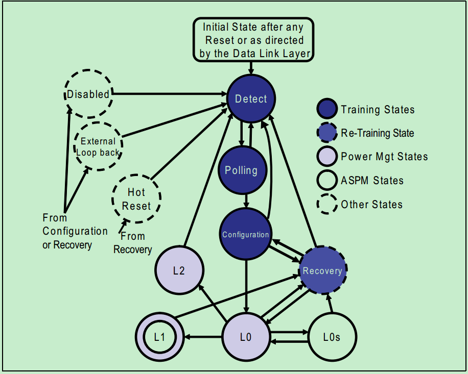

下面分别简要地介绍一下各个状态：

首先是**Detect：**

前面说到，系统进行复位操作（Cold, Hot or Warm Reset）后，会自动进入Detect状态。在这个状态中，PCIe设备会去检测自己Link的另一端是否存在其他PCIe设备。换句话说，就是检测有没有其他的PCIe设备与其相连接。如下图所示：

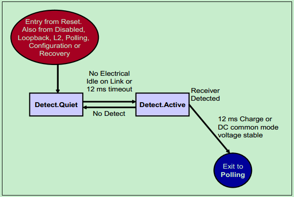

**Polling：**

在该状态中，PCIe设备会依次发送TS1OS和TS2OS以实现以下目标：

1、位锁定（Bit Lock）；

2、字符锁定（Symbol Lock）；

3、信号极性翻转（Polarity Inversion），如果需要的话；

4、确定各个设备支持的速率（Data Rates）。

如下图所示：

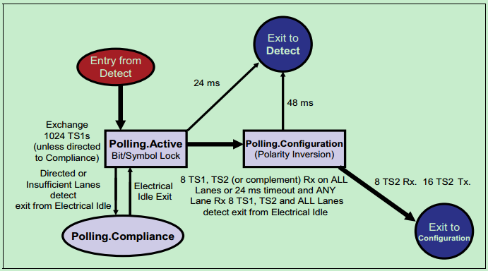

**Configuration：**

在该状态中，PCIe设备会依次发送TS1OS和TS2OS以实现以下目标：

1、确定链路宽度（Link Width）；

2、分配通道（Lane）号；

3、通道位置翻转（Lane Reversal），如果需要的话；

4、通道对齐（Lane-to-Lane De-skew）。

如下图所示：

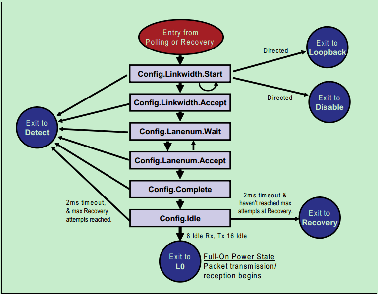

**L0：**

这是链路（Link）的正常状态（Normal and Full-Active State），所有的TLP、DLLP和Ordered Sets都可以被正常的收发。该状态下，速率可以是2.5GT/s或者是5GT/s（如果链路两端设备都支持的话，且经过了Re-Trainning）。

**Recovery：**

这个状态用于Re-Trainning，因此Re-Trainning可能会改变原有的速率，所以位锁定（Bit Lock）和符号锁定（Symbol Lock）操作都会被重新进行，但是花费的时间要比第一次少很多。

其内部的子状态转移图如下图所示：

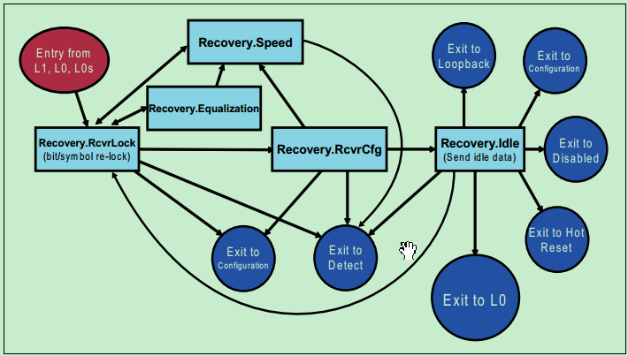

**L0s：**

该ASPM状态主要用于降低功耗，在总线空闲的时候可以进入该状态，且从该状态可以迅速地重新切换回L0状态。当在L0状态是，链路上出现EIOS时，则表明即将进入L0s状态。当在L0s状态时，链路上出现FTS时，链路会迅速地完成位锁定和符号锁定，并进入L0状态。

发送端如下图所示：

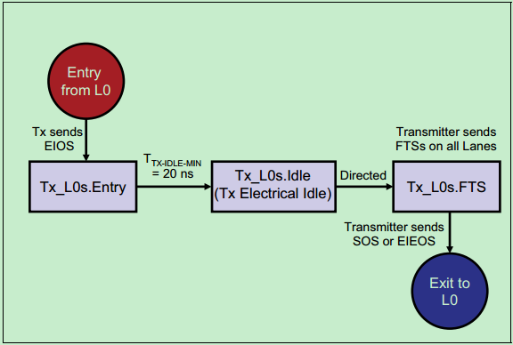

接收端的示意图如下：

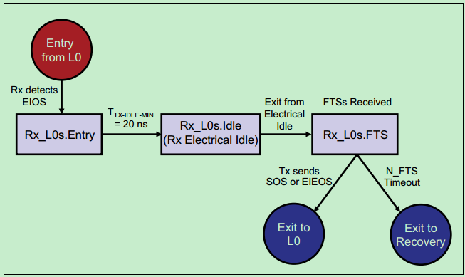

**L1：**

相对于L0s状态，L1状态下的功耗更低。进入L1状态需要链路两端的PCIe进行“沟通”，只有双方都“同意”进入该状态，链路才会进入该状态。一般有以下两种方式：

1、第一种是由ASPM引导，硬件自动完成的。发送端发现链路上长时间没有TLP或者DLLP时，便通过ASPM建议接收端进入L1状态。如果接收端“同意”了，则链路进入L1状态；如果接收端“不同意”，则链路进入L0s状态。

2、第二种是有软件引导的，软件发送一系列的命令让链路进入低功耗状态（D1，D2，or D3 Hot）。随后，链路的上端设备会通知下端设备进入L1状态，收到来自下端设备的应答后，链路进入L1状态。

如下图所示：

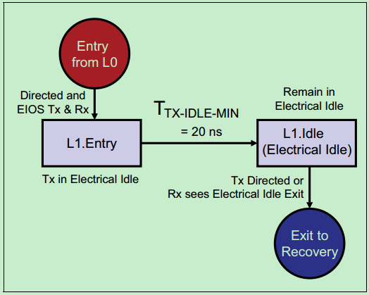

**L2：**

L2状态下的链路功耗更低，因为其只保留了Vaux，关闭了链路的其他功能。此时，需要Beacon信号或者WAKE#边带信号来唤醒系统。其中Beacon信号是一种低频信号（30KHz~500MHz），其波形图如下图所示：

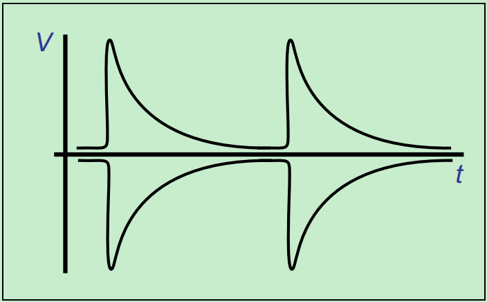

**注：**此外，还有一个L3状态，不过其实际上已经不属于LTSSM了。由于L3状态连Vaux都关闭了，一旦进入L3状态，实际上和直接关闭PCIe设备的电源没有什么太大的差别了。

L2的子状态转移图如下图所示：

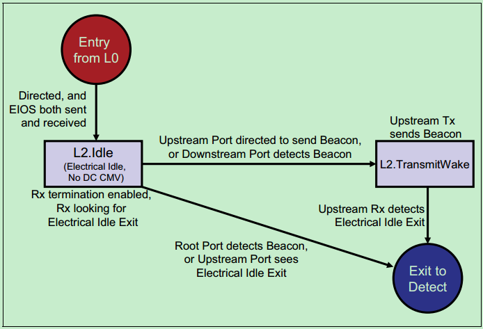

**Loopback：**

该状态主要用于测试，这里就不详细介绍了。

**Disable：**

该状态中链路被禁止，此时发送端处于电气空闲状态（Electrical Idle State），而接收端处于低阻状态（Low Impedance State）。进入该状态的原因可能是链路连接不稳定，或者链路中的某个设备被移除，如PCIe卡从插槽中拔出。

**Hot Reset：**

软件可以通过将桥控制寄存器（Bridge Control Register）中的Secondary Bus Reset位置位来复位链路。随后，桥下端的PCIe设备发送TS1OS，其中的Training Control中包含了Hot Reset的信息。当接收端发现连续的两个TS1OS中都包含Hot Reset时，链路随后进入复位状态。

**注：**本文只是对LTSSM进行了简单的介绍，关于具体的每一个状态内部是如何实现的，请参考PCIe Spec相关章节。

## 物理层电气部分基础（一）

之所以把物理层电气部分的文章放在链路初始化与训练文章的后面，是因为这一部分涉及到一些相关的概念，如Beacon Signal、LTSSM等等。

前面已经多次提及，由于本次连载的文章主要是基于Gen2的，所以关于Gen3的相关内容只会提及，但是并不会深入的介绍，如果有兴趣的可以自行阅读Gen3的Spec。

关于链路初始化与训练的文章中提到过，PCIe Spec规定，支持新的标准的PCIe设备应当能够向前兼容。即Gen2的设备必须同时支持2.5GT/s和5GT/s。

**注：**当然这也不是绝对的，当摸一个设备只支持5GT/s速率时，可以通过将Link Capability 2 Reg中的Supported Link Speed 置为全0，同时将Link Control 2 Reg中的Hardware Autonomous Speed Disable置1。来禁止系统尝试将速率降为2.5GT/s。

PCIe Spec规定，PCIe设备必须是Short-Circuit Tolerant的，这可以让PCIe卡支持热插拔的功能。此外，由于PCIe总线是一种高速的差分总线，因此，其收发两端是交流耦合的（AC-Coupled）。一般情况下，靠近发送端的链路上放置电容来滤除直流信号，如下图所示：

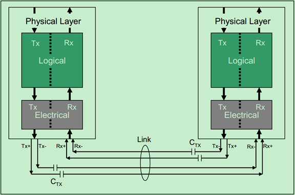

详细的差分收发对模型如下图所示：

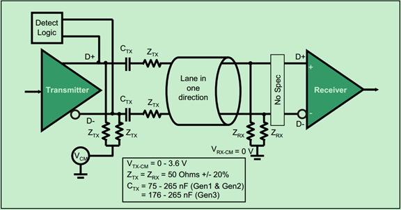

当然，如果PCIe设备把电容集成到Silicon（芯片）中，也是可以的（不过一般不会这么做，因为在芯片内部集成大电容成本很高）。使用交流耦合的另一个优势是，可以允许链路两端的设备使用不同的电源和地。

**注：**关于半导体中的电容，以及芯片周围的一堆退耦电容是什么鬼，打算找个时间单独写一篇文章来详细地聊一聊。

**注：**关于PCIe的热插拔实现机制，后续单独写一篇文章来介绍。有兴趣的读者也可自行阅读PCIe Card Spec的相关章节。

需要注意的是，PCIe总线采用的是嵌入式时钟，即只有数据Lane，并没有时钟Lane（对于Gen1/Gen2，是通过8b/10b编码来嵌入和恢复时钟的；对于Gen3及之后的版本，是通过扰码和128b/130b来实现嵌入和恢复时钟的）。

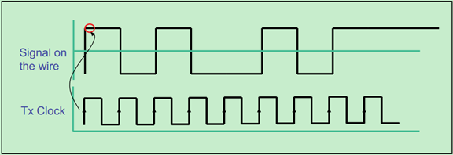

L0模式下的链路结构图（状态图）如下：

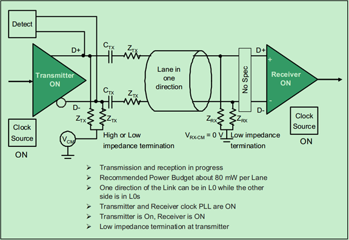

L0s模式下的链路结构图（状态图）如下：

L1模式下的链路结构图（状态图）如下：

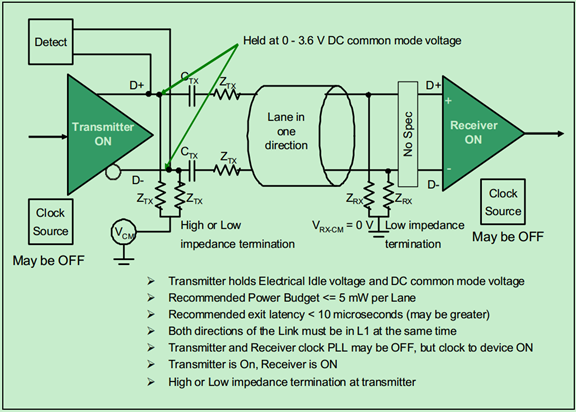

L2模式的链路结构图（状态图）如下：

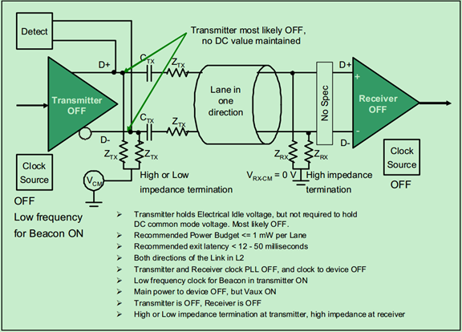

L3模式的链路结构图（状态图）如下：

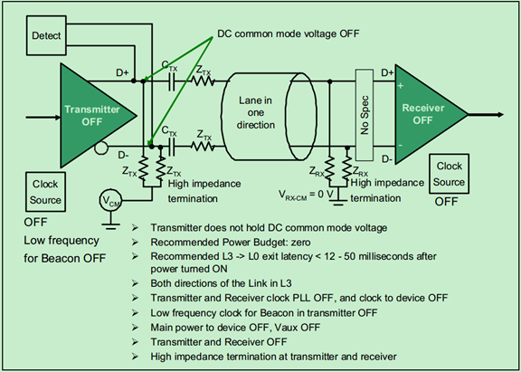

## 后续未整理目录

18、PCIe扫盲——物理层电气部分基础（二）之De-emphasis：http://blog.chinaaet.com/justlxy/p/5100053544

19、PCIe扫盲——Lattice ECP3/ECP5 SerDes简介：http://blog.chinaaet.com/justlxy/p/5100053990

1、PCIe扫盲——PCIe错误定义与分类：http://blog.chinaaet.com/justlxy/p/5100057782

2、PCIe扫盲——PCIe错误检测机制：http://blog.chinaaet.com/justlxy/p/5100057784

3、PCIe扫盲——PCIe错误源详解（一）：http://blog.chinaaet.com/justlxy/p/5100057797

4、PCIe扫盲——PCIe错误源详解（二）：http://blog.chinaaet.com/justlxy/p/5100057799

5、PCIe扫盲——PCIe错误报告机制：http://blog.chinaaet.com/justlxy/p/5100057800

6、PCIe扫盲——高级错误报告AER（一）：http://blog.chinaaet.com/justlxy/p/5100057838

7、PCIe扫盲——高级错误报告AER（二）：http://blog.chinaaet.com/justlxy/p/5100057839

8、PCIe扫盲——两种中断传递方式：http://blog.chinaaet.com/justlxy/p/5100057840

9、PCIe扫盲——中断机制介绍（INTx）：http://blog.chinaaet.com/justlxy/p/5100057841

10、PCIe扫盲——中断机制介绍（MSI）：http://blog.chinaaet.com/justlxy/p/5100057842

11、PCIe扫盲——中断机制介绍（MSI-X）：http://blog.chinaaet.com/justlxy/p/5100057843

12、PCIe扫盲——复位机制介绍（Fundamental & Hot）：http://blog.chinaaet.com/justlxy/p/5100057844

13、PCIe扫盲——复位机制介绍（FLR）：http://blog.chinaaet.com/justlxy/p/5100057845

14、PCIe扫盲——热插拔简要介绍：http://blog.chinaaet.com/justlxy/p/5100057851

15、PCIe扫盲——PCI Express物理层接口（PIPE）：http://blog.chinaaet.com/justlxy/p/5100057941

16、PCIe扫盲——弹性缓存（Elastic/CTC Buffer）：http://blog.chinaaet.com/justlxy/p/5100057990

17、PCIe扫盲——PCIe配置空间寄存器快速定位表：http://blog.chinaaet.com/justlxy/p/5100058234

1、Power Management概述（一）：http://blog.chinaaet.com/justlxy/p/5100061872

2、Power Management概述（二）：http://blog.chinaaet.com/justlxy/p/5100061891

3、PCIe卡Spec（CEM）导读：http://blog.chinaaet.com/justlxy/p/5100061925

4、PCIe总线性能评估（有效数据速率估算）：http://blog.chinaaet.com/justlxy/p/5100062236

5、基于WinDriver快速开发PCIe驱动简明教程：http://blog.chinaaet.com/justlxy/p/5100064256

6、Crosslink与Multi-Root/Multi-Processor系统：http://blog.chinaaet.com/justlxy/p/5100065650

7、推荐两个实用的PCIe工具软件：http://blog.chinaaet.com/justlxy/p/5100065652

8、关于PCIe参考时钟的讨论：http://blog.chinaaet.com/justlxy/p/5100065655

9、128/130b编码详解：http://blog.chinaaet.com/justlxy/p/5100066168

10、PCIe V1.1/V2.1/V3.0 Changes Overview：http://blog.chinaaet.com/justlxy/p/5100065651

补充篇：

1、M-PCIe与MIPI M-PHY：http://blog.chinaaet.com/justlxy/p/5100064718

2、ReTimer和ReDriver简介：http://blog.chinaaet.com/justlxy/p/5100066965

3、PCIe演进方向？CCIX简介：http://blog.chinaaet.com/justlxy/p/5100064709

4、GenZ，CXL，NVLINK，OpenCAPI，CCIX乱战：http://blog.chinaaet.com/justlxy/p/5100064710

5、Lattice CrossLink-NX对PCIe的支持：http://blog.chinaaet.com/justlxy/p/5100066379

## Why Use A Packet-Based Transaction Protocol

#### 1. Packet Formats Are Well Defined

早期的总线协议（比如PCI）允许未定长度的传输，这会带来几个坏处：

* 对Payload结束位置的判别要等到End of Transfer
* 由于传输过程中可能出现的突然的中断（两种情况），发送方很难计算和发送覆盖整个Payload的CRC校验码
  * 中断情况1：写过程中，接收方突然断开
  * 中断情况2：读过程中，发送方的pre-emption

PCIe采用固定长度和格式的包传输。有几个好处：

* 包的大小相对固定（由Header中的Length域指定），传输一旦开始，接收方不会提前断开
* CRC码在Header中的位置相对固定

#### 2. Framing Symbols Indicate Packet Boundaries

以前在PCI/PCI-X，采用一条单独的信号线（FRAME）来表明传输的开始(assertion)和结束(deassertion)。如果有一点毛刺，就可能导致接收方误判。

现在在PCIe中，不采用单独的信号线，而是在包的最开头和最末尾分别有一段控制字符（Start and End control symbol），对包的边界进行清晰指定。这段控制字符各长达10bit，有效减少了毛刺的影响。且如果接收方decode发现控制字符不对，直接丢弃包。

#### 3. CRC Protects Entire Packet

以前在PCI/PCI-X，用单独的sideband parity signals在每个address和data phase对包进行protection。

现在在PCIe中，用mainband的16-bit或32-bit的CRC码来对包进行protection

PCIe还在每个包的Header植入Sequence Number，一旦ACK/NAK机制下接收方发现包错误，该包必须重传。

# FLIT Failure是什么？

每个FLIT被CRC和三路交织的FEC保护。FLIT被收到后，先检查FEC，再检查CRC，如果这两项都pass了，但是实际上FLIT错了（也就是说，FLIT中发生了多个错误，且这些错误刚好没有被FEC和CRC检测到），这就叫FLIT Fail了。PCIe 6.0要求每10^9个小时内，fail的FLIT大概在5*10^(-10)个左右

# FLIT取256B这个固定值的用意是？

平衡带宽和延时。假设物理层时钟单根线可以传输4Gbps，链路层/协议层时钟每根线只能传1Gbps，那么就选FLIT的宽度是4 bit，就是一个带宽匹配的问题。

如果FLIT宽度太小，带宽就匹配不到，物理层性能就会损失，也就是传输性能的损失。而且FLIT的信息密度就会降低（数据/（数据+控制））

如果FLIT宽度太大，前面协议层/链路层FLIT的accumulate（也就是准备这个FLIT）的时间就会太长，也会增大延时。

以下是来自Intel Fellow的回答：

We considered various FLIT sizes and settled on 256 Bytes with 236 bytes of TLP payload and a TLP efficiency of 92%.

We evaluated higher FLIT sizes such as 740 Bytes, where 20 Bytes would have been used for Data Link Layer Payload (DLP), CRC, and FEC and 720 bytes would have been for the TLP payload, with a TLP payload efficiency of about 97%. Although this option would have been an improvement over the current FLIT size, the latency would have been 3X due to the resulting FLIT accumulation (e.g. a x4 link would have added an extra latency of 16 ns beyond where we are today).

We also considered lower FLIT sizes such as 64 Bytes, with 44 Bytes for the TLP payload, with a resulting TLP payload efficiency of about 69%. However, this option would have resulted in meager latency savings of about 6 ns.

A FLIT size of 256 bytes is an optimal choice, that allows us to exceed the PCIe 6.0 specification requirements around key metrics like bandwidth efficiency and latency.
