layout:     post
title:      UCIe_report
subtitle:   UCIe_report
date:       2025-05-05
author:     George Lin
header-img: img/post-bg-ios9-web.jpg
catalog: true
tags:

    - Interconnect

# Chiplet互联协议浅析——以UCIe为例

## Chiplet概述

## Chiplet现有互联协议概述

### AIB （Advanced Interface Bus）

​    AIB由Intel在2018年提出，是较早的Chiplet互联规范。与PCIe通过复杂的控制电路不断提升钟频、在芯片间用数量很少的物理连线实现数据的高速传输不同，AIB反其道而行之，借助于高密度封装技术，在芯片间使用**数以千计的并行物理连线**来实现数据的高速传输。这样做的好处是，可以一定程度上降低传输的钟频，从而简化Tx和Rx的控制电路，减少面积占用。高密度封装技术可以让microbump之间的间距来到55微米，相比Flip-Chip封装（130/150微米）有很大提升，从而允许数千并行物理连线（Spec 2.0最高支持24 channel \* 160 I/O = 3840根线）的排布。结合每根线1Gbps (AIB Base，SDR)或者2Gbps (AIB Plus, DDR)，带宽可达Tbps量级。

​	AIB协议架构比较简单，是**纯粹的物理层架构**，不涉及数据链路层、协议层等复杂上层架构。在芯片本端，物理层连接一个MAC (Media Access Controller)；在芯片远端，物理层连接远端的物理层。

​	**AIB协议分成两个配置，AIB Base和AIB Plus**。前者用于轻量化实现，仅支持单时钟沿传输(SDR)和时钟前馈（Tx时钟给Rx），不支持高速场景下的双时钟沿传输（DDR），不支持为适应高速场景下严格时序要求而引入的相位调整（Delay-Locked Loops, DLL）、占空比调整（duty-cycle correction, DCC）和重定时器（Retimer, 最简单的Retimer可以只是两个串联的寄存器，复杂一点的可以是一个时钟相位补偿FIFO（clock-phase compensation FIFO）），不支持将Slave Chiplet收到的Tx时钟直接作为自身的Tx时钟发出（典型场景：Memory作为Slave Chiplet，自身可以不需要时钟，完全依赖CPU在访问它的时候给时钟）

​	AIB之间的接口包括Tx, Rx, 时钟和Sideband控制信号。Tx/Rx负责传输数据，Sideband负责初始化和校准（calibration）。

​	AIB物理布局布线遵循让线尽可能短但是平均的原则，有专门的用于布AIB线的区域。

​	AIB有通道损坏时的Repair机制（协议中叫Redundancy）。与UCIe的Repair机制相同，都是留出一些冗余通道，一旦有通道损坏，就整体shift，启用冗余通道，弃用损坏通道

​	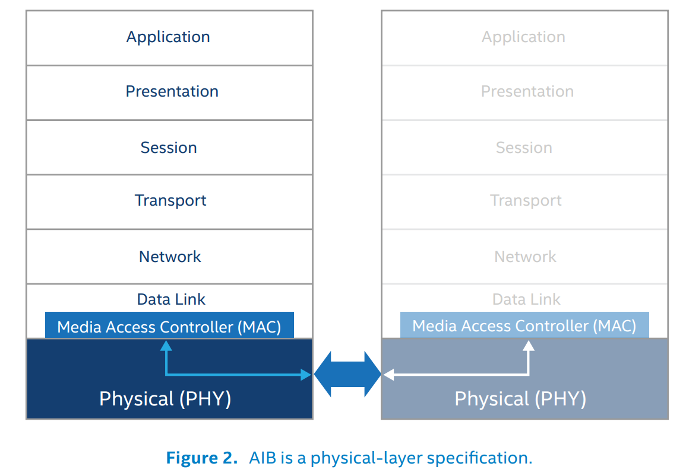

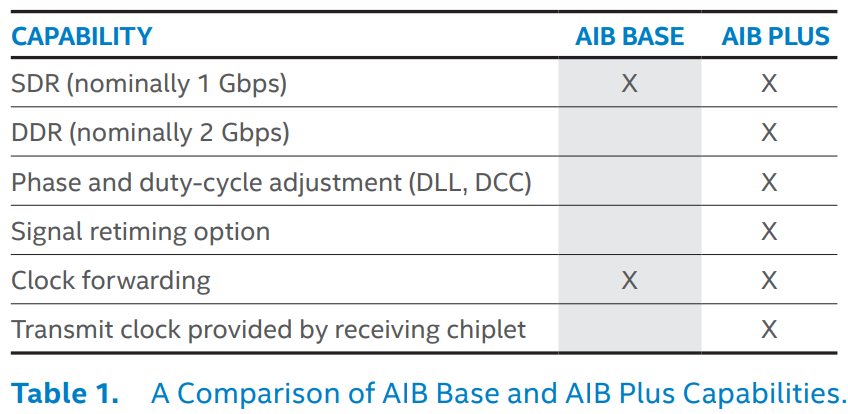

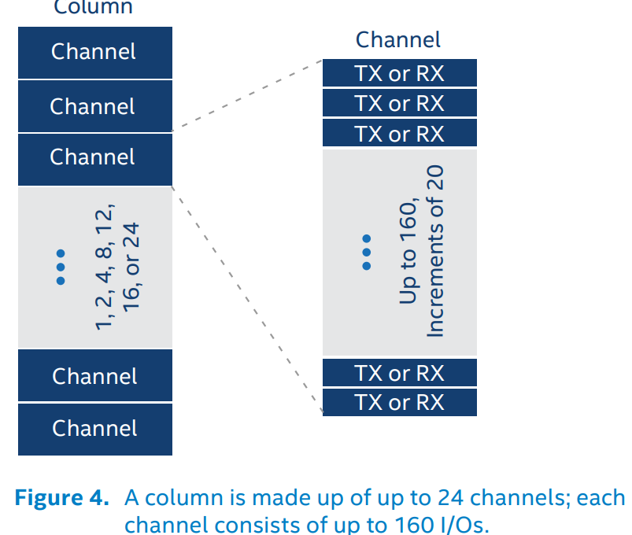

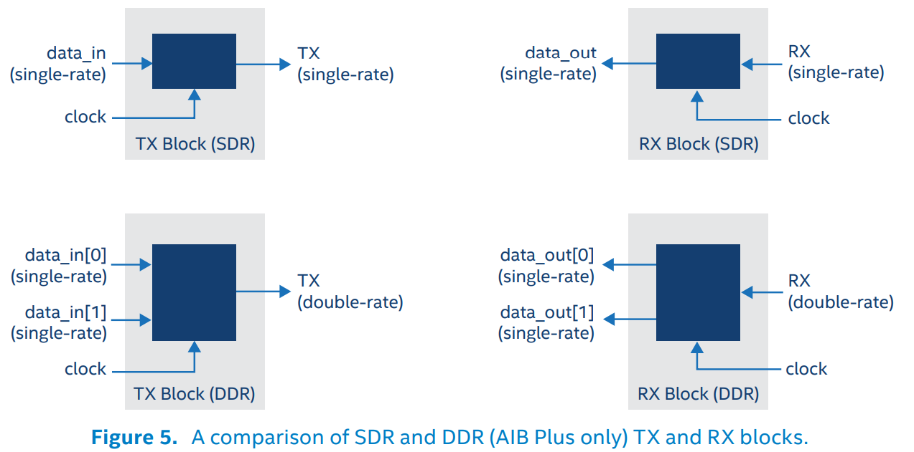

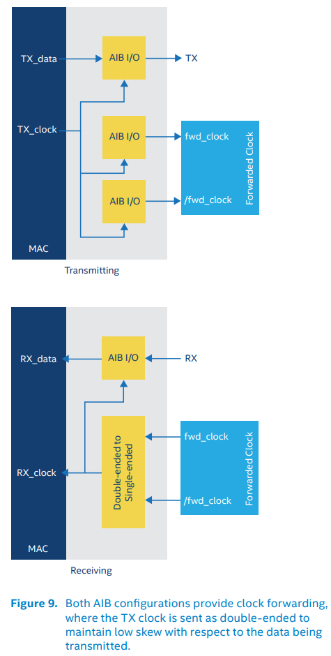

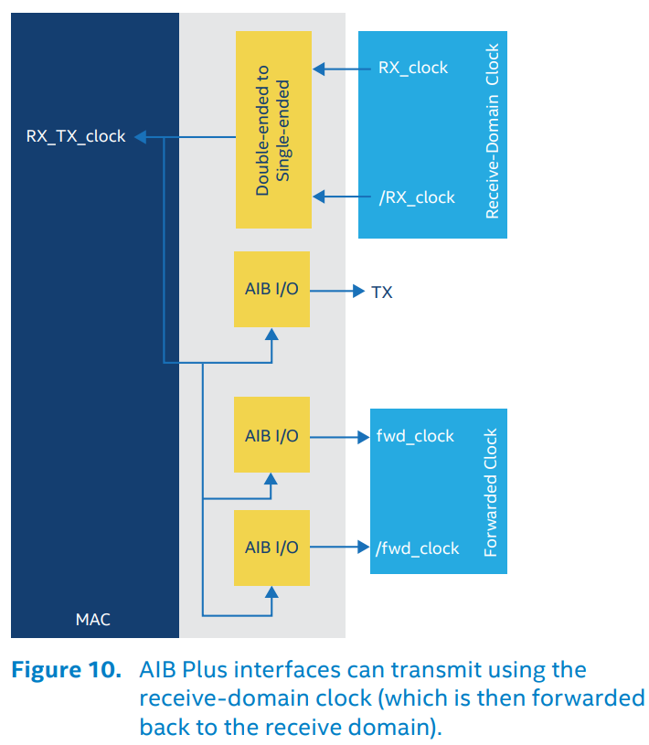

​	

​	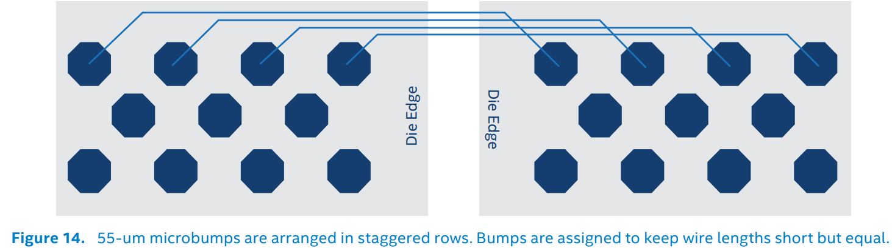

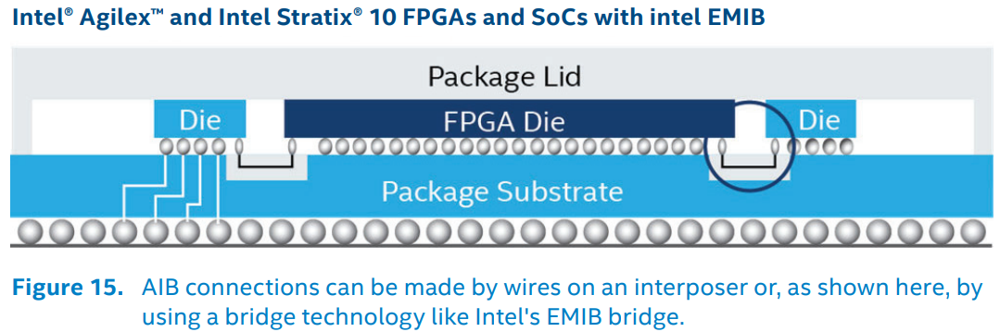

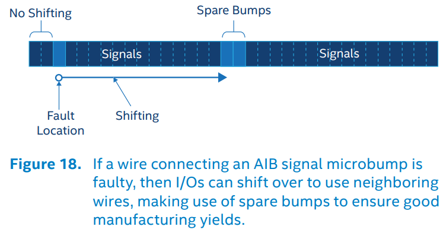

参：*Accelerating Innovation Through a Standard Chiplet Interface -------- From David Kehlet, Intel White Paper*

### CHI-C2C (Coherent Hub Interface Chip to Chip)

https://community.arm.com/arm-community-blogs/b/infrastructure-solutions-blog/posts/multi-chip-and-chi-c2c

CHI-C2C是CHI的扩展版本，由Arm在2024年2月发布，用于片间互联。

CHI-C2C主要面向两个场景，一个是多芯片的SMP(Multi-Chip Symmetric Multi-Processor)（即很多小芯片功能都相似，紧密连接在一起，且每个小芯片里面都有多个处理器核，同一个小芯片中的所有处理器核共享一片memory），一个是多芯片的coherent accelerator attach(就是一个host带一个或者多个加速器）。

CHI-C2C更像是Arm和UCIe Consortium协商之后弄的一个协议。协议主要定义了协议层（Protocol Layer）和打包层（Packetization Layer），对于更底层的数据链接层和物理层不怎么涉及，感觉就是直接面向UCIe，对接UCIe的数据链接层和物理层的（反之，UCIe协议比较关注数据链接层和物理层，对于协议层这类上层的东西讲得很宽泛）。由此推知，UCIe上层协议层支持的除了PCIe/CXL还有一个Streaming Protocol，这个口子就是为了CHI-C2C而开的。

CHI-C2C是一个分层协议。协议层负责片上CHI和CHI-C2C的协议转换。打包层负责将要传输的信息打包成固定长度的包（container），也负责将收到的包进行解析。

CHI-C2C除了CHI的四通道（REQ，RSP, DAT, SNP）之外，加了一个C2C-Specific的通道MISC(Miscellaneous，/ˌmɪs.əlˈeɪ.ni.əs/，混杂的)，专门用来传输那些和片上CHI无关的信息，比如接口的初始化和流控相关的credit grant

CHI-C2C的打包层到外部的数据链接层的接口是极宽的，按协议文本，统一是一个container（即256B）宽。Container可以有两种格式。格式X包含240B的payload（分成12个20B的粒度单位(granules)）、6B的Link Header（Flit Header, CRC, FEC）、10B的Protocol Header，这种格式与UCIe中支持的256B优化模式Flit（Latency Optimized Mode with optional Bytes）兼容；格式Y包含226B的payload（含10个20B的粒度单位，1个16B的粒度单位，1个10B的粒度单位）、20B的Link Header、10B的Protocol Header，这种格式与CXL中支持的256N优化模式Flit (Latency Optimized Mode)兼容。

CHI-C2C的message必须从某个粒度单位（granule）的开端开始放置，每个message可以超过20B的粒度单位限制，也可以不足。

CHI-C2C定义了一些不支持的传输(Transactions)，比如CHI中常见的Forwading snoops（tell the snooped RN-F to send the snoop data directly to the original requester）, Request Retry Flows, Direct Memory Transfer(DMT), Direct Cache Transfer(DCT), Direct Write Transfer (DWT)这些。CHI-C2C禁止了这些为了跳过Home Node而做的Resp优化，而保留了缓存一致性的基础内容（比如snoop，比如用来实现缓存一致性的Request Message）

CHI-C2C在流控上采用了以下策略。首先是对每种Message class用分开的credit来进行流控。

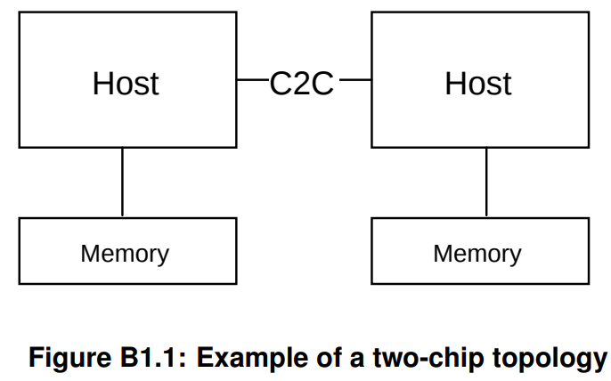

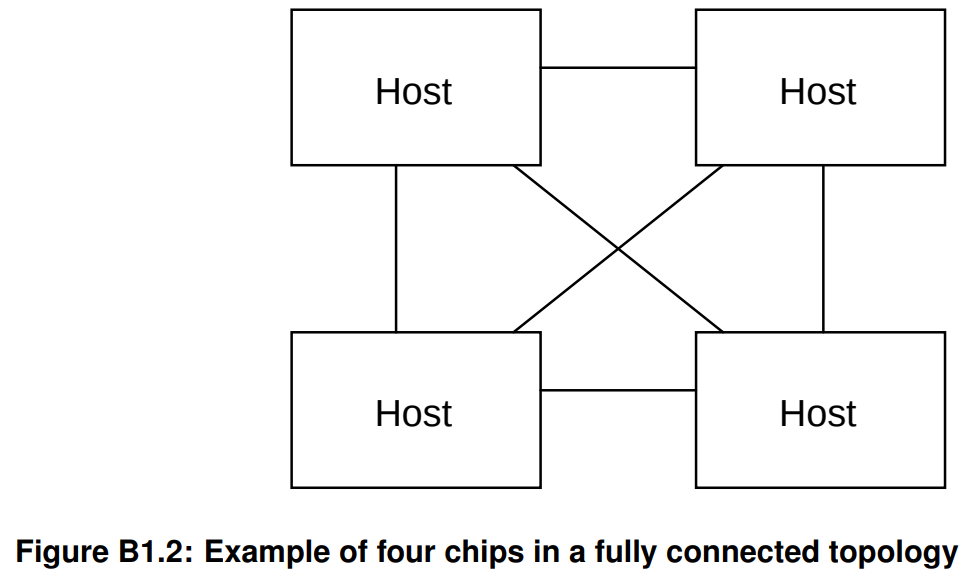

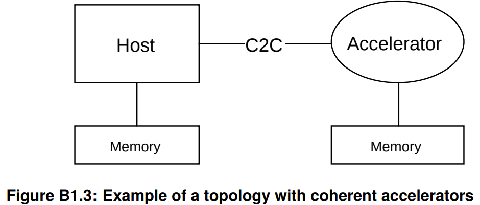

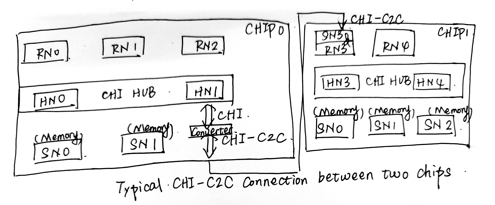

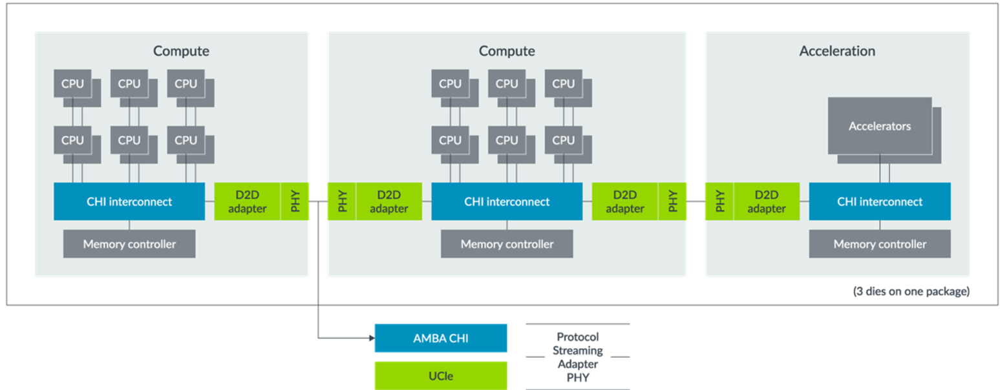

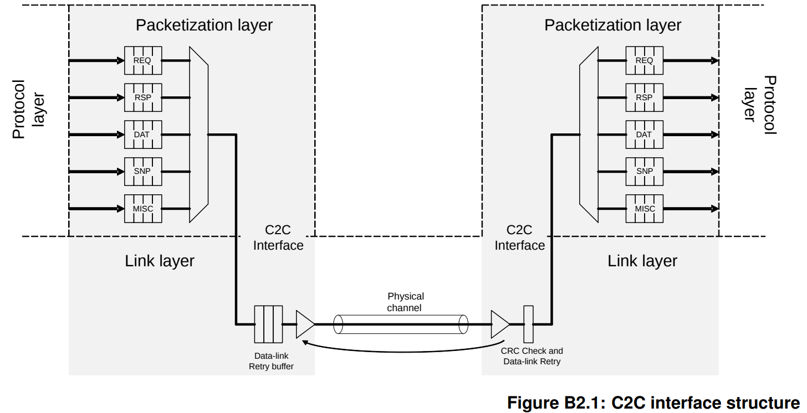

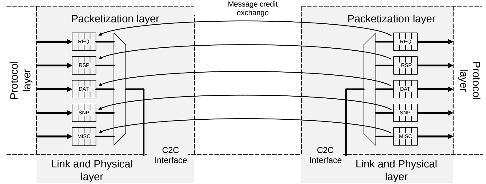

### CXL(Compute Express Link)

CXL是Intel于2019年提出的一种基于PCIe物理层的协议。

CXL提供了三种接口协议，分别是CXL.io（用来兼容PCIe Gen4及以上）, CXL.cache（实现Host和设备的缓存一致性）和CXL.mem（CPU直接以原生的Load/Store语义访问CXL设备的内存，以实现内存扩展的功能），其最大收益是提供了相对较低延时、较高带宽的路径，用于device访问host资源和Host访问device侧的memory资源。

CXL至今一共经历了3代协议，1.0/2.0/3.0版本分别提供直连、池化、Fabric能力。CXL1.0/1.1 可归纳为“直连”，也就是让主机CPU可以直接访问PCIe设备的内存，具体分为三个子协议：CXL.io用于设备注册发现、CXL.cache用于设备访问CPU内存、CXL.mem 用于CPU访问设备内存。这可达到主机内存扩充的目的。CXL2.0 可归纳为“池化”，就是让多个主机CPU和多个设备可通过一个CXL Switch硬件连接在一起，可以相互访问，在较小延迟影响的前提下提供高容量大带宽。这可达到内存池化的目的。CXL3.0 可归纳为Fabric，可以让多个Switch形成级联结构，支持更复杂的结构。这可以达到“软件定义内存”的目的，此处借用了“软件定义网络”的概念

CXL主要有几个显著特点。首先是低延时。低延时的说法是相对PCIe来说的。在PCIe中，假设运行在CPU内部的用户进程需要和PCIe设备进行交互，需要基于生产者-消费者模型(即生产者将生产出的东西放进缓冲区，消费者从缓冲区将东西拿出来消耗，也就是解耦的过程)。即，CPU将数据放在Host memory中，通知Device来进行搬运。Device将数据先搬运到Device Memory，再从Device Memory取出来，启动硬件模块进行处理。这样做的好处是解耦，系统架构划分更清晰，方便设计，而且避免了从Host CPU直接到Device功能模块的长物理路径造成的读写操作的不确定性（主要是延时的不确定）；缺点是Host Memory和Device Memory作为延时路径上两个额外的组分，极大增加了延时。CXL解决了这个问题，通过在Device端维护一个容量较小的一致性Cache，Host Memory通过Coherency Bridge直接访问Device端的一致性Cache，使Device在访问Host Memory时，就像在访问自己的Memory一样自然。这个Device端的一致性Cache（CXL.cache）可以看成是Host端片上一致性总线的延伸。（注：CXL协议着重指出，在高流量传输的情形下，这一功能是不适用的，猜测可能是因为维护大容量一致性cache的成本过高，以及在高流量场景下Host和Device的长距离读写可能带来较大的不确定性；CXL主要还是面向和CPU频繁交互的情形）

低延时角度可以做如下总结：1. CXL与PCIe的模拟PHY是同一个，所以最底层数据传输延时相同。CXL没有了PCIe的排序规则、DLLP、访问权限检查这些耗时的操作，有效数据带宽也相对较高，所以延迟更低。2. 站在应用层的角度，PCIe读写内存如上所述，需要遵循生产者消费者模型，有Copy损耗，延迟很大，CXL适用了缓存，取消了Copy，延迟更小。3. 大数据量下，CXL没什么优势；小段内存下，CXL优势很大

其次是面效比。这是相对DDR来说的。DDR是并口通信，数据和地址的每个bit都需要占用一根线，DDR4/5每个通道有288根线，每根线占用CPU的一个pin脚，这导致CPU很难扩展太多的DDR通道出来，一方面pin数消耗非常多，另一方面主板布线很难布开，而且并口的每根线很难保证信号的同步。基于PCIe物理层的CXL没有这个问题CXL是串口SerDes通信，数据和控制都编码为数据包进行发送。PCIe的每个lane包含两对差分信号，也就是4根线，也就是相同的带宽下，更加省CPU面积和主板走线空间。考虑到目前服务器的核心越来越多，但内存通道不能随意扩展，每个核分到的内存带宽越来越吃紧。CXL这种高带宽密度的串口内存可能会成为突破口。

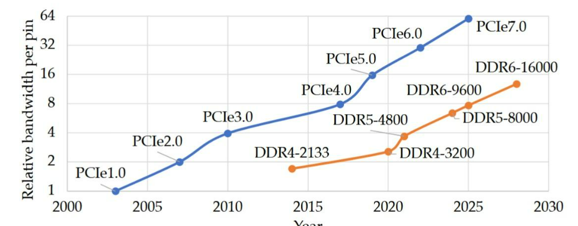

再次是内存控制解耦。之前的主流是CPU内部集成内存控制器。CPU与内存控制器的紧耦合会带来更高的运行频率，而且CPU也可以直接看到内存控制器的一些状态，便于对访存进行调度。但是内存系统也变得很不自由，能用什么类型的内存要看CPU的支持情况。一旦CPU升级换代，很多前代接口的内存都要报废。CXL改变了这个状况，通过把内存控制器放在设备端，内存和CPU之间通过标准的CXL通道进行通信，实现了内存设备和CPU本身的解耦，这样可以允许我们在不更换CPU的情况下兼容多种内存设备（DDR4，DDR5，NVM）等。

还有就是CXL便于实现内存资源的池化。CXL2.0允许多个memory通过CXL接口接到中心化的memory pool上，对接同一个设备，CXL3.0进一步允许多设备对接多存储，从而实现内存资源的按需取用，提升整体内存资源的利用率。（这个主要是通过Type2 Device实现的，即Host快速访问Device Memory）

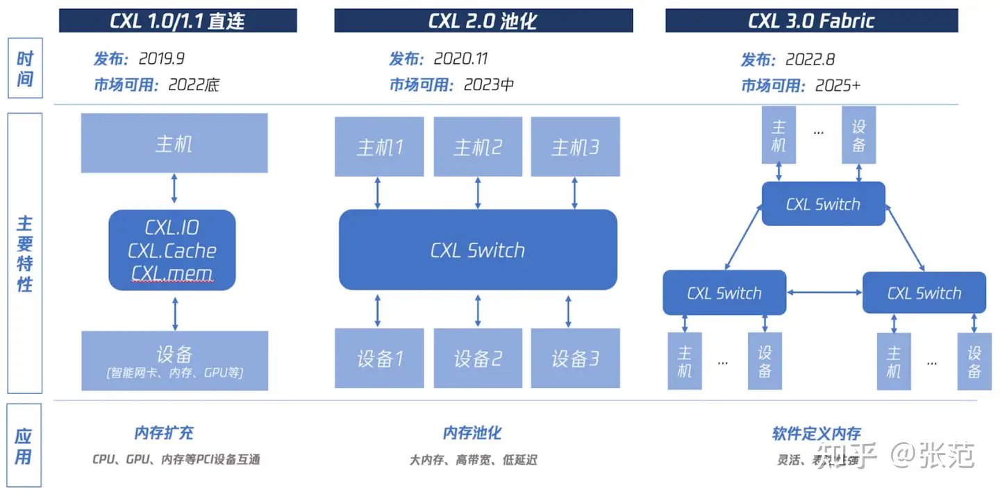

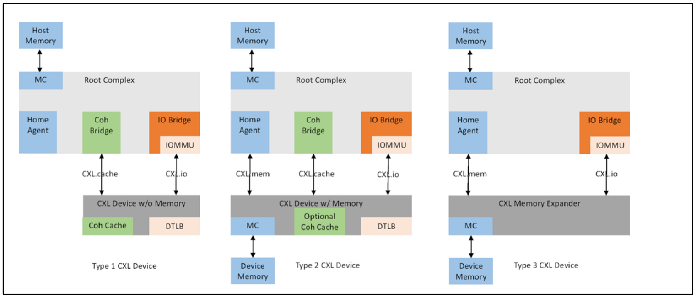

### NVLink

NVLink是Nvidia在2016年提出的一种闭源的专用互联协议，已经出到第四代，每个lane可以支持惊人的112Gbps，比对应的PCIe Gen5带宽高出3倍。

NVLink主要面向GPU之间的点对点高速互联。其相比PCIe低延迟、高带宽，我们认为有以下几点原因。

首先是专一的应用场景。不用做到“通用”，没有兼容性负担，且由于是闭源协议，不需要考虑行业水平。

第二是市场需求因素。除了高端超算、GPU等对带宽极端需求的场景，PCIe Gen3/Gen4已经可以在大多数任务下没有性能瓶颈，考虑到PCI-SIG的领导者是主打CPU的Intel，过快升级PCIe提升的是GPU的性能，于市场竞争益处不大。

第三是两者的物理层走线数量有巨大差异。NVLink是8对差分线组成一根sub-link，一对sub-link（一根Tx一根Rx）组成一根link。所以x18的NVLink3.0，数据速率25Gbps，总带宽为25×8×2×18=7200Gbps=900GB/s。PCIe是单通道两对差分线（一根Tx一根Rx）,PCIe5.0信号速率32GT/s，128b/130b编码。x16单向带宽就是32×128/130×16=504Gbps=63GB/s。理论上对于实现全双工的PCIe设备，可以提供126GB/s的双向带宽。从信号线路数量来说，x16的PCIe和x2的NVLink都是32根差分线。x2的NVLink3.0双向带宽是100GB/s，低于PCIe5.0 x16。那PCIe为什么不做x144来媲美x18的NVLink呢？我们推测：一方面，是因为功耗问题，高带宽下数据传输功耗非常显著，Nvidia在功耗控制方面可能十分出色。另一方面，NVLink是自有协议，可以通过很小的摆幅来实现低功耗。但PCIe需要考虑远古的硬件的兼容性和稳定性问题，摆幅拉得比较大。再有一方面，NVLink走线距离极短，PCIe走线很长，很多时候还要加Retimer，功耗自然就上去了。

第四是NVLink的serdes基于ethernet，比PCIe的限制少很多。比如对于BER（bit error rate），Ethernet的要求比PCIe低非常多，所以NVLink不采用重传机制，也没有PCIe强大的纠错码机制（一个解释是：NVLink面向AI训练推理，而现在的AI训练数据和中间数据会反复很多次进入网络，错码噪声可以被抵消。所以放宽一定的错码率使带宽翻倍在AI训练这个任务上是合理的）

### CCIX(Cache Coherent Interconnect for Accelerators)

CCIX协议于2016年由AMD和ARM牵头提出，旨在推动处理器和加速器的高速互联。目前，CCIX协议已经成为ARM、AMD、华为等公司的私有协议，停止公开演进。

据CCIX白皮书，CCIX协议主要通过两种手段提升性能、降低延迟。一方面，引入了处理器和加速器之间的缓存一致性，以此利好软件编程（软件编程不需要考虑数据到底放在Host处理器还是加速器上。两者cache上数据的同步全部由硬件完成），同时降低访问延迟。另一方面，提高链路的裸带宽，CCIX 1.0支持25GT/s的带宽，CCIX1.1支持32GT/s的带宽。

CCIX协议依然是基于PCIe的分层协议。CCIX的物理层和数据链接层都沿用了PCIe的对应层，只是在往上的层上出现了分支，一边走CCIX的包（CCIX协议层和CCIX链接层），另一边走PCIe的包。

CCIX协议层负责维护内存读写的一致性协议，简而言之就是对ARM CHI这种一致性协议做了一个转换。

CCIX链接层负责把CCIX协议层来的多个通道合成一个，增加带宽。

CCIX协议由于是ARM牵头制定的缓存一致性协议，和ARM的CHI协议有着非常多的相似。比如CCIX负责实现一致性的层，由Request Agent, Home Agent, Slave Agent这一系列组分组成。Request Agent负责发起读写（使编程对内存池化透明的关键）；Home Agent负责作为Request Agent和Slave Agent的桥梁，处理缓存一致性；Slave Agent一般是目标访问的内存。这与CHI协议中的Request Node, Home Node, Slave Node及其功能高度一致。

典型的两种CCIX应用场景。1. Host和加速器共享Host Memory。此情形下，Host和加速器各放置一个Request Agent，Home Agent放置在Host中。2. Host和加速器共享Host和加速器的Memory。此情形下，Host和加速器各放置一个Request Agent和一个Home Agent。

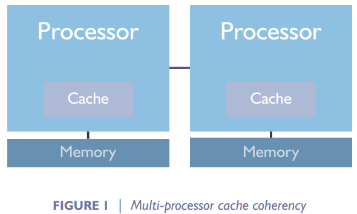

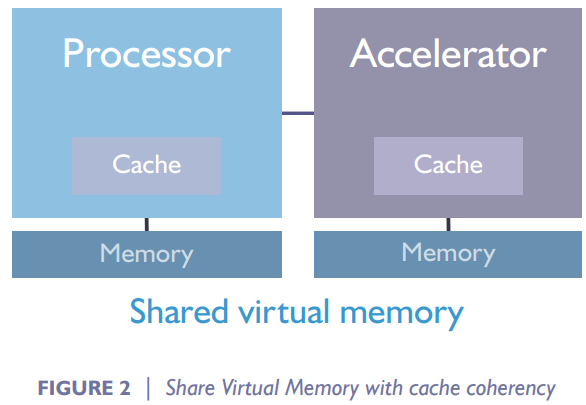

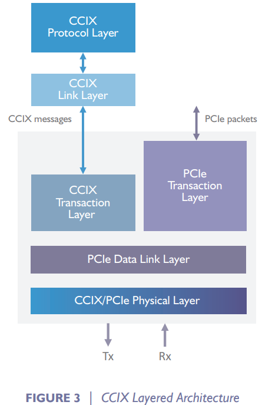

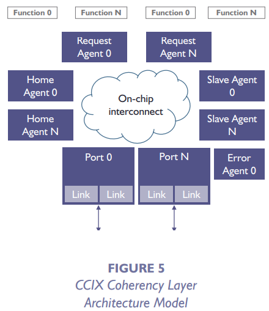

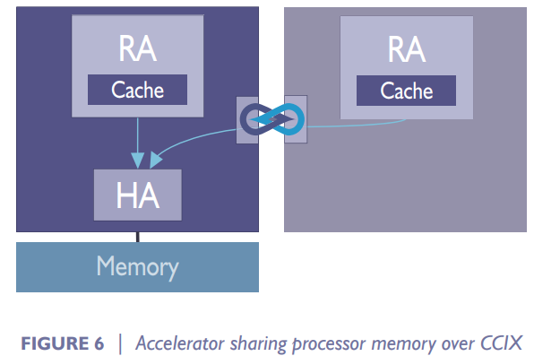

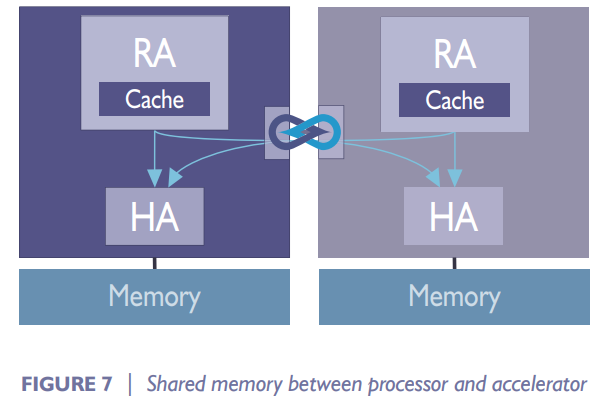

### PCIe（Peripheral Component Interconnect Express）

PCIe协议是Intel于2003年主导提出的一项通用设备总线协议，也是应用最为广泛的设备互联协议。和很多的串行传输协议一样，一个完整的PCIe体系结构包括应用层、事务层（Transaction Layer）、数据链路层（Data Link Layer）和物理层（Physical Layer）。其中，应用层并不是PCIe Spec所规定的内容，完全由用户根据自己的需求进行设计，另外三层都是PCIe Spec明确规范的，并要求设计者严格遵循的。

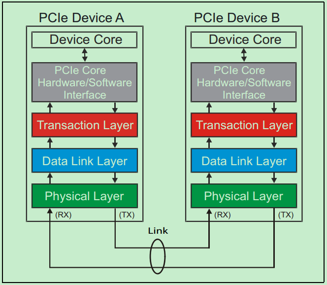

一个简化的PCIe总线体系结构如上图所示，其中**Device Core and interface to Transaction Layer**就是我们常说的**应用层**或者**软件层**。这一层决定了PCIe设备的类型和基础功能，可以由硬件（如FPGA）或者软硬件协同实现。如果该设备为Endpoint，则其最多可拥有8项功能（Function），且每项功能都有一个对应的配置空间（Configuration Space）。如果该设备为Switch，则应用层需要实现包路由（Packet Routing）等相关逻辑。如果该设备为Root，则应用层需要实现虚拟的PCIe总线0（Virtual PCIe Bus 0），并代表整个PCIe总线系统与CPU通信。

**事务层（Transaction Layer）**：接收端的事务层负责事务层包（Transaction Layer Packet，TLP）的解码与校检，发送端的事务层负责TLP的创建。此外，事务层还有QoS（Quality of Service）和流量控制（Flow Control）以及Transaction Ordering等功能。

**数据链路层（Data Link Layer）**：数据链路层负责数据链路层包（Data Link Layer Packet，DLLP）的创建，解码和校检。同时，本层还实现了Ack/Nak的应答机制。

**物理层（Physical Layer）**：物理层负责Ordered-Set Packet的创建于解码。同时负责发送与接收所有类型的包（TLPs、DLLPs和Ordered-Sets）。当前在发送之前，还需要对包进行一些列的处理，如Byte Striping、Scramble（扰码）和Encoder（8b/10b for Gen1&Gen2, 128b/130b for Gen3& Gen4）。对应的，在接收端就需要进行相反的处理。此外，物理层还实现了链路训练（Link Training）和链路初始化（Link Initialization）的功能，这一般是通过链路训练状态机（Link Training and Status State Machine，LTSSM）来完成的。

需要注意的是，在PCIe体系结构中，事务层，数据链路层和物理层存在于每一个端口（Port）中，也就是说Switch中必然存在一个以上的这样的结构（包括事务层，数据链路层和物理层的）。

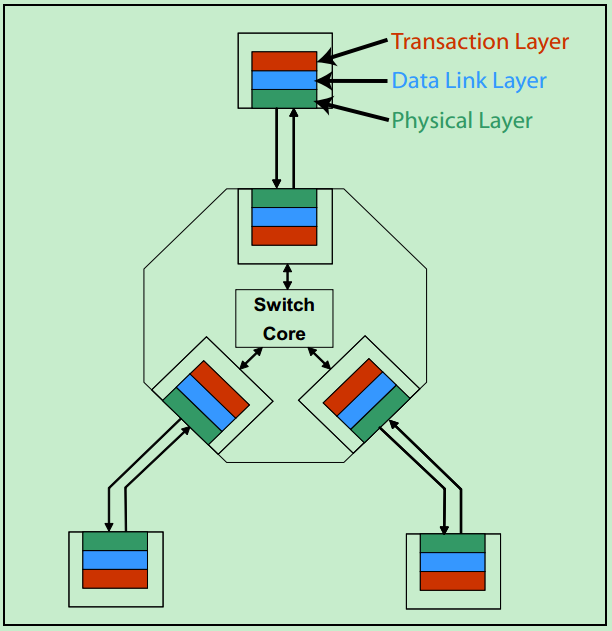

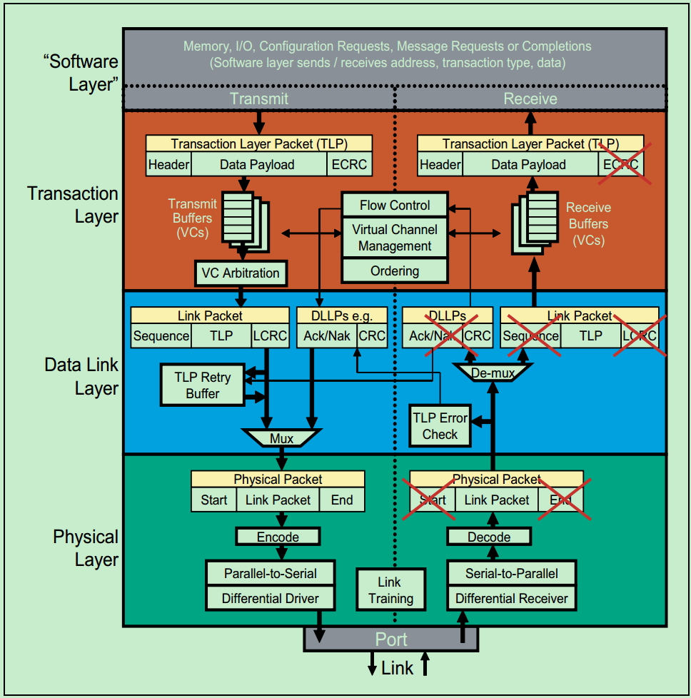

### UCIe（Universal Chiplet Interconnect express）

UCIe是Intel在2022年牵头提出的一项旨在促进芯粒间互联的通用协议。

UCIe同样包括协议层、适配层和物理层，其中适配层可以等价为PCIe的链接层。UCIe协议层支持已经广泛使用的协议PCIe6.0、CXL2.0、CXL3.0，还支持用户自定义的Streaming 协议来映射其他传输协议，协议层把数据转换成Flit包进行传输。用户通过用UCIe的适配层和PHY来替换PCIe/CXL的PHY和Link重传功能，就可以实现更低功耗和性能更优的Die-to-Die互连接口。

适配层在协议层和物理层中间，当协议层有多个协议同时工作时，ARB/MUX用来在多个协议之间进行选择和仲裁。协议层提供CRC和Retry机制来以获得更好的BER（Bit Error Rate）指标。同时负责Link状态的管理，与对端UCIe Link进行协议相关参数的交换。

物理层主要用来解析Flit包在UCIeData Lane上进行传输，主要功能除了并串转换，还包括LinkTraining、LaneRepair、LaneReversal、Scrambling/De‐scrambling、Sideband Training等。

某种程度上，UCIe是PCIe的延伸，面向2.5D和3D封装下的片间走线距离的下降，UCIe可以允许相比PCIe SerDes 20倍左右的延迟下降，带宽提升和功耗下降。这部分性能提升一方面来自2.5D和3D封装距离下片间走线距离的下降，另一方面来自于UCIe的适配层相比于PCIe的链接层的极大简化以及Sideband机制的加入对数据和控制的分离。总体上，UCIe仍然不是一个“Universal”的协议，目前只能比较好地适配Intel主推的PCIe和CXL作为上游协议，对于自身声称的流协议等真正轻便的协议支持比较不够。

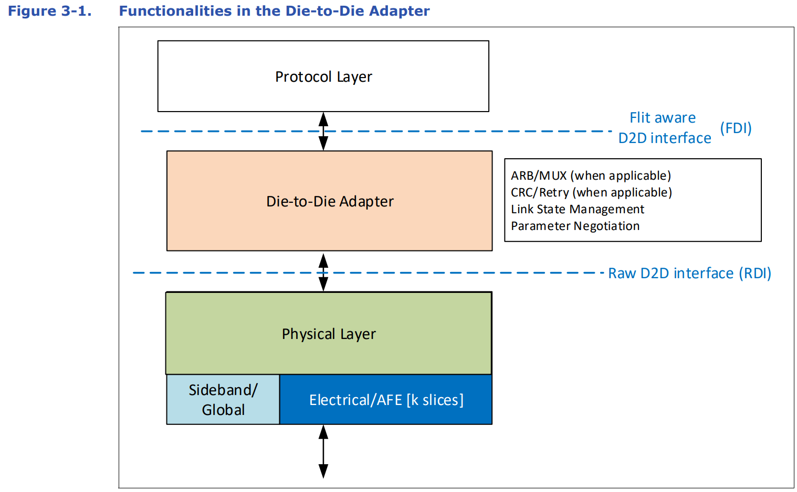

## Chiplet互联协议发展的思考

调研完一系列Chiplet互联协议，我们的普遍感受就是“乱”。一个很明显的划分是基于Intel的PCIe（如UCIe, CCIX）、适配Intel的PCIe（如CXL、CHI-C2C）和不基于PCIe（如NVLink），而且尚无一种协议取得明显的市场标准地位。这反映了当前即使在所谓"Unversal" Chiplet Interconnect express （即UCIe）出来之后，Chiplet互联协议仍然处于混战阶段。Intel主推的基于或适配PCIe的一系列互联协议，在兼容PCIe的通用性上做得很好，但是或多或少为了兼容沉重冗余度极大的PCIe，在延迟、功耗、带宽上牺牲很大。NVLink能在上述指标上轻松beat Intel的一系列互联协议，正是因为NVLink是极专用的内部协议（GPU之间用于AI任务的互联），对可靠性和通用性、兼容性的要求都较PCIe低很多个数量级。

另一方面，我们也看到了这些协议至少在数字电路层面的高度一致性。除NVLink闭源、AIB仅为物理层协议外，其他的几项协议均严格遵循事务层（传输层）、链接层（适配层）、物理层（含逻辑物理层和电气物理层）这样的分层层次，也在打包、流控、校验、链路训练等层面有较高的一致性。

可以预见，支持多协议、高可靠性、高兼容性的通用片间互联总线协议在不久的将来将如当今的PCIe一样发挥基石作用（虽然到时的领导者不一定还是Intel），面向专用场景的高带宽、低延迟、短平快片间互联总线协议也将在特定市场发挥关键性作用。