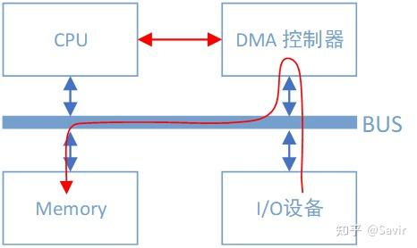

## 什么是DMA

DMA全称为Direct Memory Access，即直接内存访问。意思是外设对内存的读写过程可以不用CPU参与而直接进行。我们先来看一下没有DMA的时候：

无DMA控制器时I/O设备和内存间的数据路径

假设I/O设备为一个普通网卡，为了从内存拿到需要发送的数据，然后组装数据包发送到物理链路上，网卡需要通过总线告知CPU自己的数据请求。然后CPU将会把内存缓冲区中的数据复制到自己内部的寄存器中，再复制到I/O设备的存储空间中。如果数据量比较大，那么很长一段时间内CPU都会忙于搬移数据，而无法投入到其他工作中去。

CPU的最主要工作是计算，而不是进行数据复制，这种工作属于白白浪费了它的计算能力。为了给CPU“减负”，让它投入到更有意义的工作中去，后来人们设计了DMA机制：

有DMA控制器时I/O设备和内存间的数据路径

可以看到总线上又挂了一个DMA控制器，它是专门用来读写内存的设备。有了它以后，当我们的网卡想要从内存中拷贝数据时，除了一些必要的控制命令外，整个数据复制过程都是由DMA控制器完成的。过程跟CPU复制是一样的，只不过这次是把内存中的数据通过总线复制到DMA控制器内部的寄存器中，再复制到I/O设备的存储空间中。CPU除了关注一下这个过程的开始和结束以外，其他时间可以去做其他事情。

DMA控制器一般是和I/O设备在一起的，也就是说一块网卡中既有负责数据收发的模块，也有DMA模块。

## 什么是RDMA

RDMA（ Remote Direct Memory Access ）意为远程直接地址访问，通过RDMA，本端节点可以“直接”访问远端节点的内存。所谓直接，指的是可以像访问本地内存一样，绕过传统以太网复杂的TCP/IP网络协议栈读写远端内存，而这个过程对端是不感知的，而且这个读写过程的大部分工作是由硬件而不是软件完成的。

为了能够直观的理解这一过程，请看下面两个图（图中箭头仅做示意，不表示实际逻辑或物理关系）：

传统网络中，“节点A给节点B发消息”实际上做的是“把节点A内存中的一段数据，通过网络链路搬移到节点B的内存中”，而这一过程无论是发端还是收段，都需要CPU的指挥和控制，包括网卡的控制，中断的处理，报文的封装和解析等等。

上图中左边的节点在内存用户空间中的数据，需要经过CPU拷贝到内核空间的缓冲区中，然后才可以被网卡访问，这期间数据会经过软件实现的TCP/IP协议栈，加上各层头部和校验码，比如TCP头，IP头等。网卡通过DMA拷贝内核中的数据到网卡内部的缓冲区中，进行处理后通过物理链路发送给对端。

对端收到数据后，会进行相反的过程：从网卡内部存储空间，将数据通过DMA拷贝到内存内核空间的缓冲区中，然后CPU会通过TCP/IP协议栈对其进行解析，将数据取出来拷贝到用户空间中。

可以看到，即使有了DMA技术，上述过程还是对CPU有较强的依赖。

而使用了RDMA技术之后，这一过程可以简单的表示成下面的示意图：

同样是把本端内存中的一段数据，复制到对端内存中，在使用了RDMA技术时，两端的CPU几乎不用参与数据传输过程（只参与控制面）。本端的网卡直接从内存的用户空间DMA拷贝数据到内部存储空间，然后硬件进行各层报文的组装后，通过物理链路发送到对端网卡。对端的RDMA网卡收到数据后，剥离各层报文头和校验码，通过DMA将数据直接拷贝到用户空间内存中。

## RDMA的优势

RDMA主要应用在高性能计算（HPC）领域和大型数据中心当中，并且设备相对普通以太网卡要昂贵不少（比如Mellanox公司的Connext-X 5 100Gb PCIe网卡市价在4000元以上）。由于使用场景和价格的原因，RDMA与普通开发者和消费者的距离较远，目前主要是一些大型互联网企业在部署和使用。

RDMA技术为什么可以应用在上述场景中呢？这就涉及到它的以下几个特点：

- 0拷贝：指的是不需要在用户空间和内核空间中来回复制数据。

由于Linux等操作系统将内存划分为用户空间和内核空间，在传统的Socket通信流程中CPU需要多次把数据在内存中来回拷贝。而通过RDMA技术，我们可以直接访问远端已经注册的内存区域。

关于0拷贝可以参考这篇文章：[https://www.jianshu.com/p/e76e3580e356](https://link.zhihu.com/?target=https%3A//www.jianshu.com/p/e76e3580e356)

- 内核Bypass：指的是IO（数据）流程可以绕过内核，即在用户层就可以把数据准备好并通知硬件准备发送和接收。避免了系统调用和上下文切换的开销。

上图（原图[[1\]](https://link.zhihu.com/?target=https%3A//pc.nanog.org/static/published/meetings/NANOG76/1999/20190612_Cardona_Towards_Hyperscale_High_v1.pdf)）可以很好的解释“0拷贝”和“内核Bypass”的含义。上下两部分分别是基于Socket的和基于RDMA的一次收-发流程，左右分别为两个节点。可以明显的看到Socket流程中在软件中多了一次拷贝动作。而RDMA绕过了内核同时也减少了内存拷贝，数据可以直接在用户层和硬件间传递。

- CPU卸载：指的是可以在远端节点CPU不参与通信的情况下（当然要持有访问远端某段内存的“钥匙”才行）对内存进行读写，这实际上是**把报文封装和解析放到硬件中做了**。而传统的以太网通信，双方CPU都必须参与各层报文的解析，如果数据量大且交互频繁，对CPU来讲将是一笔不小的开销，而这些被占用的CPU计算资源本可以做一些更有价值的工作。

通信领域两大出场率最高的性能指标就是“带宽”和“时延”。简单的说，所谓带宽指的是指单位时间内能够传输的数据量，而时延指的是数据从本端发出到被对端接收所耗费的时间。因为上述几个特点，相比于传统以太网，RDMA技术同时做到了更高带宽和更低时延，所以其在带宽敏感的场景——比如海量数据的交互，时延敏感——比如多个计算节点间的数据同步的场景下得以发挥其作用。

## 协议

RDMA本身指的是一种技术，具体协议层面，包含Infiniband（IB），RDMA over Converged Ethernet（RoCE）和internet Wide Area RDMA Protocol（iWARP）。三种协议都符合RDMA标准，使用相同的上层接口，在不同层次上有一些差别。

上图[[2\]](https://link.zhihu.com/?target=https%3A//www.snia.org/sites/default/files/ESF/RoCE-vs.-iWARP-Final.pdf)对于几种常见的RDMA技术的协议层次做了非常清晰的对比，

### Infiniband

2000年由IBTA（InfiniBand Trade Association）提出的IB协议是当之无愧的核心，其规定了一整套完整的链路层到传输层（非传统OSI七层模型的传输层，而是位于其之上）规范，但是其无法兼容现有以太网，除了需要支持IB的网卡之外，企业如果想部署的话还要重新购买配套的交换设备。

### RoCE

RoCE从英文全称就可以看出它是基于以太网链路层的协议，v1版本网络层仍然使用了IB规范，而v2使用了UDP+IP作为网络层，使得数据包也可以被路由。RoCE可以被认为是IB的“低成本解决方案”，将IB的报文封装成以太网包进行收发。由于RoCE v2可以使用以太网的交换设备，所以现在在企业中应用也比较多，但是相同场景下相比IB性能要有一些损失。

### iWARP

iWARP协议是IETF基于TCP提出的，因为TCP是面向连接的可靠协议，这使得iWARP在面对有损网络场景（可以理解为网络环境中可能经常出现丢包）时相比于RoCE v2和IB具有更好的可靠性，在大规模组网时也有明显的优势。但是大量的TCP连接会耗费很多的内存资源，另外TCP复杂的流控等机制会导致性能问题，所以从性能上看iWARP要比UDP的RoCE v2和IB差。

需要注意的是，虽然有软件实现的RoCE和iWARP协议，但是真正商用时上述几种协议都需要专门的硬件（网卡）支持。

iWARP本身不是由Infiniband直接发展而来的，但是它继承了一些Infiniband技术的设计思想。这三种协议的关系如下图所示：

## 玩家

### 标准/生态组织

提到IB协议，就不得不提到两大组织——IBTA和OFA。

### IBTA[[3\]](https://link.zhihu.com/?target=https%3A//www.infinibandta.org/)

成立于1999年，负责制定和维护Infiniband协议标准。IBTA独立于各个厂商，通过赞助技术活动和推动资源共享来将整个行业整合在一起，并且通过线上交流、营销和线下活动等方式积极推广IB和RoCE。

IBTA会对商用的IB和RoCE设备进行协议标准符合性和互操作性测试及认证，由很多大型的IT厂商组成的委员会领导，其主要成员包括博通，HPE，IBM，英特尔，Mellanox和微软等，华为也是IBTA的会员。

### OFA[[4\]](https://link.zhihu.com/?target=https%3A//www.openfabrics.org/)

成立于2004年的非盈利组织，负责开发、测试、认证、支持和分发独立于厂商的开源跨平台infiniband协议栈，2010年开始支持RoCE。其对用于支撑RDMA/Kernel bypass应用的OFED（OpenFabrics Enterprise Distribution）软件栈负责，保证其与主流软硬件的兼容性和易用性。OFED软件栈包括驱动、内核、中间件和API。

上述两个组织是配合关系，IBTA主要负责开发、维护和增强Infiniband协议标准；OFA负责开发和维护Infiniband协议和上层应用API。

### 开发社区

### Linux社区

Linux内核的RDMA子系统还算比较活跃，经常会讨论一些协议细节，对框架的修改比较频繁，另外包括华为和Mellanox在内的一些厂商也会经常对驱动代码进行修改。

邮件订阅：[http://vger.kernel.org/vger-lists.html#linux-rdma](https://link.zhihu.com/?target=http%3A//vger.kernel.org/vger-lists.html%23linux-rdma)

代码位于内核drivers/infiniband/目录下，包括框架核心代码和各厂商的驱动代码。

代码仓：[https://git.kernel.org/pub/scm/linux/kernel/git/rdma/rdma.git/](https://link.zhihu.com/?target=https%3A//git.kernel.org/pub/scm/linux/kernel/git/rdma/rdma.git/)

### RDMA社区

对于上层用户，IB提供了一套与Socket套接字类似的接口——libibverbs，前文所述三种协议都可以使用。参考着协议、API文档和示例程序很容易就可以写一个Demo出来。本专栏中的RDMA社区专指其用户态社区，在github上其仓库的名字为linux-rdma。

主要包含两个子仓库：

- rdma-core

用户态核心代码，API，文档以及各个厂商的用户态驱动。

- perftest

一个功能强大的用于测试RDMA性能的工具。

代码仓：[https://github.com/linux-rdma/](https://link.zhihu.com/?target=https%3A//github.com/linux-rdma/)

### UCX[[5\]](https://link.zhihu.com/?target=https%3A//www.openucx.org/)

UCX是一个建立在RDMA等技术之上的用于数据处理和高性能计算的通信框架，RDMA是其底层核心之一。我们可以将其理解为是位于应用和RDMA API之间的中间件，向上层用户又封装了一层更易开发的接口。

笔者对其并不了解太多，只知道业界有一些企业在基于UCX开发应用。

代码仓：[https://github.com/openucx/ucx](https://link.zhihu.com/?target=https%3A//github.com/openucx/ucx)

### 硬件厂商

设计和生产IB相关硬件的厂商有不少，包括Mellanox、华为、收购了Qlogic的IB技术的Intel，博通、Marvell，富士通等等，这里就不逐个展开了，仅简单提一下Mellanox和华为。

- Mellanox

IB领域的领头羊，协议标准制定、软硬件开发和生态建设都能看到Mellanox的身影，其在社区和标准制定上上拥有最大的话语权。目前最新一代的网卡是支持200Gb/s的ConnextX-6系列。

- 华为

去年初推出的鲲鹏920芯片已经支持100Gb/s的RoCE协议，技术上在国内处于领先地位。但是软硬件和影响力方面距离Mellanox还有比较长的路要走，相信华为能够早日赶上老大哥的步伐。

### 用户

微软、IBM和国内的阿里、京东都正在使用RDMA，另外还有很多大型IT公司在做初步的开发和测试。在数据中心和高性能计算场景下，RDMA代替传统网络是大势所趋。笔者对于市场接触不多，所以并不能提供更详细的应用情况。

下一篇将用比较直观的方式比较一次典型的基于Socket的传统以太网和RDMA通信过程。

# blog-比较基于传统以太网和RDMA技术的通信

本篇的目的是通过对比一次典型的基于TCP/IP协议栈的以太网和RDMA通信的过程，直观的展示RDMA技术相比传统以太网的优势，尽量不涉及协议和软件实现细节。

假设本端的某个应用想把自己内存中的数据复制到对端某个应用可以访问的内存中（或者通俗的讲，本端要给对端发送数据），我们来看一下以太网和RDMA的SEND-RECV语义都做了哪些操作。

## 传统以太网

在描述通信过程时的软硬件关系时，我们通常将模型划分为用户层Userspace，内核Kernel以及硬件Hardware。Userspace和Kernel实际上使用的是同一块物理内存，但是处于安全考虑，Linux将内存划分为用户空间和内核空间。用户层没有权限访问和修改内核空间的内存内容，只能通过系统调用陷入内核态，Linux的内存管理机制比较复杂，本文不展开讨论。

一次典型的基于传统以太网的通信过程的可以如下图所示进行分层：

一次收-发过程的步骤如下：

1. 发送端和接收端通过Socket库提供的接口建立链接（就是在两个节点间建立了一条逻辑上的道路，数据可以沿这条道路从一端发送到另一端）并分别在内存中申请好发送和接收Buffer。
2. 发送端APP通过Socket接口陷入内核态，待发送数据经过TCP/IP协议栈的一层层封装，最后被CPU复制到Socket Buffer中。
3. 发送端通过网卡驱动，告知网卡可以发送数据了，网卡将通过DMA从Buffer中复制封装好的数据包到内部缓存中，然后将其发送到物理链路。
4. 接收端网卡收到数据包后，将数据包放到接收Buffer中，然后CPU将通过内核中的TCP/IP协议栈对报文进行层层解析，取出有效的数据。
5. 接收端APP通过Socket接口陷入内核态，CPU将数据从内核空间复制到用户空间。

这个模型的数据流向大致是像上图这个样子，数据首先需要从用户空间复制一份到内核空间，这一次复制由CPU完成，将数据块从用户空间复制到内核空间的Socket Buffer中。内核中软件TCP/IP协议栈给数据添加各层头部和校验信息。最后网卡会通过DMA从内存中复制数据，并通过物理链路发送给对端的网卡。

而对端是完全相反的过程：硬件将数据包DMA拷贝到内存中，然后CPU会对数据包进行逐层解析和校验，最后将数据复制到用户空间。

上述过程中的关键点是需要CPU参与的把数据从用户空间拷贝到内核空间，以及同样需要CPU全程参与的数据包组装和解析，数据量大的情况下，这将对CPU将造成很大的负担。

下面我们看一下RDMA是如何将CPU“解放”出来的。

## RDMA

同样是一端发送，一端接收的场景，我们将RDMA的分层模型分成两部分“控制通路”和“数据通路”，控制通路需要进入内核态准备通信所需的内存资源，而数据通路指的是实际数据交互过程中的流程。这一过程的分层关系如下图所示：

同Socket一样，我们简单描述下通信的过程：

1. 发送端和接收端分别通过控制通路陷入内核态创建好通信所需要的内存资源。
2. 在数据通路上，接收端APP通知硬件准备接收数据，告诉硬件将接收到的数据放在哪片内存中。
3. 在数据通路上，发送端APP通知硬件发送数据，告诉硬件待发送数据位于哪片内存中。
4. 发送端RDMA网卡从内存中搬移数据，组装报文发送给对端。
5. 对端收到报文，对其进行解析并通过DMA将有效载荷写入内存。然后以某种方式通知上层APP，告知其数据已接收并妥善存放到指定位置。

这一过程中的数据流向大致如上图所示。通过和Socket的对比，我们可以明显看到，**数据收发绕过了内核并且数据交换过程并不需要CPU参与，报文的组装和解析是由硬件完成的**。

通过上面的对比，我们可以明显的体会到RDMA的优势，既将CPU从数据包封装和解析中解放出来，又减少了CPU拷贝数据的功率和时间损耗。需要注意的是，本文只描述了SEND-RECV流程，而RDMA技术所独有的，效率更高的WRITE/READ语义将在后续文章中介绍。

# blog-RDMA基本元素

RDMA技术中经常使用缩略语，很容易让刚接触的人一头雾水，本篇的目的是讲解RDMA中最基本的元素及其含义。

我将常见的缩略语对照表写在前面，阅读的时候如果忘记了可以翻到前面查阅。

## WQ

Work Queue简称WQ，是RDMA技术中最重要的概念之一。WQ是一个储存工作请求的队列，为了讲清楚WQ是什么，我们先介绍这个队列中的元素WQE（Work Queue Element，工作队列元素）。

### WQE

WQE可以认为是一种“任务说明”，这个工作请求是软件下发给硬件的，这份说明中包含了软件所希望硬件去做的任务以及有关这个任务的详细信息。比如，某一份任务是这样的：“我想把位于地址0x12345678的长度为10字节的数据发送给对面的节点”，硬件接到任务之后，就会通过DMA去内存中取数据，组装数据包，然后发送。

WQE的含义应该比较明确了，那么我们最开始提到的WQ是什么呢？它就是用来存放“任务书”的“文件夹”，WQ里面可以容纳很多WQE。有数据结构基础的读者应该都了解，队列是一种先进先出的数据结构，在计算机系统中非常常见，我们可以用下图表示上文中描述的WQ和WQE的关系：

WQ这个队列总是由软件向其中增加WQE（入队），硬件从中取出WQE，这就是软件给硬件“下发任务”的过程。为什么用队列而不是栈？因为进行“存”和“取“操作的分别是软件和硬件，并且需要保证用户的请求按照顺序被处理在RDMA技术中，所有的通信请求都要按照上图这种方式告知硬件，这种方式常被称为“Post”。

### QP

Queue Pair简称QP，就是“一对”WQ的意思。

### SQ和RQ

任何通信过程都要有收发两端，QP就是一个发送工作队列和一个接受工作队列的组合，这两个队列分别称为SQ（Send Queue）和RQ（Receive Queue）。我们再把上面的图丰富一下，左边是发送端，右边是接收端：

WQ怎么不见了？SQ和RQ都是WQ，WQ只是表示一种可以存储WQE的单元，SQ和RQ才是实例。

SQ专门用来存放发送任务，RQ专门用来存放接收任务。在一次SEND-RECV流程中，发送端需要把表示一次发送任务的WQE放到SQ里面。同样的，接收端软件需要给硬件下发一个表示接收任务的WQE，这样硬件才知道收到数据之后放到内存中的哪个位置。上文我们提到的Post操作，对于SQ来说称为Post Send，对于RQ来说称为Post Receive。

需要注意的是，在RDMA技术中**通信的基本单元是QP**，而不是节点。如下图所示，对于每个节点来说，每个进程都可以使用若干个QP，而每个本地QP可以“关联”一个远端的QP。我们用“节点A给节点B发送数据”并不足以完整的描述一次RDMA通信，而应该是类似于“节点A上的QP3给节点C上的QP4发送数据”。

每个节点的每个QP都有一个唯一的编号，称为QPN（Queue Pair Number），通过QPN可以唯一确定一个节点上的QP。

### SRQ

Shared Receive Queue简称SRQ，意为共享接收队列。概念很好理解，就是一种几个QP共享同一个RQ时，我们称其为SRQ。以后我们会了解到，使用RQ的情况要远远小于使用SQ，而每个队列都是要消耗内存资源的。当我们需要使用大量的QP时，可以通过SRQ来节省内存。如下图所示，QP2~QP4一起使用同一个RQ：

## CQ

Completion Queue简称CQ，意为完成队列。跟WQ一样，我们先介绍CQ这个队列当中的元素——CQE（Completion Queue Element）。可以认为CQE跟WQE是相反的概念，如果WQE是软件下发给硬件的“任务书”的话，那么CQE就是硬件完成任务之后返回给软件的“任务报告”。CQE中描述了某个任务是被正确无误的执行，还是遇到了错误，如果遇到了错误，那么错误的原因是什么。

而CQ就是承载CQE的容器——一个先进先出的队列。我们把表示WQ和WQE关系的图倒过来画，就得到了CQ和CQE的关系：

每个CQE都包含某个WQE的完成信息，他们的关系如下图所示：

下面我们把CQ和WQ（QP）放在一起，看一下一次SEND-RECV操作中，软硬件的互动（图中序号顺序不表示实际时序）：

> 2022/5/23：下图及后面的列表顺序有修改，将原来第2条的“接收端硬件从RQ中拿到任务书，准备接收数据”移动到“接收端收到数据，进行校验后回复ACK报文给发送端”之后，并且修改了描述，现在为第6条。
>
> 这里我犯了错误的点是RQ和SQ不同，是一个“被动接收”的过程，只有收到Send报文（或者带立即数的Write报文）时硬件才会消耗RQ WQE。感谢
>
>  
>
> [@连接改变世界](https://www.zhihu.com/people/67ff85d690d09e9f6741c579512fe9a9)
>
>  
>
> 的指正。

1. 接收端APP以WQE的形式下发一次RECV任务到RQ。
2. 发送端APP以WQE的形式下发一次SEND任务到SQ。
3. 发送端硬件从SQ中拿到任务书，从内存中拿到待发送数据，组装数据包。
4. 发送端网卡将数据包通过物理链路发送给接收端网卡。
5. 接收端收到数据，进行校验后回复ACK报文给发送端。
6. 接收端硬件从RQ中取出一个任务书（WQE）。
7. 接收端硬件将数据放到WQE中指定的位置，然后生成“任务报告”CQE，放置到CQ中。
8. 接收端APP取得任务完成信息。
9. 发送端网卡收到ACK后，生成CQE，放置到CQ中。
10. 发送端APP取得任务完成信息。

**NOTE: 需要注意的一点是，上图中的例子是可靠服务类型的交互流程，如果是不可靠服务，那么不会有步骤5的ACK回复，而且步骤9以及之后的步骤会在步骤5之后立即触发。关于服务类型以及可靠与不可靠，我们将在[《RDMA基本服务类型》](https://zhuanlan.zhihu.com/p/144099636)一文中讲解。**

至此，通过WQ和CQ这两种媒介，两端软硬件共同完成了一次收发过程。

## WR和WC

说完了几个Queue之后，其实还有两个文章开头提到的概念没有解释，那就是WR和WC（不是Water Closet的缩写）。

WR全称为Work Request，意为工作请求；WC全称Work Completion，意为工作完成。这两者其实是WQE和CQE在用户层的“映射”。因为APP是通过调用协议栈接口来完成RDMA通信的，WQE和CQE本身并不对用户可见，是驱动中的概念。用户真正通过API下发的是WR，收到的是WC。

WR/WC和WQE/CQE是相同的概念在不同层次的实体，他们都是“任务书”和“任务报告”。于是我们把前文的两个图又加了点内容：

## 总结

好了，我们用IB协议[1]3.2.1中的Figure 11这张图总结一下本篇文章的内容：

用户态的WR，由驱动转化成了WQE填写到了WQ中，WQ可以是负责发送的SQ，也可以是负责接收的RQ。硬件会从各个WQ中取出WQE，并根据WQE中的要求完成发送或者接收任务。任务完成后，会给这个任务生成一个CQE填写到CQ中。驱动会从CQ中取出CQE，并转换成WC返回给用户。

基础概念就介绍到这里，下一篇将介绍RDMA的几种常见操作类型。

# blog-RDMA操作类型

前面几篇涉及RDMA的通信流程时一直在讲SEND-RECV，然而它其实称不上是“**RDMA**”，只是一种加入了0拷贝和协议栈卸载的传统收发模型的“升级版”，这种操作类型没有完全发挥RDMA技术全部实力，常用于两端交换控制信息等场景。当涉及大量数据的收发时，更多使用的是两种RDMA独有的操作：WRITE和READ。

我们先来复习下双端操作——SEND和RECV，然后再对比介绍单端操作——WRITE和READ。

## SEND & RECV

SEND和RECV是两种不同的操作类型，但是因为如果一端进行SEND操作，对端必须进行RECV操作，所以通常都把他们放到一起描述。

为什么称之为“双端操作”？因为**完成一次通信过程需要两端CPU的参与**，并且收端需要提前显式的下发WQE。下图是一次SEND-RECV操作的过程示意图。原图来自于[1]，我做了一些修改。

上一篇我们讲过，上层应用通过WQE（WR）来给硬件下任务。在SEND-RECV操作中，不止发送端需要下发WQE，接收端也需要下发WQE来告诉硬件收到的数据需要放到哪个地址。发送端并不知道发送的数据会放到哪里，每次发送数据，接收端都要提前准备好接收Buffer，而接收端CPU自然会感知这一过程。

为了下文对比SEND/RECV与WRITE/READ的异同，我们将上一篇的SEND-RECV流程中补充内存读写这一环节，即下图中的步骤④——发送端硬件根据WQE从内存中取出数据封装成可在链路上传输数据包和步骤⑦——接收端硬件将数据包解析后根据WQE将数据放到指定内存区域，其他步骤不再赘述。另外再次强调一下，收发端的步骤未必是图中这个顺序，比如步骤⑧⑪⑫和步骤⑨⑩的先后顺序就是不一定的。

下面将介绍WRITE操作，对比之后相信大家可以理解的更好。

## WRITE

WRITE全称是RDMA WRITE操作，是本端主动写入远端内存的行为，除了准备阶段，远端CPU不需要参与，也不感知何时有数据写入、数据在何时接收完毕。所以这是一种单端操作。

通过下图我们对比一下WRITE和SEND-RECV操作的差异，本端在准备阶段通过数据交互，获取了对端某一片可用的内存的**地址**和“**钥匙**”，相当于获得了这片远端内存的读写权限。拿到权限之后，本端就可以像访问自己的内存一样**直接对这一远端内存区域进行读写**，这也是RDMA——远程直接地址访问的内涵所在。

WRITE/READ操作中的目的地址和钥匙是如何获取的呢？通常可以通过我们刚刚讲过的SEND-RECV操作来完成，因为拿到钥匙这个过程总归是要由远端内存的控制者——CPU允许的。虽然准备工作还比较复杂， 但是一旦完成准备工作，RDMA就可以发挥其优势，对大量数据进行读写。一旦远端的CPU把内存授权给本端使用，它便不再会参与数据收发的过程，这就解放了远端CPU，也降低了通信的时延。

需要注意的是，本端是通过**虚拟地址**来读写远端内存的，上层应用可以非常方便的对其进行操作。实际的虚拟地址—物理地址的转换是由RDMA网卡完成的。具体是如何转换的，将在后面的文章介绍。

忽略准备阶段key和addr的获取过程，下面我们描述一次WRITE操作的流程，此后我们不再将本端和对端称为“发送”和“接收”端，而是改为“请求”和“响应”端，这样对于描述WRITE和READ操作都更恰当一些，也不容易产生歧义。

1. 请求端APP以WQE（WR）的形式下发一次WRITE任务。
2. 请求端硬件从SQ中取出WQE，解析信息。
3. 请求端网卡根据WQE中的虚拟地址，转换得到物理地址，然后从内存中拿到待发送数据，组装数据包。
4. 请求端网卡将数据包通过物理链路发送给响应端网卡。
5. 响应端收到数据包，解析目的虚拟地址，转换成本地物理地址，解析数据，将数据放置到指定内存区域。
6. 响应端回复ACK报文给请求端。
7. 请求端网卡收到ACK后，生成CQE，放置到CQ中。
8. 请求端APP取得任务完成信息。

> 注：严谨地说，第6步回复ACK之时，RDMA网卡只能保证数据包中的Payload已经被”暂存“了下来，但不能保证一定已经把数据放到目的内存里面了。不过这一点不影响我们对整理流程的理解，感谢
>
>  
>
> [@nekomii](https://www.zhihu.com/people/2869fde15e811365968aa4e6b80c077b)
>
>  
>
> 同学的提醒。
>
> IB Spec. 9.7.5.1.6 ACKNOWLEDGE MESSAGE SCHEDULING原文：”For SEND or RDMA WRITE requests, an ACK may be scheduled before data is actually written into the responder’s memory. The ACK simply indicates that the data has successfully reached the fault domain of the responding node. That is, the data has been received by the channel adapter and the channel adapter will write that data to the memory system of the responding node, or the responding application will at least be informed of the failure.“

## READ

顾名思义，READ跟WRITE是相反的过程，是本端主动读取远端内存的行为。同WRITE一样，远端CPU不需要参与，也不感知数据在内存中被读取的过程。

获取key和虚拟地址的流程也跟WRITE没有区别，需要注意的是**“读”这个动作所请求的数据，是在对端回复的报文中携带的**。

下面描述一次READ操作的流程，注意跟WRITE只是方向和步骤顺序的差别。

1. 请求端APP以WQE的形式下发一次READ任务。
2. 请求端网卡从SQ中取出WQE，解析信息。
3. 请求端网卡将READ请求包通过物理链路发送给响应端网卡。
4. 响应端收到数据包，解析目的虚拟地址，转换成本地物理地址，解析数据，从指定内存区域取出数据。
5. 响应端硬件将数据组装成回复数据包发送到物理链路。
6. 请求端硬件收到数据包，解析提取出数据后放到READ WQE指定的内存区域中。
7. 请求端网卡生成CQE，放置到CQ中。
8. 请求端APP取得任务完成信息。

### 总结

我们忽略各种细节进行抽象，RDMA WRITE和READ操作就是在利用网卡完成下面左图的内存拷贝操作而已，只不过复制的过程是由RDMA网卡通过网络链路完成的；而本地内存拷贝则如下面右图所示由CPU通过总线完成的：

RDMA标准定义上述几种操作的时候使用的单词是非常贴切的，“收”和“发”是需要有对端主动参与的语义 ，而‘读“和”写“更像是本端对一个没有主动性的对端进行操作的语义。

通过对比SEND/RECV和WRITE/READ操作，我们可以发现传输数据时不需要响应端CPU参与的WRITE/READ有更大的优势，缺点就是请求端需要在准备阶段获得响应端的一段内存的读写权限。但是实际数据传输时，这个准备阶段的功率和时间损耗都是可以忽略不计的，所以RDMA WRITE/READ才是大量传输数据时所应用的操作类型，SEND/RECV通常只是用来传输一些控制信息。

除了本文介绍的几种操作之外，还有ATOMIC等更复杂一些的操作类型，将在后面的协议解读部分详细分析。本篇就到这里，下一篇将介绍RDMA 基本服务类型。

# blog-RDMA基本服务类型

我们在“3. RDMA基本元素”一文中提到过，**RDMA的基本通信单元是QP**，而基于QP的通信模型有很多种，我们在RDMA领域称其为“服务类型”。IB协议中通过“可靠”和“连接”两个维度来描述一种服务类型。

## 可靠

通信中的可靠性指的是通过一些机制保证发出去的数据包都能够被正常接收。IB协议中是这样描述可靠服务的：

> **Reliable Service** provides a guarantee that messages are delivered from a requester to a responder at most once, in order and without corruption.

即“可靠服务在发送和接受者之间保证了信息最多只会传递一次，并且能够保证其按照发送顺序完整的被接收”。

IB通过以下三个机制来保证可靠性：

### 应答机制

假设A给B发了一个数据包，A怎样才能知道B收到了呢，自然是B回复一个“我收到了”消息给A。在通信领域我们一般称这个回复为应答包或者ACK（Acknowledge）。在IB协议的可靠服务类型中，使用了应答机制来保证数据包被对方收到。IB的可靠服务类型中，接收方不是每一个包都必须回复，也可以一次回复多个包的ACK，以后我们再展开讨论。

### 数据校验机制

这个比较好理解，发端会对Header和Payload（有效载荷，也就是真正要收发的数据）通过一定的算法得到一个校验值放到数据包的末尾。对端收到数据包后，也会用相同的算法计算出校验值，然后与数据包中的校验值比对，如果不一致，说明数据中包含错误（一般是链路问题导致的），那么接收端就会丢弃这个数据包。IB协议使用的CRC校验，本文对CRC不做展开介绍。

### 保序机制

保序指的是，保证先被发送到物理链路上的数据包一定要先于后发送的数据包被接收方收到。有一些业务对数据包的先后顺序是有严格要求的，比如语音或者视频。IB协议中有PSN（Packet Sequence Number，包序号）的概念，即每个包都有一个递增的编号。PSN可以用来检测是否丢包，比如收端收到了1，但是在没收到2的情况下就收到了3，那么其就会认为传输过程中发生了错误，之后会回复一个NAK给发端，让其重发丢失的包。

不可靠服务，没有上述这些机制来保证数据包被正确的接收，属于“发出去就行，我不关心有没有被收到”的服务类型。

## 连接与数据报

**连接（Connection）**在这里指的是一个抽象的逻辑概念，需要区别于物理连接，熟悉Socket的读者一定对这个其不陌生。连接是一条通信的“管道”，一旦管道建立好了，管道这端发出的数据一定会沿着这条管道到达另一端。

对于“连接”或者说“面向连接”的定义有很多种，有的侧重于保证消息顺序，有的侧重于消息的传递路径唯一，有的强调需要软硬件开销来维护连接，有的还和可靠性的概念有交集。本专栏既然是介绍RDMA技术，那么我们就看一下IB协议3.2.2节中对其的描述：

> IBA supports both connection oriented and datagram service. For connected service, each QP is associated with exactly one remote consumer. In this case the QP context is configured with the identity of the remote consumer’s queue pair. ... During the communication establishment process, this and other information is exchanged between the two nodes.

即“IBA支持基于连接和数据报的服务。对于基于连接的服务来说，每个QP都和另一个远端节点相关联。在这种情况下，QP Context中包含有远端节点的QP信息。在建立通信的过程中，两个节点会交换包括稍后用于通信的QP在内的对端信息"。

上面这端描述中的Context一般被翻译成上下文，QP Context（简称QPC）可以简单理解为是记录一个QP相关信息的表格。我们知道QP是两个队列，除了这两个队列之外，我们还需要把关于QP的信息记录到一张表里面，这些信息可能包括队列的深度，队列的编号等等，后面我们会展开讲。

可能还是有点抽象，我们用图说话：

A、B和A、C节点的网卡在物理上是连接在一起的，A上面的QP2和B上面的QP7、A上面的QP4和B上面的QP2建立了逻辑上的连接，或者说“绑定到了一起”。**在连接服务类型中的每个QP，都和唯一的另一个QP建立了连接，也就是说QP下发的每个WQE的目的地都是唯一的**。拿上图来说，对于A的QP2下发的每个WQE，硬件都可以通过QPC得知其目的为B的QP7，就会把组装好的数据包发送给B，然后B会根据QP7下发的RQ WQE来存放数据；同理，对于A的QP4下发的每个WQE，A的硬件都知道应该把数据发给Node C的QP2。

“连接”是如何维护的呢？其实就是在QPC里面的一个记录而已。如果A的QP2想断开与B的QP7的“连接”然后与其他QP相“连接”，只需要修改QPC就可以了。两个节点在建立连接的过程中，会交换稍后用于数据交互的QP Number，然后分别记录在QPC中。

**数据报（Datagram）**与连接相反，发端和收端间不需要“建立管道”的步骤，只要发端到收端物理上是可以到达的，那么我就可能从任何路径发给任意的收端节点。IB协议对其的定义是这样的：

> For datagram service, a QP is not tied to a single remote consumer, but rather information in the WQE identifies the destination. A communication setup process similar to the connection setup process needs to occur with each destination to exchange that information.
> 即“对于数据报服务来说，QP不会跟一个唯一的远端节点绑定，而是通过WQE来指定目的节点。和连接类型的服务一样，建立通信的过程也需要两端交换对端信息，但是数据报服务对于每个目的节点都需要执行一次这个交换过程。”

我们举个例子：

在数据报类型的QP的Context中，不包含对端信息，即每个QP不跟另一个QP绑定。**QP下发给硬件的每个WQE都可能指向不同的目的地**。比如节点A的QP2下发的第一个WQE，指示给节点C的QP3发数据；而下一个WQE，可以指示硬件发给节点B的QP7。

与连接服务类型一样，本端QP可以和哪个对端QP发送数据，是在准备阶段提前通过某些方式相互告知的。这也是上文“数据报服务对于每个目的节点都需要执行一次这个交换过程”的含义。

### 服务类型

上面介绍的两个维度两两组合就形成了IB的四种基本服务类型：

RC和UD是应用最多也是最基础的两种服务类型，我们可以将他们分别类比成TCP/IP协议栈传输层的TCP和UDP。

RC用于对数据完整性和可靠性要求较高的场景，跟TCP一样，因为需要各种机制来保证可靠，所以开销自然会大一些。另外由于RC服务类型和每个节点间需要各自维护一个QP，假设有N个节点要相互通信，那么至少需要**N \* (N - 1)**个QP，而QP和QPC本身是需要占用网卡资源或者内存的，当节点数很多时，存储资源消耗将会非常大。

UD硬件开销小并且节省存储资源，比如N个节点需要相互通信，只需要创建**N**个QP就可以了，但是可靠性跟UDP一样没法保证。用户如果想基于UD服务类型实现可靠性，那么需要自己基于IB传输层实现应用层的可靠传输机制。

除此之外，还有RD和UC类型，以及XRC（Extended Reliable Connection），SRD（Scalable Reliable Datagram）等更复杂的服务类型，我们将在协议解析部分对其进行详细的描述。

更多关于QP类型选择的信息可以参考RDMAmojo上的[Which Queue Pair type to use?](https://link.zhihu.com/?target=https%3A//www.rdmamojo.com/2013/06/01/which-queue-pair-type-to-use/)这篇文章，感谢 

[@sinkinben](https://www.zhihu.com/people/fc04fe143ad43b66fabb7050dadef923)

 同学在评论区指路。

# blog-RDMA之Memory Region

我们假设一种场景，同时也顺便温习一下RDMA WRITE操作的流程：

如下图所示，A节点想要通过IB协议向B节点的内存中写入一段数据，上层应用给本节点的RDMA网卡下发了一个WQE，WQE中包含了源内存地址、目的内存地址、数据长度和秘钥等信息，然后硬件会从内存中取出数据，组包发送到对端网卡。B节点的网卡收到数据后，解析到其中的目的内存地址，把数据写入到本节点的内存中。

那么问题来了，APP提供的地址都是虚拟地址（Virtual Address，下文称VA），经过MMU的转换才能得到真实的物理地址（Physical Address，下文称PA），我们的**RDMA网卡是如何得到PA从而去内存中拿到数据的呢**？就算网卡知道上哪去取数据，**如果用户恶意指定了一个非法的VA，那网卡岂不是有可能被“指使”去读写关键内存**？

为了解决上面的问题，IB协议提出了MR的概念。

## MR是什么

MR全称为Memory Region，指的是由RDMA软件层在内存中规划出的一片区域，用于存放收发的数据。IB协议中，用户在申请完用于存放数据的内存区域之后，都需要通过调用IB框架提供的API注册MR，才能让RDMA网卡访问这片内存区域。由下图可以看到，MR就是一片特殊的内存而已：

在对IB协议进行相关描述时，我们通常称RDMA硬件为**HCA（Host Channel Adapter， 宿主通道适配器）**，IB协议中对其的定义是“处理器和I/O单元中能够产生和消耗数据包的IB设备”，为了与协议保持一致，我们在包括本文及之后的文章中都称硬件部分为HCA。

## 为什么要注册MR

下面我们来看一下MR是如何解决本文开篇提出的两个问题的：

### 1. 注册MR以实现虚拟地址与物理地址转换

我们都知道APP只能看到虚拟地址，而且会在WQE中直接把VA传递给HCA（既包括本端的源VA，也包括对端的目的VA）。现在的CPU都有MMU和页表这一“利器”来进行VA和PA之间的转换，而HCA要么直接连接到总线上，要么通过IOMMU/SMMU做地址转换后连接到总线上，它是“看不懂”APP提供的VA所对应的真实物理内存地址的。

所以注册MR的过程中，硬件会在内存中创建并填写一个VA to PA的映射表，这样需要的时候就能通过查表把VA转换成PA了。我们还是提供一个具体的例子来讲一下这个过程：

现在假设左边的节点向右边的节点发起了RDMA WRITE操作，即直接向右节点的内存区域中写入数据。假设图中两端都已经完成了注册MR的动作，MR即对应图中的“数据Buffer”，同时也创建好了VA->PA的映射表。

- 首先本端APP会下发一个WQE给HCA，告知HCA，用于存放待发送数据的本地Buffer的虚拟地址，以及即将写入的对端数据Buffer的虚拟地址。
- 本端HCA查询VA->PA映射表，得知待发数据的物理地址，然后从内存中拿到数据，组装数据包并发送出去。
- 对端HCA收到了数据包，从中解析出了目的VA。
- 对端HCA通过存储在本地内存中的VA->PA映射表，查到真实的物理地址，核对权限无误后，将数据存放到内存中。

再次强调一下，对于右侧节点来说，**无论是地址转换还是写入内存，完全不用其CPU的参与**。

### 2. MR可以控制HCA访问内存的权限

因为HCA访问的内存地址来自于用户，如果用户传入了一个非法的地址（比如系统内存或者其他进程使用的内存），HCA对其进行读写可能造成信息泄露或者内存覆盖。所以我们需要一种机制来确保HCA只能访问已被授权的、安全的内存地址。IB协议中，APP在为数据交互做准备的阶段，需要执行注册MR的动作。

而用户注册MR的动作会产生两把钥匙——L_KEY（Local Key）和R_KEY（Remote Key），说是钥匙，它们的实体其实就是一串序列而已。它们将分别用于保障对于本端和远端内存区域的访问权限。下面两张图分别是描述L_Key和R_Key的作用的示意图：

L_Key

R_Key

这里大家可能会有疑问，本端是如何知道对端节点的可用VA和对应的R_Key的？其实两端的节点在真正的RDMA通信之前，都会通过某些方式先建立一条链路（可能是Socket连接，也可能是CM连接）并通过这条链路交换一些RDMA通信所必须的信息（VA，Key，QPN等），我们称这一过程叫做“建链”和“握手”。我将在后面的文章中详细介绍。

除了上面两个点之外，注册MR还有个重要的作用：

### 3. MR可以避免换页

因为物理内存是有限的，所以操作系统通过换页机制来暂时把某个进程不用的内存内容保存到硬盘中。当该进程需要使用时，再通过缺页中断把硬盘中的内容搬移回内存，这一过程几乎必然导致VA-PA的映射关系发生改变。

由于HCA经常会绕过CPU对用户提供的VA所指向的物理内存区域进行读写，如果前后的VA-PA映射关系发生改变，那么我们在前文提到的VA->PA映射表将失去意义，HCA将无法找到正确的物理地址。

为了防止换页所导致的VA-PA映射关系发生改变，注册MR时会"Pin"住这块内存（亦称“锁页”），即锁定VA-PA的映射关系。也就是说，MR这块内存区域会长期存在于物理内存中不被换页，直到完成通信之后，用户主动注销这片MR。

好了，至此我们介绍完了MR的概念和作用，下一篇文章我将给大家介绍一下PD（Protection Domain，保护域）的概念。

# blog-RDMA之Protection Domain

前文我们简单介绍了RDMA中最常见的一些资源，包括各种Queue，以及MR的概念等等。MR用于控制和管理HCA对于本端和远端内存的访问权限，确保HCA只有拿到正确Key之后才能读写用户已经注册了的内存区域。为了更好的保障安全性，IB协议又提出了Protection Domain（PD）的概念，用于保证RDMA资源间的相互隔离，本文就介绍一下PD的概念。

## PD是什么

PD全称是Protection Domain，意为"保护域"。域的概念我们经常见到，从数学上的“实数域”、“复数域”，到地理上的“空域”、“海域”等等，表示一个空间/范围。在RDMA中，PD像是一个容纳了各种资源（QP、MR等）的“容器”，将这些资源纳入自己的保护范围内，避免他们被未经授权的访问。一个节点中可以定义多个保护域，各个PD所容纳的资源彼此隔离，无法一起使用。

概念还是有些抽象，下面我们来看一下PD有什么作用，具体解决了什么问题。

## PD的作用

一个用户可能创建多个QP和多个MR，每个QP可能和不同的远端QP建立了连接，比如下图这样（灰色箭头表示QP间的连接关系）：

图1 没有PD概念时的RDMA资源

由于MR和QP之间并没有绑定关系，这就意味着一旦某个远端的QP与本端的一个QP建立了连接，具备了通信的条件，那么理论上远端节点只要知道VA和R_key（甚至可以靠不断的猜测直到得到一对有效的值），就可以访问本端节点某个MR的内容。

其实一般情况下，MR的虚拟地址VA和秘钥R_Key是很难猜到的，已经可以保证一定的安全性了。但是为了更好的保护内存中的数据，把各种资源的权限做进一步的隔离和划分，我们在又在每个节点中定义了PD，如下图所示：

图2 加入PD概念时的RDMA资源

图中Node 0上有两个PD，将3个QP和2个MR分为了两组，此外Node 1和Node 2中各有一个PD包含了所有QP和MR。Node 0上的两个PD中的资源不可以一起使用，也就是说QP3和QP9不能访问MR1的数据，QP6也不可以访问MR0的数据。如果我们在数据收发时，指定硬件使用QP3和MR1，那么硬件校验他们不属于同一个PD后，会返回错误。

对于远端节点来说，Node1只能通过QP8相连的QP3来访问Node0的内存，但是因为Node 0的QP3被“圈”到了PD0这个保护域中，所以Node 1的QP8也只能访问MR0对应的内存，**无论如何都无法访问MR1中的数据**，这是从两个方面限制的：

1. Node 1的QP8只跟Node 0的QP3有连接关系，无法通过Node 0的QP6进行内存访问。
2. Node 0的MR1和QP3属于不同的PD，就算Node 1的QP8拿到了MR1的VA和R_key，硬件也会因为PD不同而拒绝提供服务。

所以就如本文一开始所说的，PD就像是一个容器，将一些RDMA资源保护起来，彼此隔离，以提高安全性。其实RDMA中不止有QP、MR这些资源，后文即将介绍的Address Handle，Memory Window等也是由PD进行隔离保护的。

## 如何使用PD

还是看上面的图，我们注意到Node 0为了隔离资源，存在两个PD；而Node 1和Node 2只有一个PD包含了所有资源。

我之所以这样画，是为了说明一个节点上划分多少个PD完全是由用户决定的，**如果想提高安全性，那么对每个连接到远端节点的QP和供远端访问的MR都应该尽量通过划分PD做到隔离；如果不追求更高的安全性，那么创建一个PD，囊括所有的资源也是可以的**。

IB协议中规定：**每个节点都至少要有一个PD，每个QP都必须属于一个PD，每个MR也必须属于一个PD。**

那么PD的包含关系在软件上是如何体现的呢？它本身是有一个软件实体的（结构体），记录了这个保护域的一些信息。用户在创建QP和MR等资源之前，必须先通过IB框架的接口创建一个PD，拿到它的指针/句柄。接下来在创建QP和MR的时候，需要传入这个PD的指针/句柄，PD信息就会包含在QP和MR中。硬件收发包时，会对QP和MR的PD进行校验。更多的软件协议栈的内容，我会在后面的文章中介绍。

另外需要强调的是，**PD是本地概念，仅存在于节点内部**，对其他节点是不可见的；而MR是对本端和对端都可见的。

为了方便大家查阅和学习，以后我会列出文章涉及的协议章节，前面的内容有时间的时候我也会补充一下。

## PD相关协议章节

- 3.5.5 PD的基本概念和作用
- 10.2.3 介绍了PD和其他一些RDMA资源的关系，以及PD相关的软件接口。
- 10.6.3.5 再次强调PD和MR及QP的关系。
- 11.2.1.5 详细介绍PD的Verbs接口，包括作用、入参、出参和返回值等。

好了，关于PD的介绍就到这里。下文我会介绍用于UD服务类型的Address Handle的概念。

后续仅附目录链接

[0. 《RDMA杂谈》专栏索引 - 知乎](https://zhuanlan.zhihu.com/p/164908617)