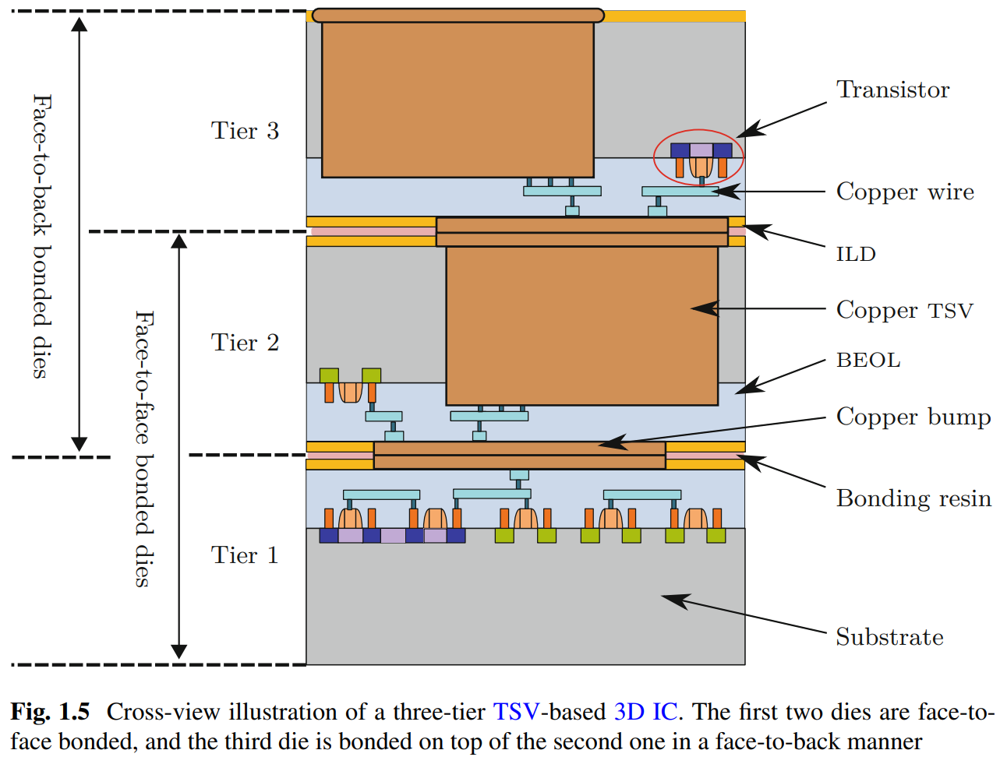

# Wire Bonding, Flip Chip Bonding, Microbump

Wire Bonding: 用金属引线将芯片和PCB连接起来

Flip Chip Bonding（覆晶键合）: 在芯片上连接焊锡凸块（Solder Bump）（Micro-bump），然后将芯片翻转过来使凸块和衬底（substrate）直接连结。

# Wire-Bonding-Based 3D IC VS. TSV-Based 3D IC VS. 2D IC

如上图为wire-bonding-based 3D IC

以下为Deepseek的回答：

### **Key Advantages of Wire-Bonded 3D ICs Over 2D ICs:**

1. **Reduced Horizontal Interconnect Length:**
   - By vertically stacking dies, wire-bonded 3D ICs reduce the need for long horizontal interconnects within individual layers. This can lower resistive-capacitive (RC) delays and power consumption compared to 2D layouts, especially in designs with critical paths that benefit from shorter intra-layer routing.
2. **Footprint and Integration Density:**
   - Stacking dies allows for higher functional density in the same or smaller footprint, enabling compact designs for space-constrained applications (e.g., mobile devices). This can indirectly enhance performance by enabling heterogeneous integration (e.g., combining logic, memory, and sensors).
3. **Memory Access Optimization:**
   - Stacking memory on a processor die using wire bonding (e.g., in multi-chip modules) can reduce latency and power consumption compared to off-chip 2D PCB-based interconnects, though not as effectively as TSVs. This is critical for memory-intensive applications.
4. **Thermal and Manufacturing Considerations:**
   - Wire-bonded stacks may have better thermal dissipation than TSV-based stacks due to potential air gaps or less dense packaging, though this is design-dependent. Additionally, wire bonding is a mature, low-cost technology, improving yield and reducing manufacturing complexity compared to TSVs.

### **Limitations Compared to TSV-Based 3D ICs:**

- **Interconnect Parasitics:** Wire bonds introduce higher resistance, inductance, and capacitance than TSVs, limiting bandwidth and increasing signal delay for high-speed applications.
- **Lower Vertical Interconnect Density:** Wire bonds cannot match the thousands of connections enabled by TSVs, creating bottlenecks for applications requiring dense vertical communication (e.g., high-bandwidth memory interfaces).
- **Design Constraints:** Performance gains depend on minimizing inter-layer communication, as wire bonds are less efficient for frequent vertical data transfer.

### **When Wire-Bonded 3D ICs Outperform 2D ICs:**

- **Moderate Vertical Communication Needs:** Applications with limited inter-layer signaling (e.g., partitioned functional blocks) benefit from reduced horizontal routing without significant vertical overhead.
- **Cost-Sensitive Applications:** Where TSV manufacturing costs are prohibitive, wire bonding offers a cost-effective way to achieve partial 3D benefits.
- **Heterogeneous Integration:** Combining disparate technologies (e.g., analog/RF with digital logic) in a compact form factor, leveraging tested known-good dies for improved yield.

### **Conclusion:**

Wire-bonded 3D ICs can outperform 2D ICs in scenarios where reduced horizontal interconnect length and compact integration outweigh the limitations of wire bonds. However, for high-performance applications requiring dense vertical interconnects (e.g., AI accelerators, advanced memory stacks), TSV-based 3D ICs remain superior. The choice depends on balancing performance requirements, cost, and design complexity.

# 3D Interconnect Architectures for Heterogeneous Technologies书籍阅读笔记

总览

## PART 1 Introduction

## Chapter 1 Introduction to 3D Technologies

## Motivation for 3D Integration

#### Motivation 1： 相同的总silicon area下，3D比2D线长更短

上图中，footprint应该指占用的面积。Silicon area是总的面积。Longest wire长度指的是Manhattan Routing（线只能在正交的两个方向上走）条件下的最长线长（长+宽）

这个Motivation需要在3D互联的成本足够低的时候才能成立。

#### Motivation 2：不同工艺、不同功能的异构集成

memory不用兼容logic cell的工艺，反之亦然

在SoC中，很多模拟组分不需要很先进的工艺，而数字组分往往需要很先进的工艺，3D技术允许二者的结合，从而降低成本

## 3D Integration应用举例

很多，page 29

## 3D Integration的两种方式

#### 方式一：(Monolithic / Sequential Integration) 在一个substrate上先build layer0，再在layer0上build layer1，再在layer1上build layer2，依此类推。即不同Layer的build是sequential的

制造过程：衬底和Tier 1的制造工艺和制造2D IC没有区别。制造完Tier 1之后，在上面加一层Inter-layer dielectric  (ILD，即一层氧化绝缘层)，接着把Tier 2的厚厚的substrate直接键合（direct-bonding）到这层ILD上，然后通过湿刻蚀减薄这层substrate。紧跟着制造Tier 2的active circuit（即晶体管）。晶体管制造完之后，制造金属层用来互连。制造完金属层后，通过Bosch工艺刻蚀并填充出Tier 2和Tier 1之间的连接（成为monolithic inter-tier vias, MIV）。如果需要制造Tier 3，就重复上述过程（先加氧化层，再键合substrate，再刻蚀减薄，...）

优势：因为是一层一层叠上去的，layer之间的connection可以更dense（这些MIV可以很小，很密集），互联速度更高，虽然相应的复杂度也会更高

##### PRO: monolithic integration带来的架构上的机会：系统分割（system partitioning）

晶体管级：可以把NMOS和PMOS分开放在不同的Tier上，从而允许精细调节二者的工艺参数，达成更好的性能。缺点是需要加很多MIV，而MIV产率不是很高。

门级：可以把设计按门划分，把一些特定的门的组合放在一个Tier上，把另一些门的组合放在另一个Tier上，从而实现面积（footprint）的减小。（把全部门放在一个Tier上会导致有些地方的面积不得不浪费）。缺点是需要加很多MIV，而MIV产率不是很高。

block级/core级：比如存储单元放一个Tier，digital单元放一个Tier，analog单元放一个Tier，Mixed-Signal单元放一个Tier。最常见，本书关注。

晶体管级partitioning和门级partitioning很可能达不到应有的好处，如上图，左边是普通的2D-IC metal stack，最底下是Active Layer (晶体管逻辑)，往上是五层local wires (M1-M5)，五层intermediate wires (M6-M10)，两层global wires (M11-M12)。如果用晶体管级partitioning，如中间的图（TR-M3D），bottom tier一般没有较粗的intermediate/global wires，因为这些太粗的线会严重影响MIV的minimum pitch，导致密度急剧下降。同理，对于门级partitioning，如右边的图（G-M3D），一般没有global wires。然而，缺乏这些较粗的wire会严重影响传输速度（细线的电阻很大），从而抑制传输的最高频率，这个drawback会vanish掉晶体管级/门级partitioning的好处。

##### CON: monolithic integration带来的intrinsic heterogeneity （top-tier和bottom-tier的performance差异）

top-tier制造过程中必须使用较低的温度来退火修复缺陷，否则已经制造好的bottom-tier的transistor产率就会下降。然而退火温度太低会导致top-tier的缺陷没有被很好地修复，top-tier transistor的performance下降约20%。如果使用正常需要的温度来退火修复top-tier缺陷，bottom-tier就必须使用对温度不敏感的钨（tungsten）互连，但这又导致bottom-tier的互联电阻增大，每单位长度增加额外的10%-30%传播延时（propagation delay）。

这一点必须纳入架构模型的考虑。否则可能导致实际比预期高出50%的EDP(energy-delay-product)。

##### CON: 处在中间的Tier的Active Layer会被其上和其下的metal干扰，从而导致可靠性下降，产率下降。

因为处在中间的Tier的Substrate一般很薄，上面和下面的金属线可能带来很大的耦合噪声（coupling noise），特别对于模拟电路来说，不可接受。

#### 方式二：(TSV-based / Parallel Integration) 分开build不同的layer，最后再通过TSV stack起来。

工艺相对比较成熟，产率更高

因为不同的layer是分开做的，对齐更难，layer之间的connection密度更低，layer之间的communication速度受限

如上图，最底的两个Tier（Tier1 and Tier2）不需要用TSV连接，直接面对面把最顶层金属贴一起就可以（只需要bonding bump）。从Tier3和Tier2的连接开始，需要用TSV，方法是Tier3的face对着Tier2的substrate，中间打一个TSV穿过整个Tier2的substrate，由于TSV占用了Tier2 substrate的一部分，这部分不能用来做active circuit，所以TSV会增大对substrate面积的需求

##### TSV的三种制造方法

`方法1: Via-First`：TSV在active-circuit（FEOL）和metal layers（BEOL）之前被制造。优势是这样造出来的TSV最短最小，缺点是后续的高温会损坏已经做好的TSV，如果把铜换成更耐高温的其他材料又会导致和标准的BEOL工艺不兼容。

`方法2：via-last:`TSV在FEOL和BEOL之后被制造。优点是这样造出来的TSV只需要能承受后续键合（bonding）和硅片减薄（wafer thinning）即可。缺点是这样做出来的TSV最长，而且做TSV所需的刻蚀需要刻蚀掉很多层（substrate+several metal&dielectric layers）。另外，这样制造的TSV的thermal budget（制造TSV时允许的最高温度）较低，因为不能破坏已经做好的metal layers。

`方法3: Via-Middle:`主流方法。TSV在FEOL之后、BEOL之前被制造。具体流程如下图。（图中的TSV liner就是一层绝缘氧化层（通过Bosch工艺引入））

##### 四种主要的TSV制造缺陷：

空隙(voids)：由Improper TSV filling or stress during bonding引起

表面分层（delamination at the interface）：由TSV和其对应bumper的空间错位引起

材料不纯（material impurities）：会削弱TSV通道的电导率

TSV与substrate之间短路（TSV-to-substrate shorts）：TSV和substrate之间的绝缘氧化层(TSV liner)有洞

##### TSV制造缺陷带来的TSV分布上的考量：

TSV之间应该尽可能分布得sparsely

应该尽量减小TSV数量，只用TSV来connect large circuit blocks

应该尽量使TSV分布规律，以便复制工艺

应该在TSV clustering到一起时适当引入redundancy。

##### TSV面积与NAND cell和Full Adder Cell的对比

除此之外，由于TSV 的copper filling时会对周边的active circuit造成很大的热应力，一般会在TSV四周留出大致相当于TSV直径的KOZ(keep-out zone)，这个区域也会被浪费掉，不会用来制造active circuit。

总结而言，TSV制造过程中的挑战归结到TSV-based 3D integration上就是两点。一是如何提高TSV产率，二是如何降低TSV对面积的要求。

##### TSV寄生电容与NAND Cell输入电容的对比

在书中给的模型里，由于TSV的寄生电容远远大于NAND Cell的输入电容，假如需要翻转TSV的逻辑值，22nm下需要122×，122×的比NAND Cell更大的电流。

TSV寄生电容比Full-Adder Cell的输入电容大20倍

半径1μm的小TSV的寄生电容可以和192μm长度的global metal wire相比拟

半径1μm的小TSV的寄生电容可以和243μm长度的local/intermediate metal wire相比拟

减小TSV半径不能很好地减小TSV寄生电容，减小2倍半径只可带来小于7%的TSV电容减小。

有效减小TSV半径的唯一办法是减薄substrate的厚度，从而减小TSV的长度，然而如前所述这会导致可靠性的大幅度下降。

##### 总之，TSV由于其巨大的寄生电容，在比特翻转时需要消耗大量的能量，是对整个3D芯片power consumption的重大威胁。

##### 由于TSV半径很大，电阻极小（~Ω），远小于金属线电阻（~kΩ），因此总体而言，TSV的存在仍然使3D集成的通信速度要高于传统2D。

## Chapter 2 Interconnect Architectures for 3D Technologies

#### NoC和其他互联架构的最重要区别(route packets, not wire)

NoC基于packet进行数据传输

其他互联架构基于wire进行数据传输（direct links, crossbars, buses）

#### NoC的组分

`Processing Elements (PE)`：通过Network Interface连接到NoC。每个PE代表SoC的一个component。

`Network Interface (NI)：`一般承担serialization/deserialization的工作

`Router:` 负责在NoC中路由并传输数据。

注意：同一位置的1个PE+1个NI+1个Router合在一起叫做一个Tile.

#### NoC的几种常见的switching方法

`Store-and-Forward Switching:` packet-based。packet被完全存储在router中，然后被发送出去。只有当整个packet被完全存储在router之后，才允许发送，边存边发是不被允许的。这种方法需要很大的buffer space，速度也很慢，现在很少用。

`virtual cut-through switching：`相比于store-and-forward switching，该方法只需要通过packet header读出packet的尺寸，并确认目标node有足够的空间可以存下整个packet，就可以在目标node分配一块足以存下整个packet的空间，并开始发送packet（此时packet可以还没有完成存储），可以理解为边存边发。此方法需要的buffer space比store-and-forward switching更小，但比wormhole switching更大。在没有发生Blocking时，latency和wormhole switching一致；在发生blocking时，通常只会影响当前node，网络整体latency比wormhole switching更小。

`wormhole switching：`最常用的switching方法。packet被划分为很多flit（flow control units）。只要目标node有一个flit的空间，flit就可以立即forward。这种方法的好处是可以在每个router node维护很小的buffer space（如1-2个flit），缺点是一旦发生blocking，容易同时堵塞很多个node （由于同一个flit往往分布在很多个node上，并且在packet没有完成传输之前这条path需要reserve）（这个缺点可以被虚拟通道补偿掉，因为虚拟通道可以大大减少blocking）

除上述方法之外，常见的还可以进行circuit switching（典型应用如QoS）。可以为了优先级，建立一条从source到destination的path（virtual circuit），在优先级撤掉之前，数据可以不经路由地在这条virtual circuit上高速通行，保证极高的throughput

#### NoC Router的基本结构

Switch Arbiter根据head flit中的destination信息和output unit的状态和虚拟通道（VC）的分配情况对crossbar进行配置。

#### NoC Router的两种Flow Control方法

`valid-ready`

`credit-based`

credit的方法更常用。主要是不需要等receiver回ready回来，时序和速度相对更好。当然面积开销稍有上升。

#### NoC的网络拓扑（Network Topology）

网络直径（Network diameter）：”网络中任何两个节点之间的最短距离“的最大值（距离用跳（hop）来计算）

平均距离（Average Distance）：”网络中任何两个节点之间的最短距离“的平均值

节点度数（Node degree）：router节点的port数目（可达多少个其他的Node）。port数量越小，router面积越小，但网络性能越差。port数量过大，布局布线会有困难。

对剖宽度（Bisection Width）：使网络对剖 所需移去的最少edge数。该数值越大，网络对link failure更鲁棒。

`Mesh网络:`假设是m*n的Mesh网络，则网络直径m+n-2，平均距离(m+n)/3，节点度数介于2~4，对剖宽度min(n,m)，link数量2(m(n-1)+n(m-1))

`Torus网络：`在mesh网络的基础上把最外面的对应node连起来。该拓扑减小了平均距离，缺点是线长会过长，而且首尾相连很难做layout

`Tree网络`：routing algorithm很简单，只需要Move up / Move down。

`Small-world网络`：优点是网络直径很小

#### NoC路由算法（Routing Algorithm）的分类

`分类1`：transmission开始前，从source到destination的path是否已知。如已知，为source routing；如未知，为distributed routing

`分类2`：如何计算出下个节点？法1：使用查找表存储。面积开销很大。法2：使用routing function实时计算。

`分类3`：是否路由到最短路径？分为minimal和non-minimal

`分类4`：根据routing function所需的输入分类。如只需输入source，也就是上述的source/deterministic routing；还可以是oblivious routing（健忘的），也就是在可用的几种路径中每次随机挑选一个；还可以是adaptive routing，也就是根据网络的congestion, high link loads, faulty links等等实时切换，发论文最好水的方向。

#### 经典的路由算法：Turn-based models（基于转向的路由模型）

通过限制某些转向，达成防止死锁的目的。

比如经典的X-Y routing等等

#### 活锁（Livelock）

packet不停在网络中转转转但是永远到不了终点。

如果网络采用minimal path routing，不会有活锁的情况产生（因为每一步都在拉近和终点的距离）

如果网络采用non-minimal path routing，可能出现活锁。可以通过拓扑上数学证明或者在每个node上增设一个counter的方法检测活锁（counter统计同一个packet经过node的次数，一旦超过某个阈值，这个packet就会被单拎出来处理）

#### NoC的评价指标

##### Performance: its capability to transmit data

`Packet Latency`：Packet从source到destination所需的时间的平均

`Throughput`：定义为the number of packets $n_{packets}$ that are accepted per period of time $\Delta t$.即$$Throughput=\frac{n_{packets}}{\Delta t}$$。常见的比如packets/flits per cycle or per second。如果叠加上带宽的信息和包的大小，可以转化成Mb/s

##### 形式化、不面向特定应用的Traffic Patterns（通用，但是对实际应用的modeling有限）

`Uniform random`：随机指定每个起点node所对应的终点node

`Hotspot`：所有起点node全部指向同一个终点node。用来模拟节点的最高压情形。

`Transpose`：所有起点node被路由到矩阵transpose后的位置。该pattern对vertical和horizontal links的压力较大

`Bit Complement`：所有起点node被路由到对称位置。该pattern对vertical和horizontal links的压力较大，激活的link比Transpose pattern更全面。

`Bit Reversal`：所有起点node被路由到比特反转位置。如3‘b100-->3'b001

##### Task-Graph-Based Traffic Patterns (介于真实pattern和形式化pattern之间，不需要跑系统仿真器（比如gem5）)

##### Real-World-Based Traffic Patterns （最精确，最慢）

##### 其他评价指标：Area, Power, Timing

Popular NoC Simulators: BookSim 2.0, Noxim

#### 3D IC中Interconnect Architecture的Overview

点对点连接？NoC？vertical shared bus? (一般需要一个central arbiter and decoder，但3D stacking很难实现这一点)

#### 3D NoC Overview（有很多有趣的论文，以后可以看看）

一些在2D NoC中生命力较弱的拓扑重新焕发生机。比如Torus（2D中线长较长，3D的短线长使之不再成为问题）

划分为三类

`Homogeneous 3D NoC`：上下同构，2D加了一个维度。跟2D的主要区别在于router的port数量上升，虽然这会带来更达的area, power和更差的timing，但3D NoC更多的path和更小的Network diameter补偿了这一点。

`Heterogeneous 3D NoC`：上下不同构

`Hybrid 3D NoC`：部分router之间用vertical bus连接。减少了部分router的port数量，packet可以cross more than one die in one step。

# PART-2 3D Technology Modeling

# Chapter-3 High-Level Formulas for the 3D-Interconnect Power Consumption and Performance

对于稍微有点规模的NoC，电路仿真所需消耗的时间极大，达到不可实现的量级。使用SystemC等仿真器可以大幅节约时间。这些仿真器基于对系统的建模（包括功耗、性能、电容、Application Traffic等）。本章讨论对Power和Performance的建模。

#### Power的建模

只考虑耗散的能量（dissipated energy），$E_i(k)$表示第i个节点在第k个时钟周期的耗散能量。$C_{i,i}$表示第i个节点自身的电容，$C_{i,j}$表示第i个节点和第j个节点的耦合电容（coupling capacitance）。$b_i[k]$表示第i个节点在第k个时钟周期的输入比特值。$\Delta b_i[k]$表示第i个节点在第k个时钟周期和第k-1个时钟周期的输入比特值变化。

式3.13表示所有节点的信号变化边沿都完全对齐时的第i个节点在第k个时钟周期的耗散能量。

式3.15表示所有节点的信号变化边沿不对齐（misalign）时的第i个节点在第k个时钟周期的耗散能量。

可见，自身的电容在两种情形下都会参与组成耗散能量。

信号变化边沿完全对齐时，如除i之外的节点输入比特值都不变化（即$\Delta b_j[k]=0$），则耦合电容会贡献一倍的耗散能量。如除i之外的节点输入比特值与i反向变化，则耦合电容贡献的耗散能量会翻倍（miller效应，也叫crosstalk）。如除i之外的节点输入比特值与i同向变化，则耦合电容不贡献耗散能量。

信号变化边沿不对齐时，可以理解为除i之外的节点输入比特值不变化（因为变化时间不一样），即耦合电容会贡献一倍的耗散能量。

由上述两式，可得考虑耦合、自身电容的总的节点i在第k个时钟周期的等效电容为

平均功耗可以表示为：

其中

#### 传播延迟（propagation delay）的建模

传播延迟：source变化的50%-->dest变化的50%,决定NoC能跑到的最高频率。

其中$R=R_D+R_C$，前者是driver固有的电阻，后者是interconnect的电阻

$T_{D,0}$是考虑了不理想driver的固有延迟

$b_i$没有变化时，propagation delay=0（因此时$C_{eff,i}=0$）

总而言之，只要能有效降低$C_{eff,i}$，就可以有效提高performance

#### TSV排列成矩阵时的建模

总的电容

总的传播延时

# Chapter 4 High-Level Estimation of the 3D-Interconnect Capacitances 

#### 传统的TSV电容模型

#### TSV电容的Edge Effect

如图，由于edge effect，处在TSV矩阵边缘一圈的TSV之间会有更大的电场；比如3和5，虽然不相邻，但电场却很大。电场大-->耦合电容大，即TSV矩阵边缘一圈的TSV(尤其是处在四个corner的TSV)的耦合电容会比内部的更大一些。

TSV的edge effect带来的影响要显著大于二维情形下不同wire平行排布。二维情形平行排布下，只会有两个edge（两端），edge占比不大，edge effect不显著；TSV情形下，如5×5 array，64% TSV处于edge，edge effect显著。

#### TSV更准确的电容模型（略）

# PART-3 System Modeling

# Chapter-5 Models for Application Traffic and 3D-NoC Simulation

#### 现有NoC仿真器的局限性

##### 没有考虑工艺因素（Technology properties）

即没有考虑router在不同工艺下的最高时钟频率变动，没有考虑不完全同步的通信，没有考虑router和components在不同工艺下的area footprint

##### 没有考虑不规则的网络拓扑

##### 没有考虑3D NoC特有的traffic pattern和benchmark

#### NoC仿真模型所需具备的要素：accurate, adjustable, precise, versatile

# Chapter-6 Estimation of the Bit-Level Statistics

后续需总结

# Chapter-7 Ratatoskr: A Simulator for NoCs in Heterogeneous 3D SoCs

后续需总结

# PART-4 3D-Interconnect Optimization

# Chapter-8 Low-Power Technique for 3D Interconnects

总体目标：减少TSV之间的耦合电容对Power consumption的影响。

对于correlated data streams，越低位翻转频率（switching activity）越高，越高位翻转频率越低。又由于在TSV array中，四个corner的overall capacitance最低；四个edge次之，越往中心越高。因此可以采用如下Spiral的net-to-TSV assignment。

对于正态分布(normally distributed)的uncorrelated data streams，每个bit的翻转频率（switching activity）都是1/2，但是两个MSB之间的翻转相关性很高（switching correlation），两个LSB之间的翻转相关性相对较低。翻转相关性较高的一对bit应该分配给耦合电容较大的一对TSV。在TSV array中，corner和其相邻的edge之间的耦合电容最大。因此MSB分配到corner，下一个分配到与之相邻的edge，再下一个分配到与已经分配的两个TSV之间耦合电容最大的第一行第二排，再下一个分配到与已经分配的三个TSV之间耦合电容最大的第二行第二排。锯齿状分配完两行之后，后面两行直接row-by-row分配。

#### TSV传输数据的低功耗编码方法

格雷码编码+取反。

格雷码编码的第i位输出=第i位输入XOR第i+1位输入

格雷码编码可以有效降低sequential correlated data stream的功耗，因为编码前数据的MSB翻转频率不高，因而编码后数据的MSB翻转频率也不高

格雷码编码也可以有效降低正态分布的data stream的功耗，因为这类data stream的两个MSB之间翻转相关性很高，经过XOR之后，0的概率很大，等价于降低了翻转频率。

然而，TSV传0比传1不划算。在一般p掺杂的衬底中，TSV就像MOS结构中的metal gate，substrate就像MOS结构中的body。传0时，衬底会产生一个耗尽区，增大TSV之间的耦合电容，进而增大power consumption。传1时，不会产生耗尽区，功耗较小。

因此，需要在GRAY编码后，取反，以提高1的概率，降低功耗。

如图，低功耗编码结合上power-optimal的TSV assignment，可以达到很好的功耗节省。

# Chapter-9 Low-Power Technique for High-Performance 3D Interconnects

#### 金属线/TSV的总电容建模

 

Ci,i是自身的接地电容，$\Delta b_i^2 [k]$表征翻转频率

$C_{i,j}$是第i个金属线/TSV和第j个金属线/TSV之间的耦合电容，$\delta_{i,j}[k]$表征翻转相关性。0代表同向翻转，1代表一个翻转了，2代表反向翻转。

仅考虑信号沿翻转时刻对齐（temporal aligned signal edges）的情形。

#### 金属线/TSV的crosstalk串扰建模

对于金属线，只需考虑左右的耦合电容$C_{mw,c}$和接地电容$C_{mw,g}$。则metal-wire crosstalk的取值范围是$0, 1C_{mw,c},2C_{mw,c},3C_{mw,c},4C_{mw,c}$。最大的情形在左右两个金属线都和自身翻转方向相反时取到。

对于TSV，需要考虑的耦合电容更多。对于处于中间的TSV，需要考虑上下左右四个直接相邻TSV的耦合电容$C_{n,prev}$和四个对角相邻（diagonally adjacent pair）TSV的耦合电容$C_{d,prev}$，总共是$8C_{n,prev}+8C_{d,prev}$，因为$C_{n,prev}=4C_{d,prev}$（一般来说,记$\lambda_{d,prev}=0.25$），所以总共可以看成10个$C_{3D}$（即$C_{n,prev}$）。

如果考虑边缘效应，对于5×5的TSV array，处在第一行第三排的edge TSV面临的最大电容是$2+4\lambda_d+\lambda_{e0}+4\lambda_{e1}+4\lambda_{c2}C_{3D}$。处于corner的TSV面临的最大电容是$2\lambda_d+\lambda_{c0}+4\lambda_{c1}+4\lambda_{c2}C_{3D}$

#### 现存用以减少金属线/TSV之间串扰的低功耗编码方法

对于金属线，不允许左右两根线同时往相反方向翻转

对于TSV，给定一个限值，上下左右及对角的TSV往相反方向翻转的数量不得超过该限值

#### 本书提出的同时优化金属线/TSV，同时优化中间/边缘TSV串扰的低功耗&高性能编码方法

前序方法：FPF-CAC（Forbidden-pattern free）和FTF-CAC（Forbidden-transition free）

FPF-CAC禁止在codeword中出现101或者010。这样可以防止左右两根金属线往相反方向翻转

FTF-CAC禁止在codeword的奇-偶位（比如第3-第4位）出现01，禁止在codeword的偶-奇位出现10，这样也避免了左右两根金属线往相反方向翻转

这两种编码方法的bit overhead都是44%，最大串扰都控制在$2C_{mw,c}$

本书方法（FTF+BP+Snake Mapping）没看懂，暂略

# Part-V NoC Optimization for Heterogenous 3D Integration

# Chapter-12 Heterogeneous Buffering for 3D NoCs

