### AMBA AHB-Lite协议总结

参考AMBA 3 AHB-Lite Protocol Specification

#### 基本特征

- 支持单个master，多个或单个slave
- 支持burst transfers
- data bus width configuration: 64, 128, 256,512, 1024 bits

#### Master Interface

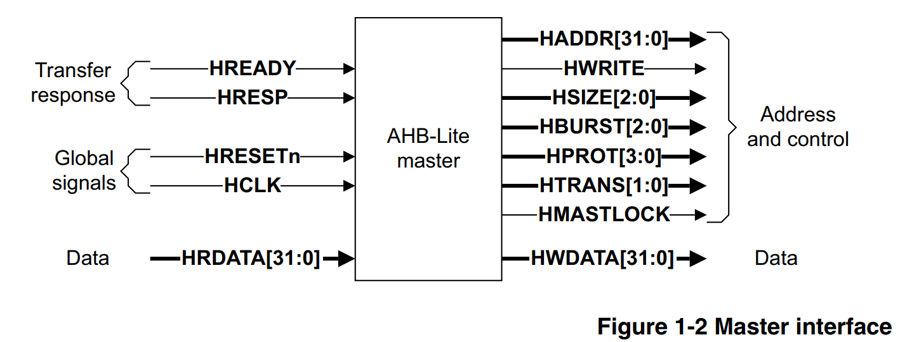

#### Slave Interface

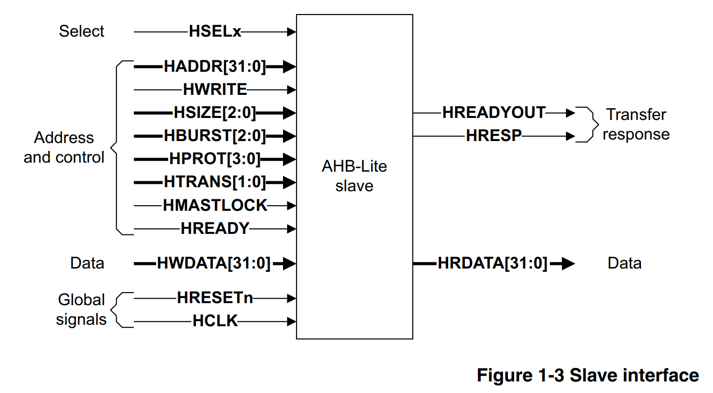

由此可以断定logical/cmsdk_ahb_master_mux中的无论从CPU还是DMA过来的master端口都是AHB-LITE接口而不是AHB标准接口

#### Transfer Type

- single
- incrementing bursts that do not wrap at address boundaries
- wrapping bursts that wrap at particular address boundaries

#### 多master AHB-LITE系统

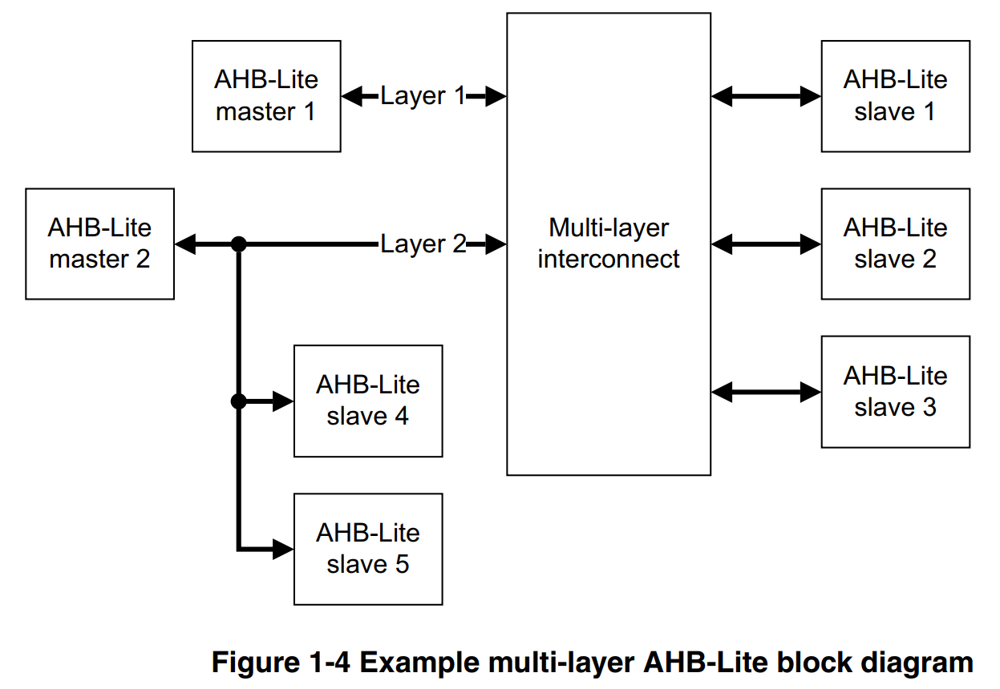

Because AHB-Lite is a single master bus interface then if a multi-master system is required, the system designer must include a component that isolates all masters from each other。master 1 and master 2 each have access to slaves 1, 2, and 3. The multi-layer interconnect must prevent simultaneous access to a single slave by implementing an arbitration scheme for the three shared slaves. Master 1 does not require access to slaves 4 and 5, so these two slaves are kept local to master 2. This reduces the complexity of the multi-layer interconnect component.

#### Signal Description

##### 全局信号

- HCLK：时钟信号，上升沿触发
- HRESETN：低电平复位信号，AHB-LITE协议中唯一低电平有效的信号
  - 同步或异步复位，同步释放
  - 复位期间，所有Master需要保证HTRANS[1:0]处于IDLE状态，所有Slave需要保证HREADYOUT处于高电平

##### 由Master生成的信号

- HADDR [31:0]：地址总线，既发给Slave，也发给用于选择Slave的Decoder
- HBURST [2: 0] : 突发类型。
  - 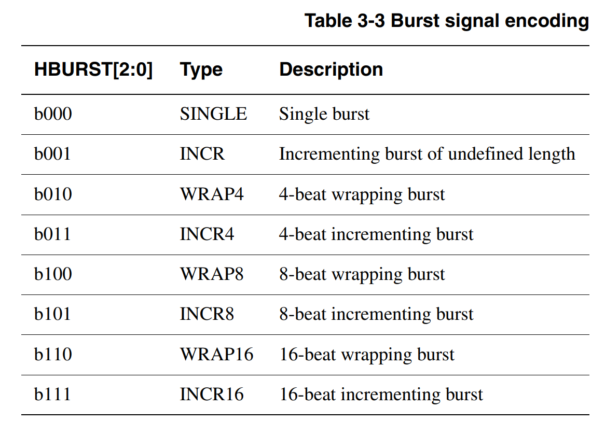
  - Incrementing bursts access sequential locations and the address of each transfer in the burst is an increment of the previous address.
  - Wrapping bursts wrap when they cross an address boundary. The address boundary is calculated as the product of the number of beats in a burst and the size of the transfer. The number of beats are controlled by **HBURST** and the transfer size is controlled by **HSIZE**.
  - For example, a four-beat wrapping burst of word (4-byte) accesses wraps at 16-byte boundaries. Therefore, if the start address of the transfer is 0x34, then it consists of four transfers to addresses 0x34, 0x38, 0x3C, and 0x30.
  - Masters must not attempt to start an incrementing burst that crosses a 1KB address boundary
  - All transfers in a burst must be aligned to the address boundary equal to the size of the transfer. For example, you must align word transfers to word address boundaries (**HADDR**[1:0] = b00), and halfword transfers to halfword address boundaries (**HADDR**[0] = 0)
  - 如WRAP4类型的BURST，HSIZE=WORD，假如起始地址是0x38, 那后续三个地址应该依次是0x3C, 0x30, 0x34，而不是0x3C, 0x40, 0x44
  - INCR类型（即未提前指定突发长度的）例子
    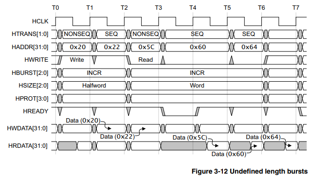
- HMASTLOCK: 
  - When HIGH, this signal indicates that the current transfer is part of a locked sequence. It has the same timing as the address and control signals.
- HPROT[3:0]:
  - The protection control signals provide additional information about a bus access and are primarily intended for use by any module that wants to implement some level of protection. The signals indicate if the transfer is an opcode fetch or data access, and if the transfer is a privileged mode access or user mode access. For masters with a memory management unit these signals also indicate whether the current access is cacheable or bufferable.
- HSIZE[2:0]: size of the transfer
  -  typically byte, halfword, or word.
  -  allows for larger transfer sizes up to a maximum of 1024 bits
  -  
- HTRANS[1:0]: the transfer type of the current transfer
  - can be IDLE, BUSY, NONSEQUENTIAL, SEQUENTIAL
- HWDATA[31:0]
  - can be extended to enable higher bandwidth operation
- HWRITE
  - indicates the transfer direction
  - when HIGH -- > write transfer
  - when LOW --> read  transfer
  - same timing as address signals
  - must remain constant throughout a burst transfer

##### 由Slave生成的信号

- HRDATA[31:0]: 
  - 发给Multiplexor
  - can be extended to enable higher bandwidth operation
- HREADYOUT
  - 发给Multiplexor
  - when HIGH: indicates a transfer has finished on the bus
  - can be driven LOW to extend a transfer
- HRESP
  - 发给Multiplexor
  - when LOW, indicates the transfer status is OKAY
  - when HIGH, indicates the transfer status is ERROR

##### 由Decoder生成的信号

- HSELx：
  - 发给slave。indicates that the current transfer is intended for the selected slave
  - slave被选中后，需要监视HREADY信号，只有在HREADY信号为高时，总线才解除占用，自己的传输任务才可以开始
  - 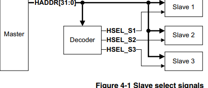

##### 由Multiplexor生成的信号

- HRDATA[31:0]: 
  - 发给master
  - Read data bus, selected by the decoder.
- HREADY: 
  - 发给master和slave
  - When HIGH, the HREADY signal indicates to the master and all slaves, that the previous transfer is complete
- HRESP:
  - 发给master
  - transfer response, selected by the decoder
  - When LOW, the HRESP signal indicates that the transfer status is OKAY. When HIGH, the HRESP signal indicates that the transfer status is ERROR.
  - If a NONSEQUENTIAL or SEQUENTIAL transfer is attempted to a nonexistent address location then the default slave provides an ERROR response.
  - IDLE or BUSY transfers to nonexistent locations result in a zero wait state OKAY response.

#### 传输流程示意

##### 基本传输

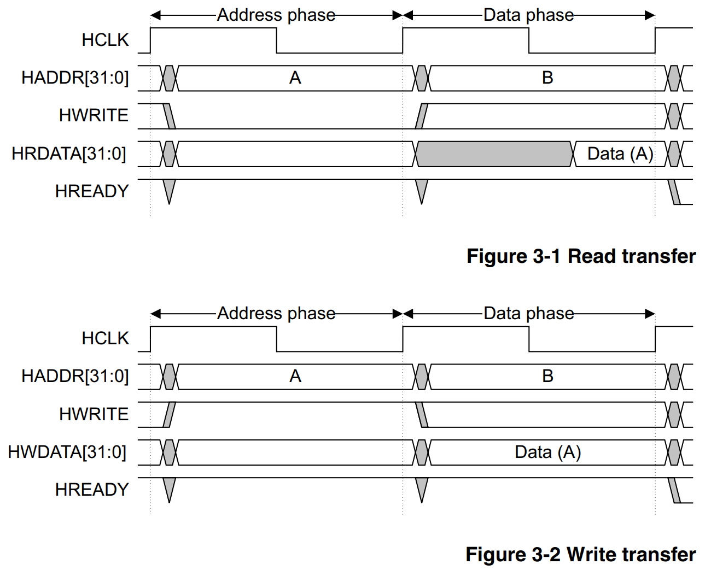

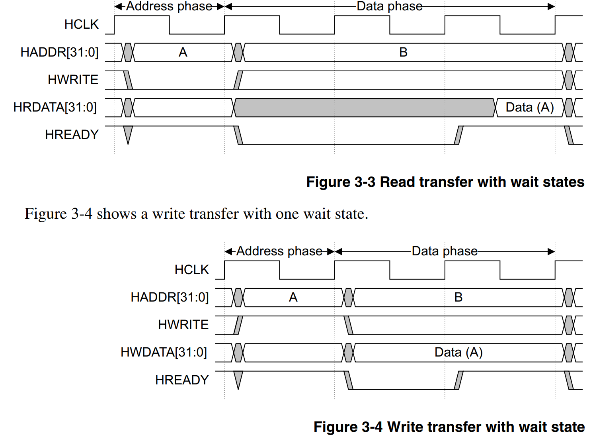

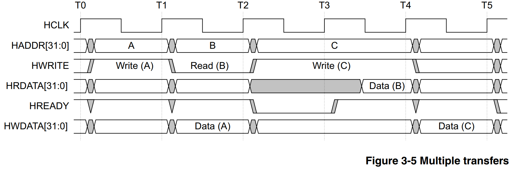

#### 传输类型

IDLE, BUSY, NONSEQ, SEQ 

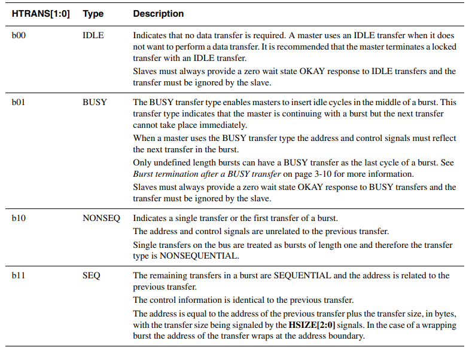

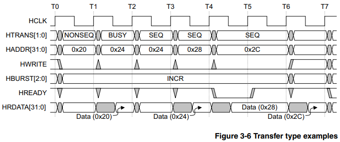

#### Locked Transfers

HMASTLOCK信号表明当前传输是仅自己可见的，并且需要在任何其他传输之前完成传输。一般和原子操作（SWP）绑定。

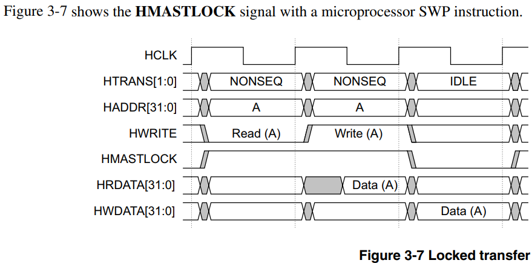

在Locked transfer之后，master需要给一个周期的IDLE transfer （HTRANS==IDLE）

#### 单Master多Slave连接关系

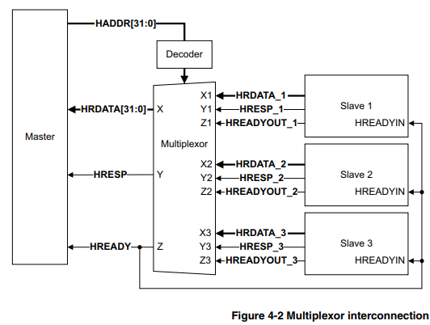

#### Discussion: The reason why AHB Slave has HREADY input and output both

https://community.arm.com/support-forums/f/soc-design-and-simulation-forum/54840/the-reason-why-ahb-slave-has-hready-input-and-output-both

*Any **AHB** (**"AMBA 2 AHB"** or **"AMBA 3 AHB-lite"** or **"AMBA 5 AHB"**) slave must have **HREADY** as both an input and an output port (not bi-directional).*

***HREADY** is required as an output from a slave so that the slave can extend the data phase of a transfer.*

***HREADY** is also required as an input so that the slave can determine when the previously selected slave has completed its final transfer and the first data phase transfer for this slave is about to commence.*

*Each AHB Slave should have an **HREADY** output signal (conventionally named **HREADYOUT**) which is connected to the "Slave-to-Master Multiplexer". The output of this multiplexer is the global **HREADY** signal seen by the AHB master, which is also fed back to all slaves as their **HREADY** input.*

*For single AHB slave buses this "Slave-to-Master Multiplexer" is replaced by direct connections, so **HREADYOUT** from the slave drives the AHB master's **HREADY** input, and is also fed back to the slave's **HREADY** input."*

简而言之，Slave的HREADY输出允许Slave能够给自己 ”准备读数据“ 或者“准备好被写入数据” 的时间，也就是data phase extension。

Slave的HREADY输入允许Slave获悉前一个被选中的Slave是否已经处于自身传输的最后一个周期（此时HREADY为高），一旦获悉前一个被选中的Slave已经处于自身传输的最后一个周期，该Slave就会马上检查对自身的HSELx，如果发现自己被选中，就可以开始采样来自master的address phase。

#### AHB Master没有hreadyout信号，如果为了协议的完备性（保持与Slave的一致），如何产生？

直连AHB Master的hreadyin到hreadyout即可

#### Slave Transfer responses

由Slave生成的两个信号HREADY和HRESP共同决定

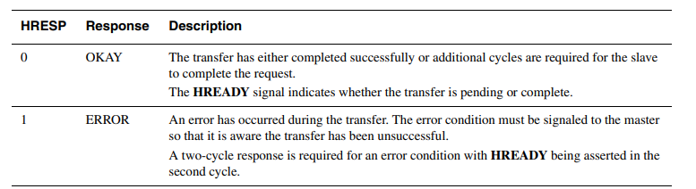

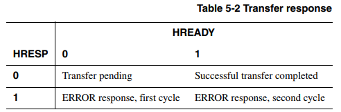

ERROR response需要两个cycle，第一个cycle，HREADY=0, HRESP=1，第二个cycle，HREADY=1, HRESP=1。至此ERROR response完成。需要两个cycle来处理ERROR response的原因是，在第一个cycle时，下一个传输的地址信息已经被广播到了总线上。再加一个cycle有利于master把HTRANS改成IDLE，从而阻止下一个传输的开始。

If a slave provides an ERROR response then the master can cancel the remaining transfers in the burst. However, this is not a strict requirement and it is also acceptable for the master to continue the remaining transfers in the burst.

#### 对于数据保持的要求

- 传输时，HWDATA在HREADY拉高前（pending）必须保持
- 传输时，HRDATA只需在HREADY拉高时给出即可，不需在HREADY为低（pending）时保持

### AHB协议的历史局限性

https://developer.aliyun.com/article/1303311

- 属ARM AMBA2协议，距今20多年
- 低频低性能下，功耗面积比不过APB；高频高性能下，主频带宽比不过AXI。
- 本身限制多：command和data必须是1 cycle的延迟（利用HREADY插入waiting state会导致后续传输的排队），error response，HREADYOUT和HREADYIN等机制都很容易导致设计出错。
- WDATA和RDATA无法同时工作，等于数据信号的利用率最多只有50%，可以认为它近似于一个半双工的BUS
- 因为HREADY会反压，一直到读数据回来的时候才允许下一个写传输的开始。因此当读回数据需要很多拍、且频繁发生读写转换的时候，AHB效率很低。
- AXI相比AHB最重要的改变就是读写通道分离，变成全双工。此外AXI还支持Outstanding操作，不需要等读回数据响应再发送下一次传输。且AXI引入了握手机制，不需要data必须在command的1T以后，因此可以跑到很高的频率，不需要受给出数据的时间限制。