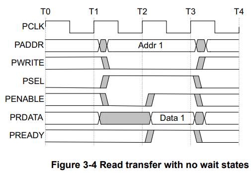

### APB协议总结

#### 概述

APB is designed for accessing the programmable control registers of peripheral devices.

#### 信号

#### 时序

#### PWAKEUP signaling （only APB5）

The wake-up signal, PWAKEUP, is used to indicate any activity associated with any APB interface. PWAKEUP provides a glitch-free signal that can be routed to a clock controller, or similar component, to enable power and clocks to connected components. The Wakeup_Signal property is used to indicate whether a component supports wake-up signaling: True Wake-up signal is present. False Wake-up signal is not present. If the Wakeup_Signal property is not declared, it is considered False.

#### PAUSER, PWUSER, PRUSER, PBUSER

The users of APB protocols can encounter an application that requires the addition of signaling that is not specified in the APB protocol. User signaling defines a standard method of adding this signaling to a transaction, without defining the signal usage. (可以扩展自定义信号)

