#### 感觉对ARM的系统控制没有概念，决定学习arm-modern-soc.pdf

#### TLM （transactional-level modeling）

比RTL更高级的一种抽象。比如

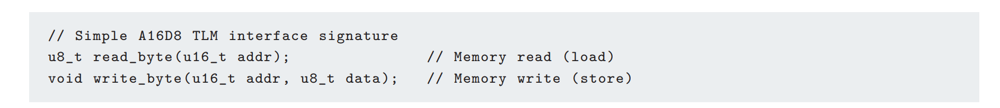

#### memory Map

the allocation of addressable space to hardware resources is called the memory map

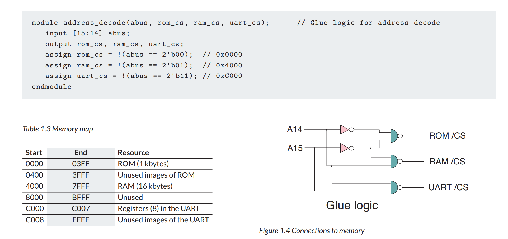


#### Boot

Today, a three-stage chain is often used for booting, in which a mask-programmed ROM reads code from a low-performance flash memory into internal RAM. The code thus loaded can be the main application itself, but it often just a **bootloader**, which itself loads the main operating system.

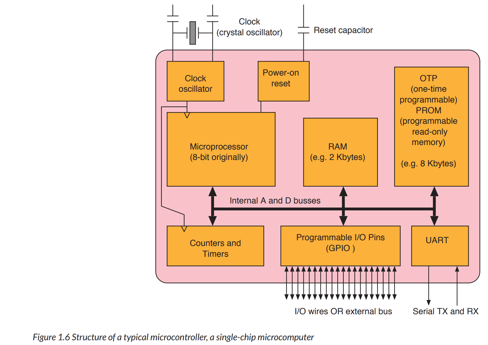


#### 轻松学习ARM Cortex-M0 DesignStart Eval系列eetop

https://blog.eetop.cn/space-uid-1210097.html


#### ARM Cortex M0仿真相关文档

https://www.cnblogs.com/Alfred-HOO/articles/17489157.html

https://www.cnblogs.com/Alfred-HOO/articles/17489175.html

https://www.cnblogs.com/Alfred-HOO/articles/17489295.html


重点关注Arm Cortex-M0 DesignStart Eval User Guide

初定使用DS-5或Arm GCC作为ARM软件编译环境，使用VCS作为硬件仿真平台


#### gcc-arm交叉编译链

在arm官网下载了gcc-arm-none-eabi-10.3-2021.10的x86_linux64版本，

解压命令：tar -jxvf gcc-arm-none-eabi-10.3-2021.10-x86_64-linux.tar.bz2 

文档在编译链目录下的share/doc/gcc-arm-none-eabi/readme.txt

在~/.bashrc添加了两个环境变量

```
export PATH=$PATH:/capsule/home/xuandalin//tools/gcc-arm/gcc-arm-none-eabi-10.3-2021.10/bin
export LD_LIBRARY_PATH=$LD_LIBRARY_PATH:/capsule/home/xuandalin/tools/gcc-arm/gcc-arm-none-eabi-10.3-2021.10/lib
```

source生效之后

arm-none-eabi-gcc -v可以正常输出版本，说明安装成功

尝试测试arm-none-eabi-gcc-v的编译功能是否正常，编写了一个hello_world

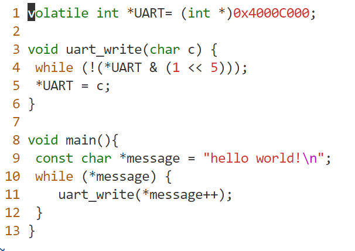

使用arm-none-eabi-gcc 1.c -o output_file编译，提示undefined reference to '_exit'

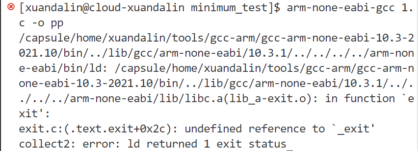

如果编译如下带printf的C文件，会报错很多undefined reference。

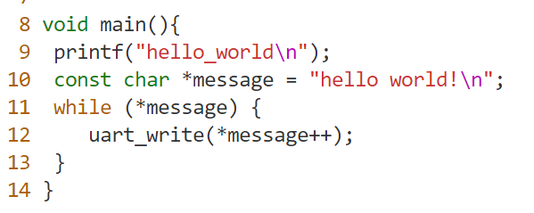

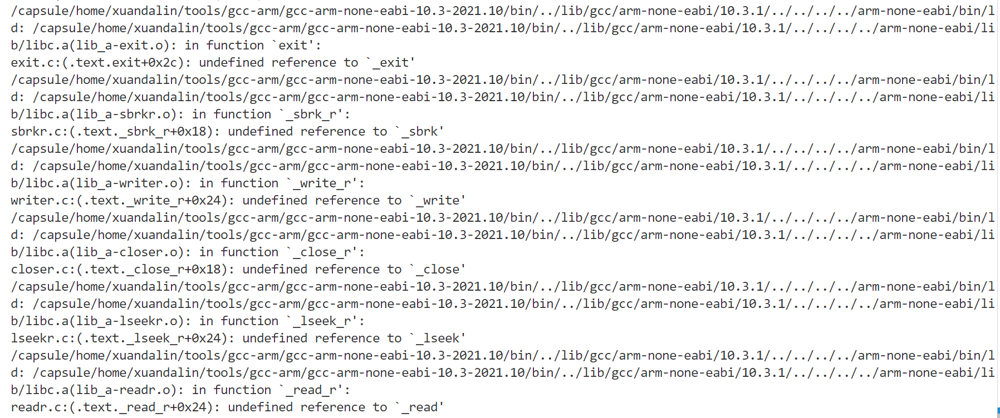

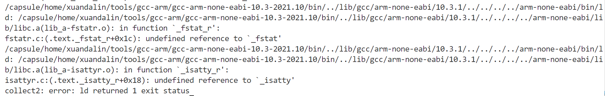

查询stackoverflow才知道，因为编译出来是一个裸机系统，对于printf这种高层函数是不支持的

https://stackoverflow.com/questions/13235748/linker-error-on-a-c-project-using-eclipse

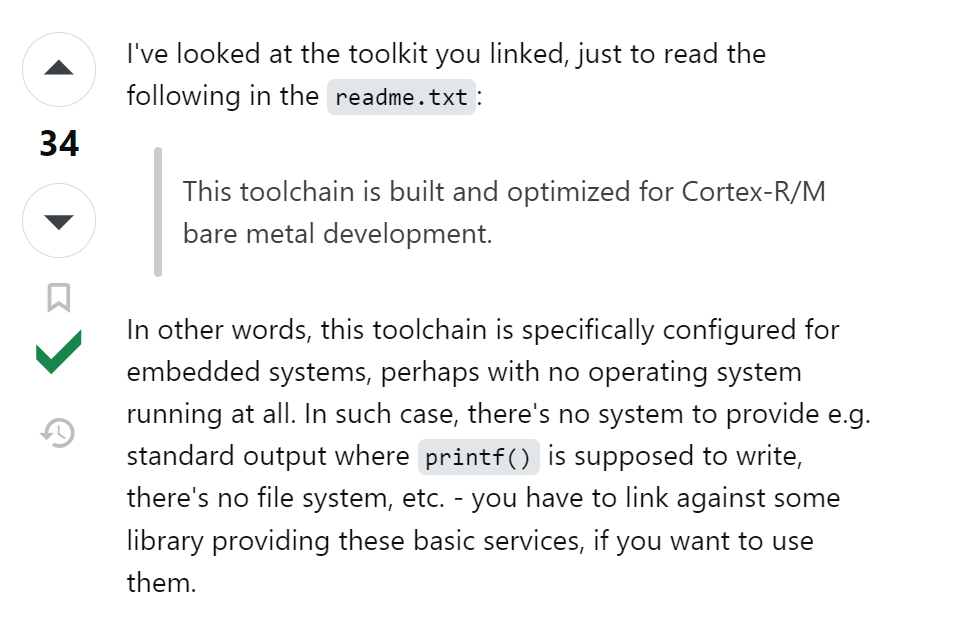

对于之前只报错undefined reference for _exit的情况，也有很好的解释

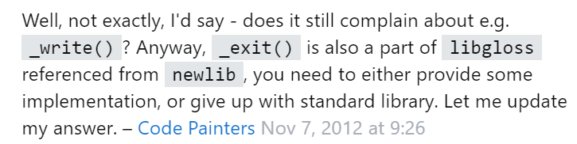

于是尝试寻找最小系统例程，在/capsule/home/xuandalin/tools/gcc-arm/gcc-arm-none-eabi-10.3-2021.10/share/gcc-arm-none-eabi/samples/src/minimum中找到。

利用例程中给的Makefile，直接make可以work。

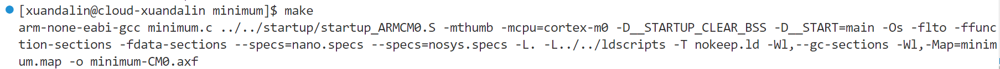

利用file minimum-CM0.axf查看编译出的文件的类型，可知确实编译出32位在ARM上的可执行文件，说明交叉编译链可以work。

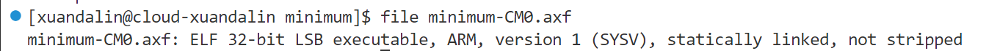

以上参考https://www.cnblogs.com/tansuoxinweilai/p/11602830.html


下一步计划搭建ARM的小系统，含ARM核、AHB线、UART和SRAM，并用VCS完成仿真


对ARM核 & 应用编译systems/cortex_m0_mcu/rtl_sim/makefile脚本作如下修改：

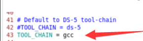

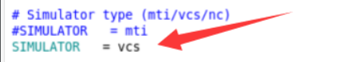

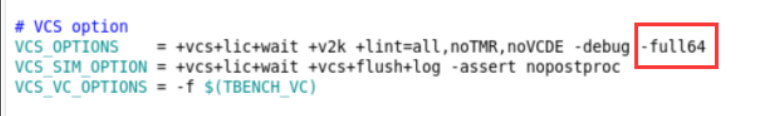

在rtl_sim目录下键入make all SIMULATOR=vcs TOOL_CHAIN=gcc TESTNAME=hello > output_all.log可以对ARM核进行编译并运行testcodes下的所有应用例程

输出大多都通过UART输出，例如下图

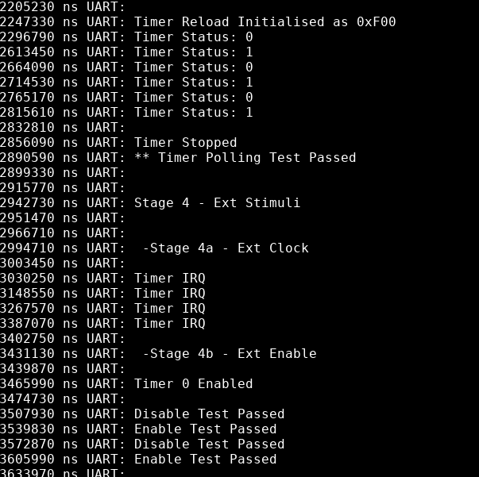

验证了使用VCS在不上板的情况下对ARM核及其SoC进行系统级仿真的可行性，之后系统的输出可以通过UART口观察。

#### Retargeting in ARM for printf() and puts()

https://developer.arm.com/documentation/dui0926/b/software-examples/retargeting

Several test programs use the `printf` and `puts` functions to display text messages during the simulation. The retargeting code performs this function. It redirects text output to UART0.

You must ensure that your code calls `UartStdOutInit()` before any `printf` or similar functions are called.

The retargeting is written to use the high-speed simulation mode of the CMSDK UART. If you want to use the same retargetting in an actual FPGA (with realistic baud rates) you will need to add a polling check whilst the characters are transmitted.

For the Arm DS-5 and Keil MDK environments, the retarget function for text output is `fputc`. The retarget function for Arm GCC, and most gcc based C compilers, is the `_write_r` function. （感觉其实是_write） These functions are located in file `software/common/retarget/retarget.c`.

```c
void UartStdOutInit(void)
{
  CMSDK_UART0->BAUDDIV = 16;
  CMSDK_UART0->CTRL    = 0x41; // High speed test mode, TX only
  CMSDK_GPIO1->ALTFUNCSET = (1<<1); // Port enable
  return;
}
// Output a character
unsigned char UartPutc(unsigned char my_ch)
{
  while ((CMSDK_UART0->STATE & 1)); // Wait if Transmit Holding register is full
  CMSDK_UART0->DATA = my_ch; // write to transmit holding register
  return (my_ch);
}
// Get a character
unsigned char UartGetc(void)
{
  while ((CMSDK_UART0->STATE & 2)==0); // Wait if Receive Holding register is empty
  return (CMSDK_UART0->DATA);
}

void UartEndSimulation(void)
{
  UartPutc((char) 0x4); // End of simulation
  while(1);
}

__attribute__ ((used))  int _write (int fd, char *ptr, int len)
{
  size_t i;
  for (i=0; i<len;i++) {
    UartPutc(ptr[i]); // call character output function
    }
  return len;
}

int fputc(int ch, FILE *f) {
  return (UartPutc(ch));
}

int fgetc(FILE *f) {
  return (UartPutc(UartGetc()));
}
```

这里retarget只是建构好了像_write，fputc，fgetc这些函数，这些函数在C中是printf（）, puts()的实现中的基础构成函数，所以就等同于retarget到了printf()和puts()

附：UART结构体所代表的硬件意义

```c#
/*in AT510-MN-80001-R2P0-00REL0/software/cmsis/Device/ARM/CMSDK_CM0/Include/CMSDK_CM0.h*/

/* APB peripherals                                                           */
#define CMSDK_TIMER0_BASE       (CMSDK_APB_BASE + 0x0000UL)
#define CMSDK_TIMER1_BASE       (CMSDK_APB_BASE + 0x1000UL)
#define CMSDK_DUALTIMER_BASE    (CMSDK_APB_BASE + 0x2000UL)
#define CMSDK_DUALTIMER_1_BASE  (CMSDK_DUALTIMER_BASE)
#define CMSDK_DUALTIMER_2_BASE  (CMSDK_DUALTIMER_BASE + 0x20UL)
#define CMSDK_UART0_BASE        (CMSDK_APB_BASE + 0x4000UL)
#define CMSDK_UART1_BASE        (CMSDK_APB_BASE + 0x5000UL)
#define CMSDK_UART2_BASE        (CMSDK_APB_BASE + 0x6000UL)
/*------------- Universal Asynchronous Receiver Transmitter (UART) -----------*/
/** @addtogroup CMSDK_UART CMSDK Universal Asynchronous Receiver/Transmitter
  memory mapped structure for CMSDK_UART
  @{
*/
typedef struct
{
  __IO   uint32_t  DATA;          /*!< Offset: 0x000 Data Register    (R/W) */
  __IO   uint32_t  STATE;         /*!< Offset: 0x004 Status Register  (R/W) */
  __IO   uint32_t  CTRL;          /*!< Offset: 0x008 Control Register (R/W) */
  union {
    __I    uint32_t  INTSTATUS;   /*!< Offset: 0x00C Interrupt Status Register (R/ ) */
    __O    uint32_t  INTCLEAR;    /*!< Offset: 0x00C Interrupt Clear Register ( /W) */
    };
  __IO   uint32_t  BAUDDIV;       /*!< Offset: 0x010 Baudrate Divider Register (R/W) */

} CMSDK_UART_TypeDef;
/** @addtogroup CMSDK_PeripheralDecl CMSDK Peripheral Declaration
  @{
*/

#define CMSDK_UART0             ((CMSDK_UART_TypeDef   *) CMSDK_UART0_BASE   )
#define CMSDK_UART1             ((CMSDK_UART_TypeDef   *) CMSDK_UART1_BASE   )
#define CMSDK_UART2             ((CMSDK_UART_TypeDef   *) CMSDK_UART2_BASE   )
```


#### ARM Cortex M0读写地址基础函数

直接访问地址指针的方式。HW32_REG(ADDRESS)；HW16_REG(ADDRESS)；HW8_REG(ADDRESS)；在自己的测试中直接使用这些函数来配置寄存器就好。

```c
#define  SRAM_BASE_ADDR  0x20000000
#define  SRAM_SIZE       0x10000

#define  APB_IO_BASE_ADDR   0x40000000
#define  APB_IO_SIZE        0x10000

#include <stdio.h>
#include "uart_stdout.h"

#define HW32_REG(ADDRESS)  (*((volatile unsigned long  *)(ADDRESS)))
#define HW16_REG(ADDRESS)  (*((volatile unsigned short *)(ADDRESS)))
#define HW8_REG(ADDRESS)   (*((volatile unsigned char  *)(ADDRESS)))

# example code
int sram_test_word(unsigned int test_addr)
{
  int result=0; // This will only work if result and temp are not store in address being tested
  int temp;

  __disable_irq(); // Make sure interrupt will not affect the result of the test

  temp = HW32_REG(test_addr); // save data

  /* Use consistence memory access size in checking so that it work with
    both little endian and big endian configs */
  HW32_REG(test_addr)=0x00000000;
  if (HW32_REG(test_addr)!=0x00000000) result++;
  HW16_REG(test_addr)=0xFFFF;
  if (HW16_REG(test_addr)!=0xFFFF) result++;
  HW8_REG(test_addr+3)=0x12;
  HW8_REG(test_addr+2)=0xFF;
  if (HW8_REG(test_addr+3)!=0x12) result++;
  if (HW8_REG(test_addr+2)!=0xFF) result++;
  HW8_REG(test_addr  )=0x00;
  HW8_REG(test_addr+1)=0x00;
  if (HW8_REG(test_addr  )!=0x00) result++;
  if (HW8_REG(test_addr+1)!=0x00) result++;
  HW16_REG(test_addr+2)=0xFE00;
  if (HW16_REG(test_addr+2)!=0xFE00) result++;
  HW32_REG(test_addr)=0x00000000;
  if (HW32_REG(test_addr)!=0x00000000) result++;

  HW32_REG(test_addr) = temp; // restore data
  __enable_irq(); // re-enable IRQ
  if (result !=0) printf ("ERROR: Memory location test failed at %x\n", test_addr);
  return result;
}
```


#### ARM-Cortex-M0单个测试仿真波形查看或仅打印输出

在AT510-MN-80001-r2p0-00rel0/systems/cortex_m0_mcu/rtl_sim目录下使用make sim SIMULATOR=vcs TOOL_CHAIN=gcc TESTNAME=hello可以查看单个TEST的波形(interactive mode)，使用make run SIMULATOR=vcs TOOL_CHAIN=gcc TESTNAME=hello > output_hello.log可以将输出结果（Hello World! ）打印到output_hello.log中（batch mode）。

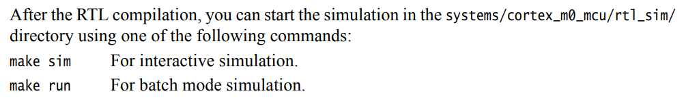


下一步写一个自己的TEST，读写SRAM并通过UART输出。重点在于各个makefile及其他没有想到的部件能不能识别到这个新的test。（完成）

#### ARM-Cortex-M0添加新的软件test方法

举例：添加如下的SRAM简单读写寄存器TEST

```c
#include "CMSDK_CM0.h"
#define  SRAM_BASE_ADDR  0x20000000
#define  SRAM_SIZE       0x10000

#include <stdio.h>
#include "uart_stdout.h"

#define HW32_REG(ADDRESS)  (*((volatile unsigned long  *)(ADDRESS)))
#define HW16_REG(ADDRESS)  (*((volatile unsigned short *)(ADDRESS)))
#define HW8_REG(ADDRESS)   (*((volatile unsigned char  *)(ADDRESS)))

volatile int read_data;

int main (void) {
    UartStdOutInit();

    puts("\nSELF SRAM TEST, READ / WRITE BYTE/HALFWORD/WORD, FOR MAKEFILE TEST\n");
    
    read_data = HW32_REG (SRAM_BASE_ADDR);
    
    printf("Initial read data of SRAM_BASE_ADDR = %8x\n", read_data);
    
    HW32_REG(SRAM_BASE_ADDR) = 0x12345678;
    
    if (HW32_REG(SRAM_BASE_ADDR) != 0x12345678) {
        puts("FAILED: WRITE REG32 AT SRAM_BASE_ADDR!\n");
        printf("DATA: %8x\n", HW32_REG(SRAM_BASE_ADDR));
    }
    else {
        puts("SUCCESSED: WRITE REG32 AT SRAM_BASE_ADDR!\n");
        printf("DATA: %8x\n", HW32_REG(SRAM_BASE_ADDR));
    }

    UartEndSimulation();
    return 0;

}
```


1. 将上述测试文件命名为self_sram_test.c，放置在AT510-MN-80001-r2p0-00rel0/software/common/validation文件夹下

2. 将AT510-MN-80001-r2p0-00rel0/systems/cortex_m0_mcu/rtl_sim目录下的makefile中的TESTLIST最后添加self_sram_test，如图
   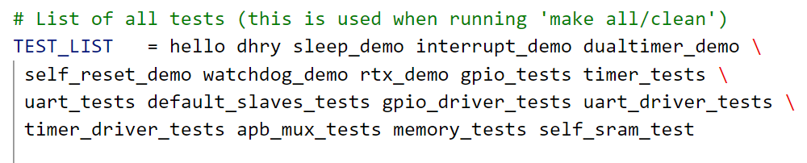

3. 在AT510-MN-80001-r2p0-00rel0/systems/cortex_m0_mcu/testcodes目录下新建文件夹self_sram_test，把memory_tests里面的makefile复制过来，改一行，改动地方如下：

   ```makefile
   # Program file
   TESTNAME     = self_sram_test
   ```

4. 切回AT510-MN-80001-r2p0-00rel0/systems/cortex_m0_mcu/rtl_sim目录，运行命令make run SIMULATOR=vcs TOOL_CHAIN=gcc TESTNAME=self_sram_test，即可输出正确结果如下
   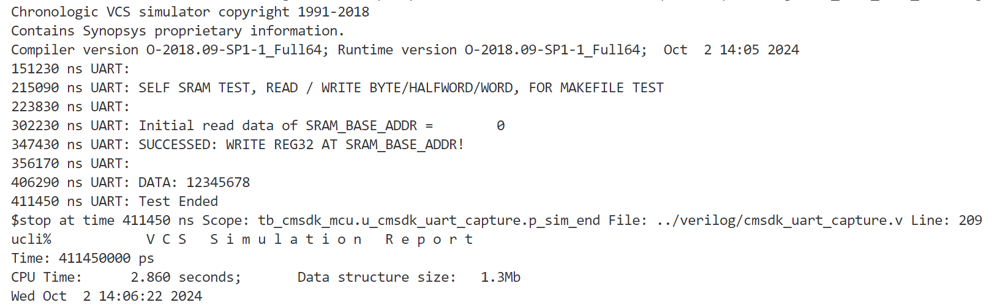

需注意：必须在self_sram_test.c开头和结尾分别加上UartStdOutInit()和UartEndSimulation()，如果不加UartEndSimulation()，会导致仿真一直不结束，按ctrl+c也没法退出仿真，只能断连ssh重连，如下：
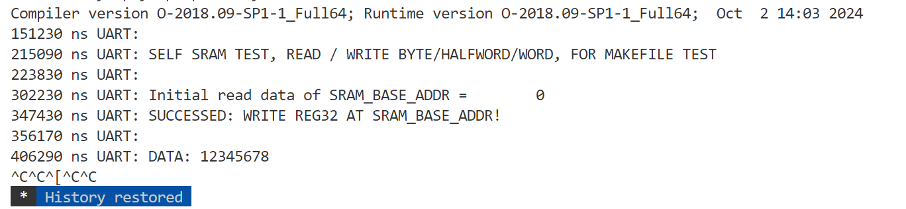


打算先看懂通过DMA-Controller-Module_TI.pdf看懂DMA的基本原理，再看ahb_dmac的databook，之后写个ahb接口的加法器模块，把SRAM/DMA/加法器模块连接起来，软件上测一遍

ahb_dmac databook中24页，software handshaking Interface总结。


logical/cmsdk_ahb_master_mux/verilog/cmsdk_ahb_master_mux.v可以充当DMA和CPU之间的master_mux

## arm modern soc textbook

### SoC interconnect

#### Interconnect Requirements

1. single-word reads and writes (transaction中的最小操作)（write 需配有lane flags，可以控制到字节级）
2. uncached reads and writes
3. block or burst transfers
4. broadcast and multicast transactions (allow the same data word to be written to more than one destination at a time) 
   *pesudo DMA*： data are moved between two target devices, one reading and the other writing, while the initiating CPU core ignores the data on the bus (i.e, CPU is executing a dummy read transaction)
   *Real DMA*: follow the same pattern as pesudo DMA however the initiator is a dedicated controller instead of a CPU core
5. **Atomic Operations: ** 
   *conventional operations:* test-and-set & compare-and-swap (both require two successive operations on an addressed location without pre-emption) (not scale well to multi-initiator systems)
   *advanced operations:*:  load-linked & store-conditional
6. **out-of-order delivery of the data**
7. **cache consistency (data coherency)**
8. **read-ahead or warm-up traffic**: read cycles whose results might not be needed but allow data to be loaded speculatively so that the data are available with lower latency if needed
9. **debug transactions**
10. **configuration operations**
11. **tagged data** (track ownership of data, not visible to the programmer)


#### Design Considerations

1. the baseline connectivity matrix (records which initiators need to communicate with which targets)
2. throughput (the amount of data it can move per unit time, measured in GB/s)
3. latency (the time a transaction takes to complete) (a transaction may not be initiated until the previous transaction has returned its result)
4. connectedness (full & equally serve each patterns --> over-engineering)
5. energy consumption (proportional to the distance that data moves across the chip)
6. real-time traffic with a guaranteed quality of service (QoS)
7. avoid deadlock (a ring of components each waiting on the next)

### Crossbar 4×4的三种实现方式

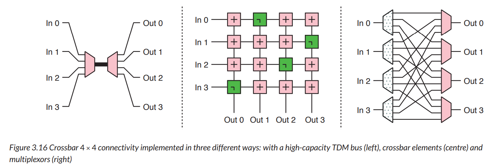

左：分时复用结构。高电容结构。需要用N倍的快时钟。

右：广播结构，噪声容易太大