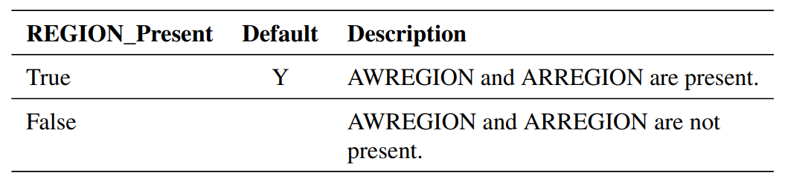
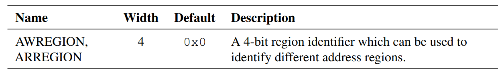

### AXI AxREGION信号

#### purpose

 to support interfaces with multiple address regions within a single interface

- can identify up to 16 different regions
- the region identifier provides a decode of higher-order address bits
- a single physical interface on a Subordinate can provide multiple logical interfaces, each with a different location in the system address map.
- usage:
  - *A peripheral can have its main data path and control registers at different locations in the address map, and be accessed through a single interface without the need for the Subordinate to perform an address decode.*
  - A Subordinate can exhibit different behaviors in different memory regions. For example, a Subordinate might provide read and write access in one region, but read-only access in another region

### AXI AXCACHE信号

https://zhuanlan.zhihu.com/p/148813963

#### AXI Response信号

AXI provides response signaling for both read and write transactions.

For read transactions, the response information from the subordinate is signaled on the read data channel using RRESP.

For write transactions, the response information is signaled on the write response channel using BRESP.

RRESP and BRESP are both composed of two bits, and the encoding of these signals can transfer four responses, as shown in the following table:

| Response code | Description                                                  |
| ------------- | ------------------------------------------------------------ |
| 00 - OKAY     | Normal access success or exclusive access failure.OKAY is the response that is used for most transactions. OKAY indicates that a normal access has been successful.This response can also indicate that an exclusive access has failed. An exclusive access is when more than one manager can access a subordinate at once, but the se managers cannot access the same memory range. |
| 01 - EXOKAY   | Exclusive access okay.EXOKAY indicates that either the read or write portion of an exclusive access has been successful. |
| 10 - SLVERR   | Subordinate error.SLVERR is used when the access has reached the subordinate successfully, but the subordinate wants to return an error condition to the originating manager.This indicates an unsuccessful transaction. For example, when there is an unsupported transfer size attempted, or a write access attempted to read-only location. |
| 11 - DECERR   | Decode error.DECERR is often generated by an interconnect component to indicate that there is no subordinate at the transaction address. |

# AXI3中的write interleaving是什么?

在 **AXI（Advanced eXtensible Interface）协议** 中，**Write Interleaving（写交错）** 是一个与 **多通道写操作顺序执行** 相关的概念。它描述了主设备（Master）如何将多个写事务（write transactions）交错发送到从设备（Slave），而不严格按照事务发起的顺序完成它们。

------

### 一、AXI 协议的基本背景

AXI 是 ARM 公司定义的一种高性能、高带宽、低延迟的片上互连总线协议，广泛用于 SoC 内部模块之间的通信。AXI 支持以下特性：

- 分离的读写通道（Read/Write Channel）
- 多通道（Multiple outstanding transactions）
- 数据乱序返回（Out-of-order completion）
- 支持 interleaving（交错）

------

### 二、什么是 Write Interleaving？

**Write Interleaving（写交错）** 指的是 AXI 主设备可以在没有等待前一个写事务完成的情况下，继续发出新的写事务。这些写事务可能以不同于发出顺序的方式被从设备接收和处理。

#### 关键点：

- 写地址和写数据是分离传输的（AW通道 和 W通道）
- 主设备可以交错地发送不同事务的地址和数据
- 从设备必须能够正确识别事务ID（AWID/WID），以支持交错处理

------

### 三、写交错与事务 ID（AWID / WID）

AXI 协议通过事务 ID（`AWID` 和 `WID`）来标识不同的事务。主设备在发送写地址（AW通道）和写数据（W通道）时，可以为每个事务分配一个 ID，从设备根据这个 ID 来匹配地址和数据，并进行正确的处理。

> ✅ 如果主设备发送了多个写事务，并且使用不同的 AWID/WID，那么这就是写交错的一个体现。 

------

### 四、写交错 vs 写数据乱序完成（Out-of-Order Completion）

虽然这两个概念有些相似，但要注意区分：

| 特性                                    | 描述                                                         |
| --------------------------------------- | ------------------------------------------------------------ |
| **Write Interleaving（写交错）**        | 主设备在发送写地址和写数据时可以交错发送多个事务的数据，不按顺序发送 |
| **Out-of-Order Completion（乱序完成）** | 从设备可以在不按事务发起顺序的情况下完成多个事务的响应（B通道响应） |

两者都依赖于事务 ID 的正确管理。

------

### 五、为什么需要 Write Interleaving？

1. **提高系统效率** ：允许主设备连续发送多个事务，无需等待每个事务完成，从而提升吞吐量。
2. **隐藏延迟** ：适用于高延迟路径（如跨芯片或远程从设备），主设备可以在等待响应的同时继续发出其他请求。
3. **资源优化** ：从设备可以根据自身能力处理多个请求，而不是强制顺序处理。

------

### 六、示例说明

假设主设备发送了两个写事务 A 和 B：

时间线：

AW通道: [AWADDR_A (AWID=0)] --> [AWADDR_B (AWID=1)]

W通道 : [WDATA_A (WID=0)   ] --> [WDATA_B (WID=1)]

如果主设备先发 A 的地址，再发 B 的地址；然后先发 B 的数据，再发 A 的数据，那就是一种写交错行为：

时间线：

AW通道: [AWADDR_A (ID=0)] --> [AWADDR_B (ID=1)]

W通道 :                  └----> [WDATA_B (ID=1)] --> [WDATA_A (ID=0)]

只要从设备能根据 ID 正确匹配地址和数据，这种交错就是合法的。

------

### 七、注意事项

- 从设备必须支持 **写交错** 才能处理这种行为，否则主设备应避免发送交错的写事务。
- 在设计 IP 核或验证平台时，要特别注意对 AWID/WID 的匹配逻辑是否正确。
- AXI4 协议中，写数据必须在其对应的地址之后到达，但从设备不需要立即处理。

------

### 八、相关信号字段

- `AWID`: 写地址事务的标识符
- `WID`: 写数据事务的标识符（AXI4 中 WID 被移除，使用 AWID 对应 WDATA）
- `BID`: 写响应事务的标识符（回应 AWID）

------

### 总结

| 概念                   | 含义                                     |
| ---------------------- | ---------------------------------------- |
| **Write Interleaving** | 主设备可以交错发送多个写事务的地址和数据 |
| **关键机制**           | 使用事务 ID（AWID/WID）来标识和匹配事务  |
| **优点**               | 提高系统性能、隐藏访问延迟、资源优化     |
| **要求**               | 从设备需支持交错处理逻辑                 |

# AXI4协议是不是已经去除了WID？为什么

是的，**AXI4协议中确实去除了 WID（Write ID）信号字段** 。这是 AXI4 相较于早期版本（如 AXI3）的一个重要变化。

------

## ✅ 回答核心：

> **AXI4 协议移除了 `WID` 信号的原因是为了简化协议、减少硬件复杂度和资源消耗** ，同时通过其他机制保证了事务的正确性。 

------

## 📌 背景知识：AXI 版本差异

| 特性/协议版本                             | AXI3     | AXI4                    |
| ----------------------------------------- | -------- | ----------------------- |
| 支持`WID`                                 | ✅ 是     | ❌ 否                    |
| 最大突发长度                              | 16 beats | 256 beats               |
| 是否支持写交错（Write Interleaving）      | ✅ 是     | ❌ 否（在 AXI4-Lite 中） |
| 是否支持乱序响应（Out-of-order response） | ✅ 是     | ✅ 是                    |
| 是否支持非对齐传输（Unaligned transfers） | ✅ 是     | ✅ 是                    |

------

## 🧠 为什么 AXI4 去掉了 WID？

### 1. **简化协议设计**

- 在 AXI3 中，每个写数据通道（W通道）有自己的事务 ID（`WID`），用于标识当前写数据属于哪个写地址事务。
- 这需要从设备维护一个额外的映射表来匹配 `AWID` 和 `WID`，增加了逻辑复杂性和资源消耗。
- AXI4 移除 `WID`，统一使用 `AWID` 来关联写地址和写数据，简化了事务匹配逻辑。

### 2. **写交错不再是强制要求**

- AXI3 允许主设备发送多个写事务，并且允许写数据以任意顺序发送（即写交错），这就需要 `WID` 来区分不同事务的数据。
- AXI4 更强调顺序写数据传输（尤其在 AXI4-Lite 中），不再强制支持写交错，因此不需要为每个写数据包分配独立 ID。

### 3. **提高互连效率**

- 使用单一事务 ID（`AWID`）减少了接口上的信号数量，提高了互连总线的效率。
- 对于大多数 SoC 设计来说，这种简化带来的收益大于其灵活性损失。

------

## ⚙️ AXI4 如何替代 WID 的功能？

在 AXI4 中：

- 写数据通道不再携带 `WID`。
- 主设备必须确保写数据（W通道）发送顺序与写地址（AW通道）一一对应。
- 从设备只需根据 `AWID` 匹配对应的写数据流即可，无需额外处理 `WID`。

也就是说：

WID 已被移除；

写数据必须紧跟其对应的写地址；

事务的匹配仅依赖 AWID。

------

## 📚 AXI4-Lite 与 AXI4-Full 的区别

| 特性         | AXI4-Lite              | AXI4-Full          |
| ------------ | ---------------------- | ------------------ |
| 支持 WID     | ❌ 否                   | ❌ 否               |
| 支持写交错   | ❌ 否                   | ✅ 是（有限支持）   |
| 支持乱序响应 | ✅ 是（通过 BID）       | ✅ 是               |
| 应用场景     | 简单外设控制寄存器访问 | 高性能内存映射访问 |

> 💡 即使在 AXI4-Full 中也**不使用 WID** ，但可以支持一定程度的写交错，前提是主设备按顺序发送写数据（不能完全乱序）。 

------

## ✅ 总结

| 问题                      | 回答                                               |
| ------------------------- | -------------------------------------------------- |
| **AXI4 是否移除了 WID？** | 是的                                               |
| **为什么移除？**          | 为了简化协议设计、降低硬件复杂度、提升互连效率     |
| **如何替代？**            | 使用 AWID 统一标识事务，写数据必须紧随对应写地址   |
| **是否影响写交错？**      | 是的，AXI4-Lite 不再支持写交错；AXI4-Full 有限支持 |

# AXI4中的prot信号

在 AXI4 协议中，`PROT`（Protection）信号用于指示 **访问的保护类型** ，即本次读/写操作的**安全属性和特权级别** 。它是一个 3-bit 的信号，通常出现在地址通道（AW 和 AR 通道）中。

------

## 🧩 `PROT` 信号的作用

`PROT[2:0]` 有 3 位，分别表示：

| Bit     | 名称                             | 描述                                                         |
| ------- | -------------------------------- | ------------------------------------------------------------ |
| PROT[0] | Privileged/Non-privileged Access | 1 = 特权模式（Privileged），0 = 非特权模式（User/Non-privileged） |
| PROT[1] | Secure/Non-Secure Access         | 1 = 安全世界（Secure），0 = 非安全世界（Non-Secure）         |
| PROT[2] | Instruction/Data Access          | 1 = 指令访问（Instruction fetch），0 = 数据访问（Data access） |

------

## 📋 `PROT` 信号定义表格（AXI4）

| PROT[2] | PROT[1] | PROT[0] | 含义说明                 |
| ------- | ------- | ------- | ------------------------ |
| 0       | 0       | 0       | 非特权、非安全、数据访问 |
| 0       | 0       | 1       | 特权、非安全、数据访问   |
| 0       | 1       | 0       | 非特权、安全、数据访问   |
| 0       | 1       | 1       | 特权、安全、数据访问     |
| 1       | 0       | 0       | 非特权、非安全、指令访问 |
| 1       | 0       | 1       | 特权、非安全、指令访问   |
| 1       | 1       | 0       | 非特权、安全、指令访问   |
| 1       | 1       | 1       | 特权、安全、指令访问     |

------

## 📍 应用场景举例

| 场景                            | PROT 值（二进制） | PROT 值（3'bxxx） | 说明                     |
| ------------------------------- | ----------------- | ----------------- | ------------------------ |
| 普通用户程序读内存              | 3'b000            | `3'b000`          | 非特权、非安全、数据访问 |
| 内核态访问设备寄存器            | 3'b001            | `3'b001`          | 特权、非安全、数据访问   |
| TrustZone 中 Secure OS 访问内存 | 3'b011            | `3'b011`          | 特权、安全、数据访问     |
| 从内存取指令执行                | 3'b100            | `3'b100`          | 非特权、非安全、指令访问 |

------

## 🧵 在 AXI4 接口中使用 PROTOCOL

`PROT` 信号出现在两个地址通道中：

- **AWPROT** ：写地址通道中的保护类型
- **ARPROT** ：读地址通道中的保护类型

------

## ⚠️ 注意事项

- `PROT` 信号是可选的（某些系统可能不实现），但在支持 TrustZone 或 MMU/MPU 的系统中非常重要。
- 系统可以通过 `PROT` 信号来决定是否允许某次访问，比如防止非特权软件访问关键寄存器或安全区域。
- 若设计中没有使用到 TrustZone 或安全特性，可以将 `PROT` 固定为默认值（如 `3'b000`）。