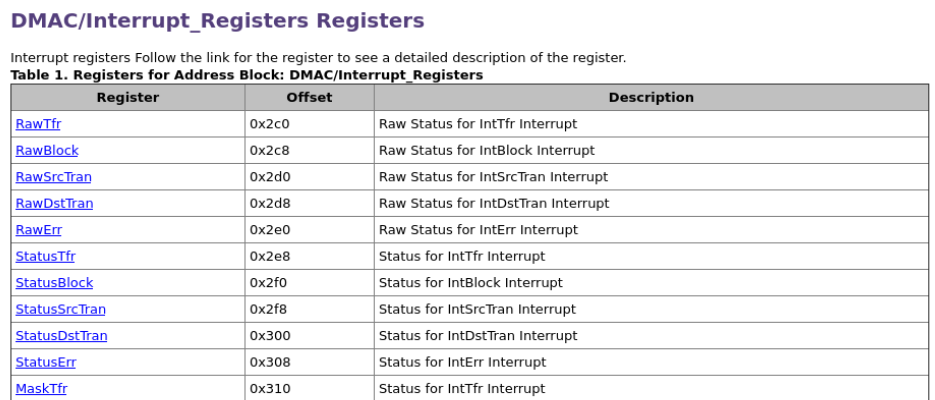

---

layout:     post
title:      DMA
subtitle:   DMA
date:       2025-05-12
author:     George Lin
header-img: img/post-bg-ios9-web.jpg
catalog: true
tags:

- DMA
- AHB

---

### MCU和SOC的区别

- MCU比SoC的外设更简单更少
- **SoC可以运行操作系统，MCU不能**
- SoC更重视性能，MCU更重视成本

### 知乎深入理解AMBA总线 专栏 共20篇深度长文 推荐！！！

https://www.zhihu.com/column/c_1663245806869291008

关于ahb_dmac的programmer model里面的寄存器地址，可以在DesignWare DW_ahb_dmac Databook里面的Register Descriptions里面找到

### Synopsys DW_ahb_dmac databook阅读笔记

#### 最基本的两个DMA传输例子

##### peripheral-to-peripheral

source (A) uses a hardware handshaking interface, destination (B) uses a software handshaking interface. For example, the request to send data to peripheral B is originated by the CPU, while writing to peripheral B is handled by the DW_ahb_dmac.

##### Peripheral-to-Memory

Figure illustrates a DW_ahb_dmac with two master interfaces and a DMA transfer between a source and destination on different AHB layers. Peripheral B uses a hardware handshaking interface. The memory does not use any handshaking interface to the DW_ahb_dmac in order to initiate DMA transfers. 

#### 基础概念解释

##### Memory (不需要handshaking interface)

 – Source or destination that is always “ready” for a DMA transfer and does not require a handshaking interface to interact with the DW_ahb_dmac. A peripheral should be assigned as memory only if it does not insert more than 16 wait states. If more than 16 wait states are required,then the peripheral must use a handshaking interface—the default if the peripheral is not programmed to be memory—in order to signal when the peripheral is ready to accept or supply data.

##### Channel （handshaking interfaces可以通过软件编程控制）

Read/write data path between a source peripheral on one configured AHB layer and a destination peripheral on the same or different AHB layer that occurs through the channel FIFO. If the source peripheral is not memory, then a source handshaking interface is assigned to the channel. If the destination peripheral is not memory, then a destination handshaking interface is assigned to the channel. Source and destination handshaking interfaces can be assigned dynamically by programming the channel registers.

##### Master Interface （src和dst在不同AHB层时，需要>1个master interface，比如上图1-4）

##### Slave Interface （DW_ahb_dmac通过这个interface被软件编程）

##### Handshaking Interface

 to request, acknowledge, and control a DW_ahb_dmac transaction. A channel can receive a request through one of three types of handshaking interface: **hardware, software, or peripheral interrupt**

##### Hardware handshaking Interface

Uses hardware signals to control transferring a single or burst transaction between the DW_ahb_dmac and the source or destination peripheral

其中dma_single在DW_ahb_dmac不在Single Transaction Region的时候被忽略；dma_last在外设不是flow controller的时候被忽略。所以多数情况下起作用的就是dma_req，dma_ack, dma_finish。

dma_req由外设发起，表示发起dma传输请求。

dma_ack由DW_ahb_dmac在每个transaction（包含很多个AHB transfer）完成的时候拉高。

dma_finish由DW_ahb_dmac在每个block（包含很多个transaction）完成的时候拉高。

##### Software Handshaking Interface

**重点参考!!**

When the peripheral is not the flow controller, then the last transaction registers – LstSrcReg and LstDstReg – are not used, and the values in these registers are ignored. 

**Operation** **– Peripheral Not In Single Transaction Region** 

Writing a 1 to the ReqSrcReg[x]/ReqDstReg[x] register is always interpreted as a burst transaction request, where x is the channel number. However, in order for a burst transaction request to start, software must write a 1 to the SglReqSrcReg[x]/ SglReqDstReg[x] register. You can write a 1 to the SglReqSrcReg[x]/SglReqDstReg[x] and ReqSrcReg[x]/ReqDstReg[x] registers in any order, but both registers must be asserted in order to initiate a burst transaction. Upon completion of the burst transaction, the hardware clears the SglReqSrcReg[x]/SglReqDstReg[x] and ReqSrcReg[x]/ReqDstReg[x] registers.

#### 启动DMA传输

配置CTLx和CFGx寄存器

参见Design Ware DW_ahb_dmac_databook第54页的example1

具体启动传输的流程可参照如下（第345页 6.5.1.1）

先测试基础功能模块外设（初定为AXI4接口的input A, output A+1模块），所以还需要一个AHB到AXI的桥接模块。明天先开始写DMA的连线，写完之后再考虑写外设的事情。

### 版本管理

由于实验室服务器为内网服务器，不需要和远程建立联系，直接在本地git init / add / commit就可以

### DW_ahb_dmac配置记录

### git精准移除已经被add但是尚未commit的文件夹或文件

git rm -rf --cached folder_or_file_name

### Verilog command file选项

#### -y *dir-path*

This is like "+libdir+" but each line takes only one path. Like "+libdir+" there can be multiple "-y" records to declare multiple library directories. This is similar to the "-y" flag on the iverilog command line.

#### +incdir+*include-dir-path*

Declare a directory or list of directories to search for files included by the "include" compiler directive. The directories are searched in order. This is similar to the "-I" flag on the iverilog command line.

### DMA Scatter / Gather模式

Scatter是针对DMA传输的Destination Address来说的。如下图，Scatter即：每进行DSC个（destination scatter count）传输之后，地址就往上/往下跳DSI（destination scatter increment）乘上每次传输的字节数（DST_TR_WIDTH/8），如此重复，如图。

Gather是针对DMA传输的Source Address来说的。如下图，Gather即：每进行SGC个（source gather count）传输之后，地址就往上/往下跳SGI（source gather increment）乘上每次传输的字节数（SRC_TR_WIDTH/8），如此重复，如图。(SGI=0x1表明往上跳)

Scatter / Gather模式相比传统搬运连续地址的DMA的好处是，可以在搬运的块在内存中不连续时，减少搬运完成后向CPU发出中断的次数，从而提高效率。

#### CDMA（central DMA）和DMA的区别

CDMA transfer data between 2 memories, hence it will generate addresses on all of it's interfaces.

DMA transfer data between memory mapped device and a stream, hence on one side it generate address, on the other side it didn't generate address.

