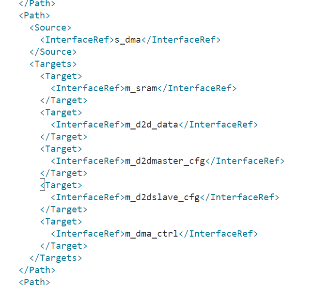
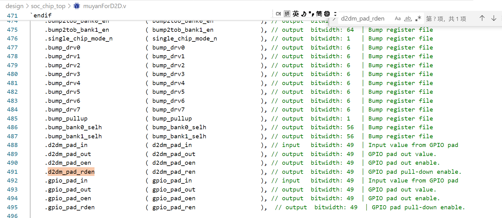

### "Flipped" and "Decoupled" in Chisel

#### Flipped

- **Purpose**: The `Flipped` method indicates that a particular port is an input to the module instead of an output. This is particularly useful in the context of module instantiation, where you want to define the direction of a signal.
- **Usage**: By flipping a signal, you indicate that the master (the device initiating the transaction) drives the signal, while the slave (the device responding) receives it.

#### Decoupled

- Usually, we use the utility function [`Decoupled()`](https://chisel.eecs.berkeley.edu/api/latest/chisel3/util/Decoupled$.html) to turn any type into a ready-valid interface rather than directly using [ReadyValidIO](http://chisel.eecs.berkeley.edu/api/latest/chisel3/util/ReadyValidIO.html).

  - `Decoupled(...)` creates a producer / output ready-valid interface (i.e. bits is an output).
  - `Flipped(Decoupled(...))` creates a consumer / input ready-valid interface (i.e. bits is an input).

- Take a look at the following example Chisel code to better understand exactly what is generated:

  ```scala
  import chisel3._
  import chisel3.util.Decoupled
  
  /**
    * Using Decoupled(...) creates a producer interface.
    * i.e. it has bits as an output.
    * This produces the following ports:
    *   input         io_readyValid_ready,
    *   output        io_readyValid_valid,
    *   output [31:0] io_readyValid_bits
    */
  class ProducingData extends Module {
    val io = IO(new Bundle {
      val readyValid = Decoupled(UInt(32.W))
    })
    // do something with io.readyValid.ready
    io.readyValid.valid := true.B
    io.readyValid.bits := 5.U
  }
  
  /**
    * Using Flipped(Decoupled(...)) creates a consumer interface.
    * i.e. it has bits as an input.
    * This produces the following ports:
    *   output        io_readyValid_ready,
    *   input         io_readyValid_valid,
    *   input  [31:0] io_readyValid_bits
    */
  class ConsumingData extends Module {
    val io = IO(new Bundle {
      val readyValid = Flipped(Decoupled(UInt(32.W)))
    })
    io.readyValid.ready := false.B
    // do something with io.readyValid.valid
    // do something with io.readyValid.bits
  }
  ```

  ### FIFO vs. queue

  **FIFO** is a specific type of queue focused on the order of operations, while **queues** can be more versatile and may include various additional functionalities. In hardware contexts, FIFO often refers to a dedicated implementation with specific behavior and performance characteristics.

  在D2D这个代码里，QUEUE是对FIFO的调用，体现在给出了fifo.rd.pop的激励。针对FIFO在rd.valid已经拉高但是外部rd.ready没有拉高时(情况1)会造成的rd.bits为不定态/高阻态情况，设计了一套机制，使QUEUE的rd.bits输出“在rd.fire时显示被握手的rd.bits，而在情况1下显示即将但还没被握手的rd.bits“，（以下为推测），**目的是？？？**


### 递归查找文件名：find -r . -name xxx.v

### 递归查找文件内容：grep -r xxxx .


目标器件：CU106 Evaluation Platform xczu7ev-ffvc1156-2-e


### 与王学长讨论要点

1. PHY.v是一个spice网表，里面的top模块是顶层接口，除了已经列出来的接口外，应该把DATA_IN（tx的输入）和DATA_OUT（rx的输出）接出来(输出时钟也应该接出来)。PHY.v已经把tx和rx的物理层接好了，输入是一个clk和data,输出是一个clk和data
2. 用virtuoso可以完成verilog文件的数模混合仿真
3. virtuoso有一个定制的库，需要王学长发过来
4. 需要用到tsmc28的标准库


#### BUG: 跑vivado仿真波形提示Unable to open file because file does not have read permission.

问题描述：跑d2d_test_106工程的仿真波形时提示Unable to open file 'zynq_ultra_ps_e_vip_v1_0_8_apis.sv' because file does not have read permission. 按照提示点击open directory之后提示Unable to launch the File Browser。

##### 尝试方法1：更改对应文件权限。从775改成777


更改后


关闭simulation窗口，重新开始simulation，没用

观察Tcl console，卡住的地方如下：


在Vip_test.v中确认卡住的行为第一次出现read_data的行


从tcl console中确认，M_AXI_GP0（对应bd中的M_AXI_HPM0_FPD）已经正常ENABLED，而M_AXI_GP2（对应bd中的M_AXI_HPM0_LPD）正常DISABLED。奇怪的是，在510ns的时候，AXI READ操作提示由M_AXI_HPM0_LPD完成，此时M_AXI_HPM0_LPD已经DISABLED，所以自然会报错。


是不是有可能地址域分配错了？

随后由打印出来的信息Starting Address通过全局搜索定位到文件./d2d_test_106.gen/sources_1/bd/d2d_test/ipshared/da1e/hdl/zynq_ultra_ps_e_vip_v1_0_8_apis.sv

一看果然是这个问题。可见VIP_test.sv中指定的0x80020004地址属于M_AXI_HPM0_LPD的地址域（即start_addr[31:28]===4'b1000），所以传输失败。


尝试改为M_AXI_HPM0_FPD的地址域start_addr[31:28]===4'b1010，即最高位为a。将VIP_test.sv中所有的最高位由8改为a，可以work，输出结果如下：


尝试将访问dma.idle的地址从0xa0020004改成0xa0200004，response会显示OKAY。


观察地址分配发现0xa2000004才是正确的CDMA.idle的地址（emmmmm），重新实验


#### 数模联合仿真可以参考的比较详细的flow：

VCS+XA (两个软件都可以通过module load加载)

参考博客

[数模混合仿真实例（数字verilog作为顶层）VCS+Xa (qq.com)](https://mp.weixin.qq.com/s/fCd311hou2GZvwmNj1HN-Q)

也可以使用VCS与hsim、finesim进行混合仿真。具体教程参见vcs官方guide（vcs.pdf）

至于使用Virtuoso用数字verilog作为顶层文件（并含IP），没有找到很好的方法

###### 暂定使用VCS+XA流程。

##### 项目分两步走：

1. 两个Die之间的PHY直连，搭建含DMA/SRAM/NIC/SPI的SOC系统，通过SPI控制Die-to-Die SOC系统运转（十一之前完成）
2. 加入PHY，用VCS+XA流程跑通整个工程


#### 新建文件夹并进入：mkdir src; cd $_


#### 使用vcs运行vcs -o counter -f counter_filelist.txt时，报错fatal error: gnu/stubs-32.h: No such file or directory


可能是缺少依赖库。安装i686库：sudo yum -y install glibc-devel.i686 glibc-devel。可以work!


尝试module load verdi/2018.09，提示找不到LD_LIBRARY_PATH


尝试1：在~/.bashrc中加上export LD_LIBRARY_PATH=/usr/local/lib。可以work!

最终,直接不需要所有的LICENSE和环境变量的设置，ilaunch vcs，解决所有问题。原因是用户登录节点没有存放license, license在远程计算节点，所以ilaunch可以解决license问题


#### 关于如何在不上板的情况下驱动SPI总线的问题，考虑使用一个UVM VIP来驱动。相关资料：

https://www.synopsys.com/blogs/chip-design/mastering-uvm-axi-vip-usage.html


#### SPI总线介绍

https://www.analog.com/en/resources/analog-dialogue/articles/introduction-to-spi-interface.html


#### SPI2AXI Bridge可参考

https://github.com/airhdl/spi-to-axi-bridge


#### Verdi仿真技巧

调出信号波形：单击uut后ctrl+4

调出选信号窗口：空格键+g


#### 配置NIC400

按照socrates使用教程配置NIC，path Matrix配置存疑：为什么m_axi_sram要去连s_axi_d2d，难道不应该是m_axi_sram通过dma去连d2d嘛？另外，为什么m_apb_dma不用去连s_axi_d2d，这样子难道dma的数据进得去d2d吗？


查看d2dphy里面的nic400.xml文件，可见贾学长的截图与实际生成的d2dphy中的IP不一样。实际生成的path matrix如下：




#### 向学长确认几个事情：

	1. 为什么SRAM是作为master出现的
	1. 为什么sram的线可以直连d2d，而不是连到dma_slave，由dma_master连到d2d_slave
	1. memory map界面如何取消对所有slave interface的绑定？
	1. 为什么用APB DMA，是因为没有AXI DMA吗


按socrates使用文档操作，可以生成RTL代码


#### **axi_interconnect中一从对多主的模式下，总线接口是怎么选择的**

AXI Interconnect主从选中是通过不同地址映射关系实现的，完成这一功能的是其内部的AXI Crossbar。


#### GPV (Global Programmers View)


#### 在新建coreConsultant Workspace时遇到问题：DESIGNWARE_HOME环境变量not set 

（找到了，应该在/capsule/eda/synopsys/designware2020/下面的各个IP里）


DW_axi_x2h是从AXI到AHB的桥IP

DW_axi是一个AXI的crossbar


SRAM接到AXI总线上可以用axi_gs

https://www.synopsys.com/dw/dwtb.php?a=sram_to_axi


决定使用简单的verilog来实现SRAM，预计使用Alex Forencich的verilog-axi Github项目中的axi_ram.v


#### DMA配置

S家的DMA是AHB接口，但NIC只支持AXI和AHB-LITE接口，好在DW_ahb_dmac开放了一个参数DMAH_M1_AHB_LITE，可以通过配置这个参数来把DW_ahb_dmac的接口配置为AHB-Lite，故而可以将dma直接接在nic上面

（见DesignWare DW_ahb_dmac_Databook)


考虑到如果没有CPU的介入，DMA/D2D这些都有自己的分离的data/ctrl接口（AHB_DMA有一套DMA Interface，D2D的master和slave都有一套AXI_LITE接口），总线挂载太麻烦。听了zh的建议，决定不手写SPI stimulus，而是挂一个ARM核来控制。


在system-on-chip-design-with-arm-cortex-m-processor.pdf的第39页也有一个AHB接口的SRAM.v文件可供参考


或者也可以尝试简单一点， 在vivado里面用VCS仿真？可以参考

https://adaptivesupport.amd.com/s/article/61846?language=en_US

这个提议很快被否决了，因为zynq核不能用于vcs仿真

https://adaptivesupport.amd.com/s/question/0D54U00007a12LvSAI/can-vcs-be-used-to-simulate-zynq-block-design?language=en_US

所以还是老老实实用arm吧


或者rocket chip？


### RapidSilicon IP ahb2axi_bridge axi2axilite_bridge生成

由于DW_axi_x2h是由AXI master向AHB slave转换的IP，而本系统需要的是从AHB_Lite master 向AXI slave转换的IP，故此弃用Synopsys的DW_axi_x2h，改用RapidSilicon 的ahb2axi_bridge。Github地址如下: https://github.com/os-fpga/IP_Catalog/tree/main/rapidsilicon/ip/ahb2axi_bridge/v1_0

这是一个通过配置参数生成IP的IP生成器。对于ahb2axi_bridge这个IP，可以配置的参数有data_width, addr_width, id_width。在运行生成脚本ahb2axi_bridge_gen.py过程中会提示缺少migen，litex这些库，需要注意的是，litex需要下载2023.8版本，不可以下载默认的2023.12版本，因为2023.12版本删除了build/osfpga，但是ahb2axi_bridge_gen.py需要这个子库。配置完之后运行脚本仍会报错，提示


只需要将ahb2axi_bridge_gen.py中的ClockDomain()改为ClockDomain("sys")即可成功运行。


### Conda虚拟环境相关命令

切换到虚拟环境目录下的bin，直接source activate，即可进入base环境。比如source /lamport/makkapakka/xuandalin/miniforge3/bin/activate

启动虚拟环境conda activate 虚拟环境名

查看虚拟环境conda env list


### 跑Muyan VCS提示cross-module reference resolution error

命令make run_vcs  TC=tc_soc_spi_debug_test  DEFINE=BUMP_SPI_DEBUG1


查看tb_2muyan.v


似无问题

原因是hierarchy出了问题，默认的top是tb_2muyan，里面例化了两个muyan，muyan里面才是u_dig_top。


### muyan0 (d2dm_tx) --> muyan1 (d2ds_rx): 

每个muyan中都有1个Md2dMaster和1个Sd2dSlave

总结：通过GPIO输出

m_io_tx_flit @ Md2dMaster (muyan0)

--> io_tx_flit_d2dm @ subsys_hsbus_top (muyan0)

--> d2d_m_tx_flit @ d2d_bump_ctrl (muyan0)

--> d2dm_pad_out @ d2d_bump_ctrl (muyan0)

--> d2dm_pad_out @ dig_top (muyan0)

(via PDUW08DGZ_H_G, d2dm_pad_out@I, PAD_D2DM_TX@PAD)

--> PAD_D2DM_TX @ muyanD2D (muyan0) 

--> d2d_s_rx @ muyanD2D (muyan1) 

--> bump_bank0_int_i @ dig_top (muyan1) 

--> bump_bank0_int_i @ d2d_bump_ctrl (muyan1)

--> d2d_s_rx @ d2d_bump_ctrl (muyan1)

--> io_rx_flit_valid_d2ds @ subsys_hsbus_top (muyan1)

--> s_io_rx_flit_valid @ Sd2dSlave (muyan1)

### muyan1 (d2dm_tx) --> muyan0 (d2ds_rx)

s_io_tx_flit_valid @ Sd2dSlave (muyan1)

--> io_tx_flit_d2ds @ subsys_hsbus_top (muyan1)

--> d2d_s_tx_flit @ d2d_bump_ctrl (muyan1)

--> bump_bank0_int_o @ d2d_bump_ctrl (muyan1)

--> bump_bank0_int_o @ dig_top (muyan1)

--> bump_bank0_int_o @ muyanForD2D (muyan1)

-->d2d_s_tx_flit @ muyanForD2D (muyan1)

--> PAD_D2DM_RX @ muyanForD2D (muyan0)

(via PDUW08DGZ_H_G: PAD_D2DM_RX@PAD, d2dm_pad_in@C)

--> d2dm_pad_in @ muyanForD2D (muyan0)

--> d2dm_pad_in @ dig_top (muyan0)

--> d2dm_pad_in @ d2d_bump_ctrl (muyan0)

--> d2d_m_rx @ d2d_bump_ctrl (muyan0) if wire_bonding_package==true

--> io_rx_flit_valid_d2dm @ subsys_hsbus_top (muyan0)

--> m_io_rx_flit_valid @ Md2dMaster (muyan0)


muyan原版代码中是没有PHY的！如下图为d2dMaster.v中的MMasterTxPhy module


### PDUW08DGZ_H_G模块理解

感觉像实现了GPIO接口（同样带OEN，可配置为输入/输出）

代码

```verilog
module PDUW08DGZ_H_G (I, OEN, REN, PAD, C);
  input I, OEN, REN;
  inout PAD;
  output C;

  wire   MG, pull_pad, pull_c;
  parameter PullTime = 10000;
 
  bufif0 (PAD_q, I, OEN);
  pmos   (MG, PAD_q, 1'b0);
  bufif1 (weak1, weak0) (PAD_i, 1'b1, pull_pad);
  pmos   (MG, PAD_i, 1'b0);
  pmos   (PAD, MG, 1'b0);
  bufif1 (C_buf, PAD, 1'b1);
  bufif1 (weak0,weak1) (C_buf, 1'b1, pull_c);
  buf    (C, C_buf);
  not    (RE, REN);
  buf    #(PullTime,0) (pull_pad, RE);
  buf    (pull_c, RE);

`ifdef TETRAMAX
`else
  always @(PAD) begin
    if (PAD === 1'bx && !$test$plusargs("bus_conflict_off") && $countdrivers(PAD))
      $display("%t ++BUS CONFLICT++ : %m", $realtime);
  end

  specify
    (I => PAD)=(0, 0);
    (OEN => PAD)=(0, 0, 0, 0, 0, 0);
    (PAD => C)=(0, 0);
  endspecify
`endif
endmodule
```

信号解释

1. **Inputs:**
   - `I`: The input signal that will be driven onto the output (`PAD`) based on the control signals.
   - `OEN`: Output Enable. When low (`0`), it allows the input `I` to drive the `PAD`. When high (`1`), it disables this driving.
   - `REN`: Read Enable. This is used to control pull-up/pull-down behavior.
2. **Inout:**
   - `PAD`: This is a bi-directional signal that can act as both an input and output depending on the control signals.
3. **Output:**
   - `C`: The output that reflects the state of the `PAD` signal after processing.

功能描述

- OEN 拉高时，I经过一级bufif0和两级pmos传递到输出PAD

- REN拉高时，与输出相关的节点（PAD_i-->关联PAD；C_buf-->关联C）被weak pullup，保证读到的不会是不确定的值。此时PAD的状态被反映在C

- PAD也可以作为输入，经过1级bufif1和1级buf，输出反映在C

其他

- PullTime的作用：The pull-up (or pull-down) action may take some time to assert fully, especially in high-speed designs. The delay helps ensure that the signal stabilizes before being sampled by other circuits.

  - 语法：

    - The syntax `buf #(delay, transition_time) (output, input);` specifies a buffer with defined timing characteristics.

      `delay`: The time it takes for the output to reflect a change in the input.

      `transition_time`: The time it takes for the output to change from one logic level to another.

- 为什么仅在RE的时候给weak pull up:

  - Weak pull-ups consume power, albeit less than strong pull-ups. If the pull-ups were always active, it could lead to unnecessary power consumption, especially in low-power designs.
  - In a tri-state environment, allowing signals to float can be necessary for proper operation. If pull-ups were always enabled, they could interfere with other active drivers on the bus or line, potentially leading to conflicts.

- bufif1, buf这些在控制信号有效时传的都是strong pull up 和strong pull down


问学长：

	1. PHY的文件是最新的吗？
	1. 为什么PHY里面的DATA_IN, DATA_OUT都是128的位宽呀，d2d代码里tx_flit_bits是16位宽，rx_flit_bits是8的位宽 (是不是3D的那种配置)（答：都是可配置的）
	1. 
	1. 为什么要有PHY（带宽匹配）
	1. 如何处理除了128位之外的信号，比如Package ID和Creditfree,是同步发送吗？


cfmom_2t

INVD18BWP30P140UHVT

BUFFD4BWP30P140UHVT

BUFTD12BWP30P140ULVT

rnwsti_m

rupolym_m

TIEHBWP30P140UHVT


### D2D测试

可以通过如下激励实现片间传输。

例：


预先向挂在AXI High-Speed Bus上的D2D master cfg端口0xC1000000写入pre_addr_in，比如写0x00000B00，表示需要访问的另一块muyan的地址是B00xxxxx，之后通过访问0xA00xxxxx（D2D master挂在AXI High-Speed Bus上的数据端口），即可访问B00xxxxx。

1. 验证muyan Master Tx --> Slave Rx (flit width = 16) & Slave Tx --> Master Rx (flit_width = 8)的正确性
   1. 方法：D2D是从一块muyan的memory搬到另一块muyan的memory，所以只要搬完之后对比两块memory中的数据是否一致就可以获悉是否正确
   2. 具体方法：
      1. 用reg_writex系列函数从muyan0写数据到muyan1，再用reg_read函数从muyan1读出，对比是否与写进的数据一直
      2. 用DMA从muyan0写数据到muyan1，再用DMA将写到muyan1的数据读回muyan0的不同位置，对比muyan0的两个位置数据是否一致
   3. 问题：
      1. muyan0读写B0090000地址（muyan1的NPU data），hs_bus总线上卡住不动
      2. 另需注意：如采用reg_write32函数写0x03，总线上传输的数据实际为0x03030303。由此知，需要写全输入数据
      3. 改成读写B0000000/004/008/00c地址，hs_bus总线读不出前三个写的信号，如图
      4. 写了1，2，3，4，但是只返回了一个非零的rdata=4。激励程序如图：
      5. 考虑在写之后添加1us的delay,对应函数为delay_1us(time)。测试程序如图。结果仍然错误，体现为从第二个写入数据开始，连续返回三个resp error,如图
      6. 考虑是因为在每次读写变换之前没有每次都写入preaddr_in，添加之后再次仿真。没用
      7. 考虑是因为CPU实际不允许读写Muyan1 NPU数据区域，考虑读写Muyan 1 NPU ctrl区域(preaddr_in=0x00000C00)。可以成功读出2，3，4，数据1（C00位置读出来是0）查看NPU ctrl寄存器分配，可知位置0为只读的状态寄存器。跳过该寄存器，读写寄存器正确。本部分完成。
2. 验证muyan Master Tx --> Slave Rx (flit width = 64) & Slave Tx --> Master Rx (flit_width = 64) 不经过GPIO口的正确性
   1. 方法：不经过GPIO，直连
3. 研究清楚D2D Link中，CreditFree和PkgID与flit及其valid期间需不需要满足什么时序关系？即，可否GPIO传输CreditFree和PkgID，PHY传输flit及其valid


- 


### D2D PHY传输中的Credit_free和Pkg_ID信号

Credit_free：单比特信号。由Receiver检测到1个信息量被consumed时发出，指示Sender的credit_counter+1，即可传输信息量+1。

- D2D slave Tx--> D2D master Rx DataLinkLayer --> D2D master Tx DataLinkLayer
  - 开始传输：1bit high
  - 后续3个周期：依次传输AR, AW, W通道的Credit_free。接收端通过移位寄存器接受满3个后，拉高valid，从而更新credit_counter（使credit_counter+1）
- D2D master Tx --> D2D slave Rx DataLinkLayer --> D2D slave Tx DataLinkLayer
  - 开始传输：1 bit high
  - 后续3个周期：依次传输B，R通道的Credit_free。接收端通过移位寄存器接受满2个后，拉高valid，从而更新credit_counter（使credit_counter+1）


Pkg_ID: 单比特信号。Receiver检测传输成功与否，如传输成功，返回成功传输的当前Pkg ID；如传输失败，返回成功传输的最近一个Pkg ID。Sender收到Pkg_ID后，与存储的上一个成功传输的Pkg_ID_last相比，若Pkg_ID == Pkg_ID_last + 1，表明传输成功，Sender无动作；若Pkg_ID == Pkg_ID_last，表明传输失败，Sender触发Replay机制重发。

- D2D slave Tx--> D2D master Rx DataLinkLayer --> D2D master Tx DataLinkLayer
  - 开始传输：1 bit high
  - 后续packageIDWidth个周期：从低位到高位依次传输


本周任务：

Tx 16根线，Rx 16根线，PHY 8G，总线256根线

UCIE的sideband怎么传

改d2d controller

模仿UCIE的方式加上sideband（包括credit和pkgid）


## D2D-Link代码中AsyncQueue和AsyncFIFO的区别

AsyncFIFO是被动的，要外界给出rd.pop信号才能输出

AsyncQueue是主动的，相当于把AsyncFIFO包了一层激励逻辑，只要自己觉得合适，就自动输出，所以rd.valid是其输出而不是输入。


## 改变文件夹权限为只读

chmod a=r foldername/

改变后，vscode无法读取文件夹内容，terminal无法读取文件夹内容

可用chmod 777 foldername/ 退出


## VNC中跑2muyan的仿真波形

ilaunch make run_vcs TC=tc_2muyan_boot

ilaunch make run_verdi TC=tc_2muyan_boot

需要注意：每次跑之前需要source setup.env（不可以./setup.env）


# D2D B/R通道无限重发问题Debug记录（2024.11.27-2025.01.13）

### 需求描述

`单笔传输`：通过FPGA上spi master向muyan上spi slave发出执行一笔片间AXI传输（AXI Write）的指令，数据由spi外设经CPU到HighSpeed Bus，进而进入D2D Master。D2D Master将该笔AXI Write打包并发送给FPGA上的D2D Slave，D2D Slave解包出AXI Write并将该笔数据写入BRAM。

需求：顺序执行多次单笔传输。

### 问题描述

第1笔传输正确写入BRAM，但AXI Slave往AXI Master发送WRESP通道信息时，出现D2D传输层面的无限重发，导致该笔AXI传输无法完成，muyan总线挂死。后续对muyan AHB, APB, HighSpeed三条总线的所有spi访问均失败。

### Debug过程

##### 尝试1：构建Vivado仿真工程，以AXI VIP对D2D Slave发起相同数据的写请求，对比D2D Slave Tx/Rx每条信号线传输的比特是否正确

D2D Slave Tx flit_bits & flit_valid & creditARW_free & pkgID均完全与仿真工程相符。

D2D Slave Rx flit_bits & flit_valid 完全与仿真工程相符。

ILA未见Vivado仿真工程中应有的用以释放R/B通道fifo的D2D Slave Rx creditRB_free

ILA捕捉到D2D Slave Rx pkgID为全f，指示Slave重发。（Vivado仿真工程中为0x0，即Master正确接收到R/B通道信息）

由上推测，或是Muyan中D2D Master逻辑错误，或是数据未正确被Muyan中D2D Master识别到。

D2D Slave Rx pkgID & creditRB_free示意

###### 

D2D Slave Tx 无限重发示例


##### 尝试2：用示波器点PCB上的tp引脚如下图，检验Slave Tx数据是否成功、正确到达tp引脚。

参Muyan_V1R2-diffclk.pdf


完全与ILA捕捉到的现象符合，说明数据成功到达该位置且依然十分干净。每个bit与预期相符。

##### 尝试3：检查XDC文件中所有约束（尤其是D2D、SPI相关的经FMC插槽上到PCB的信号约束）

与浙大项目crosscheck，XDC文件没有问题


与zcu106 user guide及PCB原理文件 对比


完全一致

##### 尝试4：修改muyan d2d Rx时钟和FPGA时钟为同一时钟源，在极低特定频率（muyan时钟4M，d2dMaster Tx时钟4M，FPGA时钟4M，spi时钟频率0.7M）情形下可以稳定有2-3笔随机位置传输成功，其余失败，且大概率挂死muyan总线。

实验结果如下：（0x2333为未写入BRAM（失败传输））


##### 尝试5：通过构建DONT_TOUCH的LUT延时链，调整muyan时钟与muyan d2dmaster rx时钟之间的相位

构建LUT延时链如下：


没有任何作用

##### 尝试6：用万用表测量tp引脚与PCB板上芯片IO PAD引脚之间电阻，看看是否有断路出现

电阻均稳定在1Ω左右，正常且无断路。

##### 尝试7：肉眼观测PCB设计文件Muyan_V1R2-diffclk.pdf中是否存在短路、断路或信号错接

无上述异常。

##### 尝试8：怀疑为PCB损坏或用以固定芯片的Socket损坏或muyan芯片损坏

均进行更换，无效

##### 尝试9：怀疑为时钟沿不匹配，抓取muyan时钟、D2D master Tx/Rx 时钟，发现肉眼看确实满足逻辑中上升沿发送、下降沿接收的setup/hold要求

蓝线：D2D Master Rx Clock (tp3)；黄线：Muyan Clock (k3)，muyan PCB开关：左


蓝线：D2D Master Tx Clock (tp15)；黄线：Muyan Clock (k3)；muyan PCB 开关：左


##### 尝试10：测量D2D Master Rx 信号电压摆幅，发现普遍仅有1.2-1.3V，接近1.8V电平标准下的最低输入高电平（VIH）（按70%VDD算，约1.26V），信号可能掉进中间地带，导致muyan有一定概率出现识别错误，与之对比，D2D Master Tx信号电压摆幅均为标准1.8V。由此向焦老师反映后，发现是D2D Master Rx这部分的芯片GPIO PAD同时开启了输入使能和输出使能，造成PAD冲突。禁用这部分GPIO的output pull-down enable之后，D2D Master Rx信号电压摆幅上升到3.8V（仅测量了D2D Master Rx Clock），D2D工作终于正常，可以在75MHz下稳定work。

下图为捕捉到的D2D Master Rx Valid信号，远远达不到1.8V


下图为浙大项目联测的同muyan不同PCB的Muyan D2D Master Rx Clock，同样徘徊在1.2V左右


下图为d2d_bump_regfile.v中的出错寄存器




将该寄存器（0x22020040）改为32'h000ff000，即将Muyan D2D Master Rx这部分的GPIO pad out enable关掉后，正常work。


如上图，事实上，这部分GPIO的输出使能已经被禁用了，真正让d2d work的是开路掉pad的下拉电阻？（看代码感觉是上拉电阻，需确认），参上文PDUW08DGZ_H_G模块理解：


最终，muyan d2d master rx时钟呈现出3.8V的电压摆幅（似不正常，因FPGA IOstandard是1.8V）


D2D输出正常


##### 后续1：Muyan CPU提频

通过PLL控制。给PLL输入24MHz，通过调参数，使Muyan CPU PLL和Tx PLL各输出目标值。

最终实现CPU@300MHz, D2D@300MHz

IIC总线可以用来控制供电

```
ol.iic.send(address=0x75, data=bytes([1]), length=1)
ol.iic.send(address=0b0101011, data=bytes([0b00010000, 50]), length=2)
```

50代表的位置有一个滑动变阻器，调为50本身应该是muyan供电0.9V，但实际观测发现只有0.7V。将50稍微减小到45，42，39，可见muyan供电电压上升。