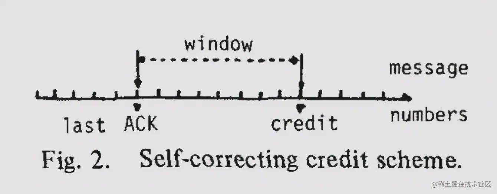

### Credit-based flow control

https://juejin.cn/post/7042193831445397511

#### 流控

防止网络在拥塞的情况下出现丢帧。

Credit-based flow control本质上是receiver对sender的一种背压（backpressure）机制。其前身源于TCP滑动窗口。

#### TCP滑动窗口

在上面这张图中，假设在一对网络通信节点之间：

- Sender 生产数据的速率是 2MB/s，Receiver 消费数据的速率是 1MB/s，数据在网络中传输的速率是 2MB/s。
- 两个节点各有一个数据缓冲区（Send Buffer/Receive Buffer)，大小均为 5MB。

可以推演出，由于 Sender 生产数据的速度比 Receiver 消费数据的速度快， 5s 后 Receive Buffer 就被装满了，这时会面临两种情况：

- 如果 Receive Buffer 是有界的，那么新到达的数据就只能被丢弃掉了。
- 如果 Receive Buffer 是无界的，那么 Receive Buffer 会持续扩张，最终会导致 Receiver 端内存耗尽。

所谓流控，就是解决端到端的**发送方和接收方速度不匹配**的问题。或者更明确一点，就是解决 “Fast Sender Slow Receiver ” 的问题。

所谓流控方案，就是提供一套速度匹配措施，通过遏制 Sender 较快的发送速率，与 Receiver 较慢的读取速率相适应。

方案一般有两种。

**思路一**：简单粗暴地限速。(Rate-based flow control)

Sender 以预先确定的速率发送数据。比如在 Sender 端实现一个限速器，将 Sender 的发送速率降到 1MB/s ，这样的话， Sender 端的发送速率跟 Receiver 端的处理速率就可以匹配起来了。

**思路二：**授权发送

Sender 不能直接发送，除非它已经从 Receiver 接收到一个关于**可接受通信量**的指示。这种量化方案保护了 Receiver 端不会内存溢出。这里的**可接受通信量**，常常被称为授权（Credit）。

基于TCP滑动窗口机制的流控方案是Credit-based Flow Control的一种实例，称之为Self-Correcting Credit Scheme.

#### Credit-based flow control的直观理解

在用于数据传输的网络中，我们常常能看到一些缓冲区（Buffer）。比如我们在前言例子中看到的 Send Buffer 和 Receive Buffer。这些 Buffer 有什么作用呢？

类比生活中，我们沿着河流建造串联大坝的场景。大坝的好处是什么呢？我们可以开放地思考一下：

首要好处是有“缓冲”的作用：大坝的存在为大坝附近居民用水提供了便利，如果没有大坝，短时间突然增加用水量时，就只能等待“远水救近火”了。

其次，大坝有“反馈式”的防洪作用。每当一个下游大坝充满时，它的上游大坝就会被通知截流。那么，当发生洪水时，每个上游大坝都可以帮助缓解下游拥堵点的洪水，每座大坝的容量都得到了有效利用。

传输数据的网络中，一开始设计 Buffer 的目的，主要用于处理因为各种原因而产生的设备性能波动，导致设备之间效率不协调的问题。这就像我们生活中的大坝能够调节用水量波动一样。

Credit-based Flow Control 的思路就是如此。

在大坝防洪的例子中，每当一个大坝充满时，它的上游大坝就会被通知截流。也就是说，下游大坝向上游大坝反馈的是它的蓄水量信息。

类似地，在 Credit-based Flow Control 中，Receiver（下游节点）可以将自己 Buffer 占用情况的信息反馈给 Sender（上游节点），从而调节 Sender 的数据发送量。这里，我们将这个需要反馈的信息称为 Credit，如下图所示。

#### Credit-based Flow Control 的优点：

- 理论上，Receiver Buffer 永远不会溢出。
- 流量控制是动态的，可以让 Receiver 一直工作（Keep Receiver Very Busy）。
- 去中心化。每个Actor，发现上游有数据可读，且下游有空间可写，那它就可以工作，不需要知道其它 Actor 的状态。

#### Credit-based Flow Control 需要考虑的具体问题

- 如果 Credit 丢了怎么办？
- 传输 Credit 有一定的开销，具体的系统是否能够接受？
- 大坝的容量如何选择

# 信号传输中Credit机制和Valid-ready机制的优劣

Valid-ready握手（AXI）：数据传输通过Valid和ready信号进行同步，发送方使用valid表明数据有效，接收方用ready信号表明接收数据。当两者都是高电平时，数据被成功传输。

### 优点：

\1. **简单性**：实现起来简单，容易理解。

\2. **低延迟**：只要两个信号就绪，数据立即传输。

\3. **确定性**：简单的握手机制使得数据传输更加可预测。

### 缺点：

\1. **低效率**：在[高并发](https://zhida.zhihu.com/search?content_id=623685974&content_type=Answer&match_order=1&q=高并发&zhida_source=entity)或多主体环境下，可能造成信号冲突和等待，降低吞吐量。

\2. **扩展性差**：在大规模系统中，流量控制可能不够灵活。

Credit 机制（CHI）

在CHI协议中，接收方为发送方提供一组“信用”（credits），每当数据成功接收，消耗一个信用。当信用用完时，发送方必须停止发送数据，直到接收到新的信用。

### 优点：

\1. **高吞吐量**：可以进行更高效的数据传输。

\2. **流量控制**：通过动态[信用分配](https://zhida.zhihu.com/search?content_id=623685974&content_type=Answer&match_order=1&q=信用分配&zhida_source=entity)，可以更精细地控制数据流。

\3. **可扩展性**：适用于大规模或复杂的系统架构。

### 缺点：

\1. **复杂性高**：需要更复杂的逻辑来管理信用和流量控制。

\2. **调试难度**：由于复杂性，找出问题和调试可能更困难。

总结来说，Valid-Ready 握手适用于简单、确定性高的场景，而Credit 机制更适用于需要高吞吐量和可扩展性的复杂系统。