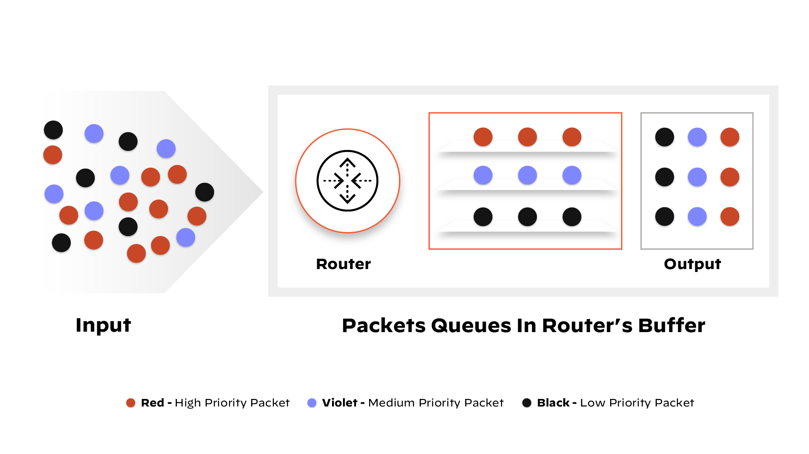
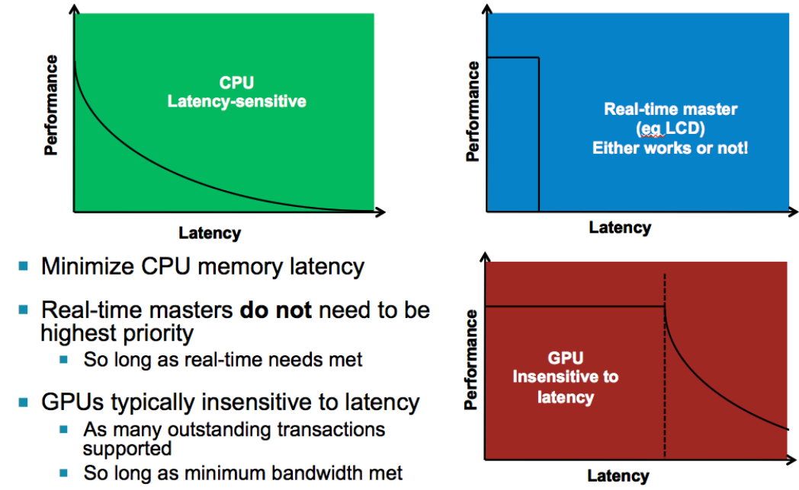
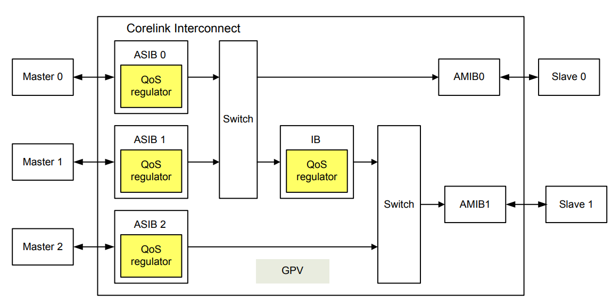
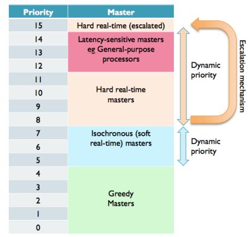

### Quality of Service (QoS)

def: a set of technologies that work on a network to guarantee its ability to dependably run high-priority applications and traffic under limited network capacity

QoS gives priority to the appropriate packets. Bandwidth is strategically allocated to deliver the highest service levels in a limited amount of time.

For example, video call packets are priority over email download packets because video conferences occur in real time.

The QoS tool views packet headers in order to successfully prioritize. The packet header contains information about the packet like where it came from, and where it's going

The queuing mechanism allows for packets within traffic flows to be stored until the network is ready to process it.

QoS ensures the most important activities on a network are not starved of bandwidth by activities of lower priority, which is for the name "Quality of Service"

<u>*below from arm SoC QoS whitepaper*</u>

1. for QoS, Masters can be categorized into three broad classes:
   1. **Latency-sensitive masters**: general purpose CPU et.al. CPU can usually work for a very short time, excepting it needs results of read transactions (either data or instructions)!! --> read transactions compromise CPU performance and thus system performance. CPU should receive higher priority.
   2. **Greedy masters**: DMA GPU et.al. can use up all or most of the bandwidth available to them for a period of time. 
   3. **Real-time masters:** have hard real time latency requirements, for example an LCD or HDMI display controller.
   4. 
2. a well-designed QoS system should:
   1. Ensure that real time master latency requirements are met (primary concern)
   2. minimize latency for latency sensitive masters
   3. allocate the remaining bandwidth to Greedy Masters
3. AMBA AXI4 QoS handling
   1. Priority is indicated on a 4-bit QoS Priority Value. Masters are assigned to one or more priority levels, indicated using the QoS 4 bit field.
   2. for out-of-order return, in NIC-400, masters with the same QoS Value are deemed within the same priority group and arbitration between these masters proceeds on a round-robin basis.
   3. Any priority system should take info account the possibility that low priority masters may starve. in the ARM DMC-400 for example a timeout can be programmed to raise the priority of a low priority master if it's been waiting for an excessive period.
4. Regulation-based mechanisms. Prevent congestion by limiting the rate and / or number of transactions into the interconnect. 
   1. Issue Rate Regulation Mechanisms (TSPEC Transaction Specification Regulation): specifying a desired transaction rate for a specified master beforehand. Useful for masters that need a constant rate of data flow like Video controllers and display controllers
   2. Outstanding Transaction Regulation: limit the number of simultaneous outstanding transactions from a master. Useful for GPUs, DSP and DMA.
   3. Dynamic priority-based mechanisms: dynamically vary the QoS priority value to achieve target long term average bandwidth. Useful for devices that are not real-time and require a desired long-term average latency & bandwidth. Control the speed to change QoS value, should be moderate.
   4. Transaction Latency-based priority regulation: measure the time between a transaction initiation and transaction completion, thus measuring transaction latency. The QoS  priority value is then adjusted up or down in order to match the desired target latency as closely as possible.
   5. Address Request Latency-based priority regulation: all the same as 4 but measures the time between the previous transaction initiation and the next transaction initiation
   6. Credit-based mechanisms: using QoS Virtual Netwroks (QVN) in AMBA AXI4, QVN enables the memory controller to reserve a certain number of transactions slots for high priority masters. In a system with QVN, the memory controller hands out 'credits' to masters and a master must obtain a credit before initiating a transaction. QVN puts the slave in control and ensures that transactions are not initiated unless they can be accepted at their destination, thus ensuring that low priority transactions blocking higher priority transactions behind them in the interconnect

5. QoS Priority Assignment in Practice (ranged from 0(lowest) to 15(highest))
   1. Latency-sensitive master are those whose performance highly affected my latency such as general purpose CPUs (eg ARM Cortex-A –class processors). These should be assigned the highest default latency. However to enable real-time masters to escalate their priority in times of near-starvation, latencysensitive masters should not be assigned a priority of 15, but slightly lower, eg in the range 12 – 14.
   2. Real-time masters should be assigned a priority lower than the latency-sensitive masters but with the ability to escalate their priority to higher than latency-sensitive master (eg all the way up to the maximum of 15) at times of near starvation (ie when there’s risk of FIFO under-run occurring). This escalation may be either via the use of a dynamic priority QoS mechanism, or the master could drive the 4-bit QoS value directly itself to indicate escalation due to a low-FIFO condition.
   3. Greedy masters should be assigned the lowest priority such that they use up any remaining bandwidth in the system.
   4. Masters with less strenuous real-time requirements, eg isochronous masters needing a constant data rate (such as audio or video decode for example) should be assigned initial priorities above the lowest priority greedy masters and make use of dynamic priority QoS schemes to increase or decrease their priority within a range to maintain the desired data rate.
   5. 
6. Combining Multiple QoS Strategies Simultaneously
   1.  Generally two schemes targeting the same bandwidth or latency target would not make much sense, rather one setting a target average and another setting a minimum or maximum could be advantageous. For example TSPEC regulation sets an upper bound on the bandwidth that a master can take &&  a dynamic priority based scheme that alters priority to achieve a target latency or bandwidth