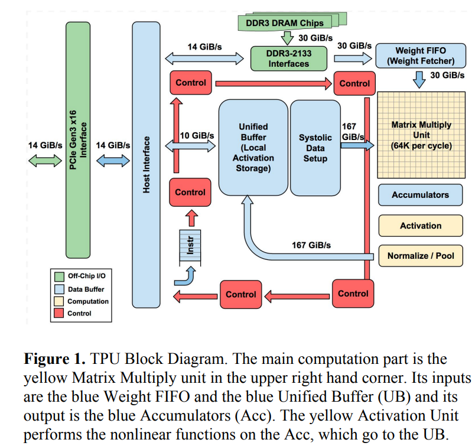
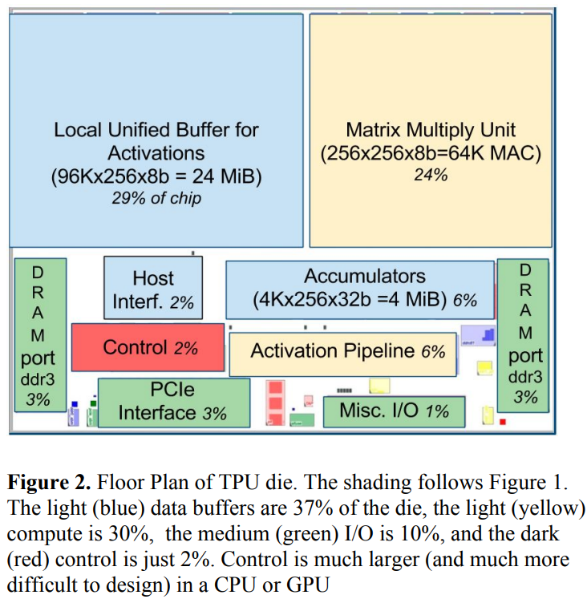

---

layout:     post
title:      TPU
subtitle:   TPU
date:       2025-05-12
author:     George Lin
header-img: img/post-bg-ios9-web.jpg
catalog: true
tags:

- Accelerator

---

# TPUv1

以下参考google论文：In-Datacenter Performance Analysis of a Tensor Processing Unit

TPU(Tensor Processing Unit)性能指标：

- 核心是256\*256个8-bit MAC
- 时钟频率700MHz
- 峰值吞吐率92TeraOps/Second (TOPS)（每个MAC乘和加各算一次操作，则可通过$2\times 256\times 256 \times 700\times 10^6 \div 10^{12} = 92TOPS $）计算得到
- On-chip Memory: 28MB
- 整个TPU作为一个协处理器，与GPU一样通过PCIe插槽与CPU等连结。这样松耦合，方便分开设计。

