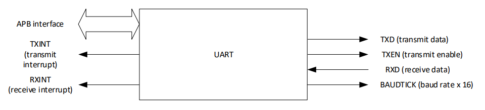
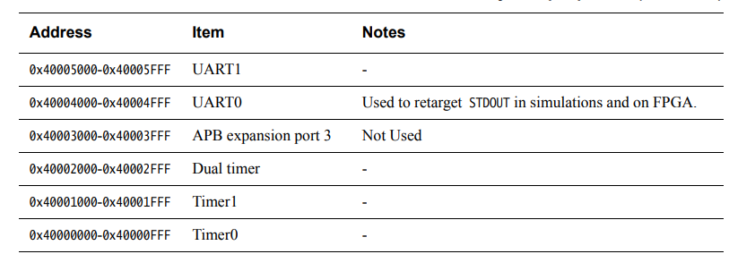

#### UART整理

https://www.analog.com/en/resources/analog-dialogue/articles/uart-a-hardware-communication-protocol.html

https://electronics.stackexchange.com/questions/251341/how-does-uart-know-the-difference-between-data-bits-and-start-stop-bits

system-on-chip-design-with-arm-cortex-m-processors.pdf的213页

UART (Univeral Asynchronous Receiver / Transmitter)


The transmitting UART is connected to a controlling data bus that sends data in a parallel form. From this, the data will now be transmitted on the transmission line (wire) serially, bit by bit, to the receiving UART. This, in turn, will convert the serial data into parallel for the receiving device.

UART只有两根线，一根发数据，一根收数据。

##### Transmitter和Receiver之间如何保持数据传输的正确?通过一样的波特率

For UART and most serial communications, the baud rate needs to be set the same on both the transmitting and receiving device. The baud rate is the rate at which information is transferred to a communication channel. In the serial port context, the set baud rate will serve as the maximum number of bits per second to be transferred.

##### UART总结


没有时钟！！

##### UART如何知道传输什么时候开始什么时候结束？通过Start Bit (1 bit) 和Stop Bits (1 to 2 bits)

##### UART packet格式：


##### Start Bit

The UART data transmission line is normally held at a high voltage level when it’s not transmitting data. To start the transfer of data, the transmitting UART pulls the transmission line from high to low for one (1) clock cycle. When the receiving UART detects the high to low voltage transition, it begins reading the bits in the data frame at the frequency of the baud rate.

##### Data Frame

The data frame contains the actual data being transferred. It can be five (5) bits up to eight (8) bits long if a parity bit is used. If no parity bit is used, the data frame can be nine (9) bits long. In most cases, the data is sent with the least significant bit first.

##### Parity

Parity describes the evenness or oddness of a number. The parity bit is a way for the receiving UART to tell if any data has changed during transmission. Bits can be changed by electromagnetic radiation, mismatched baud rates, or long-distance data transfers.

After the receiving UART reads the data frame, it counts the number of bits with a value of 1 and checks if the total is an even or odd number. If the parity bit is a 0 (even parity), the 1 or logic-high bit in the data frame should total to an even number. If the parity bit is a 1 (odd parity), the 1 bit or logic highs in the data frame should total to an odd number.

When the parity bit matches the data, the UART knows that the transmission was free of errors. But if the parity bit is a 0, and the total is odd, or the parity bit is a 1, and the total is even, the UART knows that bits in the data frame have changed.

##### Stop Bits

To signal the end of the data packet, the sending UART drives the data transmission line from a low voltage to a high voltage for one (1) to two (2) bit(s) duration.

注意：UART每个package中的data bit数量是预先确定的5-8中的一个数

##### [How does UART know the difference between data bits and start/stop bits?]

It is *detecting* the start bit. That's exactly the purpose of it. The idle line will look like this:

```
...1111111111111111111111111111111...
```

Once the receiver is seeing `0` after a long time of ones (or after a stop bit, as we will see shortly), it knows the transmission is started and starting to *count* bits. It knows that `8` bits (or as defined by configuration) after the start bit are data. The ninth one is the stop bit and should be `1`. If it is not - framing error occurs and resynchronization is required.

After stop bit is received, it is starting to wait for the start bit again. And so on.

Theoretically there can be a problem in synchronization if the line looks like:

```
..1010101010101010101.... 
```

or similar, so in this case the receiver won't see where to start, but in this case it won't really matter, as the start position won't make any difference. But in order to avoid such a problems some protocols define 1.5 (one and half) bit length for the stop bit to make it unique. Or, in practice there are always some time delays between two packets of data, so the line is idle for long enough to allow the receiver to synchronize.

#### ARM-Cortex-M0对UART的Programmer's model


system-on-chip-design-with-arm-cortex-m-processors.pdf的第213页同时附带了一个APB接口的UART Verilog设计代码

UART发出Transmit中断 ----> when write buffer is emptied

UART发出Receive中断  ---> when data is received



##### ARM-Cortex-M0关于UART的中断号


##### ARM-Cortex-M0 Example System关于UART的AHB Memory Map (注：UART挂在APB上)


##### ARM-Cortex-M0 Example System关于UART的APB Memory Map (注：UART挂在APB上)




