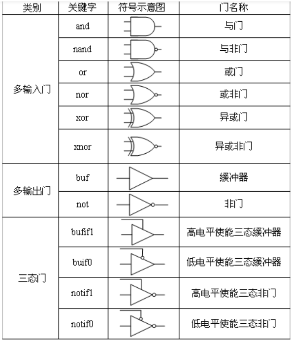

#### bufif1 (Verilog Primitive)

| buf  | buf g(out, in) | The buffer (buf) passes input to the output as it is. It has only one scalar input and one or more scalar outputs. |
| ---- | -------------- | ------------------------------------------------------------ |
|      |                |                                                              |

| bufif1 | bufif1 g(out, in, control) | It is the same as buf with additional control over the buf gate and drives input signal only when a control signal is 1. |
| ------ | -------------------------- | ------------------------------------------------------------ |
|        |                            |                                                              |

参考https://vlsiverify.com/verilog/gate-level-modeling/


#### Verilog pullup / pulldown

**pullup或pulldown只对对当前无驱动的线wire才会有作用，若有驱动应该按照驱动信号来决定！**
**当线wire为z时，pullup或pulldonw才起作用！**
也就是‘Z’可以变成‘1’或‘0’，而不是‘0’能变‘1’（‘1’变‘0’），否则就跟你设计想法不一样了。

https://www.cnblogs.com/Alfred-HOO/articles/15721507.html

### Verilog门级模型

and，nand, or , nor, xor, xnor, buf, not, bufif1, buif0, notif1, notif0



| buf    | buf u0(out, in)             | The buffer (buf) passes input to the output as it is. It has only one scalar input and one or more scalar outputs. |
| ------ | --------------------------- | ------------------------------------------------------------ |
| not    | not u0(out, in)             | The not passes input to the output as an inverted version. It has only one scalar input and one or more scalar outputs. |
| bufif1 | bufif1 u0(out, in, control) | It is the same as buf with additional control over the buf gate and drives input signal only when a control signal is 1. |
| notif1 | notif1 u0(out, in, control) | It is the same as not having additional control over the not gate and drives input signal only when a control signal is 1. |
| bufif0 | bufif0 u0(out, in, control) | It is the same as buf with additional inverted control over the buf gate and drives input signal only when a control signal is 0 |
| notif0 | notif0 u0(out, in, control) | It is the same as not with additional inverted control over the not gate and drives input signal only when a control signal is 0. |

For **and**, **nand**, **or**, **nor**, **xor**, **xnor**, **buf**, **not**

 gate (drive_strength) #(2delays) instance_name[range] (list_of_ports);

For **bufif0**, **bufif1**, **notif0**, **notif1**

 gate (drive_strength) #(3delays) instance_name[range] (list_of_ports);

For **nmos**, **pmos**, **rnmos**, **rpmos**, **cmos**, **rcmos**, **rtranif0**, **rtranif1**, **tranif0**, **tranif1**

 gate #(3delays) instance_name[range] (list_of_ports);

For **tran**, **rtran**

 gate instance_name[range] (list_of_ports);

 **pullup** (pullup_strength) instance_name[range] (list_of_ports);

 **pulldown** (pulldown_strength) instance_name[range] (list_of_ports);

**pmos** (data_out, data_in, ctrl);
**cmos** (data_out, data_in, n_ctrl, p_ctrl);

### Verilog specify 块语句

路径延迟用关键字 specify 和 endspecify 描述，关键字之间组成 specify 块语句。

specify 是模块中独立的一部分，不能出现在其他语句块（initial, always 等）中。

每条路径都有一个源引脚和目的引脚，将这些路径的延迟依次用 specify 语句描述出来，称为并行连接。

并行连接用法格式如下：

```
(<source_io> => <destination_io>) = <delay_value> ;
```

一个带有路径延迟的 4 输入的与逻辑模块模型描述如下：

```verilog
**module** and4(
  **output**    out,
  **input**     a, b, c, d);

  **specify**
   (a => out) = 2.5 ;
   (b => out) = 2.5 ;
   (c => out) = 3.5 ;
   (d => out) = 3.5 ;
  **endspecify**

  **wire**     an1, an2 ;
  **and**      (an1, a, b);
  **and**      (an2, c, d);
  **and**      (out, an1, an2);
**endmodule**
```

可以用关键字 specparam 在 specify 块中定义延迟数值常量，然后赋值给路径延迟。

specparam 定义的常量只能在 specify 块内部使用。

```verilog
specify
      specparam ab_2_out = 2.5 ;
      specparam cd_2_out = 3.5 ;
     
      (a => out) = ab_2_out ;
      (b => out) = ab_2_out ;
      (c => out) = cd_2_out ;
      (d => out) = cd_2_out ;
   endspecify
```

### verilog $monitor用法

monitor用于追踪变量的变化情况，在使用monitor时，当需要打印出的输出发生改变，则会自动打印出当前时刻的值。

例：

```systemverilog
module test;
    reg a;
    reg b;
    initial begin
        $monitor($time,,"a = %b, b = %b",a,b); //time代表仿真时间
        a = 0;
        b = 0;
        #1 a = 1;
        #1 b = 1;
        #2 a = 0;
        #4 a = 1; b = 0;
        #10 $finish; //or $stop
    end
```


