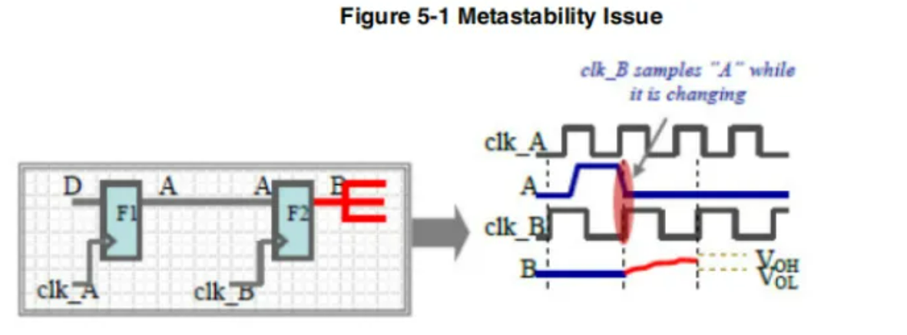
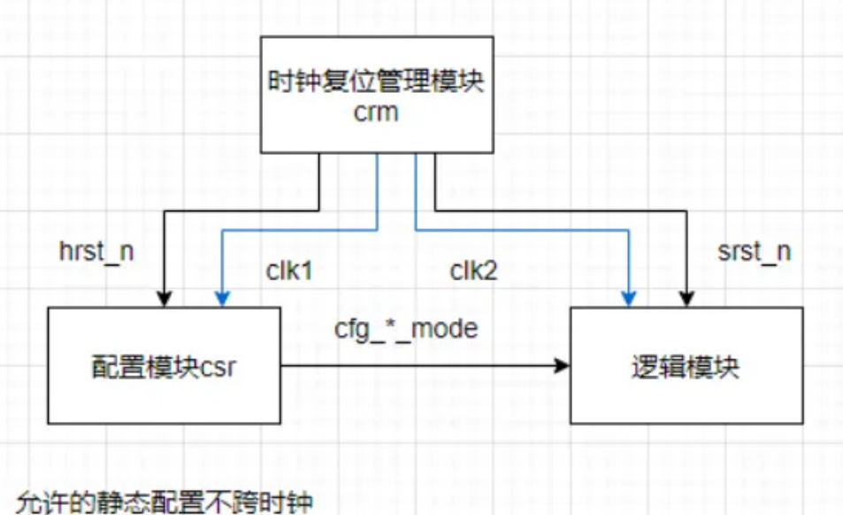
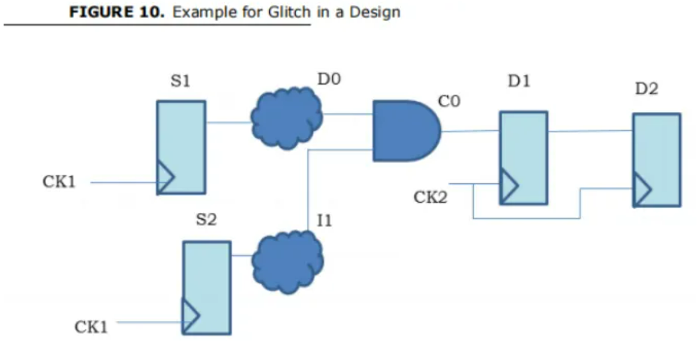
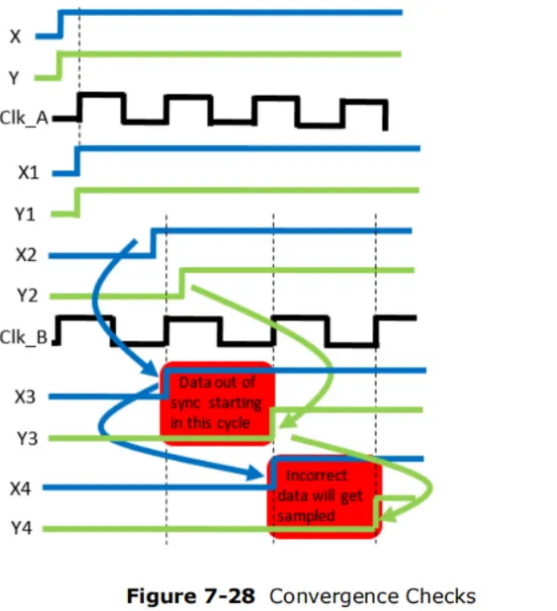
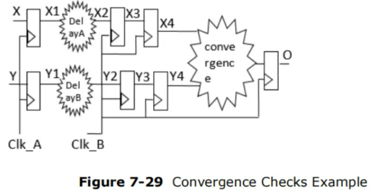
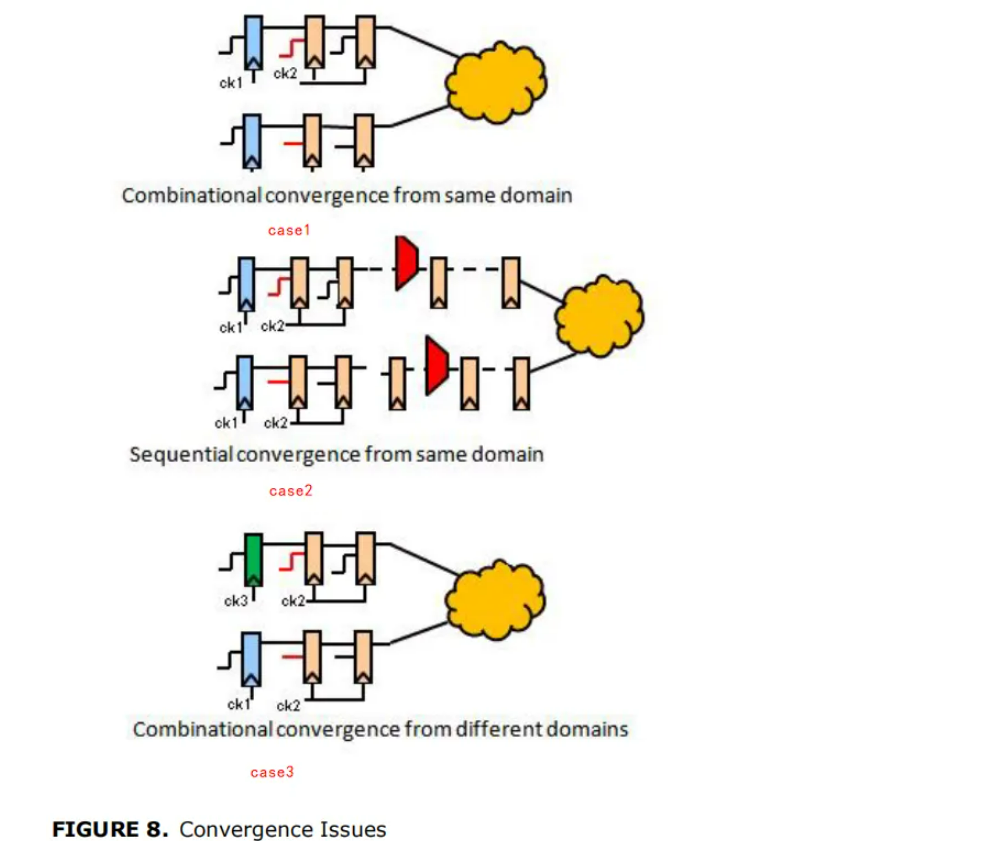

https://www.bilibili.com/video/BV1cj411i7zf?spm_id_from=333.788.player.switch&vd_source=6bdb3504029acf6961e3195b9ad841b9

# VC Spyglass 工具Lint检查默认使用的方法学说明位置

VC_STATIC_HOME/auxx/monet/tcl/GuideWare/soc/rtl_handoff/lint

VC_STATIC_HOME/auxx/monet/tcl/GuideWare/block/rtl_handoff/lint

# VC Spyglass Lint检查时有哪些goal？

以block检查目标为例，有lint_rtl, lint_rtl_enhanced, lint_formal_aware_rtl, lint_dccompat, lint_formality等共10个默认的goal

# Lint 各个goal主要检查内容是什么？

- lint_rtl（默认使用）：连接性检查，动态仿真相关检查，不可综合结构检查，RTL结构性检查
- lint_formal_aware_rtl:使用形式验证方法学对RTL进行lint检查，可进一步降低结果中的误报
- lint_dccompat：RTL可实现性检查，包含了使用DC进行综合时对RTL的基本要求
- lint_formality: 包含了使用formality等工具进行一致性比对时对RTL的基本要求

# 怎样在Lint检查时设置方法学要求以及检查目标集合？

# Spyglass中的跨复位域路径RDC问题

 

# Spyglass常见的合规与不合规的同步结构

CDC同步结构检查

复位信号同步结构

上图右图可以有效实现异步复位同步释放

# Spyglass Qualifier声明示例

# 层次化验证

spyglass自动抽取block中顶层需要知道的东西

SAM会向顶层屏蔽掉block中阴影部分的内容

# CDC Jitter流程

看到CDC报了汇聚，则需要手动check是否做了格雷码转换之类的处理，CDC Jitter流程可以主动插入随机Jitter来模拟产生上述10这一中间态的场景。

亮点是插入jitter的位置

可以通过tracediff看看插入不同jitter产生的动态仿真vcs波形是否有差别，从而自动判别。

# CDC功能检查（即有了正确的结构，结构能否有正确的功能）

功能性检查指Formal CDC Verification这一步

# RDC约束

# RDC实例

# CDC合规同步路径的抓取

# CDC路径的时钟信息

# Spyglass Check CDC常见会报的三种错误

该部分内容全部来自[Spyglass：你一定要懂的CDC错误](https://mp.weixin.qq.com/s/LfziGnPOxZNVMWqKgVHfNQ)

### 1、CDC Unsynchronized（没有跨时钟）

没有采用跨时钟模块，即咱们通常说的裸跨，不同时钟域的数据直接互连，会存在亚稳态问题。同步电路会进行STA（静态时序分析）保证setup-hold time满足要求，因此寄存器能够保证正确采样。而不同时钟域的信号之间没有setup-hold time要求，无法保证正确采样。

上图所示为亚稳态的案例，F1是clk_A时钟域的寄存器，F2是clk_B时钟域的寄存器，clk_A和clk_B是异步时钟，寄存器F1的输出信号A发生跳变的时刻有可能与clk_B的上升沿发生重叠，此时对寄存器F2来说，在setup-hold time时间区间内，输入A没有保持稳定，因此寄存器F2输出的B是不确定状态，这就是亚稳态。

**解决方案：**根据实际场景添加对应的跨时钟模块，例如bit同步器，脉冲跨时钟模块，异步fifo，多比特跨时钟等等。

**解读1**

没有跨时钟，不一定就是错误；在一些场景中，为了节约资源不跨时钟是允许的。

下图所示案例：配置模块csr模块产生的配置信号cfg_*_mode是clk1时钟域，直接用于clk2时钟域的逻辑模块。

在芯片使用过程中，复位和配置顺序如下：hrst_n先释放--->完成csr模块寄存器配置--->释放srst_n。

在srst_n复位释放后，静态配置cfg_*_mode不再发生改变。这种情况中，功能逻辑模块处于复位状态时，cfg_*_mode发生跳变，这种情况下即使发生了亚稳态也没有影响，因为功能逻辑模块还没允许。

**解读2：**

在部分握手机制的模块中，没有跨时钟，也能保证不会出现亚稳态。

CDC无法识别是否实现握手机制，如果跨时钟模块实现握手机制，即能够保证图中的F2准备采样时信号A已保持稳定，虽然会报错，但是不会出现亚稳态。在多bit的配置信号跨时钟模块中就存在这样的情况。

### 2、CDC Glitch （毛刺）

  简单来说，就是组合逻辑直接跨时钟，组合逻辑会存在glitch，导致glitch被目的时钟采样到，导致出现不期望的信号

**解决方案：**增加源时钟域寄存器打拍，寄存器输出的信号才跨时钟。

**特殊场景：**如果图10中的D0或者I1是一个准静态信号（几乎不会跳变的），那么不会产生glitch，也是可以接受的。

Glitches的产生有如下三种场景:

1）同一个bit信号的组合逻辑跨时钟

2）多个源时钟域的信号的组合逻辑跨时钟

3）同一个时钟域的多个源信号的组合逻辑跨时钟

### 3、CDC-Convergence（跨时钟重新汇聚）

  CDC-Convergence会产生不期望的信号组合，从而导致功能异常。

  如果多个信号从源时钟域通过不同的跨时钟路径进入目的时钟域，然后这些信号在目的时钟域中又聚合到一起，那么就有可能因为信号的重新聚合导致电路功能上的异常。例如下图中，x和y的组合（x，y）在同步前只有（1,1）和（0,0）的组合，在同步后出现了（1,0）的组合，还有可能出现（0，1）组合。

  如下图所示，X、X1、Y和Y1 属于clk_a时钟域，delay A和delay B表示不同的延时（走线延时），X3，X4，Y3，Y4属于clk_b时钟域。clk_a和clk_b属于异步时钟。X4和Y4作为输入进行组合逻辑获得O。

假设因为某些原因，x和y的组合（x，y）只会出现2'b00 或者2‘b11的情况。在正确设计过程中，我们期望x4和y4的组合（x4，y4）也只会出现2'b00 或者2‘b11的情况。但是由于不同的跨时钟路径会导致（x4，y4）出现错误组合。见图7-28，由于delay A和delay B的延时不同，导致X2和Y2到达同步器D端口的时间有差异，因此采样后的值X3和Y3可能会出现一个clk_b周期的差异，此时（x3，y3）出现了2‘b10的组合，此组合会传递到（x4，y4）。因此输出的Q可能是不符合预取的值。此为Convergence导致的错误

图8显示了3种汇聚的情况：

**case1：**同一个源时钟域的信号同步后立即汇聚在组合逻辑

**case2：**源时钟域信号同步后在目的时钟域打了若干拍后再汇聚。如果当目的时钟域打拍数量过大，例如20级，超过了spyglass 工具默认配置值，此种情况spyglass工具就无法检查出问题了。

**case3:** 不同源时钟域的信号同步后立即汇聚在组合逻辑

参考文档：VC_SpyGlass_CDC_UserGuide

# RTL级综合优化寄存器根源分析

# 复位信号定义

# 时钟关系检查

# Top Port的Reset

# TCM Timing Exception Confliction检查

左右三栏中的左边两栏相互冲突

# Lint连接性检查

# 如何在RDC中有效定义和约束Qualifier

