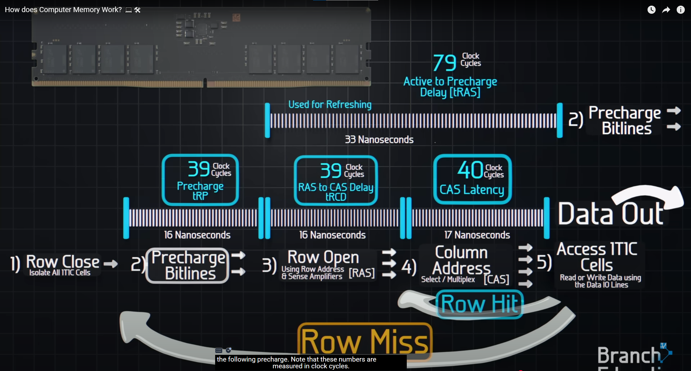

DRAM Typical Read/Write Speed: 17ns （3000x faster than SSD）

SSD Typical Read/Write Speed: 50us

DRAM limited to 2-D arrays ~16G

SSD 3D-arrays ~2T

every 64ms refresh one time. each refresh takes 3ms (row after row)

