来自ADI官网https://www.analog.com/cn/resources/analog-dialogue/articles/introduction-to-spi-interface.html

串行外设接口(SPI)是微控制器和外围IC（如传感器、ADC、DAC、移位寄存器、SRAM等）之间使用较广泛的接口之一。本文先简要说明SPI接口，然后介绍ADI公司支持SPI的模拟开关与多路转换器，以及它们如何帮助减少系统电路板设计中的数字GPIO数量。

SPI是一种同步、全双工、主从式接口。来自主机或从机的数据在时钟上升沿或下降沿同步。主机和从机可以同时传输数据。SPI接口可以是3线式或4线式。本文重点介绍常用的4线SPI接口。

### 接口

图1. 含主机和从机的SPI配置。

4线SPI器件有四个信号：

- 时钟(SPI CLK, SCLK)
- 片选(CS)
- 主机输出、从机输入(MOSI)
- 主机输入、从机输出(MISO)

产生时钟信号的器件称为主机。主机和从机之间传输的数据与主机产生的时钟同步。同I2C接口相比，SPI器件支持更高的时钟频率。用户应查阅产品数据手册以了解SPI接口的时钟频率规格。

SPI接口只能有一个主机，但可以有一个或多个从机。图1显示了主机和从机之间的SPI连接。

来自主机的片选信号用于选择从机。这通常是一个低电平有效信号，拉高时从机与SPI总线断开连接。当使用多个从机时，主机需要为每个从机提供单独的片选信号。本文中的片选信号始终是低电平有效信号。

MOSI和MISO是数据线。MOSI将数据从主机发送到从机，MISO将数据从从机发送到主机。

### 数据传输

要开始SPI通信，主机必须发送时钟信号，并通过使能CS信号选择从机。片选通常是低电平有效信号。因此，主机必须在该信号上发送逻辑0以选择从机。SPI是全双工接口，主机和从机可以分别通过MOSI和MISO线路同时发送数据。在SPI通信期间，数据的发送（串行移出到MOSI/SDO总线上）和接收（采样或读入总线(MISO/SDI)上的数据）同时进行。串行时钟沿同步数据的移位和采样。SPI接口允许用户灵活选择时钟的上升沿或下降沿来采样和/或移位数据。欲确定使用SPI接口传输的数据位数，请参阅器件数据手册。

### 时钟极性和时钟相位

在SPI中，主机可以选择时钟极性和时钟相位。在空闲状态期间，CPOL位设置时钟信号的极性。空闲状态是指传输开始时CS为高电平且在向低电平转变的期间，以及传输结束时CS为低电平且在向高电平转变的期间。CPHA位选择时钟相位。根据CPHA位的状态，使用时钟上升沿或下降沿来采样和/或移位数据。主机必须根据从机的要求选择时钟极性和时钟相位。根据CPOL和CPHA位的选择，有四种SPI模式可用。表1显示了这4种SPI模式。

| SPI 模式 | CPOL | CPHA | 空闲状态下的时钟极性 | 用于采样和/或移位数据的时钟相应 |
| -------- | ---- | ---- | -------------------- | ------------------------------- |
| 0        | 0    | 0    | 逻辑低电平           | 数据在上升沿采样，在下降沿移出  |
| 1        | 0    | 1    | 逻辑低电平           | 数据在下降沿采样，在上升沿移出  |
| 2        | 1    | 1    | 逻辑低电平           | 数据在下降沿采样，在上升沿移出  |
| 3        | 1    | 0    | 逻辑低电平           | 数据在上升沿采样，在下降沿移出  |

图2至图5显示了四种SPI模式下的通信示例。在这些示例中，数据显示在MOSI和MISO线上。传输的开始和结束用绿色虚线表示，采样边沿用橙色虚线表示，移位边沿用蓝色虚线表示。请注意，这些图形仅供参考。要成功进行SPI通信，用户须参阅产品数据手册并确保满足器件的时序规格。

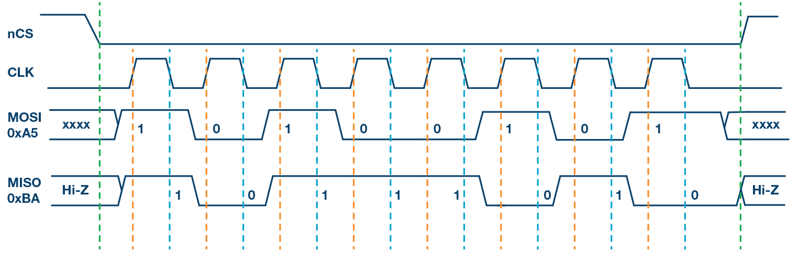图2. SPI模式0，CPOL = 0，CPHA = 0：CLK空闲状态 = 低电平，数据在上升沿采样，并在下降沿移出。

图3给出了SPI模式1的时序图。在此模式下，时钟极性为0，表示时钟信号的空闲状态为低电平。此模式下的时钟相位为1，表示数据在下降沿采样（由橙色虚线显示），并且数据在时钟信号的上升沿移出（由蓝色虚线显示）。

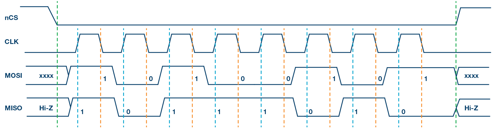图3. SPI模式1，CPOL = 0，CPHA = 1：CLK空闲状态 = 低电平，数据在下降沿采样，并在上升沿移出。

图4给出了SPI模式2的时序图。在此模式下，时钟极性为1，表示时钟信号的空闲状态为高电平。此模式下的时钟相位为1，表示数据在下降沿采样（由橙色虚线显示），并且数据在时钟信号的上升沿移出（由蓝色虚线显示）。

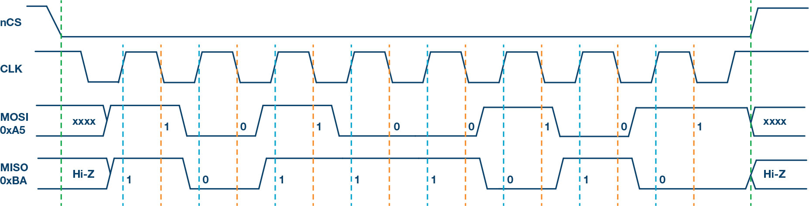图4. SPI模式2，CPOL = 1，CPHA = 1：CLK空闲状态 = 高电平，数据在下降沿采样，并在上升沿移出。

图5给出了SPI模式3的时序图。在此模式下，时钟极性为1，表示时钟信号的空闲状态为高电平。此模式下的时钟相位为0，表示数据在上升沿采样（由橙色虚线显示），并且数据在时钟信号的下降沿移出（由蓝色虚线显示）。

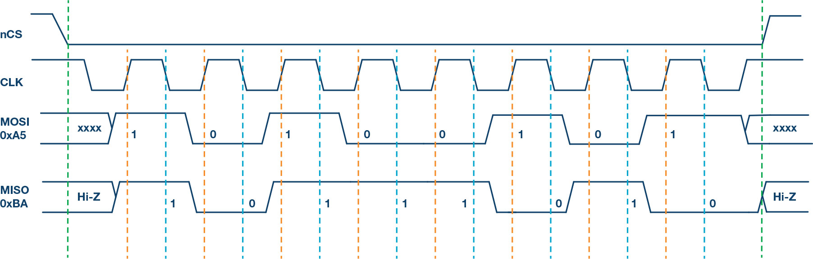图5. SPI模式3，CPOL = 1，CPHA = 0：CLK空闲状态 = 高电平，数据在上升沿采样，并在下降沿移出。

### 多从机配置

多个从机可与单个SPI主机一起使用。从机可以采用常规模式连接，或采用菊花链模式连接。

#### 常规SPI模式：

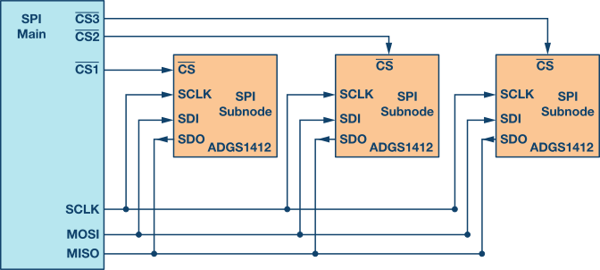图6. 多从机SPI配置。

在常规模式下，主机需要为每个从机提供单独的片选信号。一旦主机使能（拉低）片选信号，MOSI/MISO线上的时钟和数据便可用于所选的从机。如果使能多个片选信号，则MISO线上的数据会被破坏，因为主机无法识别哪个从机正在传输数据。

从图6可以看出，随着从机数量的增加，来自主机的片选线的数量也增加。这会快速增加主机需要提供的输入和输出数量，并限制可以使用的从机数量。可以使用其他技术来增加常规模式下的从机数量，例如使用多路复用器产生片选信号。

#### 菊花链模式：

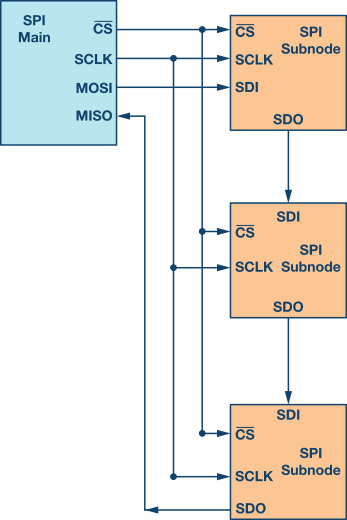图7. 多从机SPI菊花链配置。

在菊花链模式下，所有从机的片选信号连接在一起，数据从一个从机传播到下一个从机。在此配置中，所有从机同时接收同一SPI时钟。来自主机的数据直接送到第一个从机，该从机将数据提供给下一个从机，依此类推。

使用该方法时，由于数据是从一个从机传播到下一个从机，所以传输数据所需的时钟周期数与菊花链中的从机位置成比例。例如在图7所示的8位系统中，为使第3个从机能够获得数据，需要24个时钟脉冲，而常规SPI模式下只需8个时钟脉冲。图8显示了时钟周期和通过菊花链的数据传播。并非所有SPI器件都支持菊花链模式。请参阅产品数据手册以确认菊花链是否可用。

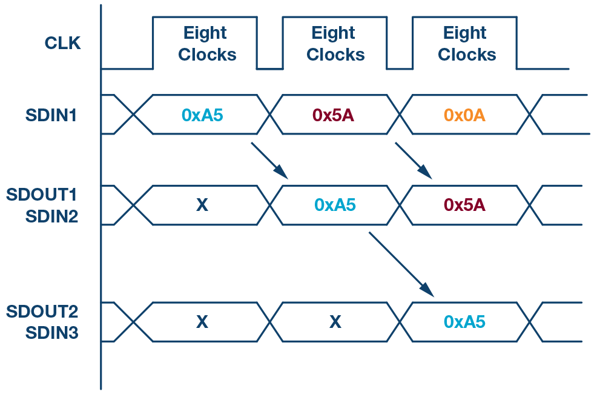图8. 菊花链配置：数据传播。

### ADI公司支持SPI的模拟开关与多路转换器

ADI公司最新一代支持SPI的开关可在不影响精密开关性能的情况下显著节省空间。本文的这一部分将讨论一个案例研究，说明支持SPI的开关或多路复用器如何能够大大简化系统级设计并减少所需的GPIO数量。

[ADG1412](https://www.analog.com/cn/products/adg1412.html) 是一款四通道、单刀单掷(SPST)开关，需要四个GPIO连接到每个开关的控制输入。图9显示了微控制器和一个ADG1412之间的连接。

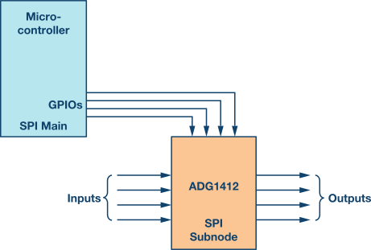图9. 微控制器GPIO用作开关的控制信号。

随着电路板上开关数量的增加，所需GPIO的数量也会显著增加。例如，当设计一个测试仪器系统时，会使用大量开关来增加系统中的通道数。在4×4交叉点矩阵配置中，使用四个ADG1412。此系统需要16个GPIO，限制了标准微控制器中的可用GPIO。图10显示了使用微控制器的16个GPIO连接四个ADG1412。

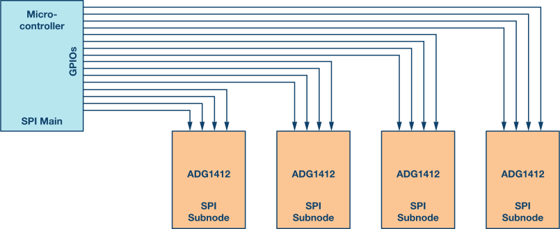图10. 在多从机配置中，所需GPIO的数量大幅增加。

为了减少GPIO数量，一种方法是使用串行转并行转换器，如图11所示。该器件输出的并行信号可连接到开关控制输入，器件可通过串行接口SPI配置。此方法的缺点是外加器件会导致物料清单增加。

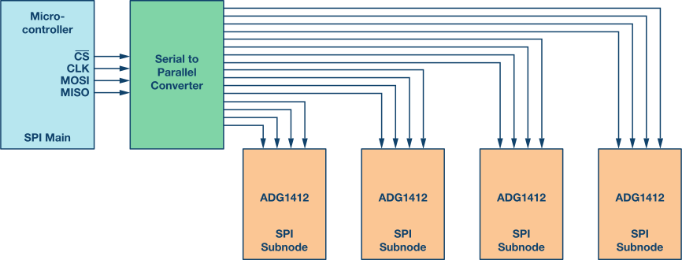图11. 使用串行转并行转换器的多从机开关。

另一种方法是使用SPI控制的开关。此方法的优点是可减少所需GPIO的数量，并且还能消除外加串行转并行转换器的开销。如图12所示，不需要16个微控制器GPIO，只需要7个微控制器GPIO就可以向4个ADGS1412提供SPI信号。

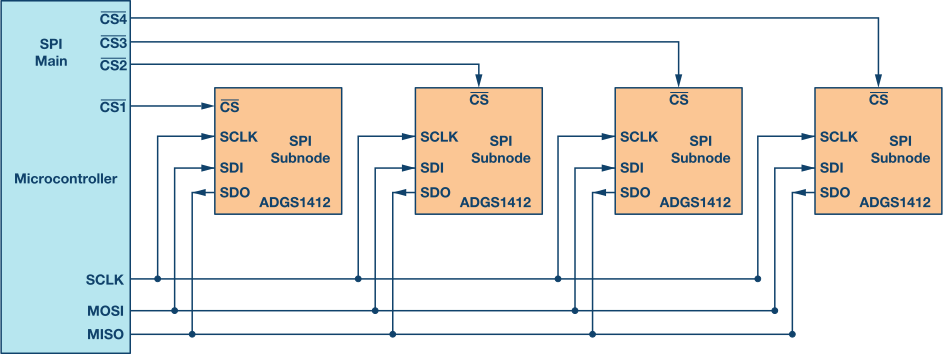图12. 支持SPI的开关节省微控制器GPIO。

开关可采用菊花链配置，以进一步优化GPIO数量。在菊花链配置中，无论系统使用多少开关，都只使用主机（微控制器）的四个GPIO。

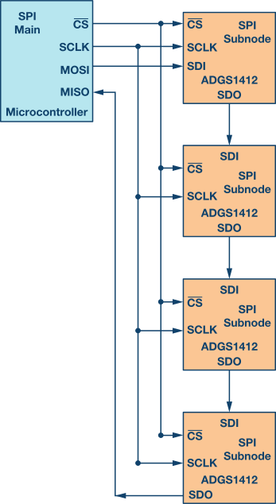图13. 菊花链配置的SPI开关可进一步优化GPIO。

图13用于说明目的。ADGS1412数据手册建议在SDO引脚上使用一个上拉电阻。有关菊花链模式的更多信息，请参阅ADGS1412数据手册。为简单起见，此示例使用了四个开关。随着系统中开关数量的增加，电路板简单和节省空间的优点很重要。

# 相比UART的好处

UART没有时钟信号，无法控制何时发送数据，也无法保证双方按照完全相同的速度接收数据，为此，UART为每个字节添加了额外的起始位和停止位，以帮助接收器在数据到达时进行同步。双方还必须就传输速度达成共识（相同波特率，比如每秒9600位）。传输速率如果有微小差异不是问题，因为接收器会在每个字节的开头重新同步。

# **SPI通讯的优势**

使SPI作为串行通信接口脱颖而出的原因很多；

- 全双工串行通信；（只有master一个时钟，但利用该时钟两个沿分别完成采样和移出两件事情）
- 高速数据传输速率。
- 简单的软件配置；
- 极其灵活的数据传输，不限于8位，它可以是任意大小的字；
- 非常简单的硬件结构。从站不需要唯一地址（与I2C不同）。从机使用主机时钟，不需要精密时钟振荡器/晶振（与UART不同）。不需要收发器（与CAN不同）。

# **SPI的缺点**

- 没有硬件从机应答信号（主机可能在不知情的情况下无处发送）；
- 通常仅支持一个主设备；
- 需要更多的引脚（与I2C不同）；
- 没有定义硬件级别的错误检查协议；
- 与RS-232和CAN总线相比，只能支持非常短的距离；