以下来自https://www.analog.com/cn/resources/analog-dialogue/articles/uart-a-hardware-communication-protocol.html

### 摘要

UART，即通用异步接收器/发送器，是最常用的设备间通信协议之一。本文将UART用作硬件通信协议应遵循的标准步骤进行说明。

正确配置后，UART可以配合许多不同类型的涉及发送和接收串行数据的串行协议工作。在串行通信中，数据通过单条线路或导线逐位传输。在双向通信中，我们使用两根导线来进行连续的串行数据传输。根据应用和系统要求，串行通信需要的电路和导线较少，可降低实现成本。

本文将讨论使用UART的基本原则，重点是数据包传输、标准帧协议和定制帧协议；定制帧协议将是安全合规性方面的增值特性，尤其是在代码开发期间。在产品开发过程中，本文档还旨在分享一些基本步骤，以检查数据表的实际使用。

最后，本文的目标是帮助更好地理解和遵循UART标准，以便较大程度地发挥其能力和应用优势，特别是在开发新产品时。

*"沟通最大的问题在于，人们想当然地认为已经沟通了。" ——乔治·萧伯纳*

通信协议在组织设备之间的通信时扮演着重要角色。它基于系统要求而以不同方式进行设计。此类协议具有特定的规则，为实现成功通信，不同设备都遵循该规则。

嵌入式系统、微控制器和计算机大多将UART作为设备间硬件通信协议的一种形式。在可用通信协议中，UART的发送和接收端仅使用两条线。

尽管它是一种广泛使用的硬件通信方法，但它并非在所有时候都是完全优化的。在微控制器内部使用UART模块时，通常会忽略帧协议的适当实现。

根据定义，UART是一种硬件通信协议，以可配置的速度使用异步串行通信。异步意味着没有时钟信号来同步从发送设备进入接收端的输出位。

### 接口

[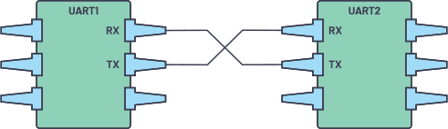](https://www.analog.com/-/media/images/analog-dialogue/en/volume-54/number-4/articles/uart-a-hardware-communication-protocol/335962-fig-01.svg?w=900)图1.两个UART彼此直接通信

每个UART设备的两个信号分别命名为：

- 发送器(Tx)
- 接收器(Rx)

每个设备的发送器和接收器线的主要作用是用于串行通信的串行数据的发送和接收。

[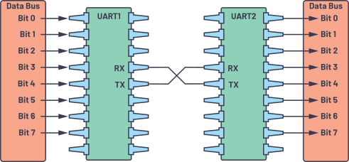](https://www.analog.com/-/media/images/analog-dialogue/en/volume-54/number-4/articles/uart-a-hardware-communication-protocol/335962-fig-02.svg?w=900)图2.带数据总线的UART

发送UART连接到以并行形式发送数据的控制数据总线。然后，数据将在传输线路（导线）上一位一位地串行传输到接收UART。反过来，对于接收设备，串行数据会被转换为并行数据。

UART线用作发送和接收数据的通信介质。请注意，UART设备具有专门用于发送或接收的发送和接收引脚。

对于UART和大多数串行通信，发送和接收设备需要将波特率设置为相同的值。波特率是指信息传输到信道的速率。对于串行端口，设定的波特率将用作每秒传输的最大位数。

表1总结了关于UART必须了解的几点。

| 导线       | 2                                                            |
| ---------- | ------------------------------------------------------------ |
| 速度       | 9600、19200、38400、57600、115200、230400、460800、921600、1000000、1500000 |
| 传输方法   | 异步                                                         |
| 最大主机数 | 1                                                            |
| 最大从机数 | 1                                                            |

UART接口不使用时钟信号来同步发送器和接收器设备，而是以异步方式传输数据。发送器根据其时钟信号生成的位流取代了时钟信号，接收器使用其内部时钟信号对输入数据进行采样。同步点是通过两个设备的相同波特率来管理的。如果波特率不同，发送和接收数据的时序可能会受影响，导致数据处理过程出现不一致。允许的波特率差异最大值为10%，超过此值，位的时序就会脱节。

### 数据传输

在UART中，传输模式为数据包形式。连接发送器和接收器的机制包括串行数据包的创建和物理硬件线路的控制。数据包由起始位、数据帧、奇偶校验位和停止位组成。

[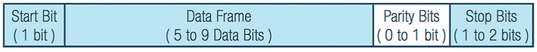](https://www.analog.com/-/media/images/analog-dialogue/en/volume-54/number-4/articles/uart-a-hardware-communication-protocol/335962-fig-03.svg?w=900)图3.UART数据包

#### 起始位

当不传输数据时，UART数据传输线通常保持高电压电平。若要开始数据传输，发送UART会将传输线从高电平拉到低电平并保持1个时钟周期。当接收UART检测到高到低电压跃迁时，便开始以波特率对应的频率读取数据帧中的位。

[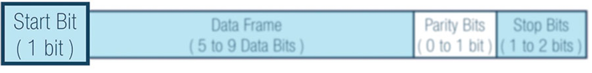](https://www.analog.com/-/media/images/analog-dialogue/en/volume-54/number-4/articles/uart-a-hardware-communication-protocol/335962-fig-04.jpg?w=900)图4.起始位

#### 数据帧

数据帧包含所传输的实际数据。如果使用奇偶校验位，数据帧长度可以是5位到8位。如果不使用奇偶校验位，数据帧长度可以是9位。在大多数情况下，数据以最低有效位优先方式发送。

[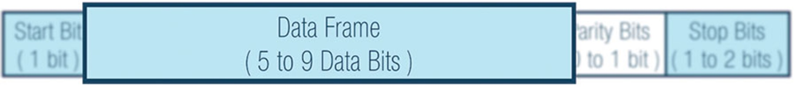](https://www.analog.com/-/media/images/analog-dialogue/en/volume-54/number-4/articles/uart-a-hardware-communication-protocol/335962-fig-05.jpg?w=900)图5.数据帧

#### 奇偶校验

奇偶性描述数字是偶数还是奇数。通过奇偶校验位，接收UART判断传输期间是否有数据发生改变。电磁辐射、不一致的波特率或长距离数据传输都可能改变数据位。

接收UART读取数据帧后，将计数值为1的位，检查总数是偶数还是奇数。如果奇偶校验位为0（偶数奇偶校验），则数据帧中的1或逻辑高位总计应为偶数。如果奇偶校验位为1（奇数奇偶校验），则数据帧中的1或逻辑高位总计应为奇数。

当奇偶校验位与数据匹配时，UART认为传输未出错。但是，如果奇偶校验位为0，而总和为奇数，或者奇偶校验位为1，而总和为偶数，则UART认为数据帧中的位已改变。

[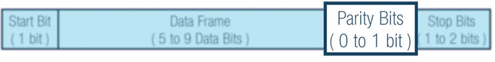](https://www.analog.com/-/media/images/analog-dialogue/en/volume-54/number-4/articles/uart-a-hardware-communication-protocol/335962-fig-06.jpg?w=900)图6.奇偶校验位

#### 停止位

为了表示数据包结束，发送UART将数据传输线从低电压驱动到高电压并保持1到2位时间。

[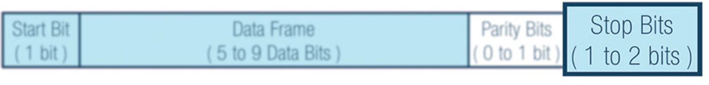](https://www.analog.com/-/media/images/analog-dialogue/en/volume-54/number-4/articles/uart-a-hardware-communication-protocol/335962-fig-07.jpg?w=900)图7.停止位

### UART传输步骤

第一步：发送UART从数据总线并行接收数据。

[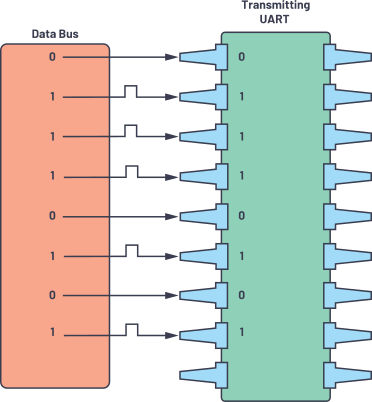](https://www.analog.com/-/media/images/analog-dialogue/en/volume-54/number-4/articles/uart-a-hardware-communication-protocol/335962-fig-08.svg?w=900)图8.数据总线至发送UART

第二步：发送UART将起始位、奇偶校验位和停止位添加到数据帧。

[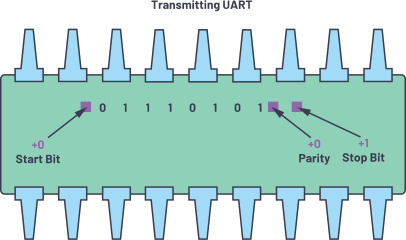](https://www.analog.com/-/media/images/analog-dialogue/en/volume-54/number-4/articles/uart-a-hardware-communication-protocol/335962-fig-09.svg?w=900)图9.Tx侧的UART数据帧

第三步：从起始位到结束位，整个数据包以串行方式从发送UART送至接收UART。接收UART以预配置的波特率对数据线进行采样。

[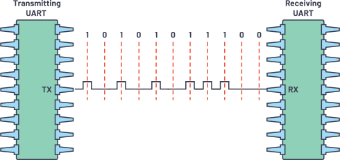](https://www.analog.com/-/media/images/analog-dialogue/en/volume-54/number-4/articles/uart-a-hardware-communication-protocol/335962-fig-10.svg?w=900)图10.UART传输

第四步：接收UART丢弃数据帧中的起始位、奇偶校验位和停止位。

[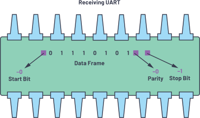](https://www.analog.com/-/media/images/analog-dialogue/en/volume-54/number-4/articles/uart-a-hardware-communication-protocol/335962-fig-11.svg?w=900)图11.Rx侧的UART数据帧

第五步：接收UART将串行数据转换回并行数据，并将其传输到接收端的数据总线。

[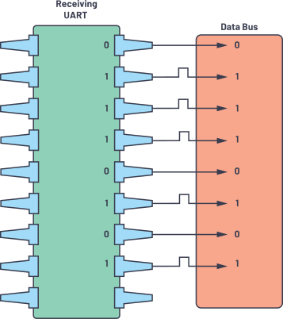](https://www.analog.com/-/media/images/analog-dialogue/en/volume-54/number-4/articles/uart-a-hardware-communication-protocol/335962-fig-12.svg?w=900)图12.接收UART至数据总线

### 帧协议

UART的一个关键特性是帧协议的实现，但还没有被充分使用。其主要用途和重要性是为每台设备提供安全和保护方面的增值。

例如，当两个设备使用相同的UART帧协议时，有可能在没有检查配置的情况下连接到同一个UART，设备会连接到不同的引脚，这可能导致系统故障。

另一方面，实现帧协议可确保安全性，因为需要根据设计帧协议解析接收到的信息。每个帧协议都经过专门设计，以确保唯一性和安全性。

在设计帧协议时，设计人员可以给不同设备设置期望的报头和报尾（包括CRC）。在图13中，2个字节被设置为报头的一部分。

[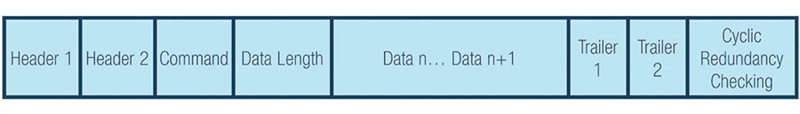](https://www.analog.com/-/media/images/analog-dialogue/en/volume-54/number-4/articles/uart-a-hardware-communication-protocol/335962-fig-13.jpg?w=900)图13.UART帧协议示例

根据示例，您可以给您的设备设置独有的报头、报尾和CRC。

#### 报头1（H1为0xAB）和报头2（H2为0xCD）

报头是确定您是否在与正确的设备通信的唯一标识符。

#### 命令(CMD)选择

命令将取决于用于创建两个设备之间通信的命令列表。

#### 每个命令的数据长度(DL)

数据长度将取决于所选的命令。您可以根据所选的命令来使数据长度最大化，因此它会随选择而变化。在这种情况下，数据长度可以调整。

#### 数据n（可变数据）

数据是要从设备传输的有效载荷。

#### 报尾1（T1为0xE1）和报尾2（T2为0xE2）

报尾是在传输结束后添加的数据。就像报头一样，报尾也可以唯一标识符。

#### 循环冗余校验（CRC公式）

循环冗余校验公式是一种附加的错误检测模式，用于检测原始数据是否发生意外更改。发送设备的CRC值必须始终等于接收器端的CRC计算值。

建议为每个UART设备实现帧协议来增加安全性。帧协议要求发送和接收设备使用相同的配置。

### UART工作原理

使用任何硬件通信协议时，首先必须检查数据手册和硬件参考手册。

以下是要遵循的步骤：

第一步：检查设备的数据手册接口。

[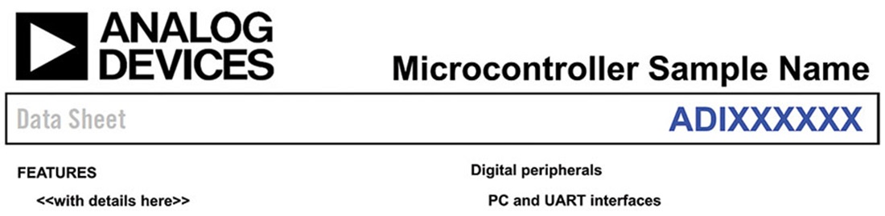](https://www.analog.com/-/media/images/analog-dialogue/en/volume-54/number-4/articles/uart-a-hardware-communication-protocol/335962-fig-14.jpg?w=900)图14.微控制器数据手册

第二步：在存储器映射下面检查UART地址。

[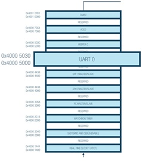](https://www.analog.com/-/media/images/analog-dialogue/en/volume-54/number-4/articles/uart-a-hardware-communication-protocol/335962-fig-15.jpg?w=900)图15.微控制器存储器映射

第三步：检查UART端口的具体信息，例如工作模式、数据位长度、奇偶校验位和停止位。

示例MCU提供了一个全双工UART端口，其与PC标准UART完全兼容。UART端口提供一个简化的UART接口用于连接其他外设或主机，支持全双工、DMA和异步串行数据传输。UART端口支持5到8个数据位，以及无校验、偶校验和奇校验。帧由一个半或两个停止位终止。

第四步：检查UART操作的详细信息，包括波特率计算。波特率通过以下示例公式进行配置。此公式随微控制器而异。

数据手册中的UART端口详细信息示例：

- 5到8个数据位
- 1、2或1 ½个停止位
- 无、偶数或奇数奇偶校验
- 可编程过采样率为4、8、16、32
- 波特率 = PCLK/((M + N/2048) × 2OSR + 2 × DIV

其中：

OSR（过采样率）

UART_LCR2.OSR = 0至3

DIV（波特率分频器）

UART_DIV = 1至65535

M（DIVM小数波特率M）

UART_FBR.DIVM = 1至3

N（DIVM小数波特率M）

UART_FBR.DIVN = 0至2047

第五步：对于波特率，务必检查要使用的外设时钟(PCLK)。此示例有26 MHz PCLK和16 MHz PCLK可用。请注意，OSR、DIV、DIVM和DIVN随设备而异。

| 波特率 | OSR  | DIV  | DIVM | DIVN |
| ------ | ---- | ---- | ---- | ---- |
| 9600   | 3    | 24   | 3    | 1078 |
| 115200 | 3    | 4    | 1    | 1563 |

| 波特率 | OSR  | DIV  | DIVM | DIVN |
| ------ | ---- | ---- | ---- | ---- |
| 9600   | 3    | 17   | 3    | 1078 |
| 115200 | 3    | 2    | 2    | 348  |

第六步：下一部分是检查UART配置的详细寄存器。了解计算波特率时的参数，例如UART_LCR2、UART_DIV和UART_FBR。表4要列出所涉及的具体寄存器。

| 名称      | 描述         |
| --------- | ------------ |
| UART_DIV  | 波特率分频器 |
| UART_FIBR | 小数波特率   |
| UART_LCR2 | 第二线路控制 |

第七步：检查每个寄存器下的详细信息，代入值以计算波特率，然后开始实现UART。

### 为何重要？

当开发稳健的、质量驱动的产品时，熟悉UART通信协议非常有优势。知道如何仅使用两条线发送数据，以及如何传输整个数据包或有效载荷，将有助于确保数据正确无误地发送和接收。UART是最常用的硬件通信协议，具备相关知识可以在将来的设计中实现设计灵活性。

### 用例

您可以将UART用于许多应用，例如：

- 调试：在开发过程中及早发现系统错误很重要。添加UART便可从系统捕捉消息，帮助排除错误。
- 制造功能级追踪：日志在制造业中非常重要。通过日志可确定功能，提醒操作员生产线上正在发生的事情。
- 客户更新：软件更新非常重要。完整的动态硬件和支持更新的软件对于拥有完整系统至关重要。
- 测试/验证：在产品离开制造过程之前进行验证有助于为客户提供优质的产品。

## 参考电路

"[UART通信基础](https://www.electronicshub.org/basics-uart-communication/)"。 Electronics Hub，2017年7月。

Campbell, Scott。 "[UART通信基础](https://www.circuitbasics.com/basics-uart-communication/)"。 电路基础。

"[回到基础：通用异步接收器/发送器](https://www.allaboutcircuits.com/technical-articles/back-to-basics-the-universal-asynchronous-receiver-transmitter-uart/)"。 *关于电路的一切*，2016年12月。

"[何为UART协议？UART通信阐释](https://www.arrow.com/en/research-and-events/articles/what-is-uart-protocol-uart-communication-explained)"。 Arrow。