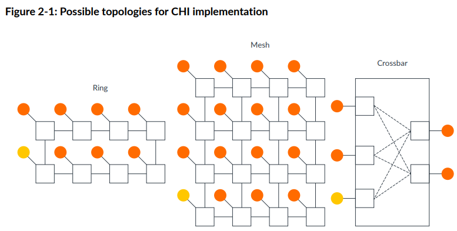
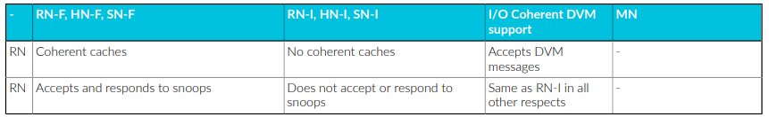
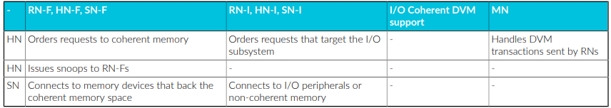
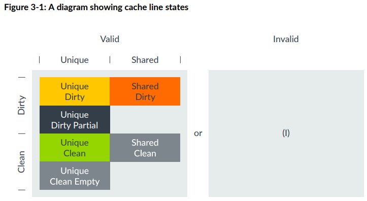
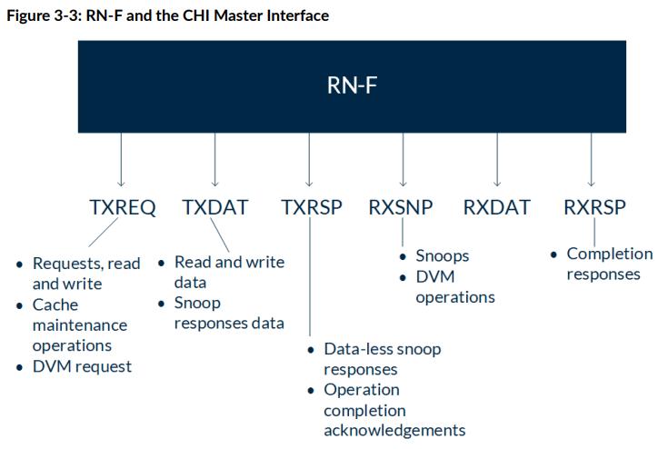
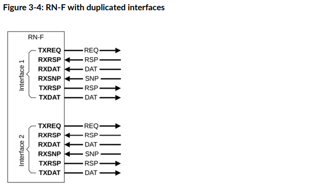
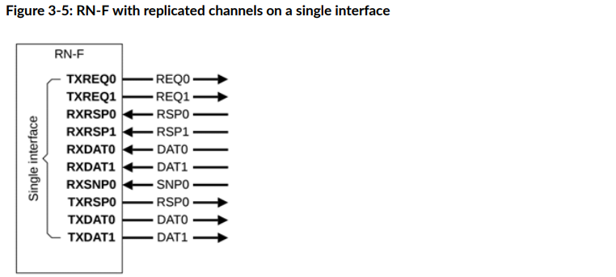
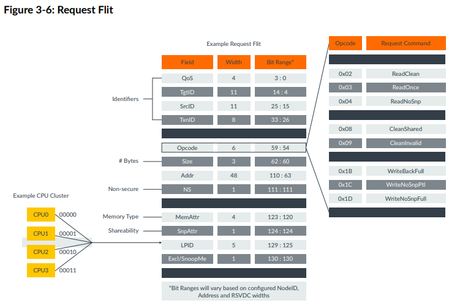
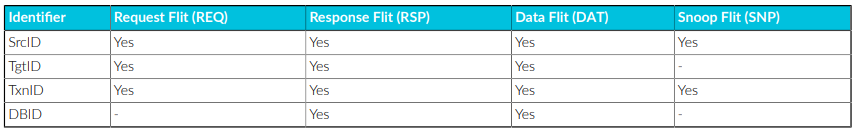
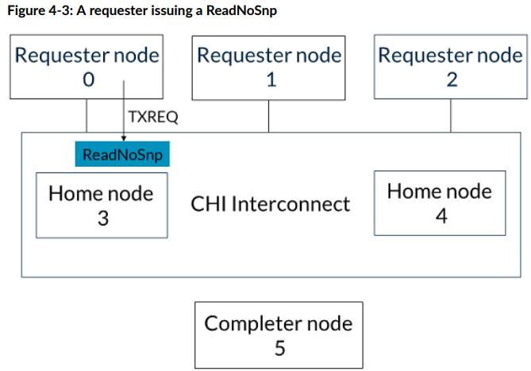

# 系列博客说明

本系列博客将围绕片内一致性总线CHI协议展开。首篇博客将基于ARM官方的Learn the architecture - Introducing AMBA CHI文档进行总结，意在对CHI协议的基本概念有初步的认知。本博客不会照搬协议，会掺杂一些个人理解，不当之处请指正。之后的博客可能会聚焦CHI协议事务类型及流程，CHI协议性能优化方案、CMN-700具体实现、CHI-C2C协议、gem5-c2c建模或CHI与UCIe的交互四方面展开，意在通过约8-10篇博客，初步掌握CHI协议、一致性实现。

# CHI协议的定位

CHI协议的定位是片内多核互连总线。ARM官方提到，CHI协议不会定死使用的具体NoC拓扑，但其明确支持的仅有ring, mesh和crossbar三种，如下：

其中，ring拓扑实现简单，但点对点延迟随着节点数量增多而线性增大，因而适合中等规模系统；crossbar拓扑是全连接，跳数最少，但实现代价很大，适合小规模系统；mesh比较复杂，点和点之间可以有多种路由方案，适合大规模系统。

# CHI协议的演进

CHI从2014年发布以来，已经来到了Issue. G。

CHI-A已有：事务排序模型，独占式访问，Distributed Virtual Memory (DVM)操作。

CHI-B添加：原子事务，Reliability, Availability, and Serviceability (RAS)支持，直接内存传输（Direct Memory Transfer）和直接缓存传输（Direct Cache Transfer）(这俩都是用来在读返回的时候绕过HN直接到RN从而减少延迟的，挺有用)

CHI-C和CHI-D都是一些细微的改动。

CHI-E改动较大，比如加了个与DMT和DCT对偶的Direct Write-data Transfer

# CHI协议的基础概念

### 节点（Node）

节点大体分三种：RN, HN和SN。还有一类MN。

RN (Request Node)类似AXI中的master，可以发起读写请求。

SN（Subordinate Node）类似AXI中的slave，可以是DDR这类memory controller或者外设。

HN（Home Node）比较有意思，类似一个中转/集散中心。比如，HN收到RN发来的request，另起一个request向SN发起请求，请求完成后再返回给RN。HN也不止承担这类点对点功能。比如，某个RN想要让自己的某个cache line从shared状态变成unique状态，就跟HN说，去，你给跟这个cache line有关联的RN都发个snoop，让这些RN如果有这个cache line的就把这个cache line invalidate掉，再通过你（HN）汇总消息了告诉我(RN)。

RN分为三类，Fully Coherent的RN-F, IO Coherent的RN-I, 和IO Coherent加上DVM支持的RN-D。RN-F有支持coherence的cache，可以应答snoop。RN-I不带有支持coherence的cache，不可以应答snoop，RN-D不带有支持coherence的cache，不可以应答snoop，但可以接收DVM messages。

HN分为三类，Fully Coherent的HN-F，Non-Coherent的HN-I和Miscellaneous的MN。前两种很好理解，最后一种指不支持Coherence但是可以处理DVM请求。

SN分为两类，Fully Coherent的SN-F和IO Coherent的SN-I，不再赘述。

总结表如下：

### IO Coherent和Full Coherent

IO Coherent 描述的是不带cache的设备（如 DMA、GPU 或加速器）如何与拥有缓存的处理器（如 CPU）安全地共享数据。

**Full Coherent (全一致性):** 比如 CPU 之间。大家都有 Cache，数据可以互访，且大家都需要被别人“监听”（Snoop）。

**IO Coherent (IO 一致性):** 只有一方（CPU）有 Cache，另一方（IO）没有 Cache（或者其 Cache 不对系统可见）。IO 设备能看到 CPU 的 Cache，但 CPU 不需要去 Snoop IO 设备。**IO Coherent** 意味着：当一个 IO 设备（请求者）发起访问时，硬件会自动检查系统的 Cache 状态。

- **读操作：** 如果数据在某个 CPU 的 Cache 里是“脏”的（Modified），硬件会自动把最新的数据传给 IO 设备。
- **写操作：** 如果 IO 设备要写入数据，硬件会自动使所有 CPU Cache 中对应的缓存行失效（Invalidate），确保下次 CPU 读取时能拿到 IO 设备写入的新值。

### CHI的缓存行状态（Cache line states）

ACE是valid-invalid, unique-shared, clean-dirty三对组合，CHI是valid-invalid, unique-shared, clean-dirty，partial-empty四对组合，但部分组合不被支持。被支持的组合如下：

这里重点讲下CHI新增的两个状态，UDP (Unique Dirty Partial)和UCE (Unique Clean Empty)。这两者基本功能都是省了一次内存到缓存的缓存行读，最终优化了写入性能，降低带宽浪费。

#### UDP (Unique Dirty Partial)

UDP解决的是**“我只想写一部分，而且我懒得（或者没能力）先把旧数据读回来合成”** 的问题，它把“合并数据”这个重活累活从 CPU/设备端甩给了总线系统（HN-F）。它是为了高性能 SoC 处理碎片化数据写入而引入的特殊状态。

在没有 UDP 以前，如果你只想修改 Cache Line 里的 4 个字节（即 **Partial Write**），流程是：

1. **ReadUnique：** 从内存读回整行（64字节）数据。
2. **Merge：** 在 CPU 内部把你的 4 字节新数据和读回来的 60 字节旧数据合并。
3. **Dirty：** 标记为 Unique Dirty 状态。

有了 **UDP** 以后，流程简化为：

1. **发送写请求：** 发起一个 `WriteUniquePtl`（Partial）请求。
2. **直接传输：** 节点不从内存读数据，而是**直接把这 4 字节数据发给中心节点（HN-F）**。
3. **进入 UDP：** 在某些实现中，RN 可以在本地暂存这部分数据并标记为 UDP。
4. **下游合并：** 最终由 HN-F 负责从内存读出旧数据，并与这 4 字节合并。

对于发起请求的 CPU 或 IO 设备（RN）来说，它**确实省掉了一次把数据读进自己 Cache 的过程**。本质上是把合并数据的任务从RN丢给了HN。

UDP 状态在 **IO Coherent** 场景（比如 DMA 或 PCIe 设备接入）中有独特价值：首先，**其简化了IO模块的硬件逻辑。** 很多小的 IO 模块内部并没有复杂的“合并（Merge）”电路。如果非要它先读再写，它还得额外准备一块 Buffer 来存读回来的数据。其次，他提高了IO设备的**带宽利用率。** 如果一个设备只是不断地往内存写零碎的状态位，使用 UDP 模式可以让数据“单向奔流”，只有写，没有读。

需要注意，在 UDP 状态下，虽然 RN 本地的数据是不完整的，但 CHI 协议通过 **Byte Enable (BE)** 信号解决了问题。 当 UDP 状态的数据被写回（Evict）或者被其他核 Snoop 时，它会明确告诉总线：*“这 64 字节里，只有第 0-3 字节是我的新数据，剩下的字节请以内存或下游 Cache 为准。”*

#### UCE (Unique Clean Empty)

CHI 协议引入 **UCE (Unique Clean Empty)** 的意义在于**解耦了“所有权”和“数据内容”**。

在没有 UCE 这种机制的系统中，所有的写缺失（Write Miss）都会遵循 **“先读再改”** 的逻辑：

1. **Read-Allocate：** 即使是写操作，硬件也会先发起一个“读”请求，把数据搬到 Cache 里。
2. **Modify：** CPU 在 Cache 中修改那几个字节。
3. **Complete：** 标记该行为 Dirty。

**即使你打算覆盖全部 64 字节**，传统的硬件逻辑通常比较“呆板”，它无法预知你接下来的指令是只写 1 字节还是写满整行。为了保证逻辑的一致性和简化设计，它统一采取“先读回来占个坑”的做法。

但UCE状态优化了这个流程，即明确给了软件一个“承诺”：*“我保证会写满整行，请只给我权限，不要浪费带宽给我传数据。”*

典型的例子是 **C 语言中的 `memset` 操作** 或者 **DMA 大批量数据传输**。当程序明确知道要初始化一片内存时，使用 CHI 的 `MakeUnique` 指令进入 UCE 状态，可以省去大量无意义的内存读取，从而让系统带宽几乎翻倍。

可以看有UCE和没有UCE时写一个完整缓存行的流程对比

| **场景**     | **传统做法 (ReadUnique)**       | **CHI 优化做法 (MakeUnique)**    |
| ------------ | ------------------------------- | -------------------------------- |
| **步骤 1**   | 请求独占权 + **请求数据**       | **仅请求独占权** (MakeUnique)    |
| **步骤 2**   | 等待内存/其他 Cache 返回数据    | 系统返回确认，**无数据传输**     |
| **步骤 3**   | 覆盖数据，状态变为 Unique Dirty | 状态进入 **UCE**，直接填入新数据 |
| **带宽消耗** | **高** (Data 占用了总线带宽)    | **极低** (只有控制信令)          |

#### Unique/Shared, Clean/Dirty

一句话总结：Unique一定是Unique的，Shared不一定是Shared的，Dirty一定是Dirty的，Clean不一定是Clean的

Unique：该缓存行只在这个cache中存在

Shared: 该缓存行不一定只在这个cache中存在（可能只在这个cache，也可能在多个cache中）

Dirty: 该缓存行的数据与主存不同，且有责任更新主存

Clean：该缓存行的数据可能与主存不同（可能相同也可能不同），但不负有更新主存的责任

### SAM（System Address Map）

地址映射表，RN中的SAM用于将地址翻译成HN节点索引，HN中的SAM用于将地址翻译成SN索引。需要注意的是，同一个地址被不同RN中的SAM路由到的HN应该一致。

### CHI节点的六个通道

每个RN-F都有六个通道，往外发的有TXREQ, TXDAT, TXRSP三个，往内收的有RXSNP, RXDAT, RXRSP三个。

具体功能看图。这里仅举几个例子。

比如RN-F要发起一笔写，用到的就是TXREQ, TXDAT, RXRSP. 最后还要用TXRSP跟HN说声。

RN-F要发起一笔读，用到的就是TXREQ, RXDAT, RXRSP，最后还要用TXRSP跟HN说声。

RN-F被snoop了，用到的就是RXSNP和TXRSP，如果snoop成功了，还得用到TXDAT.

比较惊艳的是，从CHI-E开始，允许复制通道，进而灵活地控制带宽。这种复制可以是两个粒度：

- 粗粒度：复制一整套六个通道，如图3-4
- 细粒度：复制单个通道，如图3-5

### Flits

因为是片内总线，CHI里的Flit不用像PCIe一样序列化，上图展示了Request Flit的基本结构

有几个要点值得注意:

- 每个Flit都伴有一根valid线
- Opcode域最重要，标明了传输的类型（比如ReadOnce, CleanInvalid等）
- 四个ID：SrcID, TgtID, TxnID, DBID。不同类型Flit中需求的不同ID如下表：
  - SrcID标明是谁发的这个Flit
  - TgtID表明这个Flit要发去哪里
  - TxnID类似AXI里面的ID，是点对点传输中不同的transaction的区分，功能是支持flit的outstanding（最大256或1024）
  - DBID（Data Buffer ID）比较有意思，只在Response和Data Flit中出现。 我在下面专门一个开section说明。

### DBID

DBID在写/读操作中的作用不一样。在写操作中，主要用于数据流向控制，即告诉发送方往哪里填数据（如果DBID耗尽，写请求会卡死）；在读操作中，主要用于资源的清理（如果DBID释放慢，HN的Tracker会满，无法接新的读请求）。

##### 写操作中的DBID

当请求者（Requester）发送写请求后，响应者（Completer，如 HN-F）如果准备好了接收数据的 Buffer，会返回一个带有 **DBID** 的响应（如 `DBIDResp`）。这个 DBID 就代表了接收方内部那个特定的数据缓冲区。发送方在后续发送数据包（Data Packet）时，会将收到的这个 **DBID** 填入数据包的 **TxnID** 字段中。这样接收方看到数据包时，立刻就能通过 DBID 知道这组数据属于哪个之前的写请求，并直接存入预留的 Buffer。通过 DBID，接收方可以精确控制流入的数据量。只有发放了 DBID，发送方才能传数据，这有效防止了接收端 Buffer 溢出。

##### 读操作中的DBID

读操作中，DBID主要用于两个方面：

首先是在SN与HN的交互中，作为读请求中的回传标识（Read Receipt）。当 HN 向 SN 发起读请求时，SN 可能会返回一个 `ReadReceipt`（读收据）。SN 通过这个响应告诉 HN：“我已经收到你的读请求了，并且给这个请求分配了一个 **DBID**（槽位）。这样 HN 就知道这个请求已经在 SN 的队列里排上号了，HN 可以根据这个确认信号来管理自己的事务追踪器（Tracker）。

其次是在RN收到数据后发给HN的CompAck（完成确认）中，帮助HN释放对应buffer资源。对于某些读操作（如 `ReadShared`），当 RN 收到数据后，需要发送一个 `CompAck`（完成确认）给 HN。此时，HN 在之前给 RN 发送数据时，可能会带上一个 **DBID**。RN 在回复 `CompAck` 时，会把这个 **DBID** 带回去。这告诉 HN：“我收到数据了，你之前在内部为这个事务所占用的那个 Buffer（由该 DBID 标识）现在可以被释放，给别人用了。”

### Request Order和Endpoint Order

这俩都属于CHI的保序机制。Order字段在最初的请求中定义。

Request Order（请求顺序）是较窄范围的保序约束。它保证来自**同一个发起者 (Requester)** 且发往**同一个内存地址 (Same Address)** 的多个事务，按照它们发出的顺序被处理，即：约束范围仅限于相同地址。发起者（如 RN）在发出后续请求前，必须先收到前一个请求的确认（如 `ReadReceipt` 或 `DBIDResp`），以确保前一个请求已经到达了系统的“保序点”（Point of Serialization）。典型的应用场景包括“读后写 (RAW)”或“写后读 (WAR)”同一变量。

Endpoint Order（端点顺序）是更宽、更强的保序约束。它保证来自**同一个发起者**且发往**同一个端点地址范围 (Same Endpoint Address Range)** 的所有事务，按照它们发出的顺序到达该端点，即：约束范围是整个**地址段**（通常对应一个具体的 Slave 节点，如某个内存控制器或外设）。典型应用场景比如顺序访问外设寄存器。例如，你先配置 DMA 的源地址寄存器，再配置目的地址寄存器，最后启动 DMA。这三个操作地址不同，但必须按序到达同一个外设端点。

可见，**Endpoint Order 包含 Request Order。** 如果你指定了 Endpoint Order，那么同一地址的顺序自然也被保证了。

发起者怎么判断何时可以发起下一个请求？CHI协议给出的答案是：如果是读操作(ReadNoSnp和ReadOnce)，发起者收到ReadReceipt信息之后，即可发起下一个请求。如果是写操作（WriteNoSnp和WriteUnique），发起者收到DBIDResp信息后，即可发起下一个请求。

可以发现，Order字段和HN中序列化点（PoS, Point of Serialization）作用似乎相同，都是用来保序的。那为什么对于非一致性事务（ReadNoSnp/WriteNoSnp）和弱一致性事务（ReadOnce（读到后用完不保留副本）/WriteUnique（推出数据后RN不留副本）），要多此一举加上一个Order字段呢？非一致性事务很好理解，一般不过HN,直接到SN, 因而不会参加HN保序。假如此时有保序需求（比如刚刚提到的顺序访问DMA寄存器），加上Order字段是一种轻量化的告知SN需要保序的手段。对于弱一致性事务，由于不需要同步Cache状态，它们经常绕过 PoS 逻辑以追求低延迟。`Order` 字段是 RN 给互连结构的指令，告诉它在不走一致性流程时，依然要维护逻辑上的先后顺序。

### CHI的Retry机制

CHI的Retry机制有些特别。当传输不成功时，发起者并不会一直重发请求，而是会等待接收者告知发起者特定槽位已经空出，可以发起重传后，才会发起一次重传，且该次重传可以确保成功。具体事务流程如下：

1. 发起者在Request Flit中设置AllowRetry=1，并且把credit类型字段PCrdType设置为0，发给接收者。
2. 接收者如果Requester Buffer已经满了，就返回给发起者一个RetryAck信息。该信息中，会把PCrdType字段设置为一个特定值，比如2.
3. 当接收者能接收这个Request了，就会通过TXRSP通道向发起者发送一条PCrdGrant信息（指明PcrdType=2）
4. 发起者收到PCrdGrant信息并确认其与RetryAck中的PcrdType match之后，就会把AllowRetry设置为0，把刚刚的Request Flit发给接收者。接收者必须接收。

# CHI事务流程

CHI协议在底层架构上和Non-Coherent的AXI总线显著不同，其事务流程也更为复杂。下面将按照Opcode分类进行transaction流程的说明，分为两个层面，一是事务流，二是四个ID怎么用。

### ReadNoSnp

假设有RN 0-2, HN 3-4, SN 5。RN0是读的发起方，SN5是目标。

1. RN0通过SAM选定HN3，通过TXREQ通道向HN3发送ReadNoSnp请求。
2. HN3通过SAM选定SN5，通过TXREQ通道向SN5发送ReadNoSnp请求。
3. SN5通过TXDAT通道向HN3返回CompData信息，包含数据。
4. HN3向RN0返回CompData信息，包含数据，走的是HN3的TXDAT, RN0的RXDAT通道。
5. 如果在最开始的ReadNoSnp请求中ExpCompAck标志位（Expect Completion acknowledgement）被设置为1，则RN0需要向HN3返回CompAck信息
6. HN3收到CompAck信息后会放行对RN0刚刚读到这个缓存行的Snoop（保证Sequential Consistency）

### WriteNoSnp

同样的，假设有RN 0-2, HN 3-4, SN 5。RN0是写的发起方，SN5是目标。

1. RN0通过TXREQ通道向HN3发送WriteNoSnp请求。
2. HN3通过TXRSP通道向RN0发送CompDBIDResp信息，表明自己可以通过某个ID的Data Buffer接受写数据.
3. 以下两个事件可以以任何次序发生：
   1. HN3向SN5发送WriteNoSnp信息，SN5向HN3返回CompDBIDResp信息，表明自己可以通过某个ID的Data Buffer接受写数据.
   2. RN0向HN3通过TXDAT通道发送WriteNoSnp所需的写数据
4. HN3把写数据通过TXDAT通道发送给SN5

注意如果在初始的WriteNoSnp请求中，ExpCompAck=1，则在RN发送完写数据并且确认收到了CompDBIDResp之后，RN会向HN发送一个CompAck消息，HN收到CompAck后，菜回真正关闭（Deallocate）这个事务在内部Tracker中的记录。

### MakeUnique

MakeUnique请求中包含snoop操作。

假设还是一样的，RN 0-2, HN 3-4, SN 5。RN0是MakeUnique的发起方，HN3是Snoop的发起方。

1. RN0对HN3发出MakeUnique消息，指示想把A地址的缓存行独占。
2. HN3向RN1和RN2发出SnpMakeInvalid请求（属于Snoop）
3. RN1和RN2将地址A的缓存行Invalidate之后，按任意顺序向HN3返回SnpResp消息
4. HN3在收到RN1和RN2的SnpResp之后，向RN0返回Comp_UC消息（Unique Clean），表明Snoop已经都返回了
5. 此时假如RN2向HN3发起读地址A的ReadShared请求，HN3会阻塞这个请求，因为RN0还没有给CompAck给HN3
6. RN0向HN3发送CompAck消息，正式终结这个事务。
7. HN3收到CompAck消息之后放行刚刚RN2的ReadShared请求，向RN0和RN1发送SnpShared消息。
8. 以下两个事件以任意顺序完成：
   1. RN0返回SnpRespData，把最新的A地址的数据给到HN3
   2. RN1返回SnpResp，表明自己没有A地址的数据
9. 收到RN0返回的数据后，HN3把数据给到RN2
10. RN2向HN3发送CompAck信息，该事务完成。

