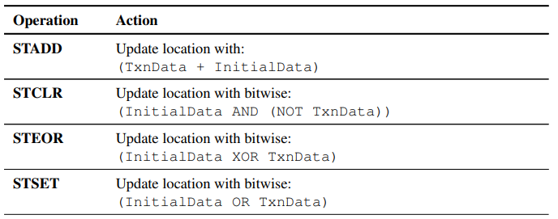
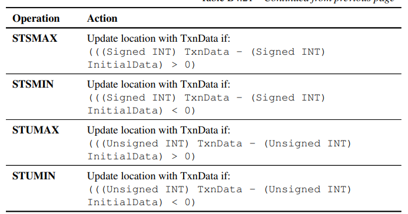
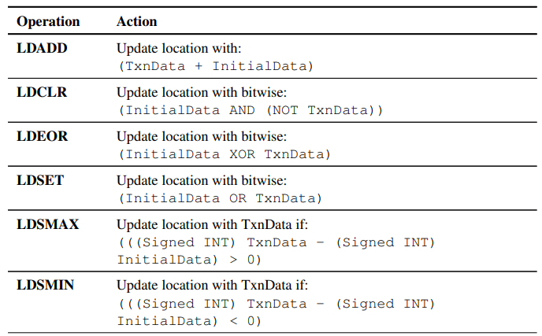
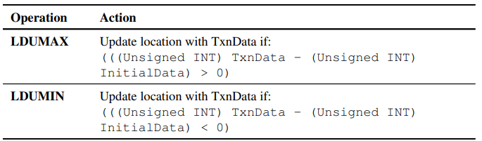

# CHI事务类型

CHI事务类型繁多，可分为Read、Write、Dataless、Combined Write、Atomic、Other六类。其中，combined write事务是把write事务和缓存一致性的维护操作（CMO）合二为一，暂按下不表。

### 读事务（Read Transactions）

#### 一句话搞清楚CHI不同读事务的语义

CHI 协议中复杂的读事务可以用以下的比喻快速理解，我们把 **互连网络（ICN）** 比作“图书馆管理员”，把 **Requester** 比作“读者”：

- **ReadNoSnp**：跳过管理员直接去私人书库拿书，不管别人手里有没有副本（非一致性读取）。
- **ReadNoSnpSep**：和 ReadNoSnp 一样，但允许管理员先把“书找到了”的消息和“书本内容”分两次告诉我。
- **ReadOnce**：路过顺便看一眼，不打算把书借走存放在自己家里（不存入 Cache）。
- **ReadOnceCleanInvalid**：我看一眼就走，而且建议管理员把馆里所有副本都擦干净并放回仓库（Clean & Invalidate 提示）。
- **ReadOnceMakeInvalid**：我看一眼就走，而且顺手把馆里其他人的副本全撕了，还不负责修补（强制 Invalidate 且不写回）。
- **ReadClean**：我要借书回家看，但我有洁癖，全系统谁手里的书要是脏了，必须洗干净还给图书馆（强制写回内存）。
- **ReadNotSharedDirty**：我要借书，但我绝不当那个负责洗干净书的人，谁爱洗谁洗（拒收 SharedDirty 责任）。
- **ReadShared**：我要借书，怎么快怎么来，书脏不脏、谁负责洗我都不在乎。
- **ReadUnique**：我要借书而且我要在书上涂改，请管理员立刻把别人手里的书全部回收并销毁。
- **ReadPreferUnique**：我大概率要改书，如果现在没人用就给我独占权，要是有人正用着，我也能接受先共享着看。
- **MakeReadUnique**：书我已经借到手了，现在我想申请改书的权限，请管理员把别人的副本都撤了。

#### 一句话搞清楚何时选用何种CHI读事务

**ReadNoSnp**：当你访问**非相干区域**（如配置寄存器或私有内存）时使用，因为不需要和其他核心商量，速度最快。

**ReadNoSnpSep**：场景同上，但当你希望在数据还没准备好时，先让总线确认“收到请求”以**释放资源**时选用。

**ReadOnce**：当你只需要读一次数据（如**搬运数据包或流媒体**）且不想让它占用你宝贵的缓存空间时选用。

**ReadOnceCleanInvalid**：当你读完数据后确定**短期内没人会再用**，想顺便帮系统“清理垃圾”并把脏数据刷回内存时选用。

**ReadOnceMakeInvalid**：当你读完数据后**确定该数据已作废**（如已处理的丢弃包），想直接从系统中抹除它且不在乎数据丢失时选用。

**ReadClean**：当你需要长期持有数据，且为了**后续能快速关机/休眠**，想逼系统现在就把所有脏副本洗干净写回内存时选用。

**ReadNotSharedDirty**：当你作为消费者读数据，但你的**缓存很小**，不想在被踢出（Evict）时背负写回内存的沉重负担时选用。

**ReadShared**：当你只想做最通用的**普通读取**操作，不带特殊目的，只求以最灵活、最低延迟的方式拿到数据副本时选用。

**ReadUnique**：当你准备**立即修改**某个变量（如执行 `store`）时选用，一步位到位拿走所有人的权限。

**ReadPreferUnique**：当你准备做**原子操作（自旋锁）**时选用，它在不打断别人进度的前提下，尽量帮你提前抢到独占权。

**MakeReadUnique**：当你手里**已经有这行数据**，但突然想从“只读”升级为“修改”模式时，为了省带宽不重传数据而选用。

#### CHI协议上对读事务的详细阐述

##### ReadNoSnp

从RN向Non-snoopable的地址区间读数据，或者从HN向任何地址区间读数据

##### ReadNoSnpSep

从HN向SN读数据，且要求SN仅发data response。Sep是把data response和非data的response Seperate开的意思。

##### ReadOnce

向Snoopable的地址区间拿数据的Snapshot。换言之，读完不会保留在自己的缓存行中。

##### ReadOnceCleanInvalid

在ReadOnce的基础上，建议（hint）持有该缓存行的Node把该缓存行CleanInvalid掉（如果Dirty，要先写回memory）

用法：某个缓存行长远来看仍然有用，但用完这次之后短期内不会再被用到，就可以发起一个ReadOnceCleanInvalid

注意事项：

1. 该缓存行的CleanInvalid是个hint，不能保证完成。
2. ReadOnceCleanInvalid 可能会意外地破坏其他处理器（Master/Agent）正在进行的“独占访问”（Exclusive Access/Atomic 操作），从而导致系统性能下降或逻辑重试。比如，假设 CPU A 正在对地址 `0x100` 进行独占访问（准备写入）。此时 CPU B 发起了一个 `ReadOnceCleanInvalid` 访问同一个地址 `0x100`。根据协议，`ReadOnceCleanInvalid` 可能会导致 CPU A 缓存里的那行数据被 **Invalidate（失效）**。 一旦 CPU A 的缓存行失效，它的**独占监视器（Exclusive Monitor）就会重置**。结果就是 CPU A 的独占访问会**失败（Fail）**，必须重新开始。也就是说，如果你对一个正被频繁进行原子操作（如锁、信号量）的热点内存区域使用这个指令，会导致其他核心的原子操作不断失败和重试，进而引发严重的**缓存颠簸（Cache Thrashing）**，降低系统效率。

##### ReadOnceMakeInvalid

与ReadOnceCleanInvalid的唯一不同是，建议持有该缓存行的Node把该缓存行MakeInvalid掉（如果Dirty，可以直接丢弃，不需要写回memory）

用法：某个缓存行用完这次就不会再被用到了，就可以发起一个ReadOnceMakeInvalid，相比ReadOnceCleanInvalid节省一次WriteBack to memory

注意事项：

1. 该缓存行的MakeInvalid是个hint，不能保证完成
2. 与ReadOnceCleanInvalid一样，ReadOnceMakeInvalid可能会意外地破坏其他处理器（Master/Agent）正在进行的“独占访问”（Exclusive Access/Atomic 操作），从而导致系统性能下降或逻辑重试。
3. ReadOnceMakeInvalid会导致Dirty的缓存行丢失，是有损的。
4. 在ReadOnceMakeInvalid事务中，“失效操作（Invalidation）”与“数据返回（Read Data Response）”之间具有时序与可见性约束。即：
   1. 在数据交给请求者之前，必须先锁定（commit）“让别人失效”这件事。commit不代表动作已经全部完成，而是代表这个失效请求已经在总线互连矩阵中排好队，且**不可撤回**。（否则，如果系统先把数据给了你（请求者），但还没把其他人的缓存标记为“准备失效”，那么在微观时序上，可能会出现短暂的窗口期，导致两个 Agent 认为自己都拥有对该数据的合法控制权，或者看到不一致的值。）
   2. 另一方面，需要保证，任何在 拿到该缓存行的数据之后才开始的对该缓存行的写入操作，都绝对不会被 A 的那个失效动作所干扰。（如果没有这个规则：假设Agent A 发起 `ReadOnceMakeInvalid`。数据发回给了 A。紧接着，Agent B 发起了一个新的 `Write` 事务（更新了该数据）。此时Agent A 延迟的那个“使无效”信号才慢慢悠悠地到达，结果把 Agent B 刚刚写好的新数据给“误杀”使无效了。）
5. 返回给Requester的数据应该处于I或UC或UD状态

##### ReadClean

ReadClean 的语义是：“我需要这份数据，但**我不打算修改它**，如果系统中有脏数据（Dirty Data），请帮我把它洗干净（写回内存/下级缓存）。”也就是，Requester拿到的数据一定是UC或者SC状态。

用法：

1. Requester打算把这个读回来的数据放进不能承担Dirty写回功能的cache里面，所以强制要求别人给自己的是clean状态。
2. 强制去脏。比如当一个集群（Cluster）或核心准备进入**休眠或关断状态**时，它必须清理掉所有的 Dirty Cache lines。如果此时另一个 Agent（比如 GPU 或另一个 CPU）使用 **ReadClean** 读取了这些数据，它实际上“顺手”帮正在准备休眠的核心完成了“写回内存”的工作。这样，当核心真正进入休眠指令时，需要处理的 Dirty 数据量已经大大减少，从而加快了进入低功耗状态的速度。
3. 避免Dirty状态的来回传递让系统管理变得复杂。如果 Dirty 数据一直在核心之间通过 ReadShared 传递（Dirty Tick-tack），那么总有一个核心必须承担“最后将数据写回内存”的责任。**ReadClean** 提供了一个明确的契机，在读取的同时解除这种“更新内存”的责任负担，保持系统状态的“整洁”。

##### ReadNotSharedDirty

ReadNotSharedDirty的语义是：拒绝在共享状态下承担 Dirty 责任。也就是返回的数据可以是UC, UD或SC，但绝对不可以是SD.

##### ReadShared

ReadShared是最基础，最通用的读取事务。ReadShared允许请求者接收任何合法的共享状态（包括UC、UD、SC和SD）

##### ReadUnique

仅允许返回的数据是UC或UD状态，保证自身独占性。

##### ReadPreferUnique

ReadPreferUnique是相对比较温和的ReadUnique。如果另一个核心正在进行独占操作，读到的数据会是shared状态而不是unique状态。你可以把 **ReadPreferUnique** 想象成一个**“有礼貌的预定”**： “老板，我想买这张桌子（Unique），如果现在没人订，直接给我；如果已经有人在付钱了，我就先站在旁边看看（Shared），不打扰人家结账。”

用法：

1. 比如某个RN需要进行Atomic操作，如果没有这个事务，处理器可能先用 `ReadShared` 读到数据（获得 Shared 状态），发现要修改时，必须再发一个 `CleanUnique` 事务来申请独占权。这需要**两次**往返总线。有了 ReadPreferUnique，相当于直接告诉总线：“我一会儿大概率要改，如果方便的话，直接给我 **Unique** 状态。” 如果成功拿到 Unique，后续的写操作就是“本地操作”，无需再次申请权限，极大地提升了效率。
2. 在多核争抢同一个锁（Exclusive Access）时，如果所有核都强行要求 `ReadUnique`，它会强制让其他所有核心的缓存行失效（Invalidate）。后果是：如果 A 刚拿到 Unique 还没来得及写，B 的 `ReadUnique` 就把 A 给失效了；接着 C 又把 B 失效了。这会导致“缓存颠簸”（Cache Thrashing），谁也无法完成任务。ReadPreferUnique 的聪明之处在于它是一种**温和的请求**。如果 HN-F 发现现在正好有另一个核心正在进行独占操作（Exclusive sequence），它会降级只给你 **Shared** 状态。这允许请求者至少能先“读”到值（比如在自旋锁中轮询状态），而不会粗鲁地打断那个正在执行关键写入操作的核心。

##### MakeReadUnique

MakeReadUnique事务的语义是：当请求者已经拥有数据，但缺乏“修改权限”时，以最小的代价获取独占权（Unique 权限）。

用法：

1. 与ReadUnique相比，优化了带宽，只传权力，不传数据。**ReadUnique:** 无论请求者有没有数据，都会触发Data Response。MakeReadUnique如果互连网络（HN-F）确认请求者已经拥有最新的数据副本，它可以**只返回权限确认**（Completion），而不传输数据。在写密集型应用中，这极大地节省了总线数据带宽，降低了功耗。

注意事项：

1. 在复杂的总线环境中，可能会发生这种情况：**Agent A** 发出 `MakeReadUnique` 想要升级权限。**与此同时，Agent B** 发出了一个 `ReadUnique`，导致总线向 Agent A 发送了一个 **Snoop Invalidate**（要求 A 删掉自己的数据）。如果按照简单的逻辑，Agent A 的数据没了，它的权限升级请求似乎应该失败并重试。 但 CHI 的设计是， 如果 Agent A 在等待 `MakeReadUnique` 结果时，数据被别人的 Snoop 给“抢”走了。总线（HN-F）**必须保证**在最后的响应中，重新把最新的数据再发还给 Agent A。即：Agent A 永远不需要因为“数据中途被抢”而重新发送请求。这保证了**前向进度（Forward Progress）**，避免了在高竞争下的死锁或无限重试。

### 不带数据的事务（Dataless Transactions）

#### 一句话搞清楚CHI不同Dataless事务的语义

##### 1. Stash 系列（提前送货上门）

- **StashOnceUnique**：管家主动把包裹塞进你的储物柜，并顺便把开锁的独占钥匙交给你，方便你待会直接修改。
- **StashOnceSepUnique**：管家先告诉你“包裹马上就位”，让你先去忙，他随后再异步把包裹和独占钥匙送进你的柜子。
- **StashOnceShared**：管家把包裹放进你的柜子，但只给你一份复印件（读权限），因为他知道你只是想看看，不想负责修改。
- **StashOnceSepShared**：管家先发个短信确认收到了送货请求，然后后台慢慢把这份“只读”的包裹副本送达你的柜子。

##### 2. Clean 系列（大扫除与同步）

- **CleanShared**：管家要求你把手里的脏包裹复印一份存入总仓库（PoC），但允许你继续留着这份包裹慢慢看。
- **CleanSharedPersist**：管家不仅要求你把包裹复印件交回仓库，还要亲眼盯着仓库管理员把它锁进永不掉电的保险柜（PoP）。
- **CleanSharedPersistSep**：管家先确认数据已交回仓库，让你先恢复工作，过一会再通知你保险柜（PoP）已经彻底锁好。
- **CleanInvalid**：管家要求你把手里修改过的包裹交回总仓库，然后必须当面把你自己柜子里的那份烧毁（Invalid）。
- **CleanInvalidPoPA**：管家执行跨空间大扫除，把包裹彻底刷过物理别名点（PoPA），确保在其他平行物理空间也能看到这件货。
- **CleanInvalidStorage**：最彻底的清空，管家要求把包裹从所有缓存销毁，并确认数据已经物理写入了最底层的闪存颗粒（PoPS）。

##### 3. 权限与状态切换（所有权流转）

- **MakeInvalid**：管家冷酷地通知你：“不管你手里的包裹是不是新的，立刻把它扔了，我不需要你交回仓库。”
- **CleanUnique**：你告诉管家：“我手里有这件货，但我现在想改它，请帮我收回别人手里的钥匙，让我一个人独占。”
- **MakeUnique**：你告诉管家：“我要彻底重画这幅画，把别人的副本都烧了，我也不需要旧的数据，直接给我独占写权限。”
- **Evict**：你主动告诉管家：“我的柜子满了，这件货我也不打算用了，权限我还给你，但这货没改过，我就不麻烦你存回仓库了。”

#### 一句话搞清楚何时选用上述何种CHI Dataless事务

##### 1. 获取写权限（我要修改数据）

- **CleanUnique**：当你只有读权限（Shared）但想**修改部分字节**时，用它来拿独占权并同步最新数据。
- **MakeUnique**：当你准备**覆盖整行数据**时，用它来最快获取独占权（因为它不产生数据传输）。

##### 2. 缓存清理（我想同步或腾位置）

- **CleanShared**：想把脏数据**推回内存**供他人查看，但自己还想留一份继续读时选用。
- **CleanInvalid**：想同步脏数据到内存，且同步完后**彻底放弃**该缓存行时选用。
- **MakeInvalid**：本地缓存行已无用，想**直接丢弃**且不需要写回内存（哪怕它是脏的）时选用。
- **Evict**：本地缓存行是干净的（Clean），仅仅因为**空间不足**想通知家乡节点（HN）你要放弃权限时选用。

##### 3. 持久化与存储（我要确保数据不丢）

- **CleanSharedPersist**：需要确保数据**掉电不丢失**，但之后仍需高频读取该数据时选用。
- **CleanInvalidPoPA**：在**机密计算**切换内存归属空间（PAS）前，确保旧空间的残余数据彻底物理清除时选用。
- **CleanInvalidStorage**：必须确认数据已**物理落盘**（如 SSD 颗粒）以满足极高可靠性要求时选用。

##### 4. 缓存推送（我把数据喂给别人）

- **StashOnceUnique**：想把数据连带**写权限**一起“推”给特定的 CPU 核心以减少其写延迟时选用。
- **StashOnceShared**：只想把数据“推”给目标 CPU **读**（如处理报文头），且不想让目标 CPU 负责写回时选用。

#### CHI协议中对Dataless事务的详细阐述

这类事务的特点是，数据（Data）不被包含在response中。这类数据通常用来执行一些coherence操作。

这类事务可以分成几类，

- 一类是StashOnceUnique, StashOnceSepUnique, StashOnceShared, StashOnceSepShared这类独立的Stash操作，用于优化性能；
- 一类是单纯缓存一致性的维护操作（CMO, cache maintenance transactions）, 比如CleanShared, CleanSharedPersist, CleanSharedPersistSep, CleanInvalid, CleanInvalidPoPA, CleanInvalidStorage, MakeInvalid；注意在这类操作中，RN不得理会Response中的cache状态信息
- 一类是CMO操作加上独占性操作，比如CleanUnique，MakeUnique；
- 一类是缓存驱逐操作，单指Evict。

##### CleanUnique

一般用于Requester自身已有一份shared状态的缓存行，且希望获得该缓存行的独占权以完成后续对该缓存行的写。其他核如果有Dirty的该缓存行，需要写回主存。当Requester不能保证后续对该缓存行的写为全行写，可能为partial写时，使用该事务。

##### MakeUnique

与CleanUnique的区别是，其他核如果有Dirty的该缓存行，不需要写回主存。MakeUnique仅用于当Requester即将对该缓存行的**全部**字节执行写操作。

##### Evict

用来驱逐处于clean状态的缓存行。Evict用于某缓存行不再被RN需要的时候。

##### StashOnceUnique, StashOnceSepUnique

StashOnceUnique的语义是请求者发送一个 Stash 请求到 HN（Home Node），指示 HN 将特定的缓存行推送到某个目标 CPU（Target），并且要求该目标 CPU 最终处于 **Unique** 状态（即拥有写权限）。StashOnceUnique是一个单一事务流，HN在收到请求之后，会通过snoop机制通知目标CPU去获取数据。

StashOnceSepUnique的语义和StashOnceUnique一直，但其中的Sep代表将推送动作和完成确认两件事情解耦。HN 会先给请求者返回一个 `StashDone` 响应，表示请求已被受理，而数据的实际搬运过程（Data Pull）则在后台异步进行。

使用场景：

1. 由一个非 CPU 节点（如网卡 NIC 或加速器）主动发起请求，将数据及其“写权限”提前搬运到某个特定的 CPU 缓存中。在传统的系统中，如果 IO 设备写数据到内存，CPU 稍后去读，会经历：`内存写回 -> CPU Cache Miss -> 内存读取` 的漫长路径。**StashOnceUnique** 的用意在于，在 CPU 真正需要数据前，就把数据从 IO 或内存推送到 CPU 的 L1/L2。带有 **"Unique"** 后缀意味着不仅推送数据，还要求目标 CPU 获得 **Unique (Writable)** 状态。这样 CPU 拿到数据后可以直接修改（例如修改报文头），无需再发起 `CleanUnique` 事务来获取写权限。

注意事项：

1. StashOnceSepUnique相比StashOnceUnique，其释放资源的速度更快，但所需的硬件支持也更为复杂。

2. DataPull 并不是一个独立的消息类型，而是一个**动作序列**。 当请求者（如加速器）发送 `StashOnceUnique` 给 HN 时，HN 并不会直接强行把数据塞给目标 CPU（这会把 CPU 的内部流水线搞乱），而是通过 **SnpStashUnique** 信号“敲敲门”，问 CPU：“你要不要这行数据？”如果目标 CPU 觉得现在缓存有空位，它就会发回一个 **DataPull 请求**。
   1. 标准的DataPull交互流程是这样的：请求节点（RN-I）发送 `StashOnceUnique` 给 HN。HN 发现是 Stash 请求，向目标 CPU（RN-F）发送 **`SnpStashUnique`**。目标 CPU 接收到该 Snoop。如果它愿意接收这行数据，它会向 HN 发送一个带有特殊标记的 **`ReadUnique`**（这就是所谓的 DataPull）。HN 将数据（通过 `CompData`）发送给目标 CPU。目标 CPU 现在拥有了该行的独占权（Unique Clean/Dirty），可以直接进行写操作。
   2. DataPull机制的好处在于避免“强推”导致的问题。如果数据被强行推入 CPU 缓存，而 CPU 此时正在忙于处理其他高优先级任务，或者缓存已经满了，强推会导致缓存污染或流水线阻塞。**DataPull 让 CPU 拥有拒绝权**：如果 CPU 缓存太忙，它可以选择不发起 DataPull。
   3. 即：DataPull = Snoop 诱导 + CPU 主动拉取。
3. 这里的Once可以理解为不建立“粘性” (Non-Sticky)。在总线协议设计中，Stash 操作有两种潜在的逻辑：1. **非 Once (持久型/预取型)：** 告诉缓存，“这一块数据很重要，请把它加载进来，并且尽可能长时间地保留它，哪怕最近没用到”。2. **Once (一次性推送)：** 告诉缓存，“我把这行数据推给你，**仅供你下一次操作使用**。用完之后，这行数据的替换权重（Replacement Policy）和普通数据一样”。这样可以防止**缓存污染**。如果 IO 设备源源不断地向 CPU 缓存推送数据，而这些数据被标记为“长期保留”，那么 CPU 自己的局部性数据（Local Data）就会被挤出缓存。加上 "Once"，意味着这只是一个**临时的性能暗示**。

##### StashOnceShared, StashOnceSepShared

前面两个事务（StashOnceUnique, StashOnceSepUnique）会把DataPull当成ReadUnique事务看待，而这两个事务（StashOnceShared和StashOnceSepShared）会把DataPull当成ReadNotSharedDirty事务看待。

场景：一般用于使某CPU提前拥有对某缓存行的读权限。这里把DataPull当成ReadNotSharedDirty事务主要是为了避免复杂的SharedDirty状态机。

##### CleanShared

用来让其他的缓存行副本的状态都变成Non-dirty的（Clean或Invalid），dirty的副本必须写回memory。

##### CleanSharedPersist

用来让其他的缓存行副本的状态都变成Non-dirty的（Clean或Invalid），比CleanShared事务更进一步，CleanSharedPersist事务要求dirty的副本必须写回所谓Point of Persistence (PoP)（**Point of Persistence (PoP)** 指的是系统中一个特定的位置，一旦数据到达这里，即便系统**掉电（Power Failure）**，数据也不会丢失。其通常指 **非易失性存储器（NVM）**，如持久内存（Persistent Memory, PMEM）或 Flash。）

##### CleanSharedPersistSep

大体与CleanSharedPersist相同，但是Response可以分两步（Requester也需要支持一步完成的）

##### CleanInvalid

用来让其他的缓存行副本的状态都变成Invalid的，dirty的副本必须写回memory.

##### CleanInvalidPoPA

这个事务比较冷门，主要出现在支持 **Arm 机密计算架构 (Arm CCA)** 或多物理地址空间（Multi-PAS）的系统中。在支持机密计算（如 Arm Realm Management Extension）的系统中，同一个物理内存可能会被映射到不同的 **物理地址空间 (Physical Address Space, PAS)**。例如：**Secure PAS** (安全空间)、**Non-secure PAS** (非安全空间)、**Realm PAS** (机密空间)、**Root PAS** (根空间)。**PoPA**  (Point of Physical Aliasing)是系统中的一个物理位置（通常在内存控制器的前级），在该位置之后，系统不再区分请求来自哪个 PAS，而是直接映射到真正的物理存储介质。也就是它是解决“地址别名（Aliasing）”导致的一致性问题的终点。

CleanInvalidPoPA在将指定地址范围内的所有“脏数据（Dirty）”从 Cache 中推出去且将所有 Cache 副本设为无效（Invalid）的同时规定，这种CMO操作的深度必须达到 **Point of Physical Aliasing** 之后。它确保了当数据经过 PoPA 点后，你在 **PAS A** 写入的数据，能够被 **PAS B** 正确地看到。

##### CleanInvalidStorage

用来让其他的缓存行副本的状态都变成Invalid的，dirty的副本必须写回PoPS (Point of Physical Storage). 

- **PoPS (Point of Physical Storage)指 **物理存储点**，这是最深的一层。它保证数据不仅进入了持久化层（PoP），而且已经写入了**最终的物理介质（如 NAND Flash 的存储单元或磁盘盘片）
- PoPS 确保了“绝对的安全”。在某些严格的合规性场景或文件系统操作中，仅到达 PoP（可能还在闪存控制器的电容保护缓存里）是不够的，必须到达 PoPS。

##### MakeInvalid

用来让其他的缓存行副本的状态都变成Invalid的，dirty的副本允许直接丢弃。

### 写事务（Write Transactions）

CHI中的写事务可以粗略分为覆盖写（Immediate），腾位置（CopyBack），预存（Stash），非一致性写（WriteNoSnp）

#### 一句话搞清楚CHI中不同Write事务的语义

##### 一、 Immediate 类 (直写类：人狠话不多，直接推数据)

- **WriteNoSnp (Full/Ptl):** “发往非一致性区域的普通快递，不查附近邻居，直接送到目的地。”
- **WriteNoSnpDef:** “可以晚点再发的普通快递，允许我一次寄好几件且不用按顺序等回执。”
- **WriteNoSnpZero:** “给目的地发个电报，告诉他：‘把这块地儿全填成零’，但我不用寄实物。”
- **WriteUniqueFull:** “霸道总裁式写回：我手里有全套新货，你们邻居手里的旧货全给我作废，直接存入总库。”
- **WriteUniquePtl:** “精准修改：我只改其中几个零件，但你们邻居手里的整套旧货也得全部作废。”
- **WriteUniqueZero:** “一致性清零：不用寄数据，但要通知全系统把这行旧数据作废，并清空为零。”
- **WriteUniqueFullStash:** “写回并定向安利：我写数据的同时，顺便让管家把这行新数据塞到某个特定邻居的包里。”

------

##### 二、 CopyBack 类 (放回类：把原本就在我这的东西还回去)

- **WriteBackFull:** “我不留了：把我在本地改过的这行脏数据，完整地还给下一级并清空我自己的库存。”
- **WriteBackPtl:** “碎块归还：我本地只有一部分是脏数据，只把这几个改过的碎块还回去，然后我不留了。”
- **WriteCleanFull:** “备份同步：我本地继续留着这行，但同步一份最新版给总库，让我这行的状态变‘干净’。”
- **WriteEvictFull:** “权限转交：这行我没改过，但我原本是独占的，现在我不要了，把这份‘独占特权’连同数据一起转交给下一级。”
- **WriteEvictOrEvict:** “商量着办：我要丢弃这行独占数据，问问管家你要不要存？你要我就寄（WriteEvict），你不要我就直接扔（Evict）。”

#### 一句话搞清楚CHI中不同写事务的使用场景

- **WriteUniqueFull**：**【内存初始化/DMA】** 我手里有一整行新数据要“强行占领”这个地址，所有人手里的旧货立刻扔掉。
- **WriteUniquePtl**：**【非对齐写/碎片修改】** 我只想改一行里的某几个字节，但也要霸道地让别人手里的整行失效。
- **WriteUniqueFullStash**：**【生产者-消费者模式】** 我刚算出一行结果，存入内存的同时，顺便“推”到 CPU 缓存里让它赶紧处理。
- **WriteBackFull**：**【Cache 替换】** 缓存满了，我得把这一行改过的（Dirty）数据还给内存，腾地方给别人。
- **WriteCleanFull**：**【内存快照】** 数据我改好了，先发一份给内存备份（防止丢数据），但我自己还要留着继续读写。
- **WriteEvictFull**：**【特权转移】** 我没改数据，但我之前是“独占”的，现在我不需要了，把这个“独占干净”的状态传给下一级。
- **WriteEvictOrEvict**：**【带宽优化】** 我想扔掉一行没改过的数据，问问下一级缓存：“你要不要存？你要我才发数据，不要我就直接删了”。
- **WriteNoSnp (Full/Ptl)**：**【非一致性/IO设备】** 发给显存或不用查缓存的设备，直接暴力存入，不跟其他 CPU 核心打招呼。

#### CHI协议中对不同写事务的详细阐述

CHI中的写事务可以分为两类：一类是所谓Immediate write transaction，流向可以是RN到HN，也可以是HN到SN。特点是在写之前RN不需要取得该缓存行的独占权（因为RN写完之后不想存该缓存行），而是把维护一致性的锅推给HN完成。另一类是CopyBack write transaction，这类的数据流向是去往下一级cache或者memory，同样也不需要对其他RN的snoop。

##### WriteNoSnpFull

从RN向Non-snoopable的地址区间写一整个（full）缓存行，或者从HN向SN写一整个缓存行。所有Byte Enable (BE)位必须为高

##### WriteNoSnpPtl

和WriteNoSnpFull相比，BE位可以全部为0，可以部分为0（写缓存行的一部分），也可以全部为1（写缓存行的全部），很灵活

##### WriteNoSnpDef

和WriteNoSnpFull,相同的是从RN向Non-snoopable的地址区间写一整个（full）缓存行，或者从HN向SN写一整个缓存行。所有Byte Enable (BE)位必须为高。

不同的是，这些写是可推迟的（Deferrable），即只要数据被传送到路径中的一个**中间节点**（例如 Home Node 或缓存控制器），并且该节点保证之后一定会负责把数据写完，就可以立即返回确认信号。（因为这种写入不会触发其他核心缓存的查询（Snoop），因此系统可以放心地在中间环节拦截并确认，而不必同步等待全局一致性检查。）这种机制主要是为了降低延迟和提高带宽效率。

注意事项：

- 允许同一个RN发出多个Outstanding的Deferrable Write事务

##### WriteNoSnpZero

与WriteNoSnpFull相比，WriteNoSnpZero指示目标核向目标地址缓存行写全0. 因为写的数据已经确定（全0），后续RN或者HN不会再传输写数据。

##### WriteUniqueFull

向某块snoopable的地址区间发起全行写（full）。写前和写后，发起者的该缓存行状态都是Invalid。写数据进入memory或者SLC中。对于发起者RN来说，可以不理会一致性的维护问题，全权交给HN来解决。

##### WriteUniquePtl

与WriteUniqueFull相同，其他RN的该缓存行副本都会被invalidate；与WriteUniqueFull的唯一不同是，可以不是全行写（某些BE位可以不为1）。为了保证缓存行数据的完整性，写的部分缓存行数据直接从RN发向HN，在HN端完成合并。

用法：某些只写不读的小流量数据（如日志记录，状态标志更新），可以显著降低其延迟；某些计算单元产生碎片化结果，直接丢给下游 SLC 处理，而不需要在本地保留副本。

注意事项：WriteUniquePtl只是把合并这个脏活丢给了HN。

##### WriteUniqueZero

向某块snoopable的地址区间发起全0的全行写。同样的，后续写数据不会被传输。

##### WriteUniqueFullStash

发起者指示HN向某个RN发起stash的snp hint，如果该RN决定接受这个hint，就会发起datapull，把建议的对应地址的缓存行全行拉进自己对应的cache位置。

##### WriteUniquePtlStash

与WriteUniqueFullStash的唯一不同是，datapull的可以是缓存行的一部分。

##### WriteBackFull

把一整行Dirty状态的缓存行推给下一级缓存或者memory

##### WriteBackPtl

把Dirty状态的缓存行的一部分推给下一级缓存或者memory

##### WriteCleanFull

把一整行Dirty状态的缓存行推给下一级缓存或者memory的同时，保留一个clean的副本在本层级cache中

##### WriteEvictFull

把一整行UniqueClean状态的缓存行推给下一级缓存，当前层级cache中不保留副本。

一般用于RN还想要保持对某个缓存行的独占权，但是当前层级cache放不下了，就把缓存行驱逐到下一个层级。

##### WriteEvictOrEvict

语义是：我这里有一行 UniqueClean（独占且干净）的数据要丢弃，我想顺便把数据传给下一级缓存（SLC），但如果你（HN）不想要，我就直接把它删了

让HN根据自身情况自行决定。

流程如下：RN 发送 `WriteEvictOrEvict` 请求给 HN。HN 根据自己当前的负载、SLC 的剩余空间等情况做决定：如果HN想要数据，就回复 `CompDBID`（包含 Data Buffer ID），告诉 RN：“把数据发给我吧”。如果HN不需要数据，就仅回复 `Comp`。RN 收到后直接在本地把该行设为 Invalid，不需要发送数据。

RN可以通过LikelyShared字段对HN进行提示。如果 RN 认为这行数据以后可能被多个核心共享，它会在字段中标记。HN 看到这个提示后，更有可能决定“接收数据”并把它留在 SLC 中，以方便后续的读取请求。

### 原子事务（Atomic Transactions）

在讲原子事务之前，需要首先分清楚Atomic和Exclusive，并分清楚Atomic Operation和Atomic Transaction

#### Atomic和Exclusive的区别

简单来说：**Atomic 是目的（结果），而 Exclusive 往往是实现 Atomic 的手段（过程）。**

**原子性**描述的是一个操作的状态：它是一个不可分割的整体。对原子操作来说，只有“成功完成”或“完全没发生”两种状态，不存在中间态。当一个线程执行原子操作时，其他线程看到的要么是操作前的旧值，要么是操作后的新值，绝不会看到数据修改了一半的“脏数据”。现代 CPU 通常提供专门的原子指令（如 x86 的 `LOCK` 前缀指令，或 ARMv8.1 引入的 `LSE` 指令集如 `LDADD`）。

独占性（Exclusive）描述的是一种访问机制：在一段时间内，只有一个访问者能持有对某个内存地址的控制权。比如ARM的LDREX和STREX指令。Load-Exclusive (`LDREX`)从内存读数据，并在硬件监视器里给这个地址打上“独占”标记。CPU随后在寄存器中修改这个值。这之后Store-Exclusive (`STREX`)会 尝试写回内存。监视器会检查“从我打标记到现在，有没有别人动过这个地址？”如果没有：写入成功（原子性达成）。如果有：写入失败，程序通常需要循环重试。

#### Atomic Operation和Atomic Transaction的区别

原子操作描述的是**功能行为**。它指一个不可分割的读-改-写过程。在操作期间，没有任何其他Agent可以访问该内存位置。它是一个**语义概念**。

原子事务描述的是**协议行为**。它是 CHI 协议中定义的一种专门的事务类型，用于将“原子操作指令”和“所需数据”从请求节点（RN）发送到系统中的另一个组件（如 Home Node 或 Slave Node），进而实现**计算下推（Operation Offloading）**。在原子事务中，请求者不再请求数据的所有权（不拉取 Cache Line），而是直接发送一个 Atomic Transaction 包，里面包含了：**地址 + 操作类型（如 ADD） + 操作数（TxnData）**。之后，原子操作在数据存放的地方（如三级缓存或内存控制器端）直接完成。

区分这两者主要反映了现代 SoC 架构中 **“数据不动，代码动”** 的趋势：

1. **Near Atomic (仅 Operation)：** 如果 CPU 已经独占（Unique）了某个 Cache Line，它会直接在本地执行 **Atomic Operation**。这时不需要发出 **Atomic Transaction**，因为数据就在手边，直接改就行。
2. **Far Atomic (Operation + Transaction)：** 如果数据在很远的内存里，且很多核都在抢。此时 CPU 会发起一个 **Atomic Transaction**，把 **Atomic Operation** 包装起来丢给互连网络。这样做可以避免为了改一个数而反复搬运整个 64 字节的 Cache Line，大大降低了总线拥堵。

#### 一句话讲清楚CHI中四种原子事务

1. **AtomicStore**：只发不收。发数据去修改内存，不需要返回旧值。适用于不需要知道结果的更新（如：计数器增加）。
2. **AtomicLoad**：发数据去修改内存，但**要求返回修改前的旧值**（InitialData）。常用于“Fetch-and-Add”逻辑。
3. **AtomicSwap**：无条件交换。把你的数据存进去，把原来的数据换出来。
4. **AtomicCompare**：即 **CAS (Compare and Swap)**。发送两个值（比较值 CompareData 和交换值 SwapData）。只有内存原值等于比较值时，才写入交换值。这是构建无锁队列、信号量的核心。

#### CHI中对四种原子事务的详细阐述

对于所有的原子事务，CHI要求，requester拿到response中的data（旧值）之后，只能在寄存器中使用，不得将其缓存在自己的cache中。

对于所有的原子事务，CHI要求，不得使用DMT或者DWT flow.

##### AtomicStore

支持八种operation，包括STADD, STCLR, STEOR, STSET, STSMAX, STSMIN, STUMAX, STUMIN

##### AtomicLoad

支持八种operation，包括LDADD, LDCLR, LDEOR, LDSET, LDSMAX, LDSMIN, LDUMAX, LDUMIN

##### AtomicSwap

发数据去修改内存，但**要求返回修改前的旧值**（InitialData）

##### AtomicCompare

即 **CAS (Compare and Swap)**。发送两个值（比较值 CompareData 和交换值 SwapData）。只有内存原值等于比较值时，才写入交换值。要求返回修改前的旧值（InitialData）

### CHI支持的Snoop Request类型

#### 一句话形象说明CHI支持的Snoop Request类型

我们可以用**“管家管理仓库货物”**来类比。CHI 的 Snoop 请求就像是 **Home Node 充当的“大管家”**，根据不同任务的紧迫性，对各 RN 缓存发出的**“客气询问（Query）”、“温和建议（Stash）”或“强制拆迁（Unique/Invalid）”**指令。

- **SnpOnce / SnpShared:** “管家借个样板”——借走数据副本，不影响你继续持有。
- **SnpUnique / SnpCleanInvalid:** “管家强制清场”——必须把货交出来并清空你的仓库，因为别人要改。
- **SnpMakeInvalid:** “管家垃圾清理”——直接把你的货扔了（即使是脏数据），因为有人要拉一车全新的货来覆盖。
- **SnpStash...:** “管家贴心安利”——看你仓库空着，建议你先领份货备着，但如果你有货我就不打扰了。
- **SnpPreferUnique:** “管家绅士协商”——我想清场，但如果你正急着用（Exclusive 锁定），你可以先留着，我拿个共享版就行。
- **SnpQuery:** “管家例行盘点”——只问你有没有货、货是什么状态，绝对不准动你的货。

#### CHI协议中对Snoop Request类型的详细阐述

总体来讲，可以分为四种类型：数据获取型，状态维护与清理型，Stash型，辅助功能型。

带Fwd的版本，Snoopee 直接把数据发给 **Requester**，同时给 Home Node 发一个不带数据的响应。非Fwd版本，Snoopee 把数据回给 **Home Node**，再由 Home Node 转交给最初的请求者。

首先是数据获取型，这类 Snoop 的主要目的是从别的 RN-F 那里“借”或“抢”一份最新的数据过来。

##### SnpOnce / SnpOnceFwd

**目的**：只想读一次，不打算长期持有。

**行为**：希望 Snoopee（被监听者）提供最新数据，但**不改变** Snoopee 的 Cache 状态。

##### SnpClean / SnpCleanFwd / SnpShared / SnpSharedFwd / SnpNotSharedDirty / SnpNotSharedDirtyFwd

**目的**：获取一份clean状态（SnpClean/SnpCleanFwd）或Shared状态（SnpShared/SnpSharedFwd）或SharedClean状态（SnpNotSharedDirty/SnpNotSharedDirtyFwd）的副本。

**要求**：Snoopee 操作后不能处于 Unique（独占）态，必须进入 shared状态，至于是处于clean还是dirty状态由事务类型和具体操作决定。比如SnpClean后, snoopee相应缓存行一定是clean状态；snpshared只是最普通的snoop，对snoopee后续缓存行是否clean没有特殊要求；snpNotSharedDirty设计初衷是不允许数据在多个节点之间以Dirty形式共享，因此假如snoopee原本该副本是Dirty的，必须写回变成clean。

##### SnpUnique / SnpUniqueFwd

**目的**：为了写数据。

**后果**：这是最强势的 Snoop。它要求所有 Snoopee 必须把本地 Cache 设为 **Invalid（无效）**，并将最新数据交出来。

##### SnpPreferUnique / SnpPreferUniqueFwd

假如被snp到的snoopee正在对该地址进行exclusive访问，则snoopee不会把状态改为Invalid，只是降级为shared，也即，请求者最终只能拿到shared状态的数据。假如被snp到的snoopee没有在进行exclusive访问，则snoopee会把状态改为invalid，并且返回unique状态的数据。

该事务的出现是为了优化Exclusive Access流程而设计，防止引发频繁的重试，浪费总线带宽。一方面，保护正在进行的锁（如果snoopee即将完成写回（STREX），SnpPreferUnique允许它保留缓存，从而让它的锁操作成功）。另一方面，如果两个核都在抢锁，它允许他们先进入Shared状态，而不是不停地把对方设为Invalid。最后，SnpPreferUnique一般会和SnpQuery配合使用。SnpQuery会观察哪个核持有独占权，从而帮助HN决定何时升级权限。

其次是状态维护与清理型。这类Snoop 不一定是为了获取数据，更多是为了同步状态或清理脏数据。

##### SnpCleanShared

要求 Snoopee 把脏数据（Dirty）写回，但写回后可以保留一份 Clean 的备份。

##### **SnpCleanInvalid**:

要求 Snoopee 把脏数据交出来，然后自己进入 **Invalid** 状态。常用于内存清理或掉电前的准备。

##### **SnpMakeInvalid**:

**最暴力**：直接要求 Snoopee 丢弃数据并设为 Invalid。即便你是 Dirty 数据也不要了（通常是因为别处有全覆盖的写操作）。

再次是Stash型。这是 CHI 协议中非常有特色的类型，用于提升性能。Stash 是一种“推荐”机制。

##### **SnpStashUnique / SnpStashShared**:

HN 告诉 RN-F：“我这儿有一份数据，我觉得你待会儿可能会用，你要不要？” 如果 RN-F 已经有这份数据，就忽略这个请求。如果没有，但确实想要，它会在 Snoop Response 里带一个“Data Pull”请求，像 ReadUnique 或 ReadNotSharedDirty 一样把数据拉过去，保留一份Unique或者Shared状态的副本。如果 RN-F 此时很忙或者缓存满了，可以拒绝这个 Stash。

##### SnpUniqueStash

与SnpStashUnique只是换了个次序，但是语义不同。SnpUniqueStash的核心是Unique，是强制性的；而SnpStashUnique的核心是Stash，是建议性的。

SnpStashUnique类似一个“顺风车”操作。

- **逻辑：** “如果你（Snoopee）没这行数据，我建议你拿一份 Unique 态的；如果你已经有了，哪怕是 Shared 态，也**请保持现状**，不要为了变 Unique 而去踢掉别人。”
- **为什么不能改状态：** 因为 Stash 是为了**加速**。如果为了让 Snoopee 变 Unique 而触发了失效操作或复杂的总线交互，反而可能导致 Snoopee 停顿（Stall），违背了性能优化的初衷。

SnpUniqueStash可以理解为强制的“腾位子”+建议“再拉回来”。

这个 Snoop 通常是由一个**写请求（如 WriteUnique）**触发的，但这个写请求带了 Stash 提示。

- **逻辑：** 1.  **第一步（强制）：** “我现在（作为 Home Node）必须把你的缓存**作废（Invalidate）**，因为有别人要改这行数据。” 2.  **第二步（建议）：** “但我知道你过会儿可能还要用，所以在把你踢出去的同时，我允许你发一个 **Data Pull**，等我这边改完了，你再把新数据拉回去。”
- **状态变化：** Snoopee 必须从任何状态变回 **Invalid**。

##### SnpMakeInvalidStash

核心在于MakeInvalid，顺便建议Stash。应该与SnpUniqueStash做区分。

SnpUniqueStash可以理解为“我要改，但我需要你的最新值”。这个 Snoop 通常由 `ReadUnique` 或 `CleanUnique` 触发。

- **逻辑：** “我要把你的缓存变无效。但是，如果你手里的是脏数据（Dirty），它是系统里最新的，你**必须**把它交出来给我，否则数据就丢了。”
- **流程：** 1. Snoopee 收到请求。 2. 如果有 Dirty 数据，通过 Response 发送数据给 Home。 3. 状态变为 Invalid。 4. 根据 Stash 建议，Snoopee 可以发起 Data Pull。

SnpMakeInvalidStash可以理解为“我要全覆盖，你手里的不重要了”。这个 Snoop 通常由 `WriteUniqueFull`（全行写）触发。

- **逻辑：** “我要把你的缓存变无效。而且，不管你手里是不是脏数据，我这边马上就要写入一整行全新的数据覆盖掉它。所以，你**直接丢弃**（Discard）你的数据，不要往总线上发，浪费带宽。”
- **流程：**
  1. Snoopee 收到请求。
  2. 即使有 Dirty 数据，也直接抹除。
  3. 状态变为 Invalid。
  4. 发送不带数据的 Response。
  5. 根据 Stash 建议，Snoopee 可以发起 Data Pull。

最后是辅助功能型，包括SnpQuery和SnpDVMOp。

##### **SnpQuery**:

**只问不调**：这只是为了探测（Probe）某个 RN-F 到底有没有这行数据，以及是什么状态。它**严禁**改变 Snoopee 的状态，也不触发数据返回。HN可以在没有RN要求它的情况下自行发这个SnpQuery请求来探查某个缓存行的状态。这在处理 **Exclusive（排他性访问）** 流程时非常有用。

##### **SnpDVMOp**:

用于分发虚拟内存管理指令（如 TLB Invalidate）。它不操作普通 Cache 数据，而是同步 MMU 的状态。暂略

### CHI支持的其他事务（DVM相关事务和PrefetchTgt事务）

##### DVM相关事务

暂略

##### PrefetchTgt

RN直接向SN发起的请求，建议但不强制SN从片外存储中prefetch一些数据，SN可以忽略，RN也不需要任何response，发完请求就可以直接deallocate这个请求。

如果SN中同一个地址被某些Read Request访问到，那PrefetchTgt不得影响这些正常的Read Request.

