主要参考ISSUE.G 第五章：Interconnect Protocol Flows

# CHI典型读事务流程

### 带DMT但不带Snoop的Read Transaction

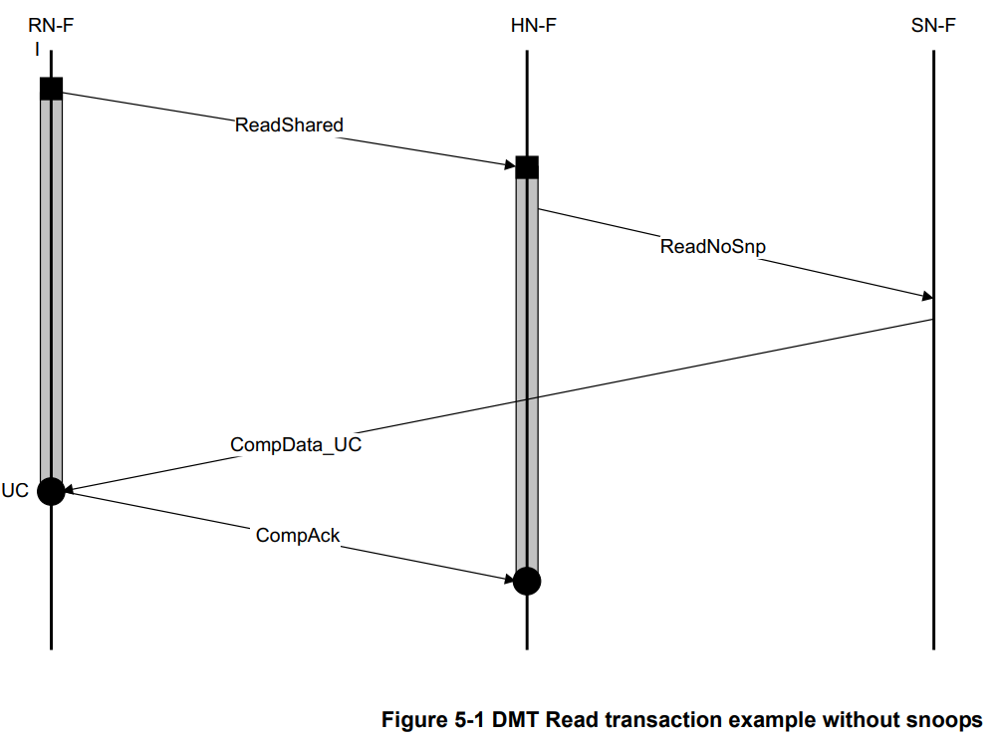

### 带DMT且带Snoop的Read Transaction

此场景中假设RN-F1中不含有RN-F0需要的数据。一般来说，需要compAck，是为了确保一致性。

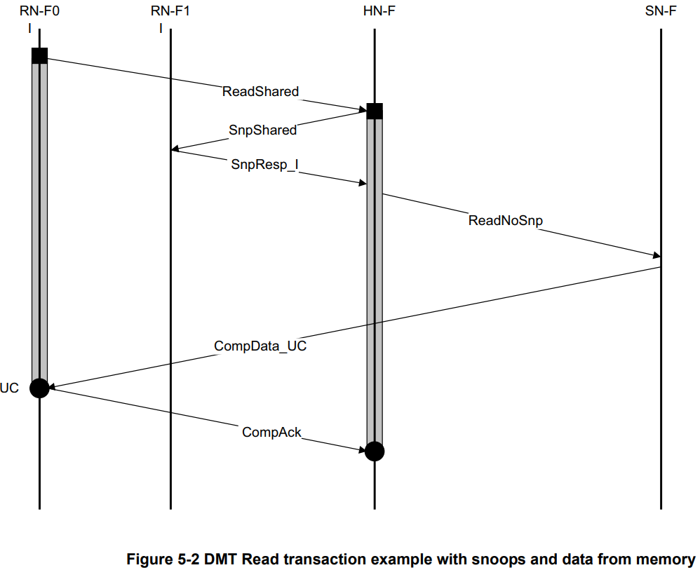

### 带DCT的Read Transaction

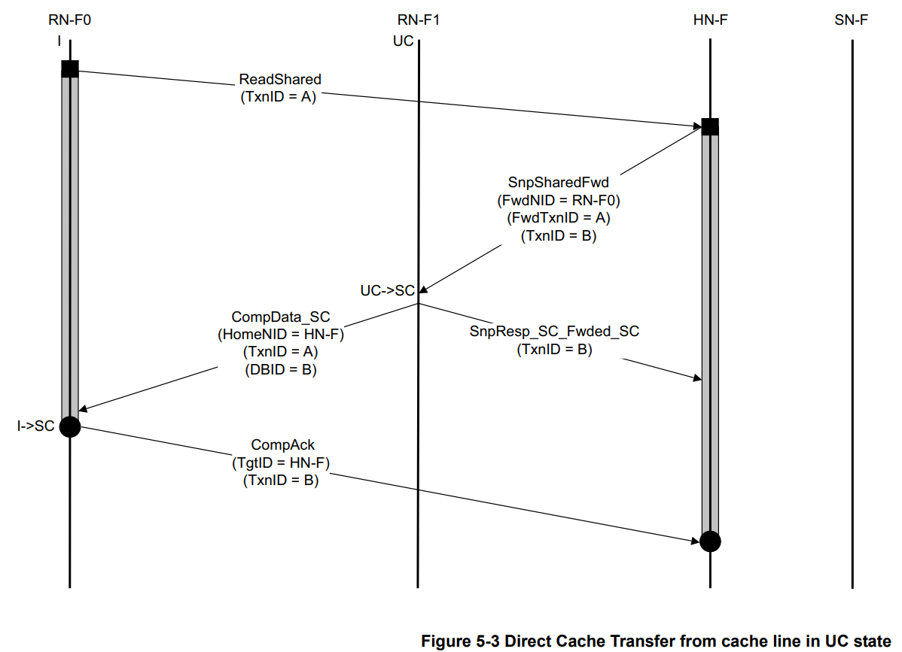

可以思考一个问题：为什么TxnID（RN-F0和HN-F的）和DBID要取成不一样的？如果取成一样的会出错吗？

事实上这个问题问得不准确。三种ID都由其发送方管理，各有其索引对象。RN-F0的TxnID索引的是RN-F0内部的Outstanding队列，HN-F的TxnID索引的是HN-F内部的Tracker（追踪器）条目，HN-F的DBID用于管理HN-F数据缓冲区的回收，表示需不需要相应的RN-F回CompAck。由此，可以理解为：RN-F0发出的TxnID=A的read事务和HN-F发出的TxnID=B的snoop事务属于两个相对独立的事务，发送方自然也能决定使用什么TxnID来发送。

一方面，假如我们强迫HN-F发出的snoop request的TxnID等于RN-F0发出的read request的TxnID，这意味着，RN-F0发起请求时使用的ID，必须正好等于HN-F内部当前可用的Tracker编号。由于HN-F同时管理多个RN-F，不同的RN-F可能会同时发送相同ID的请求，这会导致HN-F内部的ID碰撞，进而导致逻辑错误。

另一方面，由RN-F1发给RN-F0的DBID=B的CompData_UC，可以理解为RN-F1帮HN-F代发。自然，收到该CompData_UC的RN-F0应该CompAck的，就是真正的发送方HN-F，而非代发方RN-F1，因此, DBID=B。

除此之外，可以留意到，无论是不是使用DCT，HN-F要完全finish掉TxnID=B的这个事务，需要至少分两个步骤：1. 所有的相关RN-F回SnpResp，这里面包含无data的RN-F和有data的RN-F。假若是无data的RN-F回复，那向该RN-F发起snp事务的这个TxnID所对应的Tracker就可以马上被释放掉，该事务结束。反之，假若是有data的RN-F回复，则向该RN-F发起snp事务的这个TxnID所对应的Tracker还需要等待compAck才能被释放掉。

### 带DCT且将数据写回SN的Read Transaction

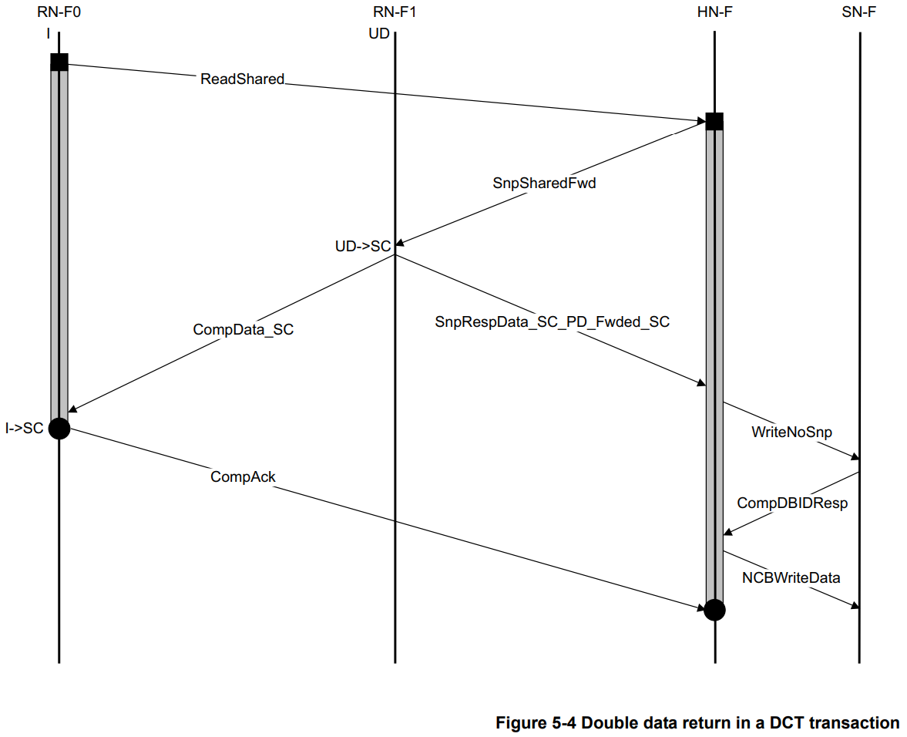

### 不带Snoop的Read Transaction

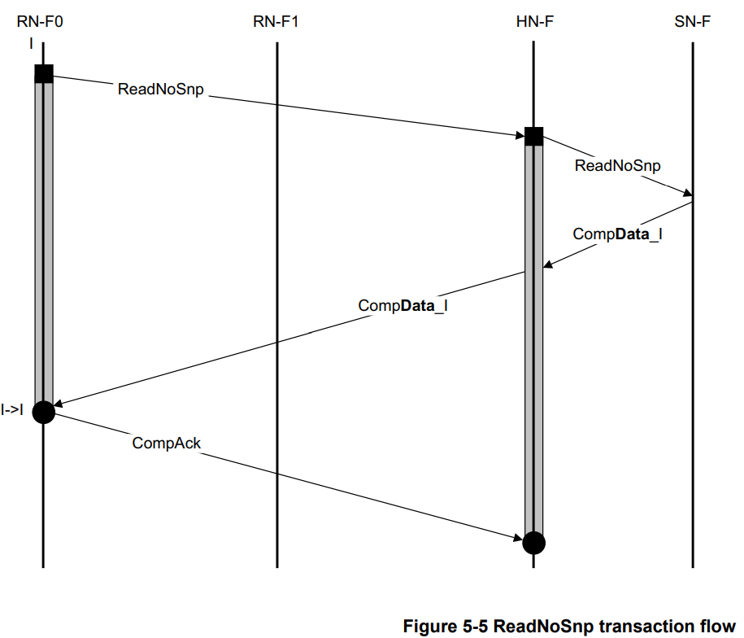

### 带Partial Snoop Response的ReadUnique Transaction

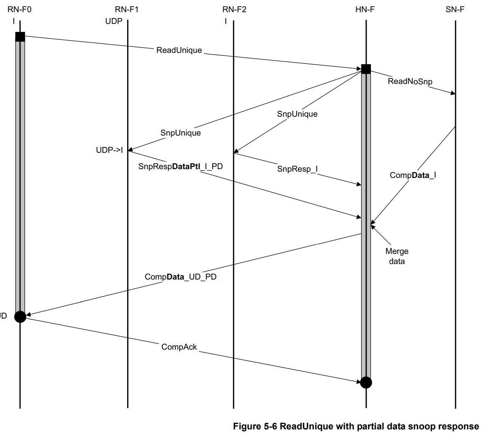

### 带Partial Snoop Response且HN-F负责写回的ReadUnique Transaction

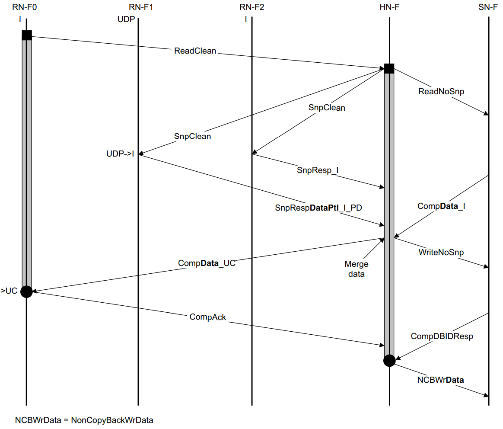

与上一个的区别是，Dirty写回的职责没有被pass给RN-F0，而是由HN-F自己承担写回。这样的话，最终传给RN-F0的就是Unique Clean而不是Unique Dirty的数据。

### 不需要保序且不需要CompAck的Read Transaction

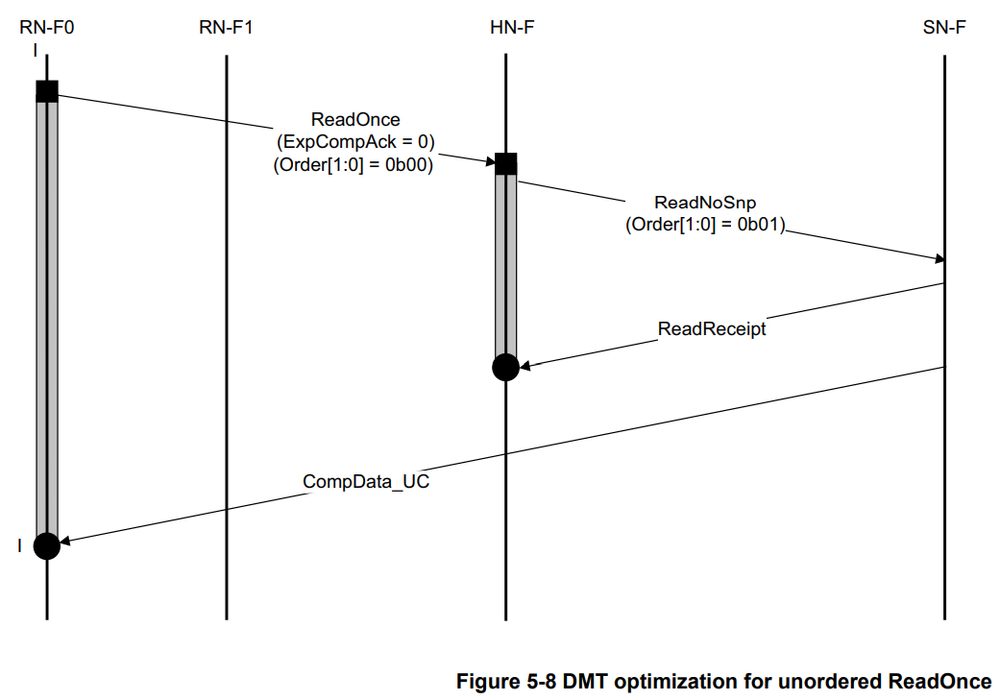

ReadOnce本身不会把cache line保留，所以可以是unordered的（order = 00）。由于是unordered的，可以不用保序，自然也就不需要compAck。由此，HN-F视角下，该事务的生命周期，到收到ReadReceipt就结束了，不需要等RN-F0发回compAck。

可以总结一句话：**凡是不改变 Requester 本地缓存状态（即不涉及从 I 态迁移到 E/S/M 态）的事务，基本上都可以优化为不需要 CompAck**。

### data和Response分离、不要求order的DMT Read Transaction

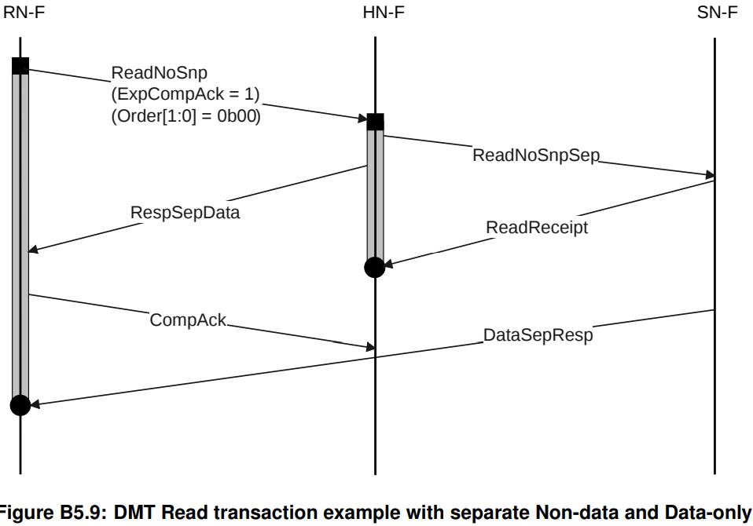

有意思的是，此时HN-F甚至不需要等到收到ReadReceipt，只需要确认已经给SN发出ReadNoSnpSep，就可以给RN返回RespSepData，让RN-F等等后续会到来的DataSepResp DMT。另一方面，compAck此时没有发挥什么作用，因为order=00, HN在收到ReadReceipt之后，Tracker就释放了。

除此之外，可以观察到，RN-F并没有等到收到DataSepResp才返回CompAck，而是早早地在收到RespSepData之后就发出了CompAck，这是因为CompAck早发迟发，反正都不起作用。

### data和Response分离、要求order的DMT Read Transaction

一旦要求 order，几件事情就必须注意了。首先是该事务在HN的生命周期延长了，结束时间从原来的收到SN发来的Read Receipt转变为收到RN来的CompAck。其次是CompAck发出的时机，就需要在收到DataSepResp和RespSepData之后了。

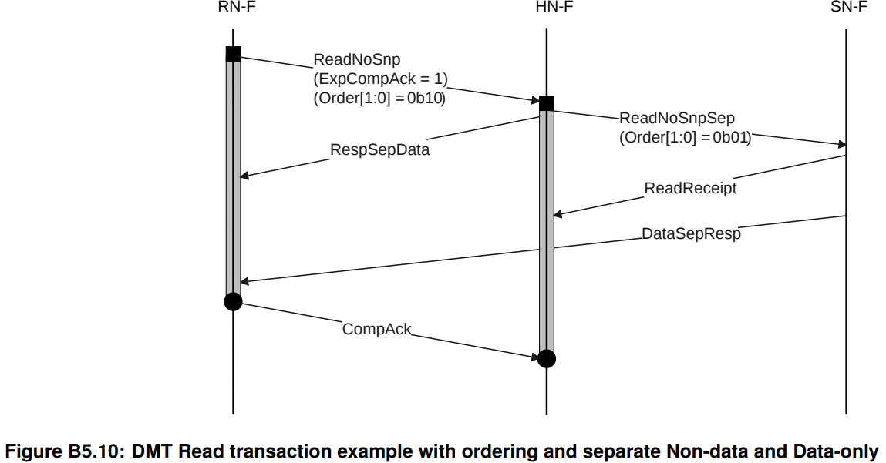

# CHI典型DataLess事务流程

### MakeUnique

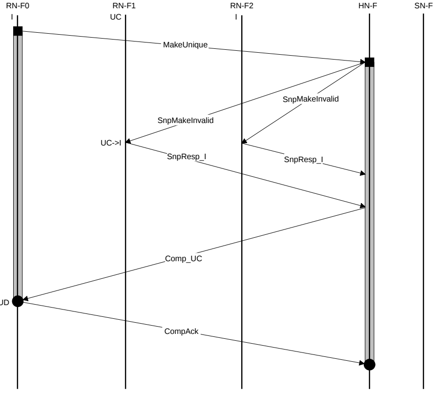

整个事务一目了然，但有一点值得注意，即：虽然RN-F1中cache line state是UC，且HN-F向RN-F0返回的事务也是Comp_UC,但是最终RN-F0中的cache line state是UD。这是因为，MakeUnique事务本身的目的就是后续要修改这一行，要是先跳到UC再跳到UD会增加逻辑冗余。

### CleanUnique

与MakeUnique不同，CleanUnique涉及到写回，且Requester的终态是UC。

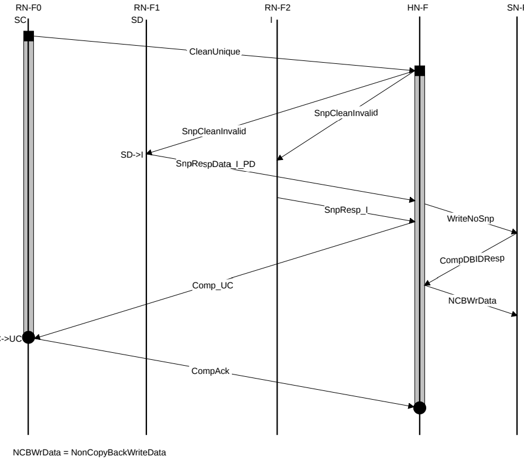

### CleanSharedPersistSep (一种CMO操作)

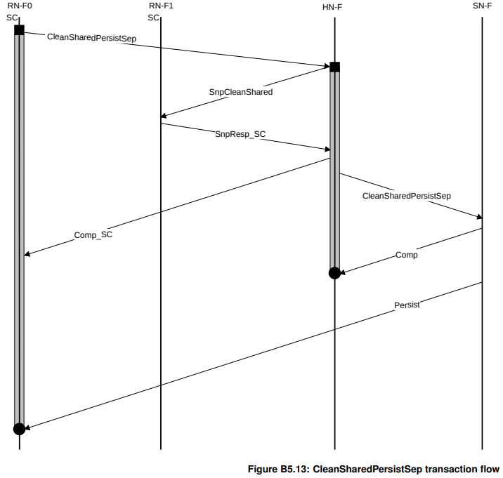

Persist关键字表明要求dirty的副本必须写回所谓Point of Persistence (PoP)，一旦数据到达这里，即便系统**掉电（Power Failure）**，数据也不会丢失。

因此该事务中，RN-F0中该事务的生命周期一直到Persist收到为止。

### Evict

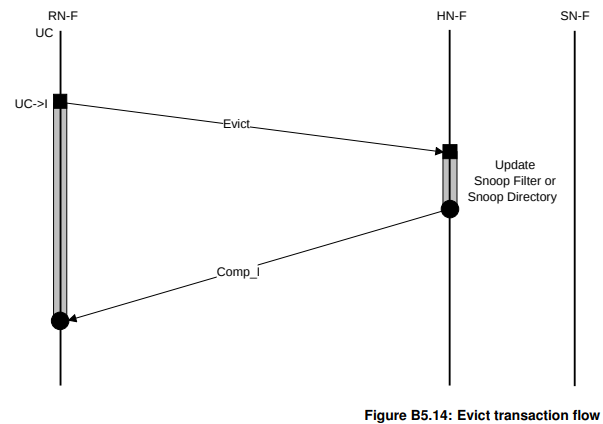

需要注意，Evict事务发出之前，RN-F需要确保自己的状态已经变成I。另外，Evict事务的用途是hint而非强制HN-F更新Snoop Fliter或Snoop Directory，所以Snoop Fliter/Directory中表明某个RN-F拥有某个缓存行的副本并不意味着该缓存行真的拥有该缓存行的副本。

# CHI典型Write事务流程

### WriteNoSnp（最简单流程，无snoop和seperate response）

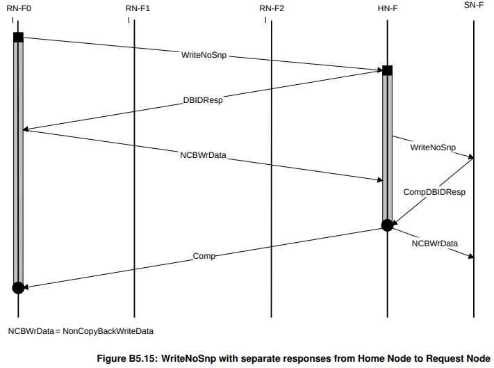

需要注意，HN向SN发WriteNoSnp，只要在收到RN-F0发来的WriteNoSnp并且回DBIDResp之后就可以，不需要等到NCBWrData真的到达。因为WriteNoSnp只是在给SN申请个DBID，不涉及到真正的数据。

### WriteUniquePtl (需要snoop和separate responses)

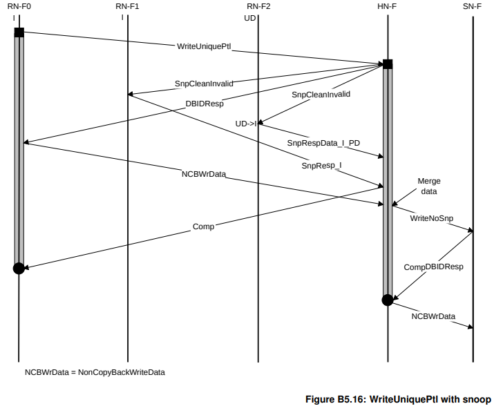

回忆一下，WriteUnique的意思是直接把数据推出去，自身不保留副本，且要求其他的RN也不能保留数据。

### WriteBackFull

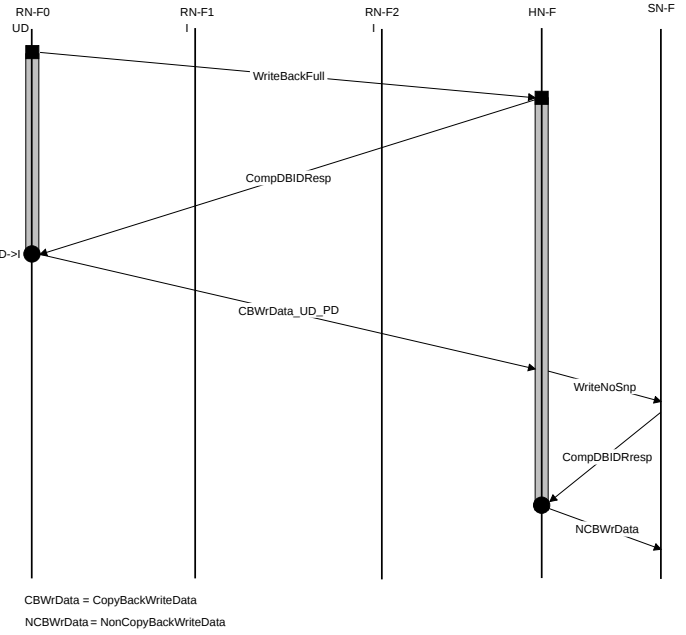

这里涉及到CopyBack和Non-CopyBack的差别。CopyBack和Non-CopyBack是CHI写操作的两大基本分类。

简单来说，CopyBack 是“自家缓存的搬运工”，专门用于将 **Cache 中的数据**写回（Write back）到下一级缓存或内存中。本质上是一种权限转移，不需要snoop，包含的具体指令包括WriteBackFull, WriteCleanFull, WriteEvictFull等，主要用于Cache的替换算法或软件显式的刷缓存操作。

而 Non-CopyBack 是“对外部目标的读写请求”，它们更像是传统的“写命令”。因此，Non-CopyBack可能触发Snoop。（这里的“可能”是指：如果写的是一致性内存（如 `WriteUnique`），HN 可能需要去失效（Invalidate）其他 Agent 里的副本。如果写的是Non-Cacheable的Device内存，就不用）。包含的具体指令比如WriteUnique, WriteNoSnp

由此可以清晰知道图中CBWrData和NVBWrData的区别。

# CHI典型Atomic事务流程

### AtomicLoad/AtomicCompare/AtomicSwap

这三者的共同特征是最后需要把initalData读回来，有一个return data的过程。

根据是否需要snoop，分成以下两张图。

需要snoop的：

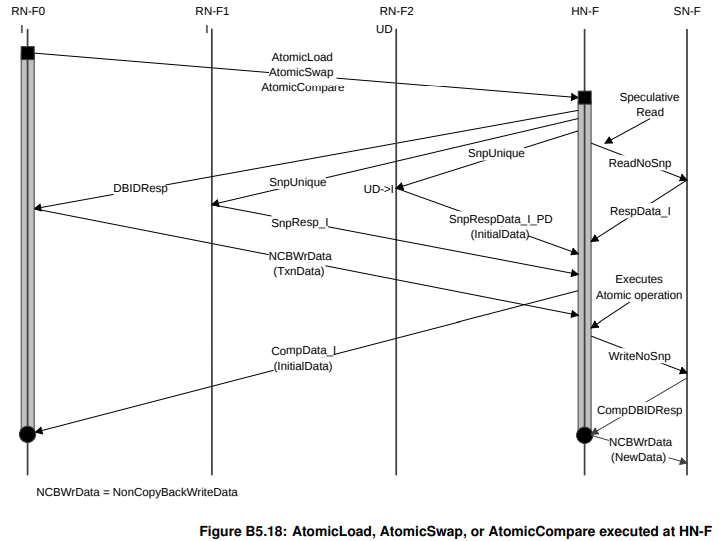

这里Speculative read是为了防止snoop没找到数据，因此提前从memory预取。另外可见，这里的Atomic operation是在HN进行的。

下图是不需要snoop的版本，更为简易：

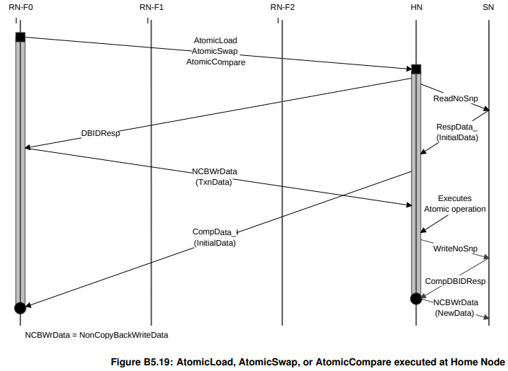

### AtomicStore

这个原子操作不需要initial data的return，因此不需要speculative read，也只需要向RN返回Comp，不需要返回CompData

需要snoop的版本：

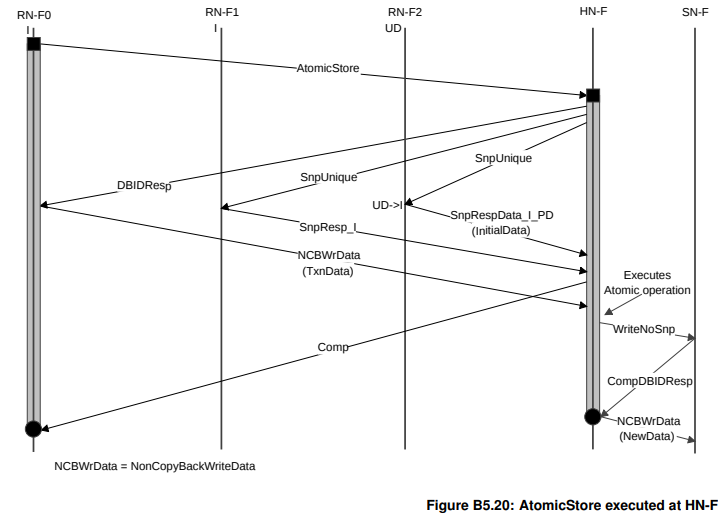

不需要snoop的版本：（因为不需要snoop，所以DBIDResp发回去之后立马就可以发出Comp了）

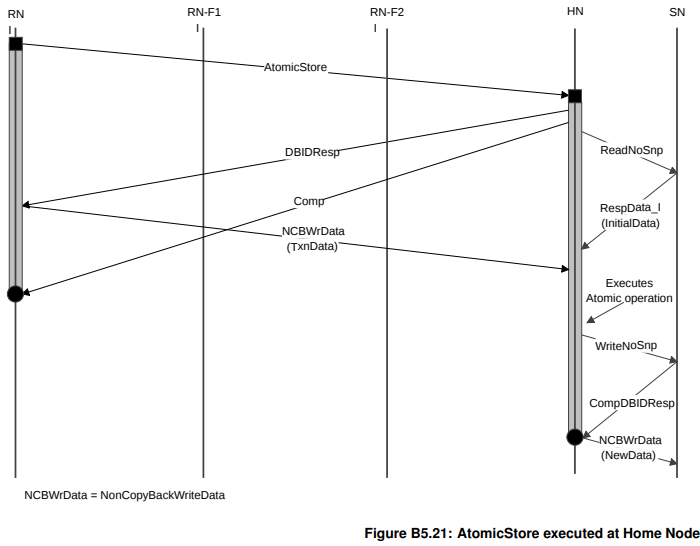

### 在SN进行Atomic Operation的场景

除了在HN进行Atomic Operation（如上面的场景），还可以更激进，在SN(比如某些memory controller)进行Atomic Operation。

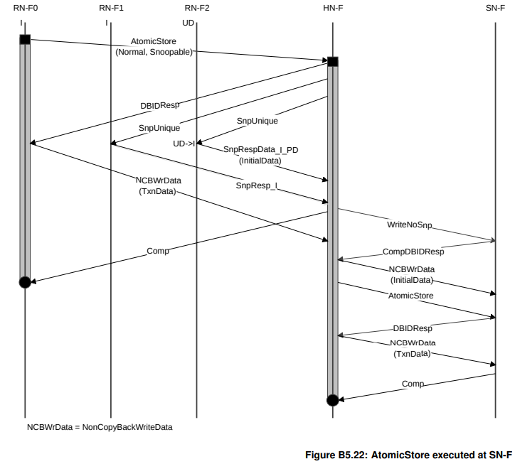

因为Atomic Operation同时需要Initial Data和TxnData，因此HN-F会向SN发起两个写，一个WriteNoSnp用来写回snoop到的initialData，一个AtomicStore用来写RN传过来的TxnData。

# CHI典型Stash事务流程

介绍了两种，StashUniqueFullStash和StashOnceShared

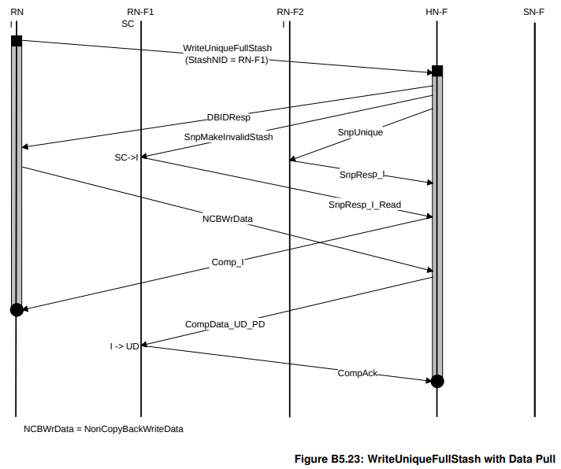

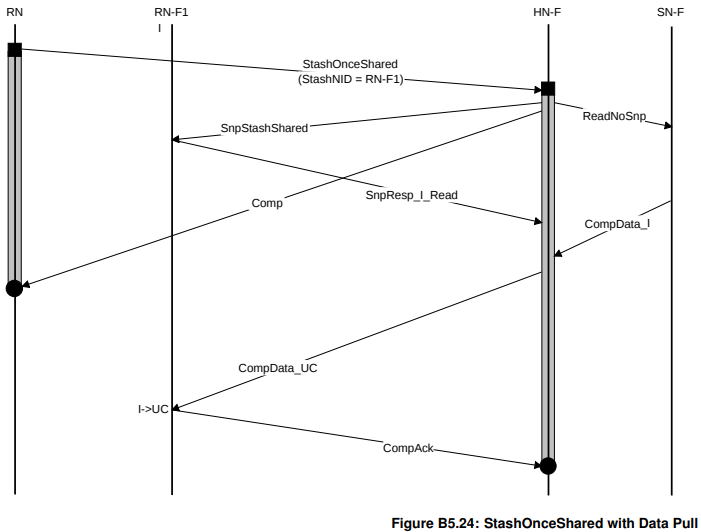

stash对于HN来说都是hint，上述两个事务的区别在于，

WriteUniqueFullStash是一个写事务，发起者是有数据的，且想要把这个数据推给另外一个RN。HN-F会把收到的Data Pull当成ReadUnique。

而StashOnceShared是一个DataLess事务，发起者并没有数据，但他建议HN把数据以Shared的形式给到另外一个RN。HN-F会把收到的Data Pull当成ReadNotSharedDirty。

因此可以看到，StashOnceShared有与SN的交互，但是WriteUniqueFullStash没有。

如果你是**生产者**，刚刚算好了数据，想给下一个环节的人用，用 **`WriteUniqueFullStash`**。这能保证对方拿到的是最新的，且你是唯一的修改者。

如果你是**调度者**，发现有一段公用代码或只读数据需要被多个核心访问，用 **`StashOnceShared`**。这能减少对方读取时的 Miss 延迟，又不会干扰到其他已经缓存了该数据的核心。

