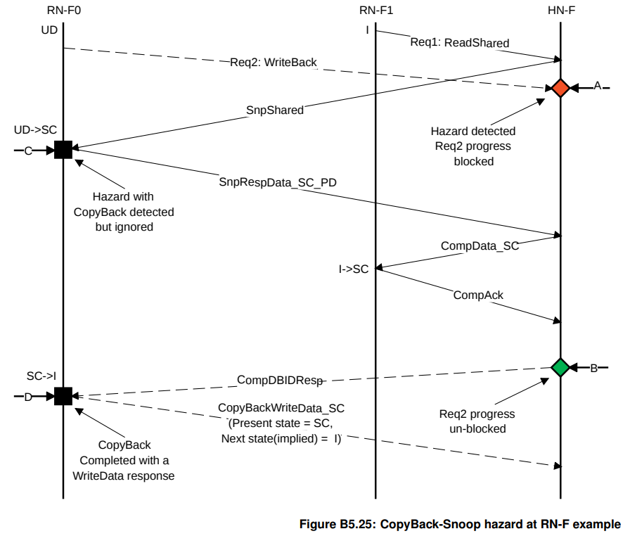
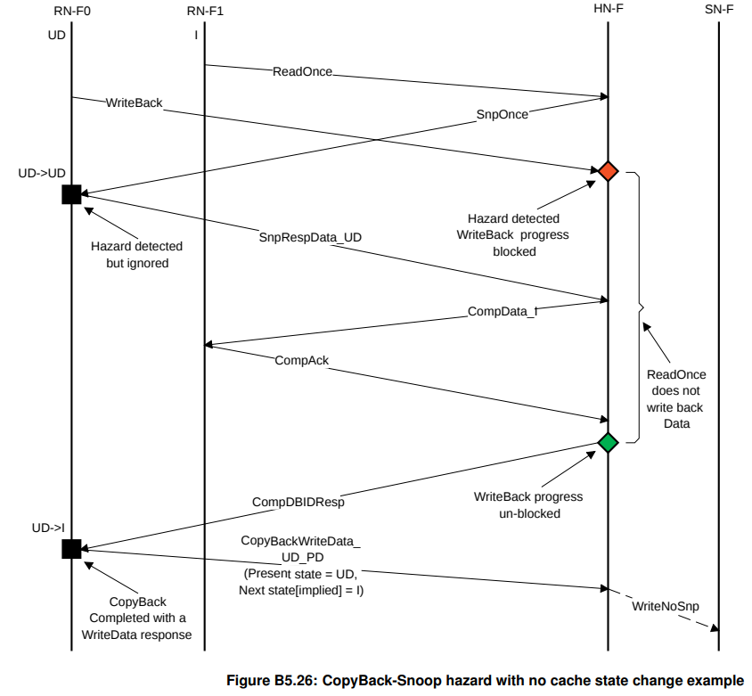
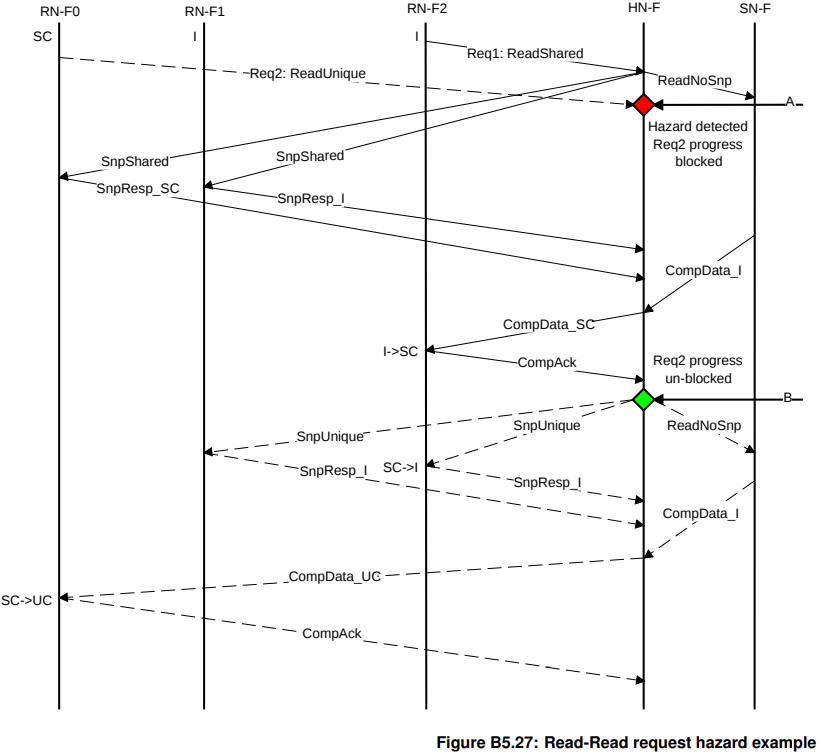

# CHI竞态处理

CHI的竞态处理原则规定了，当多个请求指向同一个地址时，硬件如何处理。

可以分为RN-F（发起请求的节点）和HN-F（负责协调和排序的中心节点）两个主体来理解：

### 1. 在 RN-F 节点的操作规范

当 RN-F 发出了一个请求（如读数据），但在等待结果期间收到了针对同一地址的 **Snoop（侦听）** 时，处理规则如下：

- **如果数据还没回来：**
  - 必须**立即处理** Snoop，不能等自己的请求完成。
  - 按照正常的缓存一致性协议转换状态（比如从独占变为共享），并将数据返回给 Home 节点。
- **如果数据已经开始回来（收到了部分 Data）：**
  - **必须等待：** RN-F 必须等到该请求的所有数据包（Data Packets）都收齐了，才能回复这个 Snoop。
  - 这是为了保证数据的一致性，防止在数据传输中途改变状态导致逻辑错误。
- **针对 CopyBack（写回）请求的特殊要求：**
  - 如果在写回数据时收到了 Snoop，最终发给 HN-F 的 `CompAck` 或写回数据包中的**状态信息**，必须反映出 **Snoop 处理完之后** 的最新状态。
  - **关键点：** 如果 Snoop 把你的缓存行无效（Invalid）了，哪怕你原本要写回脏数据，最后发出的写回包里 BE（Byte Enable）位也要设为 0，表示这笔数据不再有效。

------

### 2. 在 HN-F 节点的操作规范 

HN-F 是整个系统的“交警”，负责对所有指向同一地址的交易进行**排序（Ordering）**。

- **串行化处理：** 对于同一个 Snoopee（被侦听者），HN-F 必须收到上一个 Snoop 的响应，才能发下一个针对同一地址的 Snoop。
- **发送响应的限制：** 当 HN-F 正在等待一个 Snoop 响应时，它**严禁**向该地址发送大部分响应。只允许发送 `RetryAck`（告知重试）、`ReadReceipt`（读收条）或 `DBIDResp`（允许发数据）等非完成类的控制信号。
- **互斥保护（关键）：** 一旦 HN-F 发出了 `Comp`（完成信号），它必须等到以下信号之一返回，才能对该地址发起新的 Snoop：
  - `CompAck`：确认收到完成信号。
  - `CopyBackWriteData`：写回的数据已到达。
  - `WriteData`：写数据已到达。

> **这保证了“握手”的完整性：** 只有确认前一笔交易彻底在 RN-F 端“落袋安安”了，HN-F 才能开启下一轮的侦听。


可以问自己几个简单的问题：

1. 为什么 RN-F 在没收到数据时必须处理 Snoop？（答：防止协议层级依赖导致的循环等待）。
2. 为什么收到部分数据后必须等收全了才能回 Snoop？（答：CHI 是多 beat 传输，必须保证原子性，防止中间态数据被侦听走导致数据损坏）。
3. CopyBack 流程中遇到 Snoop 怎么办？（答：以 Snoop 后的状态为准，更新 `CompAck` 的状态位，因为Snoop 的优先级在协议语义上高于正在进行的自发请求）。


协议的B5.6提供了两个处理Address Hazard的事务流程，可供参考。

首先是HN-F在处理ReadShared过程中收到WriteBack。



必须等到ReadShared完成后，HN才能放行WriteBack。而且最终WriteBack传给HN-F的状态是snoop之后的SC而非UD


下个例子描述的是在HN处理ReadOnce过程中，来了WriteBack。一样的，WriteBack会被blocked.与上个图不同的是，因为是ReadOnce，所以不会改变RN-F0的状态。




下面这个ReadUnique在ReadShared过程中到达的例子，我看不出来违反一致性会导致什么后果，但作为CHI特色的先来后到顺序一致性范例，也可供参考



一般来说，在HN-F给RN-F发Comp之后，RN-F就可以把自己的对应缓存行evict掉，再给HN-F发新的对于同一地址的request了。但是还是一样的，这些新的request需要等到HN-F收到上一笔对于这个地址的CompAck之后，才能被处理。


### 建模中的实际竞态问题

##### 单核逻辑与Sharer List混乱

现象：在setOwner时，遇到以下的assert报错：

```
action(setOwner, "sO", desc="Set the owner") {
    assert(getDirectoryEntry(address).Sharers.count() == 0); // 关键：设为 Owner 前必须没人在共享
    ...
}
```

原因是： 在 Directory 发送失效（Inv）消息给所有 Sharer 时，忘记去处理“请求者本人也在 Sharer 列表里”的情况。

当一个 CPU 想要从 **Shared (S)** 升级到 **Modified (M)** 时，它必须确保账本上其他的“借阅者”全部被注销（Invalidate）。

解决办法：将Owner从Sharers列表移除。


##### 死锁（Deadlock）与端口优先级

现象：系统运行到一半卡死，报错 `panic: Deadlock detected`。（gem5 为每个控制器（Controller）维护了一个时间戳，记录该节点上一次**成功处理事务**的时间。每当一个控制器从输入队列（Message Buffer）中取出一条消息并成功执行了一个 Action（比如状态转换、发送回包），它就会更新 `last_progress_time = current_time`。gem5 有一个全局配置参数（通常是 `deadlock_threshold`，默认可能是 50,000 个周期）。$$Current\_Time - Last\_Progress\_Time > Threshold \implies \text{Deadlock!}$$ 假如在整整 50,000 个时钟周期内，编号为 0 的处理器**没有任何一笔交易完成**。它可能卡在等待某个永远不会回来的 Ack，或者卡在了输入缓冲区满导致的阻塞上。也就是Deadlock。）

问题根源：**循环依赖（Circular Dependence）**。在 Directory 节点中，消息输入的优先级顺序（in_ports）设置错误。将request的优先级置于response之前。导致内存数据包（Memory packet）因为请求队列（Request queue）满了而发不出来，而请求队列又在等内存释放资源。

解决方法：将顺序改为 `memory > response > request`。在底层互联设计中，**响应（Response）和内存回包通常拥有更高优先级**，以确保正在进行的交易能“收尾”，从而释放资源给新请求。

需要注意，死锁是“陈年旧账”。当 gem5 报出死锁时，案发现场通常是在几万个周期之前：

**因：** 5000 周期时，一个 Response 包因为优先级低，被堵在了一个满载的 Request 队列后面。

**果：** 5500 周期以后，所有后续请求都因为这个 Response 没出队列而全部瘫痪。

**报：** 直到 55000 周期，计数器终于爆了，gem5 才告诉你“死锁了”。

如何通过Log逆推死锁原因：观察 Replacement（替换）循环：  log 中出现了大量的 `L1Cache Replacement SM_A > SM_A`。这通常意味着：Cache 想腾出空间（Replacement），要把旧数据刷回 Directory。但 Directory 此时可能正忙于处理该地址的其他请求，或者 Directory 的缓冲区满了。Cache 无法完成替换，就无法接收新数据，CPU 就会一直卡在流水线后端等待。


##### 多核下的竞态条件（Race Conditions）

**现象：** 增加到 2 个 CPU 后，出现 `Unexpected message type` 和 `Invalid transition`。

- **核心痛点：Acks（确认包）计数的时序问题。**

- 问题描述： 1.  当一个核请求从 $S \to M$ 时，Directory 会告诉它：“你需要收到 $N$ 个 InvAck 才能开工”。

  \2.  竞态发生： 某些 L1 Cache 动作极快，在 Directory 的“总数通知”还没到达请求者时，InvAck 已经先飞到了请求者手里。

- **解决方法：** * **允许 Acks 临时为负数：** 这是一个非常精妙的设计。请求者先记录收到的 InvAck（`Acks--`，变成 -1, -2...），等 Directory 的通知到了以后，再加上总数。如果结果等于 0，说明全部收齐。

  - 这反映了片上互联的**非确定性延迟**：消息到达的顺序不一定等于发送的顺序。


##### 写回与侦听冲突 (PutM vs. Snoop/Forward)

这是分布式一致性协议中最常见的竞态。

- **场景描述：** 1.  **核 A** 拥有某行数据的 Modified (M) 权限，因为它长时间没用，决定执行 **PutM**（写回并释放权限）。 2.  与此同时，**核 B** 发起了一个 **GetS**（读请求）到达了 Directory。 3.  **Directory** 看到记录说“所有者是 A”，于是发出了一个 **Forward/Snoop** 侦听给 A，要求其把数据给 B。
- **竞态爆发：** * 此时，核 A 发出的 **PutM** 和 Directory 发出的 **Snoop** 在互联网络中“擦肩而过”。
  - **核 A 的视角：** “我已经不要这行数据了，协议栈应该处于 I (Invalid) 或者正在转往 I 的路上，为什么还会收到侦听？”
  - **核 B 的视角：** “我等了很久，Directory 还没把数据给我。”
- **设计挑战：** 如果你在 SLICC 状态机里没写 `M_I`（从 M 转往 I 的中间态）处理 Snoop 的逻辑，gem5 就会报 `Invalid Transition`。
- SLICC 中的解决之道：在 `MSI-cache.sm` 中，你不能在 `MI_A` 状态下忽略这个 Snoop，否则会死锁。核 A 意识到自己已经发了 `PutM`，所以它处理 Snoop 时，**不再直接回数据给 Directory**（因为 `PutM` 里已经带了数据），而是发一个特殊的 `SnoopAck` 告诉 Directory：“数据我已经通过 `PutM` 发给你了，你自己查收，我不要了。”由此，核 A 从 `MI_A` 变为 `II_A`（双重待确认状态），直到收到 Directory 对 `PutM` 的确认。